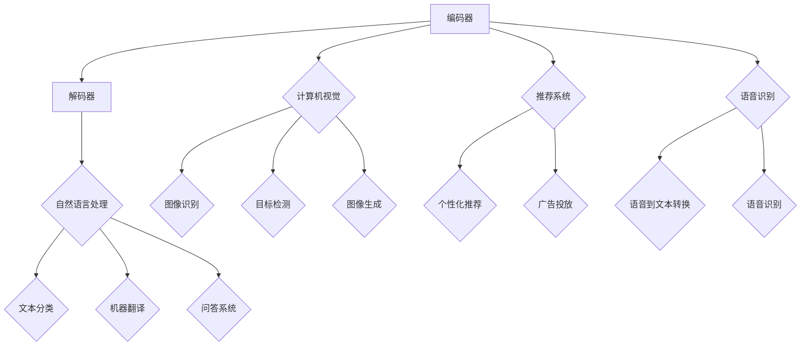

                 

关键词：创业公司、大模型应用、人工智能、技术挑战、商业机会

>摘要：本文将探讨创业公司在大模型应用中的机会与挑战。我们将分析大模型在创业公司的潜在影响，讨论所需的技术能力、资源投入和面临的问题，并提供一些建议，帮助创业公司有效地利用大模型技术，实现业务增长和创新。

## 1. 背景介绍

在过去的几年里，人工智能（AI）技术取得了飞速发展，尤其是深度学习领域。大模型，如GPT-3、BERT等，凭借其强大的计算能力和数据处理能力，已经广泛应用于自然语言处理、计算机视觉、推荐系统等多个领域。这些大模型的训练和部署不仅需要大量的数据和高性能计算资源，还涉及复杂的算法和优化技巧。

对于创业公司来说，大模型的应用既是一个机会，也是一个挑战。一方面，大模型可以帮助创业公司快速实现业务创新，提升产品竞争力；另一方面，大模型的高门槛也让许多创业公司望而却步。本文将深入探讨创业公司在大模型应用中的机会与挑战，并提供一些建议。

## 2. 核心概念与联系

### 大模型的概念

大模型是指具有数十亿甚至数万亿参数的深度学习模型。这些模型通常由多个神经网络层组成，可以处理大规模的数据集。大模型的典型代表包括GPT-3、BERT、T5等。

### 大模型的架构

大模型的架构通常包括编码器和解码器。编码器用于将输入数据（如文本、图像等）转换为固定长度的向量表示，解码器则用于从编码器输出的向量中生成输出（如文本、标签等）。

### 大模型的联系

大模型的应用场景非常广泛，包括但不限于：

- **自然语言处理**：文本分类、机器翻译、问答系统等。
- **计算机视觉**：图像识别、目标检测、图像生成等。
- **推荐系统**：个性化推荐、广告投放等。
- **语音识别**：语音到文本转换、语音识别等。

以下是使用Mermaid绘制的简化的Mermaid流程图，展示了大模型的架构与主要应用领域的联系：



## 3. 核心算法原理 & 具体操作步骤

### 3.1 算法原理概述

大模型的训练过程通常包括以下几个步骤：

1. **数据预处理**：收集和整理数据，进行数据清洗和预处理。
2. **模型初始化**：初始化模型参数，通常使用随机初始化或预训练模型。
3. **前向传播**：将输入数据输入模型，计算输出。
4. **反向传播**：计算模型输出与实际输出之间的差异，更新模型参数。
5. **评估与优化**：评估模型性能，调整模型参数，优化模型。

### 3.2 算法步骤详解

#### 数据预处理

1. **数据收集**：从不同的数据源收集数据。
2. **数据清洗**：去除重复数据、缺失数据和噪声数据。
3. **数据标注**：为数据添加标签，以便模型进行训练。
4. **数据转换**：将数据转换为模型可以接受的格式。

#### 模型初始化

1. **参数初始化**：初始化模型参数，通常使用随机初始化或预训练模型。
2. **权重初始化**：为每个权重分配一个随机值，以避免梯度消失或爆炸。

#### 前向传播

1. **输入数据**：将输入数据输入模型。
2. **计算输出**：通过模型的编码器和解码器，计算输出。

#### 反向传播

1. **计算误差**：计算模型输出与实际输出之间的差异。
2. **更新参数**：使用梯度下降等优化算法，更新模型参数。

#### 评估与优化

1. **模型评估**：使用验证集或测试集评估模型性能。
2. **模型优化**：根据评估结果，调整模型参数，优化模型。

### 3.3 算法优缺点

#### 优点

- **强大的数据处理能力**：大模型可以处理大规模的数据集，提高模型的泛化能力。
- **高效的预测能力**：大模型通常具有更高的预测准确性和效率。
- **广泛的应用场景**：大模型可以应用于多个领域，如自然语言处理、计算机视觉、推荐系统等。

#### 缺点

- **高计算成本**：大模型需要大量的计算资源，包括GPU、TPU等。
- **数据隐私问题**：大模型在训练过程中可能涉及敏感数据的处理，需要关注数据隐私问题。
- **模型可解释性差**：大模型的黑盒性质导致其可解释性较差，不利于调试和优化。

### 3.4 算法应用领域

大模型的应用领域非常广泛，主要包括：

- **自然语言处理**：文本分类、机器翻译、问答系统等。
- **计算机视觉**：图像识别、目标检测、图像生成等。
- **推荐系统**：个性化推荐、广告投放等。
- **语音识别**：语音到文本转换、语音识别等。

## 4. 数学模型和公式 & 详细讲解 & 举例说明

### 4.1 数学模型构建

大模型的数学模型通常包括以下几个部分：

1. **输入层**：接收外部输入，如文本、图像等。
2. **隐藏层**：进行特征提取和变换。
3. **输出层**：生成预测结果。

### 4.2 公式推导过程

以一个简单的神经网络为例，其数学模型可以表示为：

$$
Y = \sigma(W \cdot X + b)
$$

其中，$Y$ 表示输出，$X$ 表示输入，$W$ 表示权重，$b$ 表示偏置，$\sigma$ 表示激活函数。

### 4.3 案例分析与讲解

#### 案例一：文本分类

假设我们有一个文本分类问题，需要判断一段文本属于哪个类别。我们可以使用一个基于神经网络的文本分类器。

1. **数据预处理**：将文本数据转换为词向量。
2. **模型训练**：使用训练数据训练神经网络模型。
3. **模型评估**：使用测试数据评估模型性能。

#### 案例二：图像识别

假设我们有一个图像识别问题，需要识别图像中的物体。我们可以使用一个基于卷积神经网络的图像识别模型。

1. **数据预处理**：将图像数据转换为固定尺寸。
2. **模型训练**：使用训练数据训练卷积神经网络模型。
3. **模型评估**：使用测试数据评估模型性能。

## 5. 项目实践：代码实例和详细解释说明

### 5.1 开发环境搭建

为了运行大模型，我们需要搭建一个强大的开发环境。以下是一个基本的开发环境搭建步骤：

1. **硬件环境**：准备一台高性能的计算机，如GPU服务器，用于模型训练和推理。
2. **软件环境**：安装Python、TensorFlow或其他深度学习框架。

### 5.2 源代码详细实现

以下是一个简单的基于TensorFlow的文本分类模型的源代码实现：

```python
import tensorflow as tf
from tensorflow.keras.preprocessing.sequence import pad_sequences
from tensorflow.keras.layers import Embedding, LSTM, Dense
from tensorflow.keras.models import Sequential

# 加载数据
x_train, y_train = load_data()

# 数据预处理
x_train = pad_sequences(x_train, maxlen=100)

# 构建模型
model = Sequential()
model.add(Embedding(input_dim=vocab_size, output_dim=128))
model.add(LSTM(units=128))
model.add(Dense(units=num_classes, activation='softmax'))

# 编译模型
model.compile(optimizer='adam', loss='categorical_crossentropy', metrics=['accuracy'])

# 训练模型
model.fit(x_train, y_train, epochs=10, batch_size=32)
```

### 5.3 代码解读与分析

以上代码实现了一个简单的文本分类模型，包括以下步骤：

1. **加载数据**：从数据集中加载训练数据和标签。
2. **数据预处理**：将文本数据转换为固定长度的序列。
3. **构建模型**：使用Sequential模型构建一个简单的神经网络。
4. **编译模型**：设置优化器、损失函数和评估指标。
5. **训练模型**：使用训练数据进行模型训练。

### 5.4 运行结果展示

以下是一个简单的运行结果示例：

```python
# 评估模型
loss, accuracy = model.evaluate(x_test, y_test)

# 输出结果
print("Test loss:", loss)
print("Test accuracy:", accuracy)
```

## 6. 实际应用场景

大模型在创业公司中的实际应用场景非常广泛，以下是一些典型的应用场景：

1. **智能客服**：使用自然语言处理大模型构建智能客服系统，提供高效、准确的客户服务。
2. **内容审核**：使用计算机视觉大模型对平台上的内容进行自动审核，识别违规内容。
3. **个性化推荐**：使用推荐系统大模型为用户推荐感兴趣的内容，提升用户粘性。
4. **语音助手**：使用语音识别大模型构建智能语音助手，提供语音交互功能。

## 7. 工具和资源推荐

为了帮助创业公司更好地应用大模型技术，以下是一些建议的工具和资源：

1. **学习资源**：推荐阅读《深度学习》（Goodfellow, Bengio, Courville 著）、《动手学深度学习》（A. G. Montavon 等著）等经典教材。
2. **开发工具**：推荐使用TensorFlow、PyTorch等深度学习框架进行模型开发。
3. **相关论文**：推荐阅读《GPT-3: Language Models are Few-Shot Learners》（Brown et al., 2020）等前沿论文。

## 8. 总结：未来发展趋势与挑战

大模型在创业公司中的应用具有广阔的前景。然而，随着技术的不断发展，创业公司也将面临一系列挑战：

1. **技术挑战**：如何有效地训练和部署大模型，如何保证模型的可解释性和可解释性？
2. **资源挑战**：如何获取和利用高性能计算资源，如何平衡训练和推理的成本？
3. **数据挑战**：如何确保数据的质量和隐私，如何应对数据稀疏和标签错误的问题？

未来，创业公司需要不断探索和创新，充分利用大模型技术，实现业务增长和创新。

## 9. 附录：常见问题与解答

1. **Q：大模型训练需要多少计算资源？**
   **A：** 大模型训练通常需要大量的计算资源，包括GPU、TPU等。具体的资源需求取决于模型的规模和训练数据的大小。

2. **Q：如何选择合适的大模型？**
   **A：** 选择合适的大模型需要考虑应用场景、数据规模和计算资源等因素。可以通过阅读相关论文和参考现有解决方案来选择。

3. **Q：大模型如何处理数据隐私问题？**
   **A：** 大模型在处理数据时需要遵循隐私保护原则，如数据匿名化、数据加密等。同时，可以考虑使用联邦学习等技术来保护用户隐私。

作者：禅与计算机程序设计艺术 / Zen and the Art of Computer Programming
----------------------------------------------------------------
这篇文章详细探讨了创业公司在大模型应用中的机会与挑战，包括核心概念、算法原理、数学模型、项目实践、实际应用场景、工具和资源推荐以及未来发展趋势与挑战。通过这篇文章，希望读者能够对大模型在创业公司中的应用有一个全面和深入的了解。

