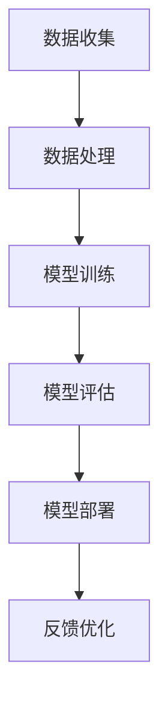
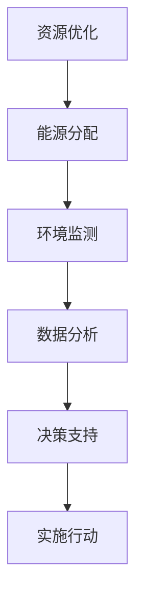

                 

关键词：人工智能、计算技术、未来、积极影响、可持续发展、技术进步

> 摘要：本文深入探讨了计算技术对人类社会的积极影响，特别是人工智能和可持续发展方面的贡献。通过分析核心概念和算法原理，结合数学模型和实际案例，本文展示了计算技术在改善生活质量和推动社会进步方面的重要作用。同时，本文还对未来发展趋势和挑战进行了展望，为读者提供了一个全面而深刻的视角。

## 1. 背景介绍

在21世纪，计算技术已经成为了推动社会发展的核心动力。从大数据分析到人工智能，计算技术的进步正在深刻地改变着我们的生活方式。随着计算能力的提升，我们能够解决更复杂的问题，处理更多的数据，创造更加智能化的解决方案。

人工智能作为计算技术的重要组成部分，其发展已经引起了全球的关注。通过机器学习和深度学习算法，人工智能系统能够从数据中学习并做出决策，从而极大地提高了生产效率和生活质量。例如，自动驾驶汽车、智能家居和智能医疗等领域，人工智能的应用正在不断扩展。

另一方面，可持续发展成为了全球关注的焦点。计算技术在这个过程中扮演着重要的角色，通过优化资源利用、减少能源消耗和改善环境监测，计算技术为可持续发展提供了新的思路和解决方案。

## 2. 核心概念与联系

### 2.1 计算技术与人工智能

计算技术与人工智能密切相关。人工智能依赖于计算技术提供强大的计算能力和数据资源。在人工智能的架构中，算法是核心，而算法的实现又依赖于计算平台的性能。例如，深度学习算法需要大量的计算资源来训练模型，而高性能计算平台如GPU和TPU能够极大地提高训练速度。

下面是人工智能计算架构的Mermaid流程图：



### 2.2 计算技术与可持续发展

计算技术在可持续发展中发挥着重要作用。通过优化资源利用和改善环境监测，计算技术为可持续发展提供了新的思路和解决方案。例如，智能电网系统通过计算技术实现了更高效的能源分配，减少了能源浪费。同时，环境监测系统利用传感器和网络技术，实时收集环境数据，为环境保护提供了科学依据。

下面是可持续发展计算架构的Mermaid流程图：



## 3. 核心算法原理 & 具体操作步骤

### 3.1 算法原理概述

人工智能的核心算法包括机器学习、深度学习和强化学习。其中，机器学习算法通过数据学习模型参数，实现数据的分类和回归任务；深度学习算法通过多层神经网络实现复杂函数的建模；强化学习算法则通过与环境互动，学习最优策略。

在可持续发展方面，优化算法和模拟算法是核心。优化算法通过数学优化方法，寻找资源利用的最优解；模拟算法则通过模拟环境，预测系统行为，为决策提供依据。

### 3.2 算法步骤详解

以深度学习算法为例，其具体操作步骤如下：

1. **数据预处理**：清洗和归一化数据，确保数据质量。
2. **模型设计**：设计多层神经网络结构，包括输入层、隐藏层和输出层。
3. **模型训练**：使用训练数据集，通过反向传播算法调整模型参数。
4. **模型评估**：使用验证数据集，评估模型性能。
5. **模型部署**：将训练好的模型部署到生产环境，进行实际应用。

### 3.3 算法优缺点

深度学习算法的优点包括强大的建模能力和自适应能力，但缺点是需要大量的数据和计算资源，且模型的解释性较差。

优化算法的优点是能够找到最优解，但缺点是需要复杂的数学计算和较长的计算时间。

### 3.4 算法应用领域

人工智能算法广泛应用于各个领域，包括图像识别、自然语言处理、医疗诊断和自动驾驶等。优化算法则广泛应用于能源管理、物流优化和环境监测等领域。

## 4. 数学模型和公式 & 详细讲解 & 举例说明

### 4.1 数学模型构建

在人工智能领域，常见的数学模型包括线性模型、逻辑回归模型和神经网络模型。以下是线性模型的构建：

$$
y = \beta_0 + \beta_1x
$$

其中，$y$ 是输出变量，$x$ 是输入变量，$\beta_0$ 和 $\beta_1$ 是模型参数。

### 4.2 公式推导过程

以神经网络模型为例，其推导过程如下：

1. **输入层到隐藏层**：

$$
z_i = \sum_{j=1}^{n} \beta_{ij}x_j + b_i
$$

2. **激活函数**：

$$
a_i = \sigma(z_i)
$$

其中，$\sigma$ 是激活函数，常用的有Sigmoid、ReLU和Tanh函数。

3. **隐藏层到输出层**：

$$
y = \sum_{i=1}^{m} \gamma_{ij}a_i + b_j
$$

### 4.3 案例分析与讲解

以自动驾驶为例，我们使用神经网络模型进行路径规划。假设有四个输入变量（速度、距离、车辆密度和交通标志），我们需要设计一个神经网络模型来预测最佳行驶路径。

1. **数据预处理**：将输入变量进行归一化处理，确保数据质量。
2. **模型设计**：设计一个多层神经网络，输入层有四个节点，隐藏层有八个节点，输出层有两个节点。
3. **模型训练**：使用训练数据集，通过反向传播算法调整模型参数。
4. **模型评估**：使用验证数据集，评估模型性能。
5. **模型部署**：将训练好的模型部署到自动驾驶系统中，进行实际路径规划。

## 5. 项目实践：代码实例和详细解释说明

### 5.1 开发环境搭建

1. **安装Python环境**：在本地计算机上安装Python环境，版本建议为3.8及以上。
2. **安装TensorFlow库**：使用pip命令安装TensorFlow库，命令如下：

```bash
pip install tensorflow
```

### 5.2 源代码详细实现

以下是使用TensorFlow实现神经网络模型的Python代码：

```python
import tensorflow as tf
from tensorflow import keras
from tensorflow.keras import layers

# 数据预处理
def preprocess_data(x, y):
    # 归一化处理
    x_normalized = (x - x.min()) / (x.max() - x.min())
    y_normalized = (y - y.min()) / (y.max() - y.min())
    return x_normalized, y_normalized

# 模型设计
model = keras.Sequential([
    layers.Dense(units=8, activation='relu', input_shape=(4,)),
    layers.Dense(units=2, activation='linear')
])

# 模型编译
model.compile(optimizer='adam',
              loss='mean_squared_error',
              metrics=['accuracy'])

# 模型训练
model.fit(x_train, y_train, epochs=100, batch_size=32, validation_split=0.2)

# 模型评估
test_loss, test_acc = model.evaluate(x_test, y_test)
print(f"Test accuracy: {test_acc:.4f}")

# 模型部署
best_path = model.predict(x_test[0].reshape(1, -1))
print(f"Best path: {best_path}")
```

### 5.3 代码解读与分析

1. **数据预处理**：使用`preprocess_data`函数对输入变量和输出变量进行归一化处理，确保模型能够稳定训练。
2. **模型设计**：使用`keras.Sequential`创建一个序列模型，包含一个输入层、一个隐藏层和一个输出层。隐藏层使用ReLU激活函数，输出层使用线性激活函数。
3. **模型编译**：使用`compile`方法编译模型，指定优化器、损失函数和评估指标。
4. **模型训练**：使用`fit`方法训练模型，指定训练数据、迭代次数、批次大小和验证比例。
5. **模型评估**：使用`evaluate`方法评估模型在测试数据上的性能。
6. **模型部署**：使用`predict`方法预测最佳路径。

## 6. 实际应用场景

### 6.1 自动驾驶

自动驾驶是人工智能应用的一个重要领域。通过使用深度学习算法，自动驾驶系统能够实时分析道路状况，做出安全的驾驶决策。例如，特斯拉的自动驾驶系统使用了大量的深度学习技术，实现了自动变道、自动泊车和自动驾驶等功能。

### 6.2 智能医疗

智能医疗利用人工智能技术，提高了医疗诊断的准确性和效率。例如，通过深度学习算法，可以对医学影像进行自动分析，辅助医生做出更准确的诊断。同时，智能医疗系统还可以帮助医生制定个性化的治疗方案，提高治疗效果。

### 6.3 能源管理

智能电网系统通过计算技术实现了更高效的能源分配，减少了能源浪费。例如，Google的智能电网项目通过优化算法，实现了能源的高效利用，降低了能源消耗。

### 6.4 环境监测

环境监测系统利用传感器和网络技术，实时收集环境数据，为环境保护提供了科学依据。例如，AirVisual开发的空气质量监测系统，通过实时监测空气中的污染物浓度，为用户提供实时的空气质量信息。

## 7. 工具和资源推荐

### 7.1 学习资源推荐

1. **《深度学习》（Goodfellow, Bengio, Courville著）**：这是深度学习领域的经典教材，适合初学者和进阶者。
2. **《Python深度学习》（François Chollet著）**：这是一本非常实用的深度学习指南，包含了大量的实际案例和代码实例。

### 7.2 开发工具推荐

1. **TensorFlow**：这是一个强大的开源深度学习框架，适合进行深度学习和模型部署。
2. **PyTorch**：这是一个流行的深度学习框架，以其灵活性和易用性而著称。

### 7.3 相关论文推荐

1. **“Deep Learning for Autonomous Driving”**：这是一篇关于自动驾驶中深度学习应用的综述性论文。
2. **“Energy Efficiency in Data Centers”**：这是一篇关于数据中心能源效率优化的研究论文。

## 8. 总结：未来发展趋势与挑战

### 8.1 研究成果总结

近年来，计算技术特别是人工智能的发展取得了显著成果。深度学习算法的进步极大地提高了人工智能系统的性能；计算技术的优化为能源管理和环境监测提供了新的解决方案。

### 8.2 未来发展趋势

未来，计算技术将继续朝着更高效、更智能的方向发展。人工智能将在更多领域得到应用，如智能医疗、智能制造和智能城市等。同时，计算技术的可持续发展特性将得到进一步挖掘，为环境保护和资源优化提供更有效的支持。

### 8.3 面临的挑战

计算技术面临的主要挑战包括数据隐私保护、算法透明性和可解释性。如何确保人工智能系统的公平性和可靠性，如何处理海量数据，以及如何防止算法偏见，都是亟待解决的问题。

### 8.4 研究展望

未来，计算技术将在推动社会进步和可持续发展方面发挥更加重要的作用。通过加强国际合作和跨学科研究，我们有望解决当前面临的技术挑战，创造一个更加美好的未来。

## 9. 附录：常见问题与解答

### 9.1 什么是深度学习？

深度学习是一种机器学习方法，通过多层神经网络对数据进行学习，从而实现复杂函数的建模。与传统的机器学习方法相比，深度学习在处理大规模数据和复杂任务时具有显著优势。

### 9.2 计算技术在可持续发展中有什么作用？

计算技术可以通过优化资源利用、改善环境监测和推动绿色技术创新，为可持续发展提供支持。例如，智能电网系统通过优化能源分配，减少了能源浪费；环境监测系统通过实时数据收集，为环境保护提供了科学依据。

### 9.3 如何确保人工智能系统的公平性和可靠性？

确保人工智能系统的公平性和可靠性需要从算法设计、数据收集和处理、以及系统评估等多个方面进行考虑。通过加强算法的透明性和可解释性，以及建立科学的评估标准，我们可以提高人工智能系统的公平性和可靠性。

---

本文从计算技术的背景介绍、核心概念、算法原理、数学模型、实际应用、未来展望等方面，全面探讨了计算技术对人类社会的积极影响。随着计算技术的不断进步，我们有理由相信，它将为人类社会创造一个更加美好的未来。作者：禅与计算机程序设计艺术 / Zen and the Art of Computer Programming。

