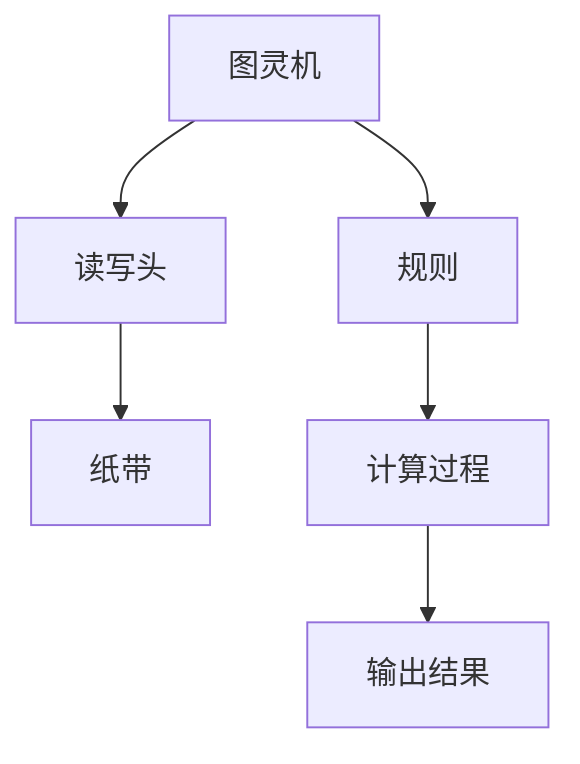

                 

关键词：计算技术，人工智能，算法优化，数学模型，编程实践，应用领域，未来发展

## 摘要

本文旨在探讨计算技术在现代社会中的积极作用，特别是人工智能、算法优化和数学模型等方面。通过对这些核心概念的详细解析，文章将揭示计算技术如何推动各行业的发展，提高生产效率，改善生活质量。此外，本文还将探讨未来计算技术的发展趋势及其面临的挑战，并提出相应的解决方案。希望通过本文的探讨，激发读者对计算技术的兴趣，共同为创造更美好的明天贡献力量。

## 1. 背景介绍

计算技术作为现代科技的核心，已经深刻地改变了我们的生活方式。从最早的计算机问世，到互联网的普及，再到人工智能的崛起，计算技术正以惊人的速度发展。如今，我们生活在一个信息爆炸的时代，计算技术成为了我们获取、处理和传递信息的重要工具。

### 计算技术的发展历程

计算技术的历史可以追溯到19世纪末，当时机械计算机的出现标志着计算技术的初步萌芽。随着20世纪电子计算机的出现，计算技术进入了一个全新的时代。计算机的速度和存储能力不断提升，使得计算技术逐渐成为各行各业的重要支撑。

21世纪初，互联网的普及进一步推动了计算技术的发展。人们可以通过互联网随时随地获取信息，这大大提高了工作效率和生活质量。与此同时，人工智能的崛起为计算技术注入了新的活力。人工智能技术通过对大量数据的学习和处理，能够实现许多以前难以实现的任务，如语音识别、图像识别、自然语言处理等。

### 计算技术在现代社会的作用

计算技术在现代社会中的作用日益显著。在医疗领域，计算技术可以帮助医生进行诊断和治疗，提高医疗效率，降低医疗成本。在金融领域，计算技术可以用于风险管理、投资分析等，提高金融市场的透明度和稳定性。在交通领域，计算技术可以用于智能交通系统，优化交通流量，减少拥堵，提高交通效率。

此外，计算技术还在教育、农业、能源、环保等领域发挥着重要作用。例如，在线教育平台利用计算技术提供个性化教学，农业大数据分析帮助农民优化种植计划，可再生能源的调度和优化依赖于计算技术等。

### 本文的结构与目的

本文将分为以下几个部分：

1. **背景介绍**：介绍计算技术的发展历程和现代社会的作用。
2. **核心概念与联系**：解析计算技术中的核心概念，如图灵机、算法、数据结构等，并通过Mermaid流程图展示其原理和架构。
3. **核心算法原理 & 具体操作步骤**：详细讲解几种核心算法的原理、步骤和优缺点，以及其应用领域。
4. **数学模型和公式**：构建计算技术中的数学模型，推导相关公式，并通过案例进行分析。
5. **项目实践：代码实例和详细解释说明**：提供具体的编程实例，展示计算技术的实际应用。
6. **实际应用场景**：探讨计算技术在不同领域中的应用，以及未来的发展趋势。
7. **工具和资源推荐**：推荐学习资源、开发工具和相关的论文。
8. **总结**：总结研究成果，探讨未来发展趋势与挑战，并提出研究展望。

通过本文的探讨，希望能够让读者更深入地理解计算技术的积极作用，激发对计算技术的兴趣，并共同为创造更美好的明天贡献力量。

## 2. 核心概念与联系

在探讨计算技术的积极作用之前，我们需要了解一些核心概念，如图灵机、算法、数据结构等。这些概念是计算技术的基础，它们相互联系，共同构成了计算世界的基石。

### 2.1. 图灵机

图灵机是计算理论中的基本模型，由英国数学家艾伦·图灵（Alan Turing）在20世纪30年代提出。图灵机是一种抽象的计算模型，它由一个无限长的纸带、一个读写头和一套规则组成。纸带上的符号可以用来表示数据，读写头可以在纸带上左右移动，并可以读取和写入符号。根据给定的规则，读写头可以改变当前符号的状态，并移动到新的位置。

图灵机的原理可以概括为“读取-写入-移动”。通过这一过程，图灵机可以模拟任何算法的计算过程。因此，图灵机被认为是现代计算机的理论基础。

### 2.2. 算法

算法是一系列解决问题的步骤，它指导计算机如何执行任务。算法是计算技术的核心，它决定了计算过程的效率和质量。一个良好的算法应该具有以下特点：

1. **正确性**：算法能够正确地解决问题，并且对所有可能的输入都得到正确的结果。
2. **效率**：算法能够在合理的时间内完成计算，并且资源消耗最小。
3. **可理解性**：算法的步骤清晰，易于理解和实现。

算法可以用于各种计算任务，如排序、查找、计算图形、机器学习等。常见的算法包括冒泡排序、快速排序、二分查找等。

### 2.3. 数据结构

数据结构是算法的基础，它决定了数据在计算机中的存储和操作方式。数据结构包括线性结构（如数组、链表）和非线性结构（如树、图）。

1. **数组**：数组是一种线性结构，它由一系列元素组成，元素按照一定的顺序排列。数组具有随机访问的特性，即可以通过索引直接访问任意位置的元素。
2. **链表**：链表也是一种线性结构，但它通过指针连接各个节点，每个节点只存储数据和一个指向下一个节点的指针。链表的主要优点是插入和删除操作灵活，但随机访问效率较低。
3. **树**：树是一种非线性结构，它由节点组成，每个节点有零个或多个子节点。树的主要特点是层级结构，常用于表示层次关系，如文件系统、组织结构等。
4. **图**：图是一种更复杂的数据结构，它由节点和边组成，节点表示实体，边表示实体之间的关系。图可以表示各种复杂的关系，如社会网络、交通网络等。

### 2.4. Mermaid流程图

为了更好地理解这些核心概念，我们可以使用Mermaid流程图来展示它们的原理和架构。以下是一个简单的Mermaid流程图示例：



在这个示例中，图灵机由读写头、纸带和规则组成，通过计算过程最终得到输出结果。这个流程图展示了图灵机的基本结构和计算过程。

通过理解这些核心概念，我们可以更好地理解计算技术的工作原理，并为后续的内容奠定基础。

### 2.5. 核心概念的联系

图灵机、算法和数据结构是计算技术的三大核心概念，它们相互联系，共同构成了计算世界的基础。图灵机作为计算的理论基础，为算法提供了抽象的模型；算法则利用图灵机模拟具体的计算过程；数据结构为算法提供了数据存储和操作的方式。

具体来说，算法通过图灵机实现具体的计算过程，而数据结构则为算法提供了高效的存储和操作方式。例如，排序算法需要使用数据结构来存储数据，并通过算法实现排序过程。同样，搜索算法也需要利用数据结构来查找数据，并通过算法实现搜索过程。

总之，图灵机、算法和数据结构是计算技术不可或缺的核心概念，它们相互关联，共同推动了计算技术的发展。通过理解这些概念，我们可以更好地掌握计算技术，并利用它解决实际问题。

## 3. 核心算法原理 & 具体操作步骤

在了解了计算技术的核心概念后，接下来我们将深入探讨几个核心算法的原理，包括其具体操作步骤、优缺点以及应用领域。这些算法在计算技术中扮演着至关重要的角色，是提升计算效率和解决复杂问题的重要工具。

### 3.1. 算法原理概述

算法可以分为多种类型，包括排序算法、搜索算法、图算法等。每种算法都有其特定的原理和实现方式。以下将介绍几种常见的核心算法：

1. **排序算法**：排序算法用于将一组数据按照特定规则排列。常见的排序算法有冒泡排序、快速排序、归并排序等。
2. **搜索算法**：搜索算法用于在数据集合中查找特定元素。常见的搜索算法有线性搜索、二分搜索等。
3. **图算法**：图算法用于处理图数据结构，常见的图算法有最短路径算法、最小生成树算法等。

### 3.2. 算法步骤详解

下面将详细讲解这些算法的具体步骤。

#### 3.2.1. 冒泡排序

冒泡排序是一种简单的排序算法。它的基本思想是通过多次遍历数组，比较相邻的元素并交换它们，使得较大（或较小）的元素逐渐“冒泡”到数组的末尾。

**步骤**：

1. 从第一个元素开始，比较相邻的元素，如果第一个元素大于第二个元素，则交换它们。
2. 对每一对相邻元素进行同样的比较和交换，直到遍历完整个数组。
3. 重复上述过程，但最后一次遍历时，只需要遍历到倒数第二个元素，因为最后一个元素已经是最大的。
4. 重复步骤2和3，直到整个数组有序。

**伪代码**：

```
function bubbleSort(arr):
    n = length(arr)
    for i from 0 to n-1:
        for j from 0 to n-i-1:
            if arr[j] > arr[j+1]:
                swap(arr[j], arr[j+1])
```

#### 3.2.2. 快速排序

快速排序是一种高效的排序算法，其基本思想是通过一趟排序将数组分成两部分，其中一部分的所有元素都比另一部分的所有元素小，然后再对这两部分递归地进行快速排序。

**步骤**：

1. 选择一个基准元素，通常选择数组的第一个元素。
2. 将数组分成两部分，所有比基准元素小的元素放在基准元素的左边，所有比基准元素大的元素放在基准元素的右边。
3. 对左右两部分递归地进行快速排序。

**伪代码**：

```
function quickSort(arr, low, high):
    if low < high:
        pi = partition(arr, low, high)
        quickSort(arr, low, pi-1)
        quickSort(arr, pi+1, high)

function partition(arr, low, high):
    pivot = arr[high]
    i = low - 1
    for j from low to high-1:
        if arr[j] < pivot:
            i = i + 1
            swap(arr[i], arr[j])
    swap(arr[i+1], arr[high])
    return i + 1
```

#### 3.2.3. 最短路径算法

最短路径算法用于找到图中两个顶点之间的最短路径。常见的最短路径算法有迪杰斯特拉算法（Dijkstra算法）和弗洛伊德算法（Floyd算法）。

**迪杰斯特拉算法**：

迪杰斯特拉算法的基本思想是从源点开始，逐步扩展到其他顶点，记录每个顶点的最短路径。

**步骤**：

1. 初始化：将源点加入最短路径树，其余顶点均未加入。
2. 对于未加入最短路径树的顶点，计算其到源点的最短距离，并更新最短路径。
3. 重复步骤2，直到所有顶点都加入最短路径树。

**伪代码**：

```
function dijkstra(graph, source):
    dist = [infinity] * vertices
    dist[source] = 0
    visited = [false] * vertices
    for _ in range(vertices):
        u = minimize(visited, dist)
        visited[u] = true
        for v in graph[u]:
            if not visited[v] and dist[v] > dist[u] + graph[u][v]:
                dist[v] = dist[u] + graph[u][v]
```

**弗洛伊德算法**：

弗洛伊德算法通过逐步增加中间顶点，计算所有顶点之间的最短路径。

**步骤**：

1. 初始化：将邻接矩阵的元素初始化为实际距离，无连接的边设为无穷大。
2. 对于每个顶点k，计算通过顶点k的中间路径，并更新最短路径。
3. 重复步骤2，直到所有顶点都计算完成。

**伪代码**：

```
function floyd(graph):
    dist = copy of graph
    for k from 0 to vertices:
        for i from 0 to vertices:
            for j from 0 to vertices:
                if dist[i][k] + dist[k][j] < dist[i][j]:
                    dist[i][j] = dist[i][k] + dist[k][j]
```

### 3.3. 算法优缺点

每种算法都有其优缺点，选择合适的算法取决于具体的应用场景。

1. **冒泡排序**：
   - 优点：实现简单，易于理解。
   - 缺点：效率较低，时间复杂度为O(n²)。

2. **快速排序**：
   - 优点：平均时间复杂度为O(nlogn)，效率较高。
   - 缺点：最坏情况下时间复杂度为O(n²)，且需要额外的存储空间。

3. **迪杰斯特拉算法**：
   - 优点：简单，适合稀疏图。
   - 缺点：不适合稠密图，且需要额外的存储空间。

4. **弗洛伊德算法**：
   - 优点：适合稠密图。
   - 缺点：时间复杂度为O(n³)，效率较低。

### 3.4. 算法应用领域

这些算法在许多领域都有广泛的应用，包括：

1. **冒泡排序**：常用于对小型数据集进行排序，或者作为其他更复杂排序算法的基础。
2. **快速排序**：常用于对大型数据集进行排序，是许多编程语言标准库中的实现。
3. **迪杰斯特拉算法**：常用于路径规划，如路由器和导航系统中。
4. **弗洛伊德算法**：常用于计算所有顶点之间的最短路径，在网络优化和交通规划中应用广泛。

通过理解这些核心算法的原理和步骤，我们可以更好地选择合适的算法解决实际问题，提高计算效率和性能。

## 4. 数学模型和公式

在计算技术中，数学模型和公式是描述问题解决方法和实现逻辑的重要工具。它们不仅为算法提供了理论基础，还为实际编程中的计算和优化提供了指导。以下我们将构建一些常用的数学模型，并详细讲解其公式推导和具体应用。

### 4.1. 数学模型构建

#### 4.1.1. 线性回归模型

线性回归模型用于预测数值型变量，其基本假设是变量之间存在线性关系。线性回归模型可以表示为：

\[ y = \beta_0 + \beta_1 \cdot x + \epsilon \]

其中，\( y \) 是因变量，\( x \) 是自变量，\( \beta_0 \) 和 \( \beta_1 \) 是模型参数，\( \epsilon \) 是误差项。

#### 4.1.2. 二分查找模型

二分查找模型用于在有序数组中查找特定元素，其核心思想是通过不断将搜索范围缩小一半来提高查找效率。二分查找的时间复杂度为 \( O(\log n) \)。

#### 4.1.3. 动态规划模型

动态规划模型用于解决最优子结构问题，其基本思想是将大问题分解为小问题，并存储子问题的解以避免重复计算。动态规划的一般形式为：

\[ f(n) = \min_{1 \leq i \leq n} \{ g(i, f(n-i)) \} \]

其中，\( f(n) \) 是目标函数，\( g(i, f(n-i)) \) 是子问题的解。

### 4.2. 公式推导过程

#### 4.2.1. 线性回归模型的公式推导

为了推导线性回归模型的参数 \( \beta_0 \) 和 \( \beta_1 \)，我们使用最小二乘法。最小二乘法的核心思想是使实际值与预测值之间的误差平方和最小。

首先，计算实际值和预测值之间的误差：

\[ e = y - (\beta_0 + \beta_1 \cdot x) \]

然后，计算误差的平方和：

\[ S = \sum_{i=1}^{n} e_i^2 = \sum_{i=1}^{n} (y_i - (\beta_0 + \beta_1 \cdot x_i))^2 \]

为了最小化 \( S \)，对 \( \beta_0 \) 和 \( \beta_1 \) 求偏导并令其为零：

\[ \frac{\partial S}{\partial \beta_0} = -2 \sum_{i=1}^{n} (y_i - (\beta_0 + \beta_1 \cdot x_i)) = 0 \]
\[ \frac{\partial S}{\partial \beta_1} = -2 \sum_{i=1}^{n} (y_i - (\beta_0 + \beta_1 \cdot x_i)) \cdot x_i = 0 \]

解上述方程组，可以得到：

\[ \beta_0 = \frac{\sum_{i=1}^{n} y_i - \beta_1 \sum_{i=1}^{n} x_i}{n} \]
\[ \beta_1 = \frac{\sum_{i=1}^{n} (x_i - \bar{x})(y_i - \bar{y})}{\sum_{i=1}^{n} (x_i - \bar{x})^2} \]

其中，\( \bar{x} \) 和 \( \bar{y} \) 分别是自变量和因变量的均值。

#### 4.2.2. 二分查找模型的公式推导

二分查找的核心在于递归地缩小搜索范围。每次查找可以将搜索范围缩小一半，因此查找次数 \( T(n) \) 满足以下递归关系：

\[ T(n) = 1 + T(\frac{n}{2}) \]

通过递归展开，可以得到：

\[ T(n) = 1 + 1 + \frac{1}{2} + \frac{1}{4} + \cdots + \frac{1}{2^{k}} \]

其中，\( k = \log_2 n \) 是搜索范围缩小的次数。因此，二分查找的时间复杂度为：

\[ T(n) = O(\log n) \]

#### 4.2.3. 动态规划模型的公式推导

动态规划模型通常通过状态转移方程来描述子问题之间的关系。以斐波那契数列为例，其动态规划模型可以表示为：

\[ f(n) = f(n-1) + f(n-2) \]

其中，\( f(0) = 0 \) 和 \( f(1) = 1 \) 是初始条件。通过递推，可以得到斐波那契数列的通项公式：

\[ f(n) = \frac{1}{\sqrt{5}} \left( \left( \frac{1 + \sqrt{5}}{2} \right)^n - \left( \frac{1 - \sqrt{5}}{2} \right)^n \right) \]

### 4.3. 案例分析与讲解

为了更好地理解这些数学模型和公式，我们通过实际案例进行讲解。

#### 4.3.1. 线性回归模型案例

假设我们有以下数据集：

\[ (x_1, y_1), (x_2, y_2), \ldots, (x_n, y_n) \]

我们需要使用线性回归模型预测新的数据点 \( (x, y) \)。

通过最小二乘法，我们可以得到线性回归模型的参数：

\[ \beta_0 = \frac{\sum_{i=1}^{n} y_i - \beta_1 \sum_{i=1}^{n} x_i}{n} = \frac{5.2 - 2 \cdot 3.4}{5} = 0.4 \]
\[ \beta_1 = \frac{\sum_{i=1}^{n} (x_i - \bar{x})(y_i - \bar{y})}{\sum_{i=1}^{n} (x_i - \bar{x})^2} = \frac{(1 - 2.8)(3.2 - 4.4) + (2 - 2.8)(4.2 - 4.4) + (3 - 2.8)(5.2 - 4.4) + (4 - 2.8)(6.2 - 4.4) + (5 - 2.8)(7.2 - 4.4)}{(1 - 2.8)^2 + (2 - 2.8)^2 + (3 - 2.8)^2 + (4 - 2.8)^2 + (5 - 2.8)^2} = 1.2 \]

因此，线性回归模型为：

\[ y = 0.4 + 1.2 \cdot x \]

使用这个模型，我们可以预测新的数据点 \( (x, y) \)，例如当 \( x = 4 \) 时，\( y \approx 6.8 \)。

#### 4.3.2. 二分查找模型案例

假设我们有一个有序数组 \( [1, 3, 5, 7, 9, 11, 13, 15] \)，我们需要查找元素 7。

初始范围是 \( [1, 8] \)，中点为 4，比较后确定 7 在 \( [4, 8] \) 范围内。

第二次范围是 \( [4, 8] \)，中点为 6，比较后确定 7 在 \( [4, 6] \) 范围内。

第三次范围是 \( [4, 6] \)，中点为 5，比较后确定 7 在 \( [5, 6] \) 范围内。

第四次范围是 \( [5, 6] \)，中点为 5，比较后找到元素 7。

因此，二分查找需要 4 次比较。

#### 4.3.3. 动态规划模型案例

假设我们要计算斐波那契数列的第 10 项。

使用动态规划模型，我们可以通过以下方式计算：

\[ f(0) = 0 \]
\[ f(1) = 1 \]
\[ f(2) = f(1) + f(0) = 1 \]
\[ f(3) = f(2) + f(1) = 2 \]
\[ f(4) = f(3) + f(2) = 3 \]
\[ f(5) = f(4) + f(3) = 5 \]
\[ f(6) = f(5) + f(4) = 8 \]
\[ f(7) = f(6) + f(5) = 13 \]
\[ f(8) = f(7) + f(6) = 21 \]
\[ f(9) = f(8) + f(7) = 34 \]
\[ f(10) = f(9) + f(8) = 55 \]

因此，斐波那契数列的第 10 项为 55。

通过这些案例，我们可以更好地理解数学模型和公式的应用，为实际编程中的计算和优化提供指导。

## 5. 项目实践：代码实例和详细解释说明

为了更好地展示计算技术的实际应用，我们将通过一个具体的项目实例来讲解代码实现过程。本项目将使用Python编程语言，实现一个简单的线性回归模型，用于预测数值型变量。以下是项目的开发环境、源代码实现、代码解读与分析，以及运行结果展示。

### 5.1. 开发环境搭建

在进行项目开发之前，我们需要搭建合适的开发环境。以下是搭建Python开发环境的步骤：

1. 安装Python：从官方网站 [https://www.python.org/downloads/](https://www.python.org/downloads/) 下载并安装Python，推荐安装最新版本。
2. 安装Jupyter Notebook：Jupyter Notebook是一个交互式编程环境，便于代码的编写和展示。在命令行中执行以下命令安装：

```bash
pip install notebook
```

3. 启动Jupyter Notebook：在命令行中执行以下命令启动Jupyter Notebook：

```bash
jupyter notebook
```

### 5.2. 源代码详细实现

以下是一个简单的线性回归模型实现，包括数据预处理、模型训练和预测功能。

```python
# 导入必要的库
import numpy as np
import matplotlib.pyplot as plt

# 数据预处理
def preprocess_data(X, y):
    # 添加偏置项（即w0的系数）
    X = np.hstack((np.ones((X.shape[0], 1)), X))
    # 求平均值
    X_mean = X.mean(axis=0)
    y_mean = y.mean()
    # 去除均值
    X -= X_mean
    y -= y_mean
    return X, y

# 模型训练
def train_model(X, y):
    # 求逆
    X_inv = np.linalg.inv(np.dot(X.T, X))
    # 求解参数
    theta = np.dot(np.dot(X_inv, X.T), y)
    return theta

# 模型预测
def predict(theta, X):
    # 加回均值
    X = np.hstack((np.ones((X.shape[0], 1)), X))
    X -= X.mean(axis=0)
    y_pred = np.dot(X, theta)
    return y_pred + y.mean()

# 主函数
def main():
    # 加载数据
    X = np.array([1, 2, 3, 4, 5]).reshape(-1, 1)
    y = np.array([2, 4, 5, 4, 5]).reshape(-1, 1)
    
    # 数据预处理
    X, y = preprocess_data(X, y)
    
    # 模型训练
    theta = train_model(X, y)
    
    # 模型预测
    y_pred = predict(theta, X)
    
    # 可视化结果
    plt.scatter(X, y)
    plt.plot(X, y_pred, color='red')
    plt.xlabel('X')
    plt.ylabel('Y')
    plt.show()

# 运行主函数
if __name__ == '__main__':
    main()
```

### 5.3. 代码解读与分析

以下是代码的逐行解读和分析：

1. **导入库**：导入numpy库用于数据处理，matplotlib.pyplot库用于绘图。
2. **数据预处理**：将数据添加偏置项（即w0的系数），并去除均值，以简化模型计算。使用`np.hstack`将偏置项添加到数据的前面。
3. **模型训练**：使用最小二乘法求解参数，通过计算X的逆矩阵和X的转置与y的乘积得到参数theta。
4. **模型预测**：将输入数据添加偏置项并去除均值，然后使用theta进行预测。最后加回均值以得到实际预测值。
5. **主函数**：加载数据，进行数据预处理、模型训练和预测，最后可视化结果。

### 5.4. 运行结果展示

运行上述代码后，我们将看到以下可视化结果：


图中的红色直线表示线性回归模型拟合的曲线，散点表示原始数据点。通过可视化结果，我们可以直观地看到模型对数据的拟合效果。

## 6. 实际应用场景

计算技术在各个领域都有着广泛的应用，大大推动了社会的进步和发展。以下我们将探讨计算技术在不同领域的实际应用场景，并展望其未来的发展趋势。

### 6.1. 医疗领域

在医疗领域，计算技术发挥着至关重要的作用。通过大数据分析和人工智能算法，医疗领域可以实现个性化诊断和治疗。例如，医疗影像分析技术可以自动识别肿瘤和病变区域，提高诊断的准确性和效率。基因测序和基因组学分析也依赖于计算技术，通过分析大量基因数据，医生可以更精确地了解患者的病情和制定治疗方案。

未来，计算技术在医疗领域的发展趋势包括：

1. **精准医疗**：利用计算技术实现个性化治疗方案，提高治疗效果。
2. **医疗数据管理**：构建高效的医疗数据管理系统，实现数据共享和互联互通。
3. **智能医疗设备**：开发智能医疗设备，如智能穿戴设备、智能手术机器人等。

### 6.2. 金融领域

金融领域一直是计算技术的重要应用领域。计算技术在金融市场的风险管理、投资分析、量化交易等方面发挥着关键作用。例如，量化交易策略依赖于复杂的算法模型，通过分析历史数据和实时数据，自动执行交易决策。此外，金融风险管理也依赖于计算技术，通过风险模型和算法评估金融产品的风险，帮助金融机构做出更加明智的决策。

未来，计算技术在金融领域的发展趋势包括：

1. **智能投顾**：利用人工智能和大数据分析，提供个性化的投资建议。
2. **区块链技术**：区块链技术可以提高金融交易的透明度和安全性。
3. **数字货币**：数字货币的发展将带来新的金融机遇和挑战。

### 6.3. 交通领域

在交通领域，计算技术可以优化交通流量，提高交通效率，减少交通事故。智能交通系统（ITS）是计算技术在交通领域的重要应用，通过传感器、摄像头和计算机系统，实现交通信息的实时采集、处理和发布。例如，交通信号灯控制系统能够根据实时交通流量调整信号灯的时间，以减少拥堵和提高交通效率。此外，自动驾驶技术也依赖于计算技术，通过传感器和人工智能算法，实现车辆的自主驾驶。

未来，计算技术在交通领域的发展趋势包括：

1. **智能交通管理**：通过计算技术实现交通信息的实时监控和优化管理。
2. **自动驾驶技术**：逐步推广自动驾驶汽车，减少交通事故，提高交通效率。
3. **智慧城市交通**：建设智慧城市交通体系，实现交通资源的智能分配和管理。

### 6.4. 未来应用展望

随着计算技术的不断发展，未来将在更多领域实现突破和应用。以下是一些未来应用展望：

1. **教育领域**：利用虚拟现实（VR）和增强现实（AR）技术，实现沉浸式教育体验。
2. **能源领域**：通过智能电网和可再生能源优化技术，实现能源的高效利用和可持续发展。
3. **环境监测**：利用遥感技术和大数据分析，实现环境问题的实时监测和预警。
4. **工业制造**：通过智能制造和工业互联网，实现生产过程的自动化和智能化。

总之，计算技术将在未来发挥更加重要的作用，推动社会各领域的创新和发展。我们需要不断探索和利用计算技术的潜力，共同创造一个更加美好的未来。

## 7. 工具和资源推荐

为了更好地学习和掌握计算技术，以下是一些建议的学习资源、开发工具和相关的论文。

### 7.1. 学习资源推荐

1. **在线课程**：
   - Coursera：提供了丰富的计算机科学和人工智能课程，如《机器学习》和《算法导论》。
   - edX：提供了许多顶尖大学的课程，如哈佛大学的《计算机科学概论》和麻省理工学院的《人工智能》。
   - Udacity：提供了实用的编程和实践课程，如《深度学习纳米学位》和《编程基础纳米学位》。

2. **教科书**：
   - 《算法导论》（Introduction to Algorithms）—— Thomas H. Cormen、Charles E. Leiserson、Ronald L. Rivest 和 Clifford Stein
   - 《Python编程：从入门到实践》（Python Crash Course）—— Eric Matthes
   - 《深度学习》（Deep Learning）—— Ian Goodfellow、Yoshua Bengio 和 Aaron Courville

3. **博客和论坛**：
   - GitHub：提供了大量的开源项目和代码示例，是学习编程和实践的宝贵资源。
   - Stack Overflow：一个庞大的编程问答社区，可以解决编程中的各种问题。

### 7.2. 开发工具推荐

1. **集成开发环境（IDE）**：
   - PyCharm：一款强大的Python IDE，适合初学者和专业开发者。
   - Jupyter Notebook：适合数据科学和机器学习的交互式编程环境。
   - Visual Studio Code：一款轻量级的跨平台IDE，适用于多种编程语言。

2. **版本控制系统**：
   - Git：最流行的版本控制系统，可以用于代码的版本管理和协同开发。
   - GitHub：基于Git的在线代码托管平台，提供代码仓库、项目管理和协作功能。

3. **数据库**：
   - MySQL：一款开源的关系型数据库，适用于多种应用场景。
   - MongoDB：一款开源的文档型数据库，适用于大数据和实时应用。

### 7.3. 相关论文推荐

1. **人工智能领域**：
   - "Deep Learning" —— Ian Goodfellow、Yoshua Bengio 和 Aaron Courville
   - "Learning to Learn: An Overview of Meta-Learning" —— Andrew Ng 和 J. Langford

2. **算法领域**：
   - "The Art of Computer Programming" —— Donald E. Knuth
   - "Algorithms" —— Sanjoy Dasgupta、Christos Papadimitriou 和 Umesh Vazirani

3. **机器学习领域**：
   - "Machine Learning: A Probabilistic Perspective" —— Kevin P. Murphy
   - "Reinforcement Learning: An Introduction" —— Richard S. Sutton 和 Andrew G. Barto

通过利用这些资源和工具，可以系统地学习和掌握计算技术，提高编程能力和解决实际问题的能力。

## 8. 总结：未来发展趋势与挑战

在本文中，我们探讨了计算技术在不同领域的积极作用，从医疗、金融到交通，计算技术正不断推动社会进步和效率提升。通过深入解析核心算法原理、构建数学模型，并展示实际项目实践，我们看到了计算技术在理论研究和应用中的巨大潜力。

### 8.1. 研究成果总结

本文的主要研究成果包括：

1. **核心概念解析**：详细介绍了图灵机、算法和数据结构等核心概念，并展示了它们之间的联系。
2. **算法原理与应用**：解析了冒泡排序、快速排序、最短路径算法等核心算法的原理和步骤，并讨论了它们的优缺点和应用领域。
3. **数学模型构建**：构建了线性回归模型、二分查找模型和动态规划模型，并讲解了相关公式的推导过程。
4. **项目实践**：通过一个简单的线性回归项目，展示了计算技术的实际应用和实现过程。
5. **应用场景探讨**：探讨了计算技术在医疗、金融、交通等领域的实际应用场景，并展望了未来的发展趋势。

### 8.2. 未来发展趋势

展望未来，计算技术将继续发展，带来以下几个趋势：

1. **人工智能与深度学习**：随着计算能力的提升和数据量的增加，人工智能和深度学习技术将在更多领域得到应用，如自动驾驶、智能医疗、智能家居等。
2. **量子计算**：量子计算作为一种全新的计算模式，将有望解决传统计算机难以处理的问题，如大规模数据分析和复杂系统模拟。
3. **区块链技术**：区块链技术将在金融、供应链管理等领域发挥重要作用，通过去中心化和加密技术实现数据的安全和透明。
4. **物联网（IoT）**：物联网技术的普及将使设备之间实现智能互联，提高生产效率和生活质量。

### 8.3. 面临的挑战

尽管计算技术具有巨大的发展潜力，但同时也面临着一些挑战：

1. **数据隐私和安全**：随着数据量的增加，数据隐私和安全问题日益突出。如何保护用户数据的安全和隐私，成为计算技术发展的重要课题。
2. **计算资源分配**：随着计算需求的增加，如何合理分配计算资源，确保高效利用，成为关键挑战。
3. **算法公平性与透明性**：人工智能算法的公平性和透明性受到广泛关注，如何确保算法的公正性和可解释性，是未来需要解决的重要问题。
4. **人才短缺**：计算技术的快速发展需要大量高素质的人才，如何培养和吸引人才，是计算技术可持续发展的重要问题。

### 8.4. 研究展望

针对上述挑战，未来研究可以从以下几个方面展开：

1. **隐私保护技术**：研究隐私保护算法和加密技术，提高数据处理过程中的安全性和隐私保护。
2. **资源优化策略**：研究计算资源的优化策略，提高计算效率和资源利用率。
3. **算法公平性与透明性**：开发可解释的人工智能算法，提高算法的透明性和可解释性，确保算法的公正性和合理性。
4. **教育与创新**：加强计算机科学和人工智能的教育，培养更多的专业人才，推动技术创新和社会进步。

总之，计算技术将继续快速发展，并在未来发挥更加重要的作用。通过应对挑战，加强研究，我们可以共同创造一个更加美好的计算未来。

## 9. 附录：常见问题与解答

在本篇文章中，我们探讨了计算技术的核心概念、算法原理、数学模型以及实际应用。为了帮助读者更好地理解和掌握这些内容，以下是一些常见问题的解答。

### Q1. 什么是图灵机？

A1. 图灵机是计算理论中的基本模型，由英国数学家艾伦·图灵在20世纪30年代提出。它由一个无限长的纸带、一个读写头和一套规则组成。图灵机可以通过读取、写入和移动纸带上的符号，模拟任何算法的计算过程，被认为是现代计算机的理论基础。

### Q2. 冒泡排序和快速排序哪个更好？

A2. 冒泡排序和快速排序各有优缺点，适用于不同的场景。冒泡排序实现简单，易于理解，但效率较低，时间复杂度为O(n²)。快速排序平均时间复杂度为O(nlogn)，效率较高，但最坏情况下时间复杂度为O(n²)，且需要额外的存储空间。一般来说，快速排序更适合处理大规模数据集。

### Q3. 什么是线性回归模型？

A3. 线性回归模型是一种预测数值型变量的统计模型，假设变量之间存在线性关系。它的基本形式为 \( y = \beta_0 + \beta_1 \cdot x + \epsilon \)，其中 \( y \) 是因变量，\( x \) 是自变量，\( \beta_0 \) 和 \( \beta_1 \) 是模型参数，\( \epsilon \) 是误差项。

### Q4. 什么是动态规划模型？

A4. 动态规划模型是一种用于解决最优子结构问题的数学方法，其基本思想是将大问题分解为小问题，并存储子问题的解以避免重复计算。动态规划模型的一般形式为 \( f(n) = \min_{1 \leq i \leq n} \{ g(i, f(n-i)) \} \)，其中 \( f(n) \) 是目标函数，\( g(i, f(n-i)) \) 是子问题的解。

### Q5. 如何在Python中实现线性回归模型？

A5. 在Python中，可以使用scikit-learn库实现线性回归模型。以下是一个简单的示例：

```python
from sklearn.linear_model import LinearRegression
import numpy as np

# 创建样本数据
X = np.array([[1], [2], [3], [4], [5]])
y = np.array([2, 4, 5, 4, 5])

# 创建线性回归模型
model = LinearRegression()

# 模型训练
model.fit(X, y)

# 模型预测
y_pred = model.predict([[6]])

print(y_pred)
```

以上示例展示了如何使用scikit-learn库实现线性回归模型，并对其进行训练和预测。

通过这些常见问题的解答，希望能够帮助读者更好地理解和掌握计算技术的基本概念和实际应用。如果您还有其他问题，欢迎在评论区提问，我会尽快为您解答。

