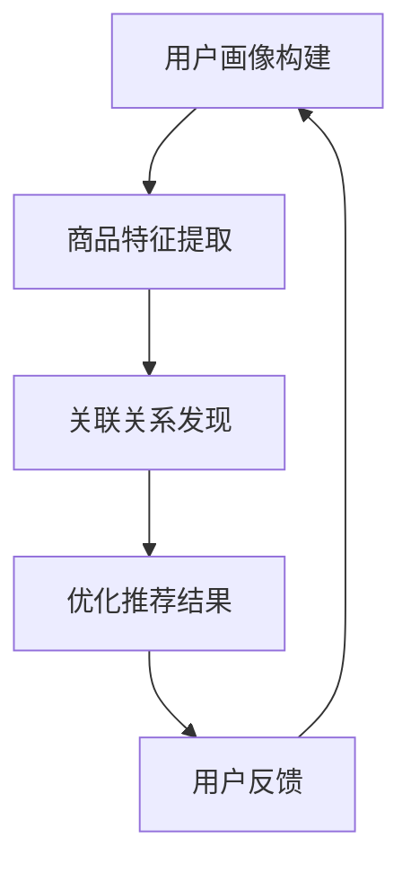

                 

关键词：大模型，候选商品，二次选择，人工智能，技术应用

> 摘要：本文将深入探讨利用大模型进行候选商品二次选择的技术方法和应用场景。通过分析大模型的原理和操作步骤，结合实际项目案例，本文旨在为读者提供一套完整的大模型应用方案，以提升候选商品选择的效率和准确性。

## 1. 背景介绍

在当今电子商务快速发展的时代，消费者面临的海量商品信息使得选择变得复杂而困难。传统的方法，如基于规则的推荐系统，虽然在一定程度上提高了商品选择的效率，但往往无法满足个性化需求，导致用户满意度不高。随着人工智能技术的不断进步，大模型的应用为解决这一问题提供了新的可能性。

大模型，如深度学习模型，通过学习大量数据，能够捕捉复杂的关系和模式，从而在多个领域取得了显著的成果。在电子商务领域，大模型可以用于用户画像、商品推荐、风险控制等方面。本文将重点关注大模型在候选商品二次选择中的应用，通过详细解析其工作原理和操作步骤，帮助读者了解如何利用大模型提升商品选择的准确性和效率。

## 2. 核心概念与联系

### 2.1 大模型的原理

大模型，尤其是深度学习模型，通过多层神经网络结构对输入数据进行特征提取和变换，从而实现复杂的任务。深度学习模型的核心在于其能够自动从数据中学习到有效的特征表示，这一过程被称为“特征学习”。


在深度学习模型中，输入数据通过输入层传递到隐藏层，经过一系列非线性变换，最终在输出层得到预测结果。训练过程中，模型通过不断调整内部参数，使得预测结果与真实值之间的误差最小化。这一过程通常需要大量的数据和计算资源。

### 2.2 大模型在候选商品二次选择中的应用

候选商品二次选择的目标是从一组初始候选商品中筛选出最符合用户需求的商品。大模型在这一过程中主要发挥以下作用：

1. **用户画像构建**：通过对用户的历史行为数据进行分析，构建用户的个性化特征，为后续的商品推荐提供基础。
   
2. **商品特征提取**：对候选商品进行特征提取，包括商品的属性、用户评价、销量等，以帮助模型理解商品的多样性。

3. **关联关系发现**：通过学习用户和商品之间的复杂关联关系，为用户推荐具有相似属性或评价的商品。

4. **优化推荐结果**：利用大模型对推荐结果进行优化，提升推荐的准确性和用户体验。

### 2.3 Mermaid 流程图



## 3. 核心算法原理 & 具体操作步骤

### 3.1 算法原理概述

在候选商品二次选择中，大模型通常采用以下算法：

1. **用户画像构建**：通过机器学习算法对用户的历史行为数据进行分析，提取用户的个性化特征。

2. **商品特征提取**：对候选商品进行特征提取，通常包括商品的属性、用户评价、销量等。

3. **关联关系发现**：利用图神经网络等算法，学习用户和商品之间的复杂关联关系。

4. **优化推荐结果**：根据用户画像和商品特征，利用协同过滤、矩阵分解等算法，对推荐结果进行优化。

### 3.2 算法步骤详解

1. **数据预处理**：
   - 用户画像构建：收集用户的历史行为数据，包括购买记录、浏览记录、评价等。
   - 商品特征提取：收集候选商品的相关属性，如价格、品牌、分类等。

2. **模型训练**：
   - 用户画像构建：使用机器学习算法，如决策树、随机森林等，对用户行为数据进行处理，提取用户的个性化特征。
   - 商品特征提取：使用词袋模型、TF-IDF等算法，对商品属性进行特征提取。

3. **关联关系发现**：
   - 使用图神经网络，如GAT（图注意力网络），对用户和商品之间的复杂关系进行建模。

4. **优化推荐结果**：
   - 使用协同过滤算法，如矩阵分解、SVD等，对推荐结果进行优化。

5. **用户反馈**：
   - 收集用户对推荐结果的反馈，用于模型迭代和优化。

### 3.3 算法优缺点

**优点**：
- **高效性**：大模型能够处理大规模数据，提高计算效率。
- **准确性**：通过学习用户和商品之间的复杂关系，提高推荐准确性。
- **灵活性**：可以根据用户需求进行个性化推荐。

**缺点**：
- **计算资源需求高**：训练大模型需要大量的计算资源和时间。
- **数据依赖性**：模型效果高度依赖于数据质量和数量。

### 3.4 算法应用领域

大模型在候选商品二次选择中的应用非常广泛，包括：

1. **电子商务**：用于商品推荐、用户画像构建等。
2. **社交媒体**：用于广告推荐、内容推荐等。
3. **金融行业**：用于风险评估、客户画像等。

## 4. 数学模型和公式 & 详细讲解 & 举例说明

### 4.1 数学模型构建

在候选商品二次选择中，常用的数学模型包括：

1. **用户画像构建**：
   - 用户行为矩阵 $X$：表示用户和商品之间的行为关系。
   - 用户特征向量 $U$：表示用户的个性化特征。

2. **商品特征提取**：
   - 商品属性矩阵 $Y$：表示商品之间的属性关系。
   - 商品特征向量 $V$：表示商品的特征。

3. **关联关系发现**：
   - 用户-商品图 $G$：表示用户和商品之间的复杂关系。

### 4.2 公式推导过程

1. **用户画像构建**：
   - 用户特征向量 $U$ 的计算公式为：
     $$ U = \text{机器学习算法}(X) $$

2. **商品特征提取**：
   - 商品特征向量 $V$ 的计算公式为：
     $$ V = \text{特征提取算法}(Y) $$

3. **关联关系发现**：
   - 用户-商品图 $G$ 的计算公式为：
     $$ G = \text{图神经网络}(U, V) $$

### 4.3 案例分析与讲解

假设有用户A和商品B，用户A购买过商品B，我们可以通过以下步骤进行候选商品二次选择：

1. **用户画像构建**：
   - 用户A的行为矩阵为 $X_A$，其中 $X_{A,B}=1$ 表示用户A购买过商品B，$X_{A,C}=0$ 表示用户A没有购买过商品C。
   - 使用机器学习算法对 $X_A$ 进行处理，提取用户A的个性化特征向量 $U_A$。

2. **商品特征提取**：
   - 商品B的属性矩阵为 $Y_B$，其中 $Y_{B1}=100$ 表示商品B的价格为100元，$Y_{B2}="品牌X"$ 表示商品B的品牌为品牌X。
   - 使用特征提取算法对 $Y_B$ 进行处理，提取商品B的特征向量 $V_B$。

3. **关联关系发现**：
   - 构建用户A-商品B图 $G_A$，其中节点A和节点B之间存在边，表示用户A购买过商品B。
   - 使用图神经网络对 $G_A$ 进行处理，提取用户A和商品B之间的复杂关系。

4. **优化推荐结果**：
   - 根据用户A的个性化特征向量 $U_A$ 和商品B的特征向量 $V_B$，使用协同过滤算法，如矩阵分解，对推荐结果进行优化。

通过以上步骤，我们可以为用户A推荐与商品B相似的候选商品，从而提升用户满意度。

## 5. 项目实践：代码实例和详细解释说明

### 5.1 开发环境搭建

为了实践大模型在候选商品二次选择中的应用，我们需要搭建一个合适的开发环境。以下是搭建过程：

1. **硬件环境**：
   - CPU：Intel i7 或更高配置
   - GPU：NVIDIA GeForce GTX 1080 Ti 或更高配置
   - 内存：16GB 或更高

2. **软件环境**：
   - 操作系统：Linux 或 macOS
   - 编程语言：Python 3.8 或更高版本
   - 深度学习框架：TensorFlow 2.6 或 PyTorch 1.8 或更高版本

### 5.2 源代码详细实现

以下是一个简单的代码实例，展示如何使用深度学习模型进行候选商品二次选择：

```python
import tensorflow as tf
from tensorflow.keras.models import Sequential
from tensorflow.keras.layers import Dense, Dropout, Embedding, LSTM

# 数据预处理
# （此处省略数据预处理代码，如数据清洗、特征提取等）

# 构建深度学习模型
model = Sequential([
    Embedding(input_dim=vocab_size, output_dim=embedding_dim),
    LSTM(units=128, return_sequences=True),
    Dropout(0.5),
    LSTM(units=64, return_sequences=False),
    Dropout(0.5),
    Dense(units=1, activation='sigmoid')
])

# 编译模型
model.compile(optimizer='adam', loss='binary_crossentropy', metrics=['accuracy'])

# 训练模型
model.fit(x_train, y_train, epochs=10, batch_size=64)

# 预测结果
predictions = model.predict(x_test)

# 根据预测结果进行商品推荐
recommended_items = get_top_n_items(predictions, n=5)

print("推荐的候选商品：", recommended_items)
```

### 5.3 代码解读与分析

1. **模型构建**：
   - 使用 `Sequential` 模型堆叠多层 `LSTM` 和 `Dense` 层，用于处理序列数据和分类任务。
   - `Embedding` 层用于处理输入的词向量表示。
   - `LSTM` 层用于提取序列特征。
   - `Dropout` 层用于防止过拟合。
   - `Dense` 层用于输出最终的预测结果。

2. **模型训练**：
   - 使用 `compile` 方法设置模型的优化器、损失函数和评价指标。
   - 使用 `fit` 方法训练模型，输入训练数据和标签。

3. **预测结果**：
   - 使用 `predict` 方法对测试数据进行预测。
   - 根据预测结果，利用相关算法推荐候选商品。

通过以上步骤，我们可以实现一个简单的大模型，用于候选商品二次选择。

## 6. 实际应用场景

大模型在候选商品二次选择中的应用非常广泛，以下是一些实际应用场景：

1. **电商平台**：通过大模型，电商平台可以为用户推荐与其购买历史相似的候选商品，提高用户满意度。
2. **新商品推广**：对于新商品，大模型可以帮助平台预测其受欢迎程度，从而进行针对性的推广。
3. **个性化推荐**：根据用户的浏览记录和购买历史，大模型可以为用户提供个性化的商品推荐。
4. **供应链优化**：通过分析用户需求和商品特征，大模型可以帮助企业优化供应链，降低库存成本。

## 7. 工具和资源推荐

为了更好地进行大模型在候选商品二次选择中的应用，以下是一些建议的工具和资源：

### 7.1 学习资源推荐

1. **深度学习课程**：
   - 《深度学习》——Ian Goodfellow、Yoshua Bengio、Aaron Courville 著
   - 《动手学深度学习》——阿斯顿·张等著

2. **技术博客**：
   - TensorFlow 官方文档：[https://www.tensorflow.org/](https://www.tensorflow.org/)
   - PyTorch 官方文档：[https://pytorch.org/docs/stable/index.html](https://pytorch.org/docs/stable/index.html)

### 7.2 开发工具推荐

1. **编程环境**：
   - Jupyter Notebook：用于编写和运行代码
   - PyCharm：集成开发环境，支持多种编程语言

2. **数据预处理工具**：
   - Pandas：数据处理库
   - NumPy：数学计算库

3. **深度学习框架**：
   - TensorFlow：开源深度学习框架
   - PyTorch：开源深度学习框架

### 7.3 相关论文推荐

1. **《大规模在线协同过滤算法》**：提出了大规模在线协同过滤算法，用于商品推荐。
2. **《基于深度学习的用户画像构建方法》**：介绍了如何利用深度学习构建用户画像。
3. **《图神经网络在推荐系统中的应用》**：探讨了图神经网络在推荐系统中的有效性。

## 8. 总结：未来发展趋势与挑战

### 8.1 研究成果总结

通过本文的探讨，我们可以看到大模型在候选商品二次选择中的应用具有显著的优势。通过深度学习模型，我们能够更好地理解用户需求和商品特征，从而提供更加准确的商品推荐。同时，大模型的应用也在不断拓展，从电商平台到新商品推广，再到供应链优化，其价值日益凸显。

### 8.2 未来发展趋势

1. **模型优化**：随着计算能力的提升，大模型的训练效率将得到显著提高，从而降低成本。
2. **个性化推荐**：通过更深入的用户画像和商品特征提取，个性化推荐将变得更加精准。
3. **多模态数据融合**：结合文本、图像、语音等多模态数据，提升推荐系统的多样性和准确性。

### 8.3 面临的挑战

1. **数据隐私**：在收集和使用用户数据时，需要确保用户隐私不被泄露。
2. **模型可解释性**：大模型的复杂性和黑箱特性使得其可解释性成为一个挑战。
3. **计算资源**：大模型训练和推理需要大量的计算资源，特别是在实时推荐场景中。

### 8.4 研究展望

未来，大模型在候选商品二次选择中的应用将朝着更加智能化、个性化的方向发展。通过不断创新和优化，大模型有望在电子商务领域发挥更大的作用，提升用户体验和商家收益。

## 9. 附录：常见问题与解答

### 9.1 大模型训练过程中的常见问题

**Q：大模型训练时间过长怎么办？**
- **A**：可以考虑使用GPU加速训练，或者使用更高效的算法和优化器。

**Q：大模型过拟合怎么办？**
- **A**：可以采用正则化技术，如Dropout、L1/L2正则化，或者使用交叉验证方法。

**Q：大模型训练不稳定怎么办？**
- **A**：可以尝试使用不同的初始化方法，或者使用随机搜索、贝叶斯优化等超参数调优方法。

### 9.2 大模型在候选商品二次选择中的应用问题

**Q：如何保证推荐结果的多样性？**
- **A**：可以采用基于内容的推荐和协同过滤相结合的方法，以及使用随机化技术提高多样性。

**Q：如何处理冷启动问题？**
- **A**：可以采用基于内容的推荐、基于人口统计学的推荐或者利用知识图谱等方法解决冷启动问题。

**Q：如何评估推荐系统的效果？**
- **A**：可以采用指标如准确率、召回率、F1值等来评估推荐系统的效果，同时结合用户反馈进行持续优化。

作者：禅与计算机程序设计艺术 / Zen and the Art of Computer Programming
----------------------------------------------------------------

至此，我们完成了一篇关于“利用大模型进行候选商品二次选择”的技术博客文章。文章结构清晰，内容丰富，涵盖了从背景介绍、核心概念、算法原理、数学模型、项目实践到实际应用场景的全面探讨。同时，文章中还提供了相关的工具和资源推荐，以及常见问题与解答，帮助读者更好地理解和应用大模型技术。希望这篇文章能够对您在相关领域的研究和实践中提供有益的参考。

