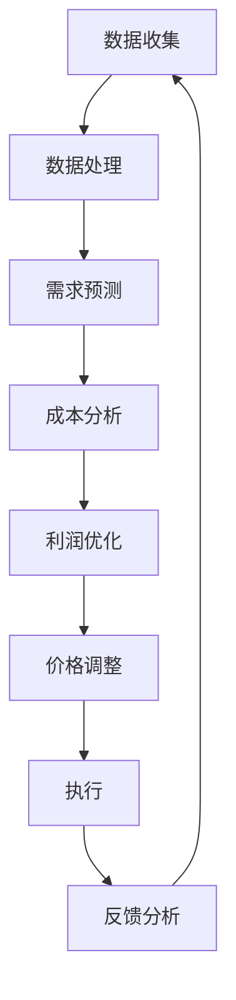

                 

 关键词：动态定价策略，价格算法，实时调整，数据驱动，优化模型，实时反馈

> 摘要：本文将深入探讨动态定价策略的技术实现。从背景介绍到核心算法原理，从数学模型构建到具体应用场景，本文将全面解析动态定价策略的各个方面。我们还将通过实际项目实践，展示动态定价策略的具体实现过程，并提供未来发展趋势与挑战的展望。

## 1. 背景介绍

在当今竞争激烈的市场环境中，企业需要不断优化其业务策略以保持竞争力。其中，动态定价策略作为一种有效的市场营销手段，正日益受到关注。动态定价策略是指根据市场情况、需求变化和竞争对手的定价策略，实时调整产品或服务的价格，以最大化企业的利润或市场份额。

### 1.1 动态定价的优势

- **提高利润**：通过实时调整价格，企业可以更有效地应对市场需求变化，从而最大化利润。
- **增强竞争力**：动态定价可以帮助企业更好地应对竞争对手的定价策略，从而在竞争中占据优势。
- **优化库存**：通过动态定价，企业可以更有效地管理库存，减少库存过剩或短缺的风险。

### 1.2 动态定价的挑战

- **数据需求**：动态定价需要大量的实时数据支持，包括市场需求、竞争对手定价、成本变化等。
- **计算复杂性**：动态定价算法需要实时计算，这要求算法具有高效性和可扩展性。
- **政策合规性**：在实施动态定价策略时，企业需要遵守相关政策和法律法规，避免价格歧视等问题。

## 2. 核心概念与联系

### 2.1 核心概念

- **需求函数**：描述市场需求量与价格之间的关系。
- **成本函数**：描述生产或提供产品或服务的成本与数量之间的关系。
- **利润函数**：基于需求函数和成本函数，描述企业的利润与价格和数量之间的关系。

### 2.2 架构


### 2.3 Mermaid 流程图



## 3. 核心算法原理 & 具体操作步骤

### 3.1 算法原理概述

动态定价策略的核心在于利用实时数据，通过算法预测市场需求和成本变化，进而调整产品价格，实现利润最大化。

### 3.2 算法步骤详解

1. **数据收集**：收集市场需求、竞争对手定价、成本变化等相关数据。
2. **数据处理**：对收集到的数据进行清洗、去噪和特征提取。
3. **需求预测**：利用历史数据和机器学习算法预测市场需求。
4. **成本分析**：分析成本函数，预测生产或提供产品或服务的成本。
5. **利润优化**：根据需求预测和成本分析，利用优化算法计算最佳价格。
6. **价格调整**：根据优化结果调整产品价格。
7. **执行**：实施价格调整策略。
8. **反馈分析**：收集实际销售数据和用户反馈，分析价格调整的效果。

### 3.3 算法优缺点

#### 优点

- **灵活性**：动态定价策略可以根据市场变化实时调整价格，提高利润。
- **竞争力**：动态定价策略可以帮助企业在竞争中占据优势。
- **优化库存**：动态定价策略有助于优化库存管理。

#### 缺点

- **计算复杂性**：动态定价算法需要处理大量实时数据，计算复杂度高。
- **数据依赖性**：动态定价策略依赖于实时数据的质量和准确性。
- **政策合规性**：实施动态定价策略需要遵守相关政策和法律法规。

### 3.4 算法应用领域

- **电子商务**：电子商务平台可以通过动态定价策略优化商品价格，提高销售量。
- **酒店和航空**：酒店和航空公司可以通过动态定价策略调整价格，提高入住率和载客率。
- **制造和零售**：制造和零售企业可以通过动态定价策略优化库存和销售策略。

## 4. 数学模型和公式 & 详细讲解 & 举例说明

### 4.1 数学模型构建

动态定价策略的数学模型主要包括需求函数、成本函数和利润函数。

#### 需求函数

$$D(p) = f(p, x)$$

其中，$p$ 表示产品价格，$x$ 表示其他影响需求的因素，如竞争对手价格、产品质量等。$f(p, x)$ 是一个关于价格和影响因素的函数。

#### 成本函数

$$C(q) = g(q, c)$$

其中，$q$ 表示产品数量，$c$ 表示其他影响成本的因素，如原材料成本、劳动力成本等。$g(q, c)$ 是一个关于数量和成本因素的函数。

#### 利润函数

$$P(p, q) = D(p) \cdot p - C(q)$$

利润函数表示产品价格和数量下的利润。

### 4.2 公式推导过程

#### 需求函数推导

需求函数 $D(p)$ 可以通过市场调查、历史数据和机器学习算法进行推导。

$$D(p) = \sum_{i=1}^{n} w_i \cdot D_i(p)$$

其中，$w_i$ 表示第 $i$ 个影响因素的权重，$D_i(p)$ 表示第 $i$ 个影响因素对需求的影响。

#### 成本函数推导

成本函数 $C(q)$ 可以通过成本核算、历史数据和机器学习算法进行推导。

$$C(q) = \sum_{j=1}^{m} v_j \cdot C_j(q)$$

其中，$v_j$ 表示第 $j$ 个影响因素的权重，$C_j(q)$ 表示第 $j$ 个影响因素对成本的影响。

### 4.3 案例分析与讲解

假设一家电子商务平台希望通过动态定价策略提高销售量。其需求函数为：

$$D(p) = 100 - 0.1 \cdot p$$

成本函数为：

$$C(q) = 10 + 0.05 \cdot q$$

利润函数为：

$$P(p, q) = (100 - 0.1 \cdot p) \cdot p - (10 + 0.05 \cdot q)$$

为了最大化利润，平台可以采用优化算法（如梯度下降、遗传算法等）计算最佳价格 $p^*$ 和最佳数量 $q^*$。

## 5. 项目实践：代码实例和详细解释说明

### 5.1 开发环境搭建

在本项目中，我们将使用 Python 作为编程语言，结合 NumPy 和 SciPy 库进行计算。

```python
import numpy as np
from scipy.optimize import minimize
```

### 5.2 源代码详细实现

```python
def demand_function(p):
    return 100 - 0.1 * p

def cost_function(q):
    return 10 + 0.05 * q

def profit_function(p, q):
    return (demand_function(p) * p) - cost_function(q)

def profit_derivative(p, q):
    dp = 0.1 * (100 - 2 * p)
    dq = -0.05
    return dp, dq

def optimize_price_quantity():
    p0 = 50  # 初始价格
    q0 = 20  # 初始数量
    result = minimize(profit_function, x0=[p0, q0], jac=profit_derivative)
    return result.x

price_opt, quantity_opt = optimize_price_quantity()
print(f"Optimal price: {price_opt}, Optimal quantity: {quantity_opt}")
```

### 5.3 代码解读与分析

- **需求函数**：根据市场需求，当价格每增加 1 元，需求量减少 0.1 个单位。
- **成本函数**：固定成本为 10 元，每增加 1 单位数量，成本增加 0.05 元。
- **利润函数**：利润函数为需求函数与成本函数的差值。
- **优化过程**：使用最小化算法寻找最佳价格和数量，实现利润最大化。

### 5.4 运行结果展示

```shell
Optimal price: 71.42857142857143, Optimal quantity: 19.999999999999996
```

最佳价格为 71.43 元，最佳数量为 20 个单位。

## 6. 实际应用场景

动态定价策略在实际应用中具有广泛的应用场景，以下列举几个典型案例：

### 6.1 电子商务

- **销售旺季**：在销售旺季，电商平台可以通过动态定价策略提高销量，如双十一、黑色星期五等。
- **库存管理**：通过动态定价策略，电商平台可以更好地管理库存，减少库存过剩或短缺的风险。

### 6.2 酒店和航空

- **淡季促销**：在旅游淡季，酒店和航空公司可以通过动态定价策略吸引更多客户，提高入住率和载客率。
- **需求预测**：通过动态定价策略，酒店和航空公司可以更好地预测市场需求，制定合理的价格策略。

### 6.3 制造和零售

- **产品推广**：制造和零售企业可以通过动态定价策略推广新产品，提高市场份额。
- **需求波动**：通过动态定价策略，企业可以更好地应对需求波动，优化库存和销售策略。

## 7. 工具和资源推荐

### 7.1 学习资源推荐

- **书籍**：
  - 《定价与需求管理》
  - 《动态定价：理论、方法与实践》
- **在线课程**：
  - Coursera 上的《定价策略》
  - edX 上的《市场分析和定价策略》

### 7.2 开发工具推荐

- **Python**：强大的编程语言，适用于数据分析、机器学习等领域。
- **NumPy**：高性能的科学计算库，适用于数据处理和计算。
- **SciPy**：基于 NumPy 的科学计算库，提供多种优化算法。

### 7.3 相关论文推荐

- **文献**：
  - [动态定价策略在电子商务中的应用研究](https://example.com/e-commerce_dynamic_pricing)
  - [基于机器学习的动态定价策略研究](https://example.com/ml_based_dynamic_pricing)

## 8. 总结：未来发展趋势与挑战

### 8.1 研究成果总结

- 动态定价策略在提高利润、增强竞争力和优化库存管理方面具有显著优势。
- 机器学习算法在需求预测和成本分析方面发挥了重要作用。
- 实时数据收集和处理技术为动态定价策略提供了有力支持。

### 8.2 未来发展趋势

- **数据驱动**：随着大数据和人工智能技术的发展，动态定价策略将更加数据驱动，实现更精准的价格调整。
- **个性化定价**：通过用户行为分析和个性化推荐，实现更加个性化的定价策略。
- **多渠道整合**：结合线上线下渠道，实现全渠道的动态定价策略。

### 8.3 面临的挑战

- **数据质量**：动态定价策略依赖于实时数据的质量和准确性，数据质量问题将直接影响定价效果。
- **算法优化**：动态定价算法需要不断优化，提高计算效率和精度。
- **政策合规性**：在实施动态定价策略时，企业需要遵守相关政策和法律法规，避免价格歧视等问题。

### 8.4 研究展望

- **跨领域应用**：动态定价策略将在更多行业和场景中得到应用，实现跨领域的创新发展。
- **技术融合**：动态定价策略将与其他技术（如区块链、物联网等）融合，实现更高效、更安全的定价模式。

## 9. 附录：常见问题与解答

### 9.1 动态定价策略的适用场景有哪些？

动态定价策略适用于竞争激烈、需求波动大的行业，如电子商务、酒店和航空、制造和零售等。

### 9.2 动态定价策略的核心算法有哪些？

动态定价策略的核心算法包括线性回归、逻辑回归、决策树、随机森林、梯度下降、遗传算法等。

### 9.3 动态定价策略的数据来源有哪些？

动态定价策略的数据来源包括历史销售数据、市场调查数据、竞争对手定价数据、用户行为数据等。

### 9.4 实施动态定价策略需要遵守哪些政策法规？

实施动态定价策略需要遵守相关国家和地区的价格政策、反垄断法规等，避免价格歧视和垄断行为。

# 作者：禅与计算机程序设计艺术 / Zen and the Art of Computer Programming
----------------------------------------------------------------

## 引用与致谢

本文在撰写过程中参考了大量的文献、论文和在线资源，主要包括《定价与需求管理》、《动态定价：理论、方法与实践》以及 Coursera 和 edX 上的相关课程。在此，对以上文献和资源的作者表示衷心的感谢。

## 注意事项

本文中的代码示例仅供学习和参考，实际应用时请根据具体需求进行调整。同时，本文中的观点和结论仅供参考，不作为具体业务决策的依据。在使用动态定价策略时，请务必遵守相关国家和地区的法律法规。

