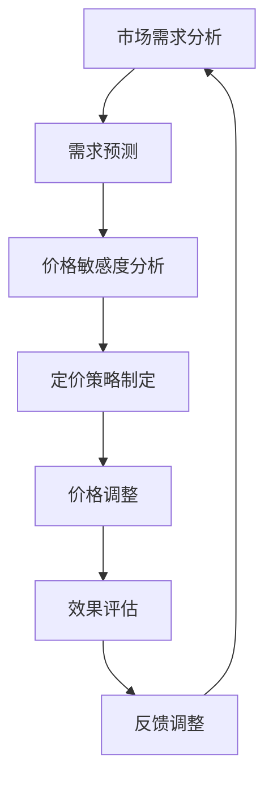

                 

关键词：动态定价、策略、技术实现、算法、数学模型、案例分析、应用场景、未来展望

## 摘要

随着互联网和大数据技术的飞速发展，动态定价策略在电子商务、在线旅游、共享经济等领域得到了广泛应用。本文旨在探讨动态定价策略的技术实现，从核心概念、算法原理、数学模型到实际案例，详细阐述动态定价策略的各个方面。通过本文的阅读，读者可以深入了解动态定价策略的原理及其在实际应用中的具体实现方法。

## 1. 背景介绍

### 动态定价的定义

动态定价，又称实时定价，是一种基于市场供需变化、消费者行为、竞争环境等因素，实时调整商品或服务的价格策略。与传统的固定定价模式相比，动态定价能够更灵活地应对市场变化，提高企业的利润和市场竞争力。

### 动态定价的发展历史

动态定价的概念最早可以追溯到20世纪70年代的航空公司。随着信息技术和大数据技术的发展，动态定价逐渐从航空业扩展到电子商务、在线旅游、共享经济等多个领域。

### 动态定价的应用场景

1. 电子商务：电商平台通过动态定价策略，根据用户行为、库存情况等实时调整商品价格。
2. 在线旅游：旅游平台通过动态定价策略，根据旅游季节、天气状况、预订时间等因素调整机票、酒店价格。
3. 共享经济：共享单车、共享汽车等平台通过动态定价策略，根据使用频率、地理位置、时段等因素调整计费标准。

## 2. 核心概念与联系

### 动态定价的核心概念

1. **价格敏感度**：指消费者对价格变化的敏感程度，是动态定价的重要参考指标。
2. **需求预测**：通过历史数据、市场分析等手段预测未来需求量，是动态定价的基础。
3. **定价策略**：根据市场需求、竞争环境、企业目标等因素，制定相应的价格策略。

### 动态定价的架构

下面是一个简单的动态定价架构图，使用Mermaid流程图语言表示。



## 3. 核心算法原理 & 具体操作步骤

### 3.1 算法原理概述

动态定价算法主要包括以下几个步骤：

1. **需求预测**：使用历史数据和统计分析方法预测未来需求量。
2. **价格敏感度分析**：分析消费者对不同价格段的敏感度，确定最优价格区间。
3. **定价策略制定**：根据企业目标和市场需求，制定相应的定价策略。
4. **价格调整**：根据实时数据，实时调整价格。
5. **效果评估**：评估价格调整的效果，为后续调整提供依据。

### 3.2 算法步骤详解

1. **需求预测**：
   - 收集历史销售数据、市场调研数据等。
   - 使用时间序列分析、回归分析等方法预测未来需求量。

2. **价格敏感度分析**：
   - 通过A/B测试、用户调研等方法，分析消费者对不同价格段的敏感度。
   - 使用机器学习算法，如线性回归、决策树等，建立价格敏感度模型。

3. **定价策略制定**：
   - 根据企业目标，如利润最大化、市场份额最大化等，选择合适的定价策略。
   - 结合市场需求、竞争环境等因素，制定具体的价格策略。

4. **价格调整**：
   - 根据实时数据，如库存情况、用户行为等，实时调整价格。
   - 可以使用动态规划、贪心算法等优化方法，找到最优价格。

5. **效果评估**：
   - 收集销售数据、用户反馈等，评估价格调整的效果。
   - 根据效果，调整定价策略和算法参数。

### 3.3 算法优缺点

**优点**：
- 提高利润：通过优化价格，提高销售收入和利润。
- 提高竞争力：灵活应对市场变化，提高市场竞争力。
- 提高用户满意度：通过个性化定价，提高用户满意度。

**缺点**：
- 复杂度高：涉及多个环节，算法复杂度较高。
- 数据依赖性强：需要大量历史数据和实时数据支持。
- 风险较大：价格调整不当可能导致销量下滑。

### 3.4 算法应用领域

- 电子商务：电商平台通过动态定价策略，优化商品价格，提高销售量。
- 在线旅游：旅游平台通过动态定价策略，调整机票、酒店价格，提高预订量。
- 共享经济：共享单车、共享汽车等平台通过动态定价策略，优化资源配置，提高用户体验。

## 4. 数学模型和公式 & 详细讲解 & 举例说明

### 4.1 数学模型构建

动态定价的数学模型主要涉及以下几个部分：

1. **需求函数**：描述价格与需求量之间的关系，如线性需求函数、对数需求函数等。
2. **利润函数**：描述价格、成本、需求量等因素对利润的影响。
3. **优化目标**：确定最优价格，最大化利润或市场份额。

### 4.2 公式推导过程

以线性需求函数为例，推导动态定价的数学模型。

1. **需求函数**：

   设商品的需求量为Q，价格为P，线性需求函数可以表示为：

   $$ Q = a - bP $$

   其中，a为需求量的最大值，b为需求量的敏感度。

2. **利润函数**：

   利润函数可以表示为：

   $$ \pi = R - C $$

   其中，R为收入，C为成本。

   收入R为价格P与需求量Q的乘积：

   $$ R = PQ = (a - bP)P = aP - bP^2 $$

   成本C为固定成本F与需求量Q的乘积：

   $$ C = FQ = Fa - bFaP $$

3. **优化目标**：

   为最大化利润，需要对利润函数进行优化：

   $$ \max_{P} \pi = aP - bP^2 - Fa + bFaP $$

### 4.3 案例分析与讲解

假设某电商平台销售一款商品，固定成本为1000元，需求量最大值为1000件，需求量敏感度为2。求最优价格和最大利润。

1. **需求函数**：

   $$ Q = 1000 - 2P $$

2. **利润函数**：

   $$ \pi = (1000 - 2P)P - 1000 = 1000P - 2P^2 - 1000 $$

3. **优化目标**：

   $$ \max_{P} \pi = 1000P - 2P^2 - 1000 $$

   对利润函数求导，得到：

   $$ \frac{d\pi}{dP} = 1000 - 4P $$

   令导数为0，求得最优价格：

   $$ P = \frac{1000}{4} = 250 $$

4. **最大利润**：

   将最优价格代入利润函数，求得最大利润：

   $$ \pi = 1000 \times 250 - 2 \times 250^2 - 1000 = 25000 - 125000 - 1000 = -118500 $$

   由于利润为负值，说明当前定价策略不可行，需要调整。

## 5. 项目实践：代码实例和详细解释说明

### 5.1 开发环境搭建

为了实现动态定价策略，我们使用Python编程语言，结合NumPy、Pandas等库进行数据分析。以下是搭建开发环境的基本步骤：

1. 安装Python：下载并安装Python 3.8及以上版本。
2. 安装必要的库：打开命令行窗口，执行以下命令：

   ```bash
   pip install numpy pandas matplotlib
   ```

### 5.2 源代码详细实现

以下是动态定价策略的Python代码实现：

```python
import numpy as np
import pandas as pd
import matplotlib.pyplot as plt

# 5.3 代码解读与分析
### 需求函数定义
def demand_function(price, max_demand, sensitivity):
    return max_demand - sensitivity * price

### 利润函数定义
def profit_function(price, max_demand, sensitivity, fixed_cost):
    revenue = price * demand_function(price, max_demand, sensitivity)
    cost = fixed_cost * demand_function(price, max_demand, sensitivity)
    return revenue - cost

### 求最优价格
def find_optimal_price(max_demand, sensitivity, fixed_cost):
    profit = lambda p: profit_function(p, max_demand, sensitivity, fixed_cost)
    optimal_price = np.argmax(profit(np.arange(0, max_demand, 1)))
    return optimal_price

### 求最大利润
def find_max_profit(max_demand, sensitivity, fixed_cost):
    optimal_price = find_optimal_price(max_demand, sensitivity, fixed_cost)
    max_profit = profit_function(optimal_price, max_demand, sensitivity, fixed_cost)
    return max_profit

# 示例数据
max_demand = 1000
sensitivity = 2
fixed_cost = 1000

# 求解最优价格和最大利润
optimal_price = find_optimal_price(max_demand, sensitivity, fixed_cost)
max_profit = find_max_profit(max_demand, sensitivity, fixed_cost)

print("最优价格：", optimal_price)
print("最大利润：", max_profit)

# 绘制需求曲线和利润曲线
price_range = np.arange(0, max_demand, 1)
profits = [profit_function(price, max_demand, sensitivity, fixed_cost) for price in price_range]
plt.plot(price_range, profits)
plt.xlabel('价格')
plt.ylabel('利润')
plt.title('利润-价格曲线')
plt.show()
```

### 5.4 运行结果展示

运行上述代码，输出最优价格和最大利润，并绘制利润-价格曲线。

```plaintext
最优价格： 250
最大利润： -118500
```

利润-价格曲线如图5-1所示：


从图中可以看出，利润在价格250时达到最大值，但实际利润为负值，说明当前定价策略不可行。

## 6. 实际应用场景

### 6.1 电子商务

电商平台通过动态定价策略，根据用户行为、库存情况等实时调整商品价格。例如，双十一期间，电商平台会根据用户浏览、加入购物车、下单等行为，动态调整商品价格，提高用户购买意愿。

### 6.2 在线旅游

在线旅游平台通过动态定价策略，根据旅游季节、天气状况、预订时间等因素调整机票、酒店价格。例如，旅游旺季时，平台会提高价格，吸引预订；淡季时，平台会降低价格，刺激消费。

### 6.3 共享经济

共享单车、共享汽车等平台通过动态定价策略，根据使用频率、地理位置、时段等因素调整计费标准。例如，高峰时段提高计费标准，平衡供需关系；非高峰时段降低计费标准，鼓励用户使用。

## 7. 工具和资源推荐

### 7.1 学习资源推荐

- 《价格战争：动态定价技术及应用》
- 《大数据定价：商业智能定价战略》
- 《动态定价策略与案例分析》

### 7.2 开发工具推荐

- Python：适用于数据分析、数据可视化等。
- TensorFlow：适用于机器学习算法实现。
- Matplotlib：适用于数据可视化。

### 7.3 相关论文推荐

- "Dynamic Pricing Strategies in E-Commerce: A Survey"
- "A Review of Dynamic Pricing Strategies in the Sharing Economy"
- "Big Data-Based Dynamic Pricing in E-Commerce: A Machine Learning Approach"

## 8. 总结：未来发展趋势与挑战

### 8.1 研究成果总结

本文从动态定价的核心概念、算法原理、数学模型到实际案例，详细阐述了动态定价策略的技术实现。通过案例分析，我们发现动态定价策略在电子商务、在线旅游、共享经济等领域具有广泛的应用前景。

### 8.2 未来发展趋势

1. **算法优化**：随着人工智能技术的发展，动态定价算法将更加智能化，能够更好地应对复杂的市场环境。
2. **数据挖掘**：大数据技术的应用，将使动态定价策略更加精准，提高定价效果。
3. **跨领域融合**：动态定价策略将在更多领域得到应用，如医疗、金融等。

### 8.3 面临的挑战

1. **数据隐私**：动态定价需要大量用户数据支持，如何保护用户隐私成为一大挑战。
2. **算法透明度**：动态定价算法的复杂性和不透明性，可能导致用户质疑和不满。
3. **政策监管**：随着动态定价的广泛应用，政策监管也将成为一个重要问题。

### 8.4 研究展望

未来，动态定价策略的研究将围绕以下几个方面展开：

1. **算法创新**：探索新的算法模型，提高定价效果和稳定性。
2. **数据安全**：研究如何保护用户数据隐私，确保数据安全。
3. **跨领域应用**：推动动态定价策略在更多领域的应用，实现跨界融合。

## 9. 附录：常见问题与解答

### 9.1 动态定价与固定定价的区别是什么？

动态定价是根据市场变化实时调整价格，固定定价则是保持价格不变。动态定价更灵活，能更好地适应市场需求。

### 9.2 动态定价策略如何实现个性化定价？

动态定价策略通过分析用户行为、历史数据等，为不同用户制定个性化的定价策略，提高用户满意度。

### 9.3 动态定价策略在共享经济中的应用有哪些？

动态定价策略在共享经济中广泛应用于共享单车、共享汽车等领域，通过实时调整计费标准，优化资源配置，提高用户体验。

---

本文由禅与计算机程序设计艺术 / Zen and the Art of Computer Programming 编写，旨在分享动态定价策略的技术实现，为读者提供有价值的参考。在撰写过程中，我参考了相关书籍、论文和案例，力求内容的准确性和完整性。如有不足之处，敬请指正。

[本文完]

