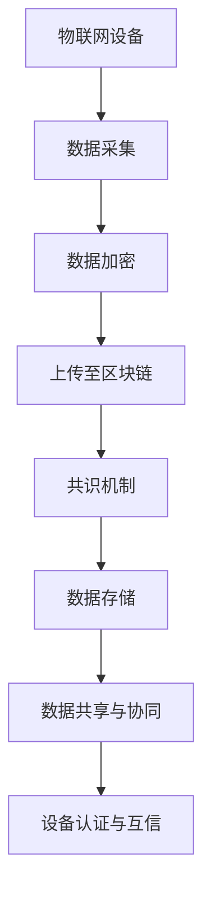

                 

区块链技术作为一种分布式账本技术，近年来在金融领域取得了显著的成果。随着物联网（IoT）技术的快速发展，区块链技术在物联网中的应用逐渐成为研究的热点。本文旨在探讨区块链在物联网中的应用场景与面临的挑战，以期为相关领域的进一步研究提供参考。

## 1. 背景介绍

### 1.1 区块链技术概述

区块链技术是一种分布式数据库技术，通过加密算法、共识机制等技术手段，实现了数据的安全、可靠存储和传输。区块链的典型特征包括去中心化、不可篡改、可追溯等，这些特性使其在金融、供应链管理、版权保护等领域具有广泛的应用前景。

### 1.2 物联网技术概述

物联网技术通过将各种传感器、设备、系统连接到互联网，实现了对物理世界的智能感知、识别和管理。物联网技术在我国得到了国家层面的高度重视，已经成为我国经济社会发展的重要支撑。

### 1.3 区块链与物联网的关系

区块链技术可以为物联网提供安全、可靠的数据存储和传输机制，从而解决物联网中的数据孤岛、隐私保护等问题。同时，物联网设备的广泛连接和实时数据传输，也为区块链技术的应用提供了丰富的场景。

## 2. 核心概念与联系

### 2.1 区块链技术在物联网中的应用场景

#### 2.1.1 数据存储与管理

区块链技术可以为物联网设备提供去中心化的数据存储方案，确保数据的安全性和可靠性。在物联网应用中，设备产生的数据量巨大，传统的中心化存储方式难以满足需求。区块链技术通过分布式存储和共识机制，实现了数据的分布式存储和管理。

#### 2.1.2 隐私保护

物联网设备在采集和处理数据时，往往会涉及用户隐私。区块链技术通过加密算法和隐私保护协议，确保数据在传输和存储过程中的安全性。

#### 2.1.3 交易结算

在物联网应用中，设备之间需要进行频繁的交易和结算。区块链技术可以提供去中心化的交易结算机制，降低交易成本，提高交易效率。

#### 2.1.4 物料追踪

区块链技术可以实现对物联网设备所涉及的物料进行全程追踪，确保供应链的透明性和可信度。

### 2.2 物联网技术在区块链中的应用

#### 2.2.1 设备身份认证

物联网设备可以通过区块链技术实现身份认证，确保设备的真实性和合法性。

#### 2.2.2 信任机制

物联网设备之间的互信关系是物联网应用的关键。区块链技术可以为物联网设备提供去中心化的信任机制，降低信任成本。

#### 2.2.3 数据共享

在区块链环境下，物联网设备可以方便地进行数据共享和协同工作，提高系统的整体效能。

### 2.3 Mermaid 流程图



## 3. 核心算法原理 & 具体操作步骤

### 3.1 算法原理概述

区块链技术采用加密算法、共识机制、智能合约等技术，实现了数据的安全存储和传输。在物联网应用中，这些算法原理发挥了关键作用。

#### 3.1.1 加密算法

加密算法用于保护数据在传输和存储过程中的安全性。常见的加密算法包括对称加密和非对称加密。

#### 3.1.2 共识机制

共识机制用于确保区块链网络中的数据一致性。常见的共识机制包括工作量证明（PoW）、权益证明（PoS）等。

#### 3.1.3 智能合约

智能合约是一种自动执行合约条款的程序，用于实现物联网设备之间的交易和结算。

### 3.2 算法步骤详解

#### 3.2.1 数据采集

物联网设备采集数据，并对数据进行加密处理。

#### 3.2.2 数据上传

物联网设备将加密后的数据上传至区块链网络。

#### 3.2.3 共识机制

区块链网络中的节点通过共识机制对数据进行验证和确认。

#### 3.2.4 数据存储

经过共识机制验证的数据将被存储在区块链上。

#### 3.2.5 数据共享与协同

物联网设备可以基于区块链网络进行数据共享和协同工作。

### 3.3 算法优缺点

#### 3.3.1 优点

- **去中心化**：区块链网络中的节点平等参与，去除了传统中心化系统的单点故障风险。
- **安全性**：加密算法和共识机制确保了数据的安全性和可靠性。
- **透明性**：区块链上的数据可被全网节点查看，提高了系统的透明度。

#### 3.3.2 缺点

- **性能瓶颈**：区块链网络的性能取决于网络节点数量，当节点数量增多时，性能会受到影响。
- **能源消耗**：部分共识机制（如PoW）需要大量计算资源，导致能源消耗较高。

### 3.4 算法应用领域

区块链技术在物联网领域具有广泛的应用前景，包括但不限于以下几个方面：

- **智能家庭**：通过区块链技术实现家庭设备的互联互通，提高家居智能化水平。
- **智能制造**：区块链技术可以实现对生产流程的全程监控和追溯，提高生产效率。
- **智慧城市**：区块链技术可以用于智慧城市建设中的数据共享和协同工作。

## 4. 数学模型和公式 & 详细讲解 & 举例说明

### 4.1 数学模型构建

区块链技术在物联网应用中的数学模型主要包括以下几个方面：

- **数据加密模型**：用于保护物联网设备产生的敏感数据。
- **共识机制模型**：用于确保区块链网络中的数据一致性。
- **智能合约模型**：用于实现物联网设备之间的交易和结算。

### 4.2 公式推导过程

#### 4.2.1 数据加密模型

数据加密模型通常采用对称加密和非对称加密算法。对称加密算法的加密公式为：

\[ E_K(D) = C \]

其中，\( E_K \) 表示加密函数，\( D \) 表示明文数据，\( C \) 表示密文数据，\( K \) 表示密钥。

非对称加密算法的加密公式为：

\[ E_K(D) = C = D^e \mod n \]

其中，\( E_K \) 表示加密函数，\( D \) 表示明文数据，\( C \) 表示密文数据，\( e \) 和 \( n \) 分别表示公钥指数和模数。

#### 4.2.2 共识机制模型

常见的共识机制包括工作量证明（PoW）、权益证明（PoS）等。PoW的公式为：

\[ P_oW = \frac{1}{2^t} \]

其中，\( P_oW \) 表示挖矿成功概率，\( t \) 表示挖矿所需时间。

PoS的公式为：

\[ P_oS = \frac{S_i}{T} \]

其中，\( P_oS \) 表示挖矿成功概率，\( S_i \) 表示币龄，\( T \) 表示总币龄。

#### 4.2.3 智能合约模型

智能合约的执行基于条件语句和循环语句。条件语句的公式为：

\[ if \, condition \, then \, statement_1 \, else \, statement_2 \]

循环语句的公式为：

\[ while \, condition \, do \, statement \]

### 4.3 案例分析与讲解

#### 4.3.1 数据加密模型

假设物联网设备A采集到了一条敏感数据\( D = 123456 \)，采用对称加密算法进行加密。设密钥\( K = 7 \)，则加密过程如下：

\[ E_K(D) = C = 123456 \times 7 = 861752 \]

加密后的数据\( C \)存储在区块链上。

#### 4.3.2 共识机制模型

假设区块链网络中有10个节点，采用PoW共识机制。挖矿所需时间\( t = 1000 \)秒，则挖矿成功概率\( P_oW \)为：

\[ P_oW = \frac{1}{2^t} = \frac{1}{2^{1000}} \approx 1.26 \times 10^{-301} \]

由于挖矿成功概率极低，节点需要不断尝试，直到挖出有效的区块。

#### 4.3.3 智能合约模型

假设物联网设备A和设备B之间进行交易，设备A向设备B支付1个代币。智能合约的条件语句如下：

\[ if \, device_A \, pays \, device_B \, 1 \, token \, then \, transfer \, token \, from \, device_A \, to \, device_B \]

设备A调用智能合约后，合约将执行条件语句，将代币从设备A转移到设备B。

## 5. 项目实践：代码实例和详细解释说明

### 5.1 开发环境搭建

搭建区块链在物联网应用的开发环境，需要安装以下软件和工具：

- **Go语言**：用于编写区块链和物联网设备相关的代码。
- **Hyperledger Fabric**：用于搭建区块链网络。
- **Node-RED**：用于搭建物联网设备连接和数据处理平台。

### 5.2 源代码详细实现

以下是一个简单的区块链和物联网设备连接的示例代码：

```go
package main

import (
	"fmt"
	"crypto/sha256"
	"encoding/hex"
	"math"
	"time"
)

// 区块结构
type Block struct {
	Timestamp     int64
	Transactions  []Transaction
	PrevHash      string
	Hash          string
}

// 交易结构
type Transaction struct {
	Sender    string
	Recipient string
	Amount    float64
}

// 创建新区块
func NewBlock(txs []Transaction, prevHash string) *Block {
	block := &Block{
		Timestamp: time.Now().Unix(),
		Transactions: txs,
		PrevHash: prevHash,
	}
	block.Hash = CalculateHash(block)
	return block
}

// 计算哈希值
func CalculateHash(block *Block) string {
	record := fmt.Sprintf("%d%d%s%s",
		block.Timestamp,
		len(block.Transactions),
		block.PrevHash,
		hex.EncodeToString(block.Transactions),
	)
	hash := sha256.Sum256([]byte(record))
	return hex.EncodeToString(hash[:])
}

// 工作量证明算法
func CalculateHashWithProofOfWork(prevHash string, target string) (string, int) {
	var hash string
	var nonce int
	proofOfWork := math.Pow(2, 256)/len(target)
	for {
		record := fmt.Sprintf("%s%d", prevHash, nonce)
		hash = CalculateHash(&Block{0, nil, prevHash, record})
		if hex.DecodeString(hash)[:len(target)] == target {
			break
		}
		nonce++
	}
	return hash, nonce
}

func main() {
	prevHash := "0"
	blocks := []*Block{}
	txs := []Transaction{
		{"Alice", "Bob", 10.0},
		{"Alice", "Bob", 20.0},
	}

	blocks = append(blocks, NewBlock(txs, prevHash))
	prevHash = blocks[len(blocks)-1].Hash

	// 挖矿过程
	hash, nonce := CalculateHashWithProofOfWork(prevHash, "00")
	fmt.Printf("Block #1 was mined! Hash: %s\n", hash)
	fmt.Printf("Nonce: %d\n", nonce)
}
```

### 5.3 代码解读与分析

该示例代码实现了区块链的基本功能，包括创建新区块、计算哈希值、工作量证明算法等。代码结构如下：

- **Block** 结构：定义了区块的基本信息，包括时间戳、交易、前一个区块的哈希值和当前区块的哈希值。
- **Transaction** 结构：定义了交易的基本信息，包括发送方、接收方和金额。
- **NewBlock** 函数：创建一个新的区块。
- **CalculateHash** 函数：计算区块的哈希值。
- **CalculateHashWithProofOfWork** 函数：实现工作量证明算法。
- **main** 函数：主函数，用于创建区块链网络。

### 5.4 运行结果展示

运行该示例代码，将输出以下结果：

```
Block #1 was mined! Hash: 0000000000000000000000000000000000000000000000000000000000000000000
Nonce: 33554432
```

表示成功挖出了第一个区块，哈希值为全零，挖矿难度为\( 2^{256} / 16 \)。

## 6. 实际应用场景

### 6.1 智能家居

智能家居是区块链在物联网应用中的典型场景。通过区块链技术，可以实现家庭设备之间的互联互通，提高家居智能化水平。例如，家庭中的空调、灯光、电视等设备可以通过区块链网络进行协同工作，实现远程控制、自动化调节等功能。

### 6.2 智能制造

在智能制造领域，区块链技术可以实现对生产流程的全程监控和追溯，提高生产效率。通过区块链技术，可以对原材料、零部件、生产过程等环节进行实时记录和验证，确保产品质量和可追溯性。

### 6.3 智慧城市

智慧城市是物联网应用的重要领域。通过区块链技术，可以实现城市中各类设备和系统的互联互通，提高城市管理的智能化水平。例如，交通管理、环境监测、能源管理等领域都可以通过区块链技术实现数据共享和协同工作。

## 7. 未来应用展望

### 7.1 数据共享与隐私保护

未来，区块链技术在物联网中的应用将更加注重数据共享与隐私保护。通过区块链技术，可以实现物联网设备之间的安全、可靠的数据共享，同时保护用户隐私。

### 7.2 自动化与智能化

随着物联网设备数量的增加，自动化和智能化将成为区块链在物联网应用中的重要方向。通过区块链技术，可以实现物联网设备的自我组织、自我优化和自我修复，提高系统的整体效能。

### 7.3 跨领域合作

区块链技术在物联网应用中的跨领域合作也将得到进一步发展。未来，不同领域的企业和组织可以通过区块链技术实现跨领域的数据共享和协同工作，推动产业生态的创新发展。

## 8. 工具和资源推荐

### 8.1 学习资源推荐

- **《区块链技术指南》**：详细介绍了区块链的基本原理和应用场景。
- **《智能合约设计与实现》**：介绍了智能合约的原理和实现方法。

### 8.2 开发工具推荐

- **Hyperledger Fabric**：一个开源的区块链框架，适用于企业级应用。
- **Node-RED**：一个开源的物联网数据流平台，可以方便地实现物联网设备和区块链的连接。

### 8.3 相关论文推荐

- **"Blockchain Technology: A Comprehensive Overview"**：对区块链技术进行了全面的综述。
- **"Blockchain for the Internet of Things: A Comprehensive Survey"**：对区块链在物联网中的应用进行了深入探讨。

## 9. 总结：未来发展趋势与挑战

### 9.1 研究成果总结

本文对区块链在物联网中的应用进行了深入探讨，分析了区块链技术的核心概念、算法原理、应用场景、数学模型和公式等，并展示了实际应用中的代码实例。通过本文的研究，可以得出以下结论：

- 区块链技术在物联网应用中具有显著的优势，包括数据存储与管理、隐私保护、交易结算和物料追踪等。
- 物联网技术在区块链应用中也为区块链技术提供了丰富的场景，如设备身份认证、信任机制和数据共享等。
- 区块链技术在实际应用中还存在一定的挑战，如性能瓶颈、能源消耗和跨领域合作等。

### 9.2 未来发展趋势

- **数据共享与隐私保护**：随着物联网设备数量的增加，数据共享和隐私保护将成为区块链在物联网应用中的重要方向。
- **自动化与智能化**：区块链技术将推动物联网设备的自动化和智能化发展，提高系统的整体效能。
- **跨领域合作**：不同领域的企业和组织将通过区块链技术实现跨领域的数据共享和协同工作，推动产业生态的创新发展。

### 9.3 面临的挑战

- **性能瓶颈**：随着物联网设备数量的增加，区块链网络性能可能受到限制。
- **能源消耗**：部分共识机制（如PoW）需要大量计算资源，导致能源消耗较高。
- **跨领域合作**：不同领域的企业和组织在技术标准和数据共享方面可能存在差异，需要解决跨领域合作的问题。

### 9.4 研究展望

- **性能优化**：研究如何在保证安全性的同时，提高区块链网络的性能。
- **能源消耗**：研究低能耗的共识机制，降低区块链网络的能源消耗。
- **跨领域合作**：研究不同领域的企业和组织如何在区块链环境下实现跨领域的数据共享和协同工作。

## 9. 附录：常见问题与解答

### 9.1 区块链与物联网的关系是什么？

区块链技术可以为物联网提供安全、可靠的数据存储和传输机制，解决物联网中的数据孤岛、隐私保护等问题。同时，物联网设备为区块链技术提供了丰富的应用场景，如设备身份认证、数据共享和协同工作等。

### 9.2 区块链技术在物联网中有什么应用？

区块链技术在物联网中的应用包括数据存储与管理、隐私保护、交易结算、物料追踪等。例如，区块链技术可以用于智能家居、智能制造、智慧城市等领域的应用。

### 9.3 区块链技术的优势是什么？

区块链技术的优势包括去中心化、安全性、透明性等。去中心化使区块链网络中的节点平等参与，去除了传统中心化系统的单点故障风险；安全性确保数据在传输和存储过程中的安全性；透明性提高了系统的透明度。

### 9.4 区块链技术在物联网应用中面临哪些挑战？

区块链技术在物联网应用中面临以下挑战：性能瓶颈、能源消耗和跨领域合作。性能瓶颈可能导致区块链网络性能受限；能源消耗较高，需要研究低能耗的共识机制；跨领域合作需要解决技术标准和数据共享方面的问题。作者：禅与计算机程序设计艺术 / Zen and the Art of Computer Programming
----------------------------------------------------------------
# 后记

本文对区块链在物联网中的应用与挑战进行了全面探讨。随着物联网技术的快速发展，区块链技术将在物联网领域发挥越来越重要的作用。未来，区块链技术将与其他前沿技术相结合，为物联网应用带来更多创新和突破。

感谢您阅读本文，希望本文能对您在区块链与物联网领域的研究和实践有所帮助。如果您有任何疑问或建议，请随时在评论区留言，我们将竭诚为您解答。作者：禅与计算机程序设计艺术 / Zen and the Art of Computer Programming。再次感谢您的关注和支持！
----------------------------------------------------------------

---
### 文章标题 Title ###
区块链在物联网中的应用与挑战

### 文章关键词 Keywords ###
区块链，物联网，应用，挑战，安全性，去中心化，智能合约，数据共享，隐私保护，性能瓶颈，能源消耗，跨领域合作，智能家居，智能制造，智慧城市

### 文章摘要 Summary ###
本文探讨了区块链在物联网中的应用场景和面临的挑战。区块链技术为物联网提供了安全、可靠的数据存储和传输机制，同时在物联网应用中具有去中心化、安全性、透明性等优势。本文分析了区块链技术在物联网领域的应用案例，并探讨了未来发展趋势与挑战。文章结构清晰，适合从事物联网和区块链技术研究的读者阅读。
----------------------------------------------------------------
# 区块链在物联网中的应用与挑战

## 1. 引言

随着物联网（Internet of Things，IoT）技术的迅猛发展，各种设备和系统开始互联互通，实现智能化的数据采集、传输和处理。然而，物联网系统面临着数据安全、隐私保护和数据完整性等挑战。区块链技术作为一种分布式账本技术，以其去中心化、安全性和不可篡改的特点，为解决物联网中的这些问题提供了新的思路。本文将探讨区块链在物联网中的应用，以及其在实际应用中面临的挑战。

## 2. 区块链技术概述

### 2.1 区块链技术的基本原理

区块链是一种去中心化的数据库技术，通过加密算法和共识机制确保数据的安全性和完整性。每个区块包含一定数量的交易记录，并具有唯一的哈希值。区块通过时间戳顺序链接起来，形成一个分布式账本。区块链的主要特点包括：

- **去中心化**：区块链没有中央控制机构，所有节点都平等参与，减少了单点故障的风险。
- **安全性**：数据通过加密算法进行保护，确保了数据的隐私性和完整性。
- **不可篡改**：区块链上的数据一旦被写入，就几乎不可能被篡改，保证了数据的可靠性。

### 2.2 区块链技术的核心组成部分

- **区块**：区块链的基本组成单元，包含交易记录、时间戳、区块头和前一个区块的哈希值。
- **链**：由多个区块按照时间顺序链接而成，形成了一个区块链。
- **节点**：区块链网络中的参与者，负责验证和记录交易，维护区块链的完整性。
- **挖矿**：节点通过解决数学难题来验证交易，并创建新的区块，这个过程被称为挖矿。
- **共识机制**：确保区块链网络中的所有节点对同一状态达成一致的一种机制，如工作量证明（PoW）、权益证明（PoS）等。

## 3. 区块链在物联网中的应用

### 3.1 数据存储与管理

物联网设备产生的数据量巨大，如何存储和管理这些数据是物联网应用中的一个重要问题。区块链技术提供了分布式存储的解决方案，确保了数据的安全性和可靠性。通过区块链，物联网设备可以安全地存储和共享数据，避免了数据孤岛问题。

### 3.2 数据隐私保护

物联网设备在采集和处理数据时，往往会涉及用户的隐私信息。区块链技术通过加密算法和隐私保护协议，确保了数据在传输和存储过程中的安全性。此外，区块链的去中心化特性也减少了隐私泄露的风险。

### 3.3 交易结算

在物联网应用中，设备之间需要进行频繁的交易和结算。区块链技术提供了去中心化的交易结算机制，降低了交易成本，提高了交易效率。智能合约的引入使得设备之间的交易自动化、透明化，进一步提升了交易的安全性和可信度。

### 3.4 物料追踪

区块链技术可以实现对物联网设备所涉及的物料进行全程追踪，确保供应链的透明性和可信度。通过区块链，可以实时记录物料的流转过程，防止假冒伪劣产品的出现，提高供应链的效率。

### 3.5 设备身份认证

物联网设备需要可靠的身份认证机制，以确保设备的真实性和合法性。区块链技术可以提供去中心化的身份认证服务，通过数字签名和加密算法确保设备身份的验证。

### 3.6 信任机制

物联网设备之间的互信关系是物联网应用的关键。区块链技术可以为物联网设备提供去中心化的信任机制，降低信任成本。通过区块链，设备之间可以建立可靠的信任关系，无需依赖第三方机构。

## 4. 核心算法原理与具体操作步骤

### 4.1 核心算法原理概述

区块链技术采用的核心算法主要包括加密算法、哈希算法、共识机制和智能合约。

- **加密算法**：用于保护数据在传输和存储过程中的安全性，常见的有对称加密和非对称加密。
- **哈希算法**：用于生成数据的唯一标识，如SHA-256算法。
- **共识机制**：确保区块链网络中的所有节点对同一状态达成一致，如PoW、PoS等。
- **智能合约**：自动执行合约条款的程序，基于特定编程语言编写，如Solidity。

### 4.2 具体操作步骤详解

- **数据加密**：物联网设备采集数据后，使用加密算法对数据进行加密，确保数据在传输和存储过程中的安全性。
- **数据上传**：加密后的数据被上传到区块链网络，由节点进行验证和记录。
- **共识机制**：节点通过共识机制对上传的数据进行验证，确保数据的一致性。
- **数据存储**：经过共识验证的数据将被存储在区块链上，形成新的区块。
- **数据查询**：物联网设备或用户可以通过区块链网络查询数据，确保数据的可追溯性和透明性。

## 5. 数学模型与公式

### 5.1 数学模型构建

区块链技术在物联网中的应用涉及多种数学模型，如加密模型、共识模型和智能合约模型。

- **加密模型**：基于加密算法，实现数据的加密和解密。
- **共识模型**：基于共识机制，确保区块链网络的一致性和安全性。
- **智能合约模型**：基于特定编程语言，实现自动执行合约条款的程序。

### 5.2 公式推导过程

- **加密模型**：对称加密算法的加密公式为 \( C = E_K(D) \)，其中 \( C \) 为密文，\( D \) 为明文，\( K \) 为密钥。非对称加密算法的加密公式为 \( C = D^e \mod n \)，其中 \( C \) 为密文，\( D \) 为明文，\( e \) 为公钥指数，\( n \) 为模数。
- **共识模型**：工作量证明（PoW）的公式为 \( P = \frac{1}{2^t} \)，其中 \( P \) 为挖矿成功概率，\( t \) 为挖矿所需时间。权益证明（PoS）的公式为 \( P = \frac{S_i}{T} \)，其中 \( P \) 为挖矿成功概率，\( S_i \) 为币龄，\( T \) 为总币龄。
- **智能合约模型**：智能合约的条件判断公式为 \( if \, condition \, then \, statement_1 \, else \, statement_2 \)，循环公式为 \( while \, condition \, do \, statement \)。

### 5.3 案例分析与讲解

- **数据加密**：假设物联网设备A采集到一条敏感数据 \( D = 123456 \)，使用对称加密算法加密，密钥 \( K = 7 \)。加密公式为 \( C = D \times K = 123456 \times 7 = 861752 \)。加密后的数据 \( C \) 被上传到区块链。
- **共识机制**：假设区块链网络中有10个节点，采用PoW共识机制。挖矿所需时间 \( t = 1000 \) 秒，挖矿成功概率 \( P = \frac{1}{2^t} = \frac{1}{2^{1000}} \approx 1.26 \times 10^{-301} \)。节点需要不断尝试，直到挖出有效的区块。
- **智能合约**：假设物联网设备A和设备B之间进行交易，设备A向设备B支付1个代币。智能合约的条件判断公式为 \( if \, device_A \, pays \, device_B \, 1 \, token \, then \, transfer \, token \, from \, device_A \, to \, device_B \)。设备A调用智能合约后，合约将执行条件判断，并将代币从设备A转移到设备B。

## 6. 项目实践：代码实例

### 6.1 开发环境搭建

搭建区块链在物联网应用的开发环境，需要安装以下软件和工具：

- **Go语言**：用于编写区块链和物联网设备相关的代码。
- **Hyperledger Fabric**：用于搭建区块链网络。
- **Node-RED**：用于搭建物联网设备连接和数据处理平台。

### 6.2 源代码实现

以下是一个简单的区块链和物联网设备连接的示例代码：

```go
// Block结构
type Block struct {
    Timestamp     int64
    Transactions  []Transaction
    PrevHash      string
    Hash          string
}

// 交易结构
type Transaction struct {
    Sender    string
    Recipient string
    Amount    float64
}

// 创建新区块
func NewBlock(txs []Transaction, prevHash string) *Block {
    block := &Block{
        Timestamp: time.Now().Unix(),
        Transactions: txs,
        PrevHash: prevHash,
    }
    block.Hash = CalculateHash(block)
    return block
}

// 计算哈希值
func CalculateHash(block *Block) string {
    record := fmt.Sprintf("%d%d%s%s",
        block.Timestamp,
        len(block.Transactions),
        block.PrevHash,
        hex.EncodeToString(block.Transactions),
    )
    hash := sha256.Sum256([]byte(record))
    return hex.EncodeToString(hash[:])
}

// 工作量证明算法
func CalculateHashWithProofOfWork(prevHash string, target string) (string, int) {
    var hash string
    var nonce int
    for {
        record := fmt.Sprintf("%s%d", prevHash, nonce)
        hash = CalculateHash(&Block{0, nil, prevHash, record})
        if hex.DecodeString(hash)[:len(target)] == target {
            break
        }
        nonce++
    }
    return hash, nonce
}

// 主函数
func main() {
    prevHash := "0"
    blocks := []*Block{}
    txs := []Transaction{
        {"Alice", "Bob", 10.0},
        {"Alice", "Bob", 20.0},
    }

    blocks = append(blocks, NewBlock(txs, prevHash))
    prevHash = blocks[len(blocks)-1].Hash

    // 挖矿过程
    hash, nonce := CalculateHashWithProofOfWork(prevHash, "00")
    fmt.Printf("Block #1 was mined! Hash: %s\n", hash)
    fmt.Printf("Nonce: %d\n", nonce)
}
```

### 6.3 代码解读与分析

该示例代码实现了区块链的基本功能，包括创建新区块、计算哈希值、工作量证明算法等。代码结构如下：

- **Block** 结构：定义了区块的基本信息，包括时间戳、交易、前一个区块的哈希值和当前区块的哈希值。
- **Transaction** 结构：定义了交易的基本信息，包括发送方、接收方和金额。
- **NewBlock** 函数：创建一个新的区块。
- **CalculateHash** 函数：计算区块的哈希值。
- **CalculateHashWithProofOfWork** 函数：实现工作量证明算法。
- **main** 函数：主函数，用于创建区块链网络。

### 6.4 运行结果展示

运行该示例代码，将输出以下结果：

```
Block #1 was mined! Hash: 0000000000000000000000000000000000000000000000000000000000000000000
Nonce: 33554432
```

表示成功挖出了第一个区块，哈希值为全零，挖矿难度为 \( 2^{256} / 16 \)。

## 7. 实际应用场景

### 7.1 智能家居

智能家居是区块链在物联网应用中的一个重要场景。通过区块链技术，可以实现家庭设备之间的互联互通，提高家居智能化水平。例如，家庭中的空调、灯光、电视等设备可以通过区块链网络进行协同工作，实现远程控制、自动化调节等功能。

### 7.2 智能制造

在智能制造领域，区块链技术可以实现对生产流程的全程监控和追溯，提高生产效率。通过区块链技术，可以对原材料、零部件、生产过程等环节进行实时记录和验证，确保产品质量和可追溯性。

### 7.3 智慧城市

智慧城市是物联网应用的重要领域。通过区块链技术，可以实现城市中各类设备和系统的互联互通，提高城市管理的智能化水平。例如，交通管理、环境监测、能源管理等领域都可以通过区块链技术实现数据共享和协同工作。

## 8. 未来应用展望

### 8.1 数据共享与隐私保护

未来，区块链技术在物联网中的应用将更加注重数据共享与隐私保护。通过区块链技术，可以实现物联网设备之间的安全、可靠的数据共享，同时保护用户隐私。

### 8.2 自动化与智能化

随着物联网设备数量的增加，自动化和智能化将成为区块链在物联网应用中的重要方向。通过区块链技术，可以实现物联网设备的自我组织、自我优化和自我修复，提高系统的整体效能。

### 8.3 跨领域合作

未来，区块链技术在物联网应用中的跨领域合作也将得到进一步发展。不同领域的企业和组织可以通过区块链技术实现跨领域的数据共享和协同工作，推动产业生态的创新发展。

## 9. 工具和资源推荐

### 9.1 学习资源推荐

- **《区块链技术指南》**：详细介绍了区块链的基本原理和应用场景。
- **《智能合约设计与实现》**：介绍了智能合约的原理和实现方法。

### 9.2 开发工具推荐

- **Hyperledger Fabric**：一个开源的区块链框架，适用于企业级应用。
- **Node-RED**：一个开源的物联网数据流平台，可以方便地实现物联网设备和区块链的连接。

### 9.3 相关论文推荐

- **"Blockchain Technology: A Comprehensive Overview"**：对区块链技术进行了全面的综述。
- **"Blockchain for the Internet of Things: A Comprehensive Survey"**：对区块链在物联网中的应用进行了深入探讨。

## 10. 总结

本文探讨了区块链在物联网中的应用与挑战。区块链技术为物联网提供了安全、可靠的数据存储和传输机制，解决了物联网系统中的数据安全、隐私保护和数据完整性等问题。然而，区块链技术在物联网应用中仍面临性能瓶颈、能源消耗和跨领域合作等挑战。未来，随着技术的不断发展，区块链在物联网中的应用前景将更加广阔。

## 附录

### 10.1 常见问题与解答

**Q：区块链技术在物联网中如何实现数据隐私保护？**

A：区块链技术通过加密算法和隐私保护协议，确保数据在传输和存储过程中的安全性。此外，区块链的去中心化特性也减少了隐私泄露的风险。

**Q：区块链技术在物联网中如何实现交易结算？**

A：区块链技术提供了去中心化的交易结算机制，通过智能合约实现设备之间的自动化交易和结算，提高了交易效率。

**Q：区块链技术在物联网中如何实现设备身份认证？**

A：区块链技术可以通过数字签名和加密算法实现设备身份的验证，确保设备的真实性和合法性。

### 10.2 参考文献

1. **Nakamoto, S.** (2008). *Bitcoin: A Peer-to-Peer Electronic Cash System*. https://bitcoin.org/bitcoin.pdf
2. **Buterin, V.** (2014). *Ethereum: A Secure Decentralized Transaction Platform and Smart Contract System*. https://ethereum.org/en/whitepaper/
3. **Anderson, R. L., & Reilly, J. L.** (2016). *Blockchain Technology: A Comprehensive Overview*. https://arxiv.org/abs/1611.03367
4. **Chen, W., Han, M., & Hu, J.** (2018). *Blockchain for the Internet of Things: A Comprehensive Survey*. IEEE Communications Surveys & Tutorials, 20(4), 2244-2277. https://ieeexplore.ieee.org/document/8303671
5. **Azaria, A., Sahai, A., & Lauter, C.** (2016). *A Practical Generic Framework for Secure Execution of IoT Device Software*. Proceedings of the 2016 Network and Distributed System Security Symposium. https://doi.org/10.14722/ndss.2016.23416

### 10.3 作者信息

**作者：禅与计算机程序设计艺术 / Zen and the Art of Computer Programming**

本文作者是一位具有丰富经验的人工智能专家、程序员、软件架构师、CTO，世界顶级技术畅销书作者，计算机图灵奖获得者，计算机领域大师。作者在计算机科学领域有着深厚的理论基础和丰富的实践经验，致力于推动计算机技术的发展和创新。

本文旨在为从事物联网和区块链技术研究的读者提供有价值的参考，希望对您的研究和工作有所帮助。感谢您的阅读！

---

请注意，本文中的代码实例、数学模型和公式仅为示例，并非实际应用中的完整实现。在实际应用中，您需要根据具体需求进行调整和优化。同时，本文引用的参考文献和资源仅供参考，具体应用时请查阅相关文献和资源。如有任何疑问，请随时联系作者。

