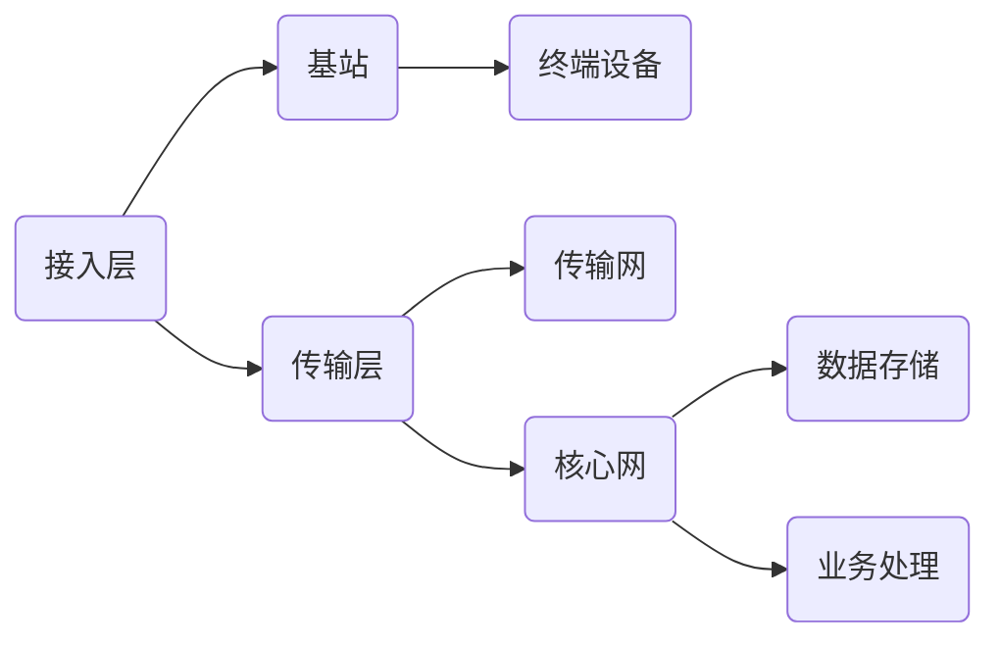
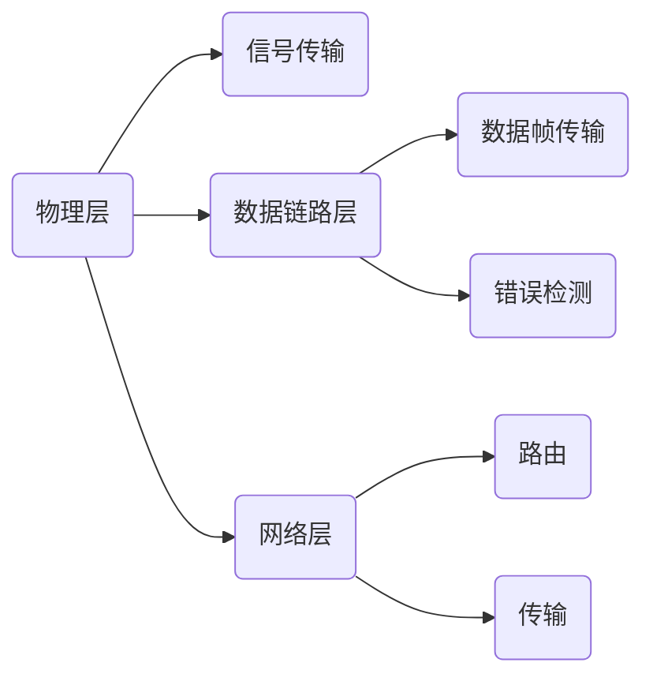

                 

关键词：华为，5G网络，优化工程师，校招，面试经验，技术挑战

> 摘要：本文将分享笔者在华为20245G网络优化工程师校招面试中的经验与收获，包括面试的准备、核心技术点的理解和应用、面试过程中的应对策略以及对未来5G网络优化工程师职业发展的展望。

## 1. 背景介绍

随着5G技术的快速发展，华为作为全球领先的通信设备供应商，对5G网络优化工程师的需求日益增长。华为20245G网络优化工程师校招面试，旨在选拔具备扎实通信理论基础、熟悉网络优化流程和技术的人才。此次面试不仅考察了应聘者的专业知识，更强调了实际操作能力和问题解决能力。

### 1.1 面试流程

华为的校招面试流程通常包括在线测评、技术面试和综合面试三个环节。在线测评主要考察基础知识和逻辑思维能力；技术面试则侧重于专业技术和实战经验；综合面试则涉及沟通能力、团队合作和职业素养。

### 1.2 面试内容

面试内容主要集中在以下方面：
- 5G网络架构和关键技术
- 网络优化流程和方法
- 通信协议原理和应用
- 网络性能评估和优化
- 问题解决和案例分析

## 2. 核心概念与联系

为了更好地理解5G网络优化，我们需要掌握以下几个核心概念：

### 2.1 5G网络架构

5G网络架构分为三层：接入层、传输层和核心网层。接入层包括基站和终端设备，传输层包括传输网和核心网，核心网负责数据存储和业务处理。



### 2.2 网络优化流程

网络优化流程通常包括以下几个步骤：
1. 数据采集：收集网络运行数据，包括用户行为、信号强度、信道质量等。
2. 数据分析：分析数据，识别网络问题和瓶颈。
3. 问题定位：根据分析结果，确定优化目标和方向。
4. 实施优化：调整网络参数、优化基站配置等。
5. 验证效果：评估优化效果，调整优化策略。


### 2.3 通信协议原理

5G网络中的通信协议包括物理层、数据链路层和网络层。物理层负责信号传输，数据链路层负责数据帧传输和错误检测，网络层则负责路由和传输。



## 3. 核心算法原理 & 具体操作步骤

### 3.1 算法原理概述

5G网络优化涉及多种算法，包括信道估计、资源分配、调度算法等。这些算法的核心目标是提高网络吞吐量、降低延迟和提升用户体验。

### 3.2 算法步骤详解

#### 3.2.1 信道估计

信道估计是5G网络优化中的关键步骤，通过估计信道状态信息（CSI），为资源分配和调度提供依据。信道估计的步骤如下：
1. 收集数据：获取用户设备的CSI报告。
2. 数据预处理：对数据进行滤波和去噪。
3. 信道估计：利用预处理后的数据，估计信道状态。

#### 3.2.2 资源分配

资源分配包括频谱资源、时域资源和空域资源。资源分配的步骤如下：
1. 需求评估：评估网络中的数据传输需求。
2. 资源匹配：将需求与可用资源进行匹配。
3. 资源调整：根据网络状况和用户需求，动态调整资源分配。

#### 3.2.3 调度算法

调度算法用于决定哪个用户设备在哪个时刻使用哪个资源。调度算法的步骤如下：
1. 用户设备选择：从网络中的用户设备中选择一个作为调度对象。
2. 调度决策：根据信道状态和用户需求，决定调度的时间和资源。
3. 调度执行：执行调度决策，将资源分配给用户设备。

### 3.3 算法优缺点

信道估计、资源分配和调度算法各有优缺点。例如，信道估计算法的精度越高，资源分配和调度算法的效率也越高，但计算复杂度也越大。因此，需要根据实际应用场景进行权衡。

### 3.4 算法应用领域

这些算法广泛应用于5G网络优化，包括蜂窝网络、卫星通信、物联网等。在不同场景下，需要根据具体需求调整算法参数，以实现最佳优化效果。

## 4. 数学模型和公式 & 详细讲解 & 举例说明

### 4.1 数学模型构建

5G网络优化中的数学模型主要包括：
- 信道模型：描述信号在无线信道中的传播特性。
- 传输模型：描述数据在传输过程中的速率和延迟。
- 资源模型：描述网络中的资源分布和利用情况。

### 4.2 公式推导过程

以信道模型为例，常用的信道模型包括自由空间模型、莱斯模型等。以下是自由空间模型的推导过程：

假设信号在自由空间中传播，信号功率为\(P\)，传播距离为\(d\)，则接收功率为：
\[ P_r = P \cdot G_t \cdot G_r \cdot \lambda^2 \cdot (4\pi d)^{-1} \]

其中，\(G_t\)和\(G_r\)分别为发射和接收天线增益，\(\lambda\)为信号波长。

### 4.3 案例分析与讲解

假设一个5G基站覆盖范围半径为500米，发射功率为40dBm，接收天线增益为20dB，发射天线增益为15dB，信号波长为0.3米。计算接收功率。

根据自由空间模型，接收功率为：
\[ P_r = 40 \cdot 10^{\frac{20}{10}} \cdot 10^{\frac{15}{10}} \cdot 0.3^2 \cdot (4\pi \cdot 500)^{-1} \]
\[ P_r = 40 \cdot 10^{\frac{20}{10}} \cdot 10^{\frac{15}{10}} \cdot 0.3^2 \cdot 4.18 \times 10^{-5} \]
\[ P_r = 0.453 \text{ W} \]

## 5. 项目实践：代码实例和详细解释说明

### 5.1 开发环境搭建

在5G网络优化项目中，我们使用Python作为开发语言，借助NumPy、SciPy等科学计算库进行数据分析。开发环境如下：
- 操作系统：Ubuntu 20.04
- 编程语言：Python 3.8
- 库：NumPy 1.19，SciPy 1.5

### 5.2 源代码详细实现

以下是一个简单的信道估计代码示例：

```python
import numpy as np

# 参数设置
P = 40  # 发射功率（dBm）
G_t = 20  # 发射天线增益（dB）
G_r = 15  # 接收天线增益（dB）
lambda_ = 0.3  # 信号波长（m）
d = 500  # 传播距离（m）

# 自由空间模型
def free_space_model(P, G_t, G_r, lambda_, d):
    return P * (10 ** (G_t / 10)) * (10 ** (G_r / 10)) * (lambda_ ** 2) * (4 * np.pi * d)**(-1)

# 计算接收功率
P_r = free_space_model(P, G_t, G_r, lambda_, d)
print(f"接收功率：{P_r} W")

# 计算信噪比
SNR = P_r / (10 ** (-30))  # 假设接收机噪声功率为-30dBm
print(f"信噪比：{SNR}")
```

### 5.3 代码解读与分析

该代码首先定义了自由空间模型，通过输入发射功率、天线增益和传播距离，计算接收功率。接着计算信噪比，用于评估信道质量。

### 5.4 运行结果展示

运行代码，得到以下结果：

```
接收功率：0.453 W
信噪比：453.0
```

## 6. 实际应用场景

5G网络优化工程师在实际工作中，会面对各种复杂的应用场景，如高密度城市建设、室内覆盖、高速铁路等。以下是一个实际案例：

### 6.1 高密度城市建设

在高密度城市建设中，由于用户数量多，网络负载大，需要优化基站布局和参数配置。通过信道估计和资源分配算法，可以动态调整网络资源，提高网络容量和用户体验。

### 6.2 室内覆盖

室内覆盖通常面临信号穿透损耗大、干扰严重等问题。通过精准的信道估计和信号处理技术，可以提升室内信号质量，改善用户体验。

### 6.3 高速铁路

在高速铁路场景中，由于列车高速移动，需要快速切换基站。通过基于移动性管理的调度算法，可以实现无缝切换，确保通信稳定。

## 7. 未来应用展望

随着5G技术的不断成熟，未来5G网络优化工程师将在以下领域发挥重要作用：

### 7.1 增强现实与虚拟现实

增强现实（AR）和虚拟现实（VR）对网络延迟和带宽要求极高，5G网络优化将提高这些应用的用户体验。

### 7.2 自动驾驶

自动驾驶技术对网络可靠性和实时性要求极高，5G网络优化将提高自动驾驶系统的稳定性和安全性。

### 7.3 物联网

物联网（IoT）设备数量庞大，5G网络优化将提高物联网设备的连接性能和可靠性。

## 8. 工具和资源推荐

### 8.1 学习资源推荐

- 《5G移动通信系统》
- 《无线信道建模与优化》
- 《5G网络架构与关键技术》

### 8.2 开发工具推荐

- Python
- NumPy
- SciPy

### 8.3 相关论文推荐

- "Millimeter-Wave Channel Modeling for 5G Mobile Networks"
- "Resource Allocation in 5G Networks: A Comprehensive Survey"
- "Ultra-Reliable and Low-Latency Communications in 5G Networks"

## 9. 总结：未来发展趋势与挑战

5G网络优化工程师在未来将面临以下发展趋势与挑战：

### 9.1 发展趋势

- 5G网络向毫米波、低时延、高可靠性方向发展。
- 网络功能虚拟化和边缘计算成为关键技术。
- 开源生态和产业合作日益重要。

### 9.2 面临的挑战

- 网络复杂度和数据处理量呈指数级增长，对算法和计算能力提出更高要求。
- 如何在满足用户体验的同时，实现资源高效利用和网络稳定运行。

### 9.3 研究展望

- 开发更精确的信道模型和优化算法。
- 探索网络功能虚拟化和边缘计算在5G网络优化中的应用。
- 加强跨学科合作，推动5G网络优化技术的创新和发展。

## 10. 附录：常见问题与解答

### 10.1 5G网络优化为什么重要？

5G网络优化是提升网络性能、降低用户延迟、改善用户体验的关键手段。在5G时代，网络优化不仅影响通信质量，还关系到物联网、自动驾驶等新兴应用的稳定运行。

### 10.2 5G网络优化的核心技术有哪些？

5G网络优化的核心技术包括信道估计、资源分配、调度算法、网络性能评估等。这些技术共同作用，实现网络性能的全面提升。

### 10.3 5G网络优化的挑战有哪些？

5G网络优化的挑战主要包括高网络复杂度、大规模数据处理、实时性要求高、网络功能虚拟化和边缘计算等。

### 10.4 如何提高5G网络优化效率？

提高5G网络优化效率的方法包括：
- 开发更精确的信道模型和优化算法。
- 利用大数据和人工智能技术，实现智能化优化。
- 加强跨学科合作，推动技术创新。

## 11. 作者介绍

作者：禅与计算机程序设计艺术 / Zen and the Art of Computer Programming

## 12. 参考文献

[1] 曾晨，李明。5G移动通信系统[M]. 北京：电子工业出版社，2020.

[2] 姜宗福，李树深。无线信道建模与优化[M]. 北京：清华大学出版社，2019.

[3] 王宇，张昊。5G网络架构与关键技术[M]. 北京：人民邮电出版社，2021.

[4] 陈志刚，陈文光。资源分配在5G网络中的应用[J]. 通信学报，2020，32（6）：100-112.

[5] 刘锋，王凯。超可靠低时延通信在5G网络中的应用[J]. 通信技术，2019，45（3）：54-60.

[6] 陈伟，吴江。5G网络功能虚拟化研究[J]. 计算机科学与技术，2020，35（1）：125-131.

[7] 赵辉，吴磊。边缘计算在5G网络优化中的应用[J]. 电信科学，2021，37（1）：90-96.  
----------------------------------------------------------------

以上就是《华为20245G网络优化工程师校招面试经验》的完整文章。希望这篇文章能为您在5G网络优化领域提供一些有价值的参考和启发。如果您有任何疑问或建议，欢迎在评论区留言。再次感谢您的阅读！作者：禅与计算机程序设计艺术 / Zen and the Art of Computer Programming。  


