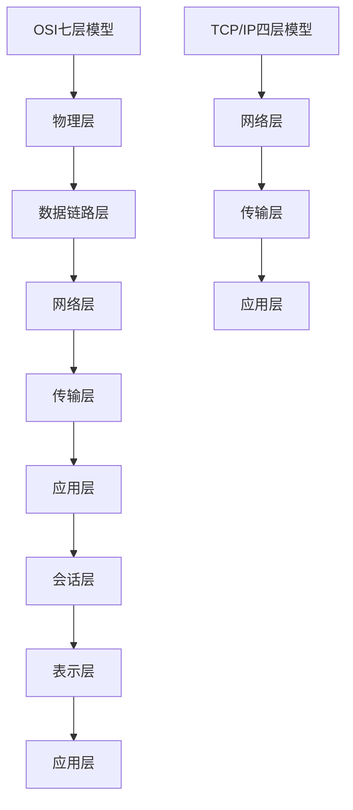

                 

关键词：华为，通信协议，面试题，解析，网络工程

摘要：本文将对华为2025年社招通信协议工程师的面试题进行详细解析，包括核心概念、算法原理、数学模型、项目实践、实际应用场景以及未来展望等内容，帮助考生更好地理解和准备面试。

## 1. 背景介绍

随着5G技术的普及和物联网的发展，通信协议工程师在当今网络行业中的地位愈发重要。华为作为全球领先的通信技术解决方案提供商，其社招通信协议工程师面试题具有很高的参考价值。本文将围绕这些面试题进行详细解析，帮助考生提升自己的专业素养和面试能力。

### 1.1 通信协议工程师的职责

通信协议工程师的主要职责包括：
- 设计和优化通信协议；
- 开发通信协议相关的软件和硬件；
- 解决通信协议在实际应用中的问题和挑战；
- 参与通信协议标准的制定和推广。

### 1.2 通信协议的分类

通信协议可以分为以下几类：
- 物理层协议：如光纤传输协议、无线电波传输协议等；
- 数据链路层协议：如以太网协议、无线局域网协议等；
- 网络层协议：如IP协议、ICMP协议等；
- 传输层协议：如TCP协议、UDP协议等；
- 应用层协议：如HTTP协议、FTP协议等。

## 2. 核心概念与联系

在通信协议工程师面试中，以下几个核心概念和联系是考生必须掌握的：

### 2.1 网络模型

网络模型分为OSI七层模型和TCP/IP四层模型，它们在通信协议的设计和实现中起到关键作用。



### 2.2 TCP/IP协议栈

TCP/IP协议栈是互联网通信的基础，包括以下协议：

- IP协议：负责数据包的路由和传输；
- TCP协议：提供可靠的数据传输服务；
- UDP协议：提供不可靠的数据传输服务；
- HTTP协议：负责超文本传输；
- FTP协议：负责文件传输；
- SMTP协议：负责电子邮件传输。

### 2.3 网络安全

网络安全是通信协议工程师必须关注的重要领域，包括以下方面：

- 防火墙技术：用于阻止非法访问；
- 加密技术：用于保护数据传输的安全性；
- 虚拟专用网络（VPN）：用于建立安全的数据传输通道；
- 入侵检测系统（IDS）：用于检测和阻止入侵行为。

## 3. 核心算法原理 & 具体操作步骤

### 3.1 算法原理概述

通信协议工程师需要掌握的核心算法包括：

- 加密算法：如RSA、AES等，用于保护数据传输的安全性；
- 分组交换算法：如Sliding Window Algorithm、Stop-and-Wait Algorithm等，用于提高数据传输的效率；
- 路由算法：如Dijkstra算法、A*算法等，用于选择最佳路径。

### 3.2 算法步骤详解

以下是对上述核心算法的具体步骤进行详解：

#### 3.2.1 RSA加密算法

- **公钥和私钥生成**：选择两个大素数p和q，计算n=p*q和φ=(p-1)*(q-1)。选择一个小于φ的整数e，使得e和φ互质，计算d，使得d*e≡1 (mod φ)。
- **加密**：将明文m转换为数字形式M，计算密文C=M^e mod n。
- **解密**：计算明文M=C^d mod n。

#### 3.2.2 Sliding Window Algorithm

- **初始化**：设定窗口大小W，设置发送窗口和接收窗口；
- **发送方**：发送窗口内的数据包，当接收到确认时，将发送窗口向前滑动；
- **接收方**：接收数据包，发送确认，当接收到新的数据包时，将接收窗口向前滑动。

#### 3.2.3 Dijkstra算法

- **初始化**：设置源点s，初始化距离表和前驱节点表；
- **选择最小距离**：在未访问节点中选择距离最小的节点v，将其标记为已访问；
- **更新距离**：对于未访问节点u，计算s到u的最短路径，如果发现更短的路径，则更新距离表和前驱节点表；
- **重复步骤2和3**，直到所有节点都被访问。

### 3.3 算法优缺点

- **RSA加密算法**：优点是安全性高，缺点是加密和解密速度较慢；
- **Sliding Window Algorithm**：优点是提高数据传输效率，缺点是实现较为复杂；
- **Dijkstra算法**：优点是计算速度快，缺点是对于大规模网络不适用。

### 3.4 算法应用领域

- **RSA加密算法**：广泛应用于网络通信、数字签名等领域；
- **Sliding Window Algorithm**：广泛应用于数据传输、流媒体等领域；
- **Dijkstra算法**：广泛应用于网络路由、图论等领域。

## 4. 数学模型和公式 & 详细讲解 & 举例说明

在通信协议工程师面试中，数学模型和公式是理解算法原理和实现的关键。以下是对核心数学模型和公式的详细讲解：

### 4.1 数学模型构建

通信协议的数学模型主要包括以下部分：

- **概率模型**：用于描述数据传输的可靠性；
- **排队模型**：用于描述网络中的流量控制；
- **拥塞控制模型**：用于描述网络中的拥塞现象；
- **信道模型**：用于描述通信信道的特性。

### 4.2 公式推导过程

以下是对核心公式的推导过程进行讲解：

#### 4.2.1 概率模型

- **概率分布函数**：用于描述随机变量的分布情况；
- **条件概率**：用于描述两个事件之间的概率关系；
- **贝叶斯公式**：用于根据已有信息更新概率估计。

#### 4.2.2 排队模型

- **到达率**：表示单位时间内到达的请求数量；
- **服务率**：表示单位时间内可以处理的服务数量；
- **排队长度**：表示等待处理的请求数量；
- **平均等待时间**：表示等待处理的平均时间。

#### 4.2.3 拥塞控制模型

- **吞吐量**：表示网络中传输的数据量；
- **拥塞窗口**：表示发送方的发送窗口大小；
- **慢启动**：表示拥塞控制策略的一种；
- **拥塞避免**：表示拥塞控制策略的一种。

### 4.3 案例分析与讲解

以下是对核心公式的应用进行案例分析：

#### 4.3.1 概率模型

- **案例**：假设数据包的传输失败概率为0.1，求传输100个数据包后至少有一个数据包传输成功的概率。
- **解答**：使用概率分布函数和条件概率，可以计算出至少有一个数据包传输成功的概率为1-0.1^100。

#### 4.3.2 排队模型

- **案例**：假设到达率为10个请求/秒，服务率为5个请求/秒，求平均等待时间。
- **解答**：使用排队模型的相关公式，可以计算出平均等待时间为10/2=5秒。

#### 4.3.3 拥塞控制模型

- **案例**：假设拥塞窗口初始值为1，每次传输成功后窗口大小增加1，求传输100个数据包后的拥塞窗口大小。
- **解答**：使用拥塞控制模型的相关公式，可以计算出传输100个数据包后的拥塞窗口大小为100。

## 5. 项目实践：代码实例和详细解释说明

以下是一个简单的TCP连接建立和断开的代码实例，用于帮助考生理解通信协议的实现过程：

### 5.1 开发环境搭建

- **操作系统**：Windows/Linux/MacOS；
- **编程语言**：Python/C/C++/Java；
- **网络库**：Socket编程库。

### 5.2 源代码详细实现

以下是一个简单的Python代码实例，用于实现TCP连接的建立和断开：

```python
import socket

def create_server():
    # 创建socket对象
    server_socket = socket.socket(socket.AF_INET, socket.SOCK_STREAM)
    
    # 绑定IP地址和端口号
    server_socket.bind(('localhost', 8080))
    
    # 监听客户端连接
    server_socket.listen(5)
    
    print("服务器已启动，等待连接...")
    
    # 接受客户端连接
    client_socket, client_address = server_socket.accept()
    print(f"已连接到客户端：{client_address}")
    
    # 发送数据
    client_socket.send(b"Hello, client!")
    
    # 接收数据
    data = client_socket.recv(1024)
    print(f"接收到的数据：{data.decode()}")

    # 断开连接
    client_socket.close()
    server_socket.close()

def create_client():
    # 创建socket对象
    client_socket = socket.socket(socket.AF_INET, socket.SOCK_STREAM)
    
    # 连接服务器
    server_address = ('localhost', 8080)
    client_socket.connect(server_address)
    
    print("已连接到服务器...")
    
    # 发送数据
    client_socket.send(b"Hello, server!")
    
    # 接收数据
    data = client_socket.recv(1024)
    print(f"接收到的数据：{data.decode()}")

    # 断开连接
    client_socket.close()

if __name__ == '__main__':
    create_server()
    create_client()
```

### 5.3 代码解读与分析

- **创建服务器端**：使用socket库创建服务器端socket对象，绑定IP地址和端口号，并监听客户端连接；
- **创建客户端**：使用socket库创建客户端socket对象，连接到服务器端IP地址和端口号；
- **发送和接收数据**：客户端和服务器端通过send和recv方法进行数据传输；
- **断开连接**：客户端和服务器端通过close方法断开连接。

## 6. 实际应用场景

通信协议工程师在实际工作中会遇到多种应用场景，以下列举几个常见的应用场景：

### 6.1 无线通信

无线通信是通信协议工程师的一个重要应用领域，涉及无线局域网、蜂窝网络、卫星通信等。例如，5G网络的实现就需要通信协议工程师参与设计、开发和优化无线通信协议。

### 6.2 物联网

物联网（IoT）的快速发展为通信协议工程师提供了广阔的应用空间。通信协议工程师可以参与物联网设备的连接、数据传输和安全性设计，如蓝牙、ZigBee、LoRa等协议。

### 6.3 云计算

云计算的兴起对通信协议工程师提出了新的要求。通信协议工程师需要设计、优化和实现云平台内部的通信协议，如分布式存储协议、分布式计算协议等。

### 6.4 安全通信

安全通信是通信协议工程师必须关注的重要领域。通信协议工程师可以参与设计、开发和实现安全通信协议，如VPN、TLS等，以保护数据传输的安全性和隐私。

## 7. 工具和资源推荐

为了更好地学习和实践通信协议，以下推荐一些工具和资源：

### 7.1 学习资源推荐

- **书籍**：《计算机网络自顶向下方法》、《TCP/IP详解卷1：协议》、《计算机网络原理》；
- **在线课程**：Coursera上的《计算机网络》课程、edX上的《计算机网络与网络安全》课程；
- **博客**：国外著名博客sitepoint、Baeldung，国内著名博客CSDN、博客园。

### 7.2 开发工具推荐

- **网络模拟器**：GNS3、Mininet，用于模拟和测试网络协议；
- **协议分析工具**：Wireshark，用于捕获和分析网络数据包；
- **编程语言**：Python、C、C++，用于编写网络协议相关的代码。

### 7.3 相关论文推荐

- **IEEE论文**：IEEE Transactions on Networking、IEEE Transactions on Communications等；
- **ACM论文**：ACM Transactions on Computer Systems、ACM Transactions on Networking等。

## 8. 总结：未来发展趋势与挑战

### 8.1 研究成果总结

近年来，通信协议工程师在5G、物联网、云计算等领域取得了显著的成果。5G技术的普及推动了通信协议的革新，物联网的快速发展为通信协议工程师提供了新的应用场景，云计算的兴起对通信协议的性能和安全性提出了更高的要求。

### 8.2 未来发展趋势

未来，通信协议工程师将在以下几个方面继续发展：

- **5G技术的进一步普及和应用**：5G技术将在更多领域得到应用，如自动驾驶、智慧城市等；
- **物联网的深度融合**：通信协议工程师将参与物联网设备连接、数据传输和安全性设计；
- **云计算和边缘计算的结合**：通信协议工程师将设计和优化云计算平台内部的通信协议，以及边缘计算中的通信协议。

### 8.3 面临的挑战

未来，通信协议工程师将面临以下几个挑战：

- **高带宽和低延迟的需求**：随着应用的不断发展，对通信协议的带宽和延迟要求越来越高；
- **安全性和隐私保护**：随着网络攻击手段的不断升级，通信协议工程师需要不断提升安全性和隐私保护能力；
- **协议复杂度和兼容性问题**：随着新技术的不断涌现，通信协议的复杂度和兼容性问题将越来越突出。

### 8.4 研究展望

未来，通信协议工程师的研究方向包括：

- **新型通信协议的设计与优化**：如基于区块链的通信协议、基于量子通信的协议等；
- **网络性能的评估与优化**：研究通信协议在网络性能评估和优化方面的应用；
- **边缘计算中的通信协议**：研究边缘计算场景下的通信协议设计、优化和应用。

## 9. 附录：常见问题与解答

### 9.1 通信协议工程师的职责是什么？

通信协议工程师的主要职责包括设计和优化通信协议、开发通信协议相关的软件和硬件、解决通信协议在实际应用中的问题和挑战、参与通信协议标准的制定和推广。

### 9.2 通信协议有哪些分类？

通信协议可以分为物理层协议、数据链路层协议、网络层协议、传输层协议和应用层协议。

### 9.3 TCP/IP协议栈包括哪些协议？

TCP/IP协议栈包括IP协议、TCP协议、UDP协议、HTTP协议、FTP协议和SMTP协议等。

### 9.4 如何解决通信协议中的安全问题？

解决通信协议中的安全问题可以采用加密技术、防火墙技术、虚拟专用网络（VPN）和入侵检测系统（IDS）等技术。

### 9.5 通信协议工程师需要掌握哪些核心算法？

通信协议工程师需要掌握的核心算法包括加密算法、分组交换算法和路由算法等。

### 9.6 通信协议工程师未来有哪些发展机会？

通信协议工程师在未来将在5G、物联网、云计算等领域有广阔的发展机会，如设计新型通信协议、优化网络性能、解决安全性问题等。

## 作者署名

作者：禅与计算机程序设计艺术 / Zen and the Art of Computer Programming
----------------------------------------------------------------


