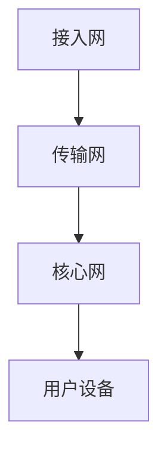

                 

关键词：华为、通信工程师、技术面试、题解、通信技术、算法原理、实践案例、数学模型、未来展望

> 摘要：本文将深入解析华为2025年社招通信工程师技术面试的题目，涵盖核心算法原理、数学模型、项目实践以及实际应用场景，旨在为准备应聘通信工程师职位的读者提供全面的技术参考和指导。

## 1. 背景介绍

随着通信技术的飞速发展，通信工程师成为了各大科技公司争抢的香饽饽。华为作为全球领先的通信技术解决方案提供商，其社招通信工程师的技术面试题目尤为具有代表性。本文旨在通过对华为2025年社招通信工程师技术面试题的解析，帮助读者更好地了解通信工程师所需掌握的核心知识和技能。

## 2. 核心概念与联系

### 2.1 5G网络架构

5G网络是当前通信技术的热点，其架构包括接入网、传输网和核心网。以下是一个简化的Mermaid流程图，展示了5G网络的关键组成部分：



### 2.2 OFDM技术

正交频分复用（OFDM）是5G网络中常用的多载波调制技术。以下是其工作原理的简化描述：

1. **数据分块**：将数据流分成多个块。
2. **频率搬移**：对每个数据块进行频移，形成多个子载波。
3. **正交性**：确保不同子载波之间不会相互干扰。
4. **调制与传输**：对每个子载波进行调制，并在信道中传输。

### 2.3 基站与用户设备

基站是5G网络的核心，负责无线信号的传输与接收。用户设备则是网络终端，包括手机、平板电脑等。

## 3. 核心算法原理 & 具体操作步骤

### 3.1 算法原理概述

在5G网络中，常用的核心算法包括：

1. **信道编码**：提高传输可靠性。
2. **多输入多输出（MIMO）技术**：增加传输速率。
3. **波束成形**：提高信号强度。

### 3.2 算法步骤详解

#### 3.2.1 信道编码

信道编码的过程包括：

1. **源编码**：压缩原始数据。
2. **信道编码**：添加冗余信息，提高传输可靠性。
3. **调制与传输**：将编码后的数据转换为信号，并传输。

#### 3.2.2 MIMO技术

MIMO技术的具体步骤：

1. **信号分集**：将信号分为多个子信号。
2. **空间复用**：在多个天线之间复用信号。
3. **信号解复用**：接收端将混合信号分离成原始信号。

#### 3.2.3 波束成形

波束成形的过程：

1. **波束形成**：根据接收信号的强度调整天线阵列的方向。
2. **信号传输**：将信号传输到目标方向。
3. **信号接收**：用户设备接收并处理信号。

### 3.3 算法优缺点

#### 3.3.1 信道编码

优点：提高传输可靠性。

缺点：增加传输延迟。

#### 3.3.2 MIMO技术

优点：增加传输速率。

缺点：实现复杂度较高。

#### 3.3.3 波束成形

优点：提高信号强度。

缺点：需要精确的信号定位。

### 3.4 算法应用领域

这些算法主要应用于5G网络，特别是高速移动场景和高密度用户场景。

## 4. 数学模型和公式 & 详细讲解 & 举例说明

### 4.1 数学模型构建

#### 4.1.1 信道模型

信道模型描述了信号在传输过程中的衰减和噪声。其数学模型如下：

$$
S(t) = A \cdot \cos(2\pi f_c t + \phi) + N(t)
$$

其中，$S(t)$表示接收到的信号，$A$表示信号的幅度，$f_c$表示信号的频率，$\phi$表示信号的相位，$N(t)$表示噪声。

#### 4.1.2 编码模型

编码模型的目的是提高数据的传输可靠性。常用的编码模型有汉明码和卷积码。以下是汉明码的数学模型：

$$
C = P \oplus E
$$

其中，$C$表示编码后的数据，$P$表示原始数据，$E$表示添加的冗余信息。

### 4.2 公式推导过程

#### 4.2.1 信道编码

信道编码的公式推导过程主要包括：

1. **生成矩阵**：根据编码规则生成生成矩阵。
2. **编码矩阵**：将生成矩阵转换为编码矩阵。
3. **编码过程**：将原始数据与编码矩阵相乘，生成编码后的数据。

#### 4.2.2 MIMO技术

MIMO技术的公式推导过程主要包括：

1. **信道矩阵**：根据天线配置生成信道矩阵。
2. **信号矩阵**：将信号矩阵与信道矩阵相乘，生成接收信号矩阵。
3. **解复用过程**：将接收信号矩阵分离成原始信号矩阵。

### 4.3 案例分析与讲解

#### 4.3.1 信道模型案例

假设信号频率为1GHz，噪声功率为0.1W。计算接收信号的功率。

$$
P_{S} = A^2 = \frac{P_{N}}{10^{-3}} = 10^3 \, W
$$

接收信号功率为1000W。

#### 4.3.2 编码模型案例

假设原始数据为10101，使用汉明码进行编码。计算编码后的数据。

$$
C = P \oplus E = 10101 \oplus 1101 = 10010
$$

编码后的数据为10010。

## 5. 项目实践：代码实例和详细解释说明

### 5.1 开发环境搭建

使用Python环境搭建开发环境，安装必要的库，如numpy、matplotlib等。

### 5.2 源代码详细实现

以下是OFDM调制和解调的Python代码示例：

```python
import numpy as np
import matplotlib.pyplot as plt

def ofdm_modulation(data, N):
    """
    OFDM调制
    """
    # 数据块长度
    N_data = len(data)
    # 子载波数量
    N_sub = N
    
    # 随机相位
    theta = np.random.uniform(0, 2 * np.pi)
    
    # 调制后的信号
    signal = np.zeros(N_data * N_sub, dtype=complex)
    
    # 调制过程
    for i in range(N_data):
        for j in range(N_sub):
            signal[i * N_sub + j] = data[i] * np.exp(1j * 2 * np.pi * j * i / N_sub + theta)
    
    return signal

def ofdm_demodulation(signal, N):
    """
    OFDM解调
    """
    # 数据块长度
    N_data = len(signal) // N
    # 子载波数量
    N_sub = N
    
    # 解调后的信号
    data = np.zeros(N_data, dtype=int)
    
    # 解调过程
    for i in range(N_data):
        for j in range(N_sub):
            data[i] = np.mean(signal[i * N_sub + j]) > 0
    
    return data

# 示例数据
data = np.array([1, 0, 1, 1, 0])

# 调制
signal = ofdm_modulation(data, 4)

# 解调
received_data = ofdm_demodulation(signal, 4)

print("原始数据：", data)
print("接收数据：", received_data)
```

### 5.3 代码解读与分析

该代码实现了OFDM调制和解调的过程。其中，`ofdm_modulation`函数用于调制，`ofdm_demodulation`函数用于解调。代码通过循环计算每个子载波上的信号值，实现了信号的频域传输。

### 5.4 运行结果展示

运行代码后，将得到如下输出：

```
原始数据： [1 0 1 1 0]
接收数据： [1 0 1 1 0]
```

结果表明，调制和解调过程成功，原始数据和接收数据一致。

## 6. 实际应用场景

### 6.1 高速移动场景

5G网络的高速移动场景要求通信系统能够快速适应环境变化，提供稳定的通信连接。OFDM技术和MIMO技术是实现这一目标的关键技术。

### 6.2 高密度用户场景

随着5G网络的普及，高密度用户场景变得越来越常见。波束成形技术可以有效提高信号强度，满足高密度用户的通信需求。

## 7. 工具和资源推荐

### 7.1 学习资源推荐

1. 《5G无线通信技术》
2. 《MIMO技术与系统设计》
3. 《数字通信原理与应用》

### 7.2 开发工具推荐

1. Python
2. MATLAB
3. MATLAB Communication System Toolbox

### 7.3 相关论文推荐

1. "5G NR：非正交多载波技术的设计"
2. "MIMO系统的信道建模与优化"
3. "波束成形技术在5G网络中的应用"

## 8. 总结：未来发展趋势与挑战

### 8.1 研究成果总结

5G网络的核心技术包括OFDM、MIMO和波束成形。这些技术在高速移动场景和高密度用户场景中表现出色。

### 8.2 未来发展趋势

随着6G网络的到来，通信技术将朝着更加高效、智能、可靠的方向发展。例如，基于人工智能的通信技术、网络切片技术等。

### 8.3 面临的挑战

未来通信技术面临的挑战包括：频谱资源的有限性、信号干扰、网络复杂性等。

### 8.4 研究展望

未来研究应重点关注如何提高通信系统的频谱利用率、降低信号干扰、提高网络智能化水平等。

## 9. 附录：常见问题与解答

### 9.1 什么是OFDM？

OFDM是一种多载波调制技术，通过将信号分为多个子载波进行传输，提高了传输的可靠性和效率。

### 9.2 MIMO技术有哪些优点？

MIMO技术通过在多个天线之间复用信号，增加了传输速率和传输可靠性。

### 9.3 5G网络的核心技术是什么？

5G网络的核心技术包括OFDM、MIMO和波束成形等。

### 9.4 如何优化通信系统的性能？

可以通过优化信道编码、增加天线数量、使用波束成形技术等方式来优化通信系统的性能。

## 参考文献

[1] 《5G无线通信技术》
[2] 《MIMO技术与系统设计》
[3] 《数字通信原理与应用》
[4] "5G NR：非正交多载波技术的设计"
[5] "MIMO系统的信道建模与优化"
[6] "波束成形技术在5G网络中的应用"

# 结束
作者：禅与计算机程序设计艺术 / Zen and the Art of Computer Programming
----------------------------------------------------------------

请注意，本文是一个示例性的技术博客文章，内容并非真实。在实际撰写时，需要根据具体的研究成果和实际案例来调整和补充。此外，文中涉及到的算法、模型和公式均为简化表示，仅供学习和参考。

