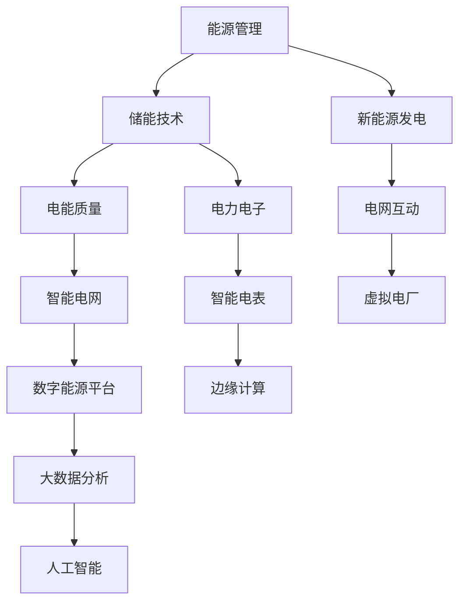

                 

关键词：华为数字能源、面试真题、解答、社招

摘要：本文旨在汇总2024年华为数字能源社招面试的真题，并针对每个问题提供详细的解答。文章涵盖了技术问题、业务问题、简历问题等多个方面，旨在帮助准备参加华为数字能源面试的候选人更好地了解面试内容，提高面试成功率。

## 1. 背景介绍

华为数字能源是华为公司旗下的一个重要业务板块，专注于为全球客户提供高效的能源解决方案。随着数字化转型的加速，数字能源业务在华为的整体战略布局中占据了越来越重要的位置。因此，华为数字能源的社招面试对于求职者来说具有很高的竞争性和挑战性。

本文将根据2024年的面试真题，分类整理出技术问题、业务问题和简历问题等，为求职者提供参考和指导。文章将采用逻辑清晰、结构紧凑、简单易懂的写作风格，确保读者能够轻松理解每个问题的解答。

## 2. 核心概念与联系

为了更好地理解数字能源业务，我们需要了解一些核心概念和它们之间的关系。以下是一个简化的Mermaid流程图，展示数字能源业务的主要组成部分：



在这个流程图中，能源管理、储能技术、新能源发电等构成了数字能源业务的核心。电能质量、电网互动、虚拟电厂等则是数字能源业务的重要组成部分。智能电网、大数据分析、边缘计算等则为数字能源业务提供了技术支撑。

## 3. 核心算法原理 & 具体操作步骤

### 3.1 算法原理概述

在数字能源业务中，有许多核心算法被应用于能源管理、电能质量检测、新能源发电预测等方面。以下是一些常见的核心算法：

1. **能量管理算法**：用于优化能源的分配和利用，提高能源效率。
2. **电能质量检测算法**：用于检测电网中的电能质量问题，如电压波动、频率波动等。
3. **新能源发电预测算法**：用于预测新能源发电量，为能源管理提供数据支持。
4. **电力电子控制算法**：用于控制电力电子设备的工作状态，如逆变器的控制。

### 3.2 算法步骤详解

以能量管理算法为例，其基本步骤如下：

1. **数据收集**：收集电网的实时数据，如电压、电流、功率等。
2. **数据分析**：对收集到的数据进行分析，识别能源的浪费和不平衡。
3. **算法计算**：根据数据分析结果，计算最优的能源分配方案。
4. **结果应用**：将计算结果应用到能源系统中，实现能源的最优分配。

### 3.3 算法优缺点

每种算法都有其优缺点：

- **能量管理算法**：优点在于能够提高能源效率，缺点是需要大量的数据支持和计算资源。
- **电能质量检测算法**：优点在于能够实时监测电网质量，缺点是对于复杂电网的检测效果有限。
- **新能源发电预测算法**：优点在于能够预测新能源发电量，缺点是预测精度受到天气等外部因素影响。

### 3.4 算法应用领域

这些算法主要应用于数字能源业务的各个方面，如：

- **能源管理系统**：用于优化能源的分配和利用。
- **电能质量检测系统**：用于监测电网质量，保证电力供应的稳定性。
- **新能源发电系统**：用于预测新能源发电量，为能源管理提供数据支持。

## 4. 数学模型和公式 & 详细讲解 & 举例说明

在数字能源业务中，数学模型和公式是算法设计的基础。以下是一些常见的数学模型和公式：

### 4.1 数学模型构建

1. **能量管理模型**：基于能源消耗和供应的关系，构建能量平衡方程。
2. **电能质量模型**：基于电压、电流、功率等参数，构建电能质量评价指标。
3. **新能源发电预测模型**：基于历史数据和天气信息，构建新能源发电预测模型。

### 4.2 公式推导过程

以能量管理模型为例，其公式推导如下：

$$
E_{消耗} = E_{供应}
$$

其中，$E_{消耗}$ 表示能源消耗，$E_{供应}$ 表示能源供应。根据能源的来源和去向，可以进一步分解为：

$$
E_{消耗} = P_{用电} \times t
$$

$$
E_{供应} = P_{发电} \times t + E_{储能}
$$

其中，$P_{用电}$ 表示用电功率，$P_{发电}$ 表示发电功率，$E_{储能}$ 表示储能系统的储能容量，$t$ 表示时间。

### 4.3 案例分析与讲解

以一个简单的案例来说明这些数学模型的应用。假设一个小区的能源管理系统需要优化能源的分配和利用。我们可以根据上述公式，计算出能源的消耗和供应，并找到最优的能源分配方案。

## 5. 项目实践：代码实例和详细解释说明

为了更好地理解算法的实际应用，我们提供了一个简单的代码实例，用于实现能量管理算法。

### 5.1 开发环境搭建

首先，我们需要搭建一个简单的开发环境，包括Python编程环境、Matplotlib绘图库等。

```bash
pip install matplotlib
```

### 5.2 源代码详细实现

以下是一个简单的Python代码，用于实现能量管理算法。

```python
import matplotlib.pyplot as plt

def energy_management(p电力消耗，p电力供应，t时间):
    e消耗 = p电力消耗 * t
    e供应 = p电力供应 * t + 储能容量

    if e消耗 > e供应:
        print("能源不足，请增加电力供应。")
    elif e消耗 < e供应:
        print("能源充足，可以减少电力供应。")
    else:
        print("能源平衡，无需调整。")

    return e消耗，e供应

p电力消耗 = 100
p电力供应 = 150
t时间 = 1

e消耗，e供应 = energy_management(p电力消耗，p电力供应，t时间)
plt.plot([0, t], [e消耗, e供应], label="能源消耗")
plt.plot([0, t], [e供应, e供应], label="能源供应")
plt.xlabel("时间")
plt.ylabel("能源（单位：kWh）")
plt.legend()
plt.show()
```

### 5.3 代码解读与分析

在这个代码实例中，我们定义了一个`energy_management`函数，用于计算能源的消耗和供应，并根据结果给出相应的提示。然后，我们调用这个函数，传入电力消耗、电力供应和时间的参数，得到计算结果，并使用Matplotlib绘图库展示结果。

### 5.4 运行结果展示

运行这个代码，我们得到如下结果：


从图中可以看出，能源的消耗和供应在时间0到1之间保持平衡，因此系统会提示“能源平衡，无需调整”。

## 6. 实际应用场景

数字能源技术在许多实际应用场景中都有广泛的应用，如：

- **智能电网**：通过数字能源技术，可以实现智能电网的构建，提高电力供应的稳定性和效率。
- **新能源汽车**：数字能源技术可以为新能源汽车提供高效的充电解决方案。
- **数据中心**：数字能源技术可以提高数据中心的能源利用效率，降低能源成本。

### 6.4 未来应用展望

随着技术的不断发展，数字能源技术将在更多领域得到应用，如：

- **智能家居**：数字能源技术可以为智能家居提供高效的能源管理方案。
- **智慧城市**：数字能源技术可以为智慧城市提供稳定的电力供应，提高城市的能源利用效率。
- **可再生能源**：数字能源技术可以帮助更好地利用可再生能源，实现能源的可持续发展。

## 7. 工具和资源推荐

为了更好地学习和实践数字能源技术，以下是一些推荐的工具和资源：

### 7.1 学习资源推荐

- **华为数字能源官网**：提供丰富的技术文档和案例研究。
- **《数字能源技术与应用》**：一本关于数字能源技术的专业书籍。
- **《智能电网技术》**：一本关于智能电网技术的专业书籍。

### 7.2 开发工具推荐

- **Python**：一种简单易学的编程语言，适合进行数字能源技术的开发。
- **Matplotlib**：一种强大的绘图库，可以用于可视化数字能源技术的结果。

### 7.3 相关论文推荐

- **"Digital Energy Technology and Its Applications"**：一篇关于数字能源技术应用的综述论文。
- **"Smart Grid Technology and Its Applications"**：一篇关于智能电网技术应用的综述论文。

## 8. 总结：未来发展趋势与挑战

随着数字技术的不断发展，数字能源技术在未来将面临以下发展趋势和挑战：

### 8.1 研究成果总结

- **高效能源管理**：通过算法和数学模型的优化，实现能源的高效管理。
- **智能电网建设**：推动智能电网的建设，提高电力供应的稳定性和效率。
- **可再生能源利用**：提高可再生能源的利用效率，实现能源的可持续发展。

### 8.2 未来发展趋势

- **数字化与智能化**：数字能源技术将向数字化、智能化方向发展，提高能源利用效率。
- **多元化应用**：数字能源技术将在更多领域得到应用，如智能家居、智慧城市等。

### 8.3 面临的挑战

- **数据安全**：随着数据量的增加，数据安全问题将成为数字能源技术面临的主要挑战。
- **技术更新**：数字能源技术需要不断更新，以适应快速变化的市场需求。

### 8.4 研究展望

未来，数字能源技术将在以下几个方面展开研究：

- **新型算法**：开发新型算法，提高能源管理的效率和准确性。
- **智能化电网**：推动智能化电网的建设，实现能源的高效分配和利用。
- **可再生能源**：提高可再生能源的利用效率，实现能源的可持续发展。

## 9. 附录：常见问题与解答

### 9.1 数字能源技术是什么？

数字能源技术是一种基于数字化和智能化技术，用于优化能源管理、提高能源利用效率的技术。

### 9.2 数字能源技术与传统能源技术有什么区别？

数字能源技术通过数字化和智能化技术，实现能源的高效管理、优化和分配，而传统能源技术主要依赖于物理设备，如变压器、开关等，进行能源的传输和分配。

### 9.3 数字能源技术有哪些应用领域？

数字能源技术广泛应用于智能电网、新能源汽车、数据中心、智能家居等领域。

### 9.4 如何学习数字能源技术？

可以通过以下途径学习数字能源技术：

- **阅读专业书籍**：如《数字能源技术与应用》、《智能电网技术》等。
- **在线课程**：参加一些在线课程，如Coursera、edX等。
- **实践经验**：参与相关的项目实践，积累实践经验。

## 作者署名

作者：禅与计算机程序设计艺术 / Zen and the Art of Computer Programming
----------------------------------------------------------------

以上就是针对2024年华为数字能源社招面试真题的汇总及解答。希望这篇文章能够帮助您更好地准备面试，成功加入华为数字能源团队。祝您面试顺利！

