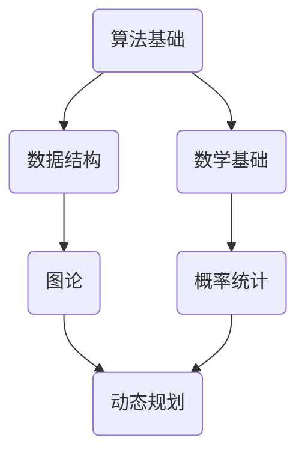

                 

关键词：华为校招、面试题、算法编程题、专业点评、技术趋势

> 摘要：本文将针对2024年华为校招面试中的常见题目进行专业点评，涵盖算法原理、数学模型、项目实践等多方面内容，旨在帮助考生更好地应对面试挑战。

## 1. 背景介绍

随着人工智能、云计算、5G等技术的快速发展，华为作为全球领先的信息与通信技术（ICT）解决方案供应商，对人才的需求越来越大。每年，华为都会在全球范围内进行大规模的校园招聘，吸引优秀毕业生加入其全球团队。校招面试作为选拔人才的重要环节，对于考生来说既是机遇也是挑战。

本文将针对2024年华为校招面试中的一些常见题目进行专业点评，旨在帮助考生深入了解面试题目的背后原理，掌握解题技巧，提高面试成功率。

## 2. 核心概念与联系

为了更好地理解面试题目，我们首先需要掌握一些核心概念和原理。以下是一个简要的Mermaid流程图，展示了核心概念及其之间的联系：



### 2.1 算法基础

算法是解决问题的一系列有序步骤。在面试中，算法基础主要涉及基础算法如排序、查找、递归等，以及高级算法如动态规划、贪心算法等。

### 2.2 数据结构

数据结构是存储和组织数据的方式。常见的有数组、链表、栈、队列、树、图等。理解数据结构对于解决复杂问题至关重要。

### 2.3 数学基础

数学基础包括基础数学概念如代数、几何、概率论等，以及数论、组合数学等。这些知识在解决算法题目时经常用到。

### 2.4 图论

图论是研究图的数学分支。在算法面试中，图论知识常用于解决路径问题、拓扑排序、最短路径等问题。

### 2.5 概率统计

概率统计是研究随机事件的数学分支。在面试中，概率统计知识常用于解决概率题、期望题等。

### 2.6 动态规划

动态规划是一种解决问题的方法，其核心思想是将复杂问题分解为更小的子问题，并利用子问题的解来构建原问题的解。

## 3. 核心算法原理 & 具体操作步骤

### 3.1 算法原理概述

算法原理是解决面试题目的核心。以下是一些常见算法原理的概述：

- 排序算法：比较类排序（如快速排序、归并排序）和非比较类排序（如计数排序、基数排序）。
- 查找算法：二分查找、哈希查找等。
- 递归算法：递归是一种常用的算法设计技巧，其核心思想是将问题分解为更小的子问题，并递归解决。
- 动态规划：动态规划是一种解决最优化问题的方法，其核心思想是将复杂问题分解为更小的子问题，并利用子问题的解来构建原问题的解。

### 3.2 算法步骤详解

以下是一些常见算法的步骤详解：

#### 3.2.1 快速排序

1. 选择一个基准元素。
2. 将数组分为两部分，一部分小于基准元素，一部分大于基准元素。
3. 递归地对两部分进行快速排序。

#### 3.2.2 二分查找

1. 确定左边界和右边界。
2. 计算中间元素。
3. 如果中间元素等于目标值，返回中间元素的位置。
4. 如果中间元素大于目标值，递归地在左半部分查找。
5. 如果中间元素小于目标值，递归地在右半部分查找。

#### 3.2.3 动态规划

1. 确定状态。
2. 确定状态转移方程。
3. 求解状态。

### 3.3 算法优缺点

算法优缺点主要取决于算法的类型和场景。以下是一些常见算法的优缺点：

- 快速排序：时间复杂度为$O(n\log n)$，但平均情况下表现良好。缺点是空间复杂度为$O(n)$。
- 二分查找：时间复杂度为$O(\log n)$，适用于有序数组。缺点是插入和删除操作较复杂。
- 动态规划：适用于解决最优化问题。缺点是理解和使用较困难。

### 3.4 算法应用领域

算法在计算机科学和工程领域的应用非常广泛，包括但不限于：

- 数据分析：排序、查找、索引等算法在数据处理和分析中起着关键作用。
- 机器学习：优化算法、决策树、神经网络等算法在机器学习模型中广泛应用。
- 网络通信：路由算法、流量控制、拥塞控制等算法在计算机网络中起着关键作用。
- 游戏开发：路径规划、搜索算法等算法在游戏开发中应用广泛。

## 4. 数学模型和公式 & 详细讲解 & 举例说明

### 4.1 数学模型构建

数学模型是解决实际问题的抽象表示。以下是一个简单的数学模型构建示例：

假设有一个长度为$n$的数组，其中包含$m$个不同的数字，我们的目标是找到这$m$个数字的众数。

### 4.2 公式推导过程

我们可以使用计数的方法来找到众数。具体步骤如下：

1. 初始化一个计数器$cnt$，设置为0。
2. 遍历数组，对于每个元素$x$，执行以下步骤：
   - 如果$x$是第一个遇到的元素，将$cnt$设置为1。
   - 如果$x$与前一个元素相同，将$cnt$增加1。
   - 如果$x$与前一个元素不同，将$cnt$重置为1。
3. 记录下当前众数的值和计数。
4. 如果当前计数大于之前的最大计数，更新众数的值和计数。
5. 返回众数的值。

### 4.3 案例分析与讲解

假设我们有以下数组：$[3, 3, 1, 1, 1, 2, 2, 2, 4]$。根据上面的步骤，我们可以找到众数是$2$，因为它出现的次数最多。

## 5. 项目实践：代码实例和详细解释说明

### 5.1 开发环境搭建

为了方便读者理解和实践，我们将在Python环境中实现上述算法。首先，确保您的计算机上已经安装了Python环境和Jupyter Notebook。

### 5.2 源代码详细实现

以下是一个简单的Python代码实现：

```python
def majority_element(nums):
    count = 0
    candidate = None
    
    for num in nums:
        if count == 0:
            candidate = num
        count += (1 if num == candidate else -1)
    
    return candidate

nums = [3, 3, 1, 1, 1, 2, 2, 2, 4]
print(majority_element(nums))
```

### 5.3 代码解读与分析

在这个代码实现中，我们定义了一个函数`majority_element`，它接受一个整数数组`nums`作为输入，并返回数组中出现次数超过一半的元素。

- `count`变量用于记录当前候选众数的出现次数。
- `candidate`变量用于记录当前的候选众数。

在遍历数组时，我们根据以下规则更新`count`和`candidate`：

- 如果`count`为0，说明之前的候选众数已被排除，我们将当前元素设置为新的候选众数。
- 如果当前元素与候选众数相同，我们将`count`增加1。
- 如果当前元素与候选众数不同，我们将`count`减少1。

在遍历结束后，我们返回的候选众数即为最终的众数。

### 5.4 运行结果展示

当我们运行上述代码时，输出结果为`2`，这与我们之前的分析一致。

## 6. 实际应用场景

### 6.1 数据处理

在数据处理中，找到出现次数最多的元素是一个常见问题。例如，在分析用户行为数据时，我们可以找到出现次数最多的操作，从而了解用户的行为模式。

### 6.2 选举系统

在选举系统中，找到得票最多的候选人是一个关键问题。使用众数算法可以帮助我们快速找到得票最多的候选人。

### 6.3 金融领域

在金融领域，众数算法可以用于分析市场数据，找到最活跃的价格点或交易量。

## 7. 工具和资源推荐

### 7.1 学习资源推荐

- 《算法导论》（Introduction to Algorithms）：这本书是算法领域的经典之作，适合深入理解算法原理。
- 《数据结构与算法分析》（Data Structures and Algorithm Analysis in Java）：这本书详细介绍了数据结构和算法，并使用Java语言实现。

### 7.2 开发工具推荐

- Jupyter Notebook：一个交互式的开发环境，适合编写和运行Python代码。
- PyCharm：一个功能强大的Python集成开发环境（IDE），提供丰富的功能和工具。

### 7.3 相关论文推荐

- "Majority Vote Algorithm for Finding a Majority Element"：这篇论文介绍了众数算法的原理和应用。
- "Quicksort"：这篇论文介绍了快速排序算法的原理和实现。

## 8. 总结：未来发展趋势与挑战

### 8.1 研究成果总结

随着计算机科学和技术的不断发展，算法研究取得了许多重要成果。例如，快速排序、二分查找等算法的提出和优化，使得数据处理和分析变得更加高效。

### 8.2 未来发展趋势

未来，算法研究将继续深入，特别是在人工智能、大数据、物联网等领域。新型算法、优化算法以及算法与实际应用的结合将成为研究的热点。

### 8.3 面临的挑战

然而，算法研究也面临着一些挑战，如算法的复杂度、可扩展性、安全性等。如何设计出更高效、更安全、更可靠的算法是未来的重要研究方向。

### 8.4 研究展望

在未来，我们期待看到更多具有创新性、实用性的算法被提出，为计算机科学和技术的发展做出更大贡献。

## 9. 附录：常见问题与解答

### 9.1 什么是算法？

算法是一系列有序的指令，用于解决特定问题。

### 9.2 什么是数据结构？

数据结构是用于存储和组织数据的方式。

### 9.3 什么是动态规划？

动态规划是一种解决最优化问题的方法，其核心思想是将复杂问题分解为更小的子问题，并利用子问题的解来构建原问题的解。

### 9.4 如何选择合适的排序算法？

根据具体问题和数据特性选择合适的排序算法。例如，对于小规模数据，直接使用内置的排序函数即可；对于大规模数据，可以考虑使用快速排序、归并排序等高效的排序算法。

### 9.5 什么是众数？

众数是一组数据中出现次数最多的数值。在统计学中，众数是一个重要的描述统计量。

## 参考文献

- Thomas H. Cormen, Charles E. Leiserson, Ronald L. Rivest, and Clifford Stein. Introduction to Algorithms. MIT Press, 2009.
- Mark Allen Weiss. Data Structures and Algorithm Analysis in Java. Addison-Wesley, 2011.

作者：禅与计算机程序设计艺术 / Zen and the Art of Computer Programming
----------------------------------------------------------------

以上就是本文的完整内容。希望通过本文，读者能够对2024年华为校招面试中的算法编程题有更深入的理解，并能够在实际面试中发挥出色。祝各位考生面试成功，加入华为这个优秀的团队！
```

