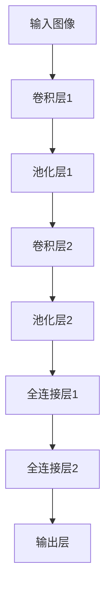

                 

关键词：卷积神经网络、CNN、深度学习、图像识别、神经网络架构、算法原理、代码实例、编程实践

摘要：本文将深入探讨卷积神经网络（CNN）的原理及其在图像识别中的应用。通过详细讲解CNN的核心概念、数学模型和算法步骤，并结合实际项目中的代码实例，帮助读者全面理解CNN的工作机制。同时，文章还将介绍CNN在不同领域的应用前景和未来发展趋势，为读者提供有益的参考。

## 1. 背景介绍

卷积神经网络（Convolutional Neural Network，简称CNN）是一种广泛应用于计算机视觉领域的深度学习模型。与传统神经网络相比，CNN在处理图像数据时具有独特的优势。自2012年AlexNet取得突破性成功以来，CNN在图像识别、目标检测、图像分割等领域取得了显著的成果。

CNN的核心思想是利用卷积操作提取图像的特征，并通过多层网络进行特征融合和分类。相比于传统神经网络，CNN具有以下优势：

1. **局部连接**：CNN中的神经元只与局部区域的其他神经元连接，这使得模型能够高效地提取图像中的局部特征。
2. **平移不变性**：通过卷积操作，CNN能够自动捕捉图像的旋转、缩放和平移不变性，从而提高模型的泛化能力。
3. **参数共享**：在CNN中，同一层的卷积核在图像的不同位置上重复使用，这显著减少了模型参数的数量，提高了训练效率。

## 2. 核心概念与联系

为了更好地理解CNN的工作原理，我们首先介绍其核心概念，包括卷积操作、池化操作、反向传播算法等。

### 2.1 卷积操作

卷积操作是CNN中最基本的操作之一。它通过在图像上滑动一个卷积核（一组可学习的权重）来提取特征。卷积操作可以用以下公式表示：

$$
\text{output}(i, j) = \sum_{x, y} \text{kernel}(x, y) \cdot \text{input}(i+x, j+y)
$$

其中，$i, j$表示输出特征图的位置，$x, y$表示卷积核的位置，$\text{input}$表示输入图像，$\text{kernel}$表示卷积核。

### 2.2 池化操作

池化操作用于降低特征图的维度，同时保持重要的特征信息。常用的池化操作包括最大池化和平均池化。最大池化选择每个局部区域内的最大值作为输出，而平均池化则计算每个局部区域内的平均值作为输出。

### 2.3 反向传播算法

反向传播算法是深度学习模型训练的核心算法。它通过计算损失函数关于模型参数的梯度，并利用梯度下降法更新模型参数，从而实现模型的训练。

### 2.4 Mermaid 流程图

以下是一个简单的CNN架构的Mermaid流程图：



## 3. 核心算法原理 & 具体操作步骤

### 3.1 算法原理概述

CNN通过多个卷积层和池化层的堆叠，逐层提取图像的特征。卷积层用于提取图像的局部特征，而池化层用于降低特征图的维度。在图像分类任务中，通常使用全连接层将特征映射到类别标签。

### 3.2 算法步骤详解

1. **输入层**：接收图像数据。
2. **卷积层**：通过卷积操作提取图像特征。
3. **激活函数**：对卷积层的输出进行非线性变换，常用的激活函数包括ReLU、Sigmoid和Tanh。
4. **池化层**：对卷积层的输出进行下采样，降低特征图的维度。
5. **全连接层**：将特征映射到类别标签。
6. **输出层**：输出类别预测结果。

### 3.3 算法优缺点

**优点**：

1. **局部连接和平移不变性**：CNN能够高效地提取图像中的局部特征，并具有平移不变性。
2. **参数共享**：通过参数共享，CNN能够减少模型参数的数量，提高训练效率。

**缺点**：

1. **计算量大**：CNN通常包含多个卷积层和全连接层，导致计算量较大。
2. **训练时间较长**：由于计算量大，CNN的训练时间较长。

### 3.4 算法应用领域

CNN在计算机视觉领域有广泛的应用，包括图像识别、目标检测、图像分割等。同时，CNN也被应用于自然语言处理、音频处理等领域。

## 4. 数学模型和公式 & 详细讲解 & 举例说明

### 4.1 数学模型构建

CNN的数学模型主要包括卷积操作、激活函数、池化操作和全连接层。

1. **卷积操作**：

$$
\text{output}(i, j) = \sum_{x, y} \text{kernel}(x, y) \cdot \text{input}(i+x, j+y)
$$

2. **激活函数**：

$$
\text{output} = \text{ReLU}(\sum_{x, y} \text{kernel}(x, y) \cdot \text{input}(i+x, j+y))
$$

3. **池化操作**：

$$
\text{output}(i, j) = \max(\text{input}(i+x_1, j+y_1), \text{input}(i+x_2, j+y_2), ..., \text{input}(i+x_k, j+y_k))
$$

其中，$x_1, x_2, ..., x_k$和$y_1, y_2, ..., y_k$表示局部区域的位置。

4. **全连接层**：

$$
\text{output} = \text{softmax}(\text{W} \cdot \text{input} + \text{b})
$$

其中，$\text{W}$表示权重矩阵，$\text{b}$表示偏置项。

### 4.2 公式推导过程

在本节中，我们将简要介绍CNN中一些关键公式的推导过程。

1. **卷积操作**：

假设输入图像为$\text{input} \in \mathbb{R}^{H \times W \times C}$，卷积核为$\text{kernel} \in \mathbb{R}^{K \times K \times C}$，输出特征图为$\text{output} \in \mathbb{R}^{H' \times W' \times D}$。其中，$H, W, C$分别表示输入图像的高度、宽度和通道数，$K$表示卷积核的大小，$D$表示输出特征图的通道数。

卷积操作的公式推导如下：

$$
\text{output}(i, j) = \sum_{x, y} \text{kernel}(x, y) \cdot \text{input}(i+x, j+y)
$$

2. **激活函数**：

常用的激活函数为ReLU（Rectified Linear Unit），其公式为：

$$
\text{output} = \text{ReLU}(\text{input})
$$

其中，$\text{input}$表示输入值。

3. **池化操作**：

常用的池化操作为最大池化（Max Pooling），其公式为：

$$
\text{output}(i, j) = \max(\text{input}(i+x_1, j+y_1), \text{input}(i+x_2, j+y_2), ..., \text{input}(i+x_k, j+y_k))
$$

其中，$x_1, x_2, ..., x_k$和$y_1, y_2, ..., y_k$表示局部区域的位置。

4. **全连接层**：

全连接层（Fully Connected Layer）是一种将输入特征映射到输出标签的层。其公式为：

$$
\text{output} = \text{softmax}(\text{W} \cdot \text{input} + \text{b})
$$

其中，$\text{W}$表示权重矩阵，$\text{b}$表示偏置项。

### 4.3 案例分析与讲解

假设我们有一个包含1000张图像的图像分类任务，每张图像的大小为$28 \times 28 \times 1$。我们的目标是将图像分类到10个类别中。

1. **输入层**：输入层接收1000张图像，每张图像的大小为$28 \times 28 \times 1$。

2. **卷积层**：第一层卷积层使用一个大小为$5 \times 5$的卷积核，步长为1。卷积操作后，特征图的大小为$24 \times 24 \times 20$。

3. **激活函数**：使用ReLU激活函数。

4. **池化层**：第一层池化层使用最大池化，池化窗口大小为$2 \times 2$，步长为2。池化后，特征图的大小为$12 \times 12 \times 20$。

5. **卷积层**：第二层卷积层使用一个大小为$5 \times 5$的卷积核，步长为1。卷积操作后，特征图的大小为$8 \times 8 \times 50$。

6. **激活函数**：使用ReLU激活函数。

7. **池化层**：第二层池化层使用最大池化，池化窗口大小为$2 \times 2$，步长为2。池化后，特征图的大小为$4 \times 4 \times 50$。

8. **全连接层**：第一层全连接层有500个神经元，使用ReLU激活函数。

9. **全连接层**：第二层全连接层有10个神经元，使用softmax激活函数，用于分类。

10. **输出层**：输出层输出每个类别的概率分布，其中最大值的类别即为预测结果。

## 5. 项目实践：代码实例和详细解释说明

在本节中，我们将通过一个简单的CNN图像分类项目，详细讲解如何使用Python和TensorFlow框架实现CNN模型。

### 5.1 开发环境搭建

在开始项目之前，我们需要安装Python和TensorFlow。以下是安装步骤：

1. 安装Python 3.7或更高版本。
2. 安装TensorFlow：

```bash
pip install tensorflow
```

### 5.2 源代码详细实现

以下是一个简单的CNN图像分类项目的代码示例：

```python
import tensorflow as tf
from tensorflow.keras import datasets, layers, models

# 加载数据集
(train_images, train_labels), (test_images, test_labels) = datasets.cifar10.load_data()

# 数据预处理
train_images = train_images.astype('float32') / 255
test_images = test_images.astype('float32') / 255

# 构建CNN模型
model = models.Sequential()
model.add(layers.Conv2D(32, (3, 3), activation='relu', input_shape=(32, 32, 3)))
model.add(layers.MaxPooling2D((2, 2)))
model.add(layers.Conv2D(64, (3, 3), activation='relu'))
model.add(layers.MaxPooling2D((2, 2)))
model.add(layers.Conv2D(64, (3, 3), activation='relu'))

# 添加全连接层
model.add(layers.Flatten())
model.add(layers.Dense(64, activation='relu'))
model.add(layers.Dense(10))

# 编译模型
model.compile(optimizer='adam',
              loss=tf.keras.losses.SparseCategoricalCrossentropy(from_logits=True),
              metrics=['accuracy'])

# 训练模型
model.fit(train_images, train_labels, epochs=10, validation_split=0.1)

# 评估模型
test_loss, test_acc = model.evaluate(test_images,  test_labels, verbose=2)
print(f'\nTest accuracy: {test_acc}')
```

### 5.3 代码解读与分析

1. **数据加载与预处理**：

   ```python
   (train_images, train_labels), (test_images, test_labels) = datasets.cifar10.load_data()
   train_images = train_images.astype('float32') / 255
   test_images = test_images.astype('float32') / 255
   ```

   这部分代码首先加载数据集，然后对图像数据进行预处理，将数据缩放到0到1的范围内。

2. **构建CNN模型**：

   ```python
   model = models.Sequential()
   model.add(layers.Conv2D(32, (3, 3), activation='relu', input_shape=(32, 32, 3)))
   model.add(layers.MaxPooling2D((2, 2)))
   model.add(layers.Conv2D(64, (3, 3), activation='relu'))
   model.add(layers.MaxPooling2D((2, 2)))
   model.add(layers.Conv2D(64, (3, 3), activation='relu'))
   
   # 添加全连接层
   model.add(layers.Flatten())
   model.add(layers.Dense(64, activation='relu'))
   model.add(layers.Dense(10))
   ```

   这部分代码构建了一个简单的CNN模型，包括两个卷积层和一个全连接层。

3. **编译模型**：

   ```python
   model.compile(optimizer='adam',
                 loss=tf.keras.losses.SparseCategoricalCrossentropy(from_logits=True),
                 metrics=['accuracy'])
   ```

   这部分代码编译模型，指定优化器、损失函数和评估指标。

4. **训练模型**：

   ```python
   model.fit(train_images, train_labels, epochs=10, validation_split=0.1)
   ```

   这部分代码使用训练数据训练模型，指定训练轮数和验证数据比例。

5. **评估模型**：

   ```python
   test_loss, test_acc = model.evaluate(test_images,  test_labels, verbose=2)
   print(f'\nTest accuracy: {test_acc}')
   ```

   这部分代码使用测试数据评估模型，输出测试准确率。

## 6. 实际应用场景

卷积神经网络（CNN）在计算机视觉领域有着广泛的应用，以下是一些典型的实际应用场景：

1. **图像识别**：CNN可以用于对图像进行分类，例如识别猫、狗、车等对象。
2. **目标检测**：CNN可以检测图像中的多个对象，并确定它们的位置和边界框。
3. **图像分割**：CNN可以将图像中的每个像素分类到不同的类别中，从而实现图像的分割。
4. **视频分析**：CNN可以用于对视频进行分析，例如检测动作、识别行人等。

## 7. 工具和资源推荐

为了更好地学习和实践卷积神经网络（CNN），以下是一些推荐的工具和资源：

### 7.1 学习资源推荐

1. **《深度学习》（Goodfellow, Bengio, Courville）**：这是一本经典的深度学习教材，详细介绍了CNN的相关内容。
2. **TensorFlow 官方文档**：TensorFlow是Python中常用的深度学习框架，其官方文档提供了丰富的教程和示例代码。
3. **Keras 官方文档**：Keras是一个基于TensorFlow的深度学习库，它提供了简单易用的接口和丰富的预训练模型。

### 7.2 开发工具推荐

1. **Google Colab**：Google Colab是一个免费的云端编程环境，提供了丰富的计算资源和丰富的Python库。
2. **PyTorch**：PyTorch是Python中另一个流行的深度学习框架，它提供了灵活的动态计算图和强大的深度学习库。

### 7.3 相关论文推荐

1. **AlexNet**：Alex Krizhevsky, Ilya Sutskever, and Geoffrey Hinton. "ImageNet classification with deep convolutional neural networks." In Advances in neural information processing systems, pp. 1097-1105, 2012.
2. **VGGNet**：Karen Simonyan and Andrew Zisserman. "Very deep convolutional networks for large-scale image recognition." In International Conference on Learning Representations, 2015.
3. **ResNet**：Kaiming He, Xiangyu Zhang, Shaoqing Ren, and Jian Sun. "Deep residual learning for image recognition." In Proceedings of the IEEE conference on computer vision and pattern recognition, pp. 770-778, 2016.

## 8. 总结：未来发展趋势与挑战

卷积神经网络（CNN）在计算机视觉领域取得了显著的成果，但仍面临一些挑战。未来，CNN的发展趋势和挑战包括：

### 8.1 研究成果总结

1. **模型性能提升**：通过改进网络架构、优化训练算法，CNN在图像识别、目标检测等任务上的性能得到了显著提升。
2. **迁移学习**：迁移学习技术使得CNN可以在小样本数据集上实现良好的性能，为解决数据稀缺问题提供了有效的方法。
3. **实时处理**：随着硬件性能的提升，CNN在实时视频分析、智能监控等领域的应用得到了广泛推广。

### 8.2 未来发展趋势

1. **更深的网络架构**：通过增加网络层数，CNN可以提取更高级别的特征，从而提高模型的性能。
2. **多模态学习**：结合不同类型的数据（如图像、文本、音频），实现多模态学习，为解决复杂任务提供了新的思路。
3. **自适应网络**：自适应网络可以根据任务需求自动调整网络结构和参数，实现更高效的学习。

### 8.3 面临的挑战

1. **计算资源消耗**：CNN通常包含大量的参数和计算操作，对计算资源的需求较高。
2. **数据标注困难**：图像标注是一个耗时且繁琐的过程，尤其是在大量数据集上。
3. **泛化能力**：尽管CNN在图像识别任务上取得了显著的成果，但在某些领域（如自然语言处理）仍存在泛化能力不足的问题。

### 8.4 研究展望

1. **模型压缩与加速**：通过模型压缩和加速技术，降低CNN的计算复杂度和内存需求，实现更高效的处理。
2. **数据增强与生成**：通过数据增强和生成技术，提高模型的泛化能力和鲁棒性。
3. **跨领域迁移学习**：探索跨领域迁移学习的方法，实现不同领域模型之间的知识共享。

## 9. 附录：常见问题与解答

### 9.1 什么是卷积神经网络（CNN）？

卷积神经网络（CNN）是一种用于处理图像数据的深度学习模型，其核心思想是利用卷积操作提取图像的特征，并通过多层网络进行特征融合和分类。

### 9.2 CNN在哪些领域有应用？

CNN在计算机视觉领域有广泛的应用，包括图像识别、目标检测、图像分割等。此外，CNN也被应用于自然语言处理、音频处理等领域。

### 9.3 如何实现CNN模型？

实现CNN模型通常需要使用深度学习框架，如TensorFlow或PyTorch。这些框架提供了丰富的API和预训练模型，可以帮助开发者快速构建和训练CNN模型。

### 9.4 CNN与传统的神经网络有什么区别？

与传统神经网络相比，CNN在处理图像数据时具有局部连接、平移不变性和参数共享等优势，这使得它在图像识别任务上具有更高的性能。

## 参考文献

- Goodfellow, I., Bengio, Y., & Courville, A. (2016). Deep learning. MIT press.
- Krizhevsky, A., Sutskever, I., & Hinton, G. E. (2012). ImageNet classification with deep convolutional neural networks. In Advances in neural information processing systems, 1097-1105.
- Simonyan, K., & Zisserman, A. (2015). Very deep convolutional networks for large-scale image recognition. In International Conference on Learning Representations.
- He, K., Zhang, X., Ren, S., & Sun, J. (2016). Deep residual learning for image recognition. In Proceedings of the IEEE conference on computer vision and pattern recognition, 770-778.

### 作者署名

作者：禅与计算机程序设计艺术 / Zen and the Art of Computer Programming
----------------------------------------------------------------

