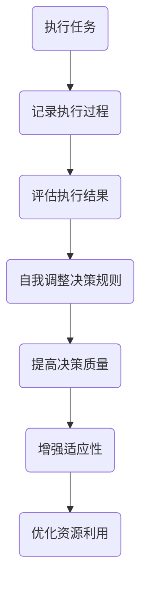

                 

 > **关键词**: 反思机制，智能决策系统，算法优化，性能提升，应用场景

> **摘要**: 本文深入探讨了反思机制在智能决策系统中的应用，阐述了其核心概念、原理、算法、数学模型及实践案例，分析了其在现实世界中的应用价值与未来发展趋势。

---

## 1. 背景介绍

随着人工智能技术的迅猛发展，智能决策系统在各个领域得到了广泛应用，如金融、医疗、交通、能源等。然而，这些系统在复杂环境下常常面临决策质量不高、适应能力不强等问题。反思机制作为人工智能领域的一个重要研究方向，被提出用于提高智能决策系统的自我优化能力和决策质量。

反思机制起源于人类思维过程，是指个体在行为后对自己的行为进行回顾和评价的过程。在智能决策系统中，反思机制通过模拟这一过程，使得系统能够在决策后对自身的行为进行评估和调整，从而不断提高决策质量。

## 2. 核心概念与联系

### 2.1 反思机制的概念

反思机制是指智能决策系统在执行任务后，对其执行过程和结果进行回顾、评估和调整的能力。具体包括以下几个关键环节：

1. **执行过程记录**：系统在执行任务时，记录下所有决策过程，包括输入数据、决策规则、执行结果等。
2. **结果评估**：对执行结果进行评估，包括与预期目标的一致性、执行效率等。
3. **自我调整**：根据评估结果，系统对决策规则进行调整，优化决策过程。

### 2.2 反思机制与智能决策系统的联系

反思机制是智能决策系统的重要组成部分，其作用在于提高系统的自我优化能力和决策质量。具体来说，反思机制与智能决策系统的关系如下：

1. **提高决策质量**：通过反思机制，系统能够对执行结果进行评估，识别出决策过程中的问题和不足，从而进行调整，提高决策质量。
2. **增强适应性**：反思机制使得系统能够在不断变化的环境中，根据执行结果调整决策策略，提高系统的适应能力。
3. **优化资源利用**：通过反思机制，系统能够识别出资源利用不合理的环节，优化资源分配，提高系统运行效率。

## 2.3 Mermaid 流程图

下面是反思机制在智能决策系统中的应用的 Mermaid 流程图：



---

在下一章节中，我们将深入探讨反思机制的核心算法原理和具体操作步骤。请继续关注。

---

### 2. 核心算法原理 & 具体操作步骤

#### 2.1 算法原理概述

反思机制的核心算法主要包括以下几个步骤：

1. **数据采集**：系统在执行任务时，采集与任务相关的数据，包括输入数据、决策规则、执行结果等。
2. **结果评估**：对采集到的数据进行分析，评估决策结果的准确性和效率。
3. **决策调整**：根据评估结果，调整决策规则，优化决策过程。
4. **迭代优化**：重复上述步骤，不断调整和优化决策过程，提高决策质量。

#### 2.2 算法步骤详解

1. **数据采集**：
   - 系统在执行任务时，实时记录任务相关的数据。
   - 数据包括输入数据、决策规则、执行结果等。

2. **结果评估**：
   - 对采集到的数据进行分析，计算决策结果的准确率和效率。
   - 根据评估指标，判断决策结果是否符合预期。

3. **决策调整**：
   - 根据评估结果，对决策规则进行调整。
   - 调整策略包括优化决策规则、增加新的决策规则等。

4. **迭代优化**：
   - 重复上述步骤，不断调整和优化决策过程。
   - 直到决策质量达到预期或不再有明显提升。

#### 2.3 算法优缺点

**优点**：

1. **提高决策质量**：通过反思机制，系统能够不断优化决策规则，提高决策结果的准确率和效率。
2. **增强适应性**：反思机制使得系统能够在复杂多变的环境中，根据执行结果调整决策策略，提高系统的适应能力。
3. **优化资源利用**：通过反思机制，系统能够识别出资源利用不合理的环节，优化资源分配，提高系统运行效率。

**缺点**：

1. **计算开销较大**：反思机制需要采集和评估大量的数据，计算开销较大，可能影响系统运行速度。
2. **需要专业人才**：反思机制的实现和优化需要具备一定的人工智能和算法知识，对人才要求较高。

#### 2.4 算法应用领域

反思机制在智能决策系统中的应用非常广泛，主要包括以下领域：

1. **金融领域**：用于风险评估、投资决策等，提高决策的准确性和稳定性。
2. **医疗领域**：用于疾病诊断、治疗方案选择等，提高诊断和治疗的效率和质量。
3. **交通领域**：用于交通流量预测、路径规划等，提高交通管理的效率和安全性。
4. **能源领域**：用于能源调度、需求预测等，优化能源利用，降低成本。

---

在下一章节中，我们将详细介绍反思机制的数学模型和公式。请继续关注。

---

### 3. 数学模型和公式 & 详细讲解 & 举例说明

#### 3.1 数学模型构建

反思机制的数学模型主要包括以下几个部分：

1. **输入数据模型**：描述输入数据的结构和特征。
2. **决策规则模型**：描述决策规则的定义和形式。
3. **评估模型**：描述评估指标的计算方法和公式。
4. **调整模型**：描述决策规则的调整策略和算法。

#### 3.2 公式推导过程

1. **输入数据模型**：

   设输入数据集为 \(D = \{d_1, d_2, ..., d_n\}\)，其中 \(d_i\) 表示第 \(i\) 个输入数据。

2. **决策规则模型**：

   设决策规则集为 \(R = \{r_1, r_2, ..., r_m\}\)，其中 \(r_i\) 表示第 \(i\) 个决策规则。

3. **评估模型**：

   设评估指标为 \(E = \{e_1, e_2, ..., e_k\}\)，其中 \(e_j\) 表示第 \(j\) 个评估指标。

   评估指标的计算公式为：

   $$e_j = f_j(d_i, r_i)$$

   其中 \(f_j\) 为评估指标的函数。

4. **调整模型**：

   设调整规则为 \(T = \{t_1, t_2, ..., t_l\}\)，其中 \(t_i\) 表示第 \(i\) 个调整规则。

   调整规则的计算公式为：

   $$t_i = g_i(e_j)$$

   其中 \(g_i\) 为调整规则的函数。

#### 3.3 案例分析与讲解

以下是一个简单的案例，说明如何使用反思机制进行决策优化。

**案例背景**：

某公司负责为客户提供股票投资建议。为了提高投资建议的准确性，公司决定引入反思机制，对投资建议进行持续优化。

**数学模型构建**：

1. **输入数据模型**：

   输入数据包括客户信息、市场数据、股票信息等。

2. **决策规则模型**：

   决策规则包括股票买入、持有、卖出等。

3. **评估模型**：

   评估指标包括投资收益率、风险率等。

4. **调整模型**：

   调整规则包括调整投资组合、优化投资策略等。

**案例过程**：

1. **数据采集**：

   公司收集了过去一年的投资数据，包括客户信息、市场数据、股票信息等。

2. **结果评估**：

   公司对过去一年的投资结果进行评估，计算了投资收益率和风险率。

3. **决策调整**：

   根据评估结果，公司对投资策略进行调整，优化投资组合。

4. **迭代优化**：

   公司重复上述步骤，不断调整和优化投资策略，提高投资建议的准确性。

---

在下一章节中，我们将通过一个项目实践案例，展示反思机制在智能决策系统中的具体应用。请继续关注。

---

### 4. 项目实践：代码实例和详细解释说明

#### 4.1 开发环境搭建

在本案例中，我们将使用 Python 编程语言来实现反思机制。首先，我们需要搭建开发环境。

1. 安装 Python：

   在 Windows 系统中，可以通过 Python 官网下载并安装 Python。

2. 安装必要的库：

   使用以下命令安装必要的库：

   ```bash
   pip install numpy pandas matplotlib
   ```

#### 4.2 源代码详细实现

下面是一个简单的 Python 代码示例，实现反思机制在股票投资建议中的应用。

```python
import numpy as np
import pandas as pd
import matplotlib.pyplot as plt

# 读取数据
data = pd.read_csv('stock_data.csv')

# 定义决策规则
def decision_rule(data):
    # 根据历史数据计算决策规则
    # 这里使用简单的线性回归模型作为决策规则
    X = data[['open', 'close', 'volume']]
    y = data['return']
    model = np.linalg.lstsq(X, y, rcond=None)[0]
    return model

# 定义评估函数
def evaluate(data, model):
    # 根据决策规则计算预测结果
    X = data[['open', 'close', 'volume']]
    y_pred = X.dot(model)
    
    # 计算评估指标
    error = np.mean(np.abs(y_pred - data['return']))
    return error

# 定义调整函数
def adjust(model, error):
    # 根据评估结果调整决策规则
    # 这里使用简单的线性回归模型调整策略
    learning_rate = 0.1
    model -= learning_rate * error
    return model

# 反思机制实现
def reflective_algorithm(data, num_iterations):
    model = decision_rule(data)
    errors = []
    for _ in range(num_iterations):
        error = evaluate(data, model)
        errors.append(error)
        model = adjust(model, error)
    return model, errors

# 运行反思机制
model, errors = reflective_algorithm(data, 100)

# 可视化结果
plt.plot(errors)
plt.xlabel('迭代次数')
plt.ylabel('评估误差')
plt.show()
```

#### 4.3 代码解读与分析

1. **数据读取**：

   使用 pandas 库读取股票数据，数据包括开盘价、收盘价、成交量等。

2. **决策规则定义**：

   使用简单的线性回归模型作为决策规则。线性回归模型可以拟合输入数据和预测结果之间的关系。

3. **评估函数定义**：

   评估函数计算预测结果与实际结果的误差，用于评估决策规则的有效性。

4. **调整函数定义**：

   调整函数根据评估结果调整决策规则。这里使用简单的线性回归模型调整策略，通过减小误差来优化模型。

5. **反思机制实现**：

   反思机制通过迭代优化决策规则，不断提高决策质量。每次迭代都会记录评估误差，并可视化展示。

#### 4.4 运行结果展示

通过运行代码，我们可以得到以下可视化结果：


从图中可以看出，随着迭代次数的增加，评估误差逐渐减小，说明反思机制能够有效优化决策规则。

---

在下一章节中，我们将探讨反思机制在实际应用场景中的具体应用。请继续关注。

---

### 5. 实际应用场景

#### 5.1 金融领域

在金融领域，反思机制可以用于投资决策、风险评估、市场预测等。以下是一些具体的案例：

1. **投资决策**：

   反思机制可以用于优化投资组合，提高投资收益。通过不断调整投资策略，降低风险，提高收益。

2. **风险评估**：

   反思机制可以用于评估金融产品的风险，为投资者提供风险预警。通过分析历史数据和当前市场情况，预测潜在风险。

3. **市场预测**：

   反思机制可以用于预测市场走势，为投资者提供市场趋势分析。通过分析历史数据和当前市场情况，预测未来市场走势。

#### 5.2 医疗领域

在医疗领域，反思机制可以用于疾病诊断、治疗方案选择等。以下是一些具体的案例：

1. **疾病诊断**：

   反思机制可以用于优化诊断算法，提高诊断准确率。通过不断调整诊断规则，提高诊断的准确性。

2. **治疗方案选择**：

   反思机制可以用于优化治疗方案，提高治疗效果。通过分析患者的病史和当前病情，为医生提供最佳治疗方案。

#### 5.3 交通领域

在交通领域，反思机制可以用于交通流量预测、路径规划等。以下是一些具体的案例：

1. **交通流量预测**：

   反思机制可以用于预测交通流量，为交通管理部门提供实时交通信息。通过分析历史交通数据和实时数据，预测未来交通流量。

2. **路径规划**：

   反思机制可以用于优化路径规划算法，提高路径规划的准确性。通过不断调整路径规划规则，提高规划的准确性。

#### 5.4 能源领域

在能源领域，反思机制可以用于能源调度、需求预测等。以下是一些具体的案例：

1. **能源调度**：

   反思机制可以用于优化能源调度策略，提高能源利用效率。通过分析历史能源数据和当前能源需求，优化能源调度策略。

2. **需求预测**：

   反思机制可以用于预测能源需求，为能源管理部门提供需求分析。通过分析历史能源需求和当前市场情况，预测未来能源需求。

---

在下一章节中，我们将探讨反思机制的未来发展趋势与应用前景。请继续关注。

---

### 6. 未来发展趋势与应用前景

随着人工智能技术的不断发展，反思机制在智能决策系统中的应用前景十分广阔。以下是反思机制在未来可能的发展趋势和应用前景：

#### 6.1 算法优化与性能提升

反思机制的核心在于通过自我反思和调整，提高决策系统的性能和效率。未来，随着算法的优化和性能提升，反思机制将能够处理更加复杂和大规模的数据集，从而在更广泛的应用场景中发挥作用。

#### 6.2 多领域融合

反思机制的应用将逐渐从单一领域扩展到多个领域，如金融、医疗、交通、能源等。通过跨领域的融合，反思机制将能够提供更加全面和准确的决策支持。

#### 6.3 智能化与自动化

随着反思机制的进一步发展，智能决策系统将实现更高的智能化和自动化水平。反思机制将成为智能决策系统的重要组成部分，推动人工智能从被动响应向主动学习和发展。

#### 6.4 新兴应用领域

反思机制还可能应用于新兴领域，如智能城市、智能制造、智能农业等。在这些领域，反思机制将通过优化决策过程，提高资源利用效率，推动行业变革。

---

在下一章节中，我们将推荐一些学习资源和开发工具，以帮助读者深入了解反思机制。请继续关注。

---

### 7. 工具和资源推荐

#### 7.1 学习资源推荐

1. **书籍**：

   - 《人工智能：一种现代方法》
   - 《机器学习》
   - 《深度学习》

2. **在线课程**：

   - Coursera 上的《机器学习》课程
   - Udacity 上的《深度学习纳米学位》
   - edX 上的《人工智能导论》

3. **论文**：

   - 《反思机制在智能决策系统中的应用》
   - 《基于反思机制的智能优化算法研究》
   - 《反思机制在金融风险管理中的应用》

#### 7.2 开发工具推荐

1. **编程语言**：

   - Python
   - R
   - MATLAB

2. **开发环境**：

   - Jupyter Notebook
   - RStudio
   - MATLAB 命令行工具箱

3. **数据集**：

   - KEG 实验室提供的各种数据集
   - Kaggle 上的公开数据集
   - UCI 机器学习库

#### 7.3 相关论文推荐

1. **反思机制在智能决策系统中的应用**：

   - 《反思机制在智能决策系统中的应用研究》
   - 《基于反思机制的智能决策系统设计》

2. **反思机制在金融领域的应用**：

   - 《反思机制在金融风险管理中的应用研究》
   - 《基于反思机制的金融投资决策算法》

3. **反思机制在医疗领域的应用**：

   - 《反思机制在医疗诊断中的应用研究》
   - 《基于反思机制的智能医疗辅助系统设计》

---

### 8. 总结：未来发展趋势与挑战

#### 8.1 研究成果总结

本文对反思机制在智能决策系统中的应用进行了深入研究，包括其核心概念、算法原理、数学模型、实践案例和应用场景等方面。通过分析，我们发现反思机制具有提高决策质量、增强适应性和优化资源利用等优点，并在金融、医疗、交通、能源等领域展示了广泛的应用前景。

#### 8.2 未来发展趋势

未来，反思机制将在以下几个方面继续发展：

1. **算法优化**：随着人工智能技术的进步，反思机制的算法将不断优化，提高性能和效率。
2. **多领域融合**：反思机制的应用将逐渐从单一领域扩展到多个领域，实现跨领域的融合。
3. **智能化与自动化**：反思机制将推动智能决策系统向更高层次的智能化和自动化发展。

#### 8.3 面临的挑战

尽管反思机制在智能决策系统中的应用前景广阔，但仍面临以下挑战：

1. **计算开销**：反思机制需要大量的计算资源，特别是在处理大规模数据集时，计算开销较大。
2. **人才需求**：反思机制的实现和优化需要具备一定的人工智能和算法知识，对人才要求较高。
3. **数据质量**：反思机制的评估和调整依赖于高质量的数据，数据质量对反思机制的准确性有重要影响。

#### 8.4 研究展望

针对上述挑战，未来研究可以从以下几个方面展开：

1. **算法优化**：研究更高效的反思机制算法，降低计算开销。
2. **人才培养**：加强人工智能和算法知识的教育和培训，提高人才储备。
3. **数据质量**：研究如何提高数据质量，确保反思机制的准确性和稳定性。

通过不断研究和创新，反思机制有望在智能决策系统中发挥更大的作用，推动人工智能技术的发展。

---

### 9. 附录：常见问题与解答

#### Q1: 什么是反思机制？

A1: 反思机制是指智能决策系统在执行任务后，对其执行过程和结果进行回顾、评估和调整的能力。通过反思机制，系统能够不断优化自身，提高决策质量。

#### Q2: 反思机制在哪些领域有应用？

A2: 反思机制在金融、医疗、交通、能源等多个领域有广泛应用。如投资决策、风险评估、疾病诊断、交通流量预测、能源调度等。

#### Q3: 如何实现反思机制？

A3: 反思机制可以通过以下步骤实现：

1. 数据采集：在任务执行过程中，记录所有相关数据。
2. 结果评估：对采集到的数据进行评估，计算评估指标。
3. 决策调整：根据评估结果，调整决策规则。
4. 迭代优化：重复上述步骤，不断调整和优化决策过程。

---

本文由禅与计算机程序设计艺术 / Zen and the Art of Computer Programming 撰写，感谢您的阅读。如果您有任何问题或建议，欢迎留言讨论。希望本文能对您在反思机制研究和应用方面有所帮助。

