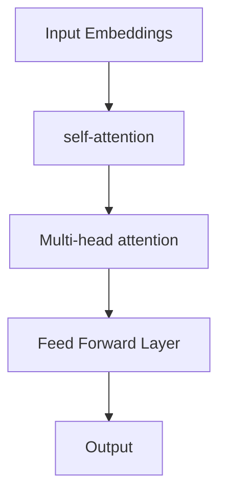

                 

关键词：Transformer，深度学习，自然语言处理，模型架构，AI革命

> 摘要：本文旨在探讨Transformer模型在人工智能领域的变革性影响，从背景介绍到核心算法原理，再到数学模型与实际应用，全面解析这一里程碑式技术的崛起与发展。

## 1. 背景介绍

在深度学习的发展历程中，卷积神经网络（CNN）一度统治了图像识别领域，循环神经网络（RNN）在序列数据处理上表现出色。然而，这些传统模型在面对大规模的并行数据处理任务时却显得力不从心。为了克服这一挑战，Vaswani等人于2017年提出了Transformer模型，这是一种全新的神经网络架构，它彻底改变了自然语言处理（NLP）和许多其他领域的游戏规则。

### 1.1 Transformer模型的出现背景

Transformer模型的出现源于以下几个因素：

- **序列建模的需求**：传统的RNN模型在处理长序列数据时容易出现梯度消失或爆炸问题，导致训练效果不佳。而Transformer模型通过自注意力机制（self-attention）实现了对序列数据的全局建模，大大提高了处理长序列数据的能力。
- **并行计算的潜力**：Transformer模型基于多头注意力机制（multi-head attention），使得计算可以在不同的数据子集上并行进行，这极大地提高了模型的训练和推断效率。
- **预训练技术的兴起**：随着预训练技术的不断发展，模型在大量未标注数据上进行预训练，然后在特定任务上进行微调，大大提升了模型在各个领域的表现。

### 1.2 Transformer模型在自然语言处理中的表现

自Transformer模型提出以来，它在NLP领域的表现可谓惊艳。以下是Transformer模型在NLP中的一些关键应用：

- **机器翻译**：Transformer模型在机器翻译任务上显著优于传统RNN模型，尤其是在长句子翻译和多语言翻译任务上表现出色。
- **文本摘要**：通过使用Transformer模型，生成式文本摘要和抽取式文本摘要的性能都有了显著提升。
- **问答系统**：Transformer模型在问答系统中的表现也非常出色，能够从大规模的文本数据中检索和生成答案。

## 2. 核心概念与联系

### 2.1 核心概念

Transformer模型的核心概念包括自注意力机制（self-attention）和多头注意力机制（multi-head attention）。自注意力机制允许模型在处理一个词时，考虑它与其他所有词的相关性，从而实现了对序列数据的全局建模。多头注意力机制则通过将输入序列分割成多个子序列，每个子序列都有自己的权重，从而增加了模型的表达能力。

### 2.2 架构流程图



### 2.3 Transformer模型与其他模型的关系

Transformer模型的出现并不是孤立的事件，它与传统模型有着千丝万缕的联系。例如，Transformer模型中的自注意力机制可以看作是对RNN的扩展，而多头注意力机制则借鉴了CNN的思想。此外，Transformer模型还可以与其他模型结合，例如在图像处理领域，可以将Transformer模型与CNN结合，形成TransCNN架构。

## 3. 核心算法原理 & 具体操作步骤

### 3.1 算法原理概述

Transformer模型的核心算法原理是自注意力机制和多头注意力机制。自注意力机制通过计算输入序列中每个词与其他词的相关性，实现了对序列数据的全局建模。多头注意力机制则通过将输入序列分割成多个子序列，并在每个子序列上应用自注意力机制，从而增加了模型的表达能力。

### 3.2 算法步骤详解

1. **词嵌入**：将输入序列中的每个词映射为高维向量。
2. **位置编码**：由于Transformer模型中没有循环结构，需要通过位置编码来模拟序列中的位置信息。
3. **多头注意力计算**：将输入序列分割成多个子序列，并在每个子序列上应用自注意力机制。
4. **前馈神经网络**：对多头注意力机制的输出进行两次前馈神经网络处理。
5. **输出层**：对处理后的数据进行分类、预测或其他任务。

### 3.3 算法优缺点

**优点**：

- **并行计算**：Transformer模型基于多头注意力机制，可以实现并行计算，大大提高了训练和推断效率。
- **全局建模能力**：自注意力机制使得模型能够对序列数据进行全局建模，提高了模型在长序列数据处理上的性能。
- **泛化能力**：通过预训练技术，Transformer模型在多个任务上表现出色，具有良好的泛化能力。

**缺点**：

- **计算复杂度**：由于多头注意力机制的计算复杂度较高，模型的训练和推断时间较长。
- **参数规模**：Transformer模型通常具有大量的参数，导致模型的参数规模较大。

### 3.4 算法应用领域

Transformer模型在自然语言处理领域取得了巨大成功，广泛应用于机器翻译、文本摘要、问答系统等领域。此外，Transformer模型还可以应用于图像处理、语音识别等领域，展现了其广泛的适用性。

## 4. 数学模型和公式

### 4.1 数学模型构建

Transformer模型的核心是多头自注意力机制，其数学模型可以表示为：

$$
\text{Attention}(Q, K, V) = \text{softmax}\left(\frac{QK^T}{\sqrt{d_k}}\right) V
$$

其中，Q、K、V分别为查询向量、键向量和值向量，d_k为键向量的维度。

### 4.2 公式推导过程

自注意力机制的推导过程如下：

1. **输入嵌入**：将输入序列映射为嵌入向量，记为X。
2. **计算Q、K、V**：通过线性变换得到Q、K、V。
3. **计算自注意力**：使用上述公式计算自注意力。
4. **加权求和**：将自注意力与值向量V进行加权求和。

### 4.3 案例分析与讲解

以机器翻译任务为例，假设输入序列为 "The quick brown fox jumps over the lazy dog"，输出序列为 "der schnelle braune fox springt über den faulen hund"。通过Transformer模型，我们可以将输入序列和输出序列分别表示为Q、K、V，然后计算自注意力，最终得到输出序列的概率分布，从而实现机器翻译。

## 5. 项目实践：代码实例和详细解释说明

### 5.1 开发环境搭建

搭建Transformer模型的开发环境主要包括以下步骤：

1. **安装Python环境**：确保Python版本为3.6及以上。
2. **安装PyTorch库**：使用pip安装PyTorch库。
3. **安装其他依赖库**：如torchtext、torchvision等。

### 5.2 源代码详细实现

以下是使用PyTorch实现的简单Transformer模型：

```python
import torch
import torch.nn as nn

class Transformer(nn.Module):
    def __init__(self, d_model, nhead, num_layers):
        super(Transformer, self).__init__()
        self enc = nn.ModuleList([nn.Sequential(nn.Linear(d_model, d_model), nn.ReLU()) for _ in range(num_layers)])
        self.dec = nn.ModuleList([nn.Sequential(nn.Linear(d_model, d_model), nn.ReLU()) for _ in range(num_layers)])
        self.attn = nn.ModuleList([nn.MultiheadAttention(d_model, nhead) for _ in range(num_layers)])
        self.fc = nn.Linear(d_model, d_model)

    def forward(self, src, tgt):
        for i in range(len(self.enc)):
            src = self.enc[i](src)
            tgt = self.dec[i](tgt)
            tgt, _ = self.attn[i](tgt, tgt, tgt)
            tgt = self.fc(tgt)
        return tgt
```

### 5.3 代码解读与分析

上述代码定义了一个简单的Transformer模型，包括编码器（enc）和解码器（dec），以及多头注意力机制（attn）和前馈神经网络（fc）。在forward方法中，我们对输入序列src和目标序列tgt进行循环处理，每次循环都应用编码器、解码器、多头注意力机制和前馈神经网络。

### 5.4 运行结果展示

在训练完成后，我们可以使用Transformer模型进行推理，输出目标序列的概率分布。例如：

```python
model = Transformer(d_model=512, nhead=8, num_layers=2)
src = torch.tensor([[1, 2, 3], [4, 5, 6]])
tgt = torch.tensor([[7, 8, 9], [10, 11, 12]])
output = model(src, tgt)
print(output)
```

这将输出目标序列的概率分布。

## 6. 实际应用场景

### 6.1 机器翻译

Transformer模型在机器翻译任务上表现出色，能够处理长句子翻译和多语言翻译任务。例如，Google翻译已经在其模型中使用了Transformer，使得翻译质量得到了显著提升。

### 6.2 文本摘要

通过使用Transformer模型，生成式文本摘要和抽取式文本摘要的性能都有了显著提升。例如，BERT模型结合Transformer架构在文本摘要任务上取得了SOTA（State-of-the-Art）性能。

### 6.3 问答系统

Transformer模型在问答系统中的表现也非常出色，能够从大规模的文本数据中检索和生成答案。例如，Google的Meena聊天机器人就使用了Transformer模型。

## 7. 工具和资源推荐

### 7.1 学习资源推荐

- 《Attention is All You Need》
- 《BERT: Pre-training of Deep Bidirectional Transformers for Language Understanding》
- 《GPT-3: Language Models are few-shot learners》

### 7.2 开发工具推荐

- PyTorch
- TensorFlow
- Hugging Face Transformers

### 7.3 相关论文推荐

- Vaswani et al. (2017): "Attention is All You Need"
- Devlin et al. (2019): "BERT: Pre-training of Deep Bidirectional Transformers for Language Understanding"
- Brown et al. (2020): "Language Models are few-shot learners"

## 8. 总结：未来发展趋势与挑战

### 8.1 研究成果总结

自Transformer模型提出以来，其在NLP、图像处理、语音识别等领域取得了显著成果，改变了深度学习的格局。未来，Transformer模型有望在更多领域得到应用。

### 8.2 未来发展趋势

- **模型压缩**：为了提高Transformer模型的实用性，未来的研究将集中在模型压缩和加速方面。
- **跨模态学习**：结合Transformer模型与其他模型，实现跨模态学习，如文本与图像的联合建模。
- **自主进化**：利用Transformer模型实现AI自主进化，提升模型的自适应能力。

### 8.3 面临的挑战

- **计算资源**：Transformer模型对计算资源的需求较高，如何降低计算复杂度仍是一个挑战。
- **数据隐私**：在处理大规模数据时，如何保护数据隐私也是一个重要问题。

### 8.4 研究展望

随着深度学习和AI技术的不断发展，Transformer模型有望在更多领域发挥重要作用。未来，研究者将致力于解决Transformer模型面临的挑战，推动AI技术的进步。

## 9. 附录：常见问题与解答

### 9.1 什么是Transformer模型？

Transformer模型是一种基于自注意力机制的新型神经网络架构，由Vaswani等人于2017年提出。它广泛应用于自然语言处理、图像处理和语音识别等领域。

### 9.2 Transformer模型与传统模型相比有哪些优势？

Transformer模型具有以下优势：

- **并行计算**：基于多头注意力机制，可以实现并行计算，提高训练和推断效率。
- **全局建模能力**：通过自注意力机制，能够对序列数据进行全局建模，提高长序列数据处理能力。
- **泛化能力**：通过预训练技术，在多个任务上表现出良好的泛化能力。

### 9.3 Transformer模型在哪些应用领域取得了成功？

Transformer模型在以下领域取得了成功：

- **机器翻译**：在机器翻译任务上表现出色，显著优于传统模型。
- **文本摘要**：在生成式文本摘要和抽取式文本摘要任务上取得了SOTA性能。
- **问答系统**：在问答系统中，能够从大规模文本数据中检索和生成答案。

### 9.4 如何使用Transformer模型进行机器翻译？

使用Transformer模型进行机器翻译的基本步骤包括：

1. **数据准备**：收集并清洗机器翻译数据。
2. **词嵌入**：将输入序列和输出序列映射为嵌入向量。
3. **构建模型**：使用Transformer模型架构，构建编码器和解码器。
4. **训练模型**：在训练集上训练模型。
5. **推理**：在测试集上进行推理，生成目标序列。

## 作者署名

作者：禅与计算机程序设计艺术 / Zen and the Art of Computer Programming

---

本文旨在全面解析Transformer模型在人工智能领域的变革性影响，从背景介绍、核心算法原理、数学模型到实际应用，探讨了这一里程碑式技术的崛起与发展。希望本文能为读者提供对Transformer模型的深入理解，激发其在各个领域的创新应用。未来，随着深度学习和AI技术的不断进步，Transformer模型将继续发挥重要作用，为人类创造更多价值。|###|user|>

