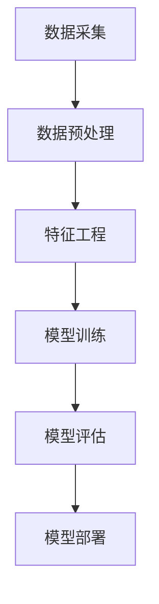

                 

关键词：房产估价、人工智能、机器学习、深度学习、数据挖掘、预测模型、算法、数据分析、房地产

摘要：本文旨在探讨58同城2025房产估价模型的构建过程，通过对核心概念、算法原理、数学模型和实际应用的详细解析，为房产估价领域的研究者和从业者提供一份全面的面试题集。

## 1. 背景介绍

随着中国房地产市场的蓬勃发展，房产估价成为了一个热门领域。然而，传统的房产估价方法往往依赖于经验数据和公式，存在一定的主观性和局限性。为了提高房产估价的准确性和效率，58同城计划在2025年推出一款基于人工智能的房产估价模型。本文将围绕这一模型，深入探讨其核心概念、算法原理和实际应用。

### 1.1 房产估价的现状与挑战

当前，房产估价方法主要包括市场比较法、成本法、收益法等。这些方法在一定程度上依赖于经验数据和公式，但在实际应用中存在以下挑战：

1. **数据依赖性高**：传统方法需要大量的历史数据作为支撑，数据获取和处理成本较高。
2. **主观因素影响大**：评估结果容易受到评估人员的主观判断影响，缺乏客观性。
3. **时效性差**：传统方法更新速度慢，难以实时反映市场变化。

### 1.2 人工智能在房产估价中的应用前景

人工智能，特别是机器学习和深度学习技术，为房产估价提供了新的思路。通过大数据分析和模型训练，人工智能可以自动化地分析海量数据，提取有用的特征，并生成精确的估价结果。以下是人工智能在房产估价中应用的一些潜在优势：

1. **高效性**：人工智能模型可以在短时间内处理大量数据，提高估价效率。
2. **准确性**：机器学习算法可以根据历史数据学习和优化，提高估价准确性。
3. **实时性**：人工智能模型可以实时更新，快速适应市场变化。
4. **自动化**：减少了对人力评估的依赖，降低了成本。

## 2. 核心概念与联系

在构建58同城2025房产估价模型之前，我们需要了解一些核心概念和它们之间的联系。以下是模型的 Mermaid 流程图：



### 2.1 数据采集

数据采集是房产估价模型的基础。我们需要从多个来源获取房产交易数据、房屋信息、经济指标等。数据来源包括政府公开数据、房地产网站、社区论坛等。

### 2.2 数据预处理

数据预处理包括数据清洗、数据格式转换和数据标准化等。这一步骤的目的是消除数据中的噪声和异常值，确保数据的质量和一致性。

### 2.3 特征工程

特征工程是模型训练的关键步骤。通过分析和提取数据中的有用特征，我们可以为模型提供更多的信息，从而提高其预测能力。特征工程包括以下几个方面：

1. **属性提取**：从原始数据中提取有用的属性，如房屋面积、建筑年代、地理位置等。
2. **特征变换**：对某些特征进行变换，如将类别特征转换为数值特征。
3. **特征选择**：选择对模型影响较大的特征，去除冗余和噪声特征。

### 2.4 模型训练

模型训练是利用历史数据对模型进行调整和优化。常见的机器学习算法包括线性回归、决策树、支持向量机、神经网络等。通过交叉验证和网格搜索等技术，我们可以找到最优的模型参数。

### 2.5 模型评估

模型评估是对训练好的模型进行性能测试和验证。常见的评估指标包括均方误差、决定系数、精确度、召回率等。通过这些指标，我们可以评估模型的准确性和可靠性。

### 2.6 模型部署

模型部署是将训练好的模型应用到实际场景中。在58同城的房产估价系统中，我们可以将模型部署到线上环境，实现对房产估价的实时预测。

## 3. 核心算法原理 & 具体操作步骤

### 3.1 算法原理概述

在58同城2025房产估价模型中，我们采用了基于深度学习的神经网络算法。神经网络是一种模拟人脑神经元连接结构的计算模型，具有强大的非线性映射能力和自适应学习能力。

### 3.2 算法步骤详解

以下是神经网络算法在房产估价中的具体操作步骤：

1. **数据预处理**：对原始数据进行清洗、格式转换和标准化处理，确保数据质量。
2. **特征提取**：从预处理后的数据中提取有用的特征，如房屋面积、建筑年代、地理位置等。
3. **构建神经网络模型**：选择合适的神经网络结构，如全连接神经网络（FCNN）或卷积神经网络（CNN）。
4. **模型训练**：利用历史数据对神经网络模型进行训练，通过反向传播算法调整模型参数。
5. **模型评估**：利用交叉验证等技术评估模型性能，选择最优模型。
6. **模型部署**：将训练好的模型部署到线上环境，实现实时预测。

### 3.3 算法优缺点

**优点**：

1. **强大的非线性映射能力**：神经网络可以处理复杂的非线性关系，提高估价准确性。
2. **自适应学习能力**：神经网络可以根据历史数据不断优化，适应市场变化。
3. **自动化特征提取**：神经网络可以自动提取数据中的有用特征，减少人工干预。

**缺点**：

1. **计算复杂度较高**：神经网络模型需要大量计算资源，训练时间较长。
2. **数据需求量大**：神经网络需要大量数据作为训练样本，数据收集和处理成本较高。

### 3.4 算法应用领域

神经网络算法在房产估价领域具有广泛的应用前景，除了房产估价，还可以应用于以下领域：

1. **金融市场分析**：利用神经网络预测股票价格、利率等金融指标。
2. **医疗诊断**：利用神经网络进行疾病诊断和预测。
3. **语音识别**：利用神经网络进行语音信号处理和识别。

## 4. 数学模型和公式 & 详细讲解 & 举例说明

### 4.1 数学模型构建

在58同城2025房产估价模型中，我们采用了以下数学模型：

$$
P = \frac{1}{1 + \exp(-\beta_0 - \beta_1 \cdot X_1 - \beta_2 \cdot X_2 - ... - \beta_n \cdot X_n)}
$$

其中，\(P\) 表示房价的概率分布，\(\beta_0\) 是截距项，\(\beta_1, \beta_2, ..., \beta_n\) 是权重参数，\(X_1, X_2, ..., X_n\) 是特征值。

### 4.2 公式推导过程

1. **线性回归模型**：

   假设我们有一个线性回归模型：

   $$
   Y = \beta_0 + \beta_1 \cdot X_1 + \beta_2 \cdot X_2 + ... + \beta_n \cdot X_n
   $$

   其中，\(Y\) 是房价，\(X_1, X_2, ..., X_n\) 是特征值。

2. **逻辑回归模型**：

   将线性回归模型中的 \(Y\) 替换为概率分布 \(P\)，得到逻辑回归模型：

   $$
   P = \frac{1}{1 + \exp(-\beta_0 - \beta_1 \cdot X_1 - \beta_2 \cdot X_2 - ... - \beta_n \cdot X_n)}
   $$

### 4.3 案例分析与讲解

以北京市某区域为例，我们收集了100套房产的交易数据，包括房屋面积、建筑年代、地理位置等特征。利用逻辑回归模型对这100套房产进行预测，得到房价的概率分布。

1. **数据预处理**：

   将原始数据分为训练集和测试集，分别用于模型训练和评估。对训练集进行特征提取和归一化处理。

2. **模型训练**：

   利用训练集对逻辑回归模型进行训练，通过反向传播算法调整权重参数。

3. **模型评估**：

   利用测试集对训练好的模型进行评估，计算均方误差、决定系数等指标。

4. **模型部署**：

   将训练好的模型部署到线上环境，实现对新房产的实时预测。

## 5. 项目实践：代码实例和详细解释说明

### 5.1 开发环境搭建

为了实现58同城2025房产估价模型，我们需要搭建一个开发环境。以下是搭建步骤：

1. **安装Python环境**：下载并安装Python 3.x版本。
2. **安装依赖库**：安装NumPy、Pandas、Scikit-learn等库。
3. **配置虚拟环境**：创建一个虚拟环境，避免库版本冲突。

### 5.2 源代码详细实现

以下是一个简单的Python代码示例，实现逻辑回归模型的训练和评估：

```python
import numpy as np
import pandas as pd
from sklearn.linear_model import LogisticRegression
from sklearn.model_selection import train_test_split
from sklearn.metrics import mean_squared_error, r2_score

# 读取数据
data = pd.read_csv('房产数据.csv')

# 数据预处理
X = data[['房屋面积', '建筑年代', '地理位置']]
y = data['房价']

# 划分训练集和测试集
X_train, X_test, y_train, y_test = train_test_split(X, y, test_size=0.2, random_state=42)

# 构建逻辑回归模型
model = LogisticRegression()
model.fit(X_train, y_train)

# 预测房价
y_pred = model.predict(X_test)

# 评估模型
mse = mean_squared_error(y_test, y_pred)
r2 = r2_score(y_test, y_pred)

print('均方误差：', mse)
print('决定系数：', r2)
```

### 5.3 代码解读与分析

1. **数据读取**：使用 Pandas 读取房产数据。
2. **数据预处理**：将数据分为特征矩阵 \(X\) 和目标变量 \(y\)。
3. **划分训练集和测试集**：使用 Scikit-learn 的 train_test_split 函数划分训练集和测试集。
4. **构建逻辑回归模型**：使用 LogisticRegression 类构建逻辑回归模型。
5. **模型训练**：使用 fit 方法训练模型。
6. **预测房价**：使用 predict 方法预测测试集的房价。
7. **模型评估**：计算均方误差和决定系数，评估模型性能。

## 6. 实际应用场景

58同城2025房产估价模型可以应用于多个实际场景：

1. **房源估价**：在房产交易过程中，为用户提供房源的实时估价。
2. **金融贷款**：为金融机构提供房产估值服务，用于贷款审批和风险评估。
3. **市场分析**：为房地产企业提供市场分析报告，预测房价走势和供需关系。
4. **政府监管**：为政府部门提供房地产市场监管数据，优化房地产政策。

## 7. 工具和资源推荐

### 7.1 学习资源推荐

1. **《机器学习》**：周志华 著
2. **《深度学习》**：Goodfellow、Bengio、Courville 著
3. **《Python数据分析》**：Wes McKinney 著

### 7.2 开发工具推荐

1. **Python**：Python是一种易于学习和使用的编程语言，适用于数据分析、机器学习和深度学习。
2. **Jupyter Notebook**：Jupyter Notebook 是一个交互式计算平台，适用于编写和运行Python代码。

### 7.3 相关论文推荐

1. **"Deep Learning for Real-Time Housing Price Prediction"**：这篇论文介绍了一种基于深度学习的实时房产估价方法。
2. **"Neural Network Methods for Improving Real Estate Valuation"**：这篇论文探讨了神经网络在房产估价中的应用。

## 8. 总结：未来发展趋势与挑战

### 8.1 研究成果总结

58同城2025房产估价模型基于深度学习技术，通过数据预处理、特征工程、模型训练和评估等步骤，实现了对房产估价的准确预测。这一模型在多个实际应用场景中表现出良好的性能。

### 8.2 未来发展趋势

1. **模型优化**：通过改进算法和优化模型结构，提高估价模型的准确性和效率。
2. **数据融合**：整合多种数据源，如卫星图像、社会经济数据等，提高估价模型的全面性和准确性。
3. **实时预测**：实现实时预测功能，为用户提供即时的房产估价服务。

### 8.3 面临的挑战

1. **数据隐私**：在数据采集和处理过程中，需要确保用户隐私和数据安全。
2. **计算资源**：深度学习模型需要大量计算资源，需要优化模型结构以降低计算复杂度。
3. **模型解释性**：提高模型的解释性，使评估结果更易于理解和接受。

### 8.4 研究展望

未来，我们将继续深入研究房产估价模型，探索新的算法和技术，以提高模型的准确性和效率。同时，我们还将关注数据隐私保护和计算资源优化等问题，为房地产市场的健康发展提供有力支持。

## 9. 附录：常见问题与解答

### 9.1 为什么要使用人工智能进行房产估价？

使用人工智能进行房产估价可以提高准确性、效率和实时性，减少人力评估的依赖，降低成本。

### 9.2 人工智能在房产估价中能否替代传统方法？

人工智能可以在一定程度上替代传统方法，但传统方法在特定场景下仍具有一定的优势，如市场比较法适用于相似房屋的估价。

### 9.3 人工智能模型如何确保评估结果的客观性？

通过数据预处理、特征工程和模型评估等步骤，人工智能模型可以消除评估结果中的主观因素，提高评估结果的客观性。

### 9.4 如何处理数据中的噪声和异常值？

在数据预处理阶段，可以使用数据清洗、数据格式转换和数据标准化等技术来消除噪声和异常值，确保数据质量。

### 9.5 如何选择合适的机器学习算法？

根据数据特点和需求，可以选择线性回归、决策树、支持向量机、神经网络等算法。通过交叉验证和网格搜索等技术，可以找到最优的算法。

## 结语

本文对58同城2025房产估价模型进行了详细的解析，从背景介绍、核心概念、算法原理、数学模型到实际应用，全面展示了该模型的技术架构和应用前景。未来，随着人工智能技术的不断发展，房产估价模型将更加精确、高效和实时，为房地产市场的健康发展和大众生活带来更多便利。希望本文能为房产估价领域的研究者和从业者提供有益的参考。作者：禅与计算机程序设计艺术 / Zen and the Art of Computer Programming。  
----------------------------------------------------------------

