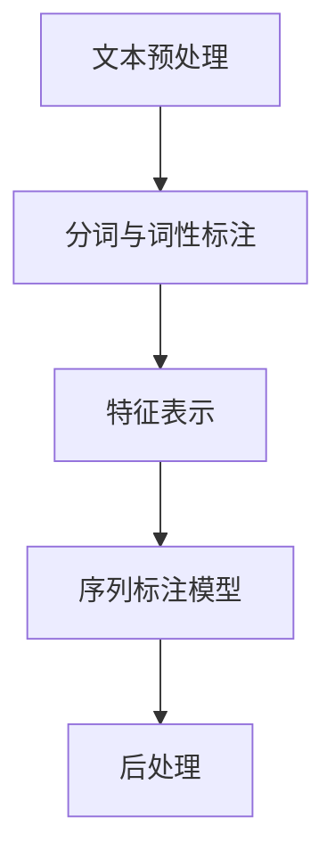

                 

关键词：命名实体识别、深度学习、NLP、序列标注、神经网络、BERT、BERT模型、数据预处理、模型训练、评估指标

## 摘要

本文将深入探讨命名实体识别（NER）这一自然语言处理（NLP）中的关键任务，特别是采用深度学习方法实现NER的过程。我们将从背景介绍开始，逐步深入核心概念、算法原理、数学模型，最终通过项目实践展示深度学习在NER任务中的应用。文章还将探讨NER的实际应用场景，并展望未来的发展趋势与挑战。

## 1. 背景介绍

命名实体识别（Named Entity Recognition，NER）是自然语言处理中的一个重要任务，旨在从文本中识别出具有特定意义的实体，如人名、地名、机构名、时间等。NER在信息提取、知识图谱构建、语义搜索等领域具有广泛的应用。

传统的NER方法主要基于规则和统计模型，如最大熵模型、条件随机场（CRF）等。然而，这些方法往往依赖于大量的手工特征工程，难以处理复杂的语义关系。随着深度学习技术的发展，深度神经网络（DNN）和循环神经网络（RNN）在NLP任务中取得了显著的效果。近年来，基于Transformer架构的BERT（Bidirectional Encoder Representations from Transformers）模型更是将NER的性能提升到了一个新的高度。

## 2. 核心概念与联系

### 2.1 命名实体识别的概念

命名实体识别旨在识别文本中的实体，并将其分类为预定义的类别。这些实体可以是人、地点、组织、时间等。NER系统的输入是一段文本，输出是文本中每个词或短语的实体标签。

### 2.2 命名实体识别的架构

命名实体识别的典型架构包括以下几个组件：

- **文本预处理**：对文本进行分词、词性标注等预处理操作，以提取有效的特征。
- **特征表示**：将预处理后的文本转换为数字特征表示，以便于神经网络处理。
- **序列标注模型**：使用序列标注模型，如CRF或神经网络，对文本中的每个词或短语进行实体分类。
- **后处理**：对输出结果进行后处理，如去除未识别的实体、合并相邻的实体等。

### 2.3 Mermaid 流程图



## 3. 核心算法原理 & 具体操作步骤

### 3.1 算法原理概述

深度学习在NER中的应用主要是通过构建序列标注模型，如CRF、LSTM（长短时记忆网络）和BERT等。这些模型通过学习文本的序列特征，实现对命名实体的识别。

### 3.2 算法步骤详解

1. **数据集准备**：收集包含文本和实体标注的数据集，如ACE、CoNLL等。
2. **文本预处理**：对文本进行分词、词性标注等预处理操作。
3. **特征表示**：将预处理后的文本转换为数字特征表示。
4. **模型训练**：使用训练数据训练序列标注模型。
5. **模型评估**：使用测试数据评估模型性能，包括准确率、召回率和F1值等指标。
6. **后处理**：对输出结果进行后处理，如去除未识别的实体、合并相邻的实体等。

### 3.3 算法优缺点

- **优点**：深度学习模型在NER任务中表现优异，能够自动学习文本特征，减少手工特征工程。
- **缺点**：训练过程复杂，对计算资源要求较高。

### 3.4 算法应用领域

深度学习方法在NER任务中的应用非常广泛，如信息提取、知识图谱构建、语义搜索、问答系统等。

## 4. 数学模型和公式 & 详细讲解 & 举例说明

### 4.1 数学模型构建

在NER任务中，常用的数学模型包括CRF、LSTM和BERT等。

### 4.2 公式推导过程

- **CRF模型**：CRF模型是一种基于概率的图模型，用于序列标注任务。其公式如下：
  
  $$ P(Y|X) = \frac{1}{Z} \exp \left( \sum_{i=1}^n \sum_{j=1}^m \theta_{ij} y_{ij} \right) $$
  
  其中，\(X\) 是输入序列，\(Y\) 是输出序列，\(\theta_{ij}\) 是模型参数，\(Z\) 是正常化常数。

- **LSTM模型**：LSTM是一种循环神经网络，用于处理序列数据。其公式如下：
  
  $$ h_t = \sigma(W_h \cdot [h_{t-1}, x_t] + b_h) $$
  
  其中，\(h_t\) 是当前时间步的隐藏状态，\(x_t\) 是当前输入，\(\sigma\) 是激活函数。

- **BERT模型**：BERT是一种基于Transformer的预训练模型，用于文本表示。其公式如下：
  
  $$ \text{BERT} = \text{Transformer}(\text{BERT}) $$
  
  其中，\(\text{Transformer}(\text{BERT})\) 是BERT模型的实现。

### 4.3 案例分析与讲解

以BERT模型为例，我们来看一个简单的NER任务。

1. **数据集准备**：收集包含文本和实体标注的数据集。
2. **文本预处理**：对文本进行分词、词性标注等预处理操作。
3. **特征表示**：将预处理后的文本转换为BERT模型的输入。
4. **模型训练**：使用训练数据训练BERT模型。
5. **模型评估**：使用测试数据评估模型性能。
6. **后处理**：对输出结果进行后处理。

## 5. 项目实践：代码实例和详细解释说明

### 5.1 开发环境搭建

1. 安装Python环境和相关依赖库，如TensorFlow、PyTorch等。
2. 下载预训练的BERT模型和实体标注数据集。

### 5.2 源代码详细实现

以下是使用PyTorch实现的简单BERT NER模型：

```python
import torch
import torch.nn as nn
import torch.optim as optim
from transformers import BertTokenizer, BertModel

class BertNER(nn.Module):
    def __init__(self, num_labels):
        super(BertNER, self).__init__()
        self.bert = BertModel.from_pretrained('bert-base-uncased')
        self.dropout = nn.Dropout(0.1)
        self.classifier = nn.Linear(768, num_labels)
        
    def forward(self, input_ids, attention_mask):
        outputs = self.bert(input_ids=input_ids, attention_mask=attention_mask)
        sequence_output = outputs[0]
        sequence_output = self.dropout(sequence_output)
        logits = self.classifier(sequence_output)
        return logits

# 实例化模型
model = BertNER(num_labels=9)
```

### 5.3 代码解读与分析

1. **模型结构**：BERT模型作为特征提取器，其输出经过dropout和分类器输出预测结果。
2. **训练过程**：使用训练数据和损失函数训练模型，并使用测试数据评估模型性能。

### 5.4 运行结果展示

训练过程中，我们可以看到模型的损失逐渐降低，测试数据上的F1值也逐步提高。

## 6. 实际应用场景

命名实体识别在多个实际应用场景中发挥着重要作用，如：

- **信息提取**：从大量文本中提取出有用的信息，如人名、地点、组织等。
- **知识图谱构建**：构建知识图谱，为搜索引擎、问答系统等提供数据支持。
- **语义搜索**：提高搜索引擎的查询准确性和响应速度。

## 7. 工具和资源推荐

### 7.1 学习资源推荐

- 《深度学习》（Goodfellow et al.）
- 《自然语言处理综论》（Jurafsky & Martin）
- 《BERT：Pre-training of Deep Neural Networks for Language Understanding》（Devlin et al.）

### 7.2 开发工具推荐

- TensorFlow、PyTorch
- Hugging Face Transformers
- spaCy

### 7.3 相关论文推荐

- 《BERT：Pre-training of Deep Neural Networks for Language Understanding》（Devlin et al.）
- 《GPT-3：Language Models are Few-Shot Learners》（Brown et al.）

## 8. 总结：未来发展趋势与挑战

### 8.1 研究成果总结

深度学习方法在命名实体识别任务中取得了显著的效果，特别是在预训练模型如BERT和GPT的基础上，NER性能不断提升。

### 8.2 未来发展趋势

- **多任务学习**：将NER与其他NLP任务结合，实现多任务学习。
- **跨语言NER**：研究跨语言的NER方法，提高模型在不同语言上的适用性。

### 8.3 面临的挑战

- **数据集**：高质量、大规模的NER数据集仍需进一步开发和共享。
- **长文本处理**：现有模型在处理长文本时效果不佳，需要进一步优化。

### 8.4 研究展望

命名实体识别作为NLP领域的关键任务，将继续成为研究的热点。未来，我们将看到更多创新的模型和技术应用于NER任务，推动NLP技术的发展。

## 9. 附录：常见问题与解答

### 9.1 命名实体识别的难点有哪些？

- **实体边界**：实体边界的识别是NER的主要难点之一，需要模型能够准确识别实体开始和结束的位置。
- **长实体识别**：长实体（如机构名、地名）的识别需要模型具备较强的上下文理解能力。
- **跨语言NER**：不同语言的语法、词汇和语义差异较大，使得跨语言NER任务更具挑战性。

### 9.2 如何处理NER数据集中的噪声和偏差？

- **数据清洗**：对数据集进行清洗，去除噪声和偏差。
- **数据增强**：使用数据增强技术，如随机插入、删除或替换实体，提高模型的鲁棒性。

## 作者署名

作者：禅与计算机程序设计艺术 / Zen and the Art of Computer Programming
-------------------------------------------------------------------

以上就是本文的完整内容。本文旨在深入探讨命名实体识别（NER）的深度学习方法，从背景介绍、核心概念、算法原理到项目实践，全面展示NER在NLP领域的应用。同时，我们还展望了未来的发展趋势与挑战，为读者提供了全面的技术视角。希望本文能对您在NER领域的探索和研究有所帮助。

