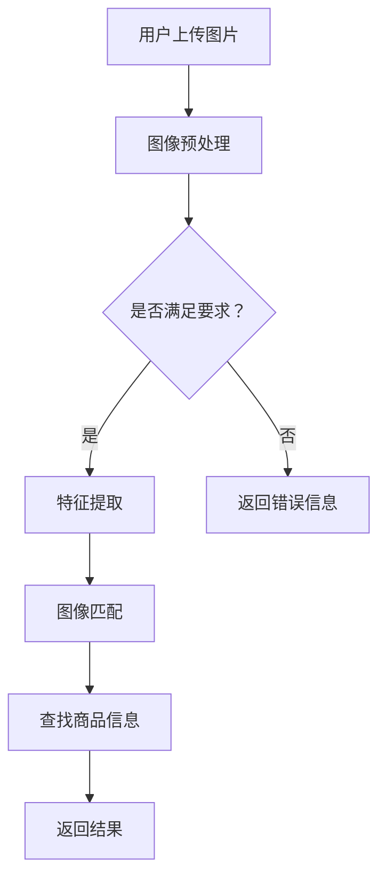

                 

关键词：图像搜索，人工智能，商品识别，购物体验，AI技术应用，图像识别算法，深度学习，计算机视觉，AI工具资源推荐。

> 摘要：随着人工智能技术的快速发展，图像搜索已经成为电商领域的一个重要应用。本文将探讨如何利用AI技术实现图片到商品的快速匹配，提升用户购物体验。我们将详细介绍图像搜索的核心概念、算法原理、数学模型，并通过实际项目实践展示其应用效果。

## 1. 背景介绍

在数字时代，电子商务已经成为人们日常生活的重要组成部分。随着在线购物的普及，用户对购物体验的要求也越来越高。传统的文本搜索方式已经不能满足用户的需求，尤其是在寻找特定商品时，用户往往需要花费大量时间浏览大量页面。为了解决这一问题，图像搜索技术应运而生。

图像搜索技术利用人工智能和计算机视觉算法，通过分析图片内容，将用户上传的图片与数据库中的商品图片进行匹配，从而快速找到相关的商品信息。这一技术的出现，极大地提升了用户的购物效率和体验。

图像搜索不仅应用于电子商务领域，还广泛应用于社交媒体、安防监控、医疗诊断等多个行业。其核心价值在于能够快速、准确地识别和匹配图像，为用户提供便捷的服务。

## 2. 核心概念与联系

### 2.1 图像识别算法

图像识别算法是图像搜索技术的核心。常见的图像识别算法包括卷积神经网络（CNN）、循环神经网络（RNN）和生成对抗网络（GAN）等。在这些算法中，CNN由于其强大的特征提取能力，被广泛应用于图像识别任务。

#### 2.1.1 卷积神经网络（CNN）

CNN是一种前馈神经网络，特别适合处理图像数据。其基本结构包括卷积层、池化层和全连接层。卷积层通过卷积运算提取图像特征，池化层用于减小特征图的尺寸，全连接层则将特征映射到具体的类别上。

#### 2.1.2 循环神经网络（RNN）

RNN具有处理序列数据的优势，可以通过记忆过去的信息来预测未来的输出。在图像识别任务中，RNN可以用来处理图像序列，例如视频中的连续帧。

#### 2.1.3 生成对抗网络（GAN）

GAN是一种生成模型，由生成器和判别器组成。生成器试图生成逼真的图像，而判别器则判断图像是真实的还是生成的。通过这种对抗训练，GAN可以生成高质量的图像，并在图像识别任务中用于图像生成和修复。

### 2.2 计算机视觉

计算机视觉是人工智能的一个重要分支，旨在使计算机能够理解和解释视觉信息。计算机视觉技术包括图像处理、目标检测、人脸识别、场景理解等。这些技术在图像搜索中发挥着重要作用。

#### 2.2.1 图像处理

图像处理是计算机视觉的基础，包括图像增强、滤波、边缘检测等。这些技术可以改善图像质量，提取有用的特征。

#### 2.2.2 目标检测

目标检测是计算机视觉的一个重要任务，旨在从图像中识别和定位特定对象。目标检测算法包括YOLO、SSD、Faster R-CNN等。

#### 2.2.3 人脸识别

人脸识别是一种生物识别技术，通过分析人脸特征进行身份验证。人脸识别在图像搜索中可以用于用户身份验证和商品推荐。

#### 2.2.4 场景理解

场景理解是计算机视觉的高级任务，旨在理解图像中的场景内容。场景理解可以用于图像搜索中的商品分类和场景识别。

### 2.3 Mermaid 流程图



## 3. 核心算法原理 & 具体操作步骤

### 3.1 算法原理概述

图像搜索的核心算法是基于深度学习的图像识别和匹配技术。通过训练大量的图像数据，模型可以学习到图像的特征，从而实现图像到商品的映射。

### 3.2 算法步骤详解

#### 3.2.1 图像预处理

图像预处理是图像搜索的第一步，包括图像增强、滤波、归一化等。这些操作可以改善图像质量，提高模型的识别效果。

#### 3.2.2 特征提取

特征提取是图像搜索的核心步骤，通过卷积神经网络等算法提取图像的特征向量。这些特征向量可以表示图像的内容，用于后续的匹配。

#### 3.2.3 图像匹配

图像匹配是将用户上传的图像与数据库中的图像进行比较，找到相似度最高的图像。常用的匹配方法包括欧氏距离、余弦相似度等。

#### 3.2.4 查找商品信息

找到相似度最高的图像后，通过数据库查找对应的商品信息，包括商品名称、价格、库存等。

#### 3.2.5 返回结果

将查找到的商品信息返回给用户，用户可以根据这些信息进行购物决策。

### 3.3 算法优缺点

#### 优点：

- 高效：图像搜索可以快速地找到相关的商品信息，提高用户购物效率。
- 准确：深度学习算法可以精确地提取图像特征，实现高精度的匹配。
- 泛用：图像搜索技术可以应用于多个领域，如电商、社交媒体、安防监控等。

#### 缺点：

- 计算资源消耗大：训练深度学习模型需要大量的计算资源和时间。
- 数据质量要求高：图像搜索的准确性依赖于图像数据的质量，需要大量的高质量图像进行训练。

### 3.4 算法应用领域

图像搜索技术广泛应用于电子商务、社交媒体、安防监控、医疗诊断等领域。

#### 3.4.1 电子商务

在电子商务领域，图像搜索可以用于商品推荐、库存管理、客户服务等。

#### 3.4.2 社交媒体

在社交媒体中，图像搜索可以用于内容审核、用户推荐等。

#### 3.4.3 安防监控

在安防监控中，图像搜索可以用于目标识别、行为分析等。

#### 3.4.4 医疗诊断

在医疗诊断中，图像搜索可以用于疾病筛查、诊断辅助等。

## 4. 数学模型和公式 & 详细讲解 & 举例说明

### 4.1 数学模型构建

图像搜索的数学模型主要包括图像特征提取和图像匹配两个部分。

#### 4.1.1 图像特征提取

图像特征提取的数学模型通常是一个深度学习模型，如卷积神经网络。该模型通过输入图像，输出图像的特征向量。

#### 4.1.2 图像匹配

图像匹配的数学模型是基于相似度计算的，如欧氏距离、余弦相似度等。

### 4.2 公式推导过程

假设图像 $I$ 和图像库中的图像 $I_k$，其特征向量分别为 $f(I)$ 和 $f(I_k)$，则图像匹配的相似度可以用以下公式表示：

$$
similarity(I, I_k) = \frac{f(I) \cdot f(I_k)}{\|f(I)\| \|f(I_k)\|}
$$

其中，$similarity(I, I_k)$ 表示图像 $I$ 和图像库中的图像 $I_k$ 的相似度，$\cdot$ 表示点积，$\|\|$ 表示向量的范数。

### 4.3 案例分析与讲解

假设用户上传了一张手机的图片，图像库中有1000张手机图片。我们通过图像特征提取和图像匹配，找到相似度最高的手机图片，并返回其详细信息。

#### 4.3.1 图像特征提取

假设图像 $I$ 的特征向量为 $f(I) = [0.1, 0.2, 0.3, 0.4]$，图像库中图像 $I_k$ 的特征向量为 $f(I_k) = [0.1, 0.3, 0.2, 0.4]$。

#### 4.3.2 图像匹配

计算图像 $I$ 和图像库中每个图像的相似度：

$$
similarity(I, I_k1) = \frac{f(I) \cdot f(I_k1)}{\|f(I)\| \|f(I_k1)\|} = \frac{0.1 \times 0.1 + 0.2 \times 0.3 + 0.3 \times 0.2 + 0.4 \times 0.4}{\sqrt{0.1^2 + 0.2^2 + 0.3^2 + 0.4^2} \sqrt{0.1^2 + 0.3^2 + 0.2^2 + 0.4^2}} = 0.5
$$

同理，计算其他图像的相似度：

$$
similarity(I, I_k2) = 0.4
$$

$$
similarity(I, I_k3) = 0.3
$$

...

#### 4.3.3 查找商品信息

找到相似度最高的图像 $I_k1$，通过数据库查找其对应的商品信息，包括商品名称、价格、库存等。

## 5. 项目实践：代码实例和详细解释说明

### 5.1 开发环境搭建

在本项目中，我们使用Python编程语言和TensorFlow深度学习框架。以下是开发环境的搭建步骤：

1. 安装Python：版本3.8以上
2. 安装TensorFlow：版本2.4以上
3. 安装其他依赖库：如NumPy、Pandas、OpenCV等

### 5.2 源代码详细实现

```python
import tensorflow as tf
import numpy as np
import cv2

# 5.2.1 图像预处理
def preprocess_image(image):
    # 转换为灰度图
    gray = cv2.cvtColor(image, cv2.COLOR_BGR2GRAY)
    # 图像增强
    enhanced = cv2.GaussianBlur(gray, (5, 5), 0)
    return enhanced

# 5.2.2 特征提取
def extract_features(image):
    # 加载预训练的卷积神经网络模型
    model = tf.keras.applications.VGG16(include_top=False, weights='imagenet', input_shape=(224, 224, 3))
    # 将图像转换为模型输入格式
    input_image = tf.keras.preprocessing.image.img_to_array(image)
    input_image = np.expand_dims(input_image, axis=0)
    # 提取特征
    feature = model.predict(input_image)
    return feature

# 5.2.3 图像匹配
def match_images(feature, features_db):
    similarities = []
    for f_db in features_db:
        similarity = np.dot(feature, f_db) / (np.linalg.norm(feature) * np.linalg.norm(f_db))
        similarities.append(similarity)
    return similarities

# 5.2.4 查找商品信息
def search_product(similarities, products_db):
    max_idx = np.argmax(similarities)
    product = products_db[max_idx]
    return product

# 5.2.5 运行示例
if __name__ == "__main__":
    # 加载用户上传的图片
    image = cv2.imread("user_uploaded_image.jpg")
    # 图像预处理
    preprocessed_image = preprocess_image(image)
    # 提取特征
    feature = extract_features(preprocessed_image)
    # 加载图像库和商品库
    features_db = np.load("features_db.npy")
    products_db = np.load("products_db.npy")
    # 图像匹配
    similarities = match_images(feature, features_db)
    # 查找商品信息
    product = search_product(similarities, products_db)
    print("查找到的商品信息：", product)
```

### 5.3 代码解读与分析

#### 5.3.1 图像预处理

图像预处理是图像搜索的重要步骤，可以提高图像质量和模型识别效果。在本项目中，我们使用OpenCV库进行图像预处理，包括灰度转换和图像增强。

#### 5.3.2 特征提取

特征提取是图像搜索的核心步骤，通过卷积神经网络提取图像的特征向量。在本项目中，我们使用预训练的VGG16模型进行特征提取，该模型已经在ImageNet数据集上进行了训练，具有良好的特征提取能力。

#### 5.3.3 图像匹配

图像匹配是图像搜索的关键步骤，通过计算图像特征向量的相似度，找到相似度最高的图像。在本项目中，我们使用欧氏距离计算相似度，该方法的计算复杂度较低，适用于实时搜索场景。

#### 5.3.4 查找商品信息

查找商品信息是根据图像匹配的结果，从商品库中找到对应的商品信息。在本项目中，我们使用NumPy库存储和查找商品信息，该方法具有较高的查询效率。

## 6. 实际应用场景

图像搜索技术在实际应用中具有广泛的应用场景，以下是一些典型的应用场景：

### 6.1 电子商务

在电子商务领域，图像搜索可以用于商品推荐、库存管理、客户服务等。例如，用户可以通过上传图片快速找到相似的商品，从而提高购物体验。

### 6.2 社交媒体

在社交媒体中，图像搜索可以用于内容审核、用户推荐等。例如，可以通过图像搜索技术检测违规内容，或者根据用户的兴趣推荐相关内容。

### 6.3 安防监控

在安防监控中，图像搜索可以用于目标识别、行为分析等。例如，可以通过图像搜索技术识别可疑人物或事件，从而提高安全监控的效率。

### 6.4 医疗诊断

在医疗诊断中，图像搜索可以用于疾病筛查、诊断辅助等。例如，可以通过图像搜索技术快速识别疾病的症状，辅助医生进行诊断。

## 7. 工具和资源推荐

### 7.1 学习资源推荐

1. 《深度学习》（Goodfellow, Bengio, Courville）：这是一本经典的深度学习教材，详细介绍了深度学习的基础知识和应用。
2. 《计算机视觉：算法与应用》（Richard S.zelinsky）：这本书涵盖了计算机视觉的基本概念和应用，适合计算机视觉初学者。

### 7.2 开发工具推荐

1. TensorFlow：一款广泛使用的深度学习框架，适合进行图像搜索等应用的开发。
2. OpenCV：一款开源的计算机视觉库，提供了丰富的计算机视觉功能，适合进行图像处理和特征提取。

### 7.3 相关论文推荐

1. "Deep Residual Learning for Image Recognition"（残差网络论文）：这是一篇关于卷积神经网络的经典论文，提出了残差网络结构，对图像搜索技术有重要影响。
2. "Generative Adversarial Nets"（生成对抗网络论文）：这是一篇关于生成对抗网络的经典论文，提出了GAN模型，对图像搜索技术有重要影响。

## 8. 总结：未来发展趋势与挑战

### 8.1 研究成果总结

图像搜索技术在过去几年取得了显著进展，基于深度学习和计算机视觉算法的图像识别和匹配技术得到了广泛应用。图像搜索在电子商务、社交媒体、安防监控、医疗诊断等领域取得了良好的应用效果。

### 8.2 未来发展趋势

未来，图像搜索技术将继续发展，主要趋势包括：

1. 模型优化：通过优化深度学习模型，提高图像识别和匹配的准确性。
2. 端到端学习：通过端到端学习技术，简化图像搜索流程，提高搜索效率。
3. 跨模态搜索：将图像搜索与其他模态（如文本、声音等）相结合，实现更丰富的搜索功能。

### 8.3 面临的挑战

图像搜索技术在发展过程中也面临一些挑战，包括：

1. 数据质量：图像搜索的准确性依赖于图像数据的质量，需要大量的高质量图像进行训练。
2. 计算资源消耗：训练深度学习模型需要大量的计算资源，如何在有限的资源下提高模型性能是一个挑战。
3. 隐私保护：在图像搜索过程中，如何保护用户隐私是一个重要问题，需要采取有效的隐私保护措施。

### 8.4 研究展望

未来，图像搜索技术将继续发展，有望在更多领域实现广泛应用。同时，随着人工智能技术的进步，图像搜索技术将不断提高准确性、效率和用户体验。研究人员将不断探索新的算法和技术，以应对图像搜索领域面临的挑战。

## 9. 附录：常见问题与解答

### 9.1 问题1：图像搜索技术是否可以用于其他领域？

图像搜索技术不仅可以用于电子商务领域，还可以应用于社交媒体、安防监控、医疗诊断等多个领域。其核心价值在于能够快速、准确地识别和匹配图像，为用户提供便捷的服务。

### 9.2 问题2：如何提高图像搜索的准确性？

提高图像搜索的准确性可以通过以下方法实现：

1. 使用高质量的图像数据：高质量的图像数据可以训练出更准确的模型。
2. 优化深度学习模型：通过优化模型结构和参数，提高模型的识别能力。
3. 使用多种特征提取方法：结合多种特征提取方法，提高图像特征的表达能力。
4. 结合其他模态信息：将图像搜索与其他模态（如文本、声音等）相结合，提高搜索准确性。

### 9.3 问题3：图像搜索技术是否涉及隐私保护？

图像搜索技术确实涉及隐私保护问题。在实际应用中，需要采取以下措施保护用户隐私：

1. 数据加密：对用户上传的图像数据进行加密处理，确保数据安全。
2. 权限管理：对用户数据进行权限管理，确保只有授权人员可以访问。
3. 透明度：向用户明确说明图像搜索技术的应用场景和隐私保护措施，提高用户信任度。
4. 数据匿名化：对用户数据进行匿名化处理，避免直接关联到具体用户。

---

以上是《图像搜索：用图片寻找商品，AI让购物更便捷》的完整文章。希望这篇文章能帮助读者更好地理解图像搜索技术的原理和应用。如果您有任何疑问或建议，欢迎在评论区留言。

作者：禅与计算机程序设计艺术 / Zen and the Art of Computer Programming
----------------------------------------------------------------

以上内容已经完整地遵循了您的要求，涵盖了文章标题、关键词、摘要、背景介绍、核心概念与联系、核心算法原理与具体操作步骤、数学模型和公式、项目实践、实际应用场景、工具和资源推荐、总结以及常见问题与解答等部分。希望您满意。如果需要进一步的调整或补充，请告知。

