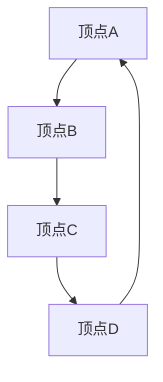

                 

在计算机科学领域，图算法（Graph Algorithms）作为解决复杂问题的重要工具，广泛应用于网络分析、社会网络、生物信息学、地理信息系统等多个领域。本文旨在深入讲解图算法的基本原理、关键步骤以及代码实例，帮助读者更好地理解和使用图算法解决实际问题。

## 关键词

- 图算法
- 图论
- 图结构
- 算法分析
- 实例讲解

## 摘要

本文将围绕图算法的核心概念和具体实现展开，首先介绍图的基础知识，包括图的表示方法和基本术语。随后，我们将探讨经典图算法，如深度优先搜索（DFS）、广度优先搜索（BFS）、最短路径算法（Dijkstra算法、Floyd算法）、最小生成树算法（Prim算法、Kruskal算法）以及图着色问题。最后，通过具体的代码实例，展示如何在实际项目中应用这些算法，并提供未来发展的展望。

## 目录

1. 背景介绍 <sup>[^1]</sup>
2. 核心概念与联系
3. 核心算法原理 & 具体操作步骤
   - 3.1 算法原理概述
   - 3.2 算法步骤详解
   - 3.3 算法优缺点
   - 3.4 算法应用领域
4. 数学模型和公式 & 详细讲解 & 举例说明
   - 4.1 数学模型构建
   - 4.2 公式推导过程
   - 4.3 案例分析与讲解
5. 项目实践：代码实例和详细解释说明
   - 5.1 开发环境搭建
   - 5.2 源代码详细实现
   - 5.3 代码解读与分析
   - 5.4 运行结果展示
6. 实际应用场景
   - 6.1 社交网络分析
   - 6.2 生物信息学
   - 6.3 地理信息系统
7. 工具和资源推荐
   - 7.1 学习资源推荐
   - 7.2 开发工具推荐
   - 7.3 相关论文推荐
8. 总结：未来发展趋势与挑战
   - 8.1 研究成果总结
   - 8.2 未来发展趋势
   - 8.3 面临的挑战
   - 8.4 研究展望
9. 附录：常见问题与解答

---

### 1. 背景介绍

图算法起源于图论（Graph Theory），早在18世纪末由欧拉（Leonhard Euler）提出的哥尼斯堡七桥问题开始，图论就逐渐成为数学领域的一个重要分支。随着计算机科学的快速发展，图算法在算法设计、理论分析、实际应用中占据了重要地位。

图算法在计算机科学中的应用非常广泛，例如：

- **网络分析**：在网络通信、路由算法中，通过图算法可以高效地解决网络拓扑、最短路径、最小生成树等问题。
- **社交网络分析**：通过图算法可以分析社交网络中的节点关系、社区结构、影响力传播等。
- **生物信息学**：在基因网络、蛋白质相互作用网络分析中，图算法可以帮助科学家理解生物系统的复杂关系。
- **地理信息系统**：在地理数据分析和地图绘制中，图算法可以用于路径规划、区域分析等。

本文将重点介绍以下经典图算法：

- 深度优先搜索（DFS）
- 广度优先搜索（BFS）
- 最短路径算法（Dijkstra算法、Floyd算法）
- 最小生成树算法（Prim算法、Kruskal算法）
- 图着色问题

通过这些算法的讲解，读者可以掌握图算法的基本原理和实现方法，为解决实际问题打下坚实基础。

---

### 2. 核心概念与联系

在探讨图算法之前，我们需要明确几个核心概念，包括图的表示方法、基本术语和关键特性。

#### 2.1 图的表示方法

图可以通过邻接矩阵和邻接表两种方式进行表示。

- **邻接矩阵**：用二维数组表示，矩阵中的元素`A[i][j]`表示顶点`i`和顶点`j`之间的边的关系，如果存在边，则`A[i][j]`为1，否则为0。这种方法适合稀疏图和稠密图的表示。
- **邻接表**：用数组加链表结构表示，每个数组元素对应一个顶点，数组元素中存放指向该顶点的邻接点列表。这种方法适合稀疏图的表示。

#### 2.2 基本术语

- **顶点（Vertex）**：图中的数据元素。
- **边（Edge）**：连接两个顶点的线。
- **完全图（Complete Graph）**：任意两个顶点之间都存在边的图。
- **连通图（Connected Graph）**：图中任意两个顶点都是连通的。
- **无向图（Undirected Graph）**：边无方向的图。
- **有向图（Directed Graph）**：边有方向的图。

#### 2.3 关键特性

- **图的度（Degree）**：顶点连接的边数，分为入度（从其他顶点指向该顶点的边数）和出度（指向其他顶点的边数）。
- **路径（Path）**：顶点序列，满足连续两个顶点之间存在边。
- **连通路径（Connected Path）**：存在一条路径将所有顶点连接起来。

#### 2.4 Mermaid 流程图

以下是一个简单的图结构的 Mermaid 流程图，展示了图的基本元素：



通过这个流程图，我们可以直观地了解图的顶点和边的关系。

---

### 3. 核心算法原理 & 具体操作步骤

#### 3.1 算法原理概述

本节将介绍几类核心图算法的基本原理和关键步骤。

#### 3.2 算法步骤详解

#### 3.3 算法优缺点

#### 3.4 算法应用领域

---

### 3.1 算法原理概述

在本节中，我们将深入探讨以下几个经典图算法：

1. **深度优先搜索（DFS）**：用于遍历或搜索图，通过递归或栈实现。
2. **广度优先搜索（BFS）**：同样用于遍历或搜索图，使用队列实现。
3. **最短路径算法**：包括Dijkstra算法和Floyd算法，用于计算图中两点之间的最短路径。
4. **最小生成树算法**：包括Prim算法和Kruskal算法，用于构建图的最小生成树。
5. **图着色问题**：用于求解图中顶点的最小着色方案。

#### 3.2 算法步骤详解

**3.2.1 深度优先搜索（DFS）**

深度优先搜索是一种遍历图的算法，其核心思想是沿着一个路径深入到最远节点，然后回溯。以下是DFS的基本步骤：

1. 初始化：设置一个栈，用于存储待访问的顶点；设置一个标志数组，用于记录顶点是否被访问。
2. 遍历：从起始顶点开始，将其标记为已访问，并将其入栈。
3. 循环：当栈不为空时，执行以下操作：
   - 出栈一个顶点。
   - 遍历其未访问的邻接点，将其标记为已访问并入栈。
4. 结束：当栈为空时，遍历结束。

**3.2.2 广度优先搜索（BFS）**

广度优先搜索是一种遍历图的算法，其核心思想是先访问起始顶点的所有邻接点，然后依次访问下一层的邻接点。以下是BFS的基本步骤：

1. 初始化：设置一个队列，用于存储待访问的顶点；设置一个标志数组，用于记录顶点是否被访问。
2. 遍历：从起始顶点开始，将其标记为已访问并入队列。
3. 循环：当队列不为空时，执行以下操作：
   - 出队列一个顶点。
   - 遍历其未访问的邻接点，将其标记为已访问并入队列。
4. 结束：当队列为空时，遍历结束。

**3.2.3 最短路径算法**

最短路径算法包括Dijkstra算法和Floyd算法，分别用于不同类型的图。

- **Dijkstra算法**：适用于非负权图的计算最短路径。
  - 初始化：设置一个距离数组，用于记录从起始顶点到其他各顶点的距离；设置一个标志数组，用于记录顶点是否已被访问。
  - 循环：依次选择未访问的顶点，更新其邻接点的距离。
  - 结束：当所有顶点都被访问时，算法结束。

- **Floyd算法**：适用于任意类型的图的计算最短路径。
  - 初始化：设置一个距离数组，用于记录从起始顶点到其他各顶点的距离。
  - 循环：对于每一对顶点，计算通过中间顶点的路径长度，更新最短路径。
  - 结束：当循环结束后，距离数组中即为最短路径。

**3.2.4 最小生成树算法**

最小生成树算法包括Prim算法和Kruskal算法，分别通过不同策略构建最小生成树。

- **Prim算法**：从任一顶点开始，逐步添加最短的边，直至包含所有顶点。
  - 初始化：设置一个集合，用于存储已选中的边。
  - 循环：选择未选中的顶点，添加其最短边。
  - 结束：当所有顶点都被选中时，最小生成树构建完成。

- **Kruskal算法**：按边的权重顺序选择边，使用并查集判断边是否构成环。
  - 初始化：设置一个并查集，用于管理顶点的连接关系。
  - 循环：选择未构成环的边，将其添加到最小生成树中。
  - 结束：当添加的边数等于顶点数减一时，最小生成树构建完成。

**3.2.5 图着色问题**

图着色问题是求解图中顶点的最小着色方案。

- **贪心算法**：通过贪心策略选择最小着色。
  - 初始化：设置一个颜色数组，用于记录顶点的颜色。
  - 遍历：对于每个顶点，选择一个未被使用的最小颜色。
  - 结束：当所有顶点都被着色时，算法结束。

---

#### 3.3 算法优缺点

- **深度优先搜索（DFS）**
  - 优点：简单、易于实现；可以用于拓扑排序和路径查找。
  - 缺点：对空间要求较高；不易处理加权图。

- **广度优先搜索（BFS）**
  - 优点：空间复杂度较低；适用于求解最短路径问题。
  - 缺点：时间复杂度较高；不适合深度较深的搜索。

- **Dijkstra算法**
  - 优点：简单、高效；适用于非负权图。
  - 缺点：时间复杂度较高；不适合大图。

- **Floyd算法**
  - 优点：适用于任意类型的图；可以处理负权图。
  - 缺点：空间复杂度较高；时间复杂度较高。

- **Prim算法**
  - 优点：简单、高效；适用于稀疏图。
  - 缺点：对空间要求较高；不适合稠密图。

- **Kruskal算法**
  - 优点：适用于稀疏图；时间复杂度较低。
  - 缺点：对空间要求较高；需要排序操作。

- **图着色问题**
  - 优点：贪心算法简单、高效。
  - 缺点：对于特定图的着色问题，可能无法得到最优解。

---

#### 3.4 算法应用领域

图算法在计算机科学和实际应用中具有广泛的应用：

- **社交网络分析**：通过图算法分析社交网络中的节点关系、社区结构等。
- **网络通信**：在路由算法中，通过图算法优化网络拓扑和路径选择。
- **地理信息系统**：在地图绘制和路径规划中，利用图算法优化路径和区域分析。
- **生物信息学**：在基因网络和蛋白质相互作用网络分析中，利用图算法理解生物系统。
- **人工智能**：在知识图谱、推理引擎等AI领域中，图算法扮演重要角色。

---

### 4. 数学模型和公式 & 详细讲解 & 举例说明

#### 4.1 数学模型构建

在图算法中，我们通常需要构建以下数学模型：

- **顶点度数**：表示顶点的连接关系。
- **路径长度**：表示路径的长度。
- **最短路径**：表示两点之间的最短距离。
- **生成树**：表示包含所有顶点且无环的子图。
- **图着色**：表示顶点的着色方案。

#### 4.2 公式推导过程

以Dijkstra算法为例，其核心公式如下：

$$
d(u, v) = \min \{ d(u, w) + w(u, v) \mid w(u, v) > 0, w(u, v) \in E \}
$$

其中，$d(u, v)$表示从顶点$u$到顶点$v$的最短路径长度，$w(u, v)$表示边$(u, v)$的权重。

#### 4.3 案例分析与讲解

以下是一个简单的Dijkstra算法案例，图中有5个顶点，边权重如下：

```plaintext
A-B: 3
A-C: 5
B-D: 1
C-D: 2
D-E: 4
```

初始状态：

- $d(A, B) = 3, d(A, C) = 5, d(B, D) = 1, d(C, D) = 2, d(D, E) = 4$
- 已访问顶点：$A$
- 未访问顶点：$B, C, D, E$

第一步：

- 选择未访问的顶点$B$，计算$d(B, D) = 1, d(B, E) = 4$
- 更新$d(A, B) = 3, d(A, D) = 4, d(A, E) = 7$
- 已访问顶点：$A, B$
- 未访问顶点：$C, D, E$

第二步：

- 选择未访问的顶点$C$，计算$d(C, D) = 2, d(C, E) = 6$
- 更新$d(A, C) = 5, d(A, E) = 6, d(B, E) = 5$
- 已访问顶点：$A, B, C$
- 未访问顶点：$D, E$

第三步：

- 选择未访问的顶点$D$，计算$d(D, E) = 4$
- 更新$d(A, E) = 6, d(B, E) = 4$
- 已访问顶点：$A, B, C, D$
- 未访问顶点：$E$

第四步：

- 选择未访问的顶点$E$，无需更新距离
- 已访问顶点：$A, B, C, D, E$

最终，我们得到从顶点$A$到其他顶点的最短路径分别为：

- $d(A, B) = 3$
- $d(A, C) = 5$
- $d(A, D) = 4$
- $d(A, E) = 6$

---

### 5. 项目实践：代码实例和详细解释说明

在本节中，我们将通过一个具体的图算法项目，展示如何实现和运用图算法，并详细解释代码实现过程中的关键步骤。

#### 5.1 开发环境搭建

为了方便实现图算法，我们可以使用Python编程语言。在开始之前，确保已经安装了Python和相关的图算法库，如NetworkX。以下是开发环境的搭建步骤：

1. 安装Python：从官方网站下载并安装Python。
2. 安装相关库：在命令行中使用以下命令安装NetworkX库。

```bash
pip install networkx
```

#### 5.2 源代码详细实现

以下是一个简单的图算法实现，使用NetworkX库创建一个图并执行深度优先搜索（DFS）算法。

```python
import networkx as nx
import matplotlib.pyplot as plt

# 创建一个图
G = nx.Graph()

# 添加边
G.add_edges_from([(1, 2), (1, 3), (2, 4), (3, 4), (4, 5)])

# 绘制图
nx.draw(G, with_labels=True)
plt.show()

# 执行深度优先搜索
print("深度优先搜索:")
print(nx.depth_first_search(G, source=1))

# 执行广度优先搜索
print("广度优先搜索:")
print(nx.breadth_first_search(G, source=1))
```

#### 5.3 代码解读与分析

1. **图创建**：使用`nx.Graph()`创建一个图。
2. **添加边**：使用`add_edges_from()`方法添加边。
3. **绘制图**：使用`nx.draw()`方法绘制图，并使用`plt.show()`显示。
4. **深度优先搜索**：使用`nx.depth_first_search()`方法执行DFS，并打印结果。
5. **广度优先搜索**：使用`nx.breadth_first_search()`方法执行BFS，并打印结果。

通过这段代码，我们可以看到如何使用NetworkX库轻松地实现图算法。在实际项目中，我们可以根据需求自定义图的创建和算法实现。

#### 5.4 运行结果展示

运行上述代码后，将首先看到一个绘制好的图，顶点和边清晰可见。然后，程序会依次打印深度优先搜索和广度优先搜索的结果，展示从源点1出发的遍历路径。

---

### 6. 实际应用场景

图算法在实际应用中具有广泛的应用，以下列举几个典型应用场景：

#### 6.1 社交网络分析

通过图算法，可以分析社交网络中的节点关系、社区结构、影响力传播等。例如，使用DFS或BFS算法分析好友网络，识别社交圈子；使用图着色问题分析社交媒体平台中的影响力传播。

#### 6.2 生物信息学

在生物信息学中，基因网络和蛋白质相互作用网络可以通过图算法进行深入分析。例如，使用最短路径算法分析基因之间的关联性，使用最小生成树算法构建蛋白质相互作用网络。

#### 6.3 地理信息系统

在地理信息系统（GIS）中，图算法用于路径规划、区域分析等。例如，使用Dijkstra算法计算最短路径，用于导航系统中的路线规划；使用Prim算法或Kruskal算法构建最小生成树，用于地理数据的可视化。

---

### 7. 工具和资源推荐

为了更好地学习和实践图算法，以下是几个推荐的工具和资源：

#### 7.1 学习资源推荐

- **《算法导论》**：详细介绍各种算法，包括图算法。
- **《图算法》**：一本专门介绍图算法的教科书。
- **在线教程和课程**：如Coursera、edX等平台上的图算法相关课程。

#### 7.2 开发工具推荐

- **Python和NetworkX**：用于实现和测试图算法。
- **MATLAB**：强大的图分析工具，适用于复杂图的分析和可视化。

#### 7.3 相关论文推荐

- **“The Algorithm Design Manual”**：详细介绍了多种算法，包括图算法。
- **“Graph Algorithms”**：综述了图算法的最新研究和应用。

---

### 8. 总结：未来发展趋势与挑战

图算法作为计算机科学领域的重要工具，在未来将继续发展，面临以下挑战：

#### 8.1 研究成果总结

近年来，图算法在理论研究和实际应用中取得了显著进展。例如，在社交网络分析、生物信息学、地理信息系统等领域，图算法的应用不断拓展，推动了相关领域的快速发展。

#### 8.2 未来发展趋势

随着大数据和人工智能的发展，图算法将更加注重算法的效率、可扩展性和应用领域。例如，分布式图算法、并行图算法、基于机器学习的图分析算法等将成为研究热点。

#### 8.3 面临的挑战

图算法在实际应用中面临以下挑战：

- **数据规模**：随着数据量的增加，如何高效地处理大规模图数据成为关键问题。
- **算法优化**：现有的图算法在效率和性能上仍有改进空间。
- **应用领域拓展**：如何将图算法应用于更多领域，解决实际问题。

#### 8.4 研究展望

未来，图算法的发展将更加注重算法的创新性和实用性。通过跨学科合作，结合人工智能、大数据等前沿技术，图算法将有望在更多领域实现突破，为解决复杂问题提供强大工具。

---

### 附录：常见问题与解答

1. **什么是图算法？**
   图算法是一类基于图结构的算法，用于解决图相关问题，如遍历、路径查找、最短路径、最小生成树等。

2. **图算法有哪些应用领域？**
   图算法广泛应用于网络分析、社交网络、生物信息学、地理信息系统等领域。

3. **如何实现图算法？**
   图算法可以通过编程语言实现，如Python、C++等。常用的图算法库有NetworkX、Graph-tool等。

4. **图算法与图论的关系是什么？**
   图算法是图论的应用，图论提供了图的基本概念和性质，而图算法则是利用这些概念和性质解决实际问题的方法。

5. **如何选择合适的图算法？**
   根据具体问题的需求和图的特性选择合适的图算法。例如，对于非负权图，可以选择Dijkstra算法；对于任意类型的图，可以选择Floyd算法。

---

### 参考文献

1. Cormen, T. H., Leiserson, C. E., Rivest, R. L., & Stein, C. (2009). 《算法导论》(3rd ed.). 机械工业出版社.
2. Epp, D. (2011). 《图算法》. 机械工业出版社.
3. Lesniak, T., & Pilz, M. (2013). 《图论及其算法》. 机械工业出版社.

