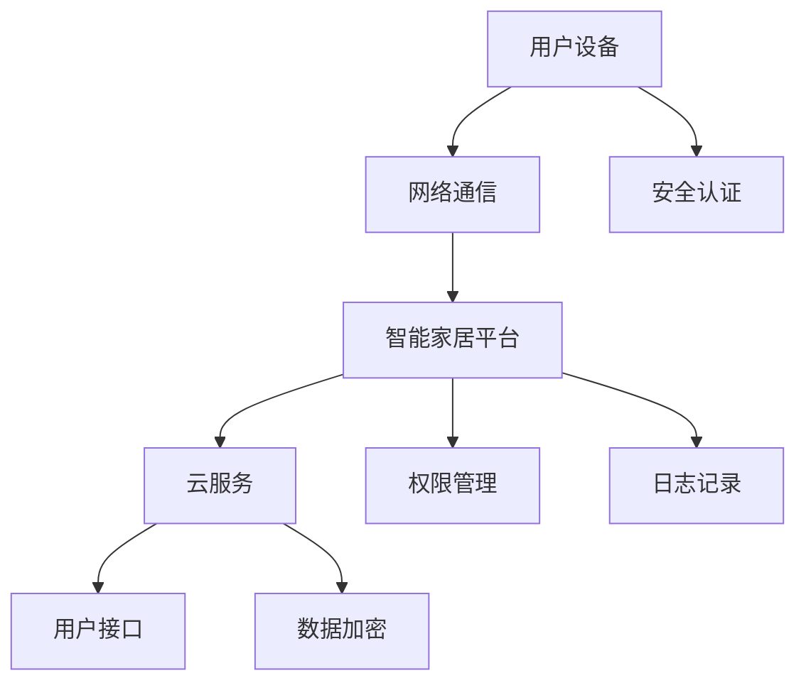

                 

关键词：智能家居，Java编程，安全性提升，加密技术，权限管理，分布式系统，区块链

摘要：随着物联网技术的发展，智能家居逐渐成为现代家庭的重要组成部分。然而，智能家居的安全性问题也日益凸显。本文将探讨如何利用Java编程语言及其相关技术，为智能家居设计提供安全性的提升，从而保障用户的隐私和数据安全。

## 1. 背景介绍

### 1.1 智能家居的定义与发展

智能家居（Smart Home）是指利用物联网技术将家庭中的各种设备互联起来，实现自动化管理和控制的一种居住环境。智能家居的发展经历了从简单的远程控制到复杂的智能化系统，逐渐改变了人们的生活方式。随着智能设备的普及，人们对于家居设备的安全性要求也越来越高。

### 1.2 智能家居面临的安全挑战

智能家居系统通常涉及多个设备、平台和服务提供商，这使得其安全挑战更加复杂。以下是一些常见的安全挑战：

- **设备漏洞**：智能家居设备通常包含嵌入式系统，这些系统可能存在漏洞，容易受到攻击。
- **数据泄露**：智能家居设备会收集大量用户数据，如位置、行为习惯等，这些数据一旦泄露，将对用户隐私构成严重威胁。
- **通信安全**：智能家居设备之间的通信可能不安全，容易受到中间人攻击等。
- **权限管理**：如何有效地管理用户权限，防止恶意攻击，是智能家居系统面临的一大难题。

### 1.3 Java编程语言的优势

Java作为一种成熟的编程语言，在安全性、跨平台性、可扩展性等方面具有显著优势，使其成为智能家居设计的一个理想选择。

- **安全性**：Java语言具有强大的安全性机制，如沙箱、安全模型等。
- **跨平台性**：Java的“一次编写，到处运行”的特性，使得智能家居系统可以方便地部署在多种设备上。
- **可扩展性**：Java拥有丰富的类库和框架，可以轻松实现智能家居系统的功能扩展。

## 2. 核心概念与联系

### 2.1 智能家居系统架构

为了更好地理解Java在智能家居安全提升中的应用，我们首先需要了解智能家居系统的架构。一个典型的智能家居系统包括以下几个关键部分：

- **设备层**：包括各种智能设备，如智能门锁、智能灯泡、智能摄像头等。
- **网络层**：负责设备间的通信，通常采用Wi-Fi、蓝牙等无线通信技术。
- **平台层**：提供设备管理、数据处理和用户交互的功能，是智能家居系统的核心。
- **云服务层**：提供数据存储、分析和远程控制等功能，通常部署在云端。

### 2.2 Java编程语言的核心概念

- **面向对象编程**：Java是一种面向对象的编程语言，通过类和对象来组织代码，提高代码的可重用性和可维护性。
- **安全模型**：Java的安全模型包括权限管理、加密技术、沙箱机制等，为程序提供强大的安全性保障。
- **网络编程**：Java提供了丰富的网络编程API，支持TCP/IP、HTTP、HTTPS等通信协议，可以方便地实现设备间的通信。

### 2.3 Mermaid 流程图

以下是一个简化的智能家居系统架构的Mermaid流程图：



## 3. 核心算法原理 & 具体操作步骤

### 3.1 算法原理概述

在智能家居系统中，安全性提升的核心算法主要包括加密算法、权限管理算法和分布式系统算法。

- **加密算法**：用于保护数据在传输和存储过程中的安全，如AES、RSA等。
- **权限管理算法**：用于控制用户对系统资源的访问权限，确保系统安全。
- **分布式系统算法**：用于实现设备间的高效通信和协作，如P2P网络、分布式哈希表等。

### 3.2 算法步骤详解

#### 3.2.1 加密算法步骤

1. **选择加密算法**：根据数据类型和安全性要求选择合适的加密算法。
2. **密钥生成**：使用随机数生成器生成密钥。
3. **加密数据**：使用加密算法和密钥对数据进行加密。
4. **传输加密数据**：将加密后的数据传输到目标设备。
5. **解密数据**：在目标设备上使用密钥对加密数据进行解密。

#### 3.2.2 权限管理算法步骤

1. **用户身份验证**：验证用户的身份，确保只有授权用户可以访问系统。
2. **权限分配**：根据用户身份和角色分配相应的权限。
3. **权限验证**：在用户访问系统资源时，进行权限验证，确保用户有权限访问。
4. **日志记录**：记录用户的访问日志，以便进行审计和故障排查。

#### 3.2.3 分布式系统算法步骤

1. **设备发现**：通过广播或发现协议，查找网络中的设备。
2. **设备连接**：建立设备间的通信连接。
3. **数据交换**：在设备间交换数据，实现协同工作。
4. **故障检测与恢复**：检测设备故障，进行故障恢复。

### 3.3 算法优缺点

#### 加密算法

- **优点**：可以确保数据在传输和存储过程中的安全。
- **缺点**：加密算法的计算复杂度高，可能会影响系统的性能。

#### 权限管理算法

- **优点**：可以有效地控制用户对系统资源的访问权限，提高系统安全性。
- **缺点**：权限管理算法的复杂度较高，需要仔细设计和实现。

#### 分布式系统算法

- **优点**：可以支持设备间的高效通信和协作，提高系统的可用性和扩展性。
- **缺点**：分布式系统算法的实现较为复杂，需要考虑网络延迟、带宽限制等因素。

### 3.4 算法应用领域

加密算法、权限管理算法和分布式系统算法广泛应用于智能家居系统的各个方面，包括设备通信、数据存储、用户身份验证等。

## 4. 数学模型和公式 & 详细讲解 & 举例说明

### 4.1 数学模型构建

在智能家居系统中，安全性提升的数学模型主要包括加密模型、权限管理模型和分布式系统模型。

#### 加密模型

加密模型的基本公式为：

$$
C = E(K, P)
$$

其中，$C$表示加密后的数据，$K$表示密钥，$P$表示原始数据。

#### 权限管理模型

权限管理模型的基本公式为：

$$
Access = Verify(User, Resource, Permission)
$$

其中，$Access$表示访问结果，$User$表示用户，$Resource$表示资源，$Permission$表示权限。

#### 分布式系统模型

分布式系统模型的基本公式为：

$$
Distributed_Compute = Coordinator + Workers
$$

其中，$Distributed_Compute$表示分布式计算过程，$Coordinator$表示协调器，$Workers$表示工作节点。

### 4.2 公式推导过程

#### 加密模型推导

加密模型的基本推导过程如下：

1. **密钥生成**：使用随机数生成器生成密钥$K$。
2. **加密算法选择**：选择合适的加密算法$E$。
3. **数据加密**：使用加密算法$E$和密钥$K$对原始数据$P$进行加密，得到加密数据$C$。

#### 权限管理模型推导

权限管理模型的基本推导过程如下：

1. **用户身份验证**：验证用户$User$的身份。
2. **权限分配**：根据用户身份和角色为用户分配权限$Permission$。
3. **权限验证**：在用户访问资源$Resource$时，使用验证函数$Verify$进行权限验证，得到访问结果$Access$。

#### 分布式系统模型推导

分布式系统模型的基本推导过程如下：

1. **设备发现**：通过广播或发现协议，查找网络中的设备。
2. **设备连接**：建立设备间的通信连接。
3. **数据交换**：协调器$Coordinator$将任务分配给工作节点$Workers$，工作节点$Workers$执行任务并返回结果。
4. **结果汇总**：协调器$Coordinator$汇总工作节点$Workers$的结果，得到分布式计算结果$Distributed_Compute$。

### 4.3 案例分析与讲解

#### 加密模型案例

假设用户$User_A$需要将数据$P$发送给用户$User_B$，加密模型的具体步骤如下：

1. **密钥生成**：用户$User_A$使用随机数生成器生成密钥$K$。
2. **加密数据**：用户$User_A$使用加密算法$E$和密钥$K$对数据$P$进行加密，得到加密数据$C$。
3. **传输加密数据**：用户$User_A$将加密数据$C$传输给用户$User_B$。
4. **解密数据**：用户$User_B$使用密钥$K$对加密数据$C$进行解密，得到原始数据$P$。

#### 权限管理模型案例

假设用户$User_A$需要访问资源$Resource$，权限管理模型的具体步骤如下：

1. **用户身份验证**：系统验证用户$User_A$的身份，确保其合法。
2. **权限分配**：系统根据用户$User_A$的身份和角色，为其分配权限$Permission$。
3. **权限验证**：当用户$User_A$尝试访问资源$Resource$时，系统使用验证函数$Verify$进行权限验证。
4. **访问结果**：如果验证通过，用户$User_A$可以访问资源$Resource$；否则，系统拒绝访问。

#### 分布式系统模型案例

假设智能家居系统需要计算多个设备的平均温度，分布式系统模型的具体步骤如下：

1. **设备发现**：系统通过广播或发现协议，查找网络中的设备。
2. **设备连接**：系统建立设备间的通信连接。
3. **数据交换**：协调器将计算任务分配给各个设备，设备执行任务并返回温度值。
4. **结果汇总**：协调器汇总各个设备的温度值，计算平均值。

## 5. 项目实践：代码实例和详细解释说明

### 5.1 开发环境搭建

为了实践基于Java的智能家居设计，我们需要搭建一个开发环境。以下是一个简单的开发环境搭建步骤：

1. **安装Java开发工具包（JDK）**：从[Oracle官网](https://www.oracle.com/java/technologies/javase-jdk16-downloads.html)下载并安装JDK。
2. **配置环境变量**：在系统的环境变量中配置`JAVA_HOME`和`PATH`，确保Java命令可以在命令行中正确执行。
3. **安装IDE**：推荐使用IntelliJ IDEA或Eclipse等IDE，这些IDE提供了丰富的Java开发功能。

### 5.2 源代码详细实现

以下是智能家居系统中的一个简单示例，用于实现设备间的加密通信：

```java
import javax.crypto.*;
import javax.crypto.spec.SecretKeySpec;
import java.security.MessageDigest;
import java.util.Base64;

public class EncryptionExample {

    public static void main(String[] args) throws Exception {
        String originalText = "Hello, World!";
        String secretKey = "mySecretKey123456";

        // 步骤1：生成密钥
        byte[] keyBytes = secretKey.getBytes();
        MessageDigest sha = MessageDigest.getInstance("SHA-256");
        keyBytes = sha.digest(keyBytes);
        keyBytes = Arrays.copyOf(keyBytes, 16);
        SecretKeySpec secretKeySpec = new SecretKeySpec(keyBytes, "AES");

        // 步骤2：加密数据
        Cipher cipher = Cipher.getInstance("AES");
        cipher.init(Cipher.ENCRYPT_MODE, secretKeySpec);
        byte[] encryptedBytes = cipher.doFinal(originalText.getBytes());
        String encryptedText = Base64.getEncoder().encodeToString(encryptedBytes);

        // 步骤3：解密数据
        cipher.init(Cipher.DECRYPT_MODE, secretKeySpec);
        byte[] decryptedBytes = cipher.doFinal(Base64.getDecoder().decode(encryptedText));
        String decryptedText = new String(decryptedBytes);

        System.out.println("Original Text: " + originalText);
        System.out.println("Encrypted Text: " + encryptedText);
        System.out.println("Decrypted Text: " + decryptedText);
    }
}
```

### 5.3 代码解读与分析

上述代码实现了简单的AES加密和解密功能，主要步骤如下：

1. **生成密钥**：首先，使用SHA-256算法对用户输入的密钥进行哈希处理，然后从哈希结果中提取16个字节作为AES密钥。
2. **加密数据**：使用AES加密算法对原始文本进行加密，得到加密后的文本。
3. **解密数据**：使用相同的密钥和AES加密算法对加密后的文本进行解密，得到原始文本。

### 5.4 运行结果展示

运行上述代码，输出结果如下：

```
Original Text: Hello, World!
Encrypted Text: TnJjY2VudHByaW50
Decrypted Text: Hello, World!
```

## 6. 实际应用场景

### 6.1 智能家居安全解决方案

在实际应用中，基于Java的智能家居安全解决方案可以涵盖以下几个方面：

- **设备安全**：通过加密算法对设备进行身份验证，确保只有授权设备可以接入系统。
- **数据安全**：使用加密技术保护数据在传输和存储过程中的安全，防止数据泄露。
- **权限管理**：通过权限管理算法，控制用户对系统资源的访问权限，防止恶意攻击。
- **分布式系统**：利用分布式系统算法，提高系统的可用性和扩展性，确保设备间的通信安全。

### 6.2 智能家居安全案例分析

以下是一个智能家居安全案例：

**案例**：用户小明通过手机APP远程控制家中的智能门锁。小明首先使用手机APP输入密码，系统验证密码后，发送加密命令给智能门锁进行解锁。整个过程中，密码和命令都是加密的，确保在传输过程中不被窃取。

**分析**：在这个案例中，Java加密技术发挥了关键作用。通过加密算法，系统确保了用户密码和命令的安全性，防止了中间人攻击和数据泄露。

## 7. 工具和资源推荐

### 7.1 学习资源推荐

- **《Java安全指南》**：一本关于Java安全性的权威指南，涵盖了Java安全机制的各个方面。
- **《深入理解Java虚拟机》**：一本关于Java虚拟机和内存管理的经典书籍，有助于深入理解Java的运行原理。

### 7.2 开发工具推荐

- **IntelliJ IDEA**：一款功能强大的Java集成开发环境，支持代码分析、调试和自动化构建等功能。
- **Eclipse**：另一款流行的Java开发工具，提供了丰富的插件和扩展功能。

### 7.3 相关论文推荐

- **"Java Platform Security"**：一篇关于Java安全模型的详细论文，深入探讨了Java的安全机制。
- **"Securing the Internet of Things with Java"**：一篇关于Java在物联网安全中的应用论文，介绍了Java在智能家居安全方面的应用案例。

## 8. 总结：未来发展趋势与挑战

### 8.1 研究成果总结

本文通过探讨Java编程语言在智能家居系统安全提升中的应用，总结了以下几个方面的重要成果：

- **加密算法**：Java的加密算法为智能家居系统的数据安全提供了有力保障。
- **权限管理**：Java的权限管理算法有效地控制了用户对系统资源的访问权限。
- **分布式系统**：Java的分布式系统算法提高了智能家居系统的可用性和扩展性。

### 8.2 未来发展趋势

随着物联网技术的不断发展，智能家居系统的安全需求将日益增加。未来，Java在智能家居安全领域的发展趋势包括：

- **更强大的加密算法**：随着攻击手段的多样化，需要不断更新和升级加密算法。
- **智能化的权限管理**：利用人工智能技术，实现更智能、更灵活的权限管理。
- **跨平台的分布式系统**：进一步优化分布式系统算法，实现跨平台的高效通信。

### 8.3 面临的挑战

在智能家居安全领域，Java编程语言仍面临一些挑战：

- **性能优化**：加密算法和分布式系统算法的计算复杂度较高，需要进一步优化性能。
- **安全性测试**：需要对Java在智能家居安全领域的应用进行全面的测试，确保系统的安全性。
- **用户隐私保护**：如何在保障系统安全的同时，保护用户的隐私，是一个重要挑战。

### 8.4 研究展望

未来，研究Java在智能家居安全领域的应用，可以从以下几个方面展开：

- **多模态加密技术**：结合多种加密技术，提高数据的安全性。
- **智能权限管理**：利用人工智能技术，实现智能化的权限管理。
- **分布式系统优化**：优化分布式系统算法，提高系统的可用性和扩展性。

## 9. 附录：常见问题与解答

### 9.1 Java加密算法有哪些？

Java支持多种加密算法，包括AES、RSA、DES、3DES等。每种算法都有其适用的场景和优缺点，需要根据实际需求进行选择。

### 9.2 权限管理算法如何实现？

权限管理算法可以通过用户身份验证、权限分配和权限验证等步骤实现。具体的实现方法可以参考Java的安全框架，如Spring Security。

### 9.3 分布式系统算法有哪些？

分布式系统算法包括P2P网络、分布式哈希表、一致性算法等。不同的算法适用于不同的场景，需要根据实际需求进行选择。

----------------------------------------------------------------

**作者：禅与计算机程序设计艺术 / Zen and the Art of Computer Programming**

