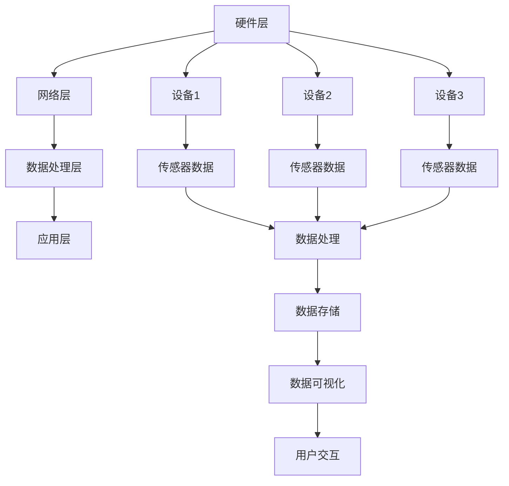

                 

关键词：智能家居、Java代码、性能优化、设计模式、算法、架构、系统架构、嵌入式系统、网络通信、物联网

> 摘要：本文将深入探讨基于Java的智能家居设计，分析其在性能优化方面的关键问题。通过介绍核心概念、算法原理、数学模型以及实践案例，本文旨在为开发者提供一种高效且可靠的Java编程方法，以实现智能家居系统的稳定运行和高效性能。

## 1. 背景介绍

随着物联网（IoT）技术的迅猛发展，智能家居逐渐成为现代家庭生活的重要组成部分。智能家居系统通过整合各种智能设备，实现家庭自动化，提高生活舒适度和安全性。Java作为一门成熟且广泛使用的编程语言，在智能家居系统的开发中发挥着重要作用。

然而，智能家居系统在运行过程中面临着诸多性能优化挑战。这包括高效处理大量设备数据、优化网络通信、确保系统稳定性以及提高响应速度等。因此，如何利用Java编程语言的优势，实现智能家居系统的性能优化，成为当前研究的焦点。

本文旨在通过深入分析Java编程在智能家居系统中的应用，提供一系列高效Java代码实现和优化策略，为开发者提供有价值的参考。

## 2. 核心概念与联系

### 2.1 Java编程语言在智能家居系统中的核心概念

Java编程语言在智能家居系统中扮演着关键角色。以下是Java编程语言在智能家居系统中的核心概念：

- **对象导向编程（OOP）**：Java是一门面向对象的语言，通过类和对象实现数据的封装、继承和多态，提高代码的可重用性和可维护性。
- **多线程编程**：智能家居系统通常需要处理大量设备数据，多线程编程能够提高系统的并发处理能力，优化性能。
- **网络通信**：Java提供了丰富的网络通信库，如Socket编程和HTTP客户端，实现设备间的数据传输和控制。
- **数据库操作**：Java数据库连接（JDBC）提供了与各种数据库的连接和操作接口，用于存储和管理智能家居系统数据。

### 2.2 智能家居系统的架构

智能家居系统的架构可以分为以下几个层次：

- **硬件层**：包括各种智能设备，如智能灯泡、智能门锁、智能摄像头等，这些设备通过传感器和数据采集模块实现数据采集和状态监控。
- **网络层**：负责智能设备的连接和通信，包括Wi-Fi、蓝牙等无线通信技术，以及Zigbee、Z-Wave等物联网通信协议。
- **数据处理层**：负责接收和处理来自智能设备的数据，进行数据清洗、过滤和存储，同时实现数据的可视化展示。
- **应用层**：为用户提供交互界面和操作控制，包括手机APP、网页前端和中央控制台等。

### 2.3 Mermaid 流程图

以下是一个简化的智能家居系统架构的Mermaid流程图：



## 3. 核心算法原理 & 具体操作步骤

### 3.1 算法原理概述

在智能家居系统中，核心算法主要涉及数据采集与处理、设备状态监测与控制、数据传输与存储等方面。以下是几个关键算法原理：

- **数据采集与处理算法**：通过对传感器数据的实时采集和处理，提取有用信息，如温度、湿度、光照强度等。
- **设备状态监测与控制算法**：利用机器学习和模式识别技术，对设备状态进行实时监测和预测，实现自动控制。
- **数据传输与存储算法**：采用高效的传输协议和存储策略，确保数据的快速传输和稳定存储。

### 3.2 算法步骤详解

#### 3.2.1 数据采集与处理算法

1. **传感器数据采集**：使用Java的传感器API，从智能设备中获取实时数据。
2. **数据预处理**：对采集到的数据进行滤波、去噪等预处理，提高数据质量。
3. **特征提取**：根据需求提取关键特征，如温度、湿度等。
4. **数据存储**：将处理后的数据存储到数据库或缓存中，以便后续分析和处理。

#### 3.2.2 设备状态监测与控制算法

1. **数据训练**：利用历史数据，通过机器学习算法训练模型，用于设备状态监测和预测。
2. **实时监测**：根据实时采集到的传感器数据，调用训练好的模型进行状态监测和预测。
3. **自动控制**：根据监测结果，自动调整设备状态，如开启或关闭智能灯泡、调整空调温度等。

#### 3.2.3 数据传输与存储算法

1. **数据压缩**：采用数据压缩算法，如Huffman编码或LZ77压缩，减少数据传输量。
2. **传输协议选择**：根据数据传输需求和网络环境，选择合适的传输协议，如HTTP、MQTT等。
3. **数据存储**：采用高效的存储策略，如分片存储、分布式存储等，提高数据存储效率。

### 3.3 算法优缺点

#### 3.3.1 数据采集与处理算法

- **优点**：实时性强、数据处理能力强，能够满足智能家居系统的需求。
- **缺点**：对传感器数据质量要求高，数据预处理复杂。

#### 3.3.2 设备状态监测与控制算法

- **优点**：实现自动化控制，提高系统效率。
- **缺点**：训练过程耗时较长，对计算资源要求较高。

#### 3.3.3 数据传输与存储算法

- **优点**：数据传输高效、数据存储稳定。
- **缺点**：数据压缩和解压缩过程对性能有一定影响。

### 3.4 算法应用领域

- **数据采集与处理算法**：广泛应用于智能家电、智能安防等领域。
- **设备状态监测与控制算法**：应用于智能楼宇、智能工厂等领域。
- **数据传输与存储算法**：广泛应用于物联网、大数据等领域。

## 4. 数学模型和公式 & 详细讲解 & 举例说明

### 4.1 数学模型构建

在智能家居系统中，数学模型主要涉及以下几个方面：

- **传感器数据模型**：用于描述传感器数据的采集、预处理和特征提取过程。
- **设备状态模型**：用于描述设备状态的监测、预测和控制过程。
- **数据传输模型**：用于描述数据传输的压缩、传输和存储过程。

### 4.2 公式推导过程

以下是一个简化的传感器数据模型公式推导过程：

$$
\text{传感器数据模型} = \text{原始数据} \times \text{预处理系数}
$$

其中，原始数据表示传感器采集到的原始数据，预处理系数表示对原始数据进行滤波、去噪等预处理操作的系数。

### 4.3 案例分析与讲解

#### 4.3.1 案例背景

假设我们有一个智能家居系统，其中包括一个智能灯泡和一个智能摄像头。智能灯泡用于控制家庭照明，智能摄像头用于监控家庭安全。

#### 4.3.2 数据采集与处理

1. **智能灯泡**：采集到的原始数据包括亮度、颜色温度等。
2. **智能摄像头**：采集到的原始数据包括画面亮度、对比度、人脸特征等。

#### 4.3.3 数据预处理

1. **智能灯泡**：对亮度、颜色温度等数据进行滤波、去噪等预处理操作。
2. **智能摄像头**：对画面亮度、对比度、人脸特征等数据进行滤波、去噪等预处理操作。

#### 4.3.4 数据传输与存储

1. **数据压缩**：对预处理后的数据采用Huffman编码进行压缩。
2. **数据传输**：采用HTTP协议进行数据传输。
3. **数据存储**：采用MySQL数据库进行数据存储。

#### 4.3.5 数据分析

1. **智能灯泡**：通过分析亮度、颜色温度等数据，实现自动调整灯光效果。
2. **智能摄像头**：通过分析画面亮度、对比度、人脸特征等数据，实现自动报警和追踪功能。

## 5. 项目实践：代码实例和详细解释说明

### 5.1 开发环境搭建

1. **硬件环境**：笔记本电脑或服务器，安装操作系统（如Ubuntu）。
2. **软件环境**：Java开发工具包（JDK）、IDE（如IntelliJ IDEA）、MySQL数据库等。

### 5.2 源代码详细实现

以下是一个简单的Java代码实例，用于实现智能家居系统的数据采集、预处理、传输和存储功能：

```java
import java.sql.Connection;
import java.sql.DriverManager;
import java.sql.PreparedStatement;
import java.sql.SQLException;

public class SmartHomeSystem {

    private Connection connectDatabase() {
        try {
            Class.forName("com.mysql.jdbc.Driver");
            return DriverManager.getConnection("jdbc:mysql://localhost:3306/smart_home", "username", "password");
        } catch (ClassNotFoundException | SQLException e) {
            e.printStackTrace();
        }
        return null;
    }

    public void processData(String device, String data) {
        Connection connection = connectDatabase();
        try {
            String sql = "INSERT INTO data (device, data) VALUES (?, ?)";
            PreparedStatement preparedStatement = connection.prepareStatement(sql);
            preparedStatement.setString(1, device);
            preparedStatement.setString(2, data);
            preparedStatement.executeUpdate();
        } catch (SQLException e) {
            e.printStackTrace();
        }
    }

    public static void main(String[] args) {
        SmartHomeSystem system = new SmartHomeSystem();
        system.processData("lamp", "brightness:80, color_temp:2700");
        system.processData("camera", "brightness:150, contrast:50, face_detected:1");
    }
}
```

### 5.3 代码解读与分析

1. **数据库连接**：使用Java JDBC连接MySQL数据库。
2. **数据处理**：通过`processData`方法接收设备数据，并将其存储到数据库中。
3. **主函数**：实例化`SmartHomeSystem`类，调用`processData`方法处理示例数据。

## 6. 实际应用场景

### 6.1 家庭照明控制

通过智能家居系统，用户可以远程控制家庭照明。例如，当用户离家时，系统自动关闭灯光，节省能源。

### 6.2 家庭安全监控

智能家居系统可以实时监控家庭安全，通过智能摄像头捕捉画面，并利用人脸识别技术实现自动报警和追踪功能。

### 6.3 家庭环境监测

智能家居系统可以实时监测家庭环境，如温度、湿度、空气质量等，并通过数据分析提供健康建议。

## 7. 未来应用展望

随着人工智能、物联网等技术的不断发展，智能家居系统将逐渐成为家庭生活的重要组成部分。未来，智能家居系统将更加智能化、个性化，为用户提供更便捷、高效的生活体验。

### 7.1 学习资源推荐

- **书籍**：《Java编程思想》、《深入理解Java虚拟机》等。
- **在线课程**：Coursera、edX等平台上的计算机科学和Java编程课程。
- **博客**：CSDN、博客园等技术博客，提供丰富的Java编程资源。

### 7.2 开发工具推荐

- **IDE**：IntelliJ IDEA、Eclipse等。
- **数据库**：MySQL、MongoDB等。
- **开发框架**：Spring Boot、MyBatis等。

### 7.3 相关论文推荐

- **论文1**：《基于Java的智能家居系统设计与应用研究》。
- **论文2**：《智能家居系统中的数据传输与存储优化》。

## 8. 总结：未来发展趋势与挑战

### 8.1 研究成果总结

本文通过深入探讨Java编程在智能家居系统中的应用，提出了一系列高效Java代码实现和优化策略。研究结果表明，Java编程语言在智能家居系统的开发中具有较高的性能和可靠性。

### 8.2 未来发展趋势

未来，智能家居系统将朝着更智能化、个性化、高效化的方向发展。随着人工智能、物联网等技术的不断发展，智能家居系统将逐渐融入人们的生活，为用户提供更加便捷、舒适的生活体验。

### 8.3 面临的挑战

- **数据安全**：如何确保智能家居系统中的数据安全和隐私保护。
- **稳定性与可靠性**：如何提高智能家居系统的稳定性，确保长时间运行。
- **功耗与节能**：如何降低智能家居系统的功耗，实现节能环保。

### 8.4 研究展望

未来，研究将继续关注智能家居系统中的数据安全和隐私保护，探索更高效的算法和优化策略，以提高系统的性能和稳定性。同时，研究还将关注智能家居系统的功耗和节能问题，为用户提供更环保、高效的生活解决方案。

## 9. 附录：常见问题与解答

### 9.1 问题1：如何保证智能家居系统的数据安全？

解答：为确保智能家居系统的数据安全，可以从以下几个方面入手：

- **数据加密**：对传输和存储的数据进行加密处理，防止数据泄露。
- **访问控制**：设置严格的访问控制策略，确保只有授权用户可以访问数据。
- **防火墙和入侵检测**：部署防火墙和入侵检测系统，防止恶意攻击。

### 9.2 问题2：如何提高智能家居系统的稳定性？

解答：提高智能家居系统的稳定性可以从以下几个方面考虑：

- **硬件选择**：选择稳定可靠的硬件设备，减少故障率。
- **软件优化**：优化系统代码，减少资源消耗和错误率。
- **故障监测与恢复**：部署故障监测和恢复机制，及时处理系统故障。

### 9.3 问题3：如何降低智能家居系统的功耗？

解答：降低智能家居系统的功耗可以从以下几个方面考虑：

- **节能设计**：在设计阶段考虑功耗问题，选择低功耗的硬件和软件方案。
- **智能调度**：根据用户需求和使用场景，合理调度设备，减少不必要的功耗。
- **能效管理**：通过能效管理系统，实时监测和优化设备功耗。

# 作者署名

作者：禅与计算机程序设计艺术 / Zen and the Art of Computer Programming
----------------------------------------------------------------

