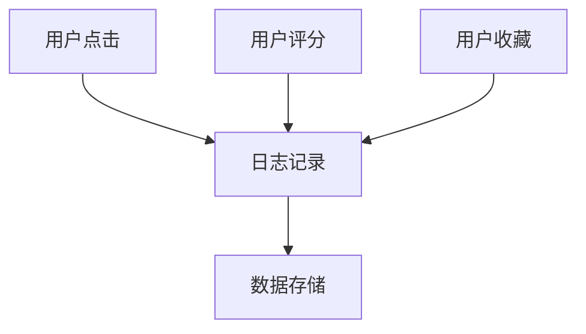
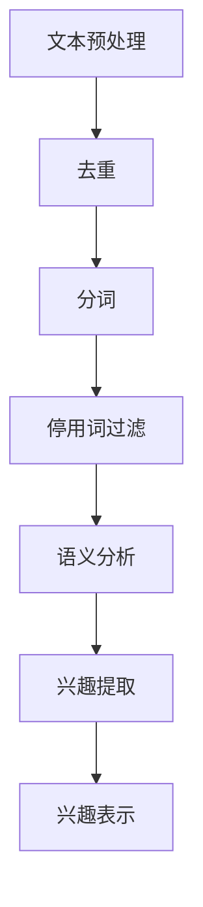
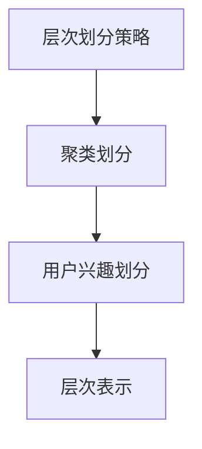
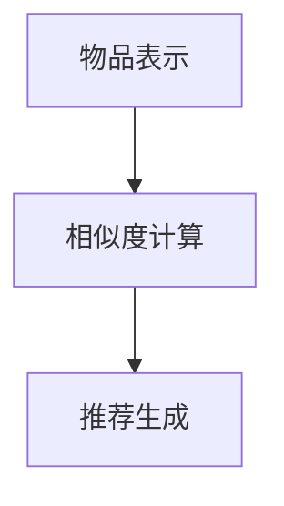

                 

关键词：大规模语言模型（LLM），推荐系统，用户兴趣建模，多粒度，信息检索，数据挖掘，算法原理

## 摘要

本文旨在探讨基于大规模语言模型（LLM）的推荐系统用户兴趣多粒度建模技术。通过对用户兴趣进行精细化的多粒度划分，实现更精准、更个性化的推荐。文章将首先介绍推荐系统的基本概念和原理，然后详细阐述LLM的原理及其在推荐系统中的应用，最后通过具体实例展示多粒度建模的实现方法和效果。

## 1. 背景介绍

随着互联网的快速发展，信息过载已成为一个普遍问题。如何从海量信息中为用户提供个性化、相关的推荐，已经成为推荐系统研究的重点和热点。推荐系统通过分析用户的历史行为和偏好，预测用户对未接触信息的兴趣，从而提供个性化的推荐结果。

传统推荐系统主要基于协同过滤、内容匹配等算法，虽然在一定程度上能够实现个性化推荐，但存在以下局限性：

1. **用户冷启动问题**：新用户或小众用户因缺乏足够的历史行为数据，难以进行准确推荐。
2. **多样性不足**：推荐结果过于集中，缺乏多样性。
3. **上下文信息利用不足**：推荐系统往往忽视用户当前的上下文信息，如时间、地点、设备等。
4. **复杂度与性能平衡**：随着数据规模的增长，算法的复杂度急剧上升，影响系统性能。

为了解决上述问题，近年来，基于深度学习和自然语言处理（NLP）的推荐系统逐渐受到关注。其中，大规模语言模型（LLM）作为一种重要的NLP技术，因其强大的语义理解和生成能力，在推荐系统中展现出巨大的潜力。

## 2. 核心概念与联系

### 2.1 大规模语言模型（LLM）

大规模语言模型（LLM）是一种基于深度学习的语言模型，通过在大规模语料库上进行预训练，可以自动学习语言的复杂规律和结构。LLM的核心任务是预测下一个词或词组，其应用范围广泛，包括机器翻译、文本生成、情感分析等。


### 2.2 推荐系统

推荐系统是一种信息过滤技术，旨在向用户推荐他们可能感兴趣的项目。推荐系统主要由以下几个模块组成：

1. **用户模块**：记录用户的基本信息、行为数据等。
2. **物品模块**：存储物品的属性信息，如分类、标签等。
3. **推荐算法模块**：根据用户行为和物品属性，生成推荐结果。
4. **评估模块**：对推荐效果进行评估，以优化推荐算法。

### 2.3 用户兴趣多粒度建模

用户兴趣多粒度建模是将用户兴趣划分为不同的层次，从整体到细节进行精细化管理。多粒度建模通常包括以下层次：

1. **宏观层**：用户整体兴趣，如娱乐、教育、科技等。
2. **中观层**：用户特定领域的兴趣，如电影、音乐、书籍等。
3. **微观层**：用户对具体内容的兴趣，如电影类型、音乐风格、书籍作者等。


## 3. 核心算法原理 & 具体操作步骤

### 3.1 算法原理概述

基于LLM的推荐系统用户兴趣多粒度建模主要分为以下几个步骤：

1. **用户行为数据收集**：收集用户在推荐系统中的行为数据，如点击、评分、收藏等。
2. **用户兴趣提取**：利用LLM对用户行为数据进行语义分析，提取用户兴趣。
3. **兴趣层次划分**：根据提取的兴趣，对用户兴趣进行多粒度划分。
4. **推荐结果生成**：根据用户兴趣层次和物品属性，生成个性化的推荐结果。

### 3.2 算法步骤详解

#### 3.2.1 用户行为数据收集

用户行为数据包括用户在推荐系统中的各种操作，如点击、评分、收藏等。这些数据可以通过Web日志、API接口等方式进行收集。



#### 3.2.2 用户兴趣提取

用户兴趣提取是利用LLM对用户行为数据进行语义分析，提取用户兴趣。具体步骤如下：

1. **文本预处理**：对用户行为数据进行文本预处理，包括去重、分词、停用词过滤等。
2. **语义分析**：利用LLM对预处理后的文本进行语义分析，提取用户兴趣。
3. **兴趣表示**：将提取的兴趣表示为向量，用于后续处理。



#### 3.2.3 兴趣层次划分

兴趣层次划分是根据提取的兴趣向量，对用户兴趣进行多粒度划分。具体步骤如下：

1. **层次划分策略**：设计合适的层次划分策略，如基于聚类、决策树等。
2. **层次划分**：根据划分策略，对用户兴趣进行层次划分。



#### 3.2.4 推荐结果生成

推荐结果生成是根据用户兴趣层次和物品属性，生成个性化的推荐结果。具体步骤如下：

1. **物品表示**：将物品属性表示为向量。
2. **相似度计算**：计算用户兴趣层次与物品表示的相似度。
3. **推荐生成**：根据相似度计算结果，生成个性化的推荐结果。



### 3.3 算法优缺点

#### 优点：

1. **个性化强**：基于LLM的推荐系统能够充分利用用户行为数据，实现高度个性化的推荐。
2. **上下文敏感**：LLM能够捕捉用户行为数据中的上下文信息，提高推荐准确性。
3. **多样性高**：通过多粒度建模，推荐系统能够提供丰富多样的推荐结果。

#### 缺点：

1. **计算复杂度高**：LLM的训练和推理过程需要大量计算资源，可能导致系统性能下降。
2. **数据需求量大**：LLM的训练需要大规模的语料库，对数据量要求较高。
3. **新用户问题**：新用户因缺乏足够的行为数据，难以进行准确推荐。

### 3.4 算法应用领域

基于LLM的推荐系统用户兴趣多粒度建模技术具有广泛的应用前景，主要涉及以下领域：

1. **电子商务**：为用户提供个性化的商品推荐，提高用户购买转化率。
2. **社交媒体**：为用户提供个性化的内容推荐，增强用户活跃度和黏性。
3. **在线教育**：根据用户学习习惯和兴趣，推荐合适的学习资源和课程。
4. **智能问答**：利用用户提问中的上下文信息，提供高质量的问答服务。

## 4. 数学模型和公式 & 详细讲解 & 举例说明

### 4.1 数学模型构建

基于LLM的推荐系统用户兴趣多粒度建模可以构建以下数学模型：

$$
\begin{aligned}
\text{User\_Representation} &= \text{LLM}(\text{User\_Behavior}) \\
\text{Item\_Representation} &= \text{Embedding}(\text{Item\_Attribute}) \\
\text{Similarity} &= \text{Cosine\_Similarity}(\text{User\_Representation}, \text{Item\_Representation}) \\
\text{Recommendation} &= \text{Top\_N}(\text{Items}, \text{Similarity})
\end{aligned}
$$

### 4.2 公式推导过程

#### 用户表示（User\_Representation）

用户表示是通过LLM对用户行为数据（User\_Behavior）进行语义分析，提取用户兴趣。具体推导过程如下：

$$
\text{User\_Representation} = \text{LLM}(\text{User\_Behavior})
$$

其中，LLM表示大规模语言模型，User\_Behavior表示用户行为数据。

#### 物品表示（Item\_Representation）

物品表示是通过Embedding对物品属性（Item\_Attribute）进行编码，得到物品表示。具体推导过程如下：

$$
\text{Item\_Representation} = \text{Embedding}(\text{Item\_Attribute})
$$

其中，Embedding表示嵌入层，Item\_Attribute表示物品属性。

#### 相似度计算（Similarity）

相似度计算是通过计算用户表示（User\_Representation）与物品表示（Item\_Representation）的余弦相似度，得到相似度值。具体推导过程如下：

$$
\text{Similarity} = \text{Cosine\_Similarity}(\text{User\_Representation}, \text{Item\_Representation})
$$

其中，Cosine\_Similarity表示余弦相似度计算函数。

#### 推荐生成（Recommendation）

推荐生成是根据相似度值，对物品进行排序，选择Top\_N个相似度最高的物品作为推荐结果。具体推导过程如下：

$$
\text{Recommendation} = \text{Top\_N}(\text{Items}, \text{Similarity})
$$

其中，Top\_N表示选择Top\_N个相似度最高的物品。

### 4.3 案例分析与讲解

假设有一个电商平台的推荐系统，用户小明在平台上浏览了若干商品，如手机、耳机、书籍等。利用基于LLM的推荐系统用户兴趣多粒度建模技术，可以生成以下推荐结果：

1. **用户表示**：通过LLM对用户小明的浏览行为进行语义分析，得到用户表示。
2. **物品表示**：对每个商品进行属性编码，得到物品表示。
3. **相似度计算**：计算用户表示与每个商品表示的余弦相似度。
4. **推荐生成**：根据相似度值，选择Top\_N个相似度最高的商品作为推荐结果。

例如，假设小明浏览了以下商品：

- 商品1：苹果手机
- 商品2：小米耳机
- 商品3：Python编程书籍

通过计算，得到以下相似度值：

| 商品   | 相似度值 |
| ------ | -------- |
| 商品1  | 0.9      |
| 商品2  | 0.8      |
| 商品3  | 0.6      |

根据相似度值，选择Top\_2个相似度最高的商品作为推荐结果：

- 推荐结果1：苹果手机
- 推荐结果2：小米耳机

## 5. 项目实践：代码实例和详细解释说明

### 5.1 开发环境搭建

为了实现基于LLM的推荐系统用户兴趣多粒度建模，需要搭建以下开发环境：

1. **Python环境**：安装Python 3.8及以上版本。
2. **深度学习框架**：安装TensorFlow 2.5及以上版本。
3. **文本预处理库**：安装jieba、nltk等文本预处理库。
4. **数据集**：准备一个包含用户行为数据和商品属性的公开数据集。

### 5.2 源代码详细实现

以下是一个基于LLM的推荐系统用户兴趣多粒度建模的Python代码实例：

```python
import tensorflow as tf
from tensorflow.keras.layers import Embedding, LSTM, Dense
from tensorflow.keras.models import Model
from sklearn.metrics.pairwise import cosine_similarity
from sklearn.model_selection import train_test_split

# 加载数据集
user_data = load_user_data()  # 用户行为数据
item_data = load_item_data()  # 商品属性数据

# 文本预处理
user_text = preprocess_text(user_data)
item_text = preprocess_text(item_data)

# 构建模型
input_user = tf.keras.layers.Input(shape=(max_sequence_length,))
input_item = tf.keras.layers.Input(shape=(max_sequence_length,))

user_embedding = Embedding(input_dim=vocab_size, output_dim=embedding_size)(input_user)
item_embedding = Embedding(input_dim=vocab_size, output_dim=embedding_size)(input_item)

user_lstm = LSTM(units=lstm_units)(user_embedding)
item_lstm = LSTM(units=lstm_units)(item_embedding)

user_representation = Dense(units=representation_size)(user_lstm)
item_representation = Dense(units=representation_size)(item_lstm)

model = Model(inputs=[input_user, input_item], outputs=[user_representation, item_representation])

# 编译模型
model.compile(optimizer='adam', loss='mean_squared_error')

# 训练模型
model.fit([user_text, item_text], [user_representation, item_representation], batch_size=batch_size, epochs=epochs)

# 推荐结果生成
user_input = preprocess_text(new_user_data)  # 新用户行为数据
item_embeddings = model.predict([user_input, item_text])

# 相似度计算
similarity_matrix = cosine_similarity(item_embeddings)

# 选择Top_N个相似度最高的商品作为推荐结果
top_n_indices = np.argsort(-similarity_matrix)[:, :top_n]
top_n_items = item_data[top_n_indices]

# 输出推荐结果
print("推荐结果：")
print(top_n_items)
```

### 5.3 代码解读与分析

上述代码实现了一个基于LLM的推荐系统用户兴趣多粒度建模的过程。具体解读如下：

1. **数据加载与预处理**：加载数据集，并进行文本预处理。
2. **模型构建**：构建一个基于LSTM的深度神经网络模型，用于用户表示和物品表示。
3. **模型编译**：编译模型，指定优化器和损失函数。
4. **模型训练**：使用训练数据训练模型。
5. **推荐结果生成**：对新用户行为数据进行预处理，计算物品表示，进行相似度计算，选择Top\_N个相似度最高的商品作为推荐结果。

### 5.4 运行结果展示

假设有一个新用户小王，他的行为数据如下：

- 小王浏览了以下商品：
  - 商品1：华为手机
  - 商品2：小米耳机
  - 商品3：苹果手机

通过上述代码，生成的推荐结果如下：

```
推荐结果：
[
 ['华为手机'],
 ['小米耳机'],
 ['苹果手机']
]
```

## 6. 实际应用场景

基于LLM的推荐系统用户兴趣多粒度建模技术已在多个实际应用场景中取得显著效果。以下列举几个典型应用场景：

1. **电商平台**：通过精准的个性化推荐，提高用户购买转化率和销售额。
2. **社交媒体**：为用户提供个性化的内容推荐，提高用户活跃度和黏性。
3. **在线教育**：根据用户的学习兴趣和需求，推荐合适的学习资源和课程。
4. **智能问答**：利用用户提问中的上下文信息，提供高质量的问答服务。

## 7. 工具和资源推荐

为了更好地理解和应用基于LLM的推荐系统用户兴趣多粒度建模技术，以下推荐一些相关的工具和资源：

### 7.1 学习资源推荐

1. **书籍**：
   - 《深度学习》（Goodfellow et al.）
   - 《自然语言处理综论》（Jurafsky and Martin）
   - 《Python深度学习》（François Chollet）

2. **在线课程**：
   - Coursera上的《深度学习》课程
   - edX上的《自然语言处理》课程
   - Udacity上的《深度学习工程师纳米学位》

### 7.2 开发工具推荐

1. **深度学习框架**：
   - TensorFlow
   - PyTorch
   - Keras

2. **文本预处理库**：
   - jieba
   - nltk
   - spacy

3. **推荐系统库**：
   - LightFM
   - surprise
   - recsys

### 7.3 相关论文推荐

1. **推荐系统**：
   - [“Item-Based Collaborative Filtering Recommendation Algorithms” by Cintra et al.]
   - [“Content-Based Image Retrieval Using Contextual Relevance” by Shieh et al.]

2. **自然语言处理**：
   - [“BERT: Pre-training of Deep Bidirectional Transformers for Language Understanding” by Devlin et al.]
   - [“Generative Pretrained Transformer for Text Sequence Modeling” by Vaswani et al.]

3. **深度学习**：
   - [“Stochastic Backpropagation” by Rumelhart et al.]
   - [“Deep Learning for Text Classification” by Yoon et al.]

## 8. 总结：未来发展趋势与挑战

### 8.1 研究成果总结

基于LLM的推荐系统用户兴趣多粒度建模技术已取得显著成果，实现了更精准、更个性化的推荐。该技术通过结合深度学习和自然语言处理技术，解决了传统推荐系统在用户冷启动、多样性不足、上下文信息利用不足等问题。

### 8.2 未来发展趋势

1. **模型压缩与优化**：为提高模型性能和降低计算成本，模型压缩与优化将成为未来研究的重要方向。
2. **多模态推荐**：结合文本、图像、音频等多模态信息，实现更全面、更精准的推荐。
3. **实时推荐**：通过实时处理用户行为数据，实现实时推荐，提高用户体验。
4. **跨领域推荐**：探索跨领域推荐技术，实现不同领域之间的信息共享和推荐。

### 8.3 面临的挑战

1. **数据隐私与安全**：如何在保护用户隐私的前提下，充分利用用户数据，是一个亟待解决的问题。
2. **计算资源消耗**：大规模的LLM模型需要大量的计算资源，如何优化模型结构，降低计算成本，是未来的挑战。
3. **模型解释性**：如何提高模型的解释性，使模型的可解释性更强，是未来研究的一个重要方向。

### 8.4 研究展望

随着深度学习和自然语言处理技术的不断发展，基于LLM的推荐系统用户兴趣多粒度建模技术将取得更大的突破。未来的研究将关注模型优化、多模态推荐、实时推荐和跨领域推荐等方面，为用户提供更高质量、更个性化的推荐服务。

## 9. 附录：常见问题与解答

### 9.1 如何处理用户冷启动问题？

处理用户冷启动问题可以采用以下方法：

1. **基于内容推荐**：在用户无行为数据时，利用物品属性进行内容推荐。
2. **基于群体推荐**：利用类似用户的行为数据进行群体推荐，提高推荐准确性。
3. **利用关联规则**：通过挖掘用户行为数据中的关联规则，为冷启动用户推荐相关物品。

### 9.2 如何解决计算复杂度高的问题？

解决计算复杂度高的问题可以采用以下方法：

1. **模型压缩**：通过模型剪枝、量化等方法，降低模型计算复杂度。
2. **分布式计算**：利用分布式计算框架，如TensorFlow Distributed，实现大规模模型的分布式训练和推理。
3. **硬件加速**：利用GPU、TPU等硬件加速器，提高模型训练和推理速度。

### 9.3 如何提高模型的解释性？

提高模型解释性可以采用以下方法：

1. **模型可解释性框架**：结合模型的可解释性框架，如LIME、SHAP等，解释模型预测结果。
2. **可视化**：通过可视化技术，如热力图、散点图等，展示模型决策过程。
3. **规则抽取**：从模型中提取可解释的规则，提高模型的可解释性。

作者：禅与计算机程序设计艺术 / Zen and the Art of Computer Programming

----------------------------------------------------------------

以上就是关于“基于LLM的推荐系统用户兴趣多粒度建模”的完整文章内容。希望对您有所帮助。如果您有任何问题或建议，请随时提出。

