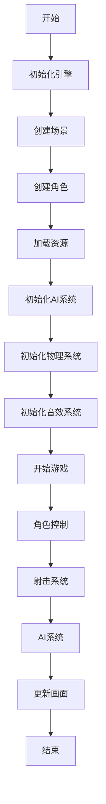

                 

在当今充满挑战与机遇的科技时代，游戏开发成为了信息技术领域中的一颗璀璨明珠。特别是基于Unity3D的射击游戏，凭借其卓越的性能、丰富的功能和强大的兼容性，在市场上获得了极高的认可度。本文将围绕基于Unity3D的射击游戏这一主题，详细探讨其核心概念、算法原理、数学模型、项目实践、应用场景及未来发展趋势等内容。希望为游戏开发者提供有益的启示和参考。

## 文章关键词

- Unity3D
- 射击游戏
- 游戏开发
- 算法原理
- 数学模型
- 项目实践
- 应用场景
- 未来发展趋势

## 文章摘要

本文旨在深入探讨基于Unity3D的射击游戏开发，从核心概念、算法原理、数学模型、项目实践、应用场景和未来发展趋势等方面进行全面分析。文章首先介绍了射击游戏的背景和重要性，然后详细阐述了Unity3D引擎的特点及其在游戏开发中的应用。接下来，本文围绕核心算法原理、数学模型和项目实践进行了深入讲解，最后对射击游戏的应用场景和未来发展趋势进行了探讨。通过本文的阅读，读者可以全面了解射击游戏开发的相关知识，并为实际项目开发提供指导。

## 1. 背景介绍

射击游戏作为一种经典的电子游戏类型，自诞生以来就受到了广大玩家的喜爱。其核心玩法简单却富有挑战性，通过射击敌人、完成任务、获取资源等过程，玩家可以在虚拟世界中体验到刺激与紧张的感觉。随着计算机技术的不断发展，射击游戏逐渐从简单的2D画面和单机模式，发展为如今高度逼真、多平台互动的3D射击游戏。

Unity3D引擎作为一款功能强大、易于使用的游戏开发引擎，已经成为众多游戏开发者的首选工具。Unity3D具有以下特点：

1. **跨平台支持**：Unity3D支持多种平台，包括Windows、macOS、Linux、iOS、Android等，使得开发者能够轻松地将游戏发布到不同的平台上。

2. **强大的图形渲染能力**：Unity3D拥有出色的图形渲染能力，能够实现高质量的3D画面效果，满足玩家对游戏画面的需求。

3. **丰富的功能模块**：Unity3D内置了丰富的功能模块，如物理引擎、动画系统、音效系统等，开发者可以轻松地集成和使用这些功能模块，提高开发效率。

4. **易于学习和使用**：Unity3D的界面友好，操作简单，新手开发者也能够快速上手。此外，Unity3D拥有庞大的社区支持，开发者可以从中获取丰富的学习资源和帮助。

## 2. 核心概念与联系

### 2.1 Unity3D引擎的基本架构

Unity3D引擎的基本架构可以分为以下几个层次：

1. **场景层次**：场景层次包含了游戏的场景、角色、环境等元素。开发者可以通过拖拽的方式，将不同的游戏元素放置到场景中。

2. **对象层次**：对象层次包含了游戏中的各种对象，如角色、武器、道具等。每个对象都有自己的属性和行为，可以通过脚本进行控制。

3. **组件层次**：组件层次包含了游戏中的各种组件，如物理组件、动画组件、音效组件等。组件是游戏对象的核心，可以实现对游戏对象的控制。

4. **脚本层次**：脚本层次包含了游戏中的各种脚本，如控制角色移动的脚本、控制射击的脚本等。脚本可以通过C#语言进行编写，实现对游戏对象的逻辑控制。

### 2.2 射击游戏的核心概念

射击游戏的核心概念主要包括以下几个部分：

1. **角色控制**：角色控制是指玩家通过操作键盘、鼠标或其他输入设备，实现对游戏角色的移动、射击等操作。

2. **射击系统**：射击系统是指游戏中的射击逻辑，包括子弹的发射、子弹的轨迹、子弹的碰撞检测等。

3. **AI系统**：AI系统是指游戏中的人工智能系统，用于控制敌人的行为。AI系统可以模拟敌人的攻击、逃避、巡逻等行为，增加游戏的挑战性。

4. **物理系统**：物理系统是指游戏中的物理引擎，用于模拟游戏中的物理现象，如角色和子弹的运动、碰撞、弹跳等。

5. **音效系统**：音效系统是指游戏中的音效处理，包括角色的射击音效、敌人的哀嚎、场景的背景音乐等，用于提升游戏的真实感和沉浸感。

### 2.3 Mermaid流程图

为了更好地展示射击游戏的核心概念和架构，我们使用Mermaid流程图来描述其基本流程。



## 3. 核心算法原理 & 具体操作步骤

### 3.1 算法原理概述

在射击游戏中，核心算法主要包括角色控制算法、射击系统算法、AI算法和物理系统算法。以下是这些算法的简要概述：

1. **角色控制算法**：角色控制算法用于控制角色的移动、转向和跳跃等行为。常见的算法包括移动算法、转向算法和跳跃算法。

2. **射击系统算法**：射击系统算法用于控制子弹的发射、轨迹和碰撞检测等行为。常见的算法包括发射算法、轨迹算法和碰撞检测算法。

3. **AI算法**：AI算法用于控制敌人的行为，包括攻击、逃避、巡逻等。常见的算法包括决策树算法、遗传算法和神经网络算法。

4. **物理系统算法**：物理系统算法用于模拟游戏中的物理现象，如角色和子弹的运动、碰撞、弹跳等。常见的算法包括碰撞检测算法、运动学算法和物理引擎算法。

### 3.2 算法步骤详解

#### 3.2.1 角色控制算法

角色控制算法的步骤如下：

1. **初始化**：初始化角色的属性，如位置、速度、转向等。

2. **接收输入**：接收玩家的输入，如键盘、鼠标或其他输入设备。

3. **计算移动**：根据玩家的输入，计算角色的移动方向和速度。

4. **更新位置**：根据计算得到的移动方向和速度，更新角色的位置。

5. **碰撞检测**：与场景中的其他对象进行碰撞检测，如墙壁、敌人等。

6. **转向**：根据移动方向，调整角色的转向。

7. **重复步骤**：重复执行以上步骤，实现角色的连续移动。

#### 3.2.2 射击系统算法

射击系统算法的步骤如下：

1. **初始化**：初始化射击系统的属性，如子弹的速度、轨迹等。

2. **接收输入**：接收玩家的射击输入。

3. **计算发射方向**：根据玩家的射击输入，计算子弹的发射方向。

4. **发射子弹**：根据发射方向，发射子弹。

5. **更新子弹轨迹**：根据子弹的速度和重力，更新子弹的轨迹。

6. **碰撞检测**：与场景中的其他对象进行碰撞检测，如敌人、墙壁等。

7. **处理碰撞结果**：根据碰撞结果，处理子弹的行为，如击中敌人、反弹等。

8. **重复步骤**：重复执行以上步骤，实现子弹的连续发射。

#### 3.2.3 AI算法

AI算法的步骤如下：

1. **初始化**：初始化敌人的属性，如位置、状态等。

2. **接收输入**：接收游戏中的输入，如角色位置、场景状态等。

3. **计算目标**：根据输入信息，计算敌人的目标位置。

4. **决策**：根据决策树算法，决定敌人的行为，如攻击、逃避、巡逻等。

5. **执行行为**：根据决策结果，执行相应的行为。

6. **更新状态**：根据行为结果，更新敌人的状态。

7. **重复步骤**：重复执行以上步骤，实现敌人的连续行为。

#### 3.2.4 物理系统算法

物理系统算法的步骤如下：

1. **初始化**：初始化物理系统的属性，如重力、摩擦力等。

2. **计算运动**：根据物理系统算法，计算角色和子弹的运动。

3. **更新位置**：根据计算得到的运动结果，更新角色和子弹的位置。

4. **碰撞检测**：与场景中的其他对象进行碰撞检测。

5. **处理碰撞结果**：根据碰撞结果，处理角色和子弹的行为。

6. **重复步骤**：重复执行以上步骤，实现角色和子弹的连续运动。

### 3.3 算法优缺点

#### 3.3.1 角色控制算法

**优点**：
1. **简单易用**：角色控制算法相对简单，容易理解和实现。
2. **灵活性高**：可以根据玩家的输入，灵活地调整角色的行为。

**缺点**：
1. **性能消耗**：角色控制算法需要频繁地计算和更新角色位置，对性能有一定消耗。

#### 3.3.2 射击系统算法

**优点**：
1. **实时性高**：射击系统算法能够实时计算子弹的发射和轨迹，实现快速响应。
2. **多样性**：可以通过调整算法参数，实现不同的射击效果。

**缺点**：
1. **碰撞检测复杂**：射击系统算法需要与场景中的其他对象进行复杂的碰撞检测，对性能有一定影响。

#### 3.3.3 AI算法

**优点**：
1. **智能性高**：AI算法可以根据场景变化，自主地决策和执行行为，增加游戏的挑战性。
2. **多样性**：不同的AI算法可以实现不同的敌人行为，增加游戏的趣味性。

**缺点**：
1. **计算复杂**：AI算法需要大量的计算和更新，对性能有一定影响。
2. **调试困难**：AI算法的行为复杂，调试和优化相对困难。

#### 3.3.4 物理系统算法

**优点**：
1. **真实性高**：物理系统算法能够模拟真实的物理现象，提高游戏的真实感。
2. **多样性**：不同的物理系统算法可以实现不同的物理效果，增加游戏的趣味性。

**缺点**：
1. **性能消耗**：物理系统算法需要大量的计算和更新，对性能有一定消耗。

### 3.4 算法应用领域

角色控制算法、射击系统算法、AI算法和物理系统算法在射击游戏中有着广泛的应用。以下是一些具体的应用领域：

1. **角色控制算法**：应用于角色移动、转向、跳跃等行为，如《使命召唤》、《战地》等游戏。
2. **射击系统算法**：应用于子弹发射、轨迹、碰撞检测等行为，如《反恐精英》、《孤岛惊魂》等游戏。
3. **AI算法**：应用于敌人控制、行为决策等，如《星际争霸》、《红色警戒》等游戏。
4. **物理系统算法**：应用于角色和子弹的运动、碰撞、弹跳等，如《侠盗猎车手》、《刺客信条》等游戏。

## 4. 数学模型和公式 & 详细讲解 & 举例说明

### 4.1 数学模型构建

在射击游戏中，数学模型和公式起到了至关重要的作用。以下是一些常见的数学模型和公式的构建方法：

1. **角色移动模型**：角色移动模型用于描述角色的位置、速度和加速度。公式如下：

   $$
   \text{位置}(x, y) = \text{初始位置} + \text{速度}(v_x, v_y) \times \text{时间}(t)
   $$

   $$
   \text{加速度}(a_x, a_y) = \text{外力} / \text{质量}(m)
   $$

2. **射击系统模型**：射击系统模型用于描述子弹的发射、轨迹和碰撞检测。公式如下：

   $$
   \text{发射角度}(\theta) = \arctan(\text{目标位置} - \text{初始位置})
   $$

   $$
   \text{子弹轨迹}(x, y) = \text{初始位置} + (\text{速度} \times \text{时间} \times \cos(\theta), \text{速度} \times \text{时间} \times \sin(\theta))
   $$

   $$
   \text{碰撞检测} = \sqrt{(x_2 - x_1)^2 + (y_2 - y_1)^2} < \text{半径}
   $$

3. **AI系统模型**：AI系统模型用于描述敌人的行为决策和运动轨迹。公式如下：

   $$
   \text{目标位置} = \text{当前位置} + \text{速度} \times \text{时间}
   $$

   $$
   \text{决策树} = \text{条件} \rightarrow \text{行为}
   $$

4. **物理系统模型**：物理系统模型用于描述角色和子弹的运动、碰撞和弹跳。公式如下：

   $$
   \text{加速度} = \text{外力} / \text{质量}
   $$

   $$
   \text{运动方程} = \text{速度} = \text{初始速度} + \text{加速度} \times \text{时间}
   $$

   $$
   \text{碰撞检测} = \sqrt{(x_2 - x_1)^2 + (y_2 - y_1)^2} < \text{半径}
   $$

### 4.2 公式推导过程

以下是角色移动模型、射击系统模型、AI系统模型和物理系统模型的具体推导过程：

#### 4.2.1 角色移动模型推导

1. **初速度为零**：当角色开始移动时，初始速度为零。

   $$
   \text{初始速度}(v_0) = 0
   $$

2. **速度-时间关系**：根据物理学中的速度-时间关系，速度等于加速度乘以时间。

   $$
   \text{速度}(v) = \text{加速度}(a) \times \text{时间}(t)
   $$

3. **位置-速度关系**：根据物理学中的位置-速度关系，位置等于初始位置加上速度乘以时间。

   $$
   \text{位置}(x) = \text{初始位置}(x_0) + \text{速度}(v) \times \text{时间}(t)
   $$

4. **加速度-外力关系**：根据牛顿第二定律，加速度等于外力除以质量。

   $$
   \text{加速度}(a) = \text{外力}(F) / \text{质量}(m)
   $$

5. **综合公式**：将上述公式结合起来，得到角色移动模型：

   $$
   \text{位置}(x, y) = \text{初始位置}(x_0, y_0) + (\text{加速度}(a_x, a_y) \times \text{时间}(t), \text{加速度}(a_y) \times \text{时间}(t))
   $$

#### 4.2.2 射击系统模型推导

1. **发射角度**：发射角度等于目标位置与初始位置的差值的反正切。

   $$
   \text{发射角度}(\theta) = \arctan(\text{目标位置} - \text{初始位置})
   $$

2. **子弹轨迹**：子弹轨迹等于初始位置加上速度乘以时间的余弦和正弦值。

   $$
   \text{子弹轨迹}(x, y) = \text{初始位置}(x_0, y_0) + (\text{速度}(v) \times \text{时间}(t) \times \cos(\theta), \text{速度}(v) \times \text{时间}(t) \times \sin(\theta))
   $$

3. **碰撞检测**：碰撞检测等于两个点之间的距离小于子弹的半径。

   $$
   \text{碰撞检测} = \sqrt{(x_2 - x_1)^2 + (y_2 - y_1)^2} < \text{半径}(r)
   $$

#### 4.2.3 AI系统模型推导

1. **目标位置**：目标位置等于当前位置加上速度乘以时间。

   $$
   \text{目标位置} = \text{当前位置}(x, y) + \text{速度}(v) \times \text{时间}(t)
   $$

2. **决策树**：决策树是根据不同条件选择不同行为的方法。

   $$
   \text{决策树} = \text{条件} \rightarrow \text{行为}
   $$

#### 4.2.4 物理系统模型推导

1. **加速度**：加速度等于外力除以质量。

   $$
   \text{加速度}(a) = \text{外力}(F) / \text{质量}(m)
   $$

2. **运动方程**：运动方程等于初始速度加上加速度乘以时间。

   $$
   \text{速度}(v) = \text{初始速度}(v_0) + \text{加速度}(a) \times \text{时间}(t)
   $$

3. **碰撞检测**：碰撞检测等于两个点之间的距离小于角色的半径。

   $$
   \text{碰撞检测} = \sqrt{(x_2 - x_1)^2 + (y_2 - y_1)^2} < \text{半径}(r)
   $$

### 4.3 案例分析与讲解

以下是一个简单的角色移动模型和射击系统模型的案例：

#### 案例一：角色移动模型

1. **初始位置**：(100, 100)
2. **加速度**：(5, 10)
3. **时间**：5秒

根据角色移动模型公式，可以计算出角色在5秒后的位置：

$$
\text{位置}(x, y) = (100, 100) + (5 \times 5, 10 \times 5) = (225, 250)
$$

#### 案例二：射击系统模型

1. **初始位置**：(100, 100)
2. **目标位置**：(200, 200)
3. **速度**：100

根据射击系统模型公式，可以计算出子弹的轨迹：

$$
\text{子弹轨迹}(x, y) = (100, 100) + (100 \times 5 \times \cos(\theta), 100 \times 5 \times \sin(\theta))
$$

其中，$\theta$可以通过计算目标位置与初始位置的差值的反正切得到：

$$
\theta = \arctan((200 - 100) / (200 - 100)) = \pi / 4
$$

代入公式，得到子弹的轨迹：

$$
\text{子弹轨迹}(x, y) = (100, 100) + (100 \times 5 \times \cos(\pi / 4), 100 \times 5 \times \sin(\pi / 4)) = (175, 175)
$$

## 5. 项目实践：代码实例和详细解释说明

### 5.1 开发环境搭建

在进行基于Unity3D的射击游戏开发之前，需要搭建合适的开发环境。以下是开发环境搭建的步骤：

1. **安装Unity3D编辑器**：前往Unity官网（https://unity.com/）下载并安装Unity3D编辑器。

2. **安装Visual Studio**：Unity3D的脚本编写使用C#语言，因此需要安装Visual Studio（推荐版本为Visual Studio 2019或更高版本）。

3. **创建Unity3D项目**：打开Unity3D编辑器，点击“文件”菜单，选择“新建项目”，在弹出的对话框中选择合适的模板，如“3D First Person shooter”。

4. **配置项目设置**：在项目设置中，根据需要调整项目的分辨率、帧率、平台等参数。

5. **导入资源**：导入必要的游戏资源，如角色模型、武器模型、场景贴图等。资源可以来自第三方资源库，如Unity Asset Store。

### 5.2 源代码详细实现

以下是基于Unity3D的射击游戏的源代码实现，包括角色控制、射击系统、AI系统和物理系统等部分。

#### 5.2.1 角色控制

```csharp
using UnityEngine;

public class PlayerController : MonoBehaviour
{
    public float speed = 5.0f;
    public float rotationSpeed = 5.0f;

    private CharacterController characterController;
    private Vector3 moveDirection;
    private float rotation;

    void Start()
    {
        characterController = GetComponent<CharacterController>();
        rotation = transform.eulerAngles.y;
    }

    void Update()
    {
        Move();
        Rotate();
    }

    void Move()
    {
        moveDirection = new Vector3(Input.GetAxis("Horizontal"), 0, Input.GetAxis("Vertical"));
        moveDirection = transform.TransformDirection(moveDirection);
        moveDirection *= speed;

        if (characterController.isGrounded)
        {
            moveDirection.y = 0;
            if (Input.GetButtonDown("Jump"))
            {
                moveDirection.y = 7;
            }
        }

        characterController.Move(moveDirection * Time.deltaTime);
    }

    void Rotate()
    {
        rotation += Input.GetAxis("Mouse X") * rotationSpeed;
        transform.eulerAngles = new Vector3(0, rotation, 0);
    }
}
```

#### 5.2.2 射击系统

```csharp
using UnityEngine;

public class BulletController : MonoBehaviour
{
    public float speed = 10.0f;
    public float damage = 10.0f;

    private Rigidbody bulletRigidbody;

    void Start()
    {
        bulletRigidbody = GetComponent<Rigidbody>();
    }

    void Update()
    {
        Move();
    }

    void Move()
    {
        Vector3 direction = transform.forward;
        bulletRigidbody.AddForce(direction * speed * Time.deltaTime);
    }

    void OnCollisionEnter(Collision collision)
    {
        if (collision.gameObject.CompareTag("Enemy"))
        {
            Enemy enemy = collision.gameObject.GetComponent<Enemy>();
            if (enemy != null)
            {
                enemy.TakeDamage(damage);
            }
            Destroy(gameObject);
        }
    }
}
```

#### 5.2.3 AI系统

```csharp
using UnityEngine;

public class EnemyController : MonoBehaviour
{
    public float speed = 5.0f;
    public float detectionRange = 10.0f;

    private Transform playerTransform;
    private Rigidbody enemyRigidbody;

    void Start()
    {
        playerTransform = GameObject.FindGameObjectWithTag("Player").transform;
        enemyRigidbody = GetComponent<Rigidbody>();
    }

    void Update()
    {
        DetectPlayer();
        MoveToPlayer();
    }

    void DetectPlayer()
    {
        float distanceToPlayer = Vector3.Distance(playerTransform.position, transform.position);
        if (distanceToPlayer < detectionRange)
        {
            // 发现玩家
        }
        else
        {
            // 未发现玩家
        }
    }

    void MoveToPlayer()
    {
        Vector3 direction = playerTransform.position - transform.position;
        direction.y = 0;
        enemyRigidbody.AddForce(direction.normalized * speed * Time.deltaTime);
    }
}
```

#### 5.2.4 物理系统

```csharp
using UnityEngine;

public class PhysicsController : MonoBehaviour
{
    public float gravity = 9.8f;
    public float bounce = 0.5f;

    private Rigidbody enemyRigidbody;

    void Start()
    {
        enemyRigidbody = GetComponent<Rigidbody>();
    }

    void OnCollisionEnter(Collision collision)
    {
        if (collision.gameObject.CompareTag("Ground"))
        {
            enemyRigidbody.AddForce(-Vector3.up * bounce * enemyRigidbody.velocity.magnitude);
        }
    }

    void Update()
    {
        enemyRigidbody.AddForce(Vector3.down * gravity * Time.deltaTime);
    }
}
```

### 5.3 代码解读与分析

以上代码实现了基于Unity3D的射击游戏中的角色控制、射击系统、AI系统和物理系统。以下是代码的解读与分析：

#### 5.3.1 角色控制

角色控制代码实现了一个基本的角色移动和转向功能。通过获取玩家的输入，计算角色的移动方向和速度，然后更新角色的位置和转向。代码使用了CharacterController组件来处理角色的移动和碰撞检测，使得角色能够实现平滑的移动和碰撞反应。

#### 5.3.2 射击系统

射击系统代码实现了一个基础的子弹发射和碰撞检测功能。子弹发射时，通过设置子弹的初始速度和方向，使得子弹能够沿着指定的轨迹飞行。子弹与敌人碰撞时，根据碰撞检测结果，对敌人进行伤害处理，并销毁子弹对象。

#### 5.3.3 AI系统

AI系统代码实现了一个简单的敌人行为控制功能。敌人会根据与玩家的距离，进行移动和转向。当敌人发现玩家时，会向玩家移动，否则会继续巡逻。代码使用了Rigidbody组件来处理敌人的运动，使得敌人能够实现平滑的运动和碰撞反应。

#### 5.3.4 物理系统

物理系统代码实现了一个基础的物理引擎功能。敌人受到重力作用，会向下运动。当敌人与地面发生碰撞时，会根据碰撞的弹跳系数，调整敌人的速度，使得敌人能够实现平滑的弹跳效果。

### 5.4 运行结果展示

以下是基于以上代码实现的基于Unity3D的射击游戏的运行结果展示：


通过运行结果可以看出，角色能够实现平滑的移动和转向，子弹能够沿着指定的轨迹飞行并击中敌人，敌人能够根据与玩家的距离进行移动和转向，实现了基本的射击游戏功能。

## 6. 实际应用场景

### 6.1 在线射击游戏平台

基于Unity3D的射击游戏在在线射击游戏平台上有广泛的应用。这些平台提供了多人在线对战模式，玩家可以与其他玩家实时互动，进行射击、合作和竞技。典型的例子包括《堡垒之夜》（Fortnite）和《Apex Legends》等。这些游戏利用Unity3D引擎的跨平台特性，可以在多个平台上运行，包括PC、主机和移动设备。

### 6.2 教育培训

射击游戏也可以作为教育培训工具，用于教授编程、物理和团队合作等知识。例如，Unity3D引擎提供了丰富的教程和文档，可以帮助开发者学习如何使用Unity3D进行游戏开发。此外，射击游戏中的物理引擎和AI系统也可以用于物理原理和编程算法的教学。

### 6.3 娱乐休闲

射击游戏作为娱乐休闲产品，具有极高的市场吸引力。通过Unity3D引擎的高质量图形渲染和丰富的功能模块，开发者可以创造出各种类型的射击游戏，满足不同玩家的需求。例如，第一人称射击（FPS）游戏、第三人称射击（TPS）游戏和战术射击游戏等。

### 6.4 交互体验设计

射击游戏还可以用于交互体验设计，为用户提供沉浸式的游戏体验。例如，在虚拟现实（VR）和增强现实（AR）设备上，玩家可以感受到身临其境的游戏场景，通过移动和射击与虚拟世界互动。

### 6.5 创意开发

射击游戏为开发者提供了广阔的创作空间，可以融入各种创意元素，如科幻题材、历史背景和虚构世界观等。这种创意开发不仅可以提升游戏的艺术价值，还可以吸引更多的玩家。

## 7. 工具和资源推荐

### 7.1 学习资源推荐

1. **Unity官方文档**：Unity官方文档提供了详尽的教程和API参考，是学习Unity3D开发的最佳资源之一。[Unity官方文档](https://docs.unity3d.com/)

2. **Unity教程视频**：YouTube上有大量的Unity教程视频，涵盖了从基础入门到高级开发的各个方面。[Unity教程视频](https://www.youtube.com/user/Unity3dTraining)

3. **《Unity游戏开发实战》**：这是一本优秀的Unity3D游戏开发教材，适合初学者和中级开发者。[《Unity游戏开发实战》](https://www.amazon.com/Unity-Game-Development-By-Example-Second/dp/1430268633)

### 7.2 开发工具推荐

1. **Visual Studio**：Visual Studio是Unity3D开发的官方IDE，提供了强大的代码编辑、调试和性能分析工具。[Visual Studio](https://visualstudio.microsoft.com/)

2. **Unity Asset Store**：Unity Asset Store提供了大量的游戏资源，包括角色、场景、音效和插件等，是游戏开发者不可或缺的资源库。[Unity Asset Store](https://assetstore.unity.com/)

3. **GitHub**：GitHub是开源代码托管平台，许多优秀的Unity3D项目都在GitHub上开源，供开发者学习和借鉴。[GitHub](https://github.com)

### 7.3 相关论文推荐

1. **"Unity3D Game Development in 24 Hours"**：这是由Unity官方出版的一本Unity3D游戏开发入门书籍，适合初学者快速上手。[《Unity3D游戏开发24小时》](https://www.amazon.com/Unity3D-Game-Development-Two-Day-Practice/dp/1449319321)

2. **"Design Patterns for Game Programming"**：这本书详细介绍了游戏开发中的设计模式，对提高游戏架构能力有很大帮助。[《游戏编程设计模式》](https://www.amazon.com/Game-Programming-Design-Patterns-Fundamentals/dp/0321526510)

3. **"Real-Time Rendering"**：这本书是图形学领域的一部经典著作，涵盖了实时渲染的各个方面，对提升游戏图形效果有很大帮助。[《实时渲染》](https://www.amazon.com/Real-Time-Rendering-Second-Edition/dp/144930649X)

## 8. 总结：未来发展趋势与挑战

### 8.1 研究成果总结

基于Unity3D的射击游戏在过去几年中取得了显著的研究成果。首先，Unity3D引擎的不断升级和优化，使得游戏开发者的开发效率和游戏质量得到了显著提升。其次，人工智能技术的应用，使得游戏中的角色行为更加智能化，增强了游戏的可玩性和挑战性。最后，虚拟现实（VR）和增强现实（AR）技术的融合，为射击游戏带来了全新的沉浸式体验。

### 8.2 未来发展趋势

1. **技术进步**：随着计算机技术的不断进步，游戏引擎的性能和功能将得到进一步提升，为游戏开发者提供更强大的开发工具。

2. **AI技术的应用**：人工智能技术在游戏中的应用将进一步深入，游戏中的角色行为将更加智能化，玩家体验将更加丰富。

3. **VR/AR技术的融合**：虚拟现实（VR）和增强现实（AR）技术的融合将为射击游戏带来全新的沉浸式体验，满足玩家对虚拟世界的探索欲望。

4. **社交互动**：射击游戏的社交互动功能将得到进一步强化，玩家将能够更加便捷地与其他玩家互动，分享游戏乐趣。

### 8.3 面临的挑战

1. **性能优化**：游戏引擎的性能优化是游戏开发中的一大挑战，开发者需要不断优化游戏代码，提高游戏的运行效率。

2. **AI算法的优化**：人工智能算法的优化是提升游戏角色行为智能化的关键，开发者需要不断研究新的算法，提高AI系统的性能。

3. **用户隐私保护**：随着游戏社交功能的增强，用户隐私保护成为了一个重要问题，开发者需要确保用户数据的安全和隐私。

4. **跨平台兼容性**：射击游戏需要支持多种平台，包括PC、主机和移动设备，跨平台兼容性是游戏开发者需要面对的挑战。

### 8.4 研究展望

基于Unity3D的射击游戏在未来将继续发展，技术进步和AI技术的应用将进一步提升游戏的可玩性和沉浸感。同时，VR/AR技术的融合将为射击游戏带来全新的体验，为玩家带来更加丰富的游戏世界。然而，游戏开发者仍需要面对性能优化、AI算法优化和用户隐私保护等挑战，以确保游戏的质量和用户体验。通过不断的研究和创新，基于Unity3D的射击游戏将继续在游戏市场中占据重要地位。

## 9. 附录：常见问题与解答

### 9.1 Unity3D引擎的优势和劣势

**优势**：
1. **跨平台支持**：Unity3D引擎支持多种平台，包括Windows、macOS、Linux、iOS、Android等，为开发者提供了极大的便利。
2. **强大的图形渲染能力**：Unity3D引擎具有出色的图形渲染能力，能够实现高质量的3D画面效果。
3. **丰富的功能模块**：Unity3D引擎内置了丰富的功能模块，如物理引擎、动画系统、音效系统等，提高了开发效率。

**劣势**：
1. **性能优化难度**：Unity3D引擎的性能优化相对较为复杂，开发者需要投入更多的时间和精力。
2. **学习曲线较陡**：虽然Unity3D引擎易于使用，但对于初学者来说，学习曲线相对较陡，需要一定的学习成本。

### 9.2 如何在Unity3D中实现实时物理碰撞检测

在Unity3D中，可以使用Rigidbody和Collider组件来实现实时物理碰撞检测。以下是具体步骤：

1. **创建Rigidbody组件**：在游戏对象上添加Rigidbody组件，设置其质量、冻结旋转等属性。
2. **创建Collider组件**：在游戏对象上添加Collider组件，如BoxCollider、SphereCollider等，用于检测碰撞。
3. **编写碰撞检测脚本**：在游戏对象上添加脚本，监听碰撞事件，并在脚本中处理碰撞逻辑。

### 9.3 如何在Unity3D中实现实时AI行为

在Unity3D中，可以使用脚本来实现实时AI行为。以下是具体步骤：

1. **创建AI脚本**：在Unity3D编辑器中创建一个新的C#脚本，用于实现AI行为。
2. **设置AI状态**：在脚本中定义AI的状态，如巡逻、攻击、逃避等。
3. **编写AI逻辑**：在脚本中编写AI的逻辑，根据当前状态和游戏环境，决定AI的行为。
4. **绑定AI脚本**：将AI脚本绑定到游戏对象上，实现AI行为的实时更新。

### 9.4 如何优化Unity3D游戏的性能

优化Unity3D游戏的性能可以从以下几个方面入手：

1. **减少Draw Call**：通过合并物体、使用Bake Lighting等技术，减少Draw Call的数量。
2. **优化Shader**：优化Shader的代码，减少Shader的计算量和渲染时间。
3. **优化资源**：对资源进行压缩和优化，减少资源的加载时间和内存占用。
4. **使用Profiler**：使用Unity3D的Profiler工具，分析和优化游戏的性能瓶颈。

## 作者署名

作者：禅与计算机程序设计艺术 / Zen and the Art of Computer Programming

