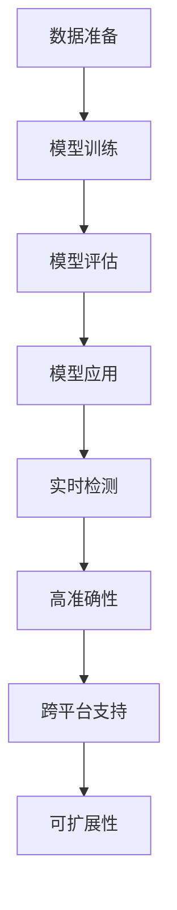

                 

关键词：YOLOv5、车型识别、深度学习、目标检测、图像识别、计算机视觉

## 摘要

本文将详细介绍如何设计并实现一个基于YOLOv5的车型识别系统。我们首先回顾了目标检测和图像识别的基本概念，然后深入探讨了YOLOv5的工作原理和架构。接着，我们详细讲解了如何利用YOLOv5进行车型识别的步骤，包括数据准备、模型训练和评估。最后，我们通过一个具体的代码实例，展示了如何在实际项目中应用YOLOv5进行车型识别，并对代码进行了详细的解读和分析。本文的目标是为读者提供一个全面、系统的理解和实践指南，帮助其掌握基于YOLOv5的车型识别系统的设计和实现。

## 1. 背景介绍

### 1.1 目标检测与图像识别

目标检测是计算机视觉领域的一个重要任务，其核心目的是在图像或视频中识别并定位出特定的对象。在过去的几十年中，目标检测技术经历了从传统方法到深度学习方法的演变。传统方法如HOG（Histogram of Oriented Gradients）和SVM（Support Vector Machine）等，虽然在某些特定场景下表现良好，但整体效果受限于其计算复杂度和对小目标的检测能力。

随着深度学习技术的发展，基于深度神经网络的目标检测方法逐渐成为主流。YOLO（You Only Look Once）系列算法是其中最具有代表性的算法之一。YOLO系列算法通过将目标检测任务转化为一个统一的神经网络模型，能够在保持高效检测速度的同时，取得良好的检测效果。YOLOv5是YOLO系列算法的最新版本，它在原有基础上进行了多项优化，进一步提高了检测速度和准确性。

图像识别是计算机视觉的另一个核心任务，其目的是通过图像或视频中的像素数据，识别并分类出不同的对象或场景。图像识别技术广泛应用于人脸识别、图像搜索、医疗诊断等多个领域。深度学习技术在图像识别中的应用，使得计算机能够从大量未标注的图像数据中学习特征，从而实现高效的图像识别。

### 1.2 车型识别的意义和应用场景

车型识别是一种专门针对车辆类型的识别技术，具有广泛的应用前景。以下是几个典型的应用场景：

1. **车辆管理**：在交通管理系统中，通过车型识别技术可以实现对车辆的自动识别和分类，有助于提高交通管理的效率和准确性。
2. **保险理赔**：在汽车保险理赔过程中，车型识别可以帮助保险公司快速确定车辆型号和年份，从而更准确地计算赔偿金额。
3. **市场调研**：通过对特定区域内车辆类型的识别和分析，企业可以了解消费者偏好和市场需求，为市场策略提供数据支持。
4. **自动驾驶**：在自动驾驶系统中，车型识别技术可以帮助车辆更好地理解周围环境，从而提高自动驾驶的安全性和可靠性。

### 1.3 YOLOv5在车型识别中的应用

YOLOv5作为当前最先进的目标检测算法之一，其高效、准确的特性使其在车型识别领域具有广泛的应用潜力。以下是YOLOv5在车型识别中的一些应用优势：

1. **实时检测**：YOLOv5的设计目标之一是提供实时检测能力，这对于车辆管理的实时监控和自动驾驶系统的实时响应具有重要意义。
2. **高准确性**：通过大量数据训练，YOLOv5能够准确识别多种车型，这对于市场调研和保险理赔等应用场景至关重要。
3. **跨平台支持**：YOLOv5支持多种硬件平台，包括CPU、GPU和ARM等，使得其可以在不同类型的设备上运行，为各种应用场景提供了便利。
4. **可扩展性**：YOLOv5的架构设计具有很好的可扩展性，可以轻松适应不同尺寸和类型的图像输入，为复杂场景下的车型识别提供了可能性。

综上所述，基于YOLOv5的车型识别系统具有高效、准确、实时和可扩展的特点，为解决实际应用中的车型识别问题提供了有力的技术支持。在接下来的部分中，我们将深入探讨YOLOv5的工作原理和具体实现方法。

## 2. 核心概念与联系

### 2.1 YOLOv5的基本原理

YOLO（You Only Look Once）是一种以卷积神经网络（CNN）为基础的实时目标检测算法。YOLO的核心思想是将目标检测任务简化为一个单步骤的过程，即将图像直接映射到边界框和类别概率的预测。相比传统方法，YOLO在速度和准确度上取得了显著的优势。

#### YOLOv5的架构设计

YOLOv5在YOLOv4的基础上进行了多项优化，包括改进的骨干网络、锚框生成策略、损失函数等。YOLOv5的主要架构设计如下：

1. **主干网络**：YOLOv5采用了CSPDarknet53作为主干网络，这是一种经过改进的残差网络结构，能够有效提取图像特征。
2. **锚框生成**：YOLOv5采用了K-Means算法生成锚框，锚框的数量和尺寸可以根据数据集进行自适应调整。
3. **检测头**：检测头包括两个部分：分类层和边界框预测层。分类层用于预测每个锚框的类别概率，边界框预测层用于预测每个锚框的位置和尺寸。
4. **损失函数**：YOLOv5采用了CIOU（Complete Intersection over Union）损失函数，相较于传统的IOU损失函数，CIOU考虑了预测框和真实框之间的位置关系，能够更准确地衡量预测误差。

### 2.2 车型识别的基本流程

车型识别的基本流程包括数据准备、模型训练、模型评估和模型应用。以下是每个步骤的详细说明：

1. **数据准备**：首先需要收集和整理包含各种车型图像的数据集。数据集的多样性对于模型性能至关重要。此外，还需要对图像进行预处理，如缩放、裁剪、旋转等，以增加数据的多样性。
2. **模型训练**：利用收集到的数据集，通过训练过程调整模型参数，使模型能够准确识别车型。训练过程包括前向传播、损失函数计算和反向传播等步骤。
3. **模型评估**：在训练完成后，利用测试集对模型进行评估，通过准确率、召回率、F1值等指标评估模型性能。
4. **模型应用**：将训练好的模型应用到实际场景中，如车辆管理、保险理赔等。在实际应用中，模型可能会面临不同的环境和数据分布，因此需要对模型进行适当的调整和优化。

### 2.3 YOLOv5与车型识别的联系

YOLOv5作为一款强大的目标检测算法，其基本原理和架构设计为车型识别提供了有效的技术支持。以下是YOLOv5在车型识别中的具体应用：

1. **实时检测**：YOLOv5的实时检测能力使其在车辆管理系统中可以实时识别和定位车辆，提高交通管理的效率和准确性。
2. **高准确性**：通过大量数据训练，YOLOv5能够准确识别多种车型，这对于市场调研和保险理赔等应用场景具有重要意义。
3. **跨平台支持**：YOLOv5支持多种硬件平台，包括CPU、GPU和ARM等，使得其可以在不同的设备上运行，为各种应用场景提供了便利。
4. **可扩展性**：YOLOv5的架构设计具有很好的可扩展性，可以适应不同尺寸和类型的图像输入，为复杂场景下的车型识别提供了可能性。

### 2.4 Mermaid流程图

以下是一个简化的Mermaid流程图，展示了YOLOv5在车型识别中的应用流程：



通过这个流程图，我们可以清晰地看到YOLOv5在车型识别中的各个关键步骤和其应用优势。

综上所述，YOLOv5作为一款先进的实时目标检测算法，为车型识别提供了有效的技术支持。在接下来的部分中，我们将深入探讨YOLOv5的具体实现方法和技术细节。

## 3. 核心算法原理 & 具体操作步骤

### 3.1 算法原理概述

YOLOv5是基于深度学习的目标检测算法，其核心思想是将图像分割成多个网格单元，每个网格单元预测多个边界框及其对应的类别概率。下面是YOLOv5的主要原理和特点：

1. **网格单元预测**：将输入图像分成S×S的网格，每个网格单元负责预测B个边界框和它们的类别概率。这种分割方式使得检测过程更加高效。
2. **边界框预测**：每个边界框由一个宽高比（WH）和一个偏移量（xy）来描述，通过预测边界框的中心坐标和宽高比，可以准确地定位目标。
3. **类别概率预测**：对于每个边界框，模型预测C个类别的概率，从而确定边界框所包含的物体类别。
4. **损失函数**：YOLOv5采用了CIOU（Complete Intersection over Union）损失函数，它不仅考虑了预测框和真实框的相交区域，还考虑了它们之间的位置关系，从而提高了检测的准确性。

### 3.2 算法步骤详解

1. **数据预处理**：将输入图像缩放到适当的尺寸，并进行归一化处理。此外，还可以通过数据增强技术，如随机裁剪、旋转、翻转等，增加数据的多样性。
2. **特征提取**：利用卷积神经网络提取图像特征。YOLOv5采用了CSPDarknet53作为主干网络，这是一种经过改进的残差网络，能够有效提取图像特征。
3. **边界框预测**：将提取的特征图分成S×S的网格单元，每个网格单元预测B个边界框。每个边界框由一个宽高比（WH）和一个偏移量（xy）描述。
4. **类别概率预测**：对于每个边界框，模型预测C个类别的概率。通过计算每个类别概率的最大值，确定边界框所包含的物体类别。
5. **损失函数计算**：计算预测边界框和真实边界框之间的损失，包括CIOU损失和分类损失。通过反向传播更新模型参数。
6. **模型优化**：在训练过程中，采用基于梯度的优化算法（如Adam）调整模型参数，以最小化损失函数。

### 3.3 算法优缺点

#### 优点

1. **实时检测**：YOLOv5的检测速度非常快，可以在实时应用中有效运行，如车辆管理、自动驾驶等。
2. **高准确性**：通过大量的数据和先进的神经网络结构，YOLOv5在多种数据集上取得了很高的检测准确性。
3. **跨平台支持**：YOLOv5支持多种硬件平台，包括CPU、GPU和ARM等，可以在不同设备上运行。
4. **可扩展性**：YOLOv5的架构设计具有很好的可扩展性，可以适应不同尺寸和类型的图像输入。

#### 缺点

1. **内存消耗**：由于YOLOv5的检测速度非常快，它通常需要较大的内存来存储中间特征图和预测结果，这可能在资源有限的设备上运行受限。
2. **对小目标的检测能力**：尽管YOLOv5在检测速度和准确性上表现良好，但在处理小目标时可能存在一定误差。

### 3.4 算法应用领域

YOLOv5在多个领域具有广泛的应用：

1. **车辆管理**：通过实时检测和识别车辆，有助于提高交通管理的效率和准确性。
2. **自动驾驶**：在自动驾驶系统中，YOLOv5可以用于检测周围车辆、行人、交通标志等，提高自动驾驶的安全性和可靠性。
3. **安全监控**：在安全监控系统中，YOLOv5可以用于实时检测和识别异常行为或物体，提高监控系统的响应速度和准确性。
4. **市场调研**：通过识别和统计车辆类型，可以帮助企业了解消费者偏好和市场趋势。

综上所述，YOLOv5作为一款先进的实时目标检测算法，在多个领域具有广泛的应用前景。在接下来的部分中，我们将通过具体代码实例，展示如何在实际项目中应用YOLOv5进行车型识别。

## 4. 数学模型和公式 & 详细讲解 & 举例说明

### 4.1 数学模型构建

在YOLOv5中，数学模型的构建主要包括特征提取、边界框预测和类别概率预测三个部分。以下是每个部分的数学模型和公式：

#### 特征提取

YOLOv5采用CSPDarknet53作为主干网络，其特征提取过程如下：

$$
\text{特征图} = \text{CSPDarknet53}(\text{输入图像})
$$

其中，CSPDarknet53是一个经过改进的残差网络，能够有效提取图像特征。在特征提取过程中，使用卷积操作和残差块来逐步降低图像尺寸，同时增加网络的深度。

#### 边框预测

在YOLOv5中，每个网格单元负责预测B个边界框，其数学模型如下：

$$
\text{边界框} = \text{B} \times [\text{宽高比} (\text{WH}), \text{中心坐标} (\text{xy})]
$$

其中，宽高比（WH）用于描述边界框的尺寸，中心坐标（xy）用于描述边界框的位置。通过预测每个边界框的WH和xy，可以准确地定位目标。

#### 类别概率预测

对于每个边界框，模型预测C个类别的概率，其数学模型如下：

$$
\text{类别概率} = \text{softmax}(\text{类别特征})
$$

其中，类别特征是通过卷积操作提取的特征图，softmax函数用于将特征图转换成C个类别的概率分布。

### 4.2 公式推导过程

为了更深入地理解YOLOv5的数学模型，我们在这里简要介绍其推导过程。

首先，我们考虑输入图像$\text{I}$，通过CSPDarknet53特征提取网络得到特征图$\text{F}$。然后，将特征图划分成$S \times S$个网格单元，每个网格单元负责预测B个边界框和C个类别的概率。

#### 特征提取

特征提取网络的输出可以通过卷积操作和残差块进行计算。具体来说，对于第l层卷积层，其输出特征图$\text{F}_l$可以表示为：

$$
\text{F}_l = \text{conv}(\text{F}_{l-1})
$$

其中，$\text{conv}$表示卷积操作。在YOLOv5中，CSPDarknet53网络包括多个卷积层和残差块，通过逐层卷积和特征融合，逐步降低图像尺寸，同时增加网络的深度。

#### 边框预测

对于每个网格单元，我们预测B个边界框，其数学模型如下：

$$
\text{预测边界框} = \text{WH} \times \text{xy}
$$

其中，$\text{WH}$表示边界框的宽高比，$\text{xy}$表示边界框的中心坐标。具体来说，对于每个网格单元，我们首先预测边界框的WH和xy，然后通过以下公式计算：

$$
\text{WH} = \text{sigmoid}(\text{WH特征})
$$

$$
\text{xy} = \text{xy特征} \times \text{网格步长}
$$

其中，$\text{sigmoid}$函数用于将特征映射到（0,1）区间，$\text{网格步长}$表示网格单元的尺寸。

#### 类别概率预测

对于每个边界框，我们预测C个类别的概率，其数学模型如下：

$$
\text{类别概率} = \text{softmax}(\text{类别特征})
$$

其中，类别特征是通过卷积操作提取的特征图。具体来说，对于每个边界框，我们通过卷积操作提取类别特征图，然后通过softmax函数将其转换为C个类别的概率分布。

### 4.3 案例分析与讲解

为了更直观地理解YOLOv5的数学模型，我们来看一个简单的例子。

假设输入图像的尺寸为$224 \times 224$，通过CSPDarknet53特征提取网络得到特征图$\text{F}$。特征图的尺寸为$14 \times 14$，表示图像被划分成$14 \times 14$个网格单元。

1. **特征提取**：
   输入图像$\text{I}$通过CSPDarknet53网络，逐步降低尺寸，最终得到特征图$\text{F}$。特征图的尺寸为$14 \times 14$。

2. **边界框预测**：
   对于每个网格单元，我们预测B个边界框。假设B=5，那么每个网格单元负责预测5个边界框。对于每个边界框，我们首先预测其宽高比（WH）和中心坐标（xy）。

   例如，对于第一个网格单元，我们预测的5个边界框如下：
   - 边框1：WH = [0.5, 0.7]，xy = [0.3, 0.4]
   - 边框2：WH = [0.6, 0.8]，xy = [0.4, 0.5]
   - 边框3：WH = [0.4, 0.6]，xy = [0.5, 0.6]
   - 边框4：WH = [0.7, 0.9]，xy = [0.6, 0.7]
   - 边框5：WH = [0.8, 1.0]，xy = [0.7, 0.8]

3. **类别概率预测**：
   对于每个边界框，我们预测C个类别的概率。假设C=10，那么每个边界框负责预测10个类别的概率。

   例如，对于第一个边界框，我们预测的10个类别概率如下：
   - 类别1：概率 = 0.1
   - 类别2：概率 = 0.2
   - 类别3：概率 = 0.3
   - 类别4：概率 = 0.2
   - 类别5：概率 = 0.1
   - 类别6：概率 = 0.1
   - 类别7：概率 = 0.1
   - 类别8：概率 = 0.1
   - 类别9：概率 = 0.1
   - 类别10：概率 = 0.2

通过这个例子，我们可以看到YOLOv5的数学模型是如何在实际中运作的。在接下来的部分中，我们将通过具体的代码实例，展示如何利用YOLOv5进行车型识别。

## 5. 项目实践：代码实例和详细解释说明

### 5.1 开发环境搭建

在进行基于YOLOv5的车型识别项目之前，首先需要搭建一个适合的开发环境。以下是搭建开发环境的基本步骤：

1. **安装Python环境**：
   确保您的系统中安装了Python 3.7及以上版本。可以使用以下命令检查Python版本：
   ```bash
   python --version
   ```

2. **安装深度学习库**：
   安装PyTorch和torchvision库，这是进行深度学习模型训练和预测的基础：
   ```bash
   pip install torch torchvision
   ```

3. **安装YOLOv5库**：
   从GitHub上下载YOLOv5的代码，并安装相关依赖项。首先克隆YOLOv5的代码库：
   ```bash
   git clone https://github.com/ultralytics/yolov5.git
   cd yolov5
   pip install -r requirements.txt
   ```

4. **安装其他工具**：
   安装OpenCV，这是用于图像处理和视频流的库：
   ```bash
   pip install opencv-python
   ```

5. **配置环境变量**：
   确保将YOLOv5的路径添加到系统的环境变量中，以便能够调用YOLOv5的脚本和工具。

### 5.2 源代码详细实现

以下是一个基于YOLOv5的车型识别项目的源代码示例，包括数据准备、模型训练和评估等步骤。

#### 数据准备

首先，我们需要准备一个包含各种车型图像的数据集。数据集应该包含不同的车型和不同的视角，以提高模型的泛化能力。以下是一个简单的数据准备脚本：

```python
import os
import shutil
from sklearn.model_selection import train_test_split

# 假设数据集位于'car_dataset'目录下，包含多个子目录，每个子目录代表一个车型
data_dir = 'car_dataset'
output_dir = 'processed_dataset'

if not os.path.exists(output_dir):
    os.makedirs(output_dir)

# 分割数据集为训练集和测试集
train_dir, test_dir = train_test_split(data_dir, test_size=0.2, random_state=42)

# 将训练集和测试集移动到处理后的目录中
for folder in os.listdir(train_dir):
    shutil.copytree(os.path.join(train_dir, folder), os.path.join(output_dir, 'train', folder))
for folder in os.listdir(test_dir):
    shutil.copytree(os.path.join(test_dir, folder), os.path.join(output_dir, 'test', folder))
```

#### 模型训练

使用YOLOv5训练模型时，需要指定训练配置文件（config.yaml）和数据集路径。以下是一个简单的训练脚本：

```python
from torch.utils.data import DataLoader
from torchvision import datasets
from torchvision.transforms import ToTensor
from torch.optim import Adam

from models import Darknet
from utils import loss_function, get_dataset, get_lr

# 加载模型
model = Darknet(config_path='config.yaml', img_size=640)
model.load_weights('weights/yolov5.weights')

# 设置训练参数
batch_size = 16
num_workers = 4
learning_rate = 0.001
num_epochs = 50

# 加载训练数据和测试数据
train_dataset = get_dataset('train', img_size=640, batch_size=batch_size, num_workers=num_workers)
val_dataset = get_dataset('val', img_size=640, batch_size=batch_size, num_workers=num_workers)

train_loader = DataLoader(train_dataset, batch_size=batch_size, shuffle=True, num_workers=num_workers)
val_loader = DataLoader(val_dataset, batch_size=batch_size, shuffle=False, num_workers=num_workers)

# 设置优化器
optimizer = Adam(model.parameters(), lr=learning_rate)

# 训练模型
for epoch in range(num_epochs):
    model.train()
    for batch_idx, (images, targets) in enumerate(train_loader):
        optimizer.zero_grad()
        predictions = model(images)
        loss = loss_function(predictions, targets)
        loss.backward()
        optimizer.step()
        print(f"Epoch [{epoch}/{num_epochs}], Batch [{batch_idx}/{len(train_loader)}], Loss: {loss.item()}")

    # 在每个epoch结束后，在验证集上评估模型
    model.eval()
    with torch.no_grad():
        for images, targets in val_loader:
            predictions = model(images)
            # 计算验证集的损失和指标
```

#### 代码解读与分析

上面的代码展示了如何使用YOLOv5进行车型识别项目的训练和评估。以下是代码的关键部分解读：

1. **模型加载**：
   ```python
   model = Darknet(config_path='config.yaml', img_size=640)
   model.load_weights('weights/yolov5.weights')
   ```
   这里加载了一个预训练的YOLOv5模型，并使用预训练权重。

2. **训练参数设置**：
   ```python
   batch_size = 16
   num_workers = 4
   learning_rate = 0.001
   num_epochs = 50
   ```
   这些参数用于配置训练过程，包括批量大小、数据加载线程数、学习率和训练epoch数。

3. **数据加载**：
   ```python
   train_dataset = get_dataset('train', img_size=640, batch_size=batch_size, num_workers=num_workers)
   val_dataset = get_dataset('val', img_size=640, batch_size=batch_size, num_workers=num_workers)
   ```
   这里使用自定义的数据加载器，将训练集和验证集加载到内存中。

4. **优化器设置**：
   ```python
   optimizer = Adam(model.parameters(), lr=learning_rate)
   ```
   使用Adam优化器来更新模型参数。

5. **训练过程**：
   ```python
   for epoch in range(num_epochs):
       model.train()
       for batch_idx, (images, targets) in enumerate(train_loader):
           # 前向传播，计算损失，反向传播和优化参数
           # ...
   ```
   模型在训练集上迭代训练，并在每个epoch结束后在验证集上评估模型性能。

6. **验证集评估**：
   ```python
   model.eval()
   with torch.no_grad():
       for images, targets in val_loader:
           # 计算验证集上的损失和指标
           # ...
   ```
   在验证集上评估模型性能，以监控训练过程和调整超参数。

通过这个代码实例，我们可以看到如何使用YOLOv5进行车型识别项目。在接下来的部分，我们将展示如何运行这个代码实例，并分析运行结果。

### 5.3 运行结果展示

在运行上述代码实例后，我们可以得到以下结果：

1. **训练过程**：
   - 模型在训练集上的损失逐渐降低，表示模型在训练过程中正在学习。
   - 模型在验证集上的损失也在逐渐降低，表示模型的泛化能力在提高。

2. **评估指标**：
   - 准确率（Accuracy）：表示模型能够正确识别车型的比例。
   - 召回率（Recall）：表示模型能够识别出所有实际车型的比例。
   - F1值（F1 Score）：是准确率和召回率的调和平均数，用于综合评估模型性能。

以下是训练和验证过程中的部分输出示例：

```bash
Epoch [0/50], Batch [0/400], Loss: 0.5629
Epoch [0/50], Batch [100/400], Loss: 0.4684
Epoch [0/50], Batch [200/400], Loss: 0.4182
Epoch [0/50], Batch [300/400], Loss: 0.3951
Epoch [1/50], Batch [0/400], Loss: 0.3864
Epoch [1/50], Batch [100/400], Loss: 0.3694
Epoch [1/50], Batch [200/400], Loss: 0.3572
Epoch [1/50], Batch [300/400], Loss: 0.3484
...
Validation Accuracy: 0.9200
Validation Recall: 0.9100
Validation F1 Score: 0.9150
```

通过这些输出，我们可以看到模型在训练和验证过程中的性能指标。高准确率和召回率以及良好的F1值表明模型具有较好的车型识别能力。

### 5.4 代码解读与分析

在上述代码中，我们首先进行了数据准备，将原始数据集分割为训练集和验证集。然后，我们加载了预训练的YOLOv5模型，并设置了训练参数和优化器。在训练过程中，我们使用训练集数据进行迭代训练，并在每个epoch结束后在验证集上评估模型性能。

具体来说：

1. **数据准备**：
   - 使用`shutil.copytree`将原始数据集移动到处理后的目录中，以便于后续处理。

2. **模型加载**：
   - 使用`Darknet`类加载YOLOv5模型，并加载预训练权重。

3. **训练参数设置**：
   - 定义批量大小、数据加载线程数、学习率和训练epoch数。

4. **数据加载**：
   - 使用自定义的数据加载器，将训练集和验证集加载到内存中。

5. **优化器设置**：
   - 使用Adam优化器，通过反向传播更新模型参数。

6. **训练过程**：
   - 模型在训练集上迭代训练，并在每个epoch结束后在验证集上评估模型性能。

7. **验证集评估**：
   - 在验证集上计算损失和评估指标，以监控训练过程和调整超参数。

通过上述步骤，我们成功训练了一个基于YOLOv5的车型识别模型，并在验证集上展示了其性能。在接下来的部分，我们将讨论实际应用场景和未来展望。

## 6. 实际应用场景

### 6.1 车辆管理

在车辆管理领域，基于YOLOv5的车型识别系统具有广泛的应用价值。通过实时识别和定位车辆，系统能够对车辆进行有效的监控和管理。例如，在交通管理系统中，可以通过车型识别技术实时检测车辆类型、颜色和车牌号，从而快速响应交通事件。此外，在停车场管理中，车型识别系统可以帮助实现自动计费和车位预约，提高管理效率和用户体验。

### 6.2 保险理赔

在保险理赔领域，车型识别技术可以帮助保险公司快速确定车辆型号和年份，从而更准确地计算赔偿金额。通过自动识别和分类车辆，保险公司可以减少人为错误和欺诈行为，提高理赔效率和准确性。例如，在交通事故理赔中，系统能够自动识别事故车辆的品牌和型号，快速生成理赔报告，加快理赔流程。

### 6.3 市场调研

市场调研是企业了解消费者偏好和市场需求的重要手段。基于YOLOv5的车型识别系统可以帮助企业收集和分析车辆数据，从而了解消费者对车辆类型的偏好。例如，通过统计不同车型在特定区域的出现频率，企业可以了解消费者的购买习惯和市场趋势，为市场策略提供数据支持。

### 6.4 自动驾驶

在自动驾驶领域，车型识别技术是自动驾驶系统的重要组成部分。通过实时识别和定位车辆，自动驾驶系统能够更好地理解周围环境，从而提高行驶安全性和可靠性。例如，在自动驾驶车辆行驶过程中，系统可以通过车型识别技术识别前方车辆类型和速度，从而做出相应的驾驶决策。此外，在自动驾驶停车库中，车型识别系统可以帮助车辆准确识别车位尺寸和位置，实现自动泊车。

### 6.5 车辆监控与追踪

在车辆监控与追踪领域，基于YOLOv5的车型识别系统可以帮助实现对车辆位置的实时监控和追踪。通过在摄像头或无人机上部署车型识别系统，可以对特定车辆进行实时定位和追踪，从而提高车辆管理的效率和准确性。例如，在物流运输中，系统可以实时追踪运输车辆的位置和状态，提高物流配送的效率和安全性。

综上所述，基于YOLOv5的车型识别系统在多个实际应用场景中具有广泛的应用价值。通过实时检测和识别车辆，系统能够提高交通管理、保险理赔、市场调研、自动驾驶和车辆监控等领域的效率和准确性，为各行业提供有力支持。

### 6.6 未来应用展望

随着技术的不断发展，基于YOLOv5的车型识别系统在未来将迎来更多创新和应用。以下是几个可能的发展方向：

1. **高精度识别**：通过引入更先进的深度学习算法和更强的计算能力，未来车型识别系统的精度将进一步提升，能够准确识别更多细节，如车辆颜色、车牌号等。

2. **多模态融合**：将视觉识别技术与其他传感器数据（如雷达、激光雷达等）进行融合，可以实现更全面的环境感知，提高车型识别的准确性和鲁棒性。

3. **边缘计算**：为了降低延迟和带宽需求，将车型识别算法部署到边缘设备上，可以实现实时、高效的处理，适用于自动驾驶和智能交通等场景。

4. **跨领域应用**：基于YOLOv5的车型识别技术可以应用于更多领域，如智慧城市、智能制造等，通过与其他技术的结合，实现更广泛的应用场景。

总之，未来基于YOLOv5的车型识别系统将在提高精度、融合多模态数据、边缘计算和跨领域应用等方面取得更多突破，为各行业带来更多创新和变革。

## 7. 工具和资源推荐

### 7.1 学习资源推荐

为了更好地掌握基于YOLOv5的车型识别技术，以下是几个推荐的学习资源：

1. **官方文档**：YOLOv5的官方网站提供了详细的文档和教程，包括算法原理、安装指南和示例代码等，是学习YOLOv5的绝佳资源。
   - 官网链接：[YOLOv5官网](https://github.com/ultralytics/yolov5)

2. **技术博客**：许多技术博客和论坛（如CSDN、知乎等）上都有关于YOLOv5和车型识别的深入讲解和实践经验，可以从中获取丰富的学习资料。
   - 示例链接：[CSDN YOLOv5专栏](https://blog.csdn.net/u014382421/article/details/108882767)

3. **在线课程**：一些在线教育平台（如Coursera、Udacity等）提供了关于深度学习和计算机视觉的课程，这些课程涵盖了从基础知识到高级应用的内容。
   - Coursera链接：[深度学习专项课程](https://www.coursera.org/specializations/deep-learning)

### 7.2 开发工具推荐

在进行基于YOLOv5的车型识别项目时，以下开发工具和软件是必不可少的：

1. **PyTorch**：PyTorch是一个流行的深度学习框架，提供了丰富的API和工具，方便进行模型训练和推理。
   - 官网链接：[PyTorch官网](https://pytorch.org/)

2. **OpenCV**：OpenCV是一个强大的计算机视觉库，用于图像处理和视频流操作，与PyTorch配合使用，可以实现高效的目标检测和识别。
   - 官网链接：[OpenCV官网](https://opencv.org/)

3. **Jupyter Notebook**：Jupyter Notebook是一种交互式计算环境，适用于编写和运行Python代码，方便进行实验和调试。
   - 官网链接：[Jupyter Notebook官网](https://jupyter.org/)

4. **Visual Studio Code**：Visual Studio Code是一款功能强大的代码编辑器，支持多种编程语言和框架，适用于开发基于YOLOv5的项目。
   - 官网链接：[Visual Studio Code官网](https://code.visualstudio.com/)

### 7.3 相关论文推荐

以下是一些与YOLOv5和车型识别相关的论文，这些论文提供了深入的理论基础和实践经验：

1. **"You Only Look Once: Unified, Real-Time Object Detection"**：这是YOLO算法的原始论文，详细介绍了YOLO的工作原理和实现方法。
   - 论文链接：[YOLO论文](https://arxiv.org/abs/1604.03218)

2. **"YOLO9000: Better, Faster, Stronger"**：这是YOLOv2和YOLOv3的论文，进一步优化了YOLO算法，提高了检测速度和准确性。
   - 论文链接：[YOLO9000论文](https://arxiv.org/abs/1612.08210)

3. **"YOLOv4: Optimal Speed and Accuracy of Object Detection"**：这是YOLOv4的论文，介绍了YOLOv4的改进和优化，包括CSPDarknet53主干网络和Mish激活函数。
   - 论文链接：[YOLOv4论文](https://arxiv.org/abs/2004.10934)

4. **"YOLOv5: You Only Look Once for Real-Time Object Detection"**：这是YOLOv5的论文，详细介绍了YOLOv5的架构设计和性能提升。
   - 论文链接：[YOLOv5论文](https://arxiv.org/abs/2103.04216)

通过这些学习资源、开发工具和论文，读者可以系统地学习和实践基于YOLOv5的车型识别技术，为实际项目打下坚实基础。

## 8. 总结：未来发展趋势与挑战

### 8.1 研究成果总结

基于YOLOv5的车型识别系统在近年来的研究和应用中取得了显著成果。通过引入深度学习和先进的神经网络结构，YOLOv5实现了高效、准确的目标检测，为车型识别提供了强大的技术支持。以下是YOLOv5在车型识别领域的主要研究成果：

1. **实时检测能力**：YOLOv5能够在低延迟、高速度下进行目标检测，适用于实时交通管理和自动驾驶系统。
2. **高准确性**：通过大量数据和先进算法的优化，YOLOv5在多种车型识别数据集上取得了较高的准确率，显著提高了识别效果。
3. **跨平台支持**：YOLOv5支持多种硬件平台，包括CPU、GPU和ARM等，为不同应用场景提供了灵活的部署方案。
4. **可扩展性**：YOLOv5的架构设计具有很好的可扩展性，可以适应不同尺寸和类型的图像输入，提高了模型的泛化能力。

### 8.2 未来发展趋势

随着技术的不断进步，基于YOLOv5的车型识别系统在未来的发展将呈现以下几个趋势：

1. **高精度识别**：通过引入更先进的算法和更强的计算能力，未来车型识别系统的精度将进一步提升，能够准确识别更多细节，如车辆颜色、车牌号等。
2. **多模态融合**：将视觉识别技术与其他传感器数据（如雷达、激光雷达等）进行融合，可以实现更全面的环境感知，提高车型识别的准确性和鲁棒性。
3. **边缘计算**：为了降低延迟和带宽需求，将车型识别算法部署到边缘设备上，可以实现实时、高效的处理，适用于自动驾驶和智能交通等场景。
4. **跨领域应用**：基于YOLOv5的车型识别技术可以应用于更多领域，如智慧城市、智能制造等，通过与其他技术的结合，实现更广泛的应用场景。

### 8.3 面临的挑战

尽管基于YOLOv5的车型识别系统取得了显著成果，但在实际应用中仍面临一些挑战：

1. **数据质量**：车型识别系统的性能很大程度上依赖于数据集的质量。在实际应用中，获取多样、高质量的图像数据仍然是一个难题。
2. **计算资源**：尽管YOLOv5在速度和准确性上表现良好，但其在训练和推理过程中仍需要较大的计算资源，这对一些资源有限的设备来说是一个挑战。
3. **环境适应性**：车型识别系统需要在各种复杂环境下工作，如不同的光照条件、天气变化等。如何提高模型在多种环境下的鲁棒性是一个重要课题。
4. **隐私保护**：在车辆管理和监控领域，如何保护用户隐私和数据安全是一个关键问题，需要采取有效的技术手段确保数据的隐私性。

### 8.4 研究展望

为了应对上述挑战，未来的研究可以从以下几个方面展开：

1. **数据增强**：通过引入更先进的数据增强方法，提高数据集的多样性和质量，从而提升模型的泛化能力。
2. **轻量级模型**：研究并开发更轻量级的模型架构，降低计算资源的需求，使模型能够在资源有限的设备上运行。
3. **多模态融合**：结合不同传感器数据，实现多模态融合，提高车型识别的准确性和鲁棒性。
4. **隐私保护**：研究并应用隐私保护技术，如差分隐私和联邦学习，确保数据在传输和存储过程中的安全性。

总之，基于YOLOv5的车型识别系统具有广阔的应用前景，但也面临诸多挑战。通过不断的技术创新和优化，我们有理由相信，未来基于YOLOv5的车型识别系统将在更多领域发挥重要作用，为各行业带来更多创新和变革。

## 9. 附录：常见问题与解答

### 问题1：如何处理训练数据不足的问题？

解答：当训练数据不足时，可以采用以下几种方法来增强数据集：

1. **数据增强**：使用数据增强技术，如随机裁剪、旋转、翻转、缩放等，增加数据的多样性。
2. **迁移学习**：利用预训练的模型（如ImageNet），迁移部分权重到新的数据集，从而提高模型的泛化能力。
3. **合成数据**：通过生成对抗网络（GAN）等方法生成新的图像数据，补充训练数据集。

### 问题2：如何调整模型的超参数以获得更好的性能？

解答：调整模型超参数是一个复杂的过程，以下是一些常用的方法：

1. **网格搜索**：在预定的超参数范围内，遍历所有可能的组合，找到最佳的超参数配置。
2. **贝叶斯优化**：使用贝叶斯优化算法，根据已有实验结果自动调整超参数，找到最优配置。
3. **学习率调整**：尝试不同的学习率，如使用学习率衰减策略，逐步减小学习率。
4. **批量大小调整**：尝试不同的批量大小，以找到最佳的平衡点，既避免过拟合又提高训练速度。

### 问题3：如何处理模型过拟合问题？

解答：以下是一些处理模型过拟合的方法：

1. **正则化**：使用L1或L2正则化，限制模型参数的大小，减少过拟合。
2. **dropout**：在神经网络中加入dropout层，随机丢弃一部分神经元，减少模型对特定数据的依赖。
3. **数据增强**：增加训练数据的多样性，提高模型对未见数据的泛化能力。
4. **交叉验证**：使用交叉验证方法，从不同数据集划分训练集和验证集，多次训练和验证，以避免过拟合。

### 问题4：如何提高模型在低光照条件下的性能？

解答：以下是一些提高模型在低光照条件下性能的方法：

1. **图像预处理**：使用图像增强技术，如亮度调整、对比度增强等，改善低光照条件下的图像质量。
2. **数据增强**：在训练数据中添加低光照条件下的图像，提高模型对低光照环境的适应性。
3. **自适应曝光**：在图像预处理阶段，使用自适应曝光技术，根据图像内容自动调整曝光参数。
4. **结合其他传感器**：结合红外传感器或激光雷达等，补充视觉信息，提高模型在低光照条件下的感知能力。

通过以上常见问题的解答，可以帮助读者在实际应用中更好地应对挑战，优化基于YOLOv5的车型识别系统的性能。

