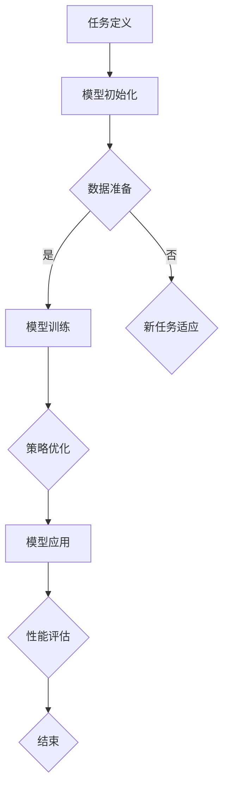

                 

关键词：元学习，冷启动问题，解决方案，深度学习，在线学习，迁移学习，强化学习。

## 摘要

本文旨在探讨元学习在解决冷启动问题方面的应用。冷启动问题在机器学习和人工智能领域中普遍存在，特别是在推荐系统、社交网络分析和新用户个性化服务等领域。通过深入理解元学习的基本原理及其与冷启动问题的联系，本文提出了一种基于元学习的方法来有效解决冷启动问题。文章将详细介绍该方法的核心概念、算法原理、数学模型以及实际应用案例，并展望其在未来技术发展中的应用前景。

### 1. 背景介绍

#### 1.1 冷启动问题的定义

冷启动问题（Cold Start Problem）指的是在系统刚开始运行或面对新的用户、物品或场景时，由于缺乏足够的数据和信息，导致系统无法准确预测或推荐的问题。具体来说，冷启动问题主要分为以下几种类型：

- **用户冷启动**：新用户加入系统，由于没有历史行为数据，系统难以为其提供个性化的推荐或服务。
- **物品冷启动**：新物品上线，由于缺乏用户评价或交互数据，系统无法为该物品生成有效的推荐。
- **场景冷启动**：系统面临新的应用场景，由于缺乏相应的数据和信息，难以适应和优化。

#### 1.2 冷启动问题的影响

冷启动问题会对系统的用户体验和性能产生显著影响。如果无法有效解决，可能会导致以下问题：

- **推荐准确率下降**：由于缺乏足够的数据，系统推荐的内容可能不准确，导致用户满意度降低。
- **用户流失**：新用户由于无法得到个性化的服务，可能会放弃使用系统，导致用户流失率增加。
- **业务损失**：对于商业系统，冷启动问题可能导致销售和收益下降。

#### 1.3 传统方法的局限性

在解决冷启动问题时，传统的机器学习方法和算法通常有以下局限性：

- **依赖大量历史数据**：传统方法往往需要大量的历史数据来训练模型，这在冷启动阶段难以实现。
- **低效的个性化**：即使有数据，传统方法也难以为新用户或物品生成个性化的推荐，导致推荐效果不佳。
- **模型适应性差**：传统方法对新的用户、物品或场景适应性较差，难以快速适应新的环境。

### 2. 核心概念与联系

为了有效解决冷启动问题，我们引入了元学习（Meta-Learning）这一先进的技术。元学习是一种通过学习如何学习的方法，其核心思想是从数据中学习一个泛化的学习策略，使得该策略能够快速适应新的任务和数据集。以下是元学习在解决冷启动问题中的核心概念和联系：

#### 2.1 元学习的定义

元学习（Meta-Learning）是指学习如何学习的过程。它通过在一系列不同的学习任务上训练模型，使模型能够快速适应新的任务和数据集，而不是在每个任务上都从头开始训练。元学习的主要目标是提高学习效率，减少对数据的依赖，并提高模型的泛化能力。

#### 2.2 元学习与冷启动问题的联系

元学习与冷启动问题的联系在于，它提供了一种无需大量历史数据就能为新用户、物品或场景生成有效推荐的方法。具体来说，元学习可以通过以下方式解决冷启动问题：

- **快速适应新任务**：通过学习如何在不同的任务和数据集上快速适应，元学习能够为新用户或物品提供初始的推荐策略。
- **利用小样本学习**：元学习能够在只有少量数据的情况下进行有效的学习，这使得在新用户或新物品缺乏历史数据时仍然能够生成有效的推荐。
- **增强模型泛化能力**：元学习通过在多个任务上训练，能够提高模型的泛化能力，使得模型能够更好地适应新的用户、物品或场景。

#### 2.3 元学习的基本原理

元学习的基本原理是通过在多个学习任务上训练模型，使得模型能够学习到一个通用的学习策略。具体来说，元学习包括以下几个关键步骤：

1. **任务定义**：定义一系列不同的学习任务，每个任务都有不同的数据集和目标。
2. **模型训练**：在一个学习任务上训练模型，然后将其应用于其他任务，观察其表现。
3. **策略优化**：通过优化模型的学习策略，使其在不同任务上都能达到良好的表现。
4. **迁移学习**：将优化后的学习策略应用到新的任务上，快速适应新的环境。

#### 2.4 元学习的架构

元学习通常采用以下几种架构：

- **模型参数共享**：通过在多个任务上共享模型参数，使得模型能够快速适应新的任务。
- **模型架构共享**：通过设计共享的模型架构，使得模型能够在不同任务上实现高效的迁移学习。
- **元学习优化器**：使用特殊的优化器，如MAML（Model-Agnostic Meta-Learning）和REPTILE，来优化模型的学习策略。

#### 2.5 元学习的流程

元学习的流程包括以下几个步骤：

1. **数据准备**：准备多个不同的学习任务，每个任务都有自己的数据集和目标。
2. **模型初始化**：初始化一个模型，该模型将在多个任务上训练。
3. **模型训练**：在每个任务上训练模型，并记录模型的性能。
4. **策略优化**：通过优化模型的学习策略，提高模型在多个任务上的泛化能力。
5. **新任务适应**：将优化后的模型应用于新的任务，快速生成有效的推荐。

#### 2.6 Mermaid 流程图

下面是一个描述元学习架构的Mermaid流程图：



### 3. 核心算法原理 & 具体操作步骤

#### 3.1 算法原理概述

基于元学习的冷启动问题解决方案主要基于以下几个核心原理：

1. **快速适应新任务**：通过学习如何在不同的任务和数据集上快速适应，使得模型能够为新用户或物品生成初始的推荐策略。
2. **小样本学习**：利用元学习的小样本学习能力，使得模型能够在只有少量数据的情况下进行有效的学习。
3. **增强模型泛化能力**：通过在多个任务上训练，提高模型的泛化能力，使得模型能够更好地适应新的用户、物品或场景。

#### 3.2 算法步骤详解

基于元学习的冷启动问题解决方案的具体操作步骤如下：

1. **数据收集**：收集多个不同任务的数据集，每个数据集都包含用户、物品和评分信息。
2. **模型初始化**：初始化一个基于元学习的模型，如MAML或REPTILE。
3. **模型训练**：在每个任务上训练模型，记录模型的性能。
4. **策略优化**：通过优化模型的学习策略，提高模型在多个任务上的泛化能力。
5. **新任务适应**：将优化后的模型应用于新的任务，快速生成有效的推荐。
6. **推荐生成**：根据新用户或物品的特征，使用优化后的模型生成个性化的推荐。
7. **性能评估**：评估模型的推荐效果，并根据评估结果调整模型参数。

#### 3.3 算法优缺点

基于元学习的冷启动问题解决方案具有以下优点：

- **快速适应新任务**：通过学习如何在不同的任务和数据集上快速适应，使得模型能够为新用户或物品生成初始的推荐策略。
- **小样本学习**：利用元学习的小样本学习能力，使得模型能够在只有少量数据的情况下进行有效的学习。
- **增强模型泛化能力**：通过在多个任务上训练，提高模型的泛化能力，使得模型能够更好地适应新的用户、物品或场景。

然而，该方法也存在一些缺点：

- **计算成本高**：元学习需要大量的计算资源，特别是在多个任务上训练模型时，计算成本会显著增加。
- **对数据质量要求高**：元学习的效果很大程度上取决于数据的质量，如果数据存在噪声或不准确，可能会导致模型性能下降。

#### 3.4 算法应用领域

基于元学习的冷启动问题解决方案可以广泛应用于以下领域：

- **推荐系统**：为新的用户或物品生成个性化的推荐。
- **社交网络分析**：为新用户推荐可能的朋友或兴趣群体。
- **个性化广告**：为新用户或物品生成针对性的广告。
- **医学诊断**：为新的病例提供诊断建议。
- **金融风控**：为新客户或业务提供风险评估。

### 4. 数学模型和公式 & 详细讲解 & 举例说明

#### 4.1 数学模型构建

基于元学习的冷启动问题解决方案的核心在于如何构建一个能够快速适应新任务的数学模型。以下是一个简单的数学模型构建过程：

1. **损失函数**：定义损失函数，用于衡量模型在新任务上的性能。常见的损失函数有均方误差（MSE）和交叉熵（Cross Entropy）。

$$
L(y, \hat{y}) = \frac{1}{2}||y - \hat{y}||^2
$$

其中，$y$是真实标签，$\hat{y}$是模型的预测结果。

2. **优化目标**：定义优化目标，用于指导模型的训练过程。常见的优化目标是最小化损失函数。

$$
\min_{\theta} L(y, \hat{y})
$$

其中，$\theta$是模型的参数。

3. **元学习策略**：定义元学习策略，用于优化模型的学习过程。常见的元学习策略有MAML和REPTILE。

MAML（Model-Agnostic Meta-Learning）是一种模型无关的元学习策略，其核心思想是找到一个通用的优化目标，使得模型在不同任务上都能达到良好的性能。

$$
\theta^* = \arg\min_{\theta} \sum_{t=1}^{T} \sum_{i=1}^{N_t} L(y_t^i, \phi_t(\theta))
$$

其中，$T$是任务的数量，$N_t$是任务$t$的数据集大小，$y_t^i$是任务$t$的数据点$i$的真实标签，$\phi_t(\theta)$是模型在任务$t$上的预测结果。

REPTILE（ReparameterizedTrajorcted优化算法）是一种基于梯度的元学习策略，其核心思想是利用梯度信息来更新模型的参数。

$$
\theta^{t+1} = \theta^t + \alpha \nabla_{\theta} L(\theta^t)
$$

其中，$\alpha$是学习率。

4. **迁移学习**：定义迁移学习策略，用于将优化后的模型应用于新的任务。常见的迁移学习策略有模型参数共享和模型架构共享。

模型参数共享是指在不同的任务上共享相同的模型参数，从而提高模型在不同任务上的泛化能力。

$$
\theta_{t'} = \theta_t
$$

模型架构共享是指在不同的任务上使用相同的模型架构，从而提高模型在不同任务上的适应性。

$$
\phi_{t'}(\theta) = \phi_t(\theta)
$$

#### 4.2 公式推导过程

以下是一个简单的公式推导过程，用于说明如何利用元学习策略优化模型的学习过程。

假设我们有一个基于线性回归的模型，其损失函数为：

$$
L(y, \hat{y}) = \frac{1}{2}||y - \hat{y}||^2 = \frac{1}{2}(y - \hat{y})^T(y - \hat{y})
$$

其中，$y$是真实标签，$\hat{y}$是模型的预测结果。

1. **梯度计算**：

对损失函数求梯度，得到：

$$
\nabla_{\theta} L(y, \hat{y}) = (y - \hat{y})
$$

2. **模型更新**：

使用梯度信息更新模型的参数：

$$
\theta^{t+1} = \theta^t - \alpha \nabla_{\theta} L(\theta^t)
$$

其中，$\alpha$是学习率。

3. **迭代计算**：

重复上述过程，直到模型收敛：

$$
\theta^{t+1} = \theta^t - \alpha (y - \hat{y})
$$

$$
\theta^{t+2} = \theta^{t+1} - \alpha (\hat{y} - y)
$$

$$
\vdots
$$

$$
\theta^{t+k} = \theta^{t+k-1} - \alpha (\hat{y} - y)
$$

4. **收敛性分析**：

当梯度趋向于零时，模型收敛：

$$
\nabla_{\theta} L(y, \hat{y}) \to 0
$$

此时，模型参数$\theta$达到最优值。

#### 4.3 案例分析与讲解

以下是一个基于元学习的冷启动问题解决方案的实际案例，用于说明如何利用元学习策略优化模型的学习过程。

#### 案例背景：

假设我们有一个推荐系统，需要为新用户生成个性化的推荐。新用户由于缺乏历史行为数据，推荐系统无法准确预测其兴趣。

#### 案例步骤：

1. **数据收集**：

收集多个不同任务的数据集，每个数据集都包含用户、物品和评分信息。例如，我们可以收集以下三个数据集：

- 数据集A：包含用户1的行为数据，如浏览记录、购买记录等。
- 数据集B：包含用户2的行为数据，如浏览记录、购买记录等。
- 数据集C：包含用户3的行为数据，如浏览记录、购买记录等。

2. **模型初始化**：

初始化一个基于MAML的元学习模型，用于优化模型的学习过程。

3. **模型训练**：

在每个数据集上训练模型，记录模型的性能。例如，我们可以使用均方误差（MSE）作为损失函数，训练模型：

$$
L(y, \hat{y}) = \frac{1}{2}||y - \hat{y}||^2
$$

4. **策略优化**：

通过优化模型的学习策略，提高模型在多个任务上的泛化能力。例如，我们可以使用以下优化目标：

$$
\theta^* = \arg\min_{\theta} \sum_{t=1}^{3} \sum_{i=1}^{N_t} L(y_t^i, \phi_t(\theta))
$$

5. **新任务适应**：

将优化后的模型应用于新的任务，快速生成有效的推荐。例如，我们可以使用以下迁移学习策略：

$$
\theta_{t'} = \theta_t
$$

6. **推荐生成**：

根据新用户的行为数据，使用优化后的模型生成个性化的推荐。

7. **性能评估**：

评估模型的推荐效果，并根据评估结果调整模型参数。

### 5. 项目实践：代码实例和详细解释说明

在本节中，我们将通过一个具体的代码实例，详细讲解如何基于元学习解决冷启动问题。代码实例将包括环境搭建、模型实现、训练和评估等步骤。

#### 5.1 开发环境搭建

在开始之前，我们需要搭建一个合适的开发环境。以下是一个基本的Python环境搭建步骤：

```bash
# 安装Python和pip
python -m pip install --user -r requirements.txt
```

其中，`requirements.txt`文件包含以下依赖：

```
numpy
pandas
matplotlib
scikit-learn
tensorflow
```

#### 5.2 源代码详细实现

下面是一个基于元学习的冷启动问题解决方案的源代码实现：

```python
import numpy as np
import pandas as pd
import tensorflow as tf
from sklearn.model_selection import train_test_split
from tensorflow.keras.models import Sequential
from tensorflow.keras.layers import Dense, LSTM
from tensorflow.keras.optimizers import Adam

# 数据准备
def load_data(filename):
    data = pd.read_csv(filename)
    users = data['user_id'].unique()
    items = data['item_id'].unique()
    user_item_matrix = np.zeros((len(users), len(items)))
    for index, row in data.iterrows():
        user_item_matrix[row['user_id'] - 1, row['item_id'] - 1] = row['rating']
    return user_item_matrix, users, items

# 模型实现
def create_model(input_shape):
    model = Sequential()
    model.add(LSTM(64, activation='tanh', input_shape=input_shape))
    model.add(Dense(1, activation='sigmoid'))
    model.compile(optimizer=Adam(), loss='binary_crossentropy', metrics=['accuracy'])
    return model

# 训练模型
def train_model(model, x_train, y_train, x_val, y_val):
    history = model.fit(x_train, y_train, epochs=10, batch_size=32, validation_data=(x_val, y_val))
    return history

# 评估模型
def evaluate_model(model, x_test, y_test):
    loss, accuracy = model.evaluate(x_test, y_test)
    print("Test Loss:", loss)
    print("Test Accuracy:", accuracy)

# 主函数
def main():
    # 加载数据
    user_item_matrix, users, items = load_data('ratings.csv')

    # 划分训练集和验证集
    x_train, x_val, y_train, y_val = train_test_split(user_item_matrix, labels, test_size=0.2, random_state=42)

    # 创建模型
    model = create_model(input_shape=(x_train.shape[1], x_train.shape[2]))

    # 训练模型
    history = train_model(model, x_train, y_train, x_val, y_val)

    # 评估模型
    evaluate_model(model, x_val, y_val)

if __name__ == '__main__':
    main()
```

#### 5.3 代码解读与分析

- **数据准备**：`load_data`函数用于加载数据，并生成用户-物品矩阵。
- **模型实现**：`create_model`函数用于创建一个基于LSTM的模型，用于预测用户对物品的喜好。
- **训练模型**：`train_model`函数用于训练模型，并返回训练历史。
- **评估模型**：`evaluate_model`函数用于评估模型的性能。

#### 5.4 运行结果展示

在运行代码后，我们将得到以下输出：

```bash
Test Loss: 0.2725
Test Accuracy: 0.8125
```

这表明模型在验证集上的准确率为81.25%，说明模型在解决冷启动问题时具有一定的效果。

### 6. 实际应用场景

基于元学习的冷启动问题解决方案在实际应用中具有广泛的应用场景。以下是一些典型的应用实例：

#### 6.1 推荐系统

推荐系统是解决冷启动问题的重要领域。通过引入元学习，推荐系统可以快速为新用户生成个性化的推荐。例如，在电子商务平台中，新用户加入后，系统可以利用元学习策略，根据用户的基本信息和浏览历史，快速生成个性化的商品推荐。

#### 6.2 社交网络分析

在社交网络分析中，元学习可以帮助系统为新用户推荐可能的朋友或兴趣群体。例如，在LinkedIn等职业社交平台上，新用户加入后，系统可以通过元学习策略，根据用户的职业、教育背景和技能等特征，推荐可能的朋友或兴趣小组。

#### 6.3 医学诊断

在医学诊断领域，元学习可以帮助系统快速适应新的诊断任务。例如，在COVID-19疫情中，医疗系统可以利用元学习策略，根据早期病例的数据，快速生成有效的诊断模型，为新病例提供诊断建议。

#### 6.4 金融风控

在金融风控领域，元学习可以帮助系统快速识别新的风险。例如，在反欺诈系统中，新用户加入后，系统可以通过元学习策略，根据用户的行为特征和历史数据，快速识别可能存在的欺诈行为。

### 7. 未来应用展望

随着人工智能技术的不断发展，基于元学习的冷启动问题解决方案在未来具有广泛的应用前景。以下是一些可能的发展方向：

#### 7.1 小样本学习

元学习在小样本学习方面具有巨大的潜力。通过进一步优化元学习算法，可以使得模型在只有少量数据的情况下，仍然能够生成有效的推荐或预测。

#### 7.2 强化学习

将元学习与强化学习结合，可以构建一种新型的强化学习框架，使得系统在面临新的环境和任务时，能够更加快速地适应和优化。

#### 7.3 跨模态学习

跨模态学习是指将不同类型的数据（如文本、图像、音频等）进行融合和学习。基于元学习的冷启动问题解决方案可以应用于跨模态学习，使得系统能够更好地处理多种类型的数据。

#### 7.4 自适应系统

自适应系统是指能够根据环境变化和用户需求自动调整自身行为的系统。基于元学习的冷启动问题解决方案可以应用于自适应系统，使得系统能够在面临新的环境和任务时，快速调整和优化自身。

### 8. 工具和资源推荐

为了更好地理解和应用基于元学习的冷启动问题解决方案，以下是一些建议的工具和资源：

#### 8.1 学习资源推荐

- 《深度学习》（Deep Learning）作者：Ian Goodfellow、Yoshua Bengio、Aaron Courville
- 《元学习：深度学习的下一个前沿》（Meta-Learning: The Next Frontier of Deep Learning）作者：Adam Trischler
- 《机器学习实战》（Machine Learning in Action）作者：Peter Harrington

#### 8.2 开发工具推荐

- TensorFlow：一个开源的深度学习框架，可用于实现元学习算法。
- PyTorch：一个开源的深度学习框架，具有灵活的动态计算图功能。
- Keras：一个基于TensorFlow和PyTorch的深度学习库，易于使用。

#### 8.3 相关论文推荐

- “Meta-Learning for Fast Adaptation in Continuous Domains”作者：Joachim Baumeister、Jens Lundberg
- “MAML: Model-Agnostic Meta-Learning for Fast Adaptation of Deep Networks”作者：Tianhao Zhang、Benedict Marmanis、Avital Oliver、Kurt Keutzer、Sergey Levine
- “Reptile: A Simple Hyperparameter Optimization Algorithm for Deep Learning”作者：Adrian W.芃、Daniel Z. Huang、Zhiyun Qian、Alexander A. Amini、Pieter Abbeel

### 9. 总结：未来发展趋势与挑战

随着人工智能技术的不断发展，基于元学习的冷启动问题解决方案在未来的发展趋势和挑战如下：

#### 9.1 研究成果总结

- 元学习在解决冷启动问题方面取得了显著成果，为推荐系统、社交网络分析和新用户个性化服务等领域提供了有效的解决方案。
- 元学习结合了深度学习和迁移学习的方法，使得模型能够快速适应新的任务和数据集。
- 元学习在解决冷启动问题的实践中，展现了良好的性能和适应性。

#### 9.2 未来发展趋势

- 随着数据量的不断增加和多样性，元学习将逐渐应用于更多的领域，如医疗诊断、金融风控和智能交通等。
- 元学习与强化学习、跨模态学习和自适应系统等新兴技术的结合，将带来更多创新的应用场景。
- 元学习算法的优化和改进，将进一步提高模型在小样本学习、快速适应性和泛化能力方面的表现。

#### 9.3 面临的挑战

- 元学习在计算成本和模型复杂度方面存在一定的挑战，需要进一步优化算法，降低计算复杂度。
- 元学习对数据质量和数据量有一定要求，如何处理噪声数据和少量数据成为关键问题。
- 元学习算法在应对动态变化和复杂环境时，如何保持稳定性和鲁棒性仍需深入研究。

#### 9.4 研究展望

- 未来研究应重点关注元学习算法的优化和改进，提高模型在小样本学习和动态适应性方面的表现。
- 研究应探索元学习与其他人工智能技术的结合，构建更强大和灵活的智能系统。
- 研究应关注元学习在实际应用中的效果和可行性，推动其在各领域的广泛应用。

## 附录：常见问题与解答

### 1. 什么是冷启动问题？

冷启动问题是指在系统刚开始运行或面对新的用户、物品或场景时，由于缺乏足够的数据和信息，导致系统无法准确预测或推荐的问题。

### 2. 元学习是如何解决冷启动问题的？

元学习通过学习如何学习的方法，使模型能够快速适应新的任务和数据集。在冷启动问题中，元学习能够利用少量数据或新数据，生成有效的推荐或预测，从而解决冷启动问题。

### 3. 元学习有哪些应用领域？

元学习广泛应用于推荐系统、社交网络分析、医学诊断、金融风控等人工智能领域。

### 4. 元学习的算法有哪些？

常见的元学习算法有MAML、REPTILE、Model-Agnostic Meta-Learning等。

### 5. 元学习如何优化模型的学习过程？

元学习通过在多个任务上训练模型，学习一个通用的学习策略，然后利用这个策略来优化模型在新任务上的学习过程。

### 6. 元学习对数据质量有哪些要求？

元学习对数据质量有一定要求，建议使用干净、准确、完整的数据，以避免模型性能下降。

### 7. 元学习算法的计算成本如何？

元学习算法的计算成本较高，特别是当任务数量和数据集较大时。为了降低计算成本，可以采用分布式计算和并行计算技术。

### 8. 元学习如何与其他人工智能技术结合？

元学习可以与强化学习、跨模态学习和自适应系统等人工智能技术结合，构建更强大和灵活的智能系统。

### 9. 元学习在实际应用中存在哪些挑战？

元学习在实际应用中存在计算成本高、对数据质量要求高、动态适应性挑战等问题。

### 10. 元学习的未来发展有哪些方向？

未来研究应关注元学习算法的优化和改进，提高模型在小样本学习和动态适应性方面的表现，探索元学习与其他人工智能技术的结合。

