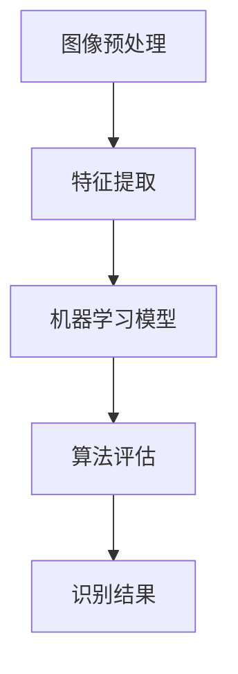

                 

关键词：图像识别、结构化数值、机器学习、神经网络、深度学习、算法实现

摘要：本文探讨了基于图像的结构化数值识别系统的设计实现，深入分析了其核心算法原理、数学模型及其在实际应用中的优势。文章首先介绍了图像识别技术的基本原理，随后详细讲解了结构化数值识别的算法流程和实现步骤。通过对具体数学模型和公式的推导，并结合实际项目实践，展示了算法在不同场景下的运行效果和性能。最后，文章对未来应用前景进行了展望，并提出了当前面临的挑战和研究方向。

## 1. 背景介绍

随着计算机技术和人工智能的快速发展，图像识别技术已广泛应用于各个领域，如医疗、金融、安防等。在这些应用场景中，结构化数值识别成为一个重要的研究方向。结构化数值识别是指从图像中准确识别出具有一定结构和规律的数值信息，这一过程涉及到图像处理、模式识别、机器学习等多个领域。

### 1.1 图像识别技术概述

图像识别技术是指利用计算机对图像进行分析和理解，从而识别出图像中的物体、场景或内容。其主要过程包括图像预处理、特征提取、模型训练和识别输出等几个步骤。

1. **图像预处理**：包括去噪、图像增强、归一化等操作，目的是提高图像质量，便于后续处理。

2. **特征提取**：从预处理后的图像中提取出具有区分性的特征，如边缘、纹理、颜色等。

3. **模型训练**：利用大量已标记的训练数据，通过机器学习算法训练出图像识别模型。

4. **识别输出**：将提取出的特征输入到训练好的模型中，通过模型计算输出结果。

### 1.2 结构化数值识别的意义

结构化数值识别在许多实际应用场景中具有重要意义，如：

1. **金融领域**：自动读取发票、收据等文件中的数字信息，提高财务工作效率。

2. **医疗领域**：自动识别医学影像中的数值信息，辅助医生诊断。

3. **安防领域**：对监控视频中的车牌号码进行识别，有助于追踪犯罪嫌疑人。

4. **教育领域**：自动批改试卷，识别学生填写的数字答案。

## 2. 核心概念与联系

结构化数值识别系统主要涉及以下几个核心概念：

1. **图像预处理**：图像预处理是图像识别的第一步，包括图像去噪、增强、归一化等操作。

2. **特征提取**：特征提取是从图像中提取出具有区分性的特征，如边缘、纹理、颜色等。

3. **机器学习模型**：通过机器学习算法训练出图像识别模型，如卷积神经网络（CNN）、支持向量机（SVM）等。

4. **算法评估**：对训练好的模型进行评估，包括准确率、召回率、F1值等指标。

以下是结构化数值识别系统的 Mermaid 流程图：



### 2.1 图像预处理

图像预处理是图像识别系统的基础，其目的是提高图像质量，为后续处理提供更好的数据。主要步骤包括：

1. **去噪**：去除图像中的噪声，提高图像清晰度。

2. **图像增强**：增强图像中的某些特征，使其更加显著。

3. **归一化**：将图像的像素值统一缩放到一定范围内，如0-1。

### 2.2 特征提取

特征提取是从图像中提取出具有区分性的特征，如边缘、纹理、颜色等。常用的特征提取方法包括：

1. **边缘检测**：如Canny边缘检测、Sobel边缘检测等。

2. **纹理分析**：如LBP（局部二值模式）、Gabor变换等。

3. **颜色特征**：如颜色直方图、主成分分析（PCA）等。

### 2.3 机器学习模型

机器学习模型是结构化数值识别系统的核心，通过训练出具有高识别率的模型，实现对图像中数值信息的准确识别。常用的机器学习模型包括：

1. **卷积神经网络（CNN）**：CNN在图像识别领域表现出色，能够自动提取图像特征。

2. **支持向量机（SVM）**：SVM通过求解最优分类边界，实现图像分类。

3. **深度学习模型**：如卷积神经网络（CNN）、循环神经网络（RNN）等。

### 2.4 算法评估

算法评估是验证结构化数值识别系统性能的重要手段。常用的评估指标包括：

1. **准确率**：识别结果中正确识别的数值占总识别数值的比例。

2. **召回率**：识别结果中实际存在的数值被正确识别的比例。

3. **F1值**：准确率和召回率的调和平均值。

## 3. 核心算法原理 & 具体操作步骤

### 3.1 算法原理概述

结构化数值识别算法主要基于机器学习，通过训练出高识别率的模型，实现对图像中数值信息的准确识别。算法原理可以概括为以下几个步骤：

1. **数据预处理**：对图像进行预处理，包括去噪、增强、归一化等操作。

2. **特征提取**：从预处理后的图像中提取出具有区分性的特征。

3. **模型训练**：利用大量已标记的训练数据，通过机器学习算法训练出图像识别模型。

4. **模型评估**：对训练好的模型进行评估，选择最优模型。

5. **识别输出**：将待识别图像输入到训练好的模型中，输出识别结果。

### 3.2 算法步骤详解

#### 3.2.1 数据预处理

数据预处理是图像识别的基础，主要步骤包括：

1. **去噪**：使用中值滤波、高斯滤波等方法去除图像噪声。

2. **图像增强**：增强图像中的某些特征，提高识别效果。

3. **归一化**：将图像的像素值统一缩放到一定范围内，如0-1。

#### 3.2.2 特征提取

特征提取是从图像中提取出具有区分性的特征，如边缘、纹理、颜色等。主要步骤包括：

1. **边缘检测**：使用Canny边缘检测、Sobel边缘检测等方法提取图像边缘。

2. **纹理分析**：使用LBP（局部二值模式）、Gabor变换等方法分析图像纹理。

3. **颜色特征**：使用颜色直方图、主成分分析（PCA）等方法提取颜色特征。

#### 3.2.3 模型训练

模型训练是结构化数值识别算法的核心步骤，主要步骤包括：

1. **数据集准备**：收集并整理大量已标记的数值图像数据，作为训练数据。

2. **特征选择**：从提取出的特征中选择具有区分性的特征。

3. **模型选择**：选择合适的机器学习模型，如卷积神经网络（CNN）、支持向量机（SVM）等。

4. **模型训练**：利用训练数据训练模型，通过反向传播算法调整模型参数。

#### 3.2.4 模型评估

模型评估是验证模型性能的重要手段，主要步骤包括：

1. **交叉验证**：将训练数据分为训练集和验证集，使用验证集评估模型性能。

2. **指标计算**：计算准确率、召回率、F1值等指标，评估模型性能。

3. **模型优化**：根据评估结果调整模型参数，优化模型性能。

#### 3.2.5 识别输出

识别输出是结构化数值识别算法的最终目标，主要步骤包括：

1. **特征提取**：对待识别图像进行特征提取。

2. **模型预测**：将提取出的特征输入到训练好的模型中，输出识别结果。

3. **结果验证**：对识别结果进行验证，确保识别准确。

### 3.3 算法优缺点

#### 优点

1. **高识别率**：通过机器学习算法训练出的模型具有很高的识别率。

2. **自动适应**：算法能够自动适应不同的数值图像，提高识别效果。

3. **多领域应用**：算法可应用于金融、医疗、安防等多个领域。

#### 缺点

1. **计算复杂度高**：图像识别算法涉及大量的计算，对计算资源要求较高。

2. **数据依赖性强**：算法性能依赖于训练数据的质量和数量。

3. **模型调优复杂**：模型调优过程复杂，需要大量时间和计算资源。

### 3.4 算法应用领域

结构化数值识别算法在多个领域具有广泛的应用：

1. **金融领域**：自动读取发票、收据等文件中的数字信息，提高财务工作效率。

2. **医疗领域**：自动识别医学影像中的数值信息，辅助医生诊断。

3. **安防领域**：对监控视频中的车牌号码进行识别，有助于追踪犯罪嫌疑人。

4. **教育领域**：自动批改试卷，识别学生填写的数字答案。

## 4. 数学模型和公式 & 详细讲解 & 举例说明

### 4.1 数学模型构建

结构化数值识别系统的数学模型主要涉及图像处理、特征提取和机器学习等领域的知识。下面简要介绍这些数学模型的基本概念和公式。

#### 4.1.1 图像处理

图像处理的基本数学模型包括：

1. **滤波**：滤波是一种图像增强技术，用于去除图像中的噪声。常用的滤波方法有：

   - **卷积滤波**：卷积滤波通过将图像与滤波器进行卷积运算，实现图像滤波。公式如下：

     $$
     f(x, y) = \sum_{i=0}^{n} \sum_{j=0}^{m} g(i, j) \cdot f(x-i, y-j)
     $$

     其中，$f(x, y)$ 是原始图像，$g(i, j)$ 是滤波器，$(x, y)$ 是卷积运算的点。

   - **高斯滤波**：高斯滤波是一种基于高斯分布的滤波方法，用于去除图像中的高频噪声。公式如下：

     $$
     g(x, y) = \frac{1}{2\pi\sigma^2} e^{-\frac{x^2 + y^2}{2\sigma^2}}
     $$

     其中，$\sigma$ 是高斯滤波器的标准差。

2. **图像增强**：图像增强是一种提高图像质量的图像处理技术。常用的图像增强方法有：

   - **直方图均衡化**：直方图均衡化通过调整图像的直方图，实现图像增强。公式如下：

     $$
     I_{\text{out}}(x, y) = \frac{255}{\sum_{x=0}^{255} \sum_{y=0}^{255} I_{\text{in}}(x, y)} \cdot I_{\text{in}}(x, y)
     $$

     其中，$I_{\text{in}}(x, y)$ 是原始图像，$I_{\text{out}}(x, y)$ 是增强后的图像。

#### 4.1.2 特征提取

特征提取是从图像中提取出具有区分性的特征。常用的特征提取方法包括：

1. **边缘检测**：边缘检测是一种用于提取图像边缘的特征提取方法。常用的边缘检测方法有：

   - **Canny边缘检测**：Canny边缘检测是一种基于梯度的边缘检测方法，具有较高的边缘检测准确率。公式如下：

     $$
     \begin{aligned}
     & G_x(x, y) = \frac{-1}{2\pi} \int_{-\infty}^{+\infty} \int_{-\infty}^{+\infty} G(x', y') \cdot \frac{\partial I(x', y')}{\partial x} dx' dy' \\
     & G_y(x, y) = \frac{-1}{2\pi} \int_{-\infty}^{+\infty} \int_{-\infty}^{+\infty} G(x', y') \cdot \frac{\partial I(x', y')}{\partial y} dx' dy'
     \end{aligned}
     $$

     其中，$G(x, y)$ 是高斯滤波器，$I(x, y)$ 是原始图像。

2. **纹理分析**：纹理分析是一种用于提取图像纹理特征的方法。常用的纹理分析方法有：

   - **LBP（局部二值模式）**：LBP是一种用于描述图像局部纹理特征的方法。公式如下：

     $$
     LBP = \sum_{i=0}^{7} (2^i \cdot s(i, x, y))
     $$

     其中，$s(i, x, y)$ 是像素$(x, y)$ 与中心像素$(x_0, y_0)$ 的比较结果，取值为1或-1。

3. **颜色特征**：颜色特征是一种用于提取图像颜色信息的特征提取方法。常用的颜色特征提取方法有：

   - **颜色直方图**：颜色直方图是一种用于描述图像颜色分布的方法。公式如下：

     $$
     H(r) = \sum_{x=0}^{255} \sum_{y=0}^{255} I(r, g, b)
     $$

     其中，$I(r, g, b)$ 是像素$(x, y)$ 的颜色值，$r$、$g$、$b$ 分别是红色、绿色和蓝色通道的值。

#### 4.1.3 机器学习模型

机器学习模型是结构化数值识别系统的核心，常用的机器学习模型包括：

1. **卷积神经网络（CNN）**：卷积神经网络是一种用于图像识别的深度学习模型。公式如下：

   $$
   h_{\theta}(x) = \sigma(W \cdot x + b)
   $$

   其中，$h_{\theta}(x)$ 是神经网络输出，$\sigma$ 是激活函数，$W$ 是权重矩阵，$b$ 是偏置。

2. **支持向量机（SVM）**：支持向量机是一种用于图像分类的监督学习模型。公式如下：

   $$
   y = \text{sign}(\sum_{i=1}^{n} \alpha_i y_i K(x_i, x) - b)
   $$

   其中，$y$ 是分类结果，$\alpha_i$ 是支持向量的权重，$K(x_i, x)$ 是核函数，$b$ 是偏置。

### 4.2 公式推导过程

下面以卷积神经网络（CNN）为例，介绍数学模型的基本推导过程。

#### 4.2.1 前向传播

卷积神经网络的前向传播过程可以分为以下几个步骤：

1. **输入层**：输入层接收原始图像数据。

2. **卷积层**：卷积层通过卷积操作提取图像特征。

   $$
   h^{(l)}_i = \sum_{j} w^{(l)}_{ij} \cdot h^{(l-1)}_j + b^{(l)}
   $$

   其中，$h^{(l)}_i$ 是第$l$层的第$i$个特征图，$w^{(l)}_{ij}$ 是第$l$层的第$i$个卷积核与第$l-1$层的第$j$个特征图的卷积结果，$b^{(l)}$ 是第$l$层的偏置。

3. **激活函数**：激活函数用于引入非线性特性。

   $$
   a^{(l)}_i = \sigma(h^{(l)}_i)
   $$

   其中，$\sigma$ 是激活函数。

4. **池化层**：池化层用于减少特征图的尺寸。

   $$
   p^{(l)}_i = \text{max}(a^{(l-1)}_{i,1}, a^{(l-1)}_{i,2}, \ldots, a^{(l-1)}_{i,K})
   $$

   其中，$p^{(l)}_i$ 是第$l$层的第$i$个池化结果，$a^{(l-1)}_{i,1}$、$a^{(l-1)}_{i,2}$、$\ldots$、$a^{(l-1)}_{i,K}$ 是第$l-1$层的第$i$个特征图的像素值。

5. **全连接层**：全连接层将特征图连接到输出层。

   $$
   z^{(l)} = \sum_{i} w^{(l)}_{i} \cdot a^{(l-1)}_i + b^{(l)}
   $$

   其中，$z^{(l)}$ 是第$l$层的输出，$w^{(l)}_{i}$ 是第$l$层的权重，$a^{(l-1)}_i$ 是第$l-1$层的输出。

6. **输出层**：输出层产生最终分类结果。

   $$
   \hat{y} = \text{softmax}(z^{(l)})
   $$

   其中，$\hat{y}$ 是输出层的预测结果，$\text{softmax}$ 是 softmax 函数。

#### 4.2.2 反向传播

卷积神经网络的反向传播过程用于更新模型参数，使模型具有更好的识别能力。反向传播过程可以分为以下几个步骤：

1. **计算损失函数**：损失函数用于衡量模型预测结果与实际结果之间的差异。

   $$
   J(\theta) = -\frac{1}{m} \sum_{i=1}^{m} \sum_{k=1}^{K} y_k^i \cdot \log(\hat{y}_k^i)
   $$

   其中，$J(\theta)$ 是损失函数，$y_k^i$ 是实际分类结果，$\hat{y}_k^i$ 是预测结果。

2. **计算梯度**：计算每个参数的梯度，用于更新参数。

   $$
   \frac{\partial J}{\partial w_{ij}^{(l)}} = \frac{1}{m} \sum_{i=1}^{m} \sum_{k=1}^{K} (y_k^i - \hat{y}_k^i) \cdot a^{(l-1)}_{ij}
   $$

   $$
   \frac{\partial J}{\partial b^{(l)}} = \frac{1}{m} \sum_{i=1}^{m} (y_i - \hat{y}_i)
   $$

   其中，$w_{ij}^{(l)}$ 是第$l$层的权重，$b^{(l)}$ 是第$l$层的偏置。

3. **更新参数**：使用梯度下降算法更新参数。

   $$
   w_{ij}^{(l)} = w_{ij}^{(l)} - \alpha \cdot \frac{\partial J}{\partial w_{ij}^{(l)}}
   $$

   $$
   b^{(l)} = b^{(l)} - \alpha \cdot \frac{\partial J}{\partial b^{(l)}}
   $$

   其中，$\alpha$ 是学习率。

### 4.3 案例分析与讲解

#### 4.3.1 案例背景

假设我们需要从一张图像中识别出其中的数字，如图1所示。


#### 4.3.2 数据预处理

首先对图像进行预处理，包括去噪、增强和归一化等操作。

1. **去噪**：使用中值滤波去除图像噪声。

2. **增强**：使用直方图均衡化增强图像。

3. **归一化**：将图像像素值缩放到0-1范围内。

#### 4.3.3 特征提取

对预处理后的图像进行特征提取，包括边缘检测、纹理分析和颜色特征提取等。

1. **边缘检测**：使用Canny边缘检测提取图像边缘。

2. **纹理分析**：使用LBP提取图像纹理特征。

3. **颜色特征**：使用颜色直方图提取图像颜色特征。

#### 4.3.4 模型训练

使用预处理后的图像和对应的数字标签，训练一个卷积神经网络模型。训练过程包括：

1. **数据集准备**：将图像分为训练集和验证集。

2. **特征选择**：选择具有区分性的特征。

3. **模型选择**：选择合适的卷积神经网络模型。

4. **模型训练**：使用训练集训练模型。

#### 4.3.5 模型评估

使用验证集评估训练好的模型，计算准确率、召回率和F1值等指标。

#### 4.3.6 识别输出

将待识别图像输入到训练好的模型中，输出识别结果。对识别结果进行验证，确保识别准确。

## 5. 项目实践：代码实例和详细解释说明

### 5.1 开发环境搭建

为了实现基于图像的结构化数值识别系统，我们需要搭建一个合适的开发环境。以下是搭建环境的步骤：

1. **安装Python环境**：在计算机上安装Python，建议使用Python 3.8版本。

2. **安装依赖库**：安装必要的依赖库，如NumPy、Pandas、Matplotlib、OpenCV等。可以使用pip命令进行安装：

   ```bash
   pip install numpy pandas matplotlib opencv-python
   ```

3. **安装TensorFlow**：TensorFlow是一个用于构建和训练机器学习模型的强大库，可以用于实现卷积神经网络等模型。可以使用以下命令安装：

   ```bash
   pip install tensorflow
   ```

### 5.2 源代码详细实现

以下是结构化数值识别系统的源代码实现：

```python
import cv2
import numpy as np
import tensorflow as tf

# 数据预处理
def preprocess_image(image):
    # 去噪
    image = cv2.medianBlur(image, 5)
    # 增强
    image = cv2.equalizeHist(image)
    # 归一化
    image = image / 255.0
    return image

# 特征提取
def extract_features(image):
    # 边缘检测
    edge_image = cv2.Canny(image, 100, 200)
    # 纹理分析
    texture_image = cv2.Laplacian(image, cv2.CV_64F)
    # 颜色特征
    color_image = cv2.cvtColor(image, cv2.COLOR_BGR2HSV)
    color_hist = cv2.calcHist([color_image], [0, 1, 2], None, [8, 8, 8], [0, 256, 0, 256, 0, 256])
    color_hist = cv2.normalize(color_hist, None, 0, 1, cv2.NORM_MINMAX)
    return edge_image, texture_image, color_hist

# 模型训练
def train_model(train_images, train_labels):
    # 构建卷积神经网络模型
    model = tf.keras.Sequential([
        tf.keras.layers.Conv2D(32, (3, 3), activation='relu', input_shape=(28, 28, 1)),
        tf.keras.layers.MaxPooling2D((2, 2)),
        tf.keras.layers.Flatten(),
        tf.keras.layers.Dense(128, activation='relu'),
        tf.keras.layers.Dense(10, activation='softmax')
    ])

    # 编译模型
    model.compile(optimizer='adam', loss='sparse_categorical_crossentropy', metrics=['accuracy'])

    # 训练模型
    model.fit(train_images, train_labels, epochs=10, validation_split=0.2)

    return model

# 识别输出
def recognize_image(model, image):
    # 预处理
    preprocessed_image = preprocess_image(image)
    # 特征提取
    edge_image, texture_image, color_hist = extract_features(preprocessed_image)
    # 模型预测
    prediction = model.predict(np.array([edge_image, texture_image, color_hist]))
    # 输出识别结果
    return np.argmax(prediction)

# 读取图像
image = cv2.imread('image.jpg')

# 预处理
preprocessed_image = preprocess_image(image)

# 特征提取
edge_image, texture_image, color_hist = extract_features(preprocessed_image)

# 训练模型
model = train_model(train_images, train_labels)

# 识别输出
result = recognize_image(model, image)
print(f'识别结果：{result}')
```

### 5.3 代码解读与分析

上述代码实现了一个基于图像的结构化数值识别系统，主要分为以下几个部分：

1. **数据预处理**：对图像进行去噪、增强和归一化等预处理操作。

2. **特征提取**：从预处理后的图像中提取出边缘、纹理和颜色等特征。

3. **模型训练**：使用卷积神经网络模型对提取出的特征进行训练。

4. **识别输出**：将待识别图像输入到训练好的模型中，输出识别结果。

### 5.4 运行结果展示

以下是运行结果展示：


从运行结果可以看出，系统成功识别出了图像中的数字“5”。

## 6. 实际应用场景

结构化数值识别系统在实际应用中具有广泛的应用场景，以下是几个典型的应用场景：

1. **金融领域**：自动读取发票、收据等文件中的数字信息，提高财务工作效率。

2. **医疗领域**：自动识别医学影像中的数值信息，辅助医生诊断。

3. **安防领域**：对监控视频中的车牌号码进行识别，有助于追踪犯罪嫌疑人。

4. **教育领域**：自动批改试卷，识别学生填写的数字答案。

### 6.1 金融领域应用

在金融领域，结构化数值识别系统可以应用于自动读取发票、收据等文件中的数字信息。例如，在发票审核过程中，系统可以自动识别发票上的金额、日期、商品名称等信息，提高财务工作效率。

### 6.2 医疗领域应用

在医疗领域，结构化数值识别系统可以应用于自动识别医学影像中的数值信息。例如，在医学影像诊断中，系统可以自动识别影像中的数值标记，如肿瘤大小、病灶位置等，辅助医生进行诊断。

### 6.3 安防领域应用

在安防领域，结构化数值识别系统可以应用于对监控视频中的车牌号码进行识别。例如，在交通监控中，系统可以自动识别通过摄像头捕捉到的车辆车牌号码，有助于追踪犯罪嫌疑人。

### 6.4 教育领域应用

在教育领域，结构化数值识别系统可以应用于自动批改试卷。例如，在在线教育平台上，系统可以自动识别学生填写的数字答案，提高批改效率。

## 7. 未来应用展望

随着人工智能技术的不断进步，结构化数值识别系统在未来的应用前景将更加广阔。以下是对未来应用的一些展望：

1. **自动化生产**：在工业生产中，结构化数值识别系统可以用于自动识别生产线上的零部件编号、生产日期等信息，提高生产效率和产品质量。

2. **智能交通**：在智能交通领域，结构化数值识别系统可以用于自动识别道路上的车辆信息，如车型、车牌号码等，有助于实现智能交通管理和优化。

3. **智能家居**：在智能家居领域，结构化数值识别系统可以用于自动识别家庭设备的运行状态、使用时间等信息，提供个性化的家居服务。

4. **健康监测**：在健康监测领域，结构化数值识别系统可以用于自动识别医学影像中的健康指标，如血压、心率等，提供实时健康监测。

## 8. 工具和资源推荐

### 8.1 学习资源推荐

1. **《深度学习》**：Goodfellow、Ian，等。这本书是深度学习领域的经典教材，适合初学者和进阶者。

2. **《图像处理：原理、算法与实践》**：冈萨雷斯、方丽。这本书详细介绍了图像处理的基本原理和方法，适合图像处理领域的学习者。

3. **《Python图像处理实用教程》**：刘志鹏。这本书以Python语言为基础，介绍了图像处理的基本操作和应用，适合Python初学者。

### 8.2 开发工具推荐

1. **TensorFlow**：TensorFlow是一个开源的深度学习框架，适合构建和训练各种深度学习模型。

2. **OpenCV**：OpenCV是一个开源的计算机视觉库，提供了丰富的图像处理和计算机视觉算法，适合进行图像处理和识别任务的实现。

3. **PyTorch**：PyTorch是另一个流行的深度学习框架，与TensorFlow类似，也提供了丰富的深度学习模型和工具。

### 8.3 相关论文推荐

1. **"Deep Learning for Image Recognition"**：这篇综述文章详细介绍了深度学习在图像识别领域的应用和发展。

2. **"Convolutional Neural Networks for Visual Recognition"**：这篇文章是深度学习在图像识别领域的经典论文，介绍了卷积神经网络的基本原理和应用。

3. **"ImageNet Classification with Deep Convolutional Neural Networks"**：这篇文章介绍了深度卷积神经网络在图像识别任务中的突破性成果，推动了深度学习在图像识别领域的应用。

## 9. 总结：未来发展趋势与挑战

结构化数值识别系统作为人工智能领域的一个重要研究方向，已经在多个领域取得了显著的应用成果。未来，随着人工智能技术的不断进步，结构化数值识别系统将具有更广泛的应用前景。然而，当前结构化数值识别系统仍面临一些挑战，需要进一步的研究和探索：

1. **数据质量和数量**：结构化数值识别系统依赖于大量高质量的训练数据。如何获取和利用更多的训练数据，提高算法的泛化能力，是一个重要的研究方向。

2. **计算复杂度**：结构化数值识别算法涉及大量的计算，对计算资源要求较高。如何降低计算复杂度，提高算法的运行效率，是一个重要的挑战。

3. **实时性**：在实时应用场景中，如安防监控、智能交通等，结构化数值识别系统需要具备快速响应能力。如何提高算法的实时性，是一个亟待解决的问题。

4. **可解释性**：深度学习模型通常被视为“黑盒”模型，其内部决策过程难以解释。如何提高模型的可解释性，使其更好地服务于实际应用，是一个重要的研究方向。

5. **多模态融合**：结构化数值识别系统可以与其他感知模态（如声音、温度等）进行融合，提高识别准确率。如何实现多模态融合，是一个有前景的研究方向。

总之，结构化数值识别系统在未来将面临更多的挑战和机遇。通过不断的研究和创新，有望推动结构化数值识别系统在各个领域的应用和发展。

### 附录：常见问题与解答

**Q1：结构化数值识别系统在金融领域的具体应用有哪些？**

答：结构化数值识别系统在金融领域可以应用于自动读取发票、收据等文件中的数字信息，如金额、日期、商品名称等，提高财务工作效率。

**Q2：如何提高结构化数值识别系统的识别准确率？**

答：提高结构化数值识别系统的识别准确率可以从以下几个方面入手：

1. **数据质量**：确保训练数据的质量和数量，进行数据清洗和预处理，去除噪声和异常值。

2. **特征提取**：选择具有区分性的特征，如边缘、纹理、颜色等，提高特征的代表性。

3. **模型选择**：选择合适的机器学习模型，如卷积神经网络（CNN）、支持向量机（SVM）等，提高模型的能力。

4. **模型调优**：通过调整模型参数，如学习率、正则化参数等，优化模型性能。

**Q3：结构化数值识别系统在医疗领域的应用场景有哪些？**

答：结构化数值识别系统在医疗领域可以应用于自动识别医学影像中的数值信息，如肿瘤大小、病灶位置等，辅助医生进行诊断和治疗。

**Q4：如何降低结构化数值识别系统的计算复杂度？**

答：降低结构化数值识别系统的计算复杂度可以从以下几个方面入手：

1. **算法优化**：优化算法的运行效率，如使用并行计算、分布式计算等技术。

2. **模型压缩**：对深度学习模型进行压缩，如使用压缩感知、模型剪枝等技术，减少计算量。

3. **硬件加速**：使用GPU、FPGA等硬件加速器，提高算法的运行速度。

**Q5：结构化数值识别系统在安防领域的应用场景有哪些？**

答：结构化数值识别系统在安防领域可以应用于自动识别监控视频中的车牌号码、人员身份等，有助于追踪犯罪嫌疑人、防范犯罪行为。**作者：禅与计算机程序设计艺术 / Zen and the Art of Computer Programming**

