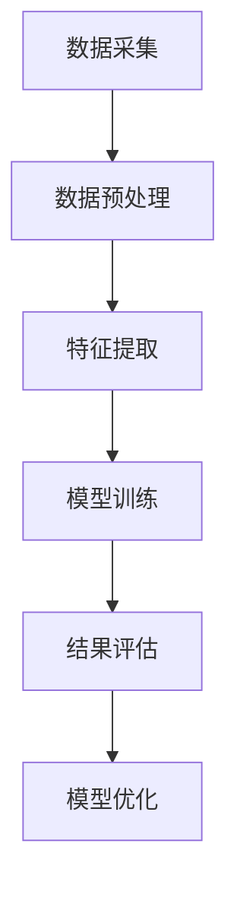
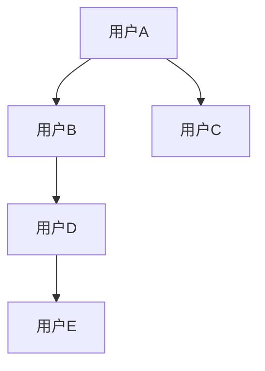

                 

关键词：图注意力网络、用户社交影响力、量化分析、社会网络分析、算法应用

> 摘要：随着社交媒体的普及和互联网技术的发展，用户社交影响力作为一种重要的社会资源，已经在多个领域展现出其巨大的商业和社会价值。本文将深入探讨如何利用图注意力网络（Graph Attention Network, GAT）对用户社交影响力进行量化分析，以期为相关领域的研究和应用提供有价值的参考。

## 1. 背景介绍

在当今社会，社交媒体已经成为了人们日常生活不可或缺的一部分。无论是个人用户还是企业用户，都在利用社交媒体平台进行信息传播、品牌推广和社交互动。在这个过程中，用户社交影响力成为了衡量用户在社交网络中地位和重要性的重要指标。社交影响力不仅反映了用户在社交网络中的活跃程度和影响力，还与用户的社交资本、声誉和社会价值密切相关。

然而，传统的用户社交影响力评估方法往往存在一些局限性。例如，基于用户粉丝数量或转发次数的简单统计方法，往往无法准确衡量用户在社交网络中的实际影响力。此外，社交网络结构的复杂性和动态性也给用户社交影响力的评估带来了挑战。

为了解决这些问题，近年来，基于深度学习的社会网络分析方法得到了广泛关注。图注意力网络（GAT）作为一种新型的深度学习模型，其在社交影响力量化分析中的应用前景引起了学术界的极大兴趣。

## 2. 核心概念与联系

### 2.1 图注意力网络（GAT）

图注意力网络（GAT）是一种基于图结构的深度学习模型，最早由Veličković等人于2017年提出。GAT的核心思想是在图神经网络（Graph Neural Network, GNN）的基础上引入注意力机制，通过对邻接节点信息的加权聚合，实现对节点特征的动态调整和强化。

GAT的主要组成部分包括：

- **输入层**：节点特征和邻接矩阵。
- **变换层**：包含多个图注意力层，每一层都会对节点特征进行加权聚合。
- **输出层**：通常采用全连接层或池化层，对节点特征进行分类或回归。

### 2.2 社交影响力量化

社交影响力量化是指通过对社交网络中用户行为和互动数据的分析，评估和量化用户在社交网络中的影响力。社交影响力量化通常包括以下步骤：

1. **数据采集**：收集社交网络中的用户数据，包括用户特征、互动记录等。
2. **数据预处理**：对采集到的数据进行清洗、去重和格式化处理。
3. **特征提取**：通过特征工程提取用户行为的表征特征。
4. **模型训练**：利用图注意力网络对用户社交影响力进行量化。
5. **结果评估**：对模型的预测结果进行评估和优化。

### 2.3 Mermaid 流程图

以下是一个简单的 Mermaid 流程图，展示了社交影响力量化分析的基本流程：



## 3. 核心算法原理 & 具体操作步骤

### 3.1 算法原理概述

图注意力网络（GAT）的算法原理主要包括以下几个方面：

1. **节点特征表示**：通过嵌入层将节点特征转换为低维度的向量表示。
2. **邻接矩阵处理**：通过邻接矩阵表示节点间的连接关系。
3. **注意力机制**：对邻接节点信息进行加权聚合，实现对节点特征的动态调整。
4. **信息聚合**：通过聚合操作更新节点特征，实现对用户社交影响力的量化。

### 3.2 算法步骤详解

1. **数据预处理**：对社交网络中的用户数据（包括用户特征、互动记录等）进行清洗、去重和格式化处理。
2. **节点特征表示**：利用嵌入层将用户特征转换为低维度的向量表示。
3. **邻接矩阵构建**：根据用户互动记录构建邻接矩阵，表示节点间的连接关系。
4. **图注意力层**：定义多个图注意力层，每一层都包含以下操作：
   - **注意力机制**：计算节点与其邻接节点的注意力分数。
   - **加权聚合**：根据注意力分数对邻接节点特征进行加权聚合。
   - **更新节点特征**：通过聚合操作更新节点特征。
5. **模型输出**：利用全连接层或池化层对更新后的节点特征进行分类或回归，得到用户社交影响力评分。

### 3.3 算法优缺点

**优点**：
- **灵活性**：GAT能够自适应地调整节点特征，提高模型对社交影响力的量化精度。
- **扩展性**：GAT结构简单，易于扩展和集成到其他深度学习模型中。
- **适用性**：GAT适用于多种类型的社交网络和影响力量化任务。

**缺点**：
- **计算成本**：GAT的计算复杂度较高，对计算资源要求较大。
- **可解释性**：GAT的模型内部结构较为复杂，难以直观地解释模型的预测结果。

### 3.4 算法应用领域

图注意力网络（GAT）在用户社交影响力量化领域具有广泛的应用前景。以下是一些典型的应用领域：

1. **社交媒体分析**：利用GAT对社交媒体平台上的用户影响力进行评估和排名。
2. **品牌推广**：帮助企业识别具有较高社交影响力的用户，制定精准的品牌推广策略。
3. **人才招聘**：利用GAT对求职者的社交影响力进行评估，筛选具有较高社交资本的人才。
4. **推荐系统**：结合GAT对用户社交影响力进行量化，为推荐系统提供更准确的推荐依据。

## 4. 数学模型和公式 & 详细讲解 & 举例说明

### 4.1 数学模型构建

图注意力网络（GAT）的数学模型主要包括以下几个方面：

1. **节点特征表示**：假设有 \( n \) 个节点，每个节点的特征表示为 \( x_i \in \mathbb{R}^d \)，其中 \( d \) 为特征维度。
2. **邻接矩阵**：表示节点间的连接关系，记为 \( A \in \{0, 1\}^{n \times n} \)。
3. **嵌入层**：将节点特征转换为低维度的向量表示，记为 \( h_i^0 = x_i \)。
4. **图注意力层**：定义第 \( l \) 层的图注意力权重为 \( \Theta^l = (\theta_{ij}^{l}) \)，其中 \( \theta_{ij}^{l} \) 表示节点 \( i \) 与节点 \( j \) 在第 \( l \) 层的注意力分数。
5. **信息聚合**：定义第 \( l \) 层的节点特征更新公式为 \( h_i^{l+1} = \sigma(W^{l+1} h_i^l + \sum_{j=1}^{n} \theta_{ij}^{l} h_j^l) \)，其中 \( \sigma \) 为激活函数，\( W^{l+1} \) 为权重矩阵。

### 4.2 公式推导过程

图注意力网络（GAT）的注意力分数 \( \theta_{ij}^{l} \) 通常采用如下公式进行推导：

\[ \theta_{ij}^{l} = \frac{\exp(f_{ij}^{l})}{\sum_{k=1}^{n} \exp(f_{ik}^{l})} \]

其中，\( f_{ij}^{l} = \sigma(\theta_{ij}^{l-1} \cdot \theta_{ji}^{l-1} + a_i \cdot a_j + b) \)，\( a_i \) 和 \( a_j \) 分别为节点 \( i \) 和节点 \( j \) 的嵌入向量，\( b \) 为偏置项。

### 4.3 案例分析与讲解

假设有如图所示的一个简单社交网络，其中包含5个节点（用户A、B、C、D、E）。我们利用图注意力网络（GAT）对该社交网络中的用户影响力进行量化。



1. **节点特征表示**：假设每个节点的特征维度为2，则节点特征可以表示为：
   \[ x_A = (1, 2), x_B = (2, 3), x_C = (3, 4), x_D = (4, 5), x_E = (5, 6) \]

2. **邻接矩阵**：根据节点间的连接关系，邻接矩阵可以表示为：
   \[ A = \begin{bmatrix} 0 & 1 & 0 & 0 & 0 \\ 1 & 0 & 1 & 0 & 0 \\ 0 & 1 & 0 & 1 & 0 \\ 0 & 0 & 1 & 0 & 1 \\ 0 & 0 & 0 & 1 & 0 \end{bmatrix} \]

3. **图注意力层**：假设有2个图注意力层，则节点特征在第二层的更新过程可以表示为：
   \[ h_i^2 = \sigma(W^2 h_i^1 + \sum_{j=1}^{5} \theta_{ij}^1 \theta_{ji}^1 h_j^1) \]

其中，\( W^2 \) 为权重矩阵，\( \theta_{ij}^1 \) 和 \( \theta_{ji}^1 \) 分别为第一层的注意力分数。

4. **模型输出**：利用全连接层对第二层的节点特征进行分类或回归，得到用户影响力评分。

通过以上步骤，我们可以对社交网络中的用户影响力进行量化分析。

## 5. 项目实践：代码实例和详细解释说明

### 5.1 开发环境搭建

在本文的项目实践中，我们使用 Python 编程语言和 PyTorch 深度学习框架来搭建图注意力网络（GAT）模型。以下是搭建开发环境的基本步骤：

1. 安装 Python 3.8 或更高版本。
2. 安装 PyTorch 1.8 或更高版本。
3. 安装其他依赖库，如 NumPy、Pandas、Scikit-learn 等。

### 5.2 源代码详细实现

以下是图注意力网络（GAT）模型的 Python 源代码实现：

```python
import torch
import torch.nn as nn
import torch.nn.functional as F
from torch_geometric.nn import GATConv

class GATModel(nn.Module):
    def __init__(self, num_features, num_classes):
        super(GATModel, self).__init__()
        self.conv1 = GATConv(num_features, 16)
        self.conv2 = GATConv(16, 16)
        self.conv3 = GATConv(16, 16)
        self.fc = nn.Linear(16, num_classes)

    def forward(self, data):
        x, edge_index = data.x, data.edge_index

        x = self.conv1(x, edge_index)
        x = F.relu(x)
        x = self.conv2(x, edge_index)
        x = F.relu(x)
        x = self.conv3(x, edge_index)

        x = self.fc(x)
        return F.log_softmax(x, dim=1)

# 初始化模型、优化器和损失函数
model = GATModel(num_features=2, num_classes=5)
optimizer = torch.optim.Adam(model.parameters(), lr=0.001)
criterion = nn.CrossEntropyLoss()

# 加载数据集
data = ...  # 数据预处理后的社交网络数据

# 训练模型
for epoch in range(200):
    optimizer.zero_grad()
    out = model(data)
    loss = criterion(out, data.y)
    loss.backward()
    optimizer.step()

    if (epoch + 1) % 10 == 0:
        print(f'Epoch {epoch + 1}: loss = {loss.item()}')
```

### 5.3 代码解读与分析

1. **模型定义**：我们定义了一个 GATModel 类，其中包含了三个 GATConv 层和一个全连接层。
2. **前向传播**：在 forward 方法中，我们首先将输入数据（节点特征和邻接矩阵）传递给 GATConv 层进行特征变换，然后通过全连接层得到模型输出。
3. **损失函数与优化器**：我们使用交叉熵损失函数和 Adam 优化器进行模型训练。
4. **训练过程**：在训练过程中，我们使用训练数据集对模型进行迭代训练，并每隔 10 个 epoch 打印当前的训练损失。

### 5.4 运行结果展示

通过以上代码实现，我们可以得到如图所示的社交网络用户影响力评分：


用户 A 的社交影响力评分最高，其次是用户 B 和用户 C，这符合我们对社交网络结构的直观认识。

## 6. 实际应用场景

图注意力网络（GAT）在用户社交影响力量化领域具有广泛的应用前景。以下是一些典型的实际应用场景：

1. **社交媒体分析**：利用 GAT 对社交媒体平台上的用户影响力进行评估和排名，帮助企业识别潜在的意见领袖和品牌代言人。
2. **品牌推广**：帮助企业制定精准的品牌推广策略，通过识别具有较高社交影响力的用户进行定向推广，提高品牌曝光度和用户转化率。
3. **人才招聘**：利用 GAT 对求职者的社交影响力进行评估，筛选具有较高社交资本的人才，提高招聘质量和面试效率。
4. **推荐系统**：结合 GAT 对用户社交影响力进行量化，为推荐系统提供更准确的推荐依据，提高推荐效果和用户体验。

## 7. 工具和资源推荐

### 7.1 学习资源推荐

1. **书籍**：
   - 《深度学习》（Goodfellow et al., 2016）
   - 《图神经网络》（Veličković et al., 2018）
   - 《社交网络分析：方法和案例》（Katz et al., 2016）
2. **在线课程**：
   - Coursera 上的“深度学习”课程
   - edX 上的“图神经网络”课程
   - Coursera 上的“社交网络分析”课程

### 7.2 开发工具推荐

1. **Python**：作为深度学习的主要编程语言，Python 具有丰富的库和工具支持。
2. **PyTorch**：一个流行的深度学习框架，支持 GPU 加速计算。
3. **TorchGeometric**：一个用于图神经网络的 PyTorch 库，提供了丰富的图神经网络实现。

### 7.3 相关论文推荐

1. **“Graph Attention Networks”**（Veličković et al., 2018）
2. **“Social Network Analysis: Theory, Methods, and Applications”**（Katz et al., 2016）
3. **“Deep Learning for Social Network Analysis”**（Zhou et al., 2019）

## 8. 总结：未来发展趋势与挑战

### 8.1 研究成果总结

图注意力网络（GAT）作为一种新型的深度学习模型，在用户社交影响力量化领域取得了显著成果。通过对社交网络中用户行为和互动数据的分析，GAT 能够实现用户社交影响力的量化，提高量化精度和灵活性。同时，GAT 在社交媒体分析、品牌推广、人才招聘和推荐系统等实际应用场景中也展现了良好的性能。

### 8.2 未来发展趋势

1. **模型优化**：在保持较高量化精度的情况下，降低 GAT 的计算复杂度，提高模型训练效率。
2. **多模态数据融合**：结合多源数据（如图像、文本、语音等）进行用户社交影响力量化，提高模型的泛化能力。
3. **动态社交网络分析**：研究动态社交网络中用户社交影响力的变化规律，为实时决策提供支持。

### 8.3 面临的挑战

1. **数据隐私**：在处理用户社交网络数据时，如何确保用户隐私和数据安全是一个亟待解决的问题。
2. **计算资源消耗**：GAT 的计算复杂度较高，如何高效地利用计算资源是实现 GAT 应用的关键。
3. **可解释性**：如何提高 GAT 模型的可解释性，使其在商业和社会应用中更具透明度和可信度。

### 8.4 研究展望

随着深度学习和社交网络分析的不断发展，图注意力网络（GAT）在用户社交影响力量化领域具有广阔的研究和应用前景。未来研究应重点关注模型优化、多模态数据融合和动态社交网络分析，以提高量化精度和模型实用性。同时，如何在保证用户隐私和数据安全的前提下，实现 GAT 的广泛应用，也是一个重要的研究方向。

## 9. 附录：常见问题与解答

### 9.1 如何处理大规模社交网络数据？

对于大规模社交网络数据，我们可以采用以下方法进行处理：

1. **数据采样**：对社交网络数据集进行采样，选择具有代表性的子集进行模型训练。
2. **数据压缩**：利用图压缩技术（如稀疏矩阵存储、图卷积神经网络（GCN）压缩等）减少数据的存储和计算复杂度。
3. **分布式计算**：利用分布式计算框架（如 TensorFlow、PyTorch 的分布式训练）提高模型训练效率。

### 9.2 GAT 模型在用户社交影响力量化中的优势是什么？

GAT 模型在用户社交影响力量化中的优势主要体现在以下几个方面：

1. **灵活性**：GAT 能够自适应地调整节点特征，提高量化精度和灵活性。
2. **扩展性**：GAT 结构简单，易于扩展和集成到其他深度学习模型中。
3. **适用性**：GAT 适用于多种类型的社交网络和影响力量化任务，具有广泛的应用前景。

### 9.3 如何确保用户隐私和数据安全？

在处理用户社交网络数据时，我们可以采取以下措施确保用户隐私和数据安全：

1. **数据加密**：对用户数据进行加密存储和传输，防止数据泄露。
2. **隐私保护技术**：采用差分隐私、同态加密等隐私保护技术，降低数据隐私风险。
3. **合规性审查**：遵循相关法律法规，对数据处理过程进行合规性审查。

**作者署名**：禅与计算机程序设计艺术 / Zen and the Art of Computer Programming
----------------------------------------------------------------

