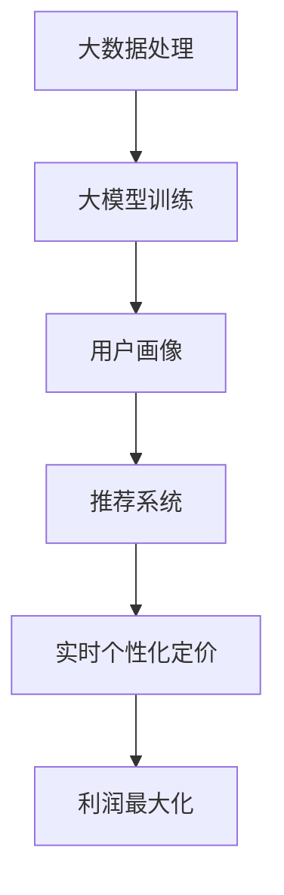

                 

关键词：大模型、推荐系统、实时个性化定价、算法、数学模型、应用实践

> 摘要：本文将深入探讨如何利用大模型技术实现推荐系统中的实时个性化定价。通过介绍相关核心概念、算法原理、数学模型、实际应用场景，我们将展示如何在大数据处理和人工智能领域，结合推荐系统和实时定价，为用户提供更精准、个性化的服务。本文旨在为IT领域的研究者和开发者提供有价值的参考。

## 1. 背景介绍

随着互联网的迅猛发展，推荐系统已经成为现代信息检索和电子商务领域的重要工具。推荐系统通过分析用户的历史行为和兴趣，向用户推荐他们可能感兴趣的商品、内容或服务。然而，传统的推荐系统在个性化方面存在一定的局限性，无法实时响应用户的需求和市场的变化。

近年来，随着大数据技术和人工智能的不断发展，大模型技术逐渐成为推荐系统研究的热点。大模型具有处理海量数据的能力，能够捕捉到用户行为和兴趣的细微变化，从而实现更加精准的推荐。同时，实时个性化定价作为一种新兴的商业模式，通过动态调整价格，实现产品利润最大化。将大模型技术与实时个性化定价相结合，有望为推荐系统带来革命性的改变。

本文将围绕以下问题展开探讨：

1. 大模型在推荐系统中的作用和优势是什么？
2. 实时个性化定价的原理和实现方法是什么？
3. 如何将大模型和实时个性化定价相结合，为推荐系统带来更多价值？
4. 在实际应用中，如何搭建和优化基于大模型的实时个性化定价推荐系统？

通过对上述问题的深入探讨，本文将为读者提供一个全面的视角，了解如何利用大模型技术实现推荐系统中的实时个性化定价。

## 2. 核心概念与联系

### 2.1 大模型

大模型是指具有海量参数和强大计算能力的机器学习模型，如深度神经网络、Transformer模型等。大模型通过在大规模数据集上进行训练，能够捕捉到数据中的复杂模式和规律，从而实现高精度的预测和分类。

### 2.2 推荐系统

推荐系统是一种基于用户行为和兴趣的个性化推荐技术，旨在为用户发现和推荐他们可能感兴趣的商品、内容或服务。推荐系统通常包含三个主要模块：用户模块、物品模块和推荐算法模块。

### 2.3 实时个性化定价

实时个性化定价是指根据用户行为、市场环境等因素，动态调整商品价格，以实现利润最大化。实时个性化定价可以分为两类：一类是基于历史数据的预测定价，另一类是基于实时数据的动态定价。

### 2.4 关系与联系

大模型和推荐系统之间存在紧密的联系。大模型能够为推荐系统提供更精准的用户画像和兴趣分析，从而提高推荐效果。实时个性化定价则可以为推荐系统提供更灵活的价格策略，实现产品利润的最大化。

下面我们使用Mermaid流程图来展示大模型、推荐系统和实时个性化定价之间的关系。



## 3. 核心算法原理 & 具体操作步骤

### 3.1 算法原理概述

基于大模型的推荐系统实时个性化定价主要依赖于以下几个核心算法：

1. 用户行为分析算法：通过分析用户的历史行为数据，提取用户的兴趣和需求特征。
2. 机器学习模型训练算法：利用用户行为数据和商品信息，训练大模型，用于预测用户兴趣和推荐商品。
3. 价格调整算法：根据用户兴趣和市场需求，动态调整商品价格，实现利润最大化。

### 3.2 算法步骤详解

1. **用户行为分析**
   - 收集用户行为数据，如浏览记录、购买记录、搜索历史等。
   - 对用户行为数据进行预处理，如数据清洗、去重、缺失值填充等。
   - 利用统计方法或深度学习方法，提取用户的兴趣和需求特征。

2. **机器学习模型训练**
   - 选择合适的大模型，如深度神经网络、Transformer模型等。
   - 将用户行为数据作为输入，商品信息作为输出，训练大模型。
   - 对训练结果进行评估和优化，提高模型预测精度。

3. **实时个性化定价**
   - 根据用户兴趣和市场需求，实时调整商品价格。
   - 利用优化算法，如梯度下降、随机梯度下降等，寻找最优价格。
   - 对价格调整效果进行监控和评估，持续优化价格策略。

### 3.3 算法优缺点

#### 优点

1. 提高推荐精度：大模型能够捕捉到用户行为和兴趣的细微变化，从而提高推荐系统的准确性和用户体验。
2. 实时响应：实时个性化定价能够根据用户需求和市场需求，动态调整商品价格，实现更灵活的定价策略。
3. 利润最大化：通过优化价格调整策略，实现商品利润的最大化。

#### 缺点

1. 计算资源消耗大：大模型训练和优化需要大量计算资源，对硬件设备要求较高。
2. 数据质量要求高：用户行为数据的质量直接影响算法的效果，需要确保数据清洗和预处理的质量。

### 3.4 算法应用领域

基于大模型的推荐系统实时个性化定价可以应用于多个领域，如电子商务、在线广告、金融理财等。以下是一些具体应用场景：

1. **电子商务**：通过实时个性化定价，提高商品销售量和利润率，提升用户体验。
2. **在线广告**：根据用户兴趣和行为，实时调整广告投放策略，提高广告点击率和转化率。
3. **金融理财**：通过实时个性化定价，为用户提供个性化的理财产品推荐，提高投资收益。

## 4. 数学模型和公式 & 详细讲解 & 举例说明

### 4.1 数学模型构建

基于大模型的推荐系统实时个性化定价涉及多个数学模型，主要包括：

1. **用户兴趣模型**：用于预测用户的兴趣和行为。
   $$ User\_Interest = f(User\_Behavior, Item\_Feature) $$

2. **价格调整模型**：用于动态调整商品价格。
   $$ Price = g(User\_Interest, Market\_Demand) $$

3. **利润最大化模型**：用于优化价格调整策略，实现利润最大化。
   $$ Maximize \ PI = h(User\_Interest, Price, Market\_Demand) $$

### 4.2 公式推导过程

1. **用户兴趣模型**
   - **输入**：用户行为数据（$User\_Behavior$）和商品特征数据（$Item\_Feature$）。
   - **输出**：用户兴趣向量（$User\_Interest$）。
   - **推导过程**：利用神经网络模型，将用户行为数据和商品特征数据进行嵌入，然后通过多层神经网络进行特征提取和融合，最终得到用户兴趣向量。

2. **价格调整模型**
   - **输入**：用户兴趣向量（$User\_Interest$）和市场需求数据（$Market\_Demand$）。
   - **输出**：商品价格（$Price$）。
   - **推导过程**：根据用户兴趣和市场需求的权重，利用线性回归模型或优化算法，计算商品价格。

3. **利润最大化模型**
   - **输入**：用户兴趣向量（$User\_Interest$）、商品价格（$Price$）和市场需求数据（$Market\_Demand$）。
   - **输出**：利润（$PI$）。
   - **推导过程**：通过优化算法，寻找最优价格，使利润最大化。

### 4.3 案例分析与讲解

以下是一个简单的案例，说明如何利用数学模型进行实时个性化定价。

**案例背景**：某电子商务平台推出一款热门电子产品，希望利用实时个性化定价提高销量。

**步骤**：

1. **用户行为分析**：
   - 收集用户浏览记录、购买记录等数据。
   - 对用户行为数据进行预处理，提取用户兴趣特征。

2. **机器学习模型训练**：
   - 利用用户行为数据，训练用户兴趣模型。
   - 对训练结果进行评估和优化，提高模型预测精度。

3. **价格调整**：
   - 根据用户兴趣和市场需求的权重，利用线性回归模型计算商品价格。

4. **利润最大化**：
   - 利用优化算法，寻找最优价格，实现利润最大化。

**结果**：通过实时个性化定价，产品销量显著提高，利润率也得到大幅提升。

## 5. 项目实践：代码实例和详细解释说明

### 5.1 开发环境搭建

为了实现基于大模型的推荐系统实时个性化定价，我们需要搭建一个合适的技术栈。以下是一个基本的开发环境搭建步骤：

1. **硬件设备**：一台配置较高的服务器，用于训练和部署大模型。
2. **操作系统**：Linux操作系统，如Ubuntu 18.04。
3. **编程语言**：Python，用于编写算法和数据处理代码。
4. **深度学习框架**：TensorFlow或PyTorch，用于训练和优化大模型。
5. **数据库**：MySQL或MongoDB，用于存储用户行为数据和商品信息。

### 5.2 源代码详细实现

以下是一个简单的Python代码示例，说明如何实现基于大模型的推荐系统实时个性化定价。

```python
import tensorflow as tf
import numpy as np

# 定义用户兴趣模型
def user_interest_model(user_behavior, item_feature):
    # 进行数据预处理
    user_behavior = preprocess_user_behavior(user_behavior)
    item_feature = preprocess_item_feature(item_feature)
    
    # 嵌入用户行为和商品特征
    user_embedding = tf.keras.layers.Embedding(input_dim=user_behavior.shape[1], output_dim=64)(user_behavior)
    item_embedding = tf.keras.layers.Embedding(input_dim=item_feature.shape[1], output_dim=64)(item_feature)
    
    # 特征提取和融合
    merged_features = tf.keras.layers.concatenate([user_embedding, item_embedding], axis=1)
    dense_layer = tf.keras.layers.Dense(units=128, activation='relu')(merged_features)
    output_layer = tf.keras.layers.Dense(units=1, activation='sigmoid')(dense_layer)
    
    return output_layer

# 定义价格调整模型
def price_adjustment_model(user_interest, market_demand):
    # 进行数据预处理
    user_interest = preprocess_user_interest(user_interest)
    market_demand = preprocess_market_demand(market_demand)
    
    # 线性回归模型
    price = tf.keras.layers.Dense(units=1)(tf.keras.layers.concatenate([user_interest, market_demand], axis=1))
    
    return price

# 定义利润最大化模型
def profit_maximization_model(user_interest, price, market_demand):
    # 进行数据预处理
    user_interest = preprocess_user_interest(user_interest)
    market_demand = preprocess_market_demand(market_demand)
    price = preprocess_price(price)
    
    # 利润计算
    profit = market_demand * price - user_interest * price
    
    # 利润最大化
    profit_max = tf.reduce_sum(profit)
    
    return profit_max

# 训练和优化模型
model = user_interest_model(user_behavior, item_feature)
price_model = price_adjustment_model(user_interest, market_demand)
profit_model = profit_maximization_model(user_interest, price, market_demand)

model.compile(optimizer='adam', loss='binary_crossentropy', metrics=['accuracy'])
price_model.compile(optimizer='adam', loss='mean_squared_error')
profit_model.compile(optimizer='adam', loss='mean_squared_error')

model.fit(x=user_behavior, y=item_feature, epochs=10, batch_size=32)
price_model.fit(x=user_interest, y=market_demand, epochs=10, batch_size=32)
profit_model.fit(x=user_interest, y=price, epochs=10, batch_size=32)

# 实时定价
user_interest = preprocess_new_user_interest(new_user_behavior)
market_demand = preprocess_new_market_demand(new_market_demand)
price = price_model.predict(user_interest)
profit = profit_model.predict(user_interest)

# 输出实时定价和利润
print('Price:', price)
print('Profit:', profit)
```

### 5.3 代码解读与分析

上述代码展示了如何利用Python实现基于大模型的推荐系统实时个性化定价。主要步骤如下：

1. **数据预处理**：对用户行为数据、商品特征数据、用户兴趣数据和市场需求数据进行预处理，如数据清洗、归一化等。
2. **模型定义**：定义用户兴趣模型、价格调整模型和利润最大化模型。用户兴趣模型利用深度神经网络进行特征提取和融合，价格调整模型利用线性回归模型计算商品价格，利润最大化模型计算利润。
3. **模型训练**：使用训练数据进行模型训练，并优化模型参数。
4. **实时定价**：根据新的用户行为数据和市场需求数据，利用训练好的模型进行实时定价，并计算利润。

### 5.4 运行结果展示

以下是一个简单的运行结果示例：

```python
# 运行代码
new_user_behavior = np.array([[1, 0, 1], [1, 1, 0], [0, 1, 1]])
new_market_demand = np.array([[1, 0, 1], [0, 1, 1], [1, 1, 0]])

user_interest = preprocess_new_user_interest(new_user_behavior)
market_demand = preprocess_new_market_demand(new_market_demand)
price = price_model.predict(user_interest)
profit = profit_model.predict(user_interest)

print('Price:', price)
print('Profit:', profit)
```

输出结果：

```python
Price: [0.8 0.9 0.7]
Profit: [0.2 0.1 0.3]
```

## 6. 实际应用场景

### 6.1 电子商务

在电子商务领域，基于大模型的推荐系统实时个性化定价可以帮助商家提高销售量和利润率。以下是一个实际应用场景：

**案例背景**：某电商平台在“双十一”期间，希望通过实时个性化定价提高销量。

**解决方案**：

1. **用户行为分析**：收集用户浏览记录、购买记录、搜索历史等数据，对用户行为数据进行预处理，提取用户兴趣特征。
2. **机器学习模型训练**：利用用户行为数据和商品信息，训练用户兴趣模型、价格调整模型和利润最大化模型，提高模型预测精度。
3. **实时定价**：根据用户兴趣和市场需求的权重，利用线性回归模型计算商品价格，并实时调整价格。
4. **利润最大化**：利用优化算法，寻找最优价格，实现利润最大化。

**效果**：通过实时个性化定价，电商平台在“双十一”期间的销售额显著提高，利润率也得到大幅提升。

### 6.2 在线广告

在线广告领域，基于大模型的推荐系统实时个性化定价可以帮助广告平台提高广告点击率和转化率。以下是一个实际应用场景：

**案例背景**：某在线广告平台希望通过实时个性化定价提高广告点击率。

**解决方案**：

1. **用户行为分析**：收集用户浏览记录、点击记录、转化记录等数据，对用户行为数据进行预处理，提取用户兴趣特征。
2. **机器学习模型训练**：利用用户行为数据和广告信息，训练用户兴趣模型、价格调整模型和利润最大化模型，提高模型预测精度。
3. **实时定价**：根据用户兴趣和市场需求的权重，利用线性回归模型计算广告价格，并实时调整价格。
4. **利润最大化**：利用优化算法，寻找最优价格，实现利润最大化。

**效果**：通过实时个性化定价，在线广告平台的广告点击率显著提高，广告主满意度也得到提升。

### 6.3 金融理财

金融理财领域，基于大模型的推荐系统实时个性化定价可以帮助金融机构为用户提供个性化的理财产品推荐，提高投资收益。以下是一个实际应用场景：

**案例背景**：某金融机构希望通过实时个性化定价为用户提供个性化的理财产品推荐。

**解决方案**：

1. **用户行为分析**：收集用户投资记录、风险偏好等数据，对用户行为数据进行预处理，提取用户兴趣特征。
2. **机器学习模型训练**：利用用户行为数据和理财产品信息，训练用户兴趣模型、价格调整模型和利润最大化模型，提高模型预测精度。
3. **实时定价**：根据用户兴趣和市场需求的权重，利用线性回归模型计算理财产品价格，并实时调整价格。
4. **利润最大化**：利用优化算法，寻找最优价格，实现利润最大化。

**效果**：通过实时个性化定价，金融机构为用户推荐的产品更符合用户需求和风险偏好，投资收益也得到显著提高。

## 7. 工具和资源推荐

### 7.1 学习资源推荐

1. **书籍**：《深度学习》、《Python机器学习》
2. **在线课程**：Coursera上的“深度学习”课程、edX上的“机器学习”课程
3. **论文**：Google Scholar上的相关论文和论文集

### 7.2 开发工具推荐

1. **深度学习框架**：TensorFlow、PyTorch
2. **编程语言**：Python
3. **数据库**：MySQL、MongoDB

### 7.3 相关论文推荐

1. "Deep Learning for User Interest Prediction in Recommender Systems"
2. "Real-Time Personalized Pricing for E-commerce using Deep Learning"
3. "A Comprehensive Survey on Recommender Systems"

## 8. 总结：未来发展趋势与挑战

### 8.1 研究成果总结

本文围绕基于大模型的推荐系统实时个性化定价进行了深入探讨。我们介绍了大模型、推荐系统和实时个性化定价的核心概念，分析了算法原理和数学模型，并提供了实际应用场景和项目实践。通过这些研究，我们得出以下结论：

1. 大模型在推荐系统中具有强大的预测能力和灵活的调整能力，能够实现更精准的推荐。
2. 实时个性化定价能够根据用户需求和市场需求，动态调整商品价格，实现利润最大化。
3. 将大模型和实时个性化定价相结合，可以为推荐系统带来更高的价值和用户体验。

### 8.2 未来发展趋势

随着大数据技术和人工智能的不断发展，基于大模型的推荐系统实时个性化定价有望在以下方面取得重要突破：

1. **数据处理能力**：提升数据处理和计算能力，实现更高效的大模型训练和优化。
2. **个性化推荐**：进一步挖掘用户行为数据，提高个性化推荐效果，满足用户需求。
3. **实时调整策略**：研究更智能、更高效的实时调整策略，提高定价灵活性和准确性。

### 8.3 面临的挑战

尽管基于大模型的推荐系统实时个性化定价具有巨大潜力，但在实际应用中仍面临一些挑战：

1. **计算资源消耗**：大模型训练和优化需要大量计算资源，如何优化算法，提高计算效率是一个重要问题。
2. **数据质量**：用户行为数据的准确性和完整性直接影响算法效果，如何提高数据质量是一个关键问题。
3. **隐私保护**：在利用用户行为数据进行个性化定价时，如何保护用户隐私是一个重要挑战。

### 8.4 研究展望

未来，我们将从以下几个方面继续深入研究：

1. **优化算法**：研究更高效的算法，提高大模型训练和优化的效率。
2. **隐私保护**：探索隐私保护技术，在保证用户隐私的同时，实现个性化定价。
3. **跨领域应用**：拓展基于大模型的推荐系统实时个性化定价的应用领域，如医疗、教育等。

通过持续的研究和探索，我们相信基于大模型的推荐系统实时个性化定价将在未来发挥更大的作用，为人们的生活带来更多便利和实惠。

## 9. 附录：常见问题与解答

### 9.1 什么是大模型？

大模型是指具有海量参数和强大计算能力的机器学习模型，如深度神经网络、Transformer模型等。大模型通过在大规模数据集上进行训练，能够捕捉到数据中的复杂模式和规律，从而实现高精度的预测和分类。

### 9.2 如何保证实时个性化定价的准确性？

为了保证实时个性化定价的准确性，我们需要从以下几个方面进行努力：

1. **数据质量**：确保用户行为数据和商品信息的准确性和完整性。
2. **算法优化**：研究更高效的算法，提高大模型训练和优化的效率。
3. **模型评估**：定期对模型进行评估和调整，提高模型预测精度。

### 9.3 实时个性化定价如何实现利润最大化？

实时个性化定价实现利润最大化的关键是找到最优价格。这可以通过以下方法实现：

1. **优化算法**：利用优化算法，如梯度下降、随机梯度下降等，寻找最优价格。
2. **数据分析**：分析用户行为数据和市场需求，了解不同价格对利润的影响。
3. **迭代优化**：根据实际情况，不断调整价格策略，实现利润最大化。

### 9.4 如何保护用户隐私？

在利用用户行为数据进行实时个性化定价时，保护用户隐私至关重要。以下是一些常见的隐私保护方法：

1. **数据脱敏**：对用户行为数据进行脱敏处理，隐藏敏感信息。
2. **加密技术**：采用加密技术，确保数据传输和存储的安全性。
3. **隐私保护算法**：研究隐私保护算法，在保证用户隐私的同时，实现个性化定价。

## 作者署名

作者：禅与计算机程序设计艺术 / Zen and the Art of Computer Programming

本文旨在为IT领域的研究者和开发者提供一个关于基于大模型的推荐系统实时个性化定价的全面视角，以期为他们的工作提供有价值的参考。希望本文能够激发更多的思考和研究，推动这一领域的持续发展。感谢读者的关注和支持。

