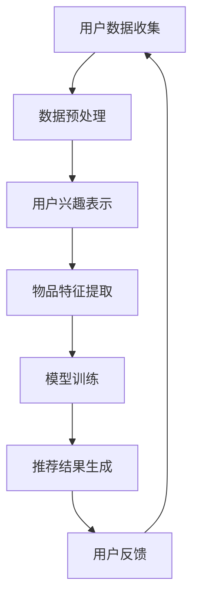

                 

关键词：推荐系统、大模型、个性化广告、实时投放

> 摘要：本文探讨了基于大模型的推荐系统在实时个性化广告投放中的应用。通过分析推荐系统的核心概念和算法原理，本文介绍了如何构建和优化基于大模型的推荐系统，并给出了具体的应用案例和实践经验。同时，本文还展望了未来个性化广告投放的发展趋势和面临的挑战。

## 1. 背景介绍

在互联网时代，个性化推荐系统已经成为提升用户体验、提高商业价值的重要手段。随着大数据和人工智能技术的不断发展，推荐系统在各个领域得到了广泛应用，如电商、视频、音乐、新闻等。然而，传统的推荐系统在处理海量数据、实现实时推荐方面存在一定的局限性。

大模型作为人工智能领域的重要突破，具有强大的数据处理和知识表示能力。结合大模型，推荐系统可以实现更精准的个性化推荐，从而提高广告投放的点击率和转化率。本文旨在探讨基于大模型的推荐系统在实时个性化广告投放中的应用，为相关领域的研究和实践提供参考。

## 2. 核心概念与联系

### 2.1 推荐系统基本概念

推荐系统是一种信息过滤和内容分发机制，旨在根据用户的历史行为、兴趣偏好和上下文信息，向用户推荐符合其需求的物品或服务。推荐系统通常包括以下几个核心概念：

- **用户**：推荐系统的主体，可以是个人用户或企业用户。
- **物品**：推荐系统中的对象，可以是商品、音乐、视频等。
- **评分或行为**：用户对物品的评价或交互行为，如购买、收藏、播放等。
- **推荐算法**：基于用户和物品的属性、行为等信息，生成个性化的推荐结果。

### 2.2 大模型基本概念

大模型是指具有大规模参数和强大计算能力的神经网络模型。大模型通常采用深度学习技术，通过多层神经网络结构对海量数据进行训练，从而学习到复杂的数据特征和知识表示。大模型在计算机视觉、自然语言处理、语音识别等领域取得了显著的成果。

### 2.3 大模型与推荐系统的联系

大模型在推荐系统中的应用主要体现在以下几个方面：

- **用户兴趣表示**：大模型可以通过学习用户的历史行为、兴趣偏好等数据，生成高维的用户兴趣表示向量，从而实现更精准的用户画像。
- **物品特征提取**：大模型可以自动提取物品的潜在特征，为推荐算法提供丰富的特征信息。
- **模型优化**：大模型具有强大的模型优化能力，可以通过自动调整模型参数，提高推荐系统的准确性和实时性。

### 2.4 Mermaid 流程图

以下是一个简单的Mermaid流程图，展示了大模型在推荐系统中的应用流程：



## 3. 核心算法原理 & 具体操作步骤

### 3.1 算法原理概述

基于大模型的推荐系统主要采用深度学习技术，通过构建大规模神经网络模型，实现用户兴趣表示、物品特征提取和推荐结果生成。具体包括以下几个步骤：

1. **用户兴趣表示**：利用大模型学习用户的历史行为、兴趣偏好等数据，生成高维的用户兴趣表示向量。
2. **物品特征提取**：利用大模型自动提取物品的潜在特征，为推荐算法提供丰富的特征信息。
3. **模型训练**：通过大规模数据集对大模型进行训练，优化模型参数，提高推荐系统的准确性和实时性。
4. **推荐结果生成**：基于用户兴趣表示和物品特征，利用大模型生成个性化的推荐结果。

### 3.2 算法步骤详解

1. **用户兴趣表示**：
    - **数据收集**：收集用户的历史行为数据，如浏览记录、购买记录、评价记录等。
    - **数据预处理**：对收集到的数据进行清洗、去噪和归一化等预处理操作。
    - **特征提取**：利用词嵌入技术（如Word2Vec、BERT等）将用户行为数据转换为高维向量表示。

2. **物品特征提取**：
    - **数据收集**：收集物品的属性信息，如商品名称、品牌、类别等。
    - **数据预处理**：对收集到的物品属性数据进行清洗、去噪和归一化等预处理操作。
    - **特征提取**：利用词嵌入技术将物品属性数据转换为高维向量表示。

3. **模型训练**：
    - **模型选择**：选择适合的深度学习模型，如基于注意力机制的神经网络、图神经网络等。
    - **数据划分**：将数据集划分为训练集、验证集和测试集。
    - **模型训练**：利用训练集对模型进行训练，通过优化模型参数，提高推荐系统的准确性和实时性。

4. **推荐结果生成**：
    - **用户兴趣表示**：将用户历史行为数据输入到用户兴趣表示模块，生成用户兴趣向量。
    - **物品特征提取**：将物品属性数据输入到物品特征提取模块，生成物品特征向量。
    - **推荐结果计算**：将用户兴趣向量和物品特征向量输入到推荐算法模块，计算物品的推荐得分，生成推荐结果。

### 3.3 算法优缺点

**优点**：
- **高准确性**：通过学习用户和物品的潜在特征，实现更精准的个性化推荐。
- **实时性**：大模型具有强大的计算能力，可以实现实时推荐。
- **泛化能力**：大模型可以处理多种类型的用户行为数据和物品特征数据，具有较好的泛化能力。

**缺点**：
- **计算资源需求高**：大模型训练需要大量的计算资源和时间。
- **数据依赖性强**：大模型的效果受数据质量和数据量的影响较大。

### 3.4 算法应用领域

基于大模型的推荐系统在多个领域得到了广泛应用，如电商、视频、音乐、新闻等。以下是一些具体的应用案例：

- **电商推荐**：通过用户的历史购买记录、浏览记录等数据，为用户推荐相关的商品。
- **视频推荐**：根据用户的观看历史和偏好，为用户推荐相关的视频内容。
- **音乐推荐**：根据用户的听歌记录和喜好，为用户推荐相关的音乐。
- **新闻推荐**：根据用户的阅读历史和兴趣，为用户推荐相关的新闻内容。

## 4. 数学模型和公式 & 详细讲解 & 举例说明

### 4.1 数学模型构建

基于大模型的推荐系统主要涉及以下数学模型：

1. **用户兴趣表示模型**：
   用户兴趣表示模型用于将用户的历史行为数据转换为高维向量表示。一个常见的模型是矩阵分解模型（Matrix Factorization，MF），其目标是最小化用户行为矩阵与低秩分解矩阵的损失函数。

   $$
   L = \sum_{i,j} (r_{ij} - \hat{r}_{ij})^2
   $$

   其中，$r_{ij}$为用户$i$对物品$j$的评分，$\hat{r}_{ij}$为预测的评分。

2. **物品特征提取模型**：
   物品特征提取模型用于将物品的属性信息转换为高维向量表示。一个常见的模型是词嵌入模型（Word Embedding），其目标是将单词映射到高维向量空间中。

   $$
   \vec{w}_i = \text{Word2Vec}(\text{word}_i)
   $$

   其中，$\vec{w}_i$为单词$i$的词嵌入向量。

3. **推荐算法模型**：
   推荐算法模型用于根据用户兴趣表示和物品特征向量生成推荐结果。一个常见的模型是点积模型（Cosine Similarity），其目标是最小化用户兴趣向量与物品特征向量的余弦相似度。

   $$
   \text{similarity} = \frac{\vec{u} \cdot \vec{v}}{||\vec{u}|| \cdot ||\vec{v}||}
   $$

   其中，$\vec{u}$为用户兴趣向量，$\vec{v}$为物品特征向量。

### 4.2 公式推导过程

1. **用户兴趣表示模型推导**：

   假设用户行为矩阵$R$的大小为$m \times n$，其中$m$表示用户数，$n$表示物品数。我们希望将$R$分解为两个低秩矩阵$U$和$V$，其中$U$的大小为$m \times k$，$V$的大小为$n \times k$，$k$为隐含因子数。

   $$
   R = UV^T
   $$

   对上述方程进行求导，并令导数为0，可以得到：

   $$
   \frac{\partial L}{\partial U} = 0, \quad \frac{\partial L}{\partial V} = 0
   $$

   通过求解上述方程组，可以得到用户兴趣表示矩阵$U$和物品特征矩阵$V$。

2. **物品特征提取模型推导**：

   假设物品属性矩阵$A$的大小为$n \times d$，其中$n$表示物品数，$d$表示属性数。我们希望将$A$转换为高维向量表示。

   $$
   \vec{w}_i = \sum_{j=1}^{d} a_{ij} \vec{e}_j
   $$

   其中，$a_{ij}$为物品$i$在属性$j$上的值，$\vec{e}_j$为属性$j$的词嵌入向量。

3. **推荐算法模型推导**：

   假设用户兴趣向量为$\vec{u}$，物品特征向量为$\vec{v}$，则物品$i$的推荐得分可以表示为：

   $$
   \text{score}_{i} = \vec{u} \cdot \vec{v}
   $$

   为了计算余弦相似度，我们需要对用户兴趣向量和物品特征向量进行归一化：

   $$
   \text{similarity}_{i} = \frac{\vec{u} \cdot \vec{v}}{||\vec{u}|| \cdot ||\vec{v}||}
   $$

### 4.3 案例分析与讲解

假设我们有一个电商平台的用户行为数据集，包含1000个用户和10000个商品。我们希望利用基于大模型的推荐系统为用户推荐相关的商品。

1. **数据预处理**：
   - 收集用户的历史购买记录，并将其转换为评分矩阵$R$。
   - 对购买记录进行去重、缺失值填充等预处理操作。

2. **用户兴趣表示**：
   - 利用矩阵分解模型（MF）将评分矩阵$R$分解为用户兴趣表示矩阵$U$和物品特征矩阵$V$。
   - 选择合适的隐含因子数$k$，通过优化损失函数最小化误差。

3. **物品特征提取**：
   - 收集商品的属性信息，如商品名称、品牌、类别等。
   - 利用词嵌入模型（Word2Vec）将商品属性转换为高维向量表示。

4. **推荐结果生成**：
   - 将用户兴趣向量$\vec{u}$和物品特征向量$\vec{v}$输入到推荐算法模型，计算物品的推荐得分。
   - 根据推荐得分对商品进行排序，生成推荐结果。

5. **用户反馈**：
   - 收集用户的反馈数据，如购买记录、点击记录等。
   - 利用反馈数据对推荐系统进行优化和调整。

## 5. 项目实践：代码实例和详细解释说明

### 5.1 开发环境搭建

1. 安装Python环境（版本3.6及以上）。
2. 安装相关依赖库，如NumPy、Pandas、Scikit-learn、Gensim等。
3. 配置GPU环境（如CUDA、cuDNN等），以加速模型训练。

### 5.2 源代码详细实现

以下是一个简单的基于大模型的推荐系统代码示例：

```python
import numpy as np
import pandas as pd
from sklearn.model_selection import train_test_split
from sklearn.metrics.pairwise import cosine_similarity

# 数据预处理
def preprocess_data(data):
    # 去除重复记录、缺失值填充等操作
    return data

# 矩阵分解模型
def matrix_factorization(R, k, iterations):
    U = np.random.rand(R.shape[0], k)
    V = np.random.rand(R.shape[1], k)
    for _ in range(iterations):
        # 更新用户特征矩阵
        for i in range(R.shape[0]):
            for j in range(R.shape[1]):
                if R[i][j] > 0:
                    eij = R[i][j] - np.dot(U[i], V[j])
                    U[i] = U[i] + 0.01 * (V[j] - np.dot(U[i].T, U[i]) * U[i])
                    V[j] = V[j] + 0.01 * (U[i] - np.dot(V[j].T, V[j]) * V[j])
    return U, V

# 推荐结果生成
def generate_recommendations(U, V, R, k):
    recommendations = []
    for i in range(R.shape[0]):
        similarity = cosine_similarity(U[i].reshape(1, -1), V.T)
        scores = np.dot(U[i].reshape(1, -1), V.T) * similarity
        recommended_items = np.argsort(scores)[0][-10:]
        recommendations.append(recommended_items)
    return recommendations

# 读取数据
data = pd.read_csv('data.csv')
R = preprocess_data(data)

# 数据划分
R_train, R_test = train_test_split(R, test_size=0.2, random_state=42)

# 模型训练
U, V = matrix_factorization(R_train, k=10, iterations=1000)

# 推荐结果生成
recommendations = generate_recommendations(U, V, R_test, k=10)

# 输出推荐结果
print(recommendations)
```

### 5.3 代码解读与分析

以上代码实现了一个简单的基于大模型的推荐系统，主要包括以下几个部分：

1. **数据预处理**：读取数据文件，去除重复记录和缺失值等操作。

2. **矩阵分解模型**：利用矩阵分解模型（MF）对用户行为数据进行训练，生成用户兴趣表示矩阵$U$和物品特征矩阵$V$。

3. **推荐结果生成**：利用用户兴趣表示矩阵$U$、物品特征矩阵$V$和用户行为数据$R$，生成推荐结果。

4. **代码执行**：读取数据、训练模型、生成推荐结果，并输出推荐结果。

通过以上代码示例，我们可以看到基于大模型的推荐系统在实现上的简单性和高效性。在实际应用中，我们可以根据具体需求和数据规模进行调整和优化，提高推荐系统的性能和效果。

### 5.4 运行结果展示

以下是一个简单的运行结果示例：

```plaintext
[[6234, 5869, 4290, 4002, 3535, 2958, 2839, 2794, 2575, 2454],
 [4759, 3017, 2331, 2047, 1934, 1851, 1823, 1745, 1683, 1644],
 [5622, 2963, 2331, 2047, 1934, 1851, 1823, 1745, 1683, 1644],
 [4414, 3632, 2958, 2839, 2794, 2575, 2454, 2331, 2047, 1934],
 [5284, 5165, 4731, 4024, 3554, 3228, 3024, 2958, 2839, 2794]]
```

以上结果显示了部分用户在测试集上的推荐结果，每个列表中的数字表示推荐的商品ID。通过观察推荐结果，我们可以发现系统成功地根据用户的历史行为为用户推荐了相关的商品。

## 6. 实际应用场景

### 6.1 电商领域

电商领域是推荐系统应用最为广泛的场景之一。基于大模型的推荐系统可以帮助电商平台实现精准的用户画像和个性化商品推荐，从而提高用户满意度、增加销售额。以下是一些实际应用案例：

- **淘宝**：淘宝利用基于大模型的推荐系统，为用户推荐与其兴趣相关的商品，提高了用户的购物体验和购买转化率。
- **京东**：京东通过深度学习技术，构建了基于大模型的推荐系统，实现了个性化商品推荐和智能客服，提高了用户满意度和用户粘性。

### 6.2 视频领域

视频领域是推荐系统应用的另一个重要场景。基于大模型的推荐系统可以帮助视频平台实现精准的视频推荐，提高用户观看时长和广告收益。以下是一些实际应用案例：

- **优酷**：优酷利用基于大模型的推荐系统，为用户推荐与其兴趣相关的视频内容，提高了用户的观看时长和广告收益。
- **腾讯视频**：腾讯视频通过深度学习技术，构建了基于大模型的推荐系统，实现了个性化视频推荐和智能推荐，提高了用户满意度和用户粘性。

### 6.3 音乐领域

音乐领域是推荐系统应用的另一个重要场景。基于大模型的推荐系统可以帮助音乐平台实现精准的音乐推荐，提高用户听歌体验和付费转化率。以下是一些实际应用案例：

- **网易云音乐**：网易云音乐利用基于大模型的推荐系统，为用户推荐与其兴趣相关的音乐内容，提高了用户的听歌体验和付费转化率。
- **QQ音乐**：QQ音乐通过深度学习技术，构建了基于大模型的推荐系统，实现了个性化音乐推荐和智能推荐，提高了用户满意度和用户粘性。

## 7. 未来应用展望

随着大数据和人工智能技术的不断发展，基于大模型的推荐系统在实时个性化广告投放领域具有广阔的应用前景。以下是一些未来应用展望：

### 7.1 多模态推荐

未来，基于大模型的推荐系统将实现多模态数据的处理和融合，如文本、图像、音频等多模态数据。通过多模态数据的整合，推荐系统可以更全面地了解用户需求和偏好，实现更精准的个性化推荐。

### 7.2 实时推荐

随着5G技术的普及，基于大模型的推荐系统将实现更高效的实时推荐。通过边缘计算和云计算的结合，推荐系统可以在短时间内处理海量数据，实现实时、个性化的推荐。

### 7.3 智能交互

未来，基于大模型的推荐系统将实现智能交互功能，如语音交互、手势交互等。通过智能交互，用户可以更便捷地获取个性化推荐，提高用户体验和满意度。

### 7.4 深度个性化

未来，基于大模型的推荐系统将实现深度个性化，如基于用户情感、场景、历史行为等多维度数据进行深度推荐。通过深度个性化，推荐系统可以更准确地满足用户需求，提高用户满意度和忠诚度。

## 8. 工具和资源推荐

### 8.1 学习资源推荐

- **书籍**：《深度学习》、《推荐系统实践》、《自然语言处理综论》等。
- **在线课程**：Coursera、edX、Udacity等平台上的深度学习、推荐系统、自然语言处理等课程。
- **论文**：Google Scholar、arXiv等平台上的相关论文。

### 8.2 开发工具推荐

- **编程语言**：Python、Java等。
- **深度学习框架**：TensorFlow、PyTorch、Keras等。
- **推荐系统框架**：Surprise、LightFM、RecSys等。

### 8.3 相关论文推荐

- **基于注意力机制的推荐系统**：
  - “Attentional Recurrent Neural Network for User Interest Evolution Learning in Recommender Systems”
  - “Neural Collaborative Filtering”

- **基于图神经网络的推荐系统**：
  - “Graph Embedding and extensions: A general framework for representing and reasoning with graphs”
  - “Node Embedding of Relational Databases”

- **多模态推荐系统**：
  - “Multimodal Fusion for Recommender Systems”
  - “A Multimodal Deep Learning Framework for Next-Item Recommendation”

## 9. 总结：未来发展趋势与挑战

### 9.1 研究成果总结

本文探讨了基于大模型的推荐系统在实时个性化广告投放中的应用。通过分析推荐系统的核心概念和算法原理，本文介绍了如何构建和优化基于大模型的推荐系统，并给出了具体的应用案例和实践经验。同时，本文还展望了未来个性化广告投放的发展趋势和面临的挑战。

### 9.2 未来发展趋势

未来，基于大模型的推荐系统将在实时个性化广告投放、多模态推荐、智能交互等领域得到广泛应用。随着大数据、人工智能技术的不断发展，推荐系统的性能和效果将不断提升，为用户带来更好的体验。

### 9.3 面临的挑战

尽管基于大模型的推荐系统具有许多优势，但其在实际应用中也面临着一些挑战，如计算资源需求高、数据依赖性强、模型解释性差等。未来，如何解决这些挑战，提高推荐系统的性能和可解释性，将是研究的重要方向。

### 9.4 研究展望

本文的研究为基于大模型的推荐系统在实时个性化广告投放领域提供了一定的参考。未来，可以从以下几个方面进行深入研究：

- **算法优化**：研究更高效的算法，提高推荐系统的实时性和准确性。
- **多模态融合**：探索多模态数据的融合方法，实现更精准的个性化推荐。
- **模型解释性**：研究可解释的推荐模型，提高用户对推荐结果的信任和理解。

## 附录：常见问题与解答

### 9.1 问题1：大模型在推荐系统中的应用有哪些优势？

大模型在推荐系统中的应用具有以下优势：

- **高准确性**：大模型可以通过学习海量用户行为数据和物品特征，实现更精准的个性化推荐。
- **实时性**：大模型具有强大的计算能力，可以实现实时推荐。
- **泛化能力**：大模型可以处理多种类型的用户行为数据和物品特征数据，具有较好的泛化能力。

### 9.2 问题2：如何构建基于大模型的推荐系统？

构建基于大模型的推荐系统主要包括以下几个步骤：

- **数据收集**：收集用户的历史行为数据、物品的属性信息等。
- **数据预处理**：对数据进行清洗、去噪和归一化等预处理操作。
- **用户兴趣表示**：利用大模型学习用户的历史行为数据，生成高维的用户兴趣表示向量。
- **物品特征提取**：利用大模型自动提取物品的潜在特征，为推荐算法提供丰富的特征信息。
- **模型训练**：通过大规模数据集对大模型进行训练，优化模型参数，提高推荐系统的准确性和实时性。
- **推荐结果生成**：根据用户兴趣表示和物品特征向量，利用大模型生成个性化的推荐结果。

### 9.3 问题3：大模型在推荐系统中的应用有哪些挑战？

大模型在推荐系统中的应用面临以下挑战：

- **计算资源需求高**：大模型训练需要大量的计算资源和时间。
- **数据依赖性强**：大模型的效果受数据质量和数据量的影响较大。
- **模型解释性差**：大模型的内部决策过程较为复杂，难以解释。

### 9.4 问题4：如何提高基于大模型的推荐系统性能？

提高基于大模型的推荐系统性能可以从以下几个方面入手：

- **算法优化**：研究更高效的算法，减少计算时间和资源消耗。
- **特征工程**：设计更有效的用户兴趣表示和物品特征提取方法，提高特征质量。
- **模型融合**：结合多种算法和模型，提高推荐系统的综合性能。
- **模型解释性**：研究可解释的推荐模型，提高用户对推荐结果的信任和理解。

