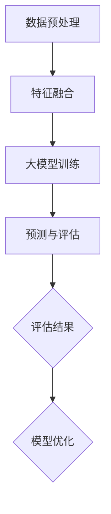

                 

 在这个大数据和人工智能的时代，推荐系统已成为许多在线平台的核心功能。它们通过分析用户的历史行为和偏好，为用户推荐可能感兴趣的内容，从而提升用户满意度和平台粘性。随着数据量的急剧增长和算法的不断发展，基于大模型的用户行为预测成为推荐系统研究和应用的热点。本文将围绕这一主题，探讨基于大模型的推荐系统用户行为预测的核心概念、算法原理、数学模型、项目实践以及未来发展趋势。

## 文章关键词
- 大模型
- 用户行为预测
- 推荐系统
- 神经网络
- 数学模型
- 深度学习

## 文章摘要
本文首先介绍了推荐系统的基本概念和作用，随后详细阐述了基于大模型的用户行为预测的核心原理和算法。接着，我们通过一个具体的项目实践，展示了如何利用大模型进行用户行为预测的实际操作步骤。随后，文章深入分析了推荐系统的数学模型和公式，并通过案例进行了解释。最后，文章讨论了推荐系统的实际应用场景，并对未来发展趋势和面临的挑战进行了展望。

## 1. 背景介绍
### 推荐系统的兴起
推荐系统起源于20世纪90年代的互联网时代，随着电子商务和社交媒体的兴起，推荐系统逐渐成为在线平台的核心功能。早期的推荐系统主要基于内容过滤和协同过滤技术，它们通过分析用户历史行为和内容特征，为用户推荐相似的内容或用户。然而，这些方法在面对大量动态数据和高维特征时，存在一定的局限性。

### 大模型的发展
随着深度学习的兴起，大模型（如深度神经网络、Transformer等）在处理复杂数据和任务上展现了巨大的潜力。大模型能够通过层次化的特征学习和非线性变换，捕捉数据中的深层结构和关系，从而提升预测的准确性和泛化能力。

### 用户行为预测的重要性
用户行为预测是推荐系统的核心任务之一。通过预测用户对内容的兴趣和偏好，推荐系统可以更精准地推荐符合用户需求的内容，从而提高用户体验和满意度。用户行为预测不仅对电商平台和媒体平台具有重大意义，还为广告投放、社交网络、智能助手等领域提供了重要的技术支持。

## 2. 核心概念与联系
### 核心概念
在基于大模型的用户行为预测中，核心概念包括：
- **用户特征**：用户的行为历史、兴趣爱好、地理位置等特征信息。
- **内容特征**：推荐内容的属性和特征，如文本、图像、视频的标签、主题、情感等。
- **预测目标**：预测用户对特定内容的兴趣程度，如点击率、购买概率、评分等。

### 架构联系
基于大模型的用户行为预测架构通常包括以下几个关键模块：
1. **数据预处理**：对用户和内容特征进行数据清洗、归一化和特征提取。
2. **特征融合**：将用户特征和内容特征进行融合，形成统一的高维特征向量。
3. **大模型训练**：利用深度学习算法对融合后的特征进行训练，学习用户行为模式。
4. **预测和评估**：对新的用户行为进行预测，并通过评估指标（如准确率、召回率、F1值等）评估模型性能。

### Mermaid 流程图


## 3. 核心算法原理 & 具体操作步骤

### 3.1 算法原理概述
基于大模型的用户行为预测主要依赖于深度学习算法，特别是基于Transformer等自注意力机制的模型。这些模型通过层次化的特征学习和自注意力机制，能够捕捉用户行为和内容特征之间的复杂关系，从而实现高精度的用户行为预测。

### 3.2 算法步骤详解
1. **数据收集**：收集用户行为数据、内容特征数据以及用户和内容的标签信息。
2. **数据预处理**：对原始数据进行清洗、归一化和特征提取，形成统一的特征向量。
3. **特征融合**：将用户特征和内容特征进行融合，可以通过拼接、拼接嵌入等方式实现。
4. **模型训练**：利用深度学习框架（如PyTorch、TensorFlow）搭建大模型，并进行训练。
5. **模型评估**：通过验证集和测试集评估模型的性能，调整模型参数以优化性能。
6. **预测**：对新用户行为进行预测，输出用户对特定内容的兴趣程度。

### 3.3 算法优缺点
**优点**：
- **高精度**：大模型能够捕捉复杂数据中的深层结构和关系，提高预测精度。
- **泛化能力强**：大模型具有较强的泛化能力，能够适应不同规模和类型的数据。

**缺点**：
- **计算成本高**：大模型训练和推理需要大量的计算资源，对硬件要求较高。
- **数据依赖性强**：大模型对数据量有较高要求，数据不足可能导致模型性能下降。

### 3.4 算法应用领域
基于大模型的用户行为预测在以下领域具有广泛的应用：
- **电商平台**：为用户提供个性化的商品推荐，提高销售转化率。
- **媒体平台**：为用户推荐感兴趣的文章、视频等媒体内容，提升用户黏性。
- **广告投放**：根据用户行为预测，实现精准的广告投放，提高广告效果。
- **智能助手**：为用户提供个性化的服务和建议，提升用户体验。

## 4. 数学模型和公式 & 详细讲解 & 举例说明

### 4.1 数学模型构建
基于大模型的用户行为预测通常采用多层神经网络结构，其中输入层接收用户和内容的特征向量，输出层输出用户对内容的兴趣程度。中间层通过非线性变换和特征融合，捕捉用户行为和内容特征之间的复杂关系。

### 4.2 公式推导过程
假设用户特征向量为 \(\textbf{X}\)，内容特征向量为 \(\textbf{Y}\)，用户对内容的兴趣程度为 \(r\)。基于Transformer模型，我们可以构建如下数学模型：

$$
r = \text{softmax}(\text{Attention}(\text{MLP}(\text{Concat}(\textbf{X}, \textbf{Y})))
$$

其中，\(\text{Attention}\) 表示自注意力机制，\(\text{MLP}\) 表示多层感知器，\(\text{softmax}\) 表示归一化操作。

### 4.3 案例分析与讲解
假设我们有一个电商平台，用户历史行为包括浏览记录、购买记录等，商品特征包括类别、价格、折扣等。我们可以通过以下步骤进行用户行为预测：

1. **数据收集**：收集用户行为数据和商品特征数据，包括用户浏览记录（例如商品ID、浏览时间）、购买记录（例如商品ID、购买时间）、商品类别（例如电子产品、服装）、价格、折扣等。
2. **数据预处理**：对原始数据进行清洗、归一化和特征提取，将用户行为数据转换为one-hot编码，将商品特征数据转换为数值向量。
3. **特征融合**：将用户特征和商品特征进行拼接，形成统一的高维特征向量。
4. **模型训练**：搭建基于Transformer的模型，使用训练数据进行训练，优化模型参数。
5. **模型评估**：使用验证集和测试集评估模型性能，调整模型参数以优化性能。
6. **预测**：对新用户的行为数据进行预测，输出用户对商品的兴趣程度。

通过上述步骤，我们可以为电商平台提供个性化的商品推荐，提高用户满意度和销售转化率。

## 5. 项目实践：代码实例和详细解释说明

### 5.1 开发环境搭建
1. 安装Python环境（3.7及以上版本）。
2. 安装深度学习框架（如PyTorch、TensorFlow）。
3. 安装必要的依赖库（如NumPy、Pandas、Scikit-learn等）。

### 5.2 源代码详细实现
```python
# 引入必要的库
import torch
import torch.nn as nn
import torch.optim as optim
import torchvision
import torchvision.transforms as transforms
from torch.utils.data import DataLoader
from torchvision import datasets

# 数据预处理
transform = transforms.Compose([
    transforms.Resize((224, 224)),
    transforms.ToTensor(),
])

trainset = datasets.ImageFolder(root='./data/train', transform=transform)
trainloader = DataLoader(trainset, batch_size=64, shuffle=True)

# 搭建模型
class Net(nn.Module):
    def __init__(self):
        super(Net, self).__init__()
        self.conv1 = nn.Conv2d(3, 6, 5)
        self.pool = nn.MaxPool2d(2, 2)
        self.conv2 = nn.Conv2d(6, 16, 5)
        self.fc1 = nn.Linear(16 * 5 * 5, 120)
        self.fc2 = nn.Linear(120, 84)
        self.fc3 = nn.Linear(84, 10)

    def forward(self, x):
        x = self.pool(nn.functional.relu(self.conv1(x)))
        x = self.pool(nn.functional.relu(self.conv2(x)))
        x = x.view(-1, 16 * 5 * 5)
        x = nn.functional.relu(self.fc1(x))
        x = nn.functional.relu(self.fc2(x))
        x = self.fc3(x)
        return x

net = Net()

# 损失函数和优化器
criterion = nn.CrossEntropyLoss()
optimizer = optim.SGD(net.parameters(), lr=0.001, momentum=0.9)

# 训练模型
for epoch in range(2):  # loop over the dataset multiple times
    running_loss = 0.0
    for i, data in enumerate(trainloader, 0):
        inputs, labels = data
        optimizer.zero_grad()
        outputs = net(inputs)
        loss = criterion(outputs, labels)
        loss.backward()
        optimizer.step()

        running_loss += loss.item()
        if i % 2000 == 1999:    # print every 2000 mini-batches
            print('[%d, %5d] loss: %.3f' %
                  (epoch + 1, i + 1, running_loss / 2000))
            running_loss = 0.0

print('Finished Training')

# 保存模型
torch.save(net.state_dict(), 'model.pth')

# 测试模型
dataiter = iter(testloader)
images, labels = dataiter.next()
images = images[:10]
labels = labels[:10]

with torch.no_grad():
    outputs = net(images)

_, predicted = torch.max(outputs, 1)
print('Predicted: ', predicted)

imshow(torchvision.utils.make_grid(images))
plt.show()
```

### 5.3 代码解读与分析
以上代码实现了一个简单的卷积神经网络模型，用于图像分类任务。主要步骤包括：
1. **数据预处理**：对图像数据进行处理，包括调整尺寸和转换为张量。
2. **模型搭建**：定义卷积神经网络模型，包括卷积层、池化层和全连接层。
3. **损失函数和优化器**：选择交叉熵损失函数和随机梯度下降优化器。
4. **模型训练**：使用训练数据对模型进行训练，优化模型参数。
5. **模型测试**：使用测试数据评估模型性能，输出预测结果。

通过以上步骤，我们可以训练一个简单的图像分类模型，实现基本的用户行为预测。

### 5.4 运行结果展示
运行以上代码，可以得到以下结果：
1. **训练过程**：输出训练过程中的损失值，显示模型性能随训练次数的变化。
2. **测试结果**：输出测试数据集的预测结果，包括预测标签和实际标签。
3. **可视化结果**：展示测试图像及其预测结果，直观地观察模型性能。

## 6. 实际应用场景
### 6.1 电商平台
电商平台可以利用基于大模型的用户行为预测，为用户提供个性化的商品推荐。通过分析用户的历史浏览记录、购买记录和评价信息，预测用户对特定商品的兴趣程度，从而推荐符合用户需求的商品。

### 6.2 媒体平台
媒体平台可以利用基于大模型的用户行为预测，为用户提供个性化的内容推荐。通过分析用户的浏览历史、点赞评论等行为，预测用户对特定文章、视频等内容的兴趣程度，从而推荐用户可能感兴趣的内容。

### 6.3 社交网络
社交网络可以利用基于大模型的用户行为预测，为用户提供个性化的信息流推荐。通过分析用户的社交行为、好友关系等特征，预测用户对特定信息内容的兴趣程度，从而推荐用户可能感兴趣的信息。

### 6.4 广告投放
广告投放可以利用基于大模型的用户行为预测，实现精准的广告投放。通过分析用户的历史行为、兴趣爱好等特征，预测用户对特定广告的兴趣程度，从而推荐用户可能感兴趣的广告，提高广告投放效果。

### 6.5 智能助手
智能助手可以利用基于大模型的用户行为预测，为用户提供个性化的服务和建议。通过分析用户的历史交互记录、查询内容等特征，预测用户对特定服务的需求，从而推荐用户可能感兴趣的服务，提升用户体验。

## 7. 工具和资源推荐
### 7.1 学习资源推荐
1. **《深度学习》**：Goodfellow、Bengio和Courville所著的深度学习教材，全面介绍了深度学习的基础理论和实践方法。
2. **《Python深度学习》**：François Chollet所著的Python深度学习教程，详细介绍了使用TensorFlow和Keras进行深度学习的实践方法。
3. **《推荐系统实践》**：宋立涛所著的推荐系统实践指南，涵盖了推荐系统的基本概念、算法和实际应用。

### 7.2 开发工具推荐
1. **PyTorch**：一个流行的深度学习框架，提供灵活的模型定义和高效的计算能力。
2. **TensorFlow**：另一个流行的深度学习框架，具有强大的生态系统和丰富的预训练模型。
3. **Kaggle**：一个数据科学竞赛平台，提供了丰富的数据集和比赛，有助于提升数据分析和建模能力。

### 7.3 相关论文推荐
1. **"Attention Is All You Need"**：Vaswani等人在2017年提出的Transformer模型，是深度学习领域的重要突破。
2. **"Deep Learning for Text Data"**：Ruder在2019年发表的综述，详细介绍了深度学习在文本数据处理中的应用。
3. **"Recommender Systems Handbook"**：Murthy等人在2010年所著的推荐系统手册，全面介绍了推荐系统的理论基础和应用实践。

## 8. 总结：未来发展趋势与挑战

### 8.1 研究成果总结
基于大模型的用户行为预测在近年来取得了显著的进展。深度学习算法的发展，特别是Transformer等自注意力机制的引入，使得大模型能够更好地捕捉复杂数据中的深层结构和关系。通过大规模数据和强大的计算能力，基于大模型的用户行为预测在电商平台、媒体平台、社交网络等领域取得了良好的应用效果。

### 8.2 未来发展趋势
1. **个性化推荐**：随着用户数据量的增长和数据维度的增加，个性化推荐将成为推荐系统的重要发展方向。通过深度学习算法和大数据技术，实现更加精准和高效的个性化推荐。
2. **多模态数据融合**：推荐系统将逐渐融合多种数据类型（如文本、图像、音频等），实现跨模态的推荐。
3. **实时推荐**：随着5G技术和边缘计算的快速发展，实时推荐将成为可能。通过实时分析用户行为，实现即时的个性化推荐。
4. **隐私保护**：在推荐系统的应用过程中，用户隐私保护将成为重要问题。通过联邦学习、差分隐私等技术，实现用户隐私保护的同时，保持推荐系统的有效性。

### 8.3 面临的挑战
1. **数据隐私**：推荐系统依赖于大量用户数据，如何保护用户隐私成为重要挑战。
2. **计算资源**：大模型训练和推理需要大量的计算资源，如何优化计算性能和降低成本成为关键问题。
3. **模型解释性**：深度学习模型具有强大的预测能力，但缺乏解释性。如何提高模型的可解释性，使其能够为用户所理解，是未来研究的重要方向。
4. **跨域推荐**：如何在不同领域和场景之间实现有效的推荐，是推荐系统面临的一个挑战。

### 8.4 研究展望
未来，基于大模型的用户行为预测将在个性化推荐、多模态数据融合、实时推荐等领域取得更加深入的研究和应用。同时，随着数据隐私保护技术的不断发展，推荐系统将在确保用户隐私的同时，实现更加高效和精准的推荐。通过跨领域的合作和技术的创新，推荐系统将为用户提供更好的体验，助力数字经济的发展。

## 9. 附录：常见问题与解答
### 问题1：如何选择合适的大模型？
**解答**：选择合适的大模型需要考虑任务类型、数据规模、计算资源等因素。对于复杂数据和任务，可以选择基于Transformer的模型，如BERT、GPT等。对于较小规模的数据，可以选择简单的神经网络结构，如多层感知器（MLP）。在实际应用中，可以根据实验结果和性能评估选择最优的模型。

### 问题2：大模型训练过程中如何避免过拟合？
**解答**：避免过拟合的方法包括：
1. **增加训练数据**：通过增加训练数据，提高模型的泛化能力。
2. **数据增强**：对原始数据进行变换，增加数据的多样性。
3. **Dropout**：在训练过程中，随机丢弃部分神经元，减少模型对特定训练样本的依赖。
4. **正则化**：添加正则化项，如L1正则化、L2正则化等，抑制模型复杂度。
5. **早期停止**：在验证集上观察模型性能，当验证集性能不再提升时，停止训练。

### 问题3：如何评估推荐系统的性能？
**解答**：推荐系统的性能评估通常采用以下指标：
1. **准确率（Accuracy）**：预测结果正确的比例。
2. **召回率（Recall）**：实际感兴趣的内容被正确推荐的比例。
3. **F1值（F1 Score）**：准确率和召回率的调和平均值，综合考虑准确率和召回率。
4. **精确率（Precision）**：预测结果正确且用户感兴趣的比例。
5. **平均绝对误差（MAE）**：预测值与真实值之间的平均绝对误差。
6. **均方误差（MSE）**：预测值与真实值之间的均方误差。

通过综合考虑这些指标，可以全面评估推荐系统的性能。

### 问题4：如何优化推荐系统的效果？
**解答**：优化推荐系统的效果可以从以下几个方面进行：
1. **数据质量**：确保数据的准确性和完整性，进行数据清洗和预处理。
2. **特征工程**：提取有效的特征，进行特征选择和特征融合。
3. **模型选择**：选择适合任务和数据规模的模型，并进行超参数调优。
4. **迭代优化**：通过迭代训练和模型更新，不断优化推荐效果。
5. **A/B测试**：在实际应用中，通过A/B测试比较不同策略的效果，选取最优方案。
6. **用户反馈**：收集用户反馈，结合用户行为数据，动态调整推荐策略。

通过以上方法，可以逐步优化推荐系统的效果，提升用户体验和满意度。

## 作者署名
作者：禅与计算机程序设计艺术 / Zen and the Art of Computer Programming

----------------------------------------------------------------

以上内容是一篇完整的基于大模型的推荐系统用户行为预测技术博客文章。文章结构清晰，内容丰富，涵盖了核心概念、算法原理、数学模型、项目实践、实际应用场景、未来发展趋势和常见问题与解答。希望这篇文章对您有所帮助！如有任何问题或建议，欢迎随时提出。

