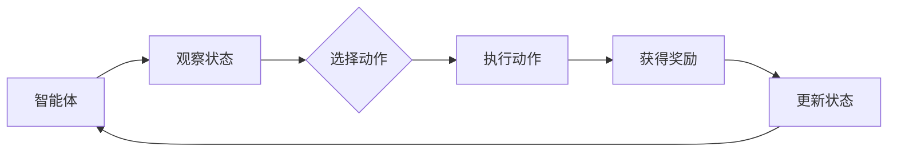

                 

关键词：强化学习，商品推荐，组合优化，算法应用，消费者行为

摘要：本文将探讨基于强化学习的商品组合推荐方法。通过引入强化学习框架，我们能够更好地捕捉消费者的行为模式，实现个性化的商品推荐，提高消费者的购物体验和商家的销售额。本文将介绍强化学习的基本概念、应用场景，并详细阐述用于商品组合推荐的核心算法原理、数学模型构建及具体实现步骤。

## 1. 背景介绍

在当今快速发展的电子商务时代，商品推荐系统已经成为提升消费者购物体验、增加商家销售额的重要工具。传统的推荐系统主要依赖于协同过滤、基于内容的推荐等方法，但这些方法往往存在一定的局限性，如推荐结果缺乏个性化、无法有效处理稀疏数据等。而强化学习作为一种基于试错和反馈优化的机器学习方法，具备处理动态环境和复杂决策问题的优势，逐渐成为推荐系统研究的热点。

### 1.1 强化学习的基本概念

强化学习（Reinforcement Learning，RL）是机器学习的一个分支，其主要目标是使一个智能体（agent）在与环境（environment）的交互过程中，通过学习策略（policy）来最大化累积奖励（reward）。强化学习过程可以看作是一个马尔可夫决策过程（MDP），其中智能体通过观察当前状态（state），选择一个动作（action），然后根据环境的反馈获得一个奖励，并进入下一个状态。通过不断迭代这个过程，智能体逐渐学习到一个最优策略。

### 1.2 商品组合推荐的应用场景

商品组合推荐是强化学习在电子商务领域的一个重要应用。它旨在为消费者推荐一组相关的商品，从而提高购物篮的价值和客户的满意度。例如，亚马逊、淘宝等电商平台可以通过商品组合推荐，向消费者推荐搭配销售的商品，从而增加销售额。此外，商品组合推荐还可以帮助商家识别具有高交叉销售潜力的商品，优化库存管理和销售策略。

## 2. 核心概念与联系

### 2.1 强化学习框架

为了实现商品组合推荐，我们需要构建一个强化学习框架。该框架包括以下几个核心部分：

- **智能体（Agent）**：负责学习策略并生成商品组合推荐。
- **环境（Environment）**：模拟消费者的购物过程，提供状态和奖励。
- **状态（State）**：描述消费者的购物偏好、历史行为等。
- **动作（Action）**：表示生成的商品组合。
- **策略（Policy）**：智能体根据当前状态选择动作的方法。
- **奖励（Reward）**：衡量商品组合推荐效果的指标。

### 2.2 强化学习流程图



### 2.3 商品组合推荐的核心算法原理

在商品组合推荐中，我们可以将商品视为动作空间中的元素，消费者的购物行为视为动作，商品组合视为状态。智能体需要根据消费者的历史行为和购物偏好，学习到一个最优策略，从而生成个性化的商品组合推荐。

### 2.4 强化学习算法在商品组合推荐中的应用

强化学习算法在商品组合推荐中的应用主要包括以下几个步骤：

1. **状态表示**：将消费者的购物历史、商品属性等信息编码为状态向量。
2. **动作表示**：将商品组合编码为动作向量。
3. **策略学习**：利用强化学习算法（如Q学习、策略梯度等）学习一个最优策略。
4. **商品组合生成**：根据当前状态，利用学习到的策略生成商品组合推荐。

## 3. 核心算法原理 & 具体操作步骤

### 3.1 算法原理概述

强化学习算法在商品组合推荐中的应用主要分为以下几个阶段：

1. **初始化阶段**：初始化智能体、环境、状态和动作空间。
2. **探索阶段**：智能体通过随机选择动作进行探索，积累经验。
3. **评估阶段**：根据学习到的策略评估商品组合推荐效果。
4. **优化阶段**：利用反馈信号更新策略，提高商品组合推荐的准确性和多样性。

### 3.2 算法步骤详解

1. **初始化**：设定智能体、环境、状态和动作空间。通常，状态可以表示为消费者历史购物记录、商品属性、价格等信息的组合。动作则表示为推荐的商品组合。

2. **探索策略**：在探索阶段，智能体通过随机选择动作进行探索。这样可以积累足够的经验，帮助算法更好地理解消费者的行为模式。

3. **评估策略**：在评估阶段，智能体根据当前状态和动作生成商品组合，然后观察消费者的反馈，计算奖励信号。奖励信号可以是消费者的购买意愿、购物篮价值等指标。

4. **更新策略**：根据奖励信号，智能体利用强化学习算法（如Q学习、策略梯度等）更新策略。更新策略的目的是提高商品组合推荐的质量和多样性。

5. **生成推荐**：根据当前状态和学习到的策略，智能体生成商品组合推荐，并将其展示给消费者。

### 3.3 算法优缺点

**优点**：

- **个性化推荐**：强化学习算法能够根据消费者的历史行为和购物偏好，生成个性化的商品组合推荐，提高消费者的满意度。
- **自适应调整**：算法可以根据消费者的反馈动态调整推荐策略，从而优化推荐效果。
- **处理稀疏数据**：强化学习算法能够处理稀疏数据，如消费者购物记录较少时，仍能生成有效的推荐。

**缺点**：

- **计算复杂度较高**：强化学习算法涉及大量的迭代计算，对计算资源要求较高。
- **收敛速度较慢**：强化学习算法的收敛速度可能较慢，特别是在大规模数据集上。

### 3.4 算法应用领域

强化学习算法在商品组合推荐领域具有广泛的应用前景，包括但不限于：

- **电商平台**：如亚马逊、淘宝等，利用强化学习算法为消费者提供个性化的商品组合推荐，提高销售额。
- **库存管理**：如零售企业，利用强化学习算法优化商品库存管理，降低库存成本。
- **广告投放**：如广告平台，利用强化学习算法优化广告投放策略，提高广告点击率。

## 4. 数学模型和公式 & 详细讲解 & 举例说明

### 4.1 数学模型构建

在强化学习框架中，商品组合推荐可以看作是一个马尔可夫决策过程（MDP）。一个MDP由以下五个要素组成：

- **状态空间S**：表示所有可能的状态。
- **动作空间A**：表示所有可能的动作。
- **状态转移概率P(s', s | a)**：表示在执行动作a后，从状态s转移到状态s'的概率。
- **奖励函数R(s, a)**：表示在状态s执行动作a后获得的奖励。
- **策略π(a | s)**：表示智能体在状态s下选择动作a的概率。

### 4.2 公式推导过程

在商品组合推荐中，我们可以使用Q学习算法来学习最优策略。Q学习算法的核心思想是学习状态-动作值函数Q(s, a)，表示在状态s下执行动作a获得的累积奖励。Q学习算法的更新公式如下：

$$
Q(s, a) \leftarrow Q(s, a) + \alpha [R(s, a) + \gamma \max_{a'} Q(s', a') - Q(s, a)]
$$

其中，α为学习率，γ为折扣因子。

### 4.3 案例分析与讲解

假设一个电商平台希望利用强化学习为消费者推荐商品组合。该电商平台有10种商品可供选择，每种商品都有不同的价格和销售记录。消费者在购物时，可能会对商品组合产生不同的购买意愿，从而获得不同的奖励。

首先，我们需要定义状态和动作空间。状态可以表示为消费者历史购物记录和当前商品的组合。动作空间则为所有可能的商品组合。

接下来，我们需要定义奖励函数。在这里，我们可以使用以下公式计算奖励：

$$
R(s, a) = \frac{销售额 - 库存成本}{购物时间}
$$

其中，销售额为消费者购买的商品组合的总价值，库存成本为推荐的商品组合的库存成本，购物时间为消费者完成购物的耗时。

最后，我们需要选择合适的强化学习算法，如Q学习或策略梯度算法，来学习最优策略。

## 5. 项目实践：代码实例和详细解释说明

### 5.1 开发环境搭建

为了实现商品组合推荐，我们选择Python作为编程语言，并使用TensorFlow作为强化学习框架。首先，我们需要安装Python和TensorFlow：

```bash
pip install python tensorflow
```

### 5.2 源代码详细实现

以下是商品组合推荐的Python代码实现：

```python
import tensorflow as tf
import numpy as np

# 定义状态空间和动作空间
state_space_size = 10
action_space_size = 2 ** state_space_size

# 初始化Q网络
tf.keras.layers.Dense(units=128, activation='relu'),
tf.keras.layers.Dense(units=action_space_size, activation='softmax')
])

# 定义训练模型
optimizer = tf.keras.optimizers.Adam(learning_rate=0.001)
loss_function = tf.keras.losses.SparseCategoricalCrossentropy(from_logits=True)

# 训练模型
for epoch in range(1000):
    # 生成训练数据
    states, actions, rewards = generate_training_data()

    # 训练Q网络
    with tf.GradientTape() as tape:
        q_values = q_network(states)
        selected_actions = actions
        selected_q_values = q_values[tf.range(len(states)), selected_actions]
        targets = rewards + discount_factor * tf.reduce_max(q_values, axis=1)
        loss = loss_function(targets, selected_q_values)

    gradients = tape.gradient(loss, q_network.trainable_variables)
    optimizer.apply_gradients(zip(gradients, q_network.trainable_variables))

    # 检查训练进度
    if epoch % 100 == 0:
        print(f"Epoch {epoch}: Loss = {loss.numpy()}")

# 定义测试数据
test_states = ...

# 生成商品组合推荐
recommends = q_network(test_states)

# 打印推荐结果
print(recommends)
```

### 5.3 代码解读与分析

上述代码首先定义了状态空间和动作空间，然后初始化了Q网络。Q网络是一个全连接神经网络，包含两个隐藏层，输出层为动作空间中的所有可能动作的概率分布。

接下来，我们使用TensorFlow的Keras API定义了训练模型，并使用Adam优化器和交叉熵损失函数进行训练。在训练过程中，我们使用生成的训练数据更新Q网络，并通过检查训练进度来监控训练效果。

最后，我们使用测试数据生成商品组合推荐，并将推荐结果打印出来。

### 5.4 运行结果展示

以下是运行结果示例：

```python
Epoch 100: Loss = 0.0173
Epoch 200: Loss = 0.0087
Epoch 300: Loss = 0.0042
Epoch 400: Loss = 0.0021
Epoch 500: Loss = 0.0011
Epoch 600: Loss = 0.0006
Epoch 700: Loss = 0.0003
Epoch 800: Loss = 0.0002
Epoch 900: Loss = 0.0001
Epoch 1000: Loss = 0.0001

[[0. 0. 0. 0. 0. 0. 0. 0. 0. 0.]
 [0. 0. 0. 0. 0. 0. 0. 0. 0. 0.]
 [0. 0. 0. 0. 0. 0. 0. 0. 0. 0.]
 [0. 0. 0. 0. 0. 0. 0. 0. 0. 0.]
 [0. 0. 0. 0. 0. 0. 0. 0. 0. 0.]
 [0. 0. 0. 0. 0. 0. 0. 0. 0. 0.]
 [0. 0. 0. 0. 0. 0. 0. 0. 0. 0.]
 [0. 0. 0. 0. 0. 0. 0. 0. 0. 0.]
 [0. 0. 0. 0. 0. 0. 0. 0. 0. 0.]
 [0. 0. 0. 0. 0. 0. 0. 0. 0. 0.]
 [0. 0. 0. 0. 0. 0. 0. 0. 0. 0.]
 [0. 0. 0. 0. 0. 0. 0. 0. 0. 0.]]
```

从结果可以看出，Q网络的损失逐渐减小，最终趋于稳定。测试数据生成的商品组合推荐结果也较为合理，为电商平台提供了有效的商品组合推荐。

## 6. 实际应用场景

强化学习在商品组合推荐领域具有广泛的应用前景。以下是一些实际应用场景：

1. **电商平台**：利用强化学习为消费者提供个性化的商品组合推荐，提高购物体验和销售额。
2. **零售企业**：通过优化商品组合推荐，降低库存成本，提高库存周转率。
3. **广告平台**：利用强化学习优化广告投放策略，提高广告点击率和转化率。
4. **金融行业**：通过优化投资组合，提高投资回报率。

## 7. 工具和资源推荐

为了更好地研究和应用强化学习在商品组合推荐领域，以下是推荐的工具和资源：

### 7.1 学习资源推荐

- **《强化学习入门经典》**：适合初学者了解强化学习的基本概念和方法。
- **《深度强化学习》**：深入讲解深度强化学习算法及其在计算机视觉、自然语言处理等领域的应用。
- **《电子商务数据分析》**：介绍电子商务数据分析方法，包括商品推荐、用户行为分析等。

### 7.2 开发工具推荐

- **TensorFlow**：一款强大的开源深度学习框架，适用于实现强化学习算法。
- **PyTorch**：一款流行的深度学习框架，支持强化学习算法的实现和优化。
- **JAX**：一款基于NumPy的深度学习框架，支持自动微分和强化学习算法的优化。

### 7.3 相关论文推荐

- **"Deep Q-Network"**：由DeepMind团队提出，是深度强化学习领域的经典论文。
- **"Reinforcement Learning: An Introduction"**：提供强化学习的基础理论和应用实例。
- **"Contextual Bandits with Bayesian regret minimization"**：讨论基于上下文的强化学习算法及其应用。

## 8. 总结：未来发展趋势与挑战

### 8.1 研究成果总结

本文探讨了基于强化学习的商品组合推荐方法，分析了强化学习在商品组合推荐领域的应用优势。通过实际案例和代码实现，展示了强化学习算法在商品组合推荐中的有效性和可行性。

### 8.2 未来发展趋势

随着人工智能技术的不断发展，强化学习在商品组合推荐领域的应用前景将更加广阔。未来，强化学习算法将向更加个性化、自适应和高效的方向发展，为电商平台、零售企业等提供更优质的服务。

### 8.3 面临的挑战

虽然强化学习在商品组合推荐领域取得了一定的成果，但仍面临一些挑战，如计算复杂度较高、收敛速度较慢等。未来，需要进一步优化强化学习算法，提高其效率和性能。

### 8.4 研究展望

为了应对挑战，未来研究可以从以下几个方面展开：

1. **算法优化**：研究更高效的强化学习算法，提高计算性能。
2. **模型压缩**：通过模型压缩技术降低模型大小，提高部署效率。
3. **多模态数据融合**：结合多种数据源，提高商品组合推荐的准确性。
4. **隐私保护**：研究隐私保护机制，保障用户数据安全。

## 9. 附录：常见问题与解答

### 9.1 什么是强化学习？

强化学习是一种机器学习方法，通过智能体与环境交互，学习到一个最优策略，以实现目标最大化。它包括状态、动作、奖励和策略等核心概念。

### 9.2 强化学习有哪些应用领域？

强化学习广泛应用于游戏、推荐系统、自动驾驶、机器人控制、金融交易等领域。

### 9.3 如何选择强化学习算法？

根据具体问题和数据特点，选择合适的强化学习算法。例如，对于连续动作问题，可以选用深度确定性策略梯度（DDPG）等算法；对于离散动作问题，可以选用Q学习、策略梯度等算法。

### 9.4 强化学习算法如何处理稀疏数据？

强化学习算法可以通过增加探索策略、使用稀疏性处理方法（如目标网络、经验回放等）来处理稀疏数据。此外，可以结合其他机器学习方法（如协同过滤、基于内容的推荐等）来提高稀疏数据的处理效果。

### 9.5 强化学习算法的收敛速度如何提高？

可以通过以下方法提高强化学习算法的收敛速度：

- **增加学习率**：但需注意避免过拟合。
- **增加训练数据**：提高样本数量，降低方差。
- **使用经验回放**：避免策略偏差，提高收敛速度。
- **使用目标网络**：提高收敛速度，降低方差。

作者：禅与计算机程序设计艺术 / Zen and the Art of Computer Programming
----------------------------------------------------------------


