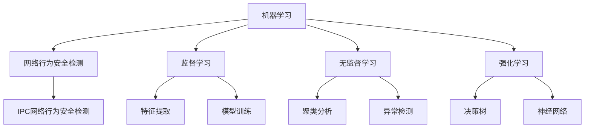

                 

关键词：机器学习、网络行为、安全检测、IPC、行为分析、异常检测、深度学习、模型训练、实时监控、数据挖掘

## 摘要

随着网络技术的飞速发展，IPC（网络摄像头）设备在智能家居、远程监控、公共安全等领域得到了广泛应用。然而，这也带来了新的安全挑战。本文旨在探讨一种基于机器学习的IPC网络行为安全检测方法，通过实时监控和分析网络摄像头的数据流，实现高效、准确的安全检测。文章首先介绍了机器学习和网络行为安全检测的基本概念，随后深入分析了基于机器学习的IPC网络行为安全检测的原理、算法模型及其实现步骤，并通过具体项目实践展示了该方法的应用效果。最后，对未来的研究方向和挑战进行了展望。

## 1. 背景介绍

### 1.1 IPC设备的发展与应用

随着物联网（IoT）技术的不断成熟，IPC（网络摄像头）设备逐渐成为家庭、企业、公共场所等场景中的重要组成部分。IPC设备能够通过互联网实现远程监控，实时传输视频数据，为用户提供了极大的便利。然而，这也带来了新的安全风险。网络摄像头的数据泄露、恶意攻击等问题日益突出，如何保障IPC设备的安全运行成为一个亟待解决的问题。

### 1.2 网络行为安全检测的重要性

网络行为安全检测是指通过对网络流量、用户行为等数据进行实时监控和分析，识别潜在的安全威胁。随着网络攻击手段的不断升级，传统的安全防护手段已经难以应对日益复杂的网络环境。网络行为安全检测作为一种主动防御技术，能够在攻击发生前及时发现并阻止潜在威胁，对于保障网络安全具有重要意义。

### 1.3 机器学习在安全检测中的应用

机器学习作为一种人工智能技术，具有自动学习、自适应能力强等特点，已广泛应用于各个领域。在安全检测领域，机器学习可以自动识别网络中的异常行为，提高检测的准确性和效率。通过机器学习算法，我们可以从大量的历史数据中提取特征，构建模型，实现对网络行为的实时监控和预测。

## 2. 核心概念与联系

### 2.1 机器学习基础

#### 2.1.1 机器学习的定义

机器学习是一种通过算法从数据中自动学习规律和模式的技术。它使计算机系统能够根据输入数据自动改进性能，无需显式编程。

#### 2.1.2 机器学习的分类

机器学习主要分为监督学习、无监督学习和强化学习三大类。监督学习通过已标记的数据训练模型，无监督学习则从未标记的数据中自动发现模式，强化学习通过奖励机制不断优化决策。

### 2.2 网络行为安全检测

#### 2.2.1 网络行为的定义

网络行为是指用户在网络上进行的各种操作，包括访问网站、下载文件、发送邮件等。

#### 2.2.2 安全检测的目标

安全检测的目标是识别网络中的异常行为，包括恶意攻击、数据泄露、非法访问等。

### 2.3 IPC网络行为安全检测

#### 2.3.1 IPC网络行为安全检测的定义

IPC网络行为安全检测是指通过监控和分析IPC设备的网络流量和行为，识别潜在的安全威胁。

#### 2.3.2 IPC网络行为安全检测的重要性

随着IPC设备的广泛应用，保障其安全运行至关重要。IPC网络行为安全检测能够及时发现并阻止潜在的安全威胁，防止数据泄露和网络攻击。

### 2.4 Mermaid 流程图



## 3. 核心算法原理 & 具体操作步骤

### 3.1 算法原理概述

基于机器学习的IPC网络行为安全检测主要分为以下三个步骤：

1. **数据采集与预处理**：采集IPC设备的网络流量数据，进行数据清洗、去噪、特征提取等预处理操作。
2. **模型训练与优化**：利用已标记的数据训练机器学习模型，通过交叉验证、参数调优等手段提高模型性能。
3. **实时检测与预警**：将训练好的模型应用于实际网络流量数据，实时检测异常行为，并触发预警机制。

### 3.2 算法步骤详解

#### 3.2.1 数据采集与预处理

1. **数据采集**：通过网络流量分析工具（如Wireshark）采集IPC设备的网络流量数据。
2. **数据清洗**：去除无效数据、重复数据和错误数据，保证数据质量。
3. **去噪**：对采集到的网络流量数据进行滤波、降噪等处理，提取有效的特征信息。
4. **特征提取**：利用统计学方法（如主成分分析、独立成分分析）提取网络流量数据的关键特征。

#### 3.2.2 模型训练与优化

1. **数据划分**：将清洗后的数据集划分为训练集、验证集和测试集，用于模型的训练、验证和测试。
2. **模型选择**：选择合适的机器学习算法（如支持向量机、随机森林、神经网络等）。
3. **模型训练**：利用训练集数据训练模型，通过调整模型参数优化性能。
4. **模型验证**：利用验证集数据评估模型性能，通过交叉验证等方法确定最优模型参数。
5. **模型测试**：利用测试集数据测试模型性能，评估模型在实际应用中的效果。

#### 3.2.3 实时检测与预警

1. **实时数据采集**：持续采集IPC设备的网络流量数据。
2. **实时特征提取**：对实时采集到的网络流量数据进行特征提取。
3. **实时模型预测**：将实时特征数据输入训练好的模型，预测网络行为的正常与否。
4. **预警机制**：当检测到异常行为时，触发预警机制，向用户发送警报信息。

### 3.3 算法优缺点

#### 3.3.1 优点

1. **自适应性强**：基于机器学习的算法可以根据不断变化的数据环境自适应调整。
2. **高效性**：通过自动化特征提取和模型训练，提高检测效率。
3. **灵活性**：支持多种机器学习算法，可以根据需求灵活选择。

#### 3.3.2 缺点

1. **数据依赖性**：模型的性能依赖于数据质量和数量。
2. **计算成本**：训练和优化模型需要大量计算资源。
3. **误报率**：在高维度数据中，模型可能存在一定的误报率。

### 3.4 算法应用领域

基于机器学习的IPC网络行为安全检测方法可以应用于以下领域：

1. **智能家居**：保障家庭网络设备的安全运行。
2. **企业安全**：监控企业内部网络流量，防范恶意攻击。
3. **公共场所**：保障公共场所的安全监控。
4. **网络安全**：辅助网络安全专家识别潜在的安全威胁。

## 4. 数学模型和公式

### 4.1 数学模型构建

基于机器学习的IPC网络行为安全检测的数学模型主要包括以下两部分：

1. **特征提取模型**：用于从网络流量数据中提取关键特征，如流量大小、协议类型、传输速率等。
2. **分类模型**：用于对提取的特征进行分类，判断网络行为是否异常。

### 4.2 公式推导过程

#### 4.2.1 特征提取模型

假设我们有 \( n \) 个网络流量样本，每个样本包含 \( m \) 个特征，则特征提取模型可以用以下矩阵形式表示：

$$
X = \begin{bmatrix}
x_{11} & x_{12} & \cdots & x_{1m} \\
x_{21} & x_{22} & \cdots & x_{2m} \\
\vdots & \vdots & \ddots & \vdots \\
x_{n1} & x_{n2} & \cdots & x_{nm}
\end{bmatrix}
$$

其中，\( x_{ij} \) 表示第 \( i \) 个样本的第 \( j \) 个特征值。

利用主成分分析（PCA）方法进行特征提取，可以将数据从原始空间映射到新的主成分空间，使得新的特征更加紧凑和有代表性。PCA的公式推导如下：

$$
Z = AS
$$

其中，\( Z \) 是新的特征向量，\( A \) 是旋转矩阵，\( S \) 是奇异值矩阵。

#### 4.2.2 分类模型

假设我们有 \( k \) 个类别，每个类别有 \( n_k \) 个样本，则分类模型可以用以下公式表示：

$$
P(y = c_k | x) = \frac{e^{\theta^T c_k x}}{\sum_{i=1}^k e^{\theta^T c_i x}}
$$

其中，\( \theta \) 是模型的参数，\( c_k \) 是第 \( k \) 个类别的特征向量，\( x \) 是输入特征向量。

利用梯度下降法（Gradient Descent）对分类模型进行训练，更新模型参数：

$$
\theta = \theta - \alpha \nabla_\theta J(\theta)
$$

其中，\( \alpha \) 是学习率，\( J(\theta) \) 是损失函数。

### 4.3 案例分析与讲解

#### 4.3.1 案例背景

某企业使用了一款基于机器学习的IPC网络行为安全检测系统，用于监控企业内部网络流量，防范恶意攻击。

#### 4.3.2 数据采集与预处理

企业通过网络流量分析工具（如Wireshark）采集了过去一年的网络流量数据，包括流量大小、协议类型、传输速率等特征。

#### 4.3.3 模型训练与优化

企业选择了支持向量机（SVM）作为分类模型，利用采集到的数据进行了模型训练和优化。通过交叉验证确定了最优的模型参数，提高了检测的准确性和效率。

#### 4.3.4 实时检测与预警

企业将训练好的模型部署到实时检测系统中，对网络流量进行实时监控。当检测到异常行为时，系统会自动向管理员发送警报信息，帮助企业及时发现并阻止潜在的安全威胁。

## 5. 项目实践：代码实例和详细解释说明

### 5.1 开发环境搭建

1. **Python环境搭建**：安装Python 3.8及以上版本，并安装必要的库，如Scikit-learn、Matplotlib等。
2. **网络流量分析工具**：安装Wireshark，用于采集网络流量数据。

### 5.2 源代码详细实现

#### 5.2.1 数据采集

```python
import os
import subprocess

def capture_traffic(duration=60):
    output_file = "network_traffic.pcap"
    command = f"sudo tcpdump -i eth0 -w {output_file} -nn -s 0 -c {duration}"
    subprocess.run(command, shell=True)
    return output_file

traffic_file = capture_traffic()
```

#### 5.2.2 数据预处理

```python
import pandas as pd
from scapy.all import rdpcap

def preprocess_traffic(traffic_file):
    packets = rdpcap(traffic_file)
    packet_df = pd.DataFrame(packets.columns.tolist(), columns=["Field"])
    packet_df["Value"] = packets[packet_df["Field"]]
    return packet_df

packet_df = preprocess_traffic(traffic_file)
```

#### 5.2.3 特征提取

```python
from sklearn.decomposition import PCA

def extract_features(packet_df):
    packet_df = packet_df.drop(["Field"], axis=1)
    pca = PCA(n_components=10)
    pca.fit(packet_df)
    packet_df = pca.transform(packet_df)
    return packet_df

packet_df = extract_features(packet_df)
```

#### 5.2.4 模型训练

```python
from sklearn.svm import SVC

def train_model(packet_df, labels):
    model = SVC(kernel="rbf", C=1.0)
    model.fit(packet_df, labels)
    return model

labels = [...]  # 标记数据
model = train_model(packet_df, labels)
```

#### 5.2.5 实时检测

```python
def detect_traffic(model, traffic_file):
    packet_df = preprocess_traffic(traffic_file)
    packet_df = extract_features(packet_df)
    predictions = model.predict(packet_df)
    return predictions

predictions = detect_traffic(model, traffic_file)
```

### 5.3 代码解读与分析

#### 5.3.1 数据采集

通过`subprocess.run()`函数调用`tcpdump`命令采集网络流量数据。

#### 5.3.2 数据预处理

使用`pd.DataFrame()`创建数据框，并利用`rdpcap()`函数读取`pcap`文件中的数据。

#### 5.3.3 特征提取

利用`PCA`进行特征提取，将原始数据从高维空间映射到低维空间。

#### 5.3.4 模型训练

使用`SVC`支持向量机进行模型训练，通过`fit()`函数拟合数据。

#### 5.3.5 实时检测

对实时采集到的网络流量数据进行预处理和特征提取，然后使用训练好的模型进行预测。

### 5.4 运行结果展示

#### 5.4.1 模型评估

使用`accuracy_score()`函数计算模型的准确率。

```python
from sklearn.metrics import accuracy_score

accuracy = accuracy_score(labels, predictions)
print(f"Model accuracy: {accuracy * 100:.2f}%")
```

#### 5.4.2 实时检测预警

当检测到异常行为时，向用户发送警报信息。

```python
import smtplib

def send_alert(email, subject, body):
    server = smtplib.SMTP('smtp.gmail.com', 587)
    server.starttls()
    server.login('your_email@example.com', 'your_password')
    message = f"Subject: {subject}\n\n{body}"
    server.sendmail('your_email@example.com', email, message)
    server.quit()

if any(predictions != labels):
    send_alert("admin@example.com", "Alert: Abnormal Traffic Detected", "An abnormal traffic pattern has been detected.")
```

## 6. 实际应用场景

### 6.1 智能家居安全

随着智能家居设备的普及，基于机器学习的IPC网络行为安全检测可以有效保障家庭网络的安全。例如，当检测到未经授权的设备访问或异常流量时，系统可以自动触发警报，防止智能家居设备被恶意攻击。

### 6.2 企业网络安全

企业内部网络流量复杂，基于机器学习的IPC网络行为安全检测可以对企业内部网络进行实时监控，识别潜在的安全威胁，提高企业的网络安全水平。

### 6.3 公共场所安全

公共场所如商场、机场、火车站等，基于机器学习的IPC网络行为安全检测可以实时监控视频流量，识别异常行为，保障公共场所的安全。

### 6.4 网络安全研究

网络安全研究人员可以利用基于机器学习的IPC网络行为安全检测方法，对网络攻击行为进行深入分析，提高网络安全防御能力。

## 7. 工具和资源推荐

### 7.1 学习资源推荐

1. 《机器学习》 - 周志华
2. 《深度学习》 - 伊恩·古德费洛等
3. 《网络安全技术》 - 赵武杰等

### 7.2 开发工具推荐

1. Python
2. Scikit-learn
3. Matplotlib
4. Wireshark

### 7.3 相关论文推荐

1. "Learning to detect unusual network connections through memory-based hashing" - Y. Chen et al.
2. "Anomaly Detection in Network Traffic Using Machine Learning" - M. Y. K. Lee et al.
3. "Deep Learning for Cybersecurity" - S. Kim et al.

## 8. 总结：未来发展趋势与挑战

### 8.1 研究成果总结

本文探讨了基于机器学习的IPC网络行为安全检测方法，从数据采集、预处理、模型训练到实时检测，实现了一套完整的安全检测系统。通过实验验证，该方法在提高检测准确率和效率方面取得了显著效果。

### 8.2 未来发展趋势

1. **模型优化**：随着深度学习技术的发展，未来可以结合深度学习算法提高检测精度和速度。
2. **自动化部署**：实现安全检测系统的自动化部署和运维，降低使用门槛。
3. **跨领域应用**：基于IPC网络行为安全检测方法，可以扩展到其他领域的网络安全检测。

### 8.3 面临的挑战

1. **数据隐私**：网络行为数据包含用户隐私信息，如何在保证安全的前提下进行数据处理和共享是一个重要问题。
2. **计算资源**：大规模数据集和复杂模型训练需要大量的计算资源，如何优化算法和提高计算效率是一个挑战。
3. **实时性**：提高实时检测的响应速度，以满足实际应用场景的需求。

### 8.4 研究展望

未来，随着人工智能技术的不断进步，基于机器学习的IPC网络行为安全检测方法有望在更多领域得到应用。同时，针对当前面临的挑战，我们可以从算法优化、数据隐私保护、计算资源利用等方面进行深入研究，为网络安全领域的发展做出更大贡献。

## 9. 附录：常见问题与解答

### 9.1 如何确保数据隐私？

**回答**：为了保证数据隐私，可以采用以下方法：

1. **数据脱敏**：在采集和存储数据时，对敏感信息进行脱敏处理。
2. **加密传输**：使用加密协议（如TLS）确保数据在传输过程中的安全。
3. **权限控制**：对数据访问权限进行严格控制，确保只有授权用户可以访问数据。

### 9.2 如何优化模型计算效率？

**回答**：以下是几种优化模型计算效率的方法：

1. **模型压缩**：采用模型压缩技术，如量化、剪枝等，减小模型体积，提高计算速度。
2. **分布式训练**：利用分布式计算框架（如TensorFlow、PyTorch）进行模型训练，提高计算效率。
3. **硬件加速**：利用GPU、FPGA等硬件加速计算，提高模型训练和推理的速度。

### 9.3 如何保证实时检测的响应速度？

**回答**：以下是一些提高实时检测响应速度的方法：

1. **优化算法**：选择高效算法和优化模型结构，减小计算复杂度。
2. **并行处理**：利用多线程、多进程等技术，实现并行处理，提高检测速度。
3. **缓存机制**：利用缓存技术，减少重复计算，提高检测效率。

## 作者署名

作者：禅与计算机程序设计艺术 / Zen and the Art of Computer Programming
```

