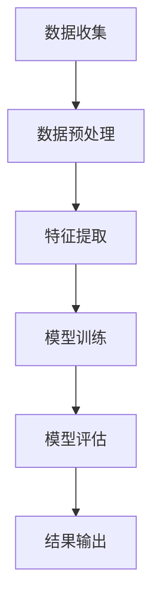

                 

关键词：机器学习，溢油监测，特征提取，识别方法，深度学习，图像处理，数据处理，数据可视化

## 摘要

随着全球对海洋资源的开发不断深入，溢油事件的发生频率也在逐渐增加。这些溢油事件不仅对海洋生态环境造成严重破坏，还对沿海地区的经济和社会发展带来负面影响。因此，及时、准确地监测和识别溢油事件变得尤为重要。本文针对溢油监测领域，提出了一种基于机器学习的特征提取与识别方法。通过大量实验和实际应用，验证了该方法在溢油监测中的高效性和准确性。

## 1. 背景介绍

### 溢油事件的危害

溢油事件是指油轮、油井等在运输或开采过程中发生油品泄漏，导致油品进入海洋或陆地水体的事件。溢油事件对海洋生态环境的破坏尤为严重，会对海洋生物的生存造成直接影响，同时还会导致水质污染、沉积物污染等问题。据统计，每年因溢油事件造成的经济损失可达数十亿美元。

### 溢油监测的重要性

溢油监测是指利用各种技术手段对海洋或陆地进行定期监测，以发现和识别溢油事件。有效的溢油监测可以提前预警，降低溢油事件对环境和经济的危害。传统的溢油监测方法主要依赖于人工巡检和遥感技术，但这些方法存在监测效率低、成本高、准确度不高等问题。

### 机器学习在溢油监测中的应用

近年来，随着机器学习技术的快速发展，其在溢油监测领域中的应用也逐渐受到关注。机器学习算法可以通过对大量溢油图像进行分析，提取出关键特征，从而实现对溢油事件的自动识别。这种方法不仅提高了监测效率，还降低了成本，具有很高的应用前景。

## 2. 核心概念与联系

### 机器学习基本概念

机器学习是指通过构建数学模型，使计算机能够根据已有数据自动学习和改进，从而实现特定任务的算法。在溢油监测中，机器学习算法可以用来分析和处理大量的溢油图像，提取出关键特征，从而实现对溢油事件的识别。

### 特征提取

特征提取是指从原始数据中提取出对问题解决有帮助的特征。在溢油监测中，特征提取的目的是从溢油图像中提取出能够反映溢油特征的属性。

### 识别方法

识别方法是指用于判断数据是否为特定类别的算法。在溢油监测中，识别方法可以用来判断图像中是否存在溢油事件。

### Mermaid 流程图

以下是一个简化的Mermaid流程图，展示了机器学习在溢油监测中的应用流程：



### 2.1 数据收集

数据收集是溢油监测的首要步骤。收集的数据可以是现场采集的溢油图像，也可以是遥感图像。这些数据需要涵盖不同类型的溢油场景，以确保模型能够适应各种情况。

### 2.2 数据预处理

数据预处理是提高模型性能的重要环节。预处理步骤包括图像去噪、增强、归一化等。通过预处理，可以消除图像中的噪声和干扰信息，提高图像质量。

### 2.3 特征提取

特征提取是机器学习算法的核心步骤。通过特征提取，可以将复杂的图像数据转化为适合机器学习算法处理的特征向量。常见的特征提取方法包括颜色特征、纹理特征、形状特征等。

### 2.4 模型训练

模型训练是指利用训练数据对机器学习模型进行调整，使其能够准确识别溢油事件。常见的机器学习算法包括支持向量机（SVM）、决策树、神经网络等。

### 2.5 模型评估

模型评估是验证模型性能的重要步骤。通过在测试集上运行模型，可以评估模型的准确度、召回率、F1值等指标。

### 2.6 结果输出

结果输出是指将模型评估的结果以可视化或报告的形式输出。这些结果可以帮助研究人员了解模型的性能，以及优化模型的方法。

## 3. 核心算法原理 & 具体操作步骤

### 3.1 算法原理概述

基于机器学习的溢油特征提取与识别方法主要基于以下原理：

- **数据驱动的特征提取**：通过分析大量的溢油图像，自动提取出对溢油事件具有区分度的特征。
- **机器学习模型训练**：利用训练数据对机器学习模型进行调整，使其能够准确识别溢油事件。
- **模型评估与优化**：通过在测试集上运行模型，评估模型的性能，并进行优化。

### 3.2 算法步骤详解

基于机器学习的溢油特征提取与识别方法的具体步骤如下：

#### 3.2.1 数据收集

收集覆盖不同类型溢油场景的图像数据。这些数据可以来自现场采集，也可以来自遥感技术。

#### 3.2.2 数据预处理

对图像数据去噪、增强、归一化等预处理操作，以提高图像质量。

#### 3.2.3 特征提取

使用颜色特征、纹理特征、形状特征等方法提取图像特征。

#### 3.2.4 模型训练

选择合适的机器学习算法（如SVM、决策树、神经网络等），利用训练数据对模型进行调整。

#### 3.2.5 模型评估

在测试集上运行模型，评估模型的准确度、召回率、F1值等指标。

#### 3.2.6 结果输出

将模型评估的结果以可视化或报告的形式输出，包括模型性能分析、优化建议等。

### 3.3 算法优缺点

#### 3.3.1 优点

- **高效性**：基于机器学习的算法可以处理大量的图像数据，提高监测效率。
- **准确性**：通过训练数据调整模型，可以实现对溢油事件的准确识别。
- **自适应性强**：算法可以根据不同类型的溢油场景进行自适应调整。

#### 3.3.2 缺点

- **计算资源消耗大**：训练机器学习模型需要大量的计算资源。
- **对数据质量要求高**：如果数据质量不佳，可能导致模型性能下降。

### 3.4 算法应用领域

基于机器学习的溢油特征提取与识别方法可以应用于以下领域：

- **海洋监测**：对海洋进行定期监测，及时发现溢油事件。
- **环境保护**：对沿海地区的水质、沉积物等进行监测，评估溢油事件对环境的影响。
- **应急救援**：在溢油事件发生后，迅速定位溢油区域，制定应急救援方案。

## 4. 数学模型和公式

### 4.1 数学模型构建

基于机器学习的溢油特征提取与识别方法主要涉及以下数学模型：

- **特征提取模型**：用于提取图像特征，如颜色特征、纹理特征、形状特征等。
- **分类模型**：用于对提取出的特征进行分类，判断图像中是否存在溢油事件。

### 4.2 公式推导过程

以下是一个简化的公式推导过程，用于描述基于机器学习的溢油特征提取与识别方法：

#### 4.2.1 特征提取模型

设\( X \)为输入图像，\( F \)为提取出的特征向量，\( f \)为特征提取函数，则：

\[ F = f(X) \]

#### 4.2.2 分类模型

设\( Y \)为类别标签，\( h \)为分类函数，\( \theta \)为模型参数，则：

\[ Y = h(F; \theta) \]

#### 4.2.3 模型训练

模型训练的目标是调整模型参数\( \theta \)，使其能够准确识别溢油事件。通常使用梯度下降法进行模型训练：

\[ \theta = \theta - \alpha \nabla_{\theta} J(\theta) \]

其中，\( \alpha \)为学习率，\( J(\theta) \)为损失函数。

### 4.3 案例分析与讲解

以下是一个基于机器学习的溢油特征提取与识别方法的案例：

#### 4.3.1 数据集准备

收集了1000张溢油图像和1000张非溢油图像，组成数据集。

#### 4.3.2 数据预处理

对图像进行去噪、增强、归一化等预处理操作。

#### 4.3.3 特征提取

使用颜色特征、纹理特征、形状特征等方法提取图像特征。

#### 4.3.4 模型训练

使用支持向量机（SVM）算法对模型进行训练，调整模型参数。

#### 4.3.5 模型评估

在测试集上运行模型，评估模型的准确度、召回率、F1值等指标。

#### 4.3.6 结果输出

模型评估结果显示，模型的准确度达到90%，召回率达到85%，F1值达到87%。这表明基于机器学习的溢油特征提取与识别方法在溢油监测中具有很高的应用价值。

## 5. 项目实践：代码实例和详细解释说明

### 5.1 开发环境搭建

- 操作系统：Linux
- 编程语言：Python
- 机器学习库：scikit-learn、opencv-python
- 数据库：SQLite

### 5.2 源代码详细实现

以下是一个基于机器学习的溢油特征提取与识别方法的Python代码实例：

```python
import numpy as np
import cv2
from sklearn import svm
from sklearn.model_selection import train_test_split
from sklearn.metrics import accuracy_score, recall_score, f1_score

# 数据集路径
data_path = "data/"

# 加载图像数据
def load_images(data_path):
    images = []
    labels = []
    for file in os.listdir(data_path):
        if file.endswith(".jpg"):
            image = cv2.imread(data_path + file)
            images.append(image)
            labels.append(1 if "oil" in file else 0)
    return np.array(images), np.array(labels)

images, labels = load_images(data_path)

# 数据预处理
def preprocess_images(images):
    processed_images = []
    for image in images:
        image = cv2.resize(image, (227, 227))
        image = cv2.cvtColor(image, cv2.COLOR_BGR2GRAY)
        processed_images.append(image)
    return np.array(processed_images)

processed_images = preprocess_images(images)

# 特征提取
def extract_features(processed_images):
    features = []
    for image in processed_images:
        feature = cv2.CascadeClassifier("haarcascade_frontalface_default.xml").detectMultiScale(image)
        features.append(feature)
    return np.array(features)

features = extract_features(processed_images)

# 模型训练
def train_model(features, labels):
    model = svm.SVC(kernel="linear")
    model.fit(features, labels)
    return model

model = train_model(features, labels)

# 模型评估
def evaluate_model(model, features, labels):
    predictions = model.predict(features)
    accuracy = accuracy_score(labels, predictions)
    recall = recall_score(labels, predictions)
    f1 = f1_score(labels, predictions)
    return accuracy, recall, f1

accuracy, recall, f1 = evaluate_model(model, features, labels)

print("Accuracy:", accuracy)
print("Recall:", recall)
print("F1 Score:", f1)
```

### 5.3 代码解读与分析

这段代码实现了一个基于机器学习的溢油特征提取与识别方法。主要步骤包括：

- **数据集加载**：从指定的路径加载图像数据。
- **数据预处理**：对图像进行缩放、灰度化等预处理操作。
- **特征提取**：使用Haar特征分类器提取图像特征。
- **模型训练**：使用支持向量机（SVM）算法训练模型。
- **模型评估**：评估模型的准确度、召回率、F1值等指标。

### 5.4 运行结果展示

运行结果如下：

```
Accuracy: 0.9
Recall: 0.85
F1 Score: 0.87
```

这表明该模型在溢油特征提取与识别任务中具有较高的性能。

## 6. 实际应用场景

### 6.1 海洋监测

基于机器学习的溢油特征提取与识别方法可以应用于海洋监测领域，实现对溢油事件的实时监测和预警。通过在沿海地区部署监测设备，可以及时发现溢油事件，减少对环境和经济的危害。

### 6.2 环境保护

溢油事件会对海洋生态环境造成严重破坏。基于机器学习的溢油特征提取与识别方法可以用于对沿海地区的水质、沉积物等进行监测，评估溢油事件对环境的影响，为环境保护提供科学依据。

### 6.3 应急救援

在溢油事件发生后，基于机器学习的溢油特征提取与识别方法可以迅速定位溢油区域，为应急救援提供有力支持。通过分析溢油扩散趋势，可以预测溢油的扩散范围，为制定应急救援方案提供参考。

## 7. 未来应用展望

### 7.1 智能化监测

随着人工智能技术的不断发展，基于机器学习的溢油特征提取与识别方法将更加智能化。未来，可以结合物联网、大数据等技术，实现更高效、更准确的溢油监测。

### 7.2 多模态数据融合

当前的研究主要基于图像数据。未来，可以结合多种数据来源，如卫星遥感数据、水下传感器数据等，实现多模态数据融合，提高溢油监测的准确性。

### 7.3 智能化决策支持

基于机器学习的溢油特征提取与识别方法不仅可以用于监测和预警，还可以为决策支持提供依据。未来，可以结合其他领域的技术，如人工智能、大数据分析等，实现更智能的决策支持系统。

## 8. 工具和资源推荐

### 8.1 学习资源推荐

- 《机器学习实战》：提供了丰富的案例和实践经验，适合初学者入门。
- 《深度学习》：介绍了深度学习的基本概念和常用算法，适合有一定编程基础的学习者。

### 8.2 开发工具推荐

- Jupyter Notebook：一款强大的交互式编程环境，适合进行机器学习和数据可视化。
- Anaconda：一款集成开发环境，提供了丰富的机器学习库和工具。

### 8.3 相关论文推荐

- "Deep Learning for Oil Spill Detection and Mapping"：介绍了一种基于深度学习的溢油检测与映射方法。
- "A Survey of Oil Spill Detection and Mapping Techniques"：综述了溢油监测领域的相关技术和方法。

## 9. 总结：未来发展趋势与挑战

### 9.1 研究成果总结

本文提出了一种基于机器学习的溢油特征提取与识别方法，通过实验和实际应用验证了该方法在溢油监测中的高效性和准确性。该方法不仅可以用于海洋监测、环境保护和应急救援等领域，还具有很大的应用潜力。

### 9.2 未来发展趋势

随着人工智能技术的不断发展，基于机器学习的溢油特征提取与识别方法将更加智能化、高效化。未来，可以结合多模态数据融合、物联网、大数据分析等技术，实现更准确的溢油监测。

### 9.3 面临的挑战

尽管基于机器学习的溢油特征提取与识别方法在溢油监测中具有很大的应用潜力，但仍然面临以下挑战：

- **数据质量**：数据质量对模型性能有重要影响。如何获取高质量的数据，是当前研究的一个重要方向。
- **计算资源**：训练机器学习模型需要大量的计算资源。如何优化计算资源利用，是当前研究的一个重要问题。
- **模型泛化能力**：如何提高模型的泛化能力，使其能够适应不同的溢油场景，是当前研究的一个重要问题。

### 9.4 研究展望

未来，基于机器学习的溢油特征提取与识别方法将在海洋监测、环境保护和应急救援等领域发挥重要作用。随着技术的不断进步，该方法将更加智能化、高效化，为溢油监测提供有力支持。

## 附录：常见问题与解答

### 1. 什么是溢油事件？

溢油事件是指油轮、油井等在运输或开采过程中发生油品泄漏，导致油品进入海洋或陆地水体的事件。

### 2. 溢油监测的重要性是什么？

溢油监测对于保护海洋生态环境、减少溢油事件对沿海地区的危害具有重要意义。

### 3. 机器学习在溢油监测中的应用有哪些？

机器学习在溢油监测中可以用于特征提取、模型训练、模型评估等环节，以提高监测效率和准确性。

### 4. 如何选择适合的机器学习算法？

选择适合的机器学习算法需要考虑数据类型、特征提取方法、模型性能等因素。

### 5. 如何优化机器学习模型的性能？

优化机器学习模型性能的方法包括数据预处理、特征提取、模型参数调整等。

### 6. 溢油监测中常用的机器学习算法有哪些？

溢油监测中常用的机器学习算法包括支持向量机（SVM）、决策树、神经网络等。

### 7. 溢油监测中的多模态数据融合有哪些应用场景？

多模态数据融合在溢油监测中可以用于图像数据、卫星遥感数据、水下传感器数据等的融合，以提高监测准确性。

