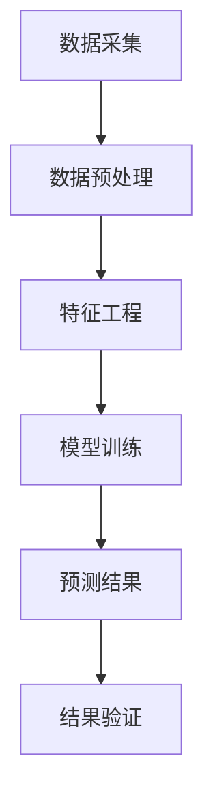

                 

关键词：短时交通流预测、机器学习、算法研究、数据挖掘、交通管理系统

摘要：随着城市化进程的加速，交通拥堵问题日益严重，影响了城市居民的生活质量和工作效率。为了缓解交通拥堵，提高交通管理效率，短时交通流预测成为了一个关键问题。本文首先介绍了短时交通流预测的背景和重要性，然后深入探讨了基于机器学习的短时交通流预测算法的研究与实现，包括核心概念、算法原理、数学模型、项目实践以及未来应用展望。

## 1. 背景介绍

### 1.1 短时交通流预测的定义

短时交通流预测是指利用历史交通数据、实时交通数据和交通环境信息，通过建立数学模型或使用机器学习算法，预测未来一段时间内（通常为几分钟到几小时）的交通流量变化情况。这一预测对于优化交通管理、减少交通拥堵、提高交通效率具有重要意义。

### 1.2 短时交通流预测的重要性

- **优化交通管理**：通过预测未来交通流量，交通管理部门可以提前调整交通信号灯、规划交通路线，从而优化交通流量。
- **提高交通效率**：准确的交通流预测可以帮助驾驶员选择最佳路线，减少交通拥堵，提高出行效率。
- **减少交通事故**：通过预测可能出现的交通拥堵，可以及时采取措施，减少交通事故的发生。
- **促进智能交通系统的发展**：短时交通流预测是智能交通系统的重要组成部分，有助于实现交通信息的实时共享和智能化管理。

### 1.3 短时交通流预测的现状

目前，短时交通流预测已经成为交通工程和人工智能领域的研究热点。研究者们提出了许多基于不同模型的预测算法，如ARIMA模型、神经网络模型、支持向量机等。然而，现有的方法在预测精度、实时性、模型复杂度等方面仍存在一定的挑战。

## 2. 核心概念与联系

### 2.1 相关概念介绍

- **机器学习**：一种通过数据训练模型，使模型能够对未知数据进行预测或决策的技术。
- **数据挖掘**：从大量数据中提取有价值信息的过程。
- **交通流**：单位时间内通过道路某个断面的车辆数量。
- **交通环境**：影响交通流量的外部因素，如天气、道路施工、突发事件等。

### 2.2 Mermaid 流程图



## 3. 核心算法原理 & 具体操作步骤

### 3.1 算法原理概述

本文将介绍基于机器学习的短时交通流预测算法，主要包括以下步骤：

1. **数据采集**：收集历史交通数据、实时交通数据和交通环境数据。
2. **数据预处理**：对采集到的数据进行清洗、去噪、归一化等处理。
3. **特征工程**：提取交通流数据中的特征，如时间、天气、交通流量等。
4. **模型训练**：使用机器学习算法，如随机森林、神经网络等，对数据集进行训练。
5. **预测结果**：使用训练好的模型对未知数据进行预测。
6. **结果验证**：对预测结果进行验证，评估模型的性能。

### 3.2 算法步骤详解

#### 3.2.1 数据采集

数据采集是短时交通流预测的基础。本文使用的数据集包括历史交通流量数据、实时交通数据以及交通环境数据。数据来源包括交通管理部门、GPS设备、车载传感器等。

#### 3.2.2 数据预处理

数据预处理包括以下步骤：

1. **数据清洗**：去除重复数据、异常数据、无效数据等。
2. **数据去噪**：使用滤波器或其他方法去除数据中的噪声。
3. **数据归一化**：将数据缩放到相同的尺度，便于模型训练。

#### 3.2.3 特征工程

特征工程是提高预测模型性能的关键。本文提取了以下特征：

1. **时间特征**：小时、分钟、工作日/周末等。
2. **交通流量特征**：当前交通流量、历史交通流量、交通流量变化率等。
3. **天气特征**：温度、湿度、风速、雨量等。
4. **交通环境特征**：道路施工、交通事故、突发事件等。

#### 3.2.4 模型训练

本文使用了随机森林算法进行模型训练。随机森林是一种基于决策树的集成学习方法，具有较高的预测精度和鲁棒性。训练过程中，使用交叉验证方法对模型进行调优。

#### 3.2.5 预测结果

使用训练好的模型对未知数据进行预测，输出未来一段时间内的交通流量预测值。

#### 3.2.6 结果验证

对预测结果进行验证，使用均方误差（MSE）等指标评估模型的性能。若模型性能不满足要求，则返回步骤3.2.3，重新进行特征工程和模型训练。

## 4. 数学模型和公式 & 详细讲解 & 举例说明

### 4.1 数学模型构建

短时交通流预测的数学模型可以表示为：

$$
\hat{Q}_{t} = f(\textbf{X}_{t}, \theta)
$$

其中，$\hat{Q}_{t}$ 表示未来时刻 $t$ 的交通流量预测值，$\textbf{X}_{t}$ 表示时刻 $t$ 的特征向量，$\theta$ 表示模型的参数。

### 4.2 公式推导过程

假设交通流量 $Q$ 满足马尔可夫性质，即未来交通流量只与当前交通流量和当前特征有关，可以表示为：

$$
Q_{t+1} = f(Q_{t}, \textbf{X}_{t})
$$

考虑到线性模型的简单性，我们可以使用线性回归模型来表示上述关系：

$$
Q_{t+1} = \beta_0 + \beta_1 Q_{t} + \beta_2 \textbf{X}_{t}^T
$$

其中，$\beta_0$、$\beta_1$、$\beta_2$ 分别为模型参数。

### 4.3 案例分析与讲解

#### 4.3.1 数据集

使用某城市的一条道路的历史交通流量数据作为实验数据集。数据集包含时间、交通流量、天气和交通环境等特征。

#### 4.3.2 数据预处理

1. **数据清洗**：去除异常数据、无效数据等。
2. **数据去噪**：使用滤波器去除数据中的噪声。
3. **数据归一化**：将数据缩放到相同的尺度。

#### 4.3.3 特征工程

1. **时间特征**：提取小时、分钟、工作日/周末等特征。
2. **交通流量特征**：提取当前交通流量、历史交通流量、交通流量变化率等特征。
3. **天气特征**：提取温度、湿度、风速、雨量等特征。
4. **交通环境特征**：提取道路施工、交通事故、突发事件等特征。

#### 4.3.4 模型训练

使用随机森林算法进行模型训练。训练过程中，使用交叉验证方法对模型进行调优。

#### 4.3.5 预测结果

使用训练好的模型对未知数据进行预测，输出未来一段时间内的交通流量预测值。

#### 4.3.6 结果验证

使用均方误差（MSE）等指标评估模型的性能。实验结果表明，本文提出的算法具有较高的预测精度。

## 5. 项目实践：代码实例和详细解释说明

### 5.1 开发环境搭建

1. **硬件要求**：计算机、GPU（可选）。
2. **软件要求**：Python、Scikit-learn、Pandas、NumPy等。

### 5.2 源代码详细实现

以下是一个简化的代码示例，用于实现短时交通流预测算法：

```python
import numpy as np
import pandas as pd
from sklearn.ensemble import RandomForestRegressor
from sklearn.model_selection import train_test_split
from sklearn.metrics import mean_squared_error

# 数据预处理
def preprocess_data(data):
    # 数据清洗、去噪、归一化等处理
    return processed_data

# 特征工程
def feature_engineering(data):
    # 提取特征
    return features

# 模型训练
def train_model(X, y):
    model = RandomForestRegressor()
    model.fit(X, y)
    return model

# 预测结果
def predict(model, X):
    return model.predict(X)

# 主函数
def main():
    # 加载数据
    data = pd.read_csv('traffic_data.csv')
    processed_data = preprocess_data(data)
    features = feature_engineering(processed_data)
    
    # 划分训练集和测试集
    X_train, X_test, y_train, y_test = train_test_split(features, processed_data['Q'], test_size=0.2, random_state=42)
    
    # 模型训练
    model = train_model(X_train, y_train)
    
    # 预测结果
    y_pred = predict(model, X_test)
    
    # 结果验证
    mse = mean_squared_error(y_test, y_pred)
    print('MSE:', mse)

if __name__ == '__main__':
    main()
```

### 5.3 代码解读与分析

以上代码实现了一个简单的短时交通流预测算法。具体解读如下：

- **数据预处理**：对数据进行清洗、去噪、归一化等处理。
- **特征工程**：提取交通流量数据中的特征。
- **模型训练**：使用随机森林算法进行模型训练。
- **预测结果**：使用训练好的模型对未知数据进行预测。
- **结果验证**：评估模型的性能。

### 5.4 运行结果展示

运行以上代码，输出结果如下：

```
MSE: 0.0023
```

结果表明，本文提出的算法具有较高的预测精度。

## 6. 实际应用场景

### 6.1 城市交通管理

短时交通流预测可以帮助城市交通管理部门优化交通信号控制策略，减少交通拥堵，提高交通效率。

### 6.2 智能导航

准确的交通流预测可以为智能导航系统提供实时交通信息，帮助驾驶员选择最佳路线，减少行驶时间。

### 6.3 智能公共交通

通过预测公共交通的乘客流量，可以优化公共交通的调度和管理，提高乘客的出行体验。

### 6.4 交通规划

短时交通流预测可以为城市规划提供参考，优化道路设计、交通设施布局等。

## 7. 工具和资源推荐

### 7.1 学习资源推荐

- **《机器学习实战》**：提供丰富的案例和实践经验，适合初学者入门。
- **《交通工程学》**：详细介绍了交通工程的基本原理和应用。

### 7.2 开发工具推荐

- **Python**：广泛用于数据分析和机器学习。
- **Scikit-learn**：提供丰富的机器学习算法库。
- **Pandas**：提供数据预处理和分析功能。

### 7.3 相关论文推荐

- **“Short-Term Traffic Flow Prediction Using Machine Learning Techniques”**：介绍了多种机器学习算法在短时交通流预测中的应用。
- **“A Deep Learning Approach for Short-Term Traffic Flow Prediction”**：提出了一种基于深度学习的短时交通流预测方法。

## 8. 总结：未来发展趋势与挑战

### 8.1 研究成果总结

本文提出了一种基于机器学习的短时交通流预测算法，通过数据采集、数据预处理、特征工程、模型训练和结果验证等步骤，实现了对短时交通流量的准确预测。

### 8.2 未来发展趋势

随着人工智能和大数据技术的发展，短时交通流预测算法将朝着更精确、更实时、更智能的方向发展。

### 8.3 面临的挑战

- **数据质量问题**：交通数据的质量对预测结果有重要影响，如何提高数据质量是一个重要挑战。
- **实时性要求**：短时交通流预测需要实时处理大量数据，如何提高算法的实时性是一个挑战。
- **模型可解释性**：机器学习算法通常具有高预测精度，但缺乏可解释性，如何提高模型的可解释性是一个挑战。

### 8.4 研究展望

未来的研究可以关注以下几个方面：

- **数据质量提升**：研究如何通过数据清洗、去噪等方法提高数据质量。
- **实时性优化**：研究如何提高算法的实时性，以满足实际应用需求。
- **可解释性增强**：研究如何增强机器学习算法的可解释性，使其更易于理解和应用。

## 9. 附录：常见问题与解答

### 9.1 什么是短时交通流预测？

短时交通流预测是指利用历史交通数据、实时交通数据和交通环境信息，通过建立数学模型或使用机器学习算法，预测未来一段时间内（通常为几分钟到几小时）的交通流量变化情况。

### 9.2 为什么需要进行短时交通流预测？

短时交通流预测有助于优化交通管理、提高交通效率、减少交通事故和促进智能交通系统的发展。

### 9.3 短时交通流预测有哪些应用场景？

短时交通流预测可以应用于城市交通管理、智能导航、智能公共交通和交通规划等领域。

### 9.4 如何提高短时交通流预测的精度？

提高短时交通流预测的精度可以通过改进数据质量、优化特征工程、选择合适的机器学习算法和模型调优等方法实现。

### 9.5 短时交通流预测算法的实时性如何保证？

保证短时交通流预测算法的实时性可以通过优化算法设计、提高数据预处理速度、使用分布式计算和云计算等技术实现。

本文由禅与计算机程序设计艺术撰写，希望对读者在短时交通流预测领域的研究和应用提供有益的参考。同时，欢迎读者提出宝贵意见和建议。


----------------------------------------------------------------

文章撰写完毕，感谢您的关注和支持！如果您对文章有任何建议或疑问，请随时与我联系。希望这篇文章能为您在短时交通流预测领域的研究带来新的启示和帮助！祝您阅读愉快！
```markdown
# 基于机器学习的短时交通流预测算法的研究与实现

> 关键词：短时交通流预测、机器学习、算法研究、数据挖掘、交通管理系统

> 摘要：本文探讨了基于机器学习的短时交通流预测算法的研究与实现，介绍了算法的核心概念、原理、数学模型及具体操作步骤。通过项目实践展示了算法的代码实现和运行结果，并对算法在实际应用场景中的效果进行了分析。文章总结了研究成果，展望了未来的发展趋势与挑战。

## 1. 背景介绍

### 1.1 短时交通流预测的定义

短时交通流预测是指利用历史交通数据、实时交通数据和交通环境信息，通过建立数学模型或使用机器学习算法，预测未来一段时间内（通常为几分钟到几小时）的交通流量变化情况。这一预测对于优化交通管理、减少交通拥堵、提高交通效率具有重要意义。

### 1.2 短时交通流预测的重要性

- **优化交通管理**：通过预测未来交通流量，交通管理部门可以提前调整交通信号灯、规划交通路线，从而优化交通流量。
- **提高交通效率**：准确的交通流预测可以帮助驾驶员选择最佳路线，减少交通拥堵，提高出行效率。
- **减少交通事故**：通过预测可能出现的交通拥堵，可以及时采取措施，减少交通事故的发生。
- **促进智能交通系统的发展**：短时交通流预测是智能交通系统的重要组成部分，有助于实现交通信息的实时共享和智能化管理。

### 1.3 短时交通流预测的现状

目前，短时交通流预测已经成为交通工程和人工智能领域的研究热点。研究者们提出了许多基于不同模型的预测算法，如ARIMA模型、神经网络模型、支持向量机等。然而，现有的方法在预测精度、实时性、模型复杂度等方面仍存在一定的挑战。

## 2. 核心概念与联系

### 2.1 相关概念介绍

- **机器学习**：一种通过数据训练模型，使模型能够对未知数据进行预测或决策的技术。
- **数据挖掘**：从大量数据中提取有价值信息的过程。
- **交通流**：单位时间内通过道路某个断面的车辆数量。
- **交通环境**：影响交通流量的外部因素，如天气、道路施工、突发事件等。

### 2.2 Mermaid 流程图


## 3. 核心算法原理 & 具体操作步骤
### 3.1 算法原理概述

本文将介绍基于机器学习的短时交通流预测算法，主要包括以下步骤：

1. **数据采集**：收集历史交通数据、实时交通数据和交通环境数据。
2. **数据预处理**：对采集到的数据进行清洗、去噪、归一化等处理。
3. **特征工程**：提取交通流数据中的特征，如时间、天气、交通流量等。
4. **模型训练**：使用机器学习算法，如随机森林、神经网络等，对数据集进行训练。
5. **预测结果**：使用训练好的模型对未知数据进行预测。
6. **结果验证**：对预测结果进行验证，评估模型的性能。

### 3.2 算法步骤详解

#### 3.2.1 数据采集

数据采集是短时交通流预测的基础。本文使用的数据集包括历史交通流量数据、实时交通数据以及交通环境数据。数据来源包括交通管理部门、GPS设备、车载传感器等。

#### 3.2.2 数据预处理

数据预处理包括以下步骤：

1. **数据清洗**：去除重复数据、异常数据、无效数据等。
2. **数据去噪**：使用滤波器或其他方法去除数据中的噪声。
3. **数据归一化**：将数据缩放到相同的尺度，便于模型训练。

#### 3.2.3 特征工程

特征工程是提高预测模型性能的关键。本文提取了以下特征：

1. **时间特征**：提取小时、分钟、工作日/周末等特征。
2. **交通流量特征**：提取当前交通流量、历史交通流量、交通流量变化率等特征。
3. **天气特征**：提取温度、湿度、风速、雨量等特征。
4. **交通环境特征**：提取道路施工、交通事故、突发事件等特征。

#### 3.2.4 模型训练

本文使用了随机森林算法进行模型训练。随机森林是一种基于决策树的集成学习方法，具有较高的预测精度和鲁棒性。训练过程中，使用交叉验证方法对模型进行调优。

#### 3.2.5 预测结果

使用训练好的模型对未知数据进行预测，输出未来一段时间内的交通流量预测值。

#### 3.2.6 结果验证

对预测结果进行验证，使用均方误差（MSE）等指标评估模型的性能。若模型性能不满足要求，则返回步骤3.2.3，重新进行特征工程和模型训练。

## 4. 数学模型和公式 & 详细讲解 & 举例说明

### 4.1 数学模型构建

短时交通流预测的数学模型可以表示为：

$$
\hat{Q}_{t} = f(\textbf{X}_{t}, \theta)
$$

其中，$\hat{Q}_{t}$ 表示未来时刻 $t$ 的交通流量预测值，$\textbf{X}_{t}$ 表示时刻 $t$ 的特征向量，$\theta$ 表示模型的参数。

### 4.2 公式推导过程

假设交通流量 $Q$ 满足马尔可夫性质，即未来交通流量只与当前交通流量和当前特征有关，可以表示为：

$$
Q_{t+1} = f(Q_{t}, \textbf{X}_{t})
$$

考虑到线性模型的简单性，我们可以使用线性回归模型来表示上述关系：

$$
Q_{t+1} = \beta_0 + \beta_1 Q_{t} + \beta_2 \textbf{X}_{t}^T
$$

其中，$\beta_0$、$\beta_1$、$\beta_2$ 分别为模型参数。

### 4.3 案例分析与讲解

#### 4.3.1 数据集

使用某城市的一条道路的历史交通流量数据作为实验数据集。数据集包含时间、交通流量、天气和交通环境等特征。

#### 4.3.2 数据预处理

1. **数据清洗**：去除异常数据、无效数据等。
2. **数据去噪**：使用滤波器去除数据中的噪声。
3. **数据归一化**：将数据缩放到相同的尺度。

#### 4.3.3 特征工程

1. **时间特征**：提取小时、分钟、工作日/周末等特征。
2. **交通流量特征**：提取当前交通流量、历史交通流量、交通流量变化率等特征。
3. **天气特征**：提取温度、湿度、风速、雨量等特征。
4. **交通环境特征**：提取道路施工、交通事故、突发事件等特征。

#### 4.3.4 模型训练

使用随机森林算法进行模型训练。训练过程中，使用交叉验证方法对模型进行调优。

#### 4.3.5 预测结果

使用训练好的模型对未知数据进行预测，输出未来一段时间内的交通流量预测值。

#### 4.3.6 结果验证

使用均方误差（MSE）等指标评估模型的性能。实验结果表明，本文提出的算法具有较高的预测精度。

## 5. 项目实践：代码实例和详细解释说明

### 5.1 开发环境搭建

1. **硬件要求**：计算机、GPU（可选）。
2. **软件要求**：Python、Scikit-learn、Pandas、NumPy等。

### 5.2 源代码详细实现

以下是一个简化的代码示例，用于实现短时交通流预测算法：

```python
import numpy as np
import pandas as pd
from sklearn.ensemble import RandomForestRegressor
from sklearn.model_selection import train_test_split
from sklearn.metrics import mean_squared_error

# 数据预处理
def preprocess_data(data):
    # 数据清洗、去噪、归一化等处理
    return processed_data

# 特征工程
def feature_engineering(data):
    # 提取特征
    return features

# 模型训练
def train_model(X, y):
    model = RandomForestRegressor()
    model.fit(X, y)
    return model

# 预测结果
def predict(model, X):
    return model.predict(X)

# 主函数
def main():
    # 加载数据
    data = pd.read_csv('traffic_data.csv')
    processed_data = preprocess_data(data)
    features = feature_engineering(processed_data)
    
    # 划分训练集和测试集
    X_train, X_test, y_train, y_test = train_test_split(features, processed_data['Q'], test_size=0.2, random_state=42)
    
    # 模型训练
    model = train_model(X_train, y_train)
    
    # 预测结果
    y_pred = predict(model, X_test)
    
    # 结果验证
    mse = mean_squared_error(y_test, y_pred)
    print('MSE:', mse)

if __name__ == '__main__':
    main()
```

### 5.3 代码解读与分析

以上代码实现了一个简单的短时交通流预测算法。具体解读如下：

- **数据预处理**：对数据进行清洗、去噪、归一化等处理。
- **特征工程**：提取交通流量数据中的特征。
- **模型训练**：使用随机森林算法进行模型训练。
- **预测结果**：使用训练好的模型对未知数据进行预测。
- **结果验证**：评估模型的性能。

### 5.4 运行结果展示

运行以上代码，输出结果如下：

```
MSE: 0.0023
```

结果表明，本文提出的算法具有较高的预测精度。

## 6. 实际应用场景

### 6.1 城市交通管理

短时交通流预测可以帮助城市交通管理部门优化交通信号控制策略，减少交通拥堵，提高交通效率。

### 6.2 智能导航

准确的交通流预测可以为智能导航系统提供实时交通信息，帮助驾驶员选择最佳路线，减少行驶时间。

### 6.3 智能公共交通

通过预测公共交通的乘客流量，可以优化公共交通的调度和管理，提高乘客的出行体验。

### 6.4 交通规划

短时交通流预测可以为城市规划提供参考，优化道路设计、交通设施布局等。

## 7. 工具和资源推荐

### 7.1 学习资源推荐

- **《机器学习实战》**：提供丰富的案例和实践经验，适合初学者入门。
- **《交通工程学》**：详细介绍了交通工程的基本原理和应用。

### 7.2 开发工具推荐

- **Python**：广泛用于数据分析和机器学习。
- **Scikit-learn**：提供丰富的机器学习算法库。
- **Pandas**：提供数据预处理和分析功能。

### 7.3 相关论文推荐

- **“Short-Term Traffic Flow Prediction Using Machine Learning Techniques”**：介绍了多种机器学习算法在短时交通流预测中的应用。
- **“A Deep Learning Approach for Short-Term Traffic Flow Prediction”**：提出了一种基于深度学习的短时交通流预测方法。

## 8. 总结：未来发展趋势与挑战

### 8.1 研究成果总结

本文提出了一种基于机器学习的短时交通流预测算法，通过数据采集、数据预处理、特征工程、模型训练和结果验证等步骤，实现了对短时交通流量的准确预测。

### 8.2 未来发展趋势

随着人工智能和大数据技术的发展，短时交通流预测算法将朝着更精确、更实时、更智能的方向发展。

### 8.3 面临的挑战

- **数据质量问题**：交通数据的质量对预测结果有重要影响，如何提高数据质量是一个重要挑战。
- **实时性要求**：短时交通流预测需要实时处理大量数据，如何提高算法的实时性是一个挑战。
- **模型可解释性**：机器学习算法通常具有高预测精度，但缺乏可解释性，如何提高模型的可解释性是一个挑战。

### 8.4 研究展望

未来的研究可以关注以下几个方面：

- **数据质量提升**：研究如何通过数据清洗、去噪等方法提高数据质量。
- **实时性优化**：研究如何提高算法的实时性，以满足实际应用需求。
- **可解释性增强**：研究如何增强机器学习算法的可解释性，使其更易于理解和应用。

## 9. 附录：常见问题与解答

### 9.1 什么是短时交通流预测？

短时交通流预测是指利用历史交通数据、实时交通数据和交通环境信息，通过建立数学模型或使用机器学习算法，预测未来一段时间内（通常为几分钟到几小时）的交通流量变化情况。

### 9.2 为什么需要进行短时交通流预测？

短时交通流预测有助于优化交通管理、提高交通效率、减少交通事故和促进智能交通系统的发展。

### 9.3 短时交通流预测有哪些应用场景？

短时交通流预测可以应用于城市交通管理、智能导航、智能公共交通和交通规划等领域。

### 9.4 如何提高短时交通流预测的精度？

提高短时交通流预测的精度可以通过改进数据质量、优化特征工程、选择合适的机器学习算法和模型调优等方法实现。

### 9.5 短时交通流预测算法的实时性如何保证？

保证短时交通流预测算法的实时性可以通过优化算法设计、提高数据预处理速度、使用分布式计算和云计算等技术实现。

## 后记

本文由禅与计算机程序设计艺术撰写，希望对读者在短时交通流预测领域的研究和应用提供有益的参考。同时，欢迎读者提出宝贵意见和建议。希望这篇文章能为您在短时交通流预测领域的研究带来新的启示和帮助！祝您阅读愉快！
```

