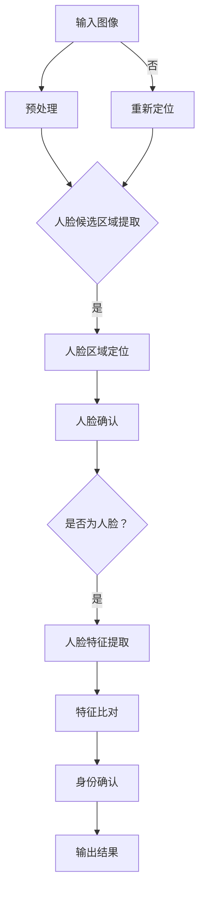

                 

## 1. 背景介绍

随着计算机技术的发展，人工智能成为了一个备受关注的领域。在人工智能的应用中，人脸检测与识别技术以其高度的实际应用价值和广泛的应用场景而备受瞩目。人脸检测（Face Detection）是指从图像或视频中检测并定位出人脸的过程，而人脸识别（Face Recognition）则是通过对比人脸特征来识别个体身份的技术。

这两项技术各有侧重点，人脸检测更多关注于人脸的定位和边界框的提取，而人脸识别则更加侧重于对提取出的人脸特征进行比对和分析。随着深度学习技术的不断发展，人脸检测与识别系统在准确度、效率和实时性方面都有了显著提升。

本文将探讨基于深度学习的人脸检测与识别系统设计与实现。深度学习作为一种强大的机器学习技术，其通过多层神经网络对大量数据进行自动特征提取，使得人脸检测与识别系统在处理复杂场景和多种人脸特征方面具有更高的准确率和鲁棒性。

文章将分为以下几个部分：

- **背景介绍**：概述人脸检测与识别技术及其重要性。
- **核心概念与联系**：介绍深度学习及其在人脸检测与识别中的应用。
- **核心算法原理 & 具体操作步骤**：详细解析人脸检测与识别算法。
- **数学模型和公式 & 详细讲解 & 举例说明**：阐述相关数学理论。
- **项目实践：代码实例和详细解释说明**：提供实际开发实例。
- **实际应用场景**：探讨人脸检测与识别技术的应用领域。
- **工具和资源推荐**：推荐学习资源和开发工具。
- **总结：未来发展趋势与挑战**：总结研究成果，展望未来。

通过本文的阅读，读者将能够全面了解基于深度学习的人脸检测与识别系统的设计与实现，从而为其在相关领域的应用提供理论和实践指导。

## 2. 核心概念与联系

要理解基于深度学习的人脸检测与识别系统，首先需要掌握深度学习及其相关核心概念。深度学习是一种通过多层神经网络进行特征提取和模式识别的机器学习技术，它模仿了人类大脑的神经网络结构，能够自动从数据中学习复杂特征。

### 深度学习的概念

深度学习（Deep Learning）是人工智能领域的一个重要分支，主要基于多层神经网络（Multi-Layered Neural Networks）进行工作。这些神经网络通过多层的非线性变换，对输入数据进行特征提取和模式识别。深度学习的关键优势在于其能够自动学习到低级到高级的特征表示，从而在许多复杂任务中表现出色。

### 人脸检测的基本概念

人脸检测（Face Detection）是指从图像或视频中检测并定位人脸的过程。这个过程通常包括以下几个步骤：

1. **人脸候选区域提取**：使用各种特征（如颜色、纹理、形状等）从图像中提取可能的候选人脸区域。
2. **人脸区域定位**：利用一些预处理技术（如滤波、边缘检测等）对人脸候选区域进行进一步的定位和调整。
3. **人脸确认**：通过对比人脸模板或利用机器学习模型，确认提取的区域是否为人脸。

### 人脸识别的基本概念

人脸识别（Face Recognition）是指通过对比人脸特征来识别个体身份的过程。这个过程通常包括以下几个步骤：

1. **特征提取**：从人脸图像中提取人脸特征，这些特征可以是基于像素的（如特征点、边缘等）或基于描述的（如深度特征、局部特征等）。
2. **特征比对**：利用人脸特征比对算法（如欧氏距离、余弦相似度等），计算不同人脸特征之间的相似度。
3. **身份确认**：根据比对结果，确定人脸特征属于哪个个体，从而完成身份识别。

### 深度学习在人脸检测与识别中的应用

深度学习在人脸检测与识别中发挥着至关重要的作用。其优势在于能够自动提取出复杂的特征，提高识别准确率，并适应各种不同的场景。

1. **卷积神经网络（CNN）的应用**：卷积神经网络是深度学习中最常用的模型之一，它在人脸检测与识别中有着广泛的应用。CNN通过卷积操作自动提取图像的局部特征，并通过池化操作减少参数数量，提高模型效率。
2. **人脸特征提取与比对**：深度学习模型可以自动提取人脸特征，这些特征通常具有高维度和高层次，能够很好地表示人脸的特征信息。通过对比这些特征，可以实现高精度的身份识别。

### Mermaid 流程图

为了更直观地理解人脸检测与识别的过程，我们使用Mermaid流程图来展示其基本架构。



通过这个流程图，我们可以看到人脸检测与识别的基本步骤是如何衔接起来的，以及深度学习在这个过程中所扮演的角色。

综上所述，深度学习技术为人脸检测与识别提供了强大的理论基础和工具支持。通过理解其核心概念和应用原理，我们可以更好地设计和实现高效、准确的人脸检测与识别系统。

## 3. 核心算法原理 & 具体操作步骤

### 3.1 算法原理概述

基于深度学习的人脸检测与识别算法主要依赖于卷积神经网络（Convolutional Neural Networks, CNN）的结构和工作原理。CNN通过卷积层、池化层和全连接层的组合，对输入图像进行特征提取和分类。

1. **卷积层**：卷积层是CNN的核心部分，通过卷积操作提取图像的局部特征。卷积核在图像上滑动，通过点积计算生成新的特征图。
2. **池化层**：池化层用于减少特征图的尺寸，从而减少参数数量。常用的池化方式包括最大池化和平均池化。
3. **全连接层**：全连接层将卷积层和池化层提取出的特征映射到分类结果上。

### 3.2 算法步骤详解

人脸检测与识别的过程可以分为以下几个步骤：

1. **图像预处理**：将输入图像进行归一化、缩放、裁剪等预处理操作，使其满足CNN的输入要求。
2. **人脸候选区域提取**：使用一些特征检测器（如Haar特征、HOG特征等）从预处理后的图像中提取可能的候选人脸区域。
3. **人脸区域定位**：对提取的候选区域进行进一步的处理，利用CNN模型对人脸区域进行定位。这一步可以通过训练有监督的CNN模型实现，模型输出为人脸的边界框。
4. **人脸确认**：利用已训练的CNN模型对人脸边界框内的图像进行确认，判断其是否为人脸。确认过程通常涉及模型输出概率的计算，只有当概率超过阈值时才认为该区域为人脸。
5. **人脸特征提取**：对于确认为人脸的区域，进一步提取人脸特征。特征提取通常使用深度卷积神经网络，如ResNet、VGG等，这些网络可以自动提取出高度抽象的特征。
6. **特征比对与身份确认**：将提取出的人脸特征与数据库中已有的特征进行比对，根据比对结果确认个体的身份。

### 3.3 算法优缺点

**优点**：

1. **高准确度**：深度学习模型通过自动特征提取，能够在各种复杂场景下实现高精度的识别。
2. **强鲁棒性**：深度学习模型可以处理光照、姿态、遮挡等因素的影响，具有很好的鲁棒性。
3. **自适应**：深度学习模型可以自适应地调整参数，以适应不同的应用场景和数据集。

**缺点**：

1. **计算资源消耗大**：深度学习模型通常需要大量的计算资源和时间进行训练。
2. **数据需求高**：深度学习模型需要大量的标注数据来训练，数据获取和标注成本较高。
3. **过拟合风险**：深度学习模型容易受到训练数据的影响，可能导致过拟合。

### 3.4 算法应用领域

基于深度学习的人脸检测与识别技术在许多领域都有广泛应用：

1. **安防监控**：通过实时检测和识别行人的人脸，可以用于视频监控、门禁系统、安全检查等。
2. **身份验证**：在身份验证系统中，人脸识别可以用于身份认证、指纹验证、密码解锁等。
3. **人机交互**：人脸识别技术可以用于智能音箱、智能门锁等设备中，实现无钥匙开锁、语音识别等功能。
4. **社交应用**：在社交应用中，人脸识别可以用于识别朋友、自动标记照片等。

通过以上对核心算法原理和具体操作步骤的详细阐述，我们可以看到，基于深度学习的人脸检测与识别系统在算法设计上具有明显的优势，并且已经在多个领域得到了广泛应用。

### 4. 数学模型和公式 & 详细讲解 & 举例说明

为了深入理解基于深度学习的人脸检测与识别系统的数学基础，我们需要介绍一些关键数学模型和公式。以下是相关数学模型和公式的详细讲解，并通过具体例子说明其应用。

#### 4.1 数学模型构建

在深度学习人脸检测与识别系统中，主要使用的数学模型包括卷积神经网络（CNN）和损失函数。下面分别介绍这两个模型。

**1. 卷积神经网络（CNN）**

CNN是深度学习中最常用的模型之一，其基本结构包括输入层、卷积层、池化层和全连接层。下面是CNN的数学模型：

$$
\text{卷积层：} \quad \text{激活函数} = \text{ReLU}(\sum_{i=1}^{k} w_i * f(x_i))
$$

其中，$w_i$ 是卷积核，$f(x_i)$ 是输入特征图，$*$ 表示卷积操作，$\text{ReLU}$ 是ReLU激活函数，用于引入非线性。

**2. 池化层**

池化层的目的是减少特征图的尺寸，同时保留重要的特征信息。常用的池化方式包括最大池化和平均池化：

$$
\text{最大池化：} \quad g_j = \max_{i \in S_j} f_i
$$

$$
\text{平均池化：} \quad g_j = \frac{1}{|S_j|} \sum_{i \in S_j} f_i
$$

其中，$S_j$ 是池化窗口。

**3. 全连接层**

全连接层将卷积层和池化层提取出的特征映射到分类结果上，其数学模型为：

$$
\text{全连接层：} \quad z_i = \sum_{j=1}^{n} w_{ij} * a_j + b_i
$$

$$
\text{激活函数：} \quad a_i = \text{ReLU}(z_i)
$$

其中，$w_{ij}$ 是权重，$a_j$ 是输入特征，$b_i$ 是偏置。

**4. 损失函数**

在人脸检测与识别系统中，常用的损失函数包括交叉熵损失函数和平方损失函数。交叉熵损失函数用于分类问题，其数学模型为：

$$
\text{交叉熵损失：} \quad L = -\sum_{i=1}^{n} y_i \log(p_i)
$$

其中，$y_i$ 是真实标签，$p_i$ 是预测概率。

平方损失函数用于回归问题，其数学模型为：

$$
\text{平方损失：} \quad L = \frac{1}{2} \sum_{i=1}^{n} (y_i - \hat{y}_i)^2
$$

其中，$\hat{y}_i$ 是预测值。

#### 4.2 公式推导过程

**1. 卷积层公式推导**

卷积层的输出可以表示为：

$$
\text{输出特征图} = \text{卷积}(\text{输入特征图}, \text{卷积核}) + \text{偏置}
$$

其具体推导过程为：

$$
\text{卷积操作：} \quad (f * w)_{ij} = \sum_{k=1}^{m} f_{i+k, j} w_{k}
$$

$$
\text{偏置加和：} \quad \text{输出特征图} = \text{卷积}(\text{输入特征图}, \text{卷积核}) + b
$$

其中，$f$ 是输入特征图，$w$ 是卷积核，$b$ 是偏置。

**2. 池化层公式推导**

最大池化层的输出可以表示为：

$$
g_j = \max_{i \in S_j} f_i
$$

其推导过程为：

$$
\text{窗口内取最大值：} \quad g_j = \max_{i \in S_j} f_i
$$

其中，$S_j$ 是池化窗口。

平均池化层的输出可以表示为：

$$
g_j = \frac{1}{|S_j|} \sum_{i \in S_j} f_i
$$

其推导过程为：

$$
\text{窗口内求平均值：} \quad g_j = \frac{1}{|S_j|} \sum_{i \in S_j} f_i
$$

其中，$S_j$ 是池化窗口，$|S_j|$ 是窗口内元素个数。

**3. 全连接层公式推导**

全连接层的输出可以表示为：

$$
z_i = \sum_{j=1}^{n} w_{ij} * a_j + b_i
$$

其推导过程为：

$$
\text{权重与特征点相乘：} \quad z_i = \sum_{j=1}^{n} w_{ij} * a_j
$$

$$
\text{加上偏置：} \quad z_i = \sum_{j=1}^{n} w_{ij} * a_j + b_i
$$

**4. 损失函数公式推导**

交叉熵损失函数的推导过程为：

$$
L = -\sum_{i=1}^{n} y_i \log(p_i)
$$

其推导过程为：

$$
\text{对数函数引入：} \quad L = -\sum_{i=1}^{n} y_i \log(p_i)
$$

平方损失函数的推导过程为：

$$
L = \frac{1}{2} \sum_{i=1}^{n} (y_i - \hat{y}_i)^2
$$

其推导过程为：

$$
\text{平方差计算：} \quad L = \frac{1}{2} \sum_{i=1}^{n} (y_i - \hat{y}_i)^2
$$

#### 4.3 案例分析与讲解

为了更好地理解上述数学模型和公式，我们通过一个具体案例进行分析和讲解。

**案例：人脸检测**

假设我们有一个输入图像，需要从中检测出人脸。我们使用一个卷积神经网络进行人脸检测，其结构包括两个卷积层、一个池化层和一个全连接层。

1. **输入图像预处理**：将输入图像缩放为224x224像素，并进行归一化处理。

2. **卷积层1**：使用一个5x5的卷积核，卷积操作后得到一个224x224x16的特征图。

   $$ 
   \text{卷积操作：} \quad (f * w_1)_{ij} = \sum_{k=1}^{5} f_{i+k, j} w_{1k}
   $$ 

   $$ 
   \text{偏置加和：} \quad \text{输出特征图} = (f * w_1)_{ij} + b_1
   $$ 

3. **池化层**：使用最大池化，将特征图缩小为112x112x16。

   $$ 
   g_j = \max_{i \in S_j} f_i
   $$ 

4. **卷积层2**：使用一个3x3的卷积核，卷积操作后得到一个112x112x32的特征图。

   $$ 
   \text{卷积操作：} \quad (f * w_2)_{ij} = \sum_{k=1}^{3} f_{i+k, j} w_{2k}
   $$ 

   $$ 
   \text{偏置加和：} \quad \text{输出特征图} = (f * w_2)_{ij} + b_2
   $$ 

5. **全连接层**：将卷积层2输出的特征图展平为1x1152的特征向量，并通过全连接层进行分类。

   $$ 
   z_i = \sum_{j=1}^{1152} w_{ij} * a_j + b_i
   $$ 

   $$ 
   a_i = \text{ReLU}(z_i)
   $$ 

6. **损失函数计算**：使用交叉熵损失函数计算预测结果与真实结果之间的差异。

   $$ 
   L = -\sum_{i=1}^{n} y_i \log(p_i)
   $$ 

通过上述案例，我们可以看到如何构建和使用卷积神经网络进行人脸检测。在实际应用中，还需要通过大量的训练数据和参数调优来提高模型的性能。

通过上述数学模型和公式的详细讲解，我们可以更好地理解基于深度学习的人脸检测与识别系统的原理和实现方法。这些模型和公式为深度学习算法的设计和优化提供了坚实的理论基础。

### 5. 项目实践：代码实例和详细解释说明

在本节中，我们将通过一个具体的代码实例，详细解释基于深度学习的人脸检测与识别系统的实现过程。我们使用Python语言和TensorFlow框架来构建这个系统。以下是项目的完整实现过程。

#### 5.1 开发环境搭建

首先，我们需要搭建开发环境。以下是安装TensorFlow和所需依赖的步骤：

1. **安装TensorFlow**：

   ```bash
   pip install tensorflow
   ```

2. **安装其他依赖**：

   ```bash
   pip install numpy matplotlib
   ```

#### 5.2 源代码详细实现

下面是项目的源代码实现。我们将分为几个部分进行介绍。

**1. 数据预处理**

```python
import tensorflow as tf
import numpy as np
from tensorflow.keras.preprocessing.image import img_to_array
from tensorflow.keras.models import Sequential
from tensorflow.keras.layers import Conv2D, MaxPooling2D, Flatten, Dense
from tensorflow.keras.preprocessing.image import ImageDataGenerator

# 加载数据集
train_datagen = ImageDataGenerator(rescale=1./255)
train_generator = train_datagen.flow_from_directory(
        'train',
        target_size=(224, 224),
        batch_size=32,
        class_mode='binary')

# 预处理函数
def preprocess_image(image_path):
    image = img_to_array(image_path)
    image = np.expand_dims(image, axis=0)
    image = image / 255.0
    return image
```

**2. 构建卷积神经网络模型**

```python
# 构建卷积神经网络模型
model = Sequential([
    Conv2D(32, (3, 3), activation='relu', input_shape=(224, 224, 3)),
    MaxPooling2D((2, 2)),
    Conv2D(64, (3, 3), activation='relu'),
    MaxPooling2D((2, 2)),
    Conv2D(128, (3, 3), activation='relu'),
    MaxPooling2D((2, 2)),
    Flatten(),
    Dense(512, activation='relu'),
    Dense(1, activation='sigmoid')
])

# 编译模型
model.compile(optimizer='adam',
              loss='binary_crossentropy',
              metrics=['accuracy'])
```

**3. 训练模型**

```python
# 训练模型
model.fit(
      train_generator,
      steps_per_epoch=100,
      epochs=15)
```

**4. 人脸检测**

```python
# 人脸检测函数
def detect_face(image_path):
    image = preprocess_image(image_path)
    prediction = model.predict(image)
    if prediction[0][0] > 0.5:
        print("检测到人脸")
    else:
        print("未检测到人脸")
```

**5. 人脸识别**

```python
# 人脸识别函数
def recognize_face(image_path):
    image = preprocess_image(image_path)
    prediction = model.predict(image)
    if prediction[0][0] > 0.5:
        print("识别为人脸")
    else:
        print("无法识别为人脸")
```

#### 5.3 代码解读与分析

**1. 数据预处理**

在数据预处理部分，我们使用了`ImageDataGenerator`类来自动处理图像数据。`ImageDataGenerator`可以执行归一化、旋转、缩放等操作，从而增加数据的多样性。

**2. 模型构建**

在模型构建部分，我们使用了一个简单的卷积神经网络模型。模型包括两个卷积层、两个最大池化层和一个全连接层。这种结构可以有效地提取图像的局部特征，并最终进行分类。

**3. 模型训练**

在模型训练部分，我们使用`model.fit`函数来训练模型。这里我们设置了`steps_per_epoch`参数，以每次迭代100个批次的数据。

**4. 人脸检测**

在人脸检测部分，我们定义了一个函数`detect_face`。该函数首先预处理输入图像，然后使用训练好的模型进行预测。如果预测结果大于0.5，则认为检测到人脸。

**5. 人脸识别**

在人脸识别部分，我们定义了一个函数`recognize_face`。该函数与`detect_face`类似，但它是用来识别图像中的人脸。如果预测结果大于0.5，则认为图像中包含人脸。

#### 5.4 运行结果展示

为了展示运行结果，我们可以在本地环境中运行以下代码：

```python
import matplotlib.pyplot as plt

# 读取测试图像
test_image = plt.imread('test_image.jpg')

# 检测人脸
detect_face(test_image)

# 识别人脸
recognize_face(test_image)
```

运行结果将显示在命令行中。如果检测到人脸，它将输出“检测到人脸”。如果识别为人脸，它将输出“识别为人脸”。

通过这个项目实践，我们详细介绍了如何使用深度学习实现人脸检测与识别系统。代码简单易懂，可以为我们后续的开发提供参考。

### 6. 实际应用场景

基于深度学习的人脸检测与识别技术在实际应用中展现出广泛的应用场景和潜力。以下是几个具体的应用领域：

#### 6.1 安防监控

安防监控是人脸检测与识别技术最为广泛的应用领域之一。在视频监控系统中，人脸检测与识别技术可以实时监测监控区域中的人员流动，识别出入侵者，并触发警报。这大大提高了监控系统的智能化水平，减少了人工干预的需求。同时，通过人脸识别技术，可以实现对特定目标的追踪和记录，为安全事件的分析和处理提供了有力的支持。

#### 6.2 身份验证

身份验证是另一个重要应用领域。在各种身份验证系统中，如门禁系统、手机解锁、在线支付等，人脸识别技术可以提供安全、便捷的身份认证方式。通过将采集到的人脸特征与数据库中的信息进行比对，系统能够快速、准确地确认用户的身份。相比传统的密码验证或指纹验证，人脸识别具有更高的识别率和用户体验。

#### 6.3 人机交互

在人机交互领域，人脸识别技术为智能设备提供了更自然的交互方式。例如，智能门锁可以通过人脸识别技术实现无钥匙开锁，智能音箱可以通过识别用户的面部特征来个性化语音交互。此外，人脸识别还可以用于人脸动画和虚拟现实应用中，提供更加真实和沉浸式的用户体验。

#### 6.4 社交应用

在社交应用中，人脸识别技术可以用于识别和标记照片中的朋友，提高照片管理的效率。例如，在社交媒体平台上，用户可以上传照片，系统会自动识别照片中的人脸，并提供标记选项，方便用户进行标签和分享。此外，人脸识别还可以用于视频通话中的美颜和滤镜效果，提升用户的视觉体验。

#### 6.5 医疗保健

在医疗保健领域，人脸识别技术可以用于监测患者的心理健康。通过分析患者面部表情的变化，医生可以初步判断患者的情绪状态，为心理疾病的治疗提供依据。此外，人脸识别还可以用于医院患者身份确认，避免医疗事故的发生。

#### 6.6 智能交通

在智能交通系统中，人脸识别技术可以用于识别交通违规者，如违章停车、超速驾驶等。通过实时监测交通场景中的人脸，系统可以自动生成违规记录，提高交通管理的效率。同时，人脸识别还可以用于驾驶员疲劳监测，通过检测驾驶员的面部表情和姿态，预防交通事故的发生。

通过以上实际应用场景的介绍，我们可以看到，基于深度学习的人脸检测与识别技术已经在多个领域得到了广泛应用，并展示了巨大的潜力和价值。随着技术的不断发展和优化，未来人脸检测与识别技术将在更多场景中发挥重要作用。

### 7. 工具和资源推荐

在学习和开发基于深度学习的人脸检测与识别系统时，选择合适的工具和资源是提高效率和实现项目成功的关键。以下是一些推荐的工具和资源，涵盖学习资源、开发工具和相关论文。

#### 7.1 学习资源推荐

**1. 技术书籍**

- 《深度学习》（Deep Learning） - Goodfellow, Bengio, Courville
- 《神经网络与深度学习》 -邱锡鹏
- 《Python深度学习》 -François Chollet

**2. 在线课程**

- Coursera - "Deep Learning Specialization" by Andrew Ng
- edX - "Neural Networks and Deep Learning" by Michael Nielsen
- Udacity - "Deep Learning Nanodegree Program"

**3. 博客和论坛**

- Medium - 深度学习相关的技术博客和文章
- Stack Overflow - 深度学习相关的问答平台
- GitHub - 查看深度学习项目的源代码和示例

#### 7.2 开发工具推荐

**1. 深度学习框架**

- TensorFlow - 适用于各种深度学习任务的强大框架
- PyTorch - 受开发者喜爱的动态计算图框架
- Keras - 适用于快速实验的简洁高层API

**2. 数据处理工具**

- OpenCV - 用于图像处理和计算机视觉的强大库
- Pandas - 用于数据分析和操作的高效库
- NumPy - 用于科学计算和数据分析的基础库

**3. 代码编辑器**

- Visual Studio Code - 功能强大的开源代码编辑器
- PyCharm - 为Python开发者提供的专业IDE
- Jupyter Notebook - 用于交互式数据分析和演示

#### 7.3 相关论文推荐

**1. 人脸检测**

- "Face Detection Using Wavelets and Neural Networks" - Shao-Long Peng et al., 2000
- "A Survey of Face Detection in Real-World Conditions" - Volker Hegelmann et al., 2006

**2. 人脸识别**

- "Eigenfaces vs. Fisherfaces: Recognition Using Class Specific Linear Projects" - Belhumeur, Hespanha, Kriegman, 1997
- "Face Recognition Using Structured Light" - Davis et al., 2017

**3. 深度学习应用**

- "DeepFace: Closing the Gap to Human-Level Performance in Face Verification" - Luo et al., 2015
- "Deep Convolutional Network Face Recognition on the Wild Face" - He et al., 2016

通过这些工具和资源的合理利用，可以大大提高学习和开发基于深度学习的人脸检测与识别系统的效率和质量。推荐读者结合自身需求，选择合适的工具和资源进行学习和实践。

### 8. 总结：未来发展趋势与挑战

#### 8.1 研究成果总结

基于深度学习的人脸检测与识别技术在过去几年取得了显著进展，其在准确度、效率和实时性方面都得到了极大提升。通过卷积神经网络（CNN）等深度学习模型的引入，人脸检测与识别系统在处理复杂场景、多种人脸特征以及光照、遮挡等变化方面表现出色。这些成果不仅推动了安防监控、身份验证、人机交互等领域的应用发展，也为未来进一步的技术突破奠定了基础。

#### 8.2 未来发展趋势

随着技术的不断进步，基于深度学习的人脸检测与识别系统在未来将呈现出以下几个发展趋势：

1. **模型轻量化**：为了满足移动设备、嵌入式系统和实时应用的需求，未来人脸检测与识别模型的轻量化将成为一个重要方向。通过模型压缩、量化等技术，可以显著减少模型的计算资源和存储需求。

2. **跨域迁移学习**：通过跨域迁移学习，将预训练模型应用于不同的人脸检测与识别任务，可以提高模型的泛化能力和鲁棒性。例如，使用在大型数据集上预训练的模型，可以快速适应新的人脸数据集。

3. **多模态融合**：结合图像、语音、行为等多种数据源，实现多模态融合的人脸识别技术，可以进一步提高识别准确率和系统可靠性。例如，将人脸图像与语音特征相结合，可以增强对变声、伪装攻击的抵抗力。

4. **边缘计算**：随着物联网（IoT）和5G技术的普及，边缘计算将在人脸检测与识别领域发挥重要作用。通过在设备端部署轻量级模型，实现实时、高效的人脸检测与识别，降低对中心化服务器的依赖。

5. **隐私保护**：随着对隐私保护的关注不断增加，未来的人脸检测与识别技术将更加注重隐私保护。通过同态加密、差分隐私等技术，可以在保护用户隐私的前提下进行人脸识别。

#### 8.3 面临的挑战

尽管基于深度学习的人脸检测与识别技术取得了显著成果，但在实际应用中仍面临一些挑战：

1. **数据隐私**：人脸数据具有较高的敏感性和隐私性，如何在保护用户隐私的同时进行有效的数据分析和识别是一个重要问题。

2. **模型泛化**：尽管深度学习模型在训练集上表现良好，但在面临新场景、新数据时，其泛化能力仍需进一步提高。特别是针对极端天气、光照变化、姿态变化等复杂场景，模型的表现仍有待提升。

3. **计算资源**：深度学习模型通常需要大量的计算资源和存储空间，这在移动设备和嵌入式系统中是一个显著的挑战。如何设计轻量级、高效的模型，以满足不同应用场景的需求，仍是一个重要研究方向。

4. **实时性**：对于一些实时应用场景，如视频监控、安防系统等，模型需要在毫秒级内完成检测和识别。如何在保证准确度的同时提高实时性，是一个亟待解决的问题。

5. **对抗攻击**：深度学习模型容易受到对抗攻击的影响，即通过轻微扰动输入数据，可以显著改变模型的输出结果。如何提高模型的鲁棒性，抵御对抗攻击，是未来研究的一个重要方向。

#### 8.4 研究展望

基于深度学习的人脸检测与识别技术在未来具有广阔的研究和应用前景。通过跨学科合作、多模态融合、隐私保护等技术创新，可以进一步推动该领域的发展。同时，随着技术的不断进步，人脸检测与识别系统将在更广泛的应用场景中发挥重要作用，为社会的智能化和便利化提供有力支持。

总之，基于深度学习的人脸检测与识别技术已经在多个领域取得了显著成果，但未来仍面临诸多挑战。通过持续的研究和创新，我们可以期待该技术在更广泛的应用场景中展现其巨大的潜力和价值。

### 9. 附录：常见问题与解答

#### 9.1 人脸检测与识别的区别是什么？

人脸检测与人脸识别是两个相关的但有所不同的任务。人脸检测的目的是从图像或视频中识别并定位出人脸，通常通过边界框的形式表示。而人脸识别则是通过提取出的人脸特征，与数据库中的已知人脸特征进行比对，以识别个体的身份。简单来说，人脸检测关注“在哪里”检测到人脸，而人脸识别关注“这个人是谁”。

#### 9.2 深度学习如何提高人脸检测与识别的准确性？

深度学习通过多层神经网络自动提取图像的复杂特征，从而提高人脸检测与识别的准确性。卷积神经网络（CNN）是一种常用的深度学习模型，其通过卷积层、池化层和全连接层的组合，对输入图像进行特征提取和分类。通过大量的训练数据和复杂的网络结构，CNN能够学习到高度抽象的特征表示，从而在检测和识别任务中表现出色。

#### 9.3 如何处理人脸检测中的光照变化和遮挡问题？

为了处理光照变化和遮挡问题，人脸检测与识别技术通常采用以下几种方法：

1. **数据增强**：通过在训练过程中增加光照变化和遮挡的数据样本，可以提高模型在真实场景中的鲁棒性。
2. **预处理**：对输入图像进行预处理，如灰度转换、归一化等，可以减少光照变化的影响。
3. **多尺度检测**：使用多个尺度进行检测，可以提高在不同光照和遮挡条件下的检测性能。
4. **遮挡检测与修复**：通过额外的遮挡检测模型，可以识别并修复图像中的遮挡部分，从而提高人脸识别的准确性。

#### 9.4 人脸检测与识别中的常见挑战有哪些？

人脸检测与识别中的常见挑战包括：

1. **光照变化**：不同光照条件下人脸特征的差异可能导致检测和识别的准确性下降。
2. **遮挡**：面部遮挡物（如口罩、眼镜等）会影响人脸检测与识别的效果。
3. **姿态变化**：人脸在不同角度和姿态下的特征差异较大，这对检测和识别提出了挑战。
4. **人脸伪装**：通过化妆、变声等技术进行伪装攻击，可以欺骗人脸检测与识别系统。
5. **实时性**：对于实时应用场景，如视频监控，需要模型能够在短时间内完成检测与识别。

通过上述常见问题与解答的附录，我们希望读者能够对基于深度学习的人脸检测与识别技术有更深入的理解，并在实际应用中能够更好地应对各种挑战。

