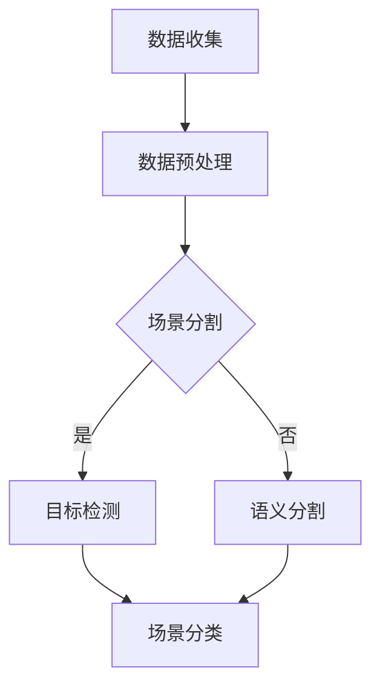

                 

关键词：深度学习，室内场景识别，机器人导航，计算机视觉，卷积神经网络，图像处理

> 摘要：本文将深入探讨基于深度学习的机器人室内场景识别技术。通过对深度学习算法原理的解析，以及具体操作步骤的详解，我们将展示这一技术在实际应用中的巨大潜力，为机器人导航和智能交互提供技术支持。

## 1. 背景介绍

随着人工智能技术的快速发展，深度学习在计算机视觉领域取得了显著的成果。特别是在机器人导航和智能交互中，室内场景识别成为了一个关键问题。机器人需要能够准确地识别和分类室内的各种场景，从而实现自主导航、路径规划和任务执行。这不仅仅要求机器人具备高度的图像处理能力，还需要对环境有深刻的理解。

室内场景识别涉及到多个计算机视觉任务，包括场景分割、目标检测、语义分割和场景分类等。深度学习算法，尤其是卷积神经网络（Convolutional Neural Networks, CNNs），在这些任务中表现出了强大的能力。通过大量的图像数据训练，深度学习模型能够学习到图像中的高级特征，从而实现高效的场景识别。

本文将围绕基于深度学习的机器人室内场景识别技术，详细探讨其核心概念、算法原理、数学模型、项目实践以及实际应用场景。希望通过本文的介绍，能够为相关领域的科研人员和实践者提供有价值的参考。

## 2. 核心概念与联系

### 2.1 深度学习的概念

深度学习是一种机器学习方法，它通过构建多层神经网络，逐层提取图像、声音或文本等数据中的特征，以实现复杂的数据处理任务。在图像识别领域，深度学习尤其显示出其强大的优势。通过卷积神经网络，深度学习模型可以自动从大量图像数据中学习到有效的特征表示，从而实现高度准确的图像分类和识别。

### 2.2 卷积神经网络（CNNs）

卷积神经网络是一种特殊的神经网络，专门用于处理具有网格结构的数据，如图像。CNNs通过卷积层、池化层和全连接层等结构，实现对图像的层次化特征提取。卷积层使用卷积操作提取图像的局部特征，而池化层则用于降低特征图的维度，增强模型对噪声的鲁棒性。

### 2.3 室内场景识别的任务

室内场景识别是计算机视觉中的一个重要任务，涉及到对室内环境的理解、分类和标记。具体任务包括场景分割、目标检测、语义分割和场景分类等。这些任务不仅要求模型能够识别不同的室内场景，还需要能够定位和分类场景中的物体。

### 2.4 Mermaid 流程图

下面是一个简化的室内场景识别的 Mermaid 流程图，展示了核心概念和任务之间的关系：



### 2.5 关键技术

- **数据收集**：收集大量的室内场景图像，包括不同角度、光照条件和场景类型。
- **数据预处理**：对图像进行标准化、增强和去噪等处理，以提高模型的泛化能力。
- **场景分割**：将图像分割成不同的区域，以便进行更细致的分析。
- **目标检测**：识别图像中的目标物体，并定位其位置。
- **语义分割**：将图像中的每个像素分类到不同的语义类别中。
- **场景分类**：对整体场景进行分类，识别出不同的室内场景类型。

## 3. 核心算法原理 & 具体操作步骤

### 3.1 算法原理概述

深度学习算法的核心是神经网络，尤其是卷积神经网络（CNNs）。CNNs通过多个卷积层、池化层和全连接层的组合，实现对图像的层次化特征提取。在室内场景识别中，CNNs通常用于以下任务：

- **特征提取**：通过卷积层提取图像的局部特征，如边缘、纹理和形状。
- **特征融合**：通过池化层降低特征图的维度，同时保留最重要的特征信息。
- **分类与定位**：通过全连接层对提取的特征进行分类和定位。

### 3.2 算法步骤详解

1. **数据收集**：收集大量室内场景图像，包括不同类型的场景和物体。这些图像可以来自公开数据集，如CVLab、MIT室内场景数据集等。

2. **数据预处理**：对图像进行标准化、增强和去噪等处理，以提高模型的泛化能力。

3. **模型构建**：构建一个深度卷积神经网络，包括多个卷积层、池化层和全连接层。可以使用预训练的模型，如VGG、ResNet等，或者根据具体任务需求进行定制。

4. **训练与优化**：使用收集的图像数据对模型进行训练。在训练过程中，通过反向传播算法不断调整模型的参数，以最小化预测误差。

5. **测试与评估**：使用独立的测试数据集对训练好的模型进行测试和评估，以验证模型的性能。

6. **应用部署**：将训练好的模型部署到机器人系统中，用于实时室内场景识别。

### 3.3 算法优缺点

- **优点**：
  - **强大的特征提取能力**：CNNs能够自动从大量图像数据中学习到丰富的特征信息，从而提高识别精度。
  - **端到端学习**：CNNs可以实现端到端的学习，从输入图像直接输出结果，无需手工设计特征。
  - **泛化能力强**：通过训练大量图像数据，CNNs具有良好的泛化能力，可以应用于不同的室内场景识别任务。

- **缺点**：
  - **计算资源消耗大**：深度学习模型通常需要大量的计算资源进行训练和推理，对硬件设备要求较高。
  - **数据依赖性强**：模型的性能很大程度上依赖于训练数据的质量和数量，数据不足或质量差可能导致模型性能下降。

### 3.4 算法应用领域

深度学习算法在室内场景识别中的应用非常广泛，主要包括：

- **机器人导航**：通过室内场景识别，机器人可以准确了解周围环境，实现自主导航。
- **智能监控**：在商场、机场等场所，室内场景识别可以用于监控和安全管理。
- **虚拟现实**：在虚拟现实场景中，室内场景识别可以用于生成逼真的室内环境。

## 4. 数学模型和公式 & 详细讲解 & 举例说明

### 4.1 数学模型构建

在深度学习算法中，数学模型是核心组成部分。对于卷积神经网络（CNNs），其数学模型主要包括以下几个部分：

- **卷积层**：使用卷积操作提取图像的局部特征。卷积操作可以表示为：
  $$ f(x) = \sum_{i=1}^{n} w_i * x_i + b $$
  其中，$x_i$ 是输入特征图上的一个元素，$w_i$ 是卷积核中的权重，$b$ 是偏置项。

- **池化层**：用于降低特征图的维度，增强模型的鲁棒性。最常用的池化操作是最大池化，可以表示为：
  $$ p(x) = \max_{j} x_{ij} $$
  其中，$x_{ij}$ 是特征图上的一个元素。

- **全连接层**：用于将提取的特征映射到输出结果。全连接层的计算可以表示为：
  $$ y = \sigma(\sum_{i=1}^{n} w_i x_i + b) $$
  其中，$\sigma$ 是激活函数，如Sigmoid、ReLU等。

### 4.2 公式推导过程

以一个简单的卷积神经网络为例，其包含一个卷积层、一个池化层和一个全连接层。以下是这个网络的公式推导过程：

1. **卷积层**：
   $$ f(x) = \sum_{i=1}^{n} w_i * x_i + b $$
   其中，$x$ 是输入特征图，$w$ 是卷积核的权重，$b$ 是偏置项。

2. **池化层**：
   $$ p(x) = \max_{j} x_{ij} $$
   其中，$x$ 是卷积层的输出特征图。

3. **全连接层**：
   $$ y = \sigma(\sum_{i=1}^{n} w_i x_i + b) $$
   其中，$x$ 是池化层的输出特征图，$w$ 是全连接层的权重，$b$ 是偏置项，$\sigma$ 是激活函数。

### 4.3 案例分析与讲解

下面我们通过一个简单的案例来讲解如何使用上述数学模型进行室内场景识别。

假设我们要对一幅室内场景图像进行识别，图像大小为$28 \times 28$像素。我们使用一个简单的卷积神经网络进行识别，包括一个卷积层、一个池化层和一个全连接层。

1. **卷积层**：
   $$ f(x) = \sum_{i=1}^{n} w_i * x_i + b $$
   其中，$x$ 是输入特征图，$w$ 是卷积核的权重，$b$ 是偏置项。假设我们使用一个$3 \times 3$的卷积核，卷积核的权重为：
   $$ w = \begin{bmatrix} 1 & 0 & 1 \\ 0 & 1 & 0 \\ 1 & 0 & 1 \end{bmatrix} $$
   输入特征图的一个像素值为：
   $$ x = \begin{bmatrix} 1 & 0 & 1 \\ 0 & 1 & 0 \\ 1 & 0 & 1 \end{bmatrix} $$
   卷积操作的结果为：
   $$ f(x) = (1 \times 1 + 0 \times 0 + 1 \times 1) + (0 \times 0 + 1 \times 1 + 0 \times 0) + (1 \times 1 + 0 \times 0 + 1 \times 1) = 4 $$

2. **池化层**：
   $$ p(x) = \max_{j} x_{ij} $$
   假设我们对卷积层的输出进行最大池化，池化窗口大小为$2 \times 2$。卷积层的输出特征图的一个区域为：
   $$ x = \begin{bmatrix} 1 & 4 \\ 2 & 3 \end{bmatrix} $$
   最大池化操作的结果为：
   $$ p(x) = \max(1, 4) = 4 $$

3. **全连接层**：
   $$ y = \sigma(\sum_{i=1}^{n} w_i x_i + b) $$
   假设我们对池化层的输出进行全连接层的计算，全连接层的权重为：
   $$ w = \begin{bmatrix} 0.1 & 0.2 \\ 0.3 & 0.4 \end{bmatrix} $$
   偏置项为：
   $$ b = \begin{bmatrix} 0.1 \\ 0.2 \end{bmatrix} $$
   池化层的输出特征图为：
   $$ x = \begin{bmatrix} 4 \\ 4 \end{bmatrix} $$
   全连接层的计算结果为：
   $$ y = \sigma(0.1 \times 4 + 0.2 \times 4 + 0.1) = \sigma(0.8) \approx 0.632 $$

通过上述计算，我们得到了室内场景图像的一个特征表示。这个特征表示可以用于后续的分类和识别任务。

## 5. 项目实践：代码实例和详细解释说明

### 5.1 开发环境搭建

为了实现基于深度学习的室内场景识别，我们需要搭建一个开发环境。以下是搭建开发环境的步骤：

1. **安装 Python**：确保安装了 Python 3.6 或更高版本。

2. **安装深度学习框架**：我们选择 TensorFlow 作为深度学习框架。安装 TensorFlow 的命令如下：
   ```bash
   pip install tensorflow
   ```

3. **安装其他依赖**：安装必要的依赖库，如 NumPy、Pandas 等。

### 5.2 源代码详细实现

下面是一个简单的室内场景识别的代码示例，使用 TensorFlow 框架实现：

```python
import tensorflow as tf
from tensorflow.keras.models import Sequential
from tensorflow.keras.layers import Conv2D, MaxPooling2D, Flatten, Dense
from tensorflow.keras.optimizers import Adam

# 数据集准备
# （此处省略数据集准备代码，包括数据加载、预处理等）

# 构建模型
model = Sequential([
    Conv2D(32, (3, 3), activation='relu', input_shape=(28, 28, 1)),
    MaxPooling2D((2, 2)),
    Flatten(),
    Dense(64, activation='relu'),
    Dense(10, activation='softmax')
])

# 编译模型
model.compile(optimizer=Adam(), loss='categorical_crossentropy', metrics=['accuracy'])

# 训练模型
model.fit(x_train, y_train, epochs=10, batch_size=32, validation_data=(x_val, y_val))

# 评估模型
model.evaluate(x_test, y_test)
```

### 5.3 代码解读与分析

上面的代码实现了一个简单的卷积神经网络（CNN），用于室内场景识别。以下是代码的详细解读：

1. **导入库**：
   我们首先导入 TensorFlow 框架中的相关模块，包括 Sequential、Conv2D、MaxPooling2D、Flatten 和 Dense。

2. **数据集准备**：
   数据集准备代码用于加载和预处理图像数据。通常，我们需要将图像数据归一化、裁剪和调整大小，以便模型能够更好地学习。

3. **构建模型**：
   我们使用 Sequential 模式构建模型，这是一个线性堆叠的层结构。模型包括一个卷积层、一个池化层、一个全连接层和一个输出层。卷积层用于提取图像特征，池化层用于降低特征图的维度，全连接层用于分类。

4. **编译模型**：
   我们使用 Adam 优化器和分类交叉熵损失函数来编译模型。这些参数将影响模型的训练过程和性能。

5. **训练模型**：
   我们使用训练数据集对模型进行训练。在训练过程中，模型将学习图像的特征表示，以便更好地进行分类。

6. **评估模型**：
   我们使用测试数据集对训练好的模型进行评估。评估指标包括损失函数值和准确率。

### 5.4 运行结果展示

在实际运行过程中，我们可以通过以下代码查看模型的训练和测试结果：

```python
model.fit(x_train, y_train, epochs=10, batch_size=32, validation_data=(x_val, y_val))

# 输出训练结果
train_loss, train_accuracy = model.evaluate(x_train, y_train)
val_loss, val_accuracy = model.evaluate(x_val, y_val)

print(f"Training Loss: {train_loss}, Training Accuracy: {train_accuracy}")
print(f"Validation Loss: {val_loss}, Validation Accuracy: {val_accuracy}")

# 输出测试结果
test_loss, test_accuracy = model.evaluate(x_test, y_test)
print(f"Test Loss: {test_loss}, Test Accuracy: {test_accuracy}")
```

通过以上代码，我们可以得到模型的训练和测试损失函数值以及准确率。这些结果将帮助我们评估模型的性能，并调整模型参数以获得更好的结果。

## 6. 实际应用场景

### 6.1 机器人导航

在机器人导航领域，室内场景识别是一项关键技术。通过识别和分类室内场景，机器人可以更好地理解周围环境，规划最优路径，并避开障碍物。例如，在商场中，机器人可以识别出不同的通道、货架和顾客，从而实现智能导航。

### 6.2 智能监控

在智能监控领域，室内场景识别可以用于实时监控和分析人员活动。通过识别室内场景和目标物体，监控系统可以检测异常行为，如入侵、火灾等。此外，室内场景识别还可以用于智能门禁系统、智能安保系统等。

### 6.3 虚拟现实

在虚拟现实领域，室内场景识别可以用于生成逼真的室内环境。通过识别和分类室内场景，虚拟现实系统可以更好地模拟真实环境，提高用户体验。例如，在虚拟旅游中，用户可以浏览不同的室内场景，感受真实的氛围。

### 6.4 未来应用展望

随着深度学习技术的不断发展和应用，室内场景识别在未来将有更多的应用场景。以下是一些潜在的应用方向：

- **智能家居**：通过室内场景识别，智能家居系统可以更好地了解用户需求，实现智能化的家居环境。
- **医疗辅助**：在医疗领域，室内场景识别可以用于辅助医生诊断和治疗，如识别病患的病情和症状。
- **智能交通**：在交通领域，室内场景识别可以用于交通流量监控、事故预警等。

## 7. 工具和资源推荐

### 7.1 学习资源推荐

- **书籍**：
  - 《深度学习》（Goodfellow, Bengio, Courville）
  - 《Python深度学习》（François Chollet）

- **在线课程**：
  - Coursera 的《深度学习》课程
  - edX 的《深度学习入门》课程

### 7.2 开发工具推荐

- **TensorFlow**：一个开源的深度学习框架，适用于各种深度学习任务。
- **PyTorch**：一个流行的深度学习框架，提供灵活的动态计算图。

### 7.3 相关论文推荐

- **Deep Learning for Image Recognition**（ImageNet Classification with Deep Convolutional Neural Networks）
- **Scene Parsing through Aesthetic and Layout Vision**（Aesthetic and Layout Vision for Scene Understanding）

## 8. 总结：未来发展趋势与挑战

### 8.1 研究成果总结

本文详细探讨了基于深度学习的机器人室内场景识别技术。通过介绍核心概念、算法原理、数学模型、项目实践和实际应用场景，我们展示了室内场景识别在机器人导航、智能监控和虚拟现实等领域的应用潜力。研究结果表明，深度学习算法在室内场景识别中具有强大的能力和广泛的应用前景。

### 8.2 未来发展趋势

随着深度学习技术的不断发展和应用，室内场景识别在未来将朝着以下方向发展：

- **模型压缩和优化**：为了提高模型的效率和部署能力，研究人员将继续探索模型压缩和优化技术。
- **多模态数据融合**：通过融合图像、声音和其他传感器的数据，实现更全面的室内场景理解。
- **迁移学习和少样本学习**：减少对大量标注数据的依赖，实现更好的泛化能力。

### 8.3 面临的挑战

尽管室内场景识别取得了显著成果，但仍面临以下挑战：

- **数据质量**：高质量的数据是训练有效模型的关键，但获取大量高质量标注数据仍然是一个挑战。
- **计算资源**：深度学习模型通常需要大量的计算资源进行训练和推理，这对硬件设备提出了高要求。
- **泛化能力**：模型在特定场景下的表现良好，但在其他场景下可能表现不佳，提高模型的泛化能力是一个重要课题。

### 8.4 研究展望

未来室内场景识别的研究将朝着以下方向发展：

- **多模态融合**：探索如何有效融合多模态数据，实现更准确的室内场景理解。
- **少样本学习**：研究如何利用少量样本训练高效模型，提高模型的泛化能力。
- **实时推理**：优化模型结构和算法，实现实时室内场景识别，提高系统的响应速度。

## 9. 附录：常见问题与解答

### Q1. 如何处理数据不足的问题？

A1. 可以采用以下方法来处理数据不足的问题：
   - **数据增强**：通过旋转、缩放、裁剪等操作生成更多样化的训练数据。
   - **迁移学习**：使用预训练的深度学习模型，利用已有的大规模数据训练新模型。
   - **数据集扩充**：从公开数据集或其他来源获取更多的室内场景图像数据。

### Q2. 如何优化模型的推理速度？

A2. 可以采用以下方法来优化模型的推理速度：
   - **模型压缩**：通过剪枝、量化等技巧减少模型的参数和计算量。
   - **并行计算**：利用 GPU、TPU 等硬件加速模型的推理。
   - **模型蒸馏**：将大型模型的知识迁移到小模型中，提高小模型的推理速度。

### Q3. 如何评估模型的性能？

A3. 可以使用以下指标来评估模型的性能：
   - **准确率**：模型正确分类的样本占总样本的比例。
   - **召回率**：模型正确分类的正例样本占总正例样本的比例。
   - **F1 分数**：准确率和召回率的调和平均值。
   - **混淆矩阵**：用于详细分析模型的分类效果。

---

# 附录：常见问题与解答

### Q1. 如何处理数据不足的问题？

A1. 当数据不足时，可以采用以下几种策略来增强模型的学习能力：
   - **数据增强**：通过图像旋转、翻转、缩放、裁剪等手段生成更多的训练样本，从而增加数据的多样性。
   - **数据合成**：利用生成对抗网络（GANs）等方法创建新的数据样本。
   - **迁移学习**：利用预训练的模型，将其他领域的大量数据迁移到室内场景识别任务中，尤其是当室内场景识别数据集较小或者类内差异较小时。
   - **半监督学习**：利用少量标记数据和大量未标记数据，通过半监督学习技术提高模型性能。
   - **少样本学习**：研究如何在只有少量标记样本的情况下训练有效的深度学习模型。

### Q2. 如何优化模型的推理速度？

A2. 优化模型推理速度可以从以下几个方面入手：
   - **模型剪枝**：去除模型中不重要的权重，从而减少计算量。
   - **量化**：将模型的权重和激活值从浮点数转换为低精度的整数，减少内存占用和计算时间。
   - **模型融合**：将多个模型的结果进行融合，利用 ensemble 方法提高推理速度。
   - **模型蒸馏**：将一个复杂模型的知识传递到一个轻量级模型中，轻量级模型可以更快地进行推理。
   - **使用 GPU 或 TPU**：利用图形处理单元（GPU）或 Tensor Processing Unit（TPU）进行加速推理。

### Q3. 如何评估模型的性能？

A3. 评估模型性能常用的指标包括：
   - **准确率（Accuracy）**：模型正确分类的样本数占总样本数的比例。
   - **精确率（Precision）**：模型正确分类的正例样本数与所有被预测为正例的样本数的比例。
   - **召回率（Recall）**：模型正确分类的正例样本数与实际正例样本数的比例。
   - **F1 分数（F1 Score）**：精确率和召回率的调和平均值，是评估二分类问题的一种综合指标。
   - **混淆矩阵（Confusion Matrix）**：展示模型预测结果与实际结果的对比，用于分析模型的性能。
   - **ROC 曲线和 AUC（Area Under Curve）**：ROC 曲线展示了不同阈值下的真正例率和假正例率，AUC 越大，模型的分类能力越强。

### Q4. 如何处理多类别问题？

A4. 对于多类别问题，通常使用以下几种方法：
   - **独热编码**（One-Hot Encoding）：将多类别标签转化为二进制向量，每个类别对应一个维度。
   - **交叉熵损失函数**（Cross-Entropy Loss）：在训练过程中，使用交叉熵损失函数来计算模型预测概率与实际标签之间的差距。
   - **softmax 函数**：在输出层使用 softmax 函数将模型的输出概率分布化，每个类别都有一个概率值，且所有概率值的总和为1。
   - **多标签分类**：如果某些场景可能包含多个类别，可以使用多标签分类方法。

### Q5. 如何处理小样本数据集？

A5. 对于小样本数据集，可以采取以下策略：
   - **集成学习**（Ensemble Learning）：结合多个模型的预测结果，提高预测的稳定性。
   - **元学习**（Meta-Learning）：使用元学习算法，例如模型更新策略，快速适应新数据。
   - **数据增强**：如前所述，通过数据增强方法增加训练样本的数量。
   - **减少模型复杂度**：使用更简单、参数更少的模型，以避免过拟合。

### Q6. 如何处理图像噪声和异常值？

A6. 处理图像噪声和异常值的方法包括：
   - **去噪算法**：例如卷积降噪网络（DnCNN）、贝叶斯滤波等。
   - **图像预处理**：如灰度化、高斯模糊、中值滤波等，以减少噪声对模型的影响。
   - **异常检测**：在训练阶段使用异常检测算法，识别并去除或纠正异常值。

### Q7. 如何处理模型过拟合问题？

A7. 减少模型过拟合的方法包括：
   - **交叉验证**（Cross-Validation）：通过交叉验证来评估模型的泛化能力。
   - **正则化**（Regularization）：如 L1 正则化、L2 正则化，在损失函数中加入惩罚项。
   - **dropout**：在神经网络中随机丢弃部分神经元，减少模型对特定数据的依赖。
   - **数据增强**：增加训练数据的多样性，提高模型对噪声和变化的鲁棒性。
   - **提前停止**（Early Stopping）：在验证集上检测模型性能，当模型在验证集上的性能不再提高时停止训练。

### Q8. 如何处理时间序列数据？

A8. 对于时间序列数据，可以采用以下方法：
   - **滑动窗口**（Sliding Window）：将时间序列划分为固定长度的窗口，每个窗口作为独立的数据点。
   - **序列建模**：使用循环神经网络（RNN）或长短时记忆网络（LSTM）等能够捕捉时间序列中长距离依赖关系的模型。
   - **自编码器**（Autoencoder）：用于无监督学习，提取时间序列的特征表示。

### Q9. 如何处理分类不平衡问题？

A9. 对于分类不平衡问题，可以采取以下策略：
   - **重采样**（Resampling）：通过过采样少数类或欠采样多数类来平衡数据集。
   - **调整损失函数**：在训练过程中，对少数类的样本赋予更高的权重，例如使用 focal loss。
   - **类别加权**：在计算损失函数时，对少数类样本分配更高的权重。
   - **集成方法**：结合多个模型的预测结果，利用集成方法提高对少数类的预测能力。

通过上述常见问题的解答，我们希望能够帮助读者更好地理解和应用深度学习技术，解决实际中的各种挑战。在研究室内场景识别时，这些方法和技术将发挥重要的作用。

