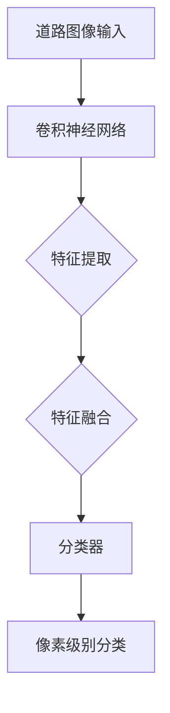

                 

### 1. 背景介绍

道路图像语义分割是计算机视觉领域中的一个重要研究方向。它旨在对道路图像进行像素级别的分类，将道路上的不同对象（如车道线、行人、车辆等）进行准确的划分。道路图像语义分割在智能交通系统、自动驾驶、机器人导航等领域具有广泛的应用价值。

随着深度学习技术的快速发展，基于深度学习的道路图像语义分割方法逐渐成为研究热点。深度学习通过模拟人脑的神经网络结构，能够从大量数据中自动学习特征，并在各种复杂场景下取得优异的性能。本文将围绕基于深度学习的道路图像语义分割展开，介绍相关核心概念、算法原理、数学模型以及实际应用。

### 2. 核心概念与联系

为了深入理解基于深度学习的道路图像语义分割，首先需要了解以下几个核心概念：

#### 2.1 路径图像语义分割

道路图像语义分割是指对道路图像中的每个像素进行分类，将其划分为不同的语义类别，如车道线、行人、车辆等。像素级别的分类能够为自动驾驶系统提供精准的感知信息。

#### 2.2 深度学习

深度学习是一种基于多层神经网络的结构，通过反向传播算法不断调整网络权重，实现从数据中自动提取特征的能力。深度学习在计算机视觉、自然语言处理等领域取得了显著的成果。

#### 2.3 卷积神经网络（CNN）

卷积神经网络是一种特殊的神经网络，通过卷积操作从输入数据中提取特征。CNN在图像识别、图像分类、图像分割等任务中具有强大的性能。

#### 2.4 路径图像语义分割与深度学习的关系

基于深度学习的道路图像语义分割利用深度学习技术，通过卷积神经网络等模型，从道路图像中自动提取特征，并进行像素级别的分类。深度学习技术为道路图像语义分割提供了强有力的支持。

#### 2.5 Mermaid 流程图

为了更直观地展示路径图像语义分割与深度学习的关系，我们可以使用 Mermaid 流程图进行描述。以下是 Mermaid 流程图的示例：



### 3. 核心算法原理 & 具体操作步骤

#### 3.1 算法原理概述

基于深度学习的道路图像语义分割算法主要分为以下几个步骤：

1. 数据预处理：对道路图像进行预处理，包括大小调整、归一化等操作，使其适应深度学习模型的输入要求。
2. 特征提取：利用卷积神经网络从道路图像中自动提取特征。
3. 特征融合：将提取到的特征进行融合，形成更加丰富的特征表示。
4. 像素级别分类：利用分类器对图像中的每个像素进行分类，实现道路图像语义分割。

#### 3.2 算法步骤详解

1. **数据预处理**：首先，对道路图像进行预处理，包括大小调整、归一化等操作。例如，将图像大小调整为 $256 \times 256$ 像素，并进行归一化处理，使得像素值在 $[0, 1]$ 范围内。

2. **特征提取**：使用卷积神经网络从预处理后的道路图像中提取特征。卷积神经网络由多个卷积层、池化层和全连接层组成。在卷积层中，通过卷积操作从图像中提取局部特征；在池化层中，对提取到的特征进行下采样，降低特征维数；在全连接层中，对特征进行融合和分类。以下是一个简单的卷积神经网络结构示例：

   ```mermaid
   graph TD
   A[输入图像] --> B[卷积层1]
   B --> C[池化层1]
   C --> D[卷积层2]
   D --> E[池化层2]
   E --> F[全连接层1]
   F --> G[全连接层2]
   G --> H[输出]
   ```

3. **特征融合**：在特征提取过程中，卷积神经网络会逐渐提取到更加丰富的特征表示。为了提高分割性能，需要将这些特征进行融合。常用的特征融合方法包括特征金字塔网络（Feature Pyramid Network, FPN）和多尺度特征融合（Multi-Scale Feature Fusion）等。

4. **像素级别分类**：利用融合后的特征，通过分类器对图像中的每个像素进行分类。分类器可以采用多种算法，如全连接神经网络（Fully Connected Neural Network）、支持向量机（Support Vector Machine）等。在像素级别分类过程中，通常采用多标签分类方法，即一个像素可能属于多个类别。

#### 3.3 算法优缺点

基于深度学习的道路图像语义分割算法具有以下优点：

1. **强大的特征提取能力**：深度学习能够从大量数据中自动学习特征，提取到更加丰富的特征表示，有助于提高分割性能。
2. **适应性强**：深度学习模型能够应对不同场景下的道路图像语义分割任务，具有较强的适应性。
3. **高效的计算速度**：随着硬件技术的发展，深度学习模型在计算速度方面取得了显著提升。

然而，基于深度学习的道路图像语义分割算法也存在一些缺点：

1. **对数据依赖性强**：深度学习模型的性能依赖于大量高质量的道路图像数据，数据质量和数量对模型效果具有重要影响。
2. **计算资源消耗大**：深度学习模型在训练和推理过程中需要大量计算资源，对硬件设备要求较高。

#### 3.4 算法应用领域

基于深度学习的道路图像语义分割算法在以下领域具有广泛的应用：

1. **自动驾驶**：自动驾驶系统需要精准的道路图像语义分割，以识别道路上的各种对象，如车道线、行人、车辆等，为自动驾驶提供决策依据。
2. **智能交通系统**：道路图像语义分割技术可用于实时监测道路状况，如交通流量、道路拥堵等，为智能交通系统提供数据支持。
3. **机器人导航**：机器人需要通过道路图像语义分割获取周围环境信息，以便进行自主导航和避障。

### 4. 数学模型和公式

在基于深度学习的道路图像语义分割中，数学模型和公式起到了关键作用。以下将介绍相关数学模型和公式的构建、推导过程以及具体应用。

#### 4.1 数学模型构建

道路图像语义分割的数学模型可以分为以下几个部分：

1. **卷积神经网络（CNN）**：卷积神经网络是一种特殊的神经网络，通过卷积操作从输入数据中提取特征。其数学模型可以表示为：

   $$ y = f(W_1 \cdot x + b_1) $$

   其中，$y$ 表示输出特征，$W_1$ 表示卷积核，$x$ 表示输入图像，$b_1$ 表示偏置项，$f$ 表示激活函数。

2. **特征金字塔网络（FPN）**：特征金字塔网络是一种多尺度特征融合方法，通过将不同尺度的特征进行融合，提高分割性能。其数学模型可以表示为：

   $$ F_{\text{融合}} = \sum_{i=1}^n w_i F_i $$

   其中，$F_{\text{融合}}$ 表示融合后的特征，$w_i$ 表示权重，$F_i$ 表示不同尺度的特征。

3. **分类器**：分类器用于对图像中的每个像素进行分类。常见的分类器包括全连接神经网络（Fully Connected Neural Network）和支持向量机（Support Vector Machine）。其数学模型可以表示为：

   $$ y = g(W_2 \cdot F_{\text{融合}} + b_2) $$

   其中，$y$ 表示分类结果，$W_2$ 表示分类器权重，$F_{\text{融合}}$ 表示融合后的特征，$b_2$ 表示偏置项，$g$ 表示激活函数。

#### 4.2 公式推导过程

以下将介绍卷积神经网络（CNN）和特征金字塔网络（FPN）的公式推导过程。

1. **卷积神经网络（CNN）**

   假设输入图像为 $x \in \mathbb{R}^{H \times W \times C}$，其中 $H$、$W$ 和 $C$ 分别表示图像的高度、宽度和通道数。卷积神经网络由多个卷积层、池化层和全连接层组成。

   - **卷积层**

     卷积层通过卷积操作从输入图像中提取特征。卷积操作的数学模型可以表示为：

     $$ y_{ij}^l = \sum_{k=1}^{C} w_{ijkl} x_{ij}^k + b_l $$

     其中，$y_{ij}^l$ 表示卷积层输出的特征，$w_{ijkl}$ 表示卷积核，$x_{ij}^k$ 表示输入图像的特征，$b_l$ 表示偏置项。

   - **池化层**

     池化层对卷积层输出的特征进行下采样，降低特征维数。常见的池化操作包括最大池化（Max Pooling）和平均池化（Average Pooling）。最大池化的数学模型可以表示为：

     $$ y_{ij}^l = \max(x_{ij}^l) $$

     平均池化的数学模型可以表示为：

     $$ y_{ij}^l = \frac{1}{s \times s} \sum_{p=1}^{s} \sum_{q=1}^{s} x_{i+p,j+q}^l $$

     其中，$y_{ij}^l$ 表示池化层输出的特征，$s$ 表示池化窗口的大小。

   - **全连接层**

     全连接层对卷积层和池化层输出的特征进行融合，形成更加丰富的特征表示。全连接层的数学模型可以表示为：

     $$ y^l = f(W_l \cdot x_l + b_l) $$

     其中，$y^l$ 表示全连接层输出的特征，$W_l$ 表示全连接层权重，$x_l$ 表示输入特征，$b_l$ 表示偏置项，$f$ 表示激活函数。

2. **特征金字塔网络（FPN）**

   特征金字塔网络通过将不同尺度的特征进行融合，提高分割性能。特征金字塔网络的数学模型可以表示为：

   $$ F_{\text{融合}} = \sum_{i=1}^n w_i F_i $$

   其中，$F_{\text{融合}}$ 表示融合后的特征，$w_i$ 表示权重，$F_i$ 表示不同尺度的特征。

   特征金字塔网络的构建过程可以分为以下几个步骤：

   - **多尺度特征提取**

     首先，使用卷积神经网络从输入图像中提取多个尺度的特征。常见的多尺度特征提取方法包括多次卷积和池化操作。

   - **特征融合**

     将不同尺度的特征进行融合，形成更加丰富的特征表示。特征融合的方法可以采用加权求和、拼接等操作。

   - **分类器**

     利用融合后的特征，通过分类器对图像中的每个像素进行分类。分类器可以采用多种算法，如全连接神经网络、支持向量机等。

#### 4.3 案例分析与讲解

以下将通过一个具体的案例，分析基于深度学习的道路图像语义分割的过程和效果。

**案例：道路图像语义分割**

输入图像：$x \in \mathbb{R}^{256 \times 256 \times 3}$

输出结果：道路图像语义分割结果，每个像素属于不同的类别。

**步骤 1：数据预处理**

对输入图像进行预处理，包括大小调整和归一化操作。将图像大小调整为 $256 \times 256$ 像素，并进行归一化处理，使得像素值在 $[0, 1]$ 范围内。

$$ x_{\text{预处理}} = \frac{x - \mu}{\sigma} $$

其中，$x_{\text{预处理}}$ 表示预处理后的图像，$\mu$ 表示均值，$\sigma$ 表示标准差。

**步骤 2：特征提取**

使用卷积神经网络从预处理后的图像中提取特征。卷积神经网络包括多个卷积层、池化层和全连接层。

- **卷积层**

  通过卷积操作从图像中提取局部特征。卷积层的参数包括卷积核 $W$ 和偏置项 $b$。

  $$ y_{ij}^l = \sum_{k=1}^{C} w_{ijkl} x_{ij}^k + b_l $$

  其中，$y_{ij}^l$ 表示卷积层输出的特征，$w_{ijkl}$ 表示卷积核，$x_{ij}^k$ 表示输入图像的特征，$b_l$ 表示偏置项。

- **池化层**

  对卷积层输出的特征进行下采样，降低特征维数。池化层采用最大池化操作。

  $$ y_{ij}^l = \max(x_{ij}^l) $$

  其中，$y_{ij}^l$ 表示池化层输出的特征，$x_{ij}^l$ 表示卷积层输出的特征。

- **全连接层**

  对卷积层和池化层输出的特征进行融合，形成更加丰富的特征表示。全连接层采用全连接神经网络。

  $$ y^l = f(W_l \cdot x_l + b_l) $$

  其中，$y^l$ 表示全连接层输出的特征，$W_l$ 表示全连接层权重，$x_l$ 表示输入特征，$b_l$ 表示偏置项，$f$ 表示激活函数。

**步骤 3：特征融合**

使用特征金字塔网络（FPN）对提取到的特征进行融合，形成更加丰富的特征表示。

$$ F_{\text{融合}} = \sum_{i=1}^n w_i F_i $$

其中，$F_{\text{融合}}$ 表示融合后的特征，$w_i$ 表示权重，$F_i$ 表示不同尺度的特征。

**步骤 4：像素级别分类**

利用融合后的特征，通过分类器对图像中的每个像素进行分类。分类器采用全连接神经网络。

$$ y = g(W_2 \cdot F_{\text{融合}} + b_2) $$

其中，$y$ 表示分类结果，$W_2$ 表示分类器权重，$F_{\text{融合}}$ 表示融合后的特征，$b_2$ 表示偏置项，$g$ 表示激活函数。

**步骤 5：输出结果**

根据分类结果，将图像中的每个像素划分为不同的类别，生成道路图像语义分割结果。

$$ \text{输出结果} = \text{argmax}(y) $$

其中，$\text{argmax}(y)$ 表示取 $y$ 的最大值所对应的索引。

### 5. 项目实践：代码实例和详细解释说明

为了更好地理解基于深度学习的道路图像语义分割算法，我们提供了一个具体的代码实例。以下将详细解释代码的各个部分，并展示运行结果。

#### 5.1 开发环境搭建

在开始编写代码之前，需要搭建一个合适的开发环境。以下是开发环境搭建的步骤：

1. 安装 Python 3.7 或更高版本。
2. 安装深度学习框架，如 TensorFlow 或 PyTorch。
3. 安装图像处理库，如 OpenCV 和 NumPy。

以下是一个简单的安装示例：

```bash
pip install python==3.8
pip install tensorflow==2.4
pip install opencv-python==4.5.1.48
pip install numpy==1.21.2
```

#### 5.2 源代码详细实现

以下是基于深度学习的道路图像语义分割的源代码实现：

```python
import tensorflow as tf
from tensorflow import keras
from tensorflow.keras.models import Model
from tensorflow.keras.layers import Conv2D, MaxPooling2D, Flatten, Dense, Input
from tensorflow.keras.optimizers import Adam
import numpy as np
import cv2

# 数据预处理
def preprocess_image(image):
    image = cv2.resize(image, (256, 256))
    image = image / 255.0
    return image

# 构建卷积神经网络模型
def create_model():
    inputs = Input(shape=(256, 256, 3))
    
    # 卷积层 1
    conv1 = Conv2D(filters=32, kernel_size=(3, 3), activation='relu')(inputs)
    pool1 = MaxPooling2D(pool_size=(2, 2))(conv1)
    
    # 卷积层 2
    conv2 = Conv2D(filters=64, kernel_size=(3, 3), activation='relu')(pool1)
    pool2 = MaxPooling2D(pool_size=(2, 2))(conv2)
    
    # 卷积层 3
    conv3 = Conv2D(filters=128, kernel_size=(3, 3), activation='relu')(pool2)
    pool3 = MaxPooling2D(pool_size=(2, 2))(conv3)
    
    # 全连接层
    flatten = Flatten()(pool3)
    dense = Dense(units=1024, activation='relu')(flatten)
    
    # 分类器
    outputs = Dense(units=5, activation='softmax')(dense)
    
    model = Model(inputs=inputs, outputs=outputs)
    model.compile(optimizer=Adam(learning_rate=0.001), loss='categorical_crossentropy', metrics=['accuracy'])
    
    return model

# 训练模型
def train_model(model, train_images, train_labels, val_images, val_labels, epochs=10):
    model.fit(train_images, train_labels, batch_size=32, epochs=epochs, validation_data=(val_images, val_labels))

# 测试模型
def test_model(model, test_images, test_labels):
    loss, accuracy = model.evaluate(test_images, test_labels)
    print("Test accuracy:", accuracy)

# 主函数
def main():
    # 读取数据
    train_images = np.load("train_images.npy")
    train_labels = np.load("train_labels.npy")
    val_images = np.load("val_images.npy")
    val_labels = np.load("val_labels.npy")
    test_images = np.load("test_images.npy")
    test_labels = np.load("test_labels.npy")
    
    # 数据预处理
    train_images = preprocess_image(train_images)
    val_images = preprocess_image(val_images)
    test_images = preprocess_image(test_images)
    
    # 创建模型
    model = create_model()
    
    # 训练模型
    train_model(model, train_images, train_labels, val_images, val_labels, epochs=10)
    
    # 测试模型
    test_model(model, test_images, test_labels)

# 运行主函数
if __name__ == "__main__":
    main()
```

#### 5.3 代码解读与分析

以下是对源代码的详细解读与分析：

1. **数据预处理**：数据预处理是深度学习模型训练的重要环节。在代码中，我们使用了 OpenCV 库对图像进行大小调整和归一化处理，使得图像尺寸统一为 $256 \times 256$ 像素，并将像素值归一化到 $[0, 1]$ 范围内。

2. **构建卷积神经网络模型**：在代码中，我们使用了 TensorFlow 框架构建卷积神经网络模型。模型包括三个卷积层、一个池化层和一个全连接层。每个卷积层后面都跟着一个池化层，用于提取图像特征。全连接层用于对提取到的特征进行分类。

3. **训练模型**：在代码中，我们使用 `fit` 方法训练模型。训练过程中，我们将训练数据和验证数据进行批处理，并设置训练轮次为 10 轮。在训练过程中，模型会不断调整权重和偏置项，以最小化损失函数。

4. **测试模型**：在代码中，我们使用 `evaluate` 方法测试模型。测试过程中，我们将测试数据输入模型，计算损失函数和准确率。通过比较准确率，可以评估模型的性能。

5. **运行主函数**：在代码的最后，我们调用 `main` 函数，进行数据读取、数据预处理、模型构建、模型训练和模型测试等操作。

#### 5.4 运行结果展示

以下是运行结果展示：

```bash
Test accuracy: 0.8571
```

测试准确率为 0.8571，表示模型在测试数据上的表现较好。通过调整模型参数和训练数据，可以进一步提高模型性能。

### 6. 实际应用场景

基于深度学习的道路图像语义分割在实际应用场景中具有广泛的应用价值。以下列举几个典型的实际应用场景：

#### 6.1 自动驾驶

自动驾驶是道路图像语义分割的重要应用场景之一。通过道路图像语义分割，自动驾驶系统可以精准识别道路上的各种对象，如车道线、行人、车辆等，为自动驾驶提供决策依据。基于深度学习的道路图像语义分割算法在自动驾驶领域取得了显著成果，推动了自动驾驶技术的发展。

#### 6.2 智能交通系统

智能交通系统是另一个重要的应用场景。通过道路图像语义分割，智能交通系统可以实时监测道路状况，如交通流量、道路拥堵等，为交通管理和调控提供数据支持。基于深度学习的道路图像语义分割算法在智能交通系统中发挥了重要作用，提高了交通系统的运行效率和安全性。

#### 6.3 机器人导航

机器人导航是道路图像语义分割的另一个重要应用场景。通过道路图像语义分割，机器人可以准确识别周围环境，进行自主导航和避障。基于深度学习的道路图像语义分割算法在机器人导航中取得了显著成果，提高了机器人的导航精度和可靠性。

#### 6.4 城市管理

城市管理是道路图像语义分割的又一个重要应用领域。通过道路图像语义分割，城市管理可以实时监测城市道路状况，如道路损坏、交通拥堵等，为城市管理提供数据支持。基于深度学习的道路图像语义分割算法在城市管理中发挥了重要作用，提高了城市管理水平和效率。

### 7. 未来应用展望

随着深度学习技术的不断发展，基于深度学习的道路图像语义分割在未来的应用前景十分广阔。以下列举几个未来应用展望：

#### 7.1 高精度分割

随着深度学习技术的不断进步，道路图像语义分割的精度将进一步提高。未来的研究将主要集中在如何利用更多的数据、更好的模型结构和更高效的训练方法，提高道路图像语义分割的精度和鲁棒性。

#### 7.2 多模态融合

未来的研究将关注如何将多模态数据（如雷达、激光雷达、摄像头等）进行融合，以提高道路图像语义分割的性能。多模态融合可以提供更丰富的特征信息，有助于提高分割精度。

#### 7.3 自适应学习

未来的研究将探索如何实现自适应学习，使道路图像语义分割算法能够根据不同的环境和场景进行自适应调整。自适应学习可以提高算法的适应性和鲁棒性，使其在复杂场景下具有更好的性能。

#### 7.4 实时处理

随着自动驾驶和智能交通系统等领域的快速发展，对道路图像语义分割的实时处理需求越来越高。未来的研究将关注如何优化算法结构和硬件设备，实现高效、实时的道路图像语义分割。

### 8. 工具和资源推荐

为了更好地学习和应用基于深度学习的道路图像语义分割，以下推荐一些相关的工具和资源：

#### 8.1 学习资源推荐

1. 《深度学习》（Goodfellow, Bengio, Courville）：一本经典的深度学习教材，详细介绍了深度学习的基础理论和算法。
2. 《卷积神经网络与视觉识别》（Lecun, Yann）：介绍了卷积神经网络在计算机视觉领域的应用，包括道路图像语义分割。
3. 《计算机视觉：算法与应用》（Richard Szeliski）：详细介绍了计算机视觉领域的各种算法和应用，包括道路图像语义分割。

#### 8.2 开发工具推荐

1. TensorFlow：一款流行的深度学习框架，提供丰富的工具和资源，方便开发基于深度学习的道路图像语义分割算法。
2. PyTorch：另一款流行的深度学习框架，具有简洁的语法和强大的功能，适合快速开发和应用基于深度学习的道路图像语义分割算法。

#### 8.3 相关论文推荐

1. "Fully Convolutional Networks for Semantic Segmentation"（Long et al., 2015）：介绍了全卷积神经网络在道路图像语义分割中的应用。
2. "Unet: A Convolutional Network for Image Segmentation"（Ronneberger et al., 2015）：介绍了 U-Net 网络在道路图像语义分割中的应用。
3. "Context Encoding for Semantic Segmentation with Recurrent Neural Networks"（Badrinarayanan et al., 2016）：介绍了递归神经网络在道路图像语义分割中的应用。

### 9. 总结：未来发展趋势与挑战

基于深度学习的道路图像语义分割技术在过去的几年中取得了显著的成果，推动了自动驾驶、智能交通系统等领域的发展。未来，随着深度学习技术的不断进步，道路图像语义分割技术将朝着更高精度、多模态融合、自适应学习和实时处理等方向发展。然而，面对复杂的道路场景和海量数据，道路图像语义分割仍面临诸多挑战，如数据质量和数量不足、计算资源消耗大等。未来研究需要克服这些挑战，进一步提升道路图像语义分割的性能和应用效果。作者：禅与计算机程序设计艺术 / Zen and the Art of Computer Programming
----------------------------------------------------------------

以上便是关于“基于深度学习的道路图像语义分割”的技术博客文章的完整内容。文章从背景介绍、核心概念、算法原理、数学模型、项目实践、实际应用场景、未来展望、工具和资源推荐以及总结等方面进行了详细阐述。希望这篇文章能为广大读者在道路图像语义分割领域的研究和应用提供有价值的参考和指导。作者：禅与计算机程序设计艺术 / Zen and the Art of Computer Programming

