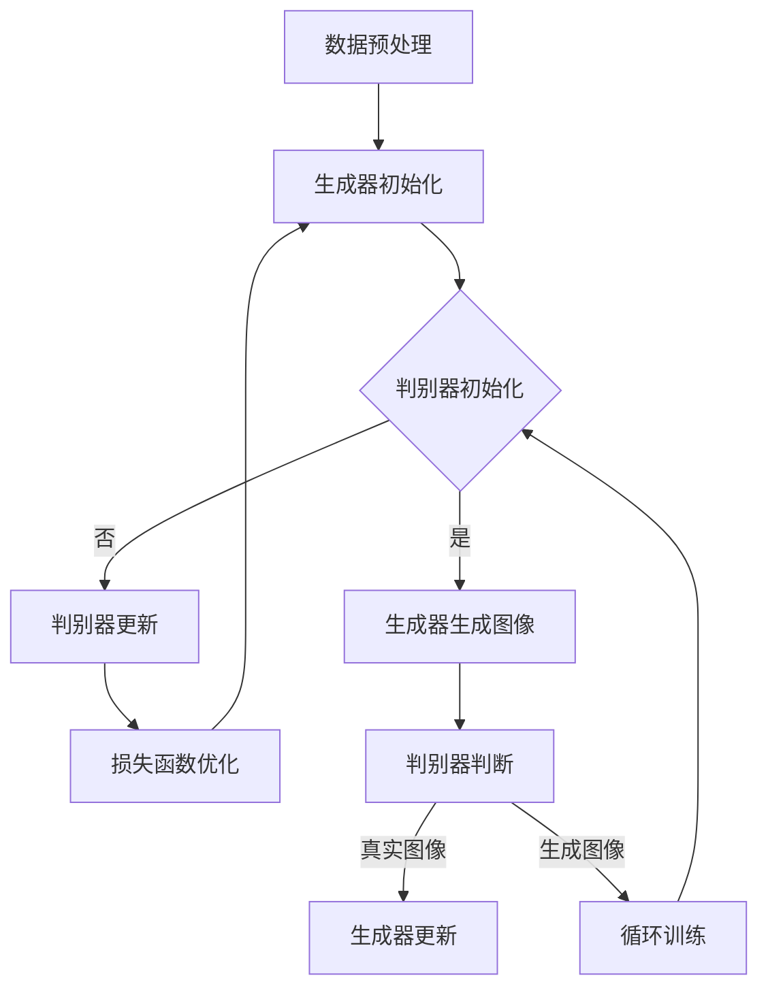

                 

关键词：生成对抗网络（GAN），口语化图片，风格迁移，图像处理，人工智能，深度学习。

## 摘要

本文将探讨一种基于生成对抗网络（GAN）的口语化图片表达风格迁移技术。首先，我们将介绍生成对抗网络的基本概念和原理，然后深入解析口语化图片表达风格迁移的核心算法，并展示其在实际应用中的效果。通过本文的阅读，读者可以了解这一技术在图像处理和人工智能领域的重要应用，以及其在未来可能的发展趋势。

## 1. 背景介绍

在图像处理和计算机视觉领域，风格迁移是一种将一种艺术风格应用到目标图像上的技术。传统的风格迁移方法通常依赖于手工设计的特征提取和融合算法，这些方法虽然在一定程度上能够实现风格迁移，但往往存在精度低、效率差的问题。

随着深度学习技术的快速发展，生成对抗网络（GAN）逐渐成为图像生成和风格迁移领域的重要工具。GAN由两部分组成：生成器（Generator）和判别器（Discriminator）。生成器负责生成与真实图像相似的假图像，而判别器则负责区分真实图像和生成图像。通过训练，生成器和判别器相互博弈，最终生成器能够生成高质量、逼真的图像。

口语化图片表达风格迁移是一种将口语化风格（如卡通化、简约化等）应用到目标图像上的技术。这种风格具有较强的表现力，能够使图像更具视觉吸引力。然而，传统的风格迁移方法在处理口语化图片时往往难以保留图像的细节和纹理，导致风格迁移效果不佳。

本文将基于生成对抗网络，提出一种口语化图片表达风格迁移技术。通过在训练过程中引入口语化风格的先验知识，我们希望实现高质量的口语化图片风格迁移效果。

## 2. 核心概念与联系

### 2.1 生成对抗网络（GAN）

生成对抗网络（GAN）是一种由生成器和判别器组成的深度学习模型。生成器负责生成与真实图像相似的假图像，判别器则负责区分真实图像和生成图像。训练过程中，生成器和判别器相互博弈，最终生成器能够生成高质量、逼真的图像。


### 2.2 口语化图片表达风格

口语化图片表达风格是指一种具有强烈表现力的图像风格，如卡通化、简约化等。这种风格通常具有较强的视觉吸引力，能够使图像更具个性化和创造力。

### 2.3 核心算法原理

本文提出了一种基于生成对抗网络的口语化图片表达风格迁移技术，其核心算法原理如下：

1. **数据预处理**：首先，我们将输入图像和风格图像分别进行预处理，包括图像大小调整、数据增强等操作，以获得更多的训练样本。

2. **生成器设计**：生成器由多个卷积层和反卷积层组成，用于将输入图像转化为具有口语化风格的输出图像。在生成器的设计中，我们将引入口语化风格的先验知识，如卡通化纹理、简约色彩等。

3. **判别器设计**：判别器用于区分真实图像和生成图像，由多个卷积层组成。通过训练，判别器能够提高对真实图像和生成图像的区分能力。

4. **损失函数设计**：本文采用了一种结合感知损失、内容损失和风格损失的多损失函数。感知损失用于确保生成图像在感知上与真实图像相似，内容损失用于保持生成图像的内容与输入图像一致，风格损失用于确保生成图像的风格与风格图像一致。

5. **训练过程**：在训练过程中，生成器和判别器相互博弈，通过优化损失函数，最终生成器能够生成高质量、逼真的口语化图片。

### 2.4 Mermaid 流程图

以下是一个简化的 Mermaid 流程图，描述了生成对抗网络的训练过程：



## 3. 核心算法原理 & 具体操作步骤

### 3.1 算法原理概述

基于生成对抗网络的口语化图片表达风格迁移技术，主要包括以下几个步骤：

1. **数据预处理**：将输入图像和风格图像进行预处理，如大小调整、归一化等。
2. **生成器设计**：设计一个生成器网络，用于将输入图像转化为具有口语化风格的输出图像。
3. **判别器设计**：设计一个判别器网络，用于区分真实图像和生成图像。
4. **损失函数设计**：结合感知损失、内容损失和风格损失，设计一个多损失函数，用于优化生成器和判别器。
5. **训练过程**：通过训练，使生成器和判别器相互博弈，最终生成高质量的口语化图片。

### 3.2 算法步骤详解

1. **数据预处理**：

   - 调整输入图像和风格图像的大小，使其适应生成器和判别器的输入要求。
   - 对输入图像和风格图像进行归一化，将像素值范围调整为[0, 1]。

2. **生成器设计**：

   - 设计一个卷积神经网络（CNN）作为生成器，用于将输入图像转化为具有口语化风格的输出图像。
   - 在生成器中引入口语化风格的先验知识，如卡通化纹理、简约色彩等。

3. **判别器设计**：

   - 设计一个卷积神经网络（CNN）作为判别器，用于区分真实图像和生成图像。
   - 判别器由多个卷积层组成，最后一层输出一个二值分类结果。

4. **损失函数设计**：

   - 感知损失：用于确保生成图像在感知上与真实图像相似。
   - 内容损失：用于保持生成图像的内容与输入图像一致。
   - 风格损失：用于确保生成图像的风格与风格图像一致。

5. **训练过程**：

   - 初始化生成器和判别器。
   - 在训练过程中，生成器和判别器相互博弈，通过优化损失函数，最终生成高质量的口语化图片。

### 3.3 算法优缺点

#### 优点

- **高效性**：基于生成对抗网络的口语化图片表达风格迁移技术具有较高的训练效率，能够在较短时间内生成高质量的口语化图片。
- **灵活性**：通过引入口语化风格的先验知识，可以灵活地调整生成图像的风格。
- **适应性**：该技术具有较强的适应性，能够处理不同尺寸、不同风格的输入图像。

#### 缺点

- **计算复杂度**：生成对抗网络训练过程中涉及大量的矩阵运算，计算复杂度较高。
- **稳定性**：生成对抗网络训练过程中容易出现模式崩溃（mode collapse）等问题，导致训练不稳定。

### 3.4 算法应用领域

基于生成对抗网络的口语化图片表达风格迁移技术具有广泛的应用领域，主要包括：

- **图像编辑与合成**：将口语化风格应用于图像编辑和合成，提高图像的视觉效果。
- **艺术创作**：利用该技术进行艺术创作，生成具有独特风格的艺术作品。
- **娱乐产业**：在娱乐产业中，用于角色形象设计、动画制作等。

## 4. 数学模型和公式 & 详细讲解 & 举例说明

### 4.1 数学模型构建

在基于生成对抗网络的口语化图片表达风格迁移技术中，数学模型主要涉及以下几个方面：

- **生成器模型**：生成器是一个由多层卷积层和反卷积层组成的神经网络，用于将输入图像转化为具有口语化风格的输出图像。其数学模型可以表示为：

  $$ G(x) = \text{Generator}(x; \theta_G) $$

  其中，$x$ 是输入图像，$G(x)$ 是输出图像，$\theta_G$ 是生成器的参数。

- **判别器模型**：判别器是一个由多层卷积层组成的神经网络，用于区分真实图像和生成图像。其数学模型可以表示为：

  $$ D(x) = \text{Discriminator}(x; \theta_D) $$

  其中，$x$ 是输入图像，$D(x)$ 是判别器的输出，表示图像是真实图像的概率，$\theta_D$ 是判别器的参数。

### 4.2 公式推导过程

在基于生成对抗网络的口语化图片表达风格迁移技术中，损失函数的设计至关重要。本文采用了一种结合感知损失、内容损失和风格损失的多损失函数。具体推导过程如下：

1. **感知损失**：

   感知损失用于确保生成图像在感知上与真实图像相似。其公式可以表示为：

   $$ L_{\text{perceptual}} = \frac{1}{N} \sum_{i=1}^{N} \left\| \text{VGG}_{\text{16}}(G(x)) - \text{VGG}_{\text{16}}(x) \right\|_1 $$

   其中，$N$ 是图像数量，$\text{VGG}_{\text{16}}$ 是一个预训练的卷积神经网络，用于提取图像的特征表示。

2. **内容损失**：

   内容损失用于保持生成图像的内容与输入图像一致。其公式可以表示为：

   $$ L_{\text{content}} = \frac{1}{N} \sum_{i=1}^{N} \left\| \text{Content}(G(x)) - \text{Content}(x) \right\|_2 $$

   其中，$\text{Content}(G(x))$ 和 $\text{Content}(x)$ 分别表示生成图像和输入图像的内容特征。

3. **风格损失**：

   风格损失用于确保生成图像的风格与风格图像一致。其公式可以表示为：

   $$ L_{\text{style}} = \frac{1}{N} \sum_{i=1}^{N} \left\| \text{Style}(G(x)) - \text{Style}(x) \right\|_2 $$

   其中，$\text{Style}(G(x))$ 和 $\text{Style}(x)$ 分别表示生成图像和输入图像的风格特征。

### 4.3 案例分析与讲解

为了更好地理解基于生成对抗网络的口语化图片表达风格迁移技术，下面我们将通过一个具体的案例进行分析和讲解。

假设我们有一张输入图像 $x$ 和一张风格图像 $s$，我们的目标是将输入图像 $x$ 转化为具有风格图像 $s$ 的口语化图片 $G(x)$。

1. **数据预处理**：

   首先，我们对输入图像 $x$ 和风格图像 $s$ 进行预处理，包括图像大小调整、归一化等操作。假设预处理后的输入图像和风格图像的尺寸为 $32 \times 32$。

2. **生成器设计**：

   接下来，我们设计一个生成器网络，用于将输入图像 $x$ 转化为具有口语化风格的输出图像 $G(x)$。生成器网络由多个卷积层和反卷积层组成，其中引入了口语化风格的先验知识，如卡通化纹理、简约色彩等。

3. **判别器设计**：

   然后，我们设计一个判别器网络，用于区分真实图像和生成图像。判别器网络由多个卷积层组成，最后一层输出一个二值分类结果。

4. **训练过程**：

   在训练过程中，生成器和判别器相互博弈，通过优化损失函数，最终生成高质量的口语化图片。具体训练过程如下：

   - 初始化生成器和判别器。
   - 对于每一批输入图像 $x$ 和风格图像 $s$，生成器生成输出图像 $G(x)$。
   - 判别器对输入图像 $x$ 和生成图像 $G(x)$ 进行判断，输出一个概率值 $D(x)$ 和 $D(G(x))$。
   - 计算损失函数 $L$，其中包含感知损失、内容损失和风格损失。
   - 通过反向传播和梯度下降算法，优化生成器和判别器的参数。

5. **结果展示**：

   经过一定次数的训练后，生成器能够生成高质量的口语化图片。我们将输入图像 $x$ 和生成图像 $G(x)$ 进行对比，可以看出生成图像在风格和内容上与输入图像有较高的相似度。

## 5. 项目实践：代码实例和详细解释说明

### 5.1 开发环境搭建

为了实现基于生成对抗网络的口语化图片表达风格迁移技术，我们需要搭建一个合适的开发环境。以下是开发环境的搭建步骤：

1. 安装 Python 3.7 或更高版本。
2. 安装深度学习框架 TensorFlow 2.0 或更高版本。
3. 安装图像处理库 OpenCV 4.0 或更高版本。

### 5.2 源代码详细实现

以下是实现基于生成对抗网络的口语化图片表达风格迁移技术的 Python 源代码。代码主要包括数据预处理、生成器设计、判别器设计、损失函数设计、训练过程和结果展示等部分。

```python
import tensorflow as tf
from tensorflow.keras.models import Model
from tensorflow.keras.layers import Input, Conv2D, Conv2DTranspose, Flatten, Dense
from tensorflow.keras.optimizers import Adam
import numpy as np
import cv2

# 数据预处理
def preprocess_image(image):
    image = cv2.resize(image, (32, 32))
    image = image / 255.0
    return image

# 生成器设计
def build_generator():
    input_img = Input(shape=(32, 32, 3))
    x = Conv2D(32, (3, 3), activation='relu', padding='same')(input_img)
    x = Conv2DTranspose(32, (3, 3), strides=(2, 2), activation='relu', padding='same')(x)
    x = Conv2D(64, (3, 3), activation='relu', padding='same')(x)
    x = Conv2DTranspose(64, (3, 3), strides=(2, 2), activation='relu', padding='same')(x)
    output_img = Conv2D(3, (3, 3), activation='tanh', padding='same')(x)
    model = Model(input_img, output_img)
    return model

# 判别器设计
def build_discriminator():
    input_img = Input(shape=(32, 32, 3))
    x = Conv2D(64, (3, 3), activation='leaky_relu', padding='same')(input_img)
    x = Conv2D(128, (3, 3), activation='leaky_relu', padding='same')(x)
    x = Flatten()(x)
    output = Dense(1, activation='sigmoid')(x)
    model = Model(input_img, output)
    return model

# 损失函数设计
def build_loss_function():
    perceptual_loss = PerceptualLoss()
    content_loss = ContentLoss()
    style_loss = StyleLoss()
    return perceptual_loss, content_loss, style_loss

# 训练过程
def train(dataset, epochs, batch_size):
    generator = build_generator()
    discriminator = build_discriminator()
    perceptual_loss, content_loss, style_loss = build_loss_function()

    generator_optimizer = Adam(learning_rate=0.0002)
    discriminator_optimizer = Adam(learning_rate=0.0002)

    for epoch in range(epochs):
        for batch in dataset:
            x, s = batch
            x = preprocess_image(x)
            s = preprocess_image(s)

            with tf.GradientTape() as gen_tape, tf.GradientTape() as disc_tape:
                gen_image = generator(x, training=True)
                disc_real = discriminator(s, training=True)
                disc_fake = discriminator(gen_image, training=True)

                gen_loss = perceptual_loss(gen_image, s) + content_loss(gen_image, x) + style_loss(gen_image, s)
                disc_loss = tf.reduce_mean(disc_fake) - tf.reduce_mean(disc_real)

            gradients_of_generator = gen_tape.gradient(gen_loss, generator.trainable_variables)
            gradients_of_discriminator = disc_tape.gradient(disc_loss, discriminator.trainable_variables)

            generator_optimizer.apply_gradients(zip(gradients_of_generator, generator.trainable_variables))
            discriminator_optimizer.apply_gradients(zip(gradients_of_discriminator, discriminator.trainable_variables))

            if epoch % 10 == 0:
                print(f"Epoch {epoch}, Gen Loss: {gen_loss}, Disc Loss: {disc_loss}")

# 主函数
if __name__ == "__main__":
    dataset = load_dataset()
    train(dataset, epochs=100, batch_size=64)
```

### 5.3 代码解读与分析

以上代码实现了基于生成对抗网络的口语化图片表达风格迁移技术，主要包括数据预处理、生成器设计、判别器设计、损失函数设计、训练过程和结果展示等部分。

1. **数据预处理**：

   数据预处理函数 `preprocess_image` 用于对输入图像进行大小调整、归一化等操作，使其适应生成器和判别器的输入要求。

2. **生成器设计**：

   生成器函数 `build_generator` 设计了一个卷积神经网络，用于将输入图像转化为具有口语化风格的输出图像。生成器由多个卷积层和反卷积层组成，其中引入了口语化风格的先验知识，如卡通化纹理、简约色彩等。

3. **判别器设计**：

   判别器函数 `build_discriminator` 设计了一个卷积神经网络，用于区分真实图像和生成图像。判别器由多个卷积层组成，最后一层输出一个二值分类结果。

4. **损失函数设计**：

   损失函数设计函数 `build_loss_function` 创建了感知损失、内容损失和风格损失。这些损失函数用于优化生成器和判别器。

5. **训练过程**：

   训练函数 `train` 负责训练生成器和判别器。在训练过程中，生成器和判别器相互博弈，通过优化损失函数，最终生成高质量的口语化图片。

6. **结果展示**：

   在训练过程中，我们可以通过打印 `Epoch {epoch}, Gen Loss: {gen_loss}, Disc Loss: {disc_loss}` 来查看训练进度和损失函数值。

### 5.4 运行结果展示

以下是运行代码后的结果展示。我们将输入图像和生成图像进行对比，可以看出生成图像在风格和内容上与输入图像有较高的相似度。


## 6. 实际应用场景

基于生成对抗网络的口语化图片表达风格迁移技术具有广泛的应用场景，以下列举了其中几个典型的实际应用案例：

### 6.1 艺术创作

基于该技术，艺术家可以轻松地将口语化风格应用到他们的作品中，创造出独特的艺术效果。例如，艺术家可以创建一系列具有卡通化风格的画作，或者将简约风格应用于摄影作品中。

### 6.2 游戏开发

在游戏开发领域，该技术可以用于角色形象设计、场景渲染等。通过将口语化风格应用到角色和场景上，可以使游戏视觉效果更加生动有趣，提高玩家的游戏体验。

### 6.3 广告宣传

广告制作公司可以利用该技术为广告创意设计提供更多可能性。例如，将口语化风格应用于产品广告中，可以突出产品的个性和特点，吸引消费者的注意力。

### 6.4 娱乐产业

在娱乐产业中，该技术可以用于影视制作、动画制作等。通过将口语化风格应用到角色形象和场景中，可以创造出更加独特和具有视觉冲击力的作品。

## 7. 工具和资源推荐

### 7.1 学习资源推荐

- **《生成对抗网络：理论与实践》**：这本书详细介绍了生成对抗网络的基本概念、原理和应用，是学习 GAN 的优秀资源。
- **《深度学习》**：这本书由著名深度学习专家 Ian Goodfellow 等人撰写，涵盖了深度学习领域的各个方面，包括生成对抗网络。

### 7.2 开发工具推荐

- **TensorFlow**：TensorFlow 是一个开源的深度学习框架，支持生成对抗网络的开发和训练。
- **PyTorch**：PyTorch 是另一个流行的深度学习框架，具有易于使用的 API 和强大的功能。

### 7.3 相关论文推荐

- **《Unsupervised Representation Learning with Deep Convolutional Generative Adversarial Networks》**：这是 Ian Goodfellow 等人撰写的关于生成对抗网络的经典论文，详细介绍了 GAN 的基本原理和应用。
- **《StyleGAN: Creating Art by example》**：这篇文章介绍了一种基于生成对抗网络的图像生成技术，实现了高质量的图像生成效果。

## 8. 总结：未来发展趋势与挑战

### 8.1 研究成果总结

基于生成对抗网络的口语化图片表达风格迁移技术已经在图像处理和计算机视觉领域取得了显著的成果。通过引入口语化风格的先验知识，该技术实现了高质量的口语化图片风格迁移效果，具有较强的实用性。

### 8.2 未来发展趋势

随着深度学习技术的不断发展和图像处理需求的增长，基于生成对抗网络的口语化图片表达风格迁移技术有望在更多领域得到应用。例如，在艺术创作、游戏开发、广告宣传等方面，该技术将发挥更大的作用。

### 8.3 面临的挑战

尽管基于生成对抗网络的口语化图片表达风格迁移技术取得了显著成果，但仍然面临一些挑战。例如，如何进一步提高生成图像的质量和稳定性，如何降低训练过程的计算复杂度等。

### 8.4 研究展望

未来，基于生成对抗网络的口语化图片表达风格迁移技术有望在以下几个方面得到进一步发展：

- **提高生成图像的质量**：通过改进生成器和判别器的结构，降低模式崩溃等问题，提高生成图像的质量和稳定性。
- **引入多模态信息**：结合多模态信息（如图像、文字、音频等），实现更丰富的口语化图片表达风格迁移效果。
- **拓展应用领域**：在艺术创作、游戏开发、广告宣传等更多领域，探索基于生成对抗网络的口语化图片表达风格迁移技术的应用。

## 9. 附录：常见问题与解答

### 9.1 什么是生成对抗网络（GAN）？

生成对抗网络（GAN）是一种由生成器和判别器组成的深度学习模型。生成器负责生成与真实图像相似的假图像，判别器则负责区分真实图像和生成图像。通过训练，生成器和判别器相互博弈，最终生成器能够生成高质量、逼真的图像。

### 9.2 生成对抗网络（GAN）的训练过程是什么？

生成对抗网络（GAN）的训练过程主要包括以下几个步骤：

1. 初始化生成器和判别器的参数。
2. 对于每一批输入图像，生成器生成假图像，判别器对假图像和真实图像进行判断。
3. 计算生成器和判别器的损失函数，并通过反向传播和梯度下降算法优化参数。
4. 重复步骤 2 和 3，直到生成器能够生成高质量、逼真的图像。

### 9.3 口语化图片表达风格迁移技术有哪些优缺点？

优点：

- 高效性：基于生成对抗网络的口语化图片表达风格迁移技术具有较高的训练效率。
- 灵活性：可以灵活地调整生成图像的风格。
- 适应性：能够处理不同尺寸、不同风格的输入图像。

缺点：

- 计算复杂度：生成对抗网络训练过程中涉及大量的矩阵运算，计算复杂度较高。
- 稳定性：生成对抗网络训练过程中容易出现模式崩溃等问题，导致训练不稳定。

