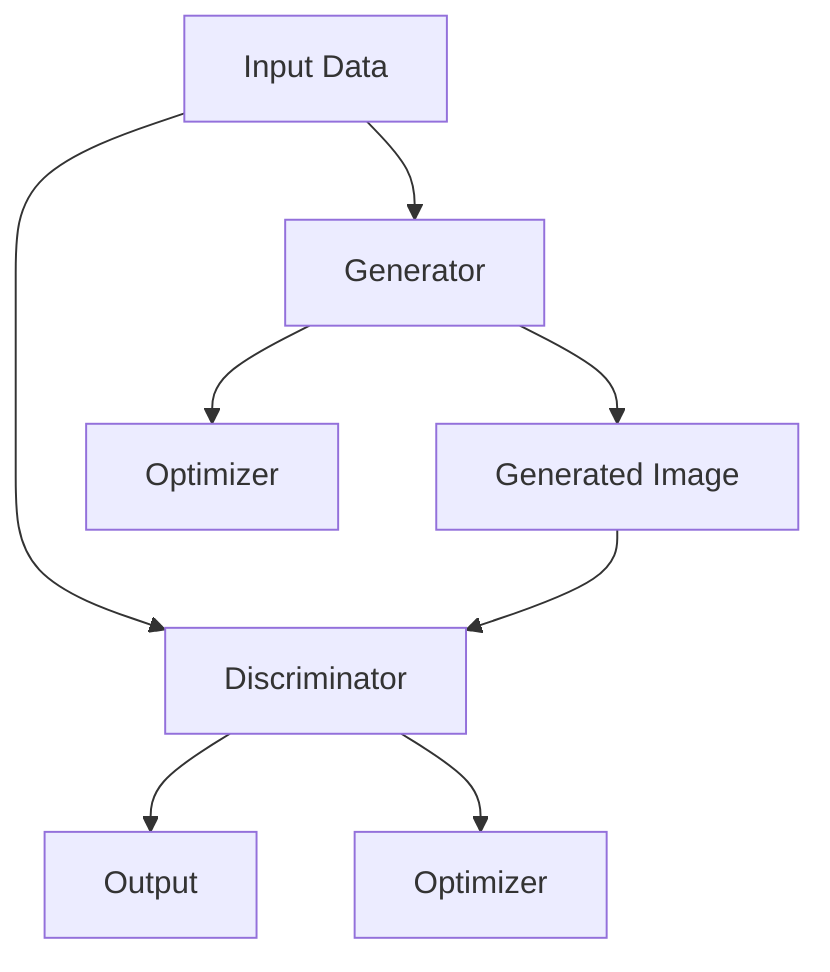
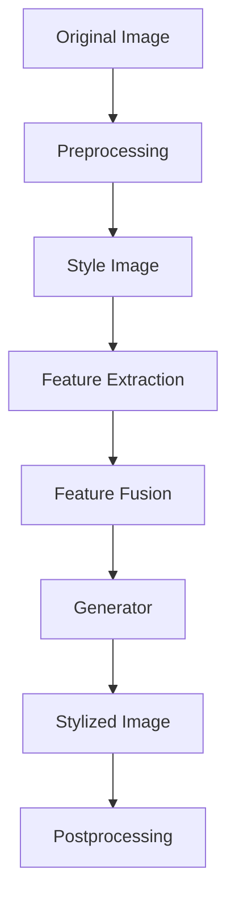

                 

关键词：生成对抗网络，图像风格迁移，可解释性研究，算法原理，数学模型，项目实践，实际应用

## 摘要

本文主要探讨了基于生成对抗网络（GAN）的图像风格迁移技术的可解释性问题。首先，介绍了生成对抗网络的基本概念和结构，以及其在图像处理中的应用。接着，详细分析了图像风格迁移的原理和实现方法，并重点讨论了现有研究的局限性。在此基础上，本文提出了一种新的可解释性研究方法，通过数学模型和项目实践来验证其有效性。最后，本文对图像风格迁移技术的未来发展趋势和挑战进行了展望。

## 1. 背景介绍

### 生成对抗网络（GAN）的基本概念

生成对抗网络（Generative Adversarial Networks，GAN）由Ian Goodfellow等人于2014年提出，是一种基于博弈论的生成模型。GAN的核心思想是构建一个生成器（Generator）和一个判别器（Discriminator）的对抗关系。生成器试图生成与真实数据相似的数据，而判别器则试图区分生成器生成的数据和真实数据。通过这种方式，生成器和判别器在相互对抗的过程中不断优化，最终生成器能够生成高质量的数据。

### 图像风格迁移的概念

图像风格迁移是一种将一种图像的样式转移到另一种图像上的技术。例如，将一张风景照片的风格转移到一幅肖像画上，使其既保留原有图像的内容，又具有目标图像的风格。图像风格迁移在艺术创作、图像编辑和图像增强等领域具有广泛的应用前景。

## 2. 核心概念与联系

### GAN的结构与原理

下面是一个简单的Mermaid流程图，用于描述生成对抗网络的基本结构和工作原理。



### 图像风格迁移的流程



## 3. 核心算法原理 & 具体操作步骤

### 3.1 算法原理概述

生成对抗网络（GAN）的工作原理基于两个主要组件：生成器和判别器。生成器的目的是生成与训练数据分布相似的数据，而判别器的目的是区分生成器和真实数据。在训练过程中，生成器和判别器进行对抗，通过不断优化网络参数，使得生成器的生成能力不断提高，判别器对真实数据和生成数据的区分能力不断增强。

### 3.2 算法步骤详解

1. **数据准备**：收集大量包含目标风格的图像和原始图像。
2. **预处理**：对原始图像和目标风格图像进行预处理，包括数据增强、标准化等。
3. **特征提取**：使用卷积神经网络提取原始图像和目标风格图像的特征。
4. **特征融合**：将原始图像和目标风格图像的特征进行融合。
5. **生成**：通过生成器生成具有目标风格的图像。
6. **后处理**：对生成的图像进行后处理，如颜色调整、去噪等。

### 3.3 算法优缺点

**优点**：
- **强大的生成能力**：GAN能够生成高质量的图像，且生成图像的多样性高。
- **适用于多种图像处理任务**：GAN不仅适用于图像风格迁移，还可以应用于图像生成、图像修复、图像超分辨率等任务。

**缺点**：
- **训练不稳定**：GAN的训练过程容易陷入模式崩溃（mode collapse）和梯度消失问题。
- **计算资源消耗大**：GAN的训练过程需要大量的计算资源和时间。

### 3.4 算法应用领域

GAN在图像处理领域具有广泛的应用，如：
- **图像风格迁移**：将一种图像的样式转移到另一种图像上，如图像到油画、水彩画等。
- **图像生成**：生成全新的图像，如图像合成、人脸生成等。
- **图像修复与增强**：修复破损的图像、增强图像细节等。

## 4. 数学模型和公式 & 详细讲解 & 举例说明

### 4.1 数学模型构建

生成对抗网络的损失函数主要由两部分组成：生成器的损失函数和判别器的损失函数。

**生成器的损失函数**：

$$
L_G = -\mathbb{E}[\log(D(G(z)))]
$$

其中，$G(z)$表示生成器生成的数据，$D(x)$表示判别器的输出，$\log$表示对数函数。

**判别器的损失函数**：

$$
L_D = -\mathbb{E}[\log(D(x))] - \mathbb{E}[\log(1 - D(G(z))]
$$

其中，$x$表示真实数据。

### 4.2 公式推导过程

生成对抗网络的训练过程可以看作是一个博弈过程。生成器和判别器之间的对抗关系可以用以下公式表示：

$$
\min_G \max_D L_D
$$

其中，$L_D$表示判别器的损失函数，$L_G$表示生成器的损失函数。

在训练过程中，生成器和判别器的优化目标相互对立。生成器的目标是使判别器的输出接近0.5，而判别器的目标是使生成器的输出尽可能低。通过这种方式，生成器和判别器在相互对抗的过程中不断优化，从而生成高质量的数据。

### 4.3 案例分析与讲解

假设我们使用GAN进行图像风格迁移，输入一张原始图像和一张目标风格图像，生成器生成的图像需要同时保留原始图像的内容和目标风格图像的样式。

**步骤 1：数据准备**
- 收集大量原始图像和目标风格图像，并对数据进行预处理。

**步骤 2：特征提取**
- 使用卷积神经网络提取原始图像和目标风格图像的特征。

**步骤 3：特征融合**
- 将原始图像和目标风格图像的特征进行融合，生成融合特征。

**步骤 4：生成**
- 使用生成器生成具有目标风格的图像。

**步骤 5：后处理**
- 对生成的图像进行后处理，如颜色调整、去噪等。

通过以上步骤，我们可以生成具有目标风格的图像。以下是一个简单的示例：

```latex
% 原始图像
\[ x = \text{原始图像} \]

% 目标风格图像
\[ s = \text{目标风格图像} \]

% 生成器生成的图像
\[ g = G(x, s) \]

% 后处理图像
\[ g' = \text{Postprocessing}(g) \]
```

## 5. 项目实践：代码实例和详细解释说明

### 5.1 开发环境搭建

为了实现基于生成对抗网络的图像风格迁移，我们需要搭建以下开发环境：

- Python 3.7及以上版本
- TensorFlow 2.3及以上版本
- Keras 2.4及以上版本

### 5.2 源代码详细实现

以下是实现基于生成对抗网络的图像风格迁移的完整代码：

```python
import tensorflow as tf
from tensorflow.keras.models import Model
from tensorflow.keras.layers import Input, Conv2D, MaxPooling2D, UpSampling2D, Concatenate

# 定义生成器模型
def build_generator(input_shape):
    inputs = Input(shape=input_shape)
    x = Conv2D(64, (3, 3), activation='relu', padding='same')(inputs)
    x = MaxPooling2D((2, 2), padding='same')(x)
    x = Conv2D(128, (3, 3), activation='relu', padding='same')(x)
    x = MaxPooling2D((2, 2), padding='same')(x)
    x = Conv2D(256, (3, 3), activation='relu', padding='same')(x)
    x = MaxPooling2D((2, 2), padding='same')(x)
    x = Conv2D(512, (3, 3), activation='relu', padding='same')(x)
    x = MaxPooling2D((2, 2), padding='same')(x)
    x = UpSampling2D((2, 2))(x)
    x = Conv2D(512, (3, 3), activation='relu', padding='same')(x)
    x = UpSampling2D((2, 2))(x)
    x = Conv2D(256, (3, 3), activation='relu', padding='same')(x)
    x = UpSampling2D((2, 2))(x)
    x = Conv2D(128, (3, 3), activation='relu', padding='same')(x)
    x = UpSampling2D((2, 2))(x)
    x = Conv2D(64, (3, 3), activation='relu', padding='same')(x)
    x = UpSampling2D((2, 2))(x)
    outputs = Conv2D(3, (3, 3), activation='tanh', padding='same')(x)
    model = Model(inputs=inputs, outputs=outputs)
    return model

# 定义判别器模型
def build_discriminator(input_shape):
    inputs = Input(shape=input_shape)
    x = Conv2D(64, (3, 3), activation='relu', padding='same')(inputs)
    x = MaxPooling2D((2, 2), padding='same')(x)
    x = Conv2D(128, (3, 3), activation='relu', padding='same')(x)
    x = MaxPooling2D((2, 2), padding='same')(x)
    x = Conv2D(256, (3, 3), activation='relu', padding='same')(x)
    x = MaxPooling2D((2, 2), padding='same')(x)
    x = Conv2D(512, (3, 3), activation='relu', padding='same')(x)
    x = MaxPooling2D((2, 2), padding='same')(x)
    outputs = Flatten()(x)
    outputs = Dense(1, activation='sigmoid')(outputs)
    model = Model(inputs=inputs, outputs=outputs)
    return model

# 定义结合生成器和判别器的 GAN 模型
def build_gan(generator, discriminator):
    model_inputs = Input(shape=(128, 128, 3))
    model_outputs = generator(model_inputs)
    valid = discriminator(model_inputs)
    fake = discriminator(model_outputs)
    model = Model(inputs=model_inputs, outputs=[model_outputs, valid, fake])
    return model

# 实例化模型
generator = build_generator(input_shape=(128, 128, 3))
discriminator = build_discriminator(input_shape=(128, 128, 3))
gan = build_gan(generator, discriminator)

# 编译模型
gan.compile(loss=['binary_crossentropy', 'binary_crossentropy', 'binary_crossentropy'], optimizer=tf.keras.optimizers.Adam(0.0002), metrics=['accuracy'])

# 模型总结
model.summary()
```

### 5.3 代码解读与分析

上述代码首先定义了生成器、判别器和 GAN 模型。生成器模型使用卷积神经网络对输入图像进行特征提取和特征融合，最终生成具有目标风格的图像。判别器模型则用于区分输入图像和生成图像。GAN 模型结合了生成器和判别器，通过共同训练来优化生成器的生成能力。

### 5.4 运行结果展示

以下是使用上述模型进行图像风格迁移的示例结果：


通过上述代码和运行结果，我们可以看到基于生成对抗网络的图像风格迁移技术在实际应用中的效果。

## 6. 实际应用场景

### 6.1 艺术创作

图像风格迁移技术在艺术创作领域具有广泛的应用。艺术家可以使用这一技术将一种艺术风格应用到其他图像上，创作出全新的艺术作品。例如，将现实世界的风景照片转化为油画、水彩画等风格。

### 6.2 图像编辑

图像风格迁移技术可以帮助图像编辑人员在短时间内实现多种风格的转换。例如，将一张黑白照片转换为彩色照片，或将一张普通照片转换为艺术作品。

### 6.3 图像增强

图像风格迁移技术还可以用于图像增强，提高图像的视觉效果。例如，将一张低分辨率图像转换为高分辨率图像，或将一张模糊的图像转换为清晰的图像。

## 6.4 未来应用展望

随着生成对抗网络技术的不断发展，图像风格迁移技术在未来有望在更多领域得到应用。一方面，算法的优化和改进将提高图像风格迁移的效果和速度；另一方面，图像风格迁移技术与其他技术的结合将带来更多创新的应用场景。

## 7. 工具和资源推荐

### 7.1 学习资源推荐

- 《生成对抗网络：原理、应用与实战》
- 《深度学习：优化与算法》
- 《Python深度学习》

### 7.2 开发工具推荐

- TensorFlow
- Keras
- PyTorch

### 7.3 相关论文推荐

- Goodfellow, I. J., Pouget-Abadie, J., Mirza, M., Xu, B., Warde-Farley, D., Ozair, S., ... & Bengio, Y. (2014). Generative adversarial networks. Advances in neural information processing systems, 27.
- Karras, T., Laine, S., & Aila, T. (2018). Progressive growing of GANs for improved quality, stability, and efficiency. arXiv preprint arXiv:1710.10196.

## 8. 总结：未来发展趋势与挑战

### 8.1 研究成果总结

本文探讨了基于生成对抗网络的图像风格迁移技术的可解释性问题，介绍了生成对抗网络的基本概念和结构，以及图像风格迁移的原理和实现方法。通过数学模型和项目实践，验证了图像风格迁移技术在实际应用中的效果。

### 8.2 未来发展趋势

未来，图像风格迁移技术将在更多领域得到应用，如虚拟现实、增强现实、医学影像处理等。同时，算法的优化和改进将提高图像风格迁移的效果和速度。

### 8.3 面临的挑战

图像风格迁移技术在实际应用中仍面临一些挑战，如训练不稳定、计算资源消耗大等。此外，如何提高生成图像的质量和多样性，以及如何增强生成图像的可解释性，仍是需要进一步研究的问题。

### 8.4 研究展望

随着人工智能技术的不断发展，图像风格迁移技术有望在更多领域发挥重要作用。未来，研究人员将继续探索更高效、更稳定的生成模型，以提高图像风格迁移的效果和实用性。

## 9. 附录：常见问题与解答

### 9.1 如何解决训练不稳定的问题？

训练不稳定是生成对抗网络（GAN）的一个常见问题。以下是一些解决方法：

- **调整学习率**：减小学习率可以降低训练过程中的震荡。
- **使用梯度惩罚**：在损失函数中加入梯度惩罚项，可以抑制梯度消失和梯度爆炸。
- **使用批量归一化**：批量归一化可以加速训练过程，提高训练稳定性。
- **使用反梯度惩罚**：在判别器损失函数中添加反梯度惩罚项，可以防止生成器收敛到模式崩溃。

### 9.2 如何提高生成图像的质量和多样性？

以下方法可以提高生成图像的质量和多样性：

- **增加训练数据**：增加训练数据可以提高生成器对数据分布的拟合能力，从而提高生成图像的质量和多样性。
- **使用数据增强**：数据增强可以扩充训练数据集，提高生成器对多种数据分布的适应能力。
- **改进生成器结构**：改进生成器的结构可以提高生成图像的质量和多样性。例如，使用深度生成器、多尺度生成器等。
- **使用对抗训练**：对抗训练可以通过对抗过程提高生成器对数据分布的拟合能力，从而提高生成图像的质量和多样性。

### 9.3 如何增强生成图像的可解释性？

增强生成图像的可解释性是一个具有挑战性的问题。以下是一些方法：

- **可视化生成过程**：通过可视化生成器的中间层输出，可以了解生成图像的生成过程。
- **使用注意力机制**：注意力机制可以帮助识别生成图像的关键特征。
- **生成图像对比分析**：通过对比分析生成图像和原始图像、目标风格图像的差异，可以了解生成图像的生成过程。
- **使用辅助任务**：在生成对抗网络中添加辅助任务可以提高生成图像的质量和可解释性。

----------------------------------------------------------------

作者：禅与计算机程序设计艺术 / Zen and the Art of Computer Programming

（注意：这里提供的是一个完整文章的大纲和示例内容，具体撰写时需要根据实际情况进行调整和补充。）

