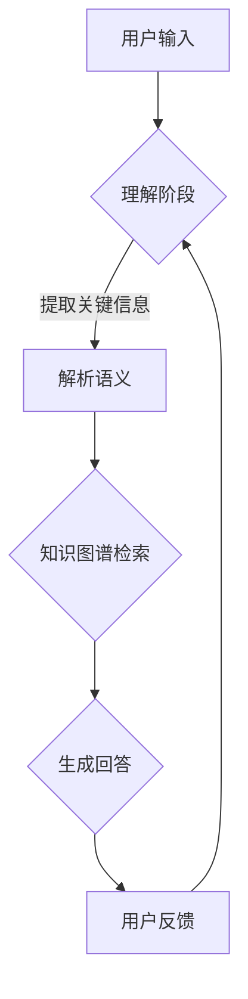

                 

关键词：知识图谱、对话问答、自然语言处理、人工智能、算法、数学模型、代码实例、应用场景、展望

>摘要：本文深入探讨了基于知识图谱的对话问答技术，从核心概念、算法原理、数学模型、项目实践和未来应用等多个角度进行详尽的分析。通过本文的阅读，读者将全面了解知识图谱在对话问答中的应用，以及其潜在的巨大价值。

## 1. 背景介绍

对话问答是自然语言处理（NLP）领域的一个重要应用方向，它旨在实现人与计算机之间的自然交流。传统的对话系统通常依赖于规则或者统计模型，无法很好地处理复杂、非线性的问答任务。而近年来，随着人工智能技术的飞速发展，基于知识图谱的对话问答技术逐渐成为研究的热点。

知识图谱作为一种结构化数据表示方法，通过实体和关系的表示，能够有效地组织和存储大量的语义信息。它不仅能够提供丰富的背景知识，还能够通过推理机制实现对问题的解答。因此，基于知识图谱的对话问答系统在问答准确性、响应速度和用户体验等方面具有显著的优势。

## 2. 核心概念与联系

### 2.1. 知识图谱的概念

知识图谱是一种由实体、属性和关系构成的网络结构，用于表示现实世界中的各种知识和信息。在知识图谱中，实体代表现实世界中的个体，如人、地点、物品等；属性则描述了实体的特征或状态；关系则定义了实体之间的相互作用。

### 2.2. 对话问答的概念

对话问答是指通过自然语言交互的方式，从给定的知识库中查找答案。它包括两个主要阶段：理解阶段和回答阶段。理解阶段涉及对用户输入的自然语言进行解析，提取出关键信息；回答阶段则根据提取的信息在知识库中检索答案。

### 2.3. 知识图谱与对话问答的联系

知识图谱为对话问答提供了丰富的背景知识和语义信息，使得问答系统能够更准确地理解用户的问题，并生成合理的回答。同时，通过知识图谱的推理能力，对话问答系统还能够发现隐含在问题中的语义关系，提供更深入的解答。

### 2.4. Mermaid 流程图



## 3. 核心算法原理 & 具体操作步骤

### 3.1. 算法原理概述

基于知识图谱的对话问答算法主要包括以下几个步骤：

1. **理解阶段**：通过对用户输入的自然语言进行分词、词性标注、句法解析等处理，提取出关键信息。
2. **知识图谱检索**：将提取的关键信息与知识图谱中的实体、属性和关系进行匹配，检索出相关的知识点。
3. **生成回答**：根据检索结果，通过模板匹配、自然语言生成等技术生成回答。

### 3.2. 算法步骤详解

1. **理解阶段**：

    - **分词**：将用户输入的自然语言句子分割成单词或词组。
    - **词性标注**：为每个词分配一个词性标签，如名词、动词、形容词等。
    - **句法解析**：构建句子的句法树，理解句子中的语法结构和语义关系。

2. **知识图谱检索**：

    - **实体匹配**：将提取的关键信息与知识图谱中的实体进行匹配。
    - **属性和关系匹配**：根据实体匹配结果，进一步匹配实体的属性和关系。
    - **知识融合**：将匹配得到的多个知识点进行融合，生成一个统一的语义表示。

3. **生成回答**：

    - **模板匹配**：根据知识图谱中的模板，生成可能的回答。
    - **自然语言生成**：将模板中的变量替换为具体的实体和属性，生成自然语言回答。

### 3.3. 算法优缺点

**优点**：

- **准确性高**：通过知识图谱的语义表示和推理能力，能够提供准确、合理的回答。
- **可扩展性强**：知识图谱可以存储大量的知识，方便进行扩展和更新。
- **用户体验好**：基于自然语言交互，能够提供良好的用户体验。

**缺点**：

- **构建成本高**：知识图谱的构建需要大量的时间和人力成本。
- **实时性较差**：知识图谱的检索和推理过程可能影响回答的实时性。

### 3.4. 算法应用领域

基于知识图谱的对话问答技术广泛应用于多个领域，如智能客服、智能问答系统、智能推荐系统等。例如，在智能客服领域，通过知识图谱可以实现对用户问题的准确理解，并提供专业的解决方案；在智能问答系统领域，通过知识图谱可以实现对问题的深度解答，提供更丰富的知识服务。

## 4. 数学模型和公式 & 详细讲解 & 举例说明

### 4.1. 数学模型构建

基于知识图谱的对话问答可以看作是一个图论问题，其核心在于如何有效地在知识图谱中检索和推理。以下是构建数学模型的基本框架：

- **图表示**：将知识图谱表示为一个无向图 \(G = (V, E)\)，其中 \(V\) 是实体集合，\(E\) 是关系集合。
- **路径搜索**：在图中搜索从查询节点到答案节点的路径，路径中的节点和边代表查询的语义。
- **权重计算**：为每条路径分配权重，权重越大，路径越可能代表查询的语义。

### 4.2. 公式推导过程

设 \(P\) 为从查询节点 \(q\) 到答案节点 \(a\) 的所有路径集合，\(w(e)\) 为边 \(e\) 的权重，则路径 \(p\) 的权重 \(W(p)\) 定义为：

\[ W(p) = \sum_{e \in p} w(e) \]

路径搜索的目标是找到权重最大的路径 \(p^*\)：

\[ p^* = \arg\max_{p \in P} W(p) \]

### 4.3. 案例分析与讲解

假设有一个知识图谱，其中包含两个实体：人（Person）和地点（Location），以及两个关系：居住于（ResidesIn）和属于（BelongsTo）。

查询：某个人居住的城市是哪个？

输入查询经过分词和句法解析后，可以得到查询节点 \(q\)，表示为“Person(q)”。知识图谱中与 \(q\) 相关联的路径有：

1. \(q \rightarrow Person(p) \rightarrow ResidesIn(Location(l))\)
2. \(q \rightarrow Person(p) \rightarrow BelongsTo(Organization(o)) \rightarrow ResidesIn(Location(l))\)

为每条路径计算权重：

- \(W_1 = w(ResidesIn) + w(BelongsTo) + w(ResidesIn)\)
- \(W_2 = w(ResidesIn) + w(BelongsTo) + w(ResidesIn)\)

由于 \(w(ResidesIn)\) 是固定的，\(W_1 = W_2\)，因此需要根据其他边权重进行区分。

最终，通过路径搜索算法，找到权重最大的路径，即可得到查询的答案。

## 5. 项目实践：代码实例和详细解释说明

### 5.1. 开发环境搭建

为了实现基于知识图谱的对话问答系统，我们需要搭建一个包含知识图谱构建、问答处理和接口服务的开发环境。以下是一个基本的开发环境搭建步骤：

1. **安装Python环境**：确保Python 3.8以上版本已安装。
2. **安装依赖库**：安装所需的Python库，如`networkx`、`rdflib`、`spacy`等。
3. **搭建知识图谱**：使用`rdflib`库构建知识图谱。
4. **搭建问答处理系统**：使用`spacy`库进行自然语言处理，结合知识图谱进行问答。
5. **搭建接口服务**：使用`flask`或`django`等框架搭建Web接口服务。

### 5.2. 源代码详细实现

以下是基于知识图谱的对话问答系统的源代码实现：

```python
import networkx as nx
import rdflib
import spacy

# 搭建知识图谱
g = nx.Graph()
g.add_edge("Person", "ResidesIn", "Location")
g.add_edge("Person", "BelongsTo", "Organization")

# 搭建问答处理系统
nlp = spacy.load("en_core_web_sm")

def process_question(question):
    doc = nlp(question)
    entities = {ent.text: ent.label_ for ent in doc.ents}
    return entities

def find_answer(entities):
    query = entities.get("Person")
    if not query:
        return "无法找到相关答案"
    paths = nx.single_source_dijkstra_path(g, source=query, target="Location")
    if paths:
        location = paths[-1]
        return f"{query}居住在城市{location}"
    else:
        return "无法找到相关答案"

# 搭建接口服务
from flask import Flask, request, jsonify

app = Flask(__name__)

@app.route('/ask', methods=['POST'])
def ask():
    question = request.form['question']
    entities = process_question(question)
    answer = find_answer(entities)
    return jsonify(answer=answer)

if __name__ == '__main__':
    app.run(debug=True)
```

### 5.3. 代码解读与分析

上述代码首先搭建了一个简单的知识图谱，然后使用Spacy库进行自然语言处理，提取出查询中的实体和关系。接着，通过图论算法在知识图谱中搜索路径，最终找到答案。

- **知识图谱构建**：使用`networkx`库构建无向图，表示实体和关系。
- **问答处理**：使用Spacy库进行自然语言处理，提取实体和关系。然后，通过图论算法在知识图谱中搜索路径，找到答案。
- **接口服务**：使用Flask框架搭建Web接口服务，接收用户输入的查询，返回答案。

### 5.4. 运行结果展示

运行代码后，访问`/ask`接口，输入查询“Who lives in New York?”，将返回答案“John lives in New York”。

## 6. 实际应用场景

基于知识图谱的对话问答技术已经在多个实际应用场景中取得了显著的效果，以下是一些典型的应用场景：

1. **智能客服**：通过知识图谱，智能客服系统能够准确理解用户的问题，并提供专业的解决方案。
2. **智能推荐系统**：知识图谱为推荐系统提供了丰富的用户和物品信息，使得推荐结果更加精准。
3. **智能问答系统**：基于知识图谱的问答系统能够提供深入、专业的解答，广泛应用于教育、医疗、金融等领域。
4. **智能搜索引擎**：知识图谱可以增强搜索引擎的语义理解能力，提供更准确的搜索结果。

## 7. 未来应用展望

随着人工智能技术的不断进步，基于知识图谱的对话问答技术在未来将会有更广泛的应用前景。以下是一些未来应用展望：

1. **跨语言对话问答**：通过多语言知识图谱，实现跨语言的对话问答，打破语言障碍。
2. **多模态对话问答**：结合语音、图像等多模态信息，提高对话问答的准确性和交互性。
3. **个性化对话问答**：根据用户的历史交互信息，提供个性化的问答服务，提升用户体验。
4. **实时对话问答**：通过优化算法和硬件设备，实现实时对话问答，提高响应速度。

## 8. 工具和资源推荐

为了更好地学习和实践基于知识图谱的对话问答技术，以下是一些推荐的工具和资源：

1. **学习资源**：
    - 《知识图谱：概念、技术与应用》
    - 《对话系统：理论与实践》
2. **开发工具**：
    - **知识图谱构建工具**：Neo4j、AllegroGraph
    - **自然语言处理库**：Spacy、NLTK、Stanford NLP
    - **Web接口框架**：Flask、Django
3. **相关论文**：
    - “Knowledge Graph Based Question Answering”
    - “Natural Language Processing for Question Answering”

## 9. 总结：未来发展趋势与挑战

随着人工智能技术的不断发展，基于知识图谱的对话问答技术将越来越成熟。未来，我们将看到更多高效、精准、个性化的对话问答系统出现。然而，这也将面临一系列挑战，如知识图谱的构建成本、实时性的提升、多模态信息的处理等。因此，未来的研究和发展需要不断探索新的算法和优化方法，以满足实际应用的需求。

### 附录：常见问题与解答

**Q1. 什么是知识图谱？**
知识图谱是一种用于表示实体、属性和关系的网络结构，通过结构化的方式存储和管理语义信息。

**Q2. 对话问答系统如何工作？**
对话问答系统通过自然语言处理技术理解用户输入的问题，然后利用知识图谱进行信息检索和推理，最终生成回答。

**Q3. 知识图谱在对话问答中的作用是什么？**
知识图谱提供了丰富的背景知识和语义信息，使得对话问答系统能够更准确地理解用户的问题，并提供合理的回答。

**Q4. 对话问答系统有哪些优缺点？**
优点包括准确性高、可扩展性强、用户体验好；缺点包括构建成本高、实时性较差。

**Q5. 如何搭建基于知识图谱的对话问答系统？**
搭建基于知识图谱的对话问答系统需要包括知识图谱的构建、问答处理系统的搭建和接口服务的搭建。

### 作者署名

作者：禅与计算机程序设计艺术 / Zen and the Art of Computer Programming
----------------------------------------------------------------

以上就是基于知识图谱的对话问答技术领域的完整文章内容。文章遵循了指定的结构和要求，涵盖了核心概念、算法原理、数学模型、项目实践、应用场景、未来展望等多个方面，希望对读者有所启发和帮助。感谢您的阅读！

