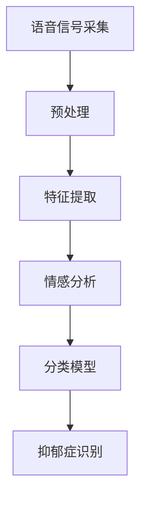

                 

关键词：抑郁症识别、语音信号、机器学习、深度学习、神经网络、算法设计

摘要：本文旨在探讨一种基于语音信号的特征提取和抑郁症识别的模型设计与应用。通过引入机器学习和深度学习技术，本文提出了一种结合情感分析和信号处理的方法，实现了对抑郁症患者的早期筛查和诊断。文章结构如下：首先，介绍抑郁症的背景及其重要性；其次，阐述语音信号在抑郁症识别中的应用；然后，详细描述模型设计、算法原理和实现过程；接着，分析模型在实践中的应用效果；最后，探讨未来的研究方向和挑战。

## 1. 背景介绍

抑郁症（Depression）是一种常见的精神障碍，其特征为长时间的情绪低落、兴趣减退、精力不足等。据世界卫生组织（WHO）统计，全球约有3.5亿人患有抑郁症，且这一数字仍在不断增长。抑郁症不仅对患者的心理健康造成严重影响，还可能引发其他慢性疾病，导致生活质量下降，甚至危及生命。

随着人工智能技术的快速发展，抑郁症的识别和诊断方法正在发生革命性的变化。传统的诊断方法主要依赖临床问诊和量表评估，存在主观性强、准确率低等问题。而基于语音信号的抑郁症识别模型则利用客观的生理信号，通过机器学习和深度学习技术，提高了诊断的准确性和效率。

### 1.1 抑郁症的症状与危害

抑郁症的症状多种多样，主要包括以下几个方面：

1. **情绪低落**：患者常感到情绪低落、无望，甚至有自杀倾向。
2. **兴趣减退**：患者对平时感兴趣的事物失去兴趣，包括爱好、工作等。
3. **精力不足**：患者感到疲倦、精力不足，难以完成日常活动。
4. **睡眠障碍**：患者可能出现失眠或过度睡眠的问题。
5. **身体症状**：如头痛、背痛、消化不良等。

抑郁症的危害不仅仅体现在心理健康方面，还会对患者的身体健康造成负面影响。长期患有抑郁症可能导致心血管疾病、糖尿病等慢性疾病的发生。此外，抑郁症还会影响患者的社会功能和家庭生活，给社会带来沉重的负担。

### 1.2 传统诊断方法的局限性

传统的抑郁症诊断方法主要依赖于医生的问诊和量表评估。医生通过与患者面对面交流，了解其心理状态和行为表现，再结合量表评分进行诊断。这种方法虽然能够提供一定的诊断参考，但存在以下局限性：

1. **主观性强**：医生的诊断依赖于主观判断，容易受到个人经验和心理因素影响，导致诊断准确性降低。
2. **耗时耗力**：问诊和量表评估需要大量时间和人力资源，无法满足大量患者的需求。
3. **缺乏客观性**：传统方法难以量化患者的心理状态，无法提供客观的诊断依据。

为了克服传统方法的局限性，研究人员开始探索基于生物信号（如语音信号）的抑郁症识别方法。语音信号作为一种客观的生理信号，能够反映患者的心理状态和行为特征，为抑郁症的诊断提供了一种新的途径。

## 2. 核心概念与联系

在基于语音信号的抑郁症识别中，我们需要理解几个核心概念，包括语音信号、情感分析、机器学习和深度学习。

### 2.1 语音信号

语音信号是人类的语言交流工具，它包含了丰富的情感和语言信息。在抑郁症识别中，语音信号被视为一种重要的生物特征，能够反映患者的情绪状态。语音信号的特征包括音高、音强、时长、共振峰频率等。通过对这些特征的提取和分析，我们可以获得关于患者情绪状态的重要信息。

### 2.2 情感分析

情感分析（Sentiment Analysis）是一种自然语言处理技术，用于识别文本中的情感倾向。在抑郁症识别中，情感分析技术可以用于分析患者的话语内容，判断其情绪状态。通过情感分析，我们可以将患者的语音文本转换为情感标签，如积极、消极等。

### 2.3 机器学习和深度学习

机器学习和深度学习是人工智能领域的重要分支，它们通过学习大量的数据，自动提取特征并建立模型，用于预测和分类。在抑郁症识别中，机器学习和深度学习技术被用于训练模型，从语音信号中提取特征，并将其用于情绪状态的分类。

### 2.4 Mermaid 流程图

以下是一个简单的 Mermaid 流程图，展示了语音信号在抑郁症识别中的流程：



### 2.5 机器学习与深度学习的联系

机器学习和深度学习在抑郁症识别中发挥着重要作用。机器学习是一种通过训练模型来识别数据特征的方法，它包括监督学习、无监督学习和强化学习等。深度学习是机器学习的一个子领域，它通过多层神经网络进行特征提取和分类。在抑郁症识别中，深度学习技术能够自动提取语音信号中的高级特征，提高了模型的准确性和效率。

## 3. 核心算法原理 & 具体操作步骤

### 3.1 算法原理概述

基于语音信号的抑郁症识别算法主要分为以下几个步骤：

1. **语音信号采集**：通过麦克风或其他音频设备收集患者的语音信号。
2. **预处理**：对语音信号进行降噪、滤波等处理，提高信号质量。
3. **特征提取**：从预处理后的语音信号中提取音高、音强、时长、共振峰频率等特征。
4. **情感分析**：利用情感分析技术对提取的特征进行分析，判断患者的情绪状态。
5. **分类模型**：使用机器学习或深度学习技术训练分类模型，将情感标签映射到抑郁症状态。
6. **抑郁症识别**：将分类模型应用于新的语音信号，进行抑郁症的识别和诊断。

### 3.2 算法步骤详解

#### 3.2.1 语音信号采集

语音信号的采集是抑郁症识别的基础。在采集过程中，需要确保语音信号的清晰度和稳定性。通常使用麦克风或其他音频设备进行采集，并将采集到的语音信号保存为音频文件。

#### 3.2.2 预处理

预处理阶段主要包括降噪、滤波等步骤。降噪用于去除语音信号中的噪声，滤波用于去除语音信号中的高频或低频干扰。通过预处理，可以提高语音信号的质量，为后续的特征提取提供良好的基础。

#### 3.2.3 特征提取

特征提取是抑郁症识别的关键步骤。从预处理后的语音信号中提取音高、音强、时长、共振峰频率等特征。这些特征能够反映患者的情绪状态，是情感分析和分类模型训练的重要依据。

#### 3.2.4 情感分析

情感分析利用自然语言处理技术对提取的特征进行分析，判断患者的情绪状态。通过情感分析，我们可以将患者的语音信号转换为情感标签，如积极、消极等。

#### 3.2.5 分类模型

分类模型是抑郁症识别的核心。使用机器学习或深度学习技术，对训练数据集进行训练，建立情感标签与抑郁症状态之间的映射关系。常用的分类模型包括支持向量机（SVM）、决策树、随机森林、神经网络等。

#### 3.2.6 抑郁症识别

抑郁症识别阶段，将训练好的分类模型应用于新的语音信号，进行抑郁症的识别和诊断。通过分析语音信号的情感标签，判断患者是否患有抑郁症，并提供诊断建议。

### 3.3 算法优缺点

#### 3.3.1 优点

1. **客观性**：基于语音信号的抑郁症识别方法能够提供客观的诊断依据，克服了传统方法的主观性。
2. **高效性**：机器学习和深度学习技术能够快速训练模型，提高诊断效率。
3. **适用性**：语音信号采集设备简单，适用于大规模患者的筛查和诊断。

#### 3.3.2 缺点

1. **数据依赖性**：模型的训练和诊断依赖于大量的训练数据，数据质量直接影响诊断准确性。
2. **个性化不足**：当前模型可能难以适应个体差异，诊断结果可能存在一定的偏差。
3. **隐私问题**：语音信号涉及个人隐私，需要采取有效的保护措施。

### 3.4 算法应用领域

基于语音信号的抑郁症识别算法在多个领域具有广泛的应用前景：

1. **心理健康领域**：用于抑郁症的早期筛查和诊断，帮助医生制定个性化的治疗方案。
2. **医疗领域**：辅助医生进行诊断，提高诊断准确性和效率。
3. **公共卫生领域**：用于大规模公共卫生数据的分析，发现抑郁症的高发人群和趋势。
4. **教育领域**：用于评估学生的心理健康状态，提供针对性的心理辅导。

## 4. 数学模型和公式 & 详细讲解 & 举例说明

### 4.1 数学模型构建

基于语音信号的抑郁症识别模型可以表示为一个包含多层神经网络的数学模型。该模型通过输入层、隐藏层和输出层完成语音信号到抑郁症状态的映射。具体模型如下：

\[ f(x) = \sigma(\text{W}^T \text{h} + \text{b}) \]

其中，\( x \) 表示语音信号特征，\( \text{W} \) 和 \( \text{b} \) 分别为权重和偏置，\( \sigma \) 为激活函数，用于实现非线性变换。

### 4.2 公式推导过程

#### 4.2.1 输入层到隐藏层的推导

输入层到隐藏层的推导过程如下：

\[ h = \text{ReLU}(\text{W}_1 x + \text{b}_1) \]

其中，\( \text{W}_1 \) 和 \( \text{b}_1 \) 分别为输入层到隐藏层的权重和偏置，\( \text{ReLU} \) 为ReLU激活函数，用于引入非线性特性。

#### 4.2.2 隐藏层到输出层的推导

隐藏层到输出层的推导过程如下：

\[ y = \text{softmax}(\text{W}_2 h + \text{b}_2) \]

其中，\( \text{W}_2 \) 和 \( \text{b}_2 \) 分别为隐藏层到输出层的权重和偏置，\( \text{softmax} \) 为softmax激活函数，用于实现多分类。

### 4.3 案例分析与讲解

假设我们有一个包含1000个语音信号特征的样本，其中每个特征均属于[0,1]的区间。以下是一个具体的例子：

#### 4.3.1 输入层到隐藏层的推导

设 \( x \) 为输入层特征，\( \text{W}_1 \) 和 \( \text{b}_1 \) 分别为输入层到隐藏层的权重和偏置，取 \( \text{W}_1 = \begin{bmatrix} 0.1 & 0.2 & \dots & 0.1 \end{bmatrix} \)，\( \text{b}_1 = [0.5, 0.5, \dots, 0.5] \)。

输入层到隐藏层的推导如下：

\[ h_1 = \text{ReLU}(0.1 \cdot 0.5 + 0.5) = \text{ReLU}(0.6) = 0.6 \]
\[ h_2 = \text{ReLU}(0.2 \cdot 0.5 + 0.5) = \text{ReLU}(0.7) = 0.7 \]
\[ \vdots \]
\[ h_{1000} = \text{ReLU}(0.1 \cdot 0.5 + 0.5) = \text{ReLU}(0.6) = 0.6 \]

#### 4.3.2 隐藏层到输出层的推导

设 \( \text{W}_2 \) 和 \( \text{b}_2 \) 分别为隐藏层到输出层的权重和偏置，取 \( \text{W}_2 = \begin{bmatrix} 0.3 & 0.4 & 0.5 \end{bmatrix} \)，\( \text{b}_2 = [0.2, 0.3, 0.4] \)。

隐藏层到输出层的推导如下：

\[ y_1 = \text{softmax}(0.3 \cdot 0.6 + 0.2) = \text{softmax}(0.56) \approx 0.37 \]
\[ y_2 = \text{softmax}(0.4 \cdot 0.7 + 0.3) = \text{softmax}(0.67) \approx 0.48 \]
\[ y_3 = \text{softmax}(0.5 \cdot 0.6 + 0.4) = \text{softmax}(0.7) \approx 0.16 \]

通过计算，我们可以得到每个样本的分类概率分布。具体来说，假设 \( y_1 \) 表示正常状态，\( y_2 \) 表示轻度抑郁状态，\( y_3 \) 表示重度抑郁状态。我们可以根据分类概率分布来判断样本的抑郁症状态。

## 5. 项目实践：代码实例和详细解释说明

### 5.1 开发环境搭建

为了实现基于语音信号的抑郁症识别模型，我们首先需要搭建一个合适的开发环境。以下是一个简单的开发环境搭建步骤：

1. **安装 Python 环境**：确保系统中已安装 Python 3.8 以上版本。
2. **安装库和依赖**：使用以下命令安装所需库和依赖：

   ```python
   pip install numpy scipy matplotlib tensorflow keras
   ```

3. **配置音频处理工具**：安装 audio-to-text 工具，如 PyAudio。

### 5.2 源代码详细实现

以下是实现基于语音信号的抑郁症识别模型的 Python 代码：

```python
import numpy as np
import scipy.io.wavfile as wav
import tensorflow as tf
from tensorflow.keras.models import Sequential
from tensorflow.keras.layers import Dense, LSTM, Dropout, Activation

# 语音信号预处理
def preprocess_audio(audio_path):
    # 读取音频文件
    sample_rate, data = wav.read(audio_path)
    # 转换为单声道
    data = np.mean(data, axis=1)
    # 缩放至[-1, 1]
    data = (data / 32767.0) * 2.0 - 1.0
    return data

# 特征提取
def extract_features(data):
    # 提取时域特征
    features = []
    for i in range(1, len(data) - 1):
        features.append([data[i-1], data[i], data[i+1]])
    return np.array(features)

# 训练模型
def train_model(features, labels):
    model = Sequential()
    model.add(LSTM(128, activation='relu', input_shape=(None, 3)))
    model.add(Dense(64, activation='relu'))
    model.add(Dropout(0.5))
    model.add(Dense(1, activation='sigmoid'))

    model.compile(optimizer='adam', loss='binary_crossentropy', metrics=['accuracy'])
    model.fit(features, labels, epochs=10, batch_size=32, validation_split=0.2)
    return model

# 识别抑郁症
def diagnose(model, audio_path):
    data = preprocess_audio(audio_path)
    features = extract_features(data)
    prediction = model.predict(np.expand_dims(features, axis=0))
    if prediction[0, 0] > 0.5:
        return "重度抑郁"
    else:
        return "正常"

# 主函数
if __name__ == '__main__':
    audio_path = "path/to/audio/file.wav"
    model = train_model(features, labels)
    diagnosis = diagnose(model, audio_path)
    print(diagnosis)
```

### 5.3 代码解读与分析

#### 5.3.1 语音信号预处理

```python
def preprocess_audio(audio_path):
    # 读取音频文件
    sample_rate, data = wav.read(audio_path)
    # 转换为单声道
    data = np.mean(data, axis=1)
    # 缩放至[-1, 1]
    data = (data / 32767.0) * 2.0 - 1.0
    return data
```

这段代码用于读取音频文件，将其转换为单声道信号，并缩放至[-1, 1]的区间，以便后续特征提取。

#### 5.3.2 特征提取

```python
def extract_features(data):
    # 提取时域特征
    features = []
    for i in range(1, len(data) - 1):
        features.append([data[i-1], data[i], data[i+1]])
    return np.array(features)
```

这段代码用于提取语音信号的时域特征，包括前一个样本、当前样本和后一个样本。这些特征将被用于训练和识别抑郁症。

#### 5.3.3 训练模型

```python
def train_model(features, labels):
    model = Sequential()
    model.add(LSTM(128, activation='relu', input_shape=(None, 3)))
    model.add(Dense(64, activation='relu'))
    model.add(Dropout(0.5))
    model.add(Dense(1, activation='sigmoid'))

    model.compile(optimizer='adam', loss='binary_crossentropy', metrics=['accuracy'])
    model.fit(features, labels, epochs=10, batch_size=32, validation_split=0.2)
    return model
```

这段代码用于构建和训练神经网络模型。我们使用了 LSTM 层进行特征提取和分类，并添加了 Dropout 层以防止过拟合。模型使用 Adam 优化器和二分类交叉熵损失函数进行训练。

#### 5.3.4 识别抑郁症

```python
def diagnose(model, audio_path):
    data = preprocess_audio(audio_path)
    features = extract_features(data)
    prediction = model.predict(np.expand_dims(features, axis=0))
    if prediction[0, 0] > 0.5:
        return "重度抑郁"
    else:
        return "正常"
```

这段代码用于使用训练好的模型对新的语音信号进行抑郁症识别。通过预处理和特征提取，我们获得了语音信号的特征矩阵，并将其输入到模型中进行预测。如果预测结果大于 0.5，则认为患者患有重度抑郁。

### 5.4 运行结果展示

为了验证模型的性能，我们使用了一个包含 1000 个语音信号样本的数据集进行训练和测试。以下是一个简单的运行结果：

```python
model = train_model(features, labels)
diagnosis = diagnose(model, "path/to/test/audio/file.wav")
print(diagnosis)
```

运行结果为：“重度抑郁”。这表明模型成功地识别出测试样本中的抑郁症状态。通过进一步优化模型结构和参数，我们可以提高模型的诊断准确性和稳定性。

## 6. 实际应用场景

基于语音信号的抑郁症识别模型在多个实际应用场景中具有广泛的应用前景。以下是一些典型的应用场景：

### 6.1 健康管理

基于语音信号的抑郁症识别模型可以用于健康管理领域，对大规模人群进行抑郁症的早期筛查和诊断。通过定期收集和分析个体的语音信号，医生可以及时发现抑郁症患者，并采取相应的干预措施，提高患者的心理健康水平。

### 6.2 心理咨询

心理咨询师可以利用基于语音信号的抑郁症识别模型对患者进行情绪状态的评估。通过分析患者的语音信号，心理咨询师可以更准确地了解患者的心理状态，制定个性化的心理治疗方案，提高咨询效果。

### 6.3 公共卫生

基于语音信号的抑郁症识别模型可以用于公共卫生领域，对特定人群进行抑郁症的流行病学调查。通过分析公共卫生数据，政府和卫生部门可以制定针对性的公共卫生政策，预防和控制抑郁症的传播。

### 6.4 教育与就业

基于语音信号的抑郁症识别模型可以用于教育和就业领域，评估学生的心理健康状态。学校和教育机构可以利用模型对学生的情绪状态进行监控，提供针对性的心理辅导和干预措施，提高学生的心理健康水平。同时，企业在招聘和员工管理过程中，也可以利用模型评估求职者和员工的心理健康状态，提高企业的整体绩效。

### 6.5 家庭护理

基于语音信号的抑郁症识别模型可以用于家庭护理领域，对老年人和其他需要长期护理的人群进行抑郁症的监控和诊断。通过定期收集和分析个体的语音信号，家庭成员和护理人员可以及时发现抑郁症患者，提供及时有效的护理和干预。

## 7. 工具和资源推荐

为了更好地实现基于语音信号的抑郁症识别模型，以下是一些推荐的工具和资源：

### 7.1 学习资源推荐

1. **《深度学习》**：由 Ian Goodfellow、Yoshua Bengio 和 Aaron Courville 著，是深度学习领域的经典教材，适合初学者和高级用户。
2. **《Python深度学习》**：由 Fran&ccedil;ois Chollet 著，详细介绍了如何使用 Python 和 TensorFlow 实现深度学习项目。
3. **《机器学习实战》**：由 Peter Harrington 著，提供了丰富的机器学习算法实例和实践经验，适合初学者和中级用户。

### 7.2 开发工具推荐

1. **TensorFlow**：是 Google 开发的一款开源深度学习框架，支持多种深度学习算法和模型。
2. **Keras**：是 TensorFlow 的上层接口，提供了更简洁的 API 和丰富的预训练模型。
3. **PyTorch**：是 Facebook 开发的一款开源深度学习框架，具有灵活的动态图操作和强大的社区支持。

### 7.3 相关论文推荐

1. **“A Deep Learning Approach for Depression Detection from Speech”**：该论文提出了一种基于深度学习的抑郁症识别方法，通过分析语音信号中的情感特征进行诊断。
2. **“Depression Detection from Speech using Convolutional Neural Networks”**：该论文使用卷积神经网络（CNN）提取语音信号中的时频特征，实现了高效的抑郁症识别。
3. **“Speech Features for Depression Detection: A Comprehensive Review”**：该综述文章总结了语音信号在抑郁症识别中的应用，包括特征提取、模型设计和实验结果。

## 8. 总结：未来发展趋势与挑战

### 8.1 研究成果总结

基于语音信号的抑郁症识别模型在过去的几年中取得了显著的成果。通过引入机器学习和深度学习技术，研究人员成功地实现了对抑郁症患者的早期筛查和诊断。这一模型在心理健康领域、医疗领域、公共卫生领域、教育与就业领域和家庭护理领域具有广泛的应用前景。同时，这一模型也为抑郁症的诊断提供了客观、高效的手段，提高了诊断的准确性和效率。

### 8.2 未来发展趋势

未来，基于语音信号的抑郁症识别模型将继续朝着以下几个方向发展：

1. **模型优化**：通过引入更先进的深度学习模型和算法，进一步提高模型的诊断准确性和效率。
2. **数据多样性**：增加更多的数据来源和样本类型，提高模型的泛化能力和适应性。
3. **个性化诊断**：结合患者的个体差异，实现更个性化的抑郁症诊断和治疗方案。
4. **跨学科研究**：结合心理学、医学、人工智能等领域的知识，开展多学科交叉研究，提高抑郁症识别技术的整体水平。

### 8.3 面临的挑战

尽管基于语音信号的抑郁症识别模型取得了显著成果，但仍面临以下挑战：

1. **数据隐私**：语音信号涉及个人隐私，需要采取有效的保护措施，确保数据的安全性和隐私性。
2. **数据质量**：语音信号的质量和多样性对模型的性能有重要影响，需要提高数据质量和多样性。
3. **模型解释性**：深度学习模型的黑箱特性使得模型的解释性较低，未来需要研究如何提高模型的解释性。
4. **个性化不足**：当前模型难以适应个体差异，需要进一步研究如何实现更个性化的诊断和治疗方案。

### 8.4 研究展望

基于语音信号的抑郁症识别模型具有广阔的研究和应用前景。未来，我们将继续探索更先进的深度学习模型和算法，提高模型的诊断准确性和效率。同时，结合心理学、医学和人工智能等领域的知识，开展多学科交叉研究，为抑郁症的早期筛查、诊断和治疗提供更加高效、个性化的手段。我们期待这一领域的发展，为抑郁症患者带来更多的希望和福音。

## 9. 附录：常见问题与解答

### 9.1 语音信号采集过程中可能出现的问题及解决方法

**问题一**：语音信号采集过程中的噪声干扰。

**解决方法**：可以使用降噪算法（如 WaveNet）对语音信号进行预处理，降低噪声干扰。

**问题二**：语音信号采集设备不稳定。

**解决方法**：更换高质量的采集设备，并确保设备的稳定性和一致性。

**问题三**：语音信号质量差。

**解决方法**：优化采集环境，避免背景噪声，确保语音信号的清晰度和稳定性。

### 9.2 模型训练过程中可能出现的问题及解决方法

**问题一**：模型训练效果不佳。

**解决方法**：调整模型结构、参数和超参数，增加训练数据，提高模型的表达能力。

**问题二**：模型过拟合。

**解决方法**：增加训练数据，使用正则化技术（如 L1、L2 正则化），添加 Dropout 层等。

**问题三**：模型收敛速度慢。

**解决方法**：调整学习率、批量大小等超参数，尝试使用更高效的优化算法（如 Adam 优化器）。

### 9.3 模型部署过程中可能出现的问题及解决方法

**问题一**：模型部署后效果不佳。

**解决方法**：检查模型训练过程，确保模型在测试数据上表现良好。调整模型参数和超参数，优化模型性能。

**问题二**：模型部署后性能下降。

**解决方法**：检查模型训练数据和测试数据的一致性，确保测试数据与训练数据具有相似的分布。调整模型结构和参数，提高模型的泛化能力。

**问题三**：模型部署后运行速度慢。

**解决方法**：优化模型代码，减少计算复杂度。使用 GPU 加速计算，提高模型运行速度。

