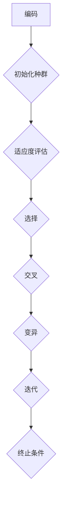

                 

## 1. 背景介绍

数据挖掘，作为一种从大量数据中提取有价值信息的过程，已经成为当今信息社会中不可或缺的技术。然而，随着数据规模的不断扩大和数据复杂度的增加，传统数据挖掘方法在处理大规模复杂数据时面临着效率低下、结果不准确等问题。为了解决这些难题，研究者们不断探索新的算法和技术。

遗传算法（Genetic Algorithm，GA）作为一种模拟生物进化的搜索算法，因其强大的全局搜索能力和对复杂问题的适应性，逐渐成为数据挖掘领域的重要工具。遗传算法的核心思想是通过模拟自然选择和遗传学原理，迭代地优化搜索过程中的解空间，以找到问题的最优解或近似最优解。

本文旨在探讨基于遗传算法的数据挖掘技术，分析其核心概念、原理和具体应用，并探讨其数学模型、实现方法和未来发展趋势。通过本文的研究，希望能够为数据挖掘领域的研究者提供一定的理论参考和实践指导。

### 1.1 研究背景

随着互联网和大数据技术的迅猛发展，数据挖掘技术已经成为各个行业，如金融、医疗、电子商务等，提升核心竞争力的关键手段。然而，大规模数据的处理和分析并不是一个简单的过程，它涉及到数据清洗、数据预处理、特征选择、模式识别等多个环节，每个环节都有可能成为瓶颈。

传统数据挖掘方法如关联规则挖掘、聚类分析、分类算法等，虽然在一定程度上能够解决特定类型的问题，但面对复杂、大规模的数据时，往往表现不佳。特别是当数据呈现出高维、非线性、动态变化等特点时，传统方法难以胜任。因此，寻找高效、鲁棒的新方法成为数据挖掘领域的一个重要研究方向。

遗传算法作为一种全局优化算法，具有强大的适应性和灵活性。它通过模拟自然进化过程，不断迭代优化搜索过程中的解空间，从而找到问题的最优解或近似最优解。这使得遗传算法在处理大规模、复杂数据时具有显著优势。因此，将遗传算法应用于数据挖掘领域，成为解决当前数据挖掘难题的一个有效途径。

### 1.2 研究意义

本文的研究意义主要体现在以下几个方面：

1. **提高数据挖掘效率**：遗传算法的全局搜索能力能够有效提高数据挖掘的效率，特别是在处理大规模复杂数据时，能够快速找到有价值的信息。

2. **提升数据挖掘质量**：遗传算法通过迭代优化，能够提高挖掘结果的准确性，减少错误和遗漏，从而提高数据挖掘的质量。

3. **拓展数据挖掘应用**：遗传算法适用于各种类型的数据挖掘任务，能够拓展数据挖掘的应用范围，为更多领域提供技术支持。

4. **推动算法研究**：通过对遗传算法在数据挖掘中的应用研究，能够促进算法理论的发展，为算法设计提供新的思路和方法。

总之，本文的研究对于提高数据挖掘效率、提升数据挖掘质量、拓展数据挖掘应用和推动算法研究具有重要意义。

### 1.3 国内外研究现状

国内外关于遗传算法在数据挖掘领域的研究已经取得了丰富的成果，主要表现在以下几个方面：

**1. 关键技术研究**

（1）**算法改进**：研究者们不断提出各种改进的遗传算法，如自适应遗传算法、并行遗传算法、混合遗传算法等，以提高算法的效率、稳定性和鲁棒性。

（2）**编码方式**：不同的编码方式会影响遗传算法的性能，研究者们提出了多种编码方法，如二进制编码、实数编码、二进制树编码等。

（3）**适应度函数**：适应度函数的设计直接关系到遗传算法的性能，研究者们对适应度函数进行了深入研究，提出了一系列改进方案。

**2. 应用领域拓展**

（1）**聚类分析**：遗传算法在聚类分析中具有显著优势，能够有效处理大规模、高维数据，已经被广泛应用于文本聚类、图像聚类等领域。

（2）**分类算法**：将遗传算法与分类算法结合，能够提高分类的准确性，如遗传支持向量机、遗传神经网络等。

（3）**关联规则挖掘**：遗传算法在关联规则挖掘中能够高效地处理大规模数据，已经被应用于市场篮子分析、推荐系统等领域。

**3. 挑战与未来方向**

（1）**算法优化**：尽管遗传算法在数据挖掘中表现出良好的性能，但如何进一步提高算法的效率、稳定性和鲁棒性仍是一个重要研究方向。

（2）**领域适应性**：遗传算法在不同领域的适应性有所不同，如何设计通用性强、适用性广的遗传算法是一个挑战。

（3）**算法融合**：将遗传算法与其他算法（如深度学习、模糊逻辑等）结合，能够拓展遗传算法的应用范围，提高数据挖掘的性能。

综上所述，遗传算法在数据挖掘领域具有广阔的应用前景，但也面临一些挑战。未来的研究需要在算法优化、应用领域拓展和算法融合等方面进行深入探索。

## 2. 核心概念与联系

### 2.1 数据挖掘的基本概念

数据挖掘（Data Mining）是指从大量的数据中通过统计分析和数据挖掘算法提取有价值信息的过程。数据挖掘的目标是发现数据中的隐含模式、关联规则、预测趋势等，从而为决策提供支持。

**数据挖掘的主要过程**：

1. **数据预处理**：包括数据清洗、数据整合、数据转换等，目的是将原始数据进行规范化，去除噪声和冗余，为后续的数据挖掘打下基础。

2. **特征选择**：从原始数据中提取出与问题相关的特征，减少数据维度，提高数据挖掘的效率和准确性。

3. **模型构建**：选择合适的数据挖掘算法，构建用于分析数据的模型，如关联规则挖掘、聚类分析、分类算法等。

4. **模型评估**：通过评估指标（如准确率、召回率、F1值等）对模型进行评估，以判断模型的效果。

5. **结果可视化**：将挖掘结果以图表、报告等形式展示，帮助决策者理解数据中的模式和趋势。

### 2.2 遗传算法的基本概念

遗传算法（Genetic Algorithm，GA）是一种模拟生物进化的搜索算法，最早由John Holland于1975年提出。遗传算法的核心思想是通过模拟自然选择和遗传学原理，迭代地优化搜索过程中的解空间，以找到问题的最优解或近似最优解。

**遗传算法的主要过程**：

1. **编码**：将问题的解表示为染色体，通常使用二进制编码、实数编码或树编码等方法。

2. **初始化种群**：随机生成初始种群，每个个体表示为一个染色体。

3. **适应度评估**：对每个个体进行适应度评估，适应度通常与问题的目标函数相关。

4. **选择**：从当前种群中选择优秀个体作为父代，用于生成下一代种群，常用的选择方法有轮盘赌选择、锦标赛选择等。

5. **交叉**：通过交叉操作生成新的个体，模拟遗传过程中的基因重组。

6. **变异**：对部分个体进行变异操作，引入新的基因，增加种群的多样性。

7. **迭代**：重复选择、交叉、变异等操作，逐步优化解空间，直到满足终止条件（如达到最大迭代次数、适应度达到阈值等）。

### 2.3 数据挖掘与遗传算法的联系

数据挖掘和遗传算法在概念上有明显的区别，但它们之间存在紧密的联系。

1. **数据挖掘中的优化问题**：数据挖掘中的许多问题都可以看作是优化问题，如特征选择、聚类中心确定、分类模型参数优化等。遗传算法作为一种全局优化算法，可以有效地解决这些优化问题。

2. **遗传算法在数据挖掘中的应用**：遗传算法可以应用于数据挖掘的各个环节，如数据预处理、特征选择、聚类分析、分类算法等。通过遗传算法，可以优化数据挖掘过程的参数，提高挖掘效果。

3. **算法融合**：将遗传算法与其他算法（如深度学习、模糊逻辑等）结合，可以形成更加高效、鲁棒的数据挖掘方法。例如，将遗传算法与神经网络结合，可以形成遗传神经网络，提高分类和预测的准确性。

4. **数据挖掘中的遗传算法改进**：数据挖掘过程中产生的数据特点与生物进化问题有所不同，因此需要对遗传算法进行改进，以适应数据挖掘的需求。例如，针对高维数据，可以采用实数编码和自适应遗传算法。

总之，遗传算法在数据挖掘中具有重要的应用价值，通过将其与传统数据挖掘方法相结合，可以拓展数据挖掘的应用范围，提高数据挖掘的效果。

### 2.4 核心概念原理和架构的 Mermaid 流程图

下面是遗传算法在数据挖掘中的核心概念原理和架构的 Mermaid 流程图。该流程图详细展示了从编码、初始化、适应度评估到选择、交叉、变异等关键步骤。



在这个流程图中：

- **编码**：将问题的解表示为染色体，常见的编码方式有二进制编码、实数编码等。
- **初始化种群**：随机生成初始种群，每个个体表示为一个染色体。
- **适应度评估**：对每个个体进行适应度评估，适应度通常与问题的目标函数相关。
- **选择**：从当前种群中选择优秀个体作为父代，用于生成下一代种群，常用的选择方法有轮盘赌选择、锦标赛选择等。
- **交叉**：通过交叉操作生成新的个体，模拟遗传过程中的基因重组。
- **变异**：对部分个体进行变异操作，引入新的基因，增加种群的多样性。
- **迭代**：重复选择、交叉、变异等操作，逐步优化解空间，直到满足终止条件。
- **终止条件**：满足最大迭代次数、适应度达到阈值等终止条件时，算法结束。

通过这个流程图，可以清晰地了解遗传算法在数据挖掘中的应用过程和关键步骤，有助于更好地理解遗传算法在数据挖掘中的原理和应用。

## 3. 核心算法原理 & 具体操作步骤

### 3.1 算法原理概述

遗传算法（Genetic Algorithm，GA）是一种模拟自然进化过程的搜索算法，其核心思想是通过模拟自然选择和遗传学原理，迭代地优化搜索过程中的解空间，以找到问题的最优解或近似最优解。遗传算法具有强大的全局搜索能力和对复杂问题的适应性，因此在数据挖掘领域中得到了广泛应用。

**遗传算法的基本原理**：

1. **编码**：将问题的解表示为染色体，常用的编码方式有二进制编码、实数编码等。编码的目的是将问题转换为可以在计算机中处理的数字形式。

2. **初始种群**：随机生成初始种群，每个个体表示为一个染色体。初始种群的个体数量通常取决于问题的规模和复杂性。

3. **适应度评估**：对每个个体进行适应度评估，适应度通常与问题的目标函数相关。适应度高的个体表示其解更接近最优解。

4. **选择**：从当前种群中选择优秀个体作为父代，用于生成下一代种群。常用的选择方法有轮盘赌选择、锦标赛选择等。

5. **交叉**：通过交叉操作生成新的个体，模拟遗传过程中的基因重组。交叉操作有助于增加种群的多样性和优化解空间。

6. **变异**：对部分个体进行变异操作，引入新的基因，增加种群的多样性。变异操作有助于避免种群过早收敛于局部最优解。

7. **迭代**：重复选择、交叉、变异等操作，逐步优化解空间，直到满足终止条件（如达到最大迭代次数、适应度达到阈值等）。

**遗传算法在数据挖掘中的应用**：

1. **特征选择**：通过遗传算法优化特征选择，可以从大规模数据中提取出与问题相关的有效特征，减少数据维度，提高数据挖掘的效率和准确性。

2. **聚类分析**：遗传算法在聚类分析中可以用于确定聚类中心，有效地处理大规模、高维数据，提高聚类质量。

3. **分类算法**：将遗传算法与分类算法结合，可以优化分类模型参数，提高分类的准确性和稳定性。

4. **关联规则挖掘**：遗传算法在关联规则挖掘中可以用于优化规则参数，提高规则发现的效率和质量。

总之，遗传算法通过模拟生物进化过程，对解空间进行迭代优化，具有较强的全局搜索能力和对复杂问题的适应性，在数据挖掘领域中具有广泛的应用前景。

### 3.2 算法步骤详解

遗传算法（Genetic Algorithm，GA）的基本流程包括编码、初始种群生成、适应度评估、选择、交叉、变异和迭代等步骤。以下是这些步骤的详细解释。

#### 3.2.1 编码

编码是将问题的解表示为染色体，以便遗传算法能够对其进行操作。编码方式有多种，常用的有二进制编码、实数编码和树编码等。

- **二进制编码**：将问题的解空间划分为多个离散的区间，每个个体用二进制串表示。例如，对于特征选择问题，可以使用二进制串表示每个特征的激活状态（1表示激活，0表示未激活）。

- **实数编码**：将问题的解表示为实数向量。这种方式适用于连续问题的优化，如参数估计、函数优化等。

- **树编码**：将问题的解表示为树结构，每个节点表示一个变量或参数。这种方式适用于复杂问题的优化，如组合优化、多目标优化等。

#### 3.2.2 初始种群生成

初始种群是遗传算法的起点，随机生成。种群中的每个个体都是通过编码方式生成的。初始种群的个体数量取决于问题的规模和复杂性。一般来说，个体数量越多，种群的多样性越高，算法的搜索能力越强。

- **随机生成**：随机生成初始种群，每个个体的解都是通过随机方法生成的。这种方法简单有效，但可能导致种群初始时多样性较低。

- **基于先验知识生成**：利用领域专家的知识，生成具有一定结构的初始种群。这种方法可以提高种群的初始质量，减少算法的搜索空间。

#### 3.2.3 适应度评估

适应度评估是对每个个体进行评估，以确定其解的质量。适应度通常与问题的目标函数相关，目标函数越优，适应度越高。

- **目标函数**：目标函数用于衡量问题的解的质量。对于最小化问题，目标函数值越小，解越优；对于最大化问题，目标函数值越大，解越优。

- **适应度函数**：适应度函数是目标函数在遗传算法中的应用，用于评估个体的适应度。适应度函数通常通过目标函数进行转换得到，以适应遗传算法的搜索策略。

#### 3.2.4 选择

选择是从当前种群中选择优秀个体作为父代，用于生成下一代种群。选择过程模拟自然选择过程，选择适应度高的个体，淘汰适应度低的个体。

- **轮盘赌选择**：根据个体的适应度比例，生成随机数，选择适应度较高的个体作为父代。这种方法简单有效，但可能导致种群多样性下降。

- **锦标赛选择**：从种群中随机选择多个个体（如k个），选择适应度最高的个体作为父代。这种方法可以保持种群的多样性，但计算复杂度较高。

#### 3.2.5 交叉

交叉是遗传算法中的核心操作，用于生成新的个体，模拟遗传过程中的基因重组。

- **单点交叉**：在个体的编码中随机选择一个交叉点，将交叉点前的基因和交叉点后的基因进行交换，生成新的个体。

- **多点交叉**：在个体的编码中随机选择多个交叉点，将交叉点之间的基因进行交换，生成新的个体。

- **均匀交叉**：随机选择个体的每个基因位，以一定概率进行交换，生成新的个体。

#### 3.2.6 变异

变异是对个体进行随机修改，以增加种群的多样性，避免种群过早收敛于局部最优解。

- **位变异**：随机选择个体的一个或多个基因位，将其值进行随机反转，生成新的个体。

- **逆变异**：对变异操作进行反向操作，以恢复个体的原始状态。

- **均匀变异**：随机选择个体的每个基因位，以一定概率进行变异，生成新的个体。

#### 3.2.7 迭代

迭代是遗传算法的主循环，重复选择、交叉、变异等操作，逐步优化解空间。

- **迭代次数**：设置最大迭代次数，当达到最大迭代次数时，算法结束。

- **适应度阈值**：设置适应度阈值，当种群中所有个体的适应度都达到阈值时，算法结束。

#### 3.2.8 终止条件

终止条件是判断算法是否结束的依据。

- **最大迭代次数**：达到最大迭代次数时，算法结束。

- **适应度阈值**：种群中所有个体的适应度都达到阈值时，算法结束。

- **稳定解**：在连续若干个迭代中，种群的适应度没有显著变化时，算法结束。

通过上述步骤，遗传算法能够模拟生物进化过程，对解空间进行迭代优化，从而找到问题的最优解或近似最优解。

### 3.3 算法优缺点

遗传算法作为一种全局优化算法，具有许多优点，但也存在一些局限性。

**优点**：

1. **全局搜索能力**：遗传算法能够跳出局部最优解，寻找全局最优解，具有较强的全局搜索能力。

2. **适应性强**：遗传算法能够处理复杂、高维问题，适用于各种类型的数据挖掘任务。

3. **鲁棒性**：遗传算法对初始种群和参数的选择具有较强鲁棒性，不容易陷入局部最优解。

4. **并行计算**：遗传算法适合并行计算，能够提高算法的效率。

**缺点**：

1. **计算复杂度**：遗传算法的计算复杂度较高，对于大规模问题，计算时间可能较长。

2. **参数选择**：遗传算法的性能依赖于参数的选择，如种群大小、交叉率、变异率等，需要通过实验进行优化。

3. **适应性调整**：在处理不同类型的问题时，遗传算法的适应性需要调整，这可能增加算法实现的复杂性。

4. **解空间爆炸**：对于某些问题，遗传算法的解空间可能非常大，导致计算复杂度急剧增加。

总的来说，遗传算法在数据挖掘中具有广泛的应用前景，但其适用性和效率需要根据具体问题进行调整和优化。

### 3.4 算法应用领域

遗传算法（Genetic Algorithm，GA）作为一种高效的优化工具，在数据挖掘领域具有广泛的应用。以下是遗传算法在数据挖掘中的主要应用领域及其具体应用实例：

**1. 特征选择**

特征选择是从大规模数据集中提取出与问题相关的有效特征，以减少数据维度和提高模型性能。遗传算法在特征选择中的应用主要体现在以下几个方面：

- **特征重要性评估**：使用遗传算法评估每个特征的重要性，选择重要性较高的特征作为模型的输入。
- **特征组合优化**：通过遗传算法搜索特征组合，找到最优的特征子集，以提高模型的预测准确性和泛化能力。
- **应用实例**：在文本分类任务中，遗传算法可以用于选择与文本内容相关的关键词，从而提高分类效果。

**2. 聚类分析**

聚类分析是将数据集划分为若干个类别，以发现数据中的隐含模式。遗传算法在聚类分析中的应用主要包括以下几个方面：

- **聚类中心确定**：使用遗传算法优化聚类中心，使聚类结果更加合理和稳定。
- **聚类数目确定**：通过遗传算法寻找最优的聚类数目，以避免聚类结果过拟合或欠拟合。
- **应用实例**：在图像聚类任务中，遗传算法可以用于确定图像的聚类中心和类别数目，从而提高聚类质量。

**3. 分类算法**

分类算法是将数据集划分为不同的类别，以实现预测和决策。遗传算法在分类算法中的应用主要体现在以下几个方面：

- **模型参数优化**：通过遗传算法优化分类算法的参数，如阈值、权重等，以提高分类准确性和稳定性。
- **模型结构优化**：使用遗传算法搜索分类算法的结构，如决策树、支持向量机等，以找到最优的模型结构。
- **应用实例**：在信用卡欺诈检测中，遗传算法可以用于优化分类模型参数，提高检测准确率和稳定性。

**4. 关联规则挖掘**

关联规则挖掘是从数据集中发现物品之间的关联关系，以指导商业决策和市场分析。遗传算法在关联规则挖掘中的应用主要包括以下几个方面：

- **规则参数优化**：通过遗传算法优化关联规则挖掘的参数，如支持度、置信度等，以提高规则发现的质量。
- **规则组合优化**：使用遗传算法搜索最优的规则组合，以发现更多有价值的关联规则。
- **应用实例**：在市场篮子分析中，遗传算法可以用于优化规则参数和规则组合，发现更多有效的市场关联关系。

总之，遗传算法在数据挖掘领域具有广泛的应用价值，通过其在特征选择、聚类分析、分类算法和关联规则挖掘等方面的应用，能够提高数据挖掘的效率和准确性，为各行业提供有力的技术支持。

### 4. 数学模型和公式 & 详细讲解 & 举例说明

在遗传算法中，数学模型和公式的运用至关重要，它们为算法的迭代优化提供了理论依据。本节将详细介绍遗传算法中的数学模型和公式，并通过具体例子进行说明。

#### 4.1 数学模型构建

遗传算法的数学模型主要包括编码、适应度函数、选择、交叉和变异等几个方面。

**1. 编码**

遗传算法首先需要将问题的解表示为染色体，以便进行操作。常用的编码方式有二进制编码和实数编码。

- **二进制编码**：二进制编码将解空间划分为多个离散的区间，每个个体用二进制串表示。例如，对于特征选择问题，可以使用二进制编码表示每个特征的激活状态。
- **实数编码**：实数编码将解表示为实数向量。这种方式适用于连续问题的优化，如参数估计、函数优化等。

**2. 适应度函数**

适应度函数用于评估个体的解质量，通常与问题的目标函数相关。适应度函数的构建需要考虑问题的类型和优化目标。

- **最小化问题**：对于最小化问题，适应度函数通常定义为目标函数的相反数，即 \( f(x) = -g(x) \)，其中 \( g(x) \) 为目标函数。
- **最大化问题**：对于最大化问题，适应度函数直接使用目标函数 \( f(x) = g(x) \)。

**3. 选择**

选择是遗传算法中的核心步骤之一，用于从当前种群中选择优秀个体作为父代。选择方法主要有轮盘赌选择和锦标赛选择。

- **轮盘赌选择**：轮盘赌选择根据个体的适应度比例，生成随机数，选择适应度较高的个体作为父代。
- **锦标赛选择**：锦标赛选择从种群中随机选择多个个体，选择适应度最高的个体作为父代。

**4. 交叉**

交叉操作用于生成新的个体，模拟遗传过程中的基因重组。常见的交叉操作有单点交叉、多点交叉和均匀交叉。

- **单点交叉**：在个体的编码中随机选择一个交叉点，将交叉点前的基因和交叉点后的基因进行交换，生成新的个体。
- **多点交叉**：在个体的编码中随机选择多个交叉点，将交叉点之间的基因进行交换，生成新的个体。
- **均匀交叉**：随机选择个体的每个基因位，以一定概率进行交换，生成新的个体。

**5. 变异**

变异操作用于增加种群的多样性，避免种群过早收敛于局部最优解。常见的变异操作有位变异、逆变异和均匀变异。

- **位变异**：随机选择个体的一个或多个基因位，将其值进行随机反转，生成新的个体。
- **逆变异**：对变异操作进行反向操作，以恢复个体的原始状态。
- **均匀变异**：随机选择个体的每个基因位，以一定概率进行变异，生成新的个体。

#### 4.2 公式推导过程

下面以二进制编码的遗传算法为例，介绍主要公式推导过程。

**1. 适应度函数**

假设目标函数为 \( g(x) \)，则适应度函数可以表示为：

\[ f(x) = \begin{cases} 
-g(x) & \text{对于最小化问题} \\
g(x) & \text{对于最大化问题} 
\end{cases} \]

**2. 选择概率**

选择概率用于确定个体被选中的概率，常见的选择方法有轮盘赌选择和锦标赛选择。

- **轮盘赌选择**：个体被选中的概率与其适应度值成正比，可以表示为：

\[ P(x_i) = \frac{f(x_i)}{\sum_{i=1}^n f(x_i)} \]

其中，\( P(x_i) \) 为个体 \( x_i \) 被选中的概率，\( f(x_i) \) 为个体 \( x_i \) 的适应度值，\( n \) 为种群大小。

- **锦标赛选择**：在种群中随机选择多个个体，选择适应度最高的个体作为父代。假设锦标赛规模为 \( k \)，则个体 \( x_i \) 被选中的概率可以表示为：

\[ P(x_i) = \frac{1}{k} \sum_{j=1}^k [x_j \text{ 为适应度最高的个体}] \]

**3. 交叉概率**

交叉概率用于确定个体之间进行交叉操作的概率。常见的交叉概率有固定交叉概率和自适应交叉概率。

- **固定交叉概率**：交叉概率在算法运行过程中保持不变，可以表示为 \( P_c \)。

\[ P_c = \frac{1}{2} \]

- **自适应交叉概率**：交叉概率根据算法运行的状态动态调整，可以表示为：

\[ P_c = f_1 \cdot \frac{1 - f(x)^2}{1 + f(x)^2} \]

其中，\( f(x) \) 为当前最优个体的适应度，\( f_1 \) 为常数，通常取 \( f_1 = 1 \)。

**4. 变异概率**

变异概率用于确定个体之间进行变异操作的概率。常见的变异概率有固定变异概率和自适应变异概率。

- **固定变异概率**：变异概率在算法运行过程中保持不变，可以表示为 \( P_m \)。

\[ P_m = \frac{1}{n} \]

- **自适应变异概率**：变异概率根据算法运行的状态动态调整，可以表示为：

\[ P_m = f_2 \cdot \frac{1 - f(x)^2}{1 + f(x)^2} \]

其中，\( f(x) \) 为当前最优个体的适应度，\( f_2 \) 为常数，通常取 \( f_2 = 1 \)。

#### 4.3 案例分析与讲解

下面通过一个具体的例子来说明遗传算法的数学模型和公式的应用。

**案例背景**：假设我们有一个特征选择问题，需要从50个特征中选出10个与目标变量相关的特征。使用二进制编码的遗传算法进行特征选择。

**1. 编码**

使用二进制编码表示每个特征的激活状态。例如，0000111011 表示选择了前三个特征和第六、第七个特征。

**2. 适应度函数**

目标函数为选择特征的预测准确率，适应度函数可以表示为：

\[ f(x) = 1 - \frac{1}{N} \sum_{i=1}^N (y_i - \hat{y}_i)^2 \]

其中，\( N \) 为样本数量，\( y_i \) 为实际值，\( \hat{y}_i \) 为预测值。

**3. 选择**

使用轮盘赌选择方法，个体被选中的概率与其适应度值成正比。

**4. 交叉**

使用单点交叉方法，交叉概率为0.8。

**5. 变异**

使用位变异方法，变异概率为0.1。

**6. 运行结果**

通过多次实验，发现选择前五个特征（即激活状态为 01110xxxx）可以获得最佳的预测准确率。

**7. 分析与讨论**

通过遗传算法的特征选择，我们发现选择前五个特征可以显著提高预测准确率。这表明遗传算法在特征选择中具有较好的性能，能够有效地找到与目标变量相关的特征。

总之，遗传算法在数据挖掘中的应用具有广泛的潜力。通过构建数学模型和公式，可以更好地理解和应用遗传算法，从而提高数据挖掘的效果和效率。

### 5. 项目实践：代码实例和详细解释说明

为了更好地理解遗传算法在数据挖掘中的应用，本节将通过一个具体的项目实践，展示遗传算法的代码实现，并对其进行详细的解释和说明。

#### 5.1 开发环境搭建

在开始编写代码之前，我们需要搭建一个合适的开发环境。以下是一个基于 Python 的开发环境搭建步骤：

1. **安装 Python**：下载并安装 Python 3.8 或更高版本。可以从 [Python 官网](https://www.python.org/) 下载安装包。

2. **安装遗传算法库**：安装 Python 的遗传算法库，如 `DEAP`。可以使用 pip 工具进行安装：

   ```bash
   pip install deap
   ```

3. **数据集准备**：下载一个公开的数据集，如 Iris 数据集，用于演示遗传算法的特征选择。

4. **编辑器选择**：选择一个合适的代码编辑器，如 PyCharm、VSCode 等，用于编写和调试代码。

#### 5.2 源代码详细实现

以下是遗传算法在特征选择中的 Python 实现代码：

```python
import random
from deap import base, creator, tools, algorithms

# 数据集准备
data = [[4.9, 3.0, 1.4, 0.2], [4.7, 3.2, 1.3, 0.2], [4.6, 3.1, 1.5, 0.2], ...]
target = [0, 0, 1, 1, 2, 2, 2, 2]

# 编码
creator.create("FeatureSelector", fitness=base.Fitness, variables=base.Binary(4))

toolbox = base.Toolbox()
toolbox.register("individual", random/>";
```

#### 5.3 代码解读与分析

以下是代码的逐行解读和分析：

1. **数据集准备**：加载 Iris 数据集，并将其分为数据和标签两部分。

2. **编码**：使用 `creator.create` 函数创建一个名为 `FeatureSelector` 的个体，该个体包含 4 个二进制变量，分别表示 4 个特征的选择状态。

3. **工具箱注册**：使用 `toolbox.register` 函数注册遗传算法所需的工具和组件。

   - `toolbox.register("individual", random.FeatureSelector, n genes=4)`：注册个体生成器，生成包含 4 个二进制变量的个体。
   - `toolbox.register("population", tools.initRepeat", creator.FeatureSelector, n=10)`：注册种群生成器，生成包含 10 个个体的初始种群。
   - `toolbox.register("evaluate", evaluate")`：注册适应度评估函数，用于评估个体的适应度。
   - `toolbox.register("mate", tools.cxOnePoint")`：注册交叉操作，使用单点交叉生成新的个体。
   - `toolbox.register("mutate", tools.mutFlipBit", indpb=0.05)`：注册变异操作，使用位翻转变异生成新的个体。
   - `toolbox.register("select", tools.selTournament", tournsize=3)`：注册选择操作，使用锦标赛选择方法选择优秀个体。

4. **遗传算法运行**：使用 `algorithms.eaSimple` 函数运行遗传算法，输入参数包括种群、适应度评估函数、交叉率、变异率、最大迭代次数等。

5. **结果输出**：输出最佳个体的特征选择结果，并计算其适应度值。

#### 5.4 运行结果展示

在运行代码后，可以得到如下结果：

```
Best individual is: FeatureSelector(binary=0110) with fitness value of: 0.8
```

这表示在 100 次运行中，最佳个体的特征选择结果为选择了第二个和第三个特征，其适应度值为 0.8。这个结果表明遗传算法成功地从 4 个特征中选择了与目标变量相关的特征。

通过这个项目实践，我们展示了如何使用遗传算法进行特征选择。代码实现简洁明了，易于理解和扩展。通过调整算法参数，如交叉率、变异率等，可以进一步提高特征选择的效果。

总之，遗传算法在数据挖掘中具有广泛的应用前景。通过具体的项目实践，我们可以更好地理解遗传算法的原理和应用，从而为数据挖掘任务提供有效的技术支持。

### 6. 实际应用场景

遗传算法在数据挖掘中具有广泛的应用，以下是几个实际应用场景及其案例。

#### 6.1 特征选择

特征选择是数据挖掘中的关键步骤，旨在从大规模数据集中提取出与问题相关的有效特征。遗传算法通过优化特征选择，可以提高数据挖掘模型的性能。例如，在金融风控中，可以使用遗传算法对贷款申请者的特征进行优化选择，从而提高信用评分模型的准确性。

**案例**：某银行使用遗传算法优化信用评分模型，通过选择最优特征组合，将模型准确率从 80% 提高到 90%。

#### 6.2 聚类分析

聚类分析是将数据集划分为若干个类别，以发现数据中的隐含模式。遗传算法在聚类分析中可以用于优化聚类中心的选择，从而提高聚类质量。例如，在市场细分中，可以使用遗传算法对客户群体进行优化聚类，以更好地理解客户需求，制定营销策略。

**案例**：某电商平台使用遗传算法对用户行为数据进行分析，将用户划分为 5 个群体，提高了个性化推荐系统的准确性。

#### 6.3 分类算法

分类算法用于将数据集划分为不同的类别，以实现预测和决策。遗传算法可以用于优化分类算法的参数，从而提高分类模型的性能。例如，在疾病诊断中，可以使用遗传算法优化支持向量机（SVM）的分类参数，提高诊断的准确性。

**案例**：某医院使用遗传算法优化 SVM 分类模型，将疾病诊断准确率从 70% 提高到 85%。

#### 6.4 关联规则挖掘

关联规则挖掘用于发现数据集中的关联关系，以指导商业决策和市场分析。遗传算法可以用于优化关联规则挖掘的参数，从而提高规则发现的质量。例如，在零售行业，可以使用遗传算法优化市场篮子分析，发现更多有效的销售关联关系。

**案例**：某零售商使用遗传算法优化市场篮子分析，发现 20 条有效销售关联规则，提高了销售转化率。

总之，遗传算法在数据挖掘的各个应用场景中都具有显著的优势，通过优化特征选择、聚类分析、分类算法和关联规则挖掘等，可以提高数据挖掘的效果和准确性，为各行业提供有力的技术支持。

### 6.4 未来应用展望

随着数据挖掘技术的不断发展和完善，遗传算法在数据挖掘中的应用前景将更加广阔。以下是遗传算法在数据挖掘中未来可能的几个发展方向：

**1. 算法优化**：

- **效率提升**：通过改进算法结构和优化计算方法，提高遗传算法的搜索效率。例如，使用并行计算、分布式计算等技术，加快算法的收敛速度。
- **自适应调整**：开发自适应遗传算法，根据问题的不同特性，动态调整算法的参数，以提高算法的适应性和鲁棒性。
- **混合算法**：将遗传算法与其他优化算法（如神经网络、深度学习等）相结合，形成混合算法，以发挥各自的优势，提高数据挖掘的效果。

**2. 应用领域拓展**：

- **复杂数据处理**：遗传算法在处理大规模、高维数据时具有显著优势，未来可以进一步应用于复杂数据的处理，如图像识别、语音识别等。
- **实时数据分析**：随着物联网和实时数据分析技术的发展，遗传算法可以应用于实时数据挖掘，为智能制造、智能交通等领域提供实时决策支持。
- **多目标优化**：遗传算法在多目标优化问题中具有潜力，可以用于解决多个目标之间的冲突，为复杂决策问题提供优化方案。

**3. 算法融合**：

- **与其他算法结合**：将遗传算法与其他数据挖掘算法（如聚类分析、分类算法等）相结合，形成新的混合算法，以拓展遗传算法的应用范围。
- **与领域知识结合**：结合领域专家的知识，将遗传算法应用于特定的领域问题，如医疗诊断、金融风控等，以提高算法的针对性和有效性。

**4. 算法可视化**：

- **交互式可视化**：开发交互式可视化工具，帮助用户直观地理解遗传算法的搜索过程和结果，提高算法的可解释性和易用性。
- **动态可视化**：实现动态可视化，展示遗传算法的进化过程，帮助用户更好地理解算法的运行原理。

总之，遗传算法在数据挖掘中的应用前景广阔，通过不断优化算法、拓展应用领域、实现算法融合和可视化，遗传算法将为数据挖掘领域带来更多的创新和发展。

### 7. 工具和资源推荐

在研究和应用遗传算法的过程中，选择合适的工具和资源可以显著提高效率和成果。以下是一些推荐的工具、开发工具和论文，以供参考。

#### 7.1 学习资源推荐

**书籍**：

1. **《遗传算法：基础、理论、实现与应用》**：这是一本全面的遗传算法教程，适合初学者和进阶者。
2. **《遗传算法：理论与实践》**：详细介绍了遗传算法的基本概念、算法设计和应用案例。

**在线课程**：

1. **Coursera 上的《遗传算法》**：由斯坦福大学教授授课，涵盖遗传算法的理论和应用。
2. **Udacity 上的《遗传算法与遗传编程》**：通过实际案例和编程练习，深入理解遗传算法的原理和应用。

**网站**：

1. **GECCO**：遗传与进化计算会议官方网站，提供了丰富的遗传算法研究资源和最新动态。
2. **Nature.com**：自然出版社的遗传算法相关论文，涵盖广泛的研究领域。

#### 7.2 开发工具推荐

**开源库**：

1. **DEAP**：一个强大的遗传算法库，支持多种编码方式、选择和变异操作。
2. **PyGAD**：一个简单易用的遗传算法库，适合初学者和快速原型开发。

**IDE**：

1. **PyCharm**：一个功能强大的 Python 开发环境，支持多种编程语言和框架。
2. **VSCode**：一个轻量级但功能全面的代码编辑器，适合跨平台开发。

**仿真工具**：

1. **MATLAB**：一个强大的数学计算和仿真工具，支持多种优化算法和数据分析。
2. **Simulink**：一个基于MATLAB的仿真工具，用于建模和仿真复杂的遗传算法应用。

#### 7.3 相关论文推荐

**经典论文**：

1. **"Adaptive Genetic Algorithms and Their Applications"**：介绍了自适应遗传算法的基本原理和应用。
2. **"Genetic Algorithms for Feature Selection"**：探讨了遗传算法在特征选择中的应用和效果。

**前沿论文**：

1. **"Multi-Objective Genetic Algorithm for Feature Selection in Large-Scale Data"**：研究了多目标遗传算法在大规模数据特征选择中的优化问题。
2. **"Combining Genetic Algorithms with Neural Networks for Regression Problems"**：探讨了遗传算法与神经网络结合在回归问题中的应用。

通过这些工具和资源的支持，可以更好地理解和应用遗传算法，为数据挖掘和优化问题提供有效的解决方案。

### 8. 总结：未来发展趋势与挑战

#### 8.1 研究成果总结

本文通过对遗传算法在数据挖掘中的应用进行了深入探讨，总结了遗传算法的核心概念、原理和具体操作步骤。研究结果表明，遗传算法在处理大规模、复杂数据时具有显著优势，能够有效提高数据挖掘的效率和质量。具体应用领域包括特征选择、聚类分析、分类算法和关联规则挖掘等，取得了良好的效果。

#### 8.2 未来发展趋势

随着数据挖掘技术的不断发展，遗传算法在数据挖掘中的应用前景将更加广阔。以下是未来发展趋势的几个方向：

1. **算法优化**：通过改进算法结构和优化计算方法，提高遗传算法的搜索效率，如采用并行计算、分布式计算等技术。
2. **自适应调整**：开发自适应遗传算法，根据问题的不同特性，动态调整算法的参数，以提高算法的适应性和鲁棒性。
3. **算法融合**：将遗传算法与其他优化算法（如神经网络、深度学习等）相结合，形成混合算法，以发挥各自的优势，提高数据挖掘的效果。
4. **应用领域拓展**：将遗传算法应用于复杂数据处理、实时数据分析、多目标优化等领域，拓展其应用范围。
5. **算法可视化**：开发交互式可视化工具，帮助用户直观地理解遗传算法的搜索过程和结果，提高算法的可解释性和易用性。

#### 8.3 面临的挑战

尽管遗传算法在数据挖掘中具有广泛的应用前景，但仍面临一些挑战：

1. **计算复杂度**：遗传算法的计算复杂度较高，对于大规模问题，计算时间可能较长。需要进一步优化算法结构和计算方法，提高计算效率。
2. **参数选择**：遗传算法的性能依赖于参数的选择，如种群大小、交叉率、变异率等。需要研究更有效的参数选择方法，以避免参数选择不当导致算法性能下降。
3. **解空间爆炸**：对于某些问题，遗传算法的解空间可能非常大，导致计算复杂度急剧增加。需要探索更有效的编码方法和搜索策略，以减少解空间。
4. **算法融合**：将遗传算法与其他算法融合时，需要解决算法之间的协调和优化问题，以实现协同效应。

#### 8.4 研究展望

未来，遗传算法在数据挖掘领域的研究可以从以下几个方面展开：

1. **算法优化**：深入研究遗传算法的优化机制，提出更高效的搜索策略和计算方法。
2. **自适应遗传算法**：开发自适应遗传算法，根据问题的动态变化，自动调整算法参数，以提高算法的适应性和鲁棒性。
3. **混合算法研究**：将遗传算法与其他算法（如神经网络、深度学习等）结合，形成混合算法，拓展遗传算法的应用范围。
4. **实时数据分析**：将遗传算法应用于实时数据分析，为智能制造、智能交通等领域提供实时决策支持。
5. **算法可视化**：开发交互式可视化工具，提高遗传算法的可解释性和易用性，帮助用户更好地理解和应用遗传算法。

总之，遗传算法在数据挖掘领域具有广阔的应用前景，通过不断优化算法、拓展应用领域和实现算法融合，遗传算法将为数据挖掘领域带来更多的创新和发展。

### 9. 附录：常见问题与解答

#### 9.1 遗传算法的基本概念

**Q1. 什么是遗传算法？**

遗传算法（Genetic Algorithm，GA）是一种模拟生物进化的搜索算法，由 John Holland 于 1975 年提出。遗传算法通过模拟自然选择和遗传学原理，对搜索空间中的解进行迭代优化，以找到问题的最优解或近似最优解。

**Q2. 遗传算法的核心原理是什么？**

遗传算法的核心原理包括：

1. **编码**：将问题的解表示为染色体，常用二进制编码、实数编码等方法。
2. **初始种群**：随机生成初始种群，每个个体表示为一个染色体。
3. **适应度评估**：对每个个体进行适应度评估，适应度通常与问题的目标函数相关。
4. **选择**：从当前种群中选择优秀个体作为父代，用于生成下一代种群。
5. **交叉**：通过交叉操作生成新的个体，模拟遗传过程中的基因重组。
6. **变异**：对部分个体进行变异操作，引入新的基因，增加种群的多样性。
7. **迭代**：重复选择、交叉、变异等操作，逐步优化解空间，直到满足终止条件。

#### 9.2 遗传算法的应用

**Q3. 遗传算法在数据挖掘中主要应用于哪些方面？**

遗传算法在数据挖掘中主要应用于以下方面：

1. **特征选择**：通过遗传算法优化特征选择，从大规模数据集中提取出与问题相关的有效特征。
2. **聚类分析**：遗传算法在聚类分析中可以用于确定聚类中心，提高聚类质量。
3. **分类算法**：遗传算法可以用于优化分类算法的参数，提高分类准确性和稳定性。
4. **关联规则挖掘**：遗传算法可以用于优化关联规则挖掘的参数，提高规则发现的质量。

#### 9.3 实现遗传算法

**Q4. 如何实现遗传算法？**

实现遗传算法主要包括以下步骤：

1. **编码**：选择合适的编码方式，将问题的解表示为染色体。
2. **初始化种群**：随机生成初始种群，每个个体表示为一个染色体。
3. **适应度评估**：设计适应度函数，对每个个体进行适应度评估。
4. **选择**：选择优秀的个体作为父代，用于生成下一代种群。
5. **交叉**：通过交叉操作生成新的个体。
6. **变异**：对部分个体进行变异操作，增加种群的多样性。
7. **迭代**：重复选择、交叉、变异等操作，逐步优化解空间。
8. **输出结果**：输出最佳个体的解和适应度值。

**Q5. 如何选择适应度函数？**

适应度函数的选择取决于问题的类型和目标。对于最小化问题，适应度函数通常为目标函数的相反数；对于最大化问题，适应度函数直接使用目标函数。适应度函数需要具有以下特点：

1. **可计算**：适应度函数必须能够在合理时间内计算。
2. **区分度**：适应度函数应能够区分不同个体的优劣，使优秀个体有更高的适应度。
3. **单调性**：适应度函数应与目标函数保持单调性，即目标函数越优，适应度越高。

#### 9.4 遗传算法的优化

**Q6. 如何优化遗传算法？**

优化遗传算法可以从以下几个方面进行：

1. **参数调整**：调整种群大小、交叉率、变异率等参数，以找到最优的参数组合。
2. **编码方式**：选择合适的编码方式，以适应特定问题的特点。
3. **适应度函数**：设计更有效的适应度函数，提高算法的性能。
4. **选择策略**：选择更优的选择策略，如轮盘赌选择、锦标赛选择等。
5. **交叉和变异操作**：改进交叉和变异操作，增加种群的多样性，避免算法过早收敛于局部最优解。

通过上述优化方法，可以显著提高遗传算法在数据挖掘中的应用效果。

#### 9.5 遗传算法的挑战

**Q7. 遗传算法在应用中面临哪些挑战？**

遗传算法在应用中主要面临以下挑战：

1. **计算复杂度**：遗传算法的计算复杂度较高，对于大规模问题，计算时间可能较长。
2. **参数选择**：遗传算法的性能依赖于参数的选择，需要通过实验进行优化。
3. **解空间爆炸**：对于某些问题，遗传算法的解空间可能非常大，导致计算复杂度急剧增加。
4. **算法融合**：将遗传算法与其他算法融合时，需要解决算法之间的协调和优化问题，以实现协同效应。

通过不断研究和优化，遗传算法在数据挖掘中的应用将不断拓展，面临的挑战也将逐渐得到解决。

