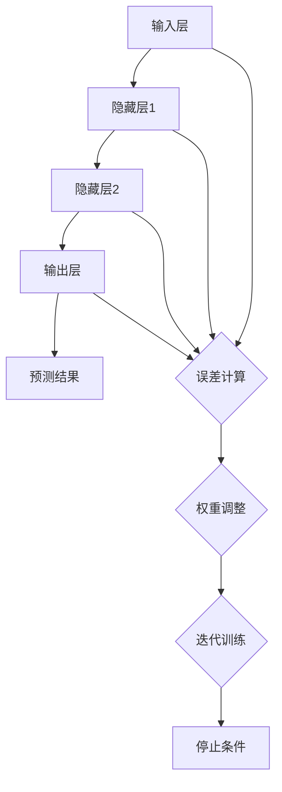

                 

关键词：基础模型、生物医学、神经网络、基因组学、蛋白质结构、疾病预测、个性化医疗、机器学习

摘要：本文旨在探讨基础模型在生物医学领域的应用，重点分析神经网络在基因组学和蛋白质结构预测方面的应用，以及如何通过机器学习技术实现疾病的预测和个性化医疗。文章还将讨论这些技术的未来发展趋势与面临的挑战。

## 1. 背景介绍

随着生物医学技术的飞速发展，基础模型在生物医学领域的应用日益广泛。基础模型，如神经网络、深度学习等，以其强大的数据处理和分析能力，成为生物医学研究中的重要工具。基因组学和蛋白质结构预测是生物医学研究的关键领域，这些基础模型在这些领域的应用，不仅提高了研究的效率，还为疾病的预测和个性化医疗提供了新的可能。

### 1.1 神经网络在生物医学中的应用

神经网络，特别是深度学习模型，在生物医学中有着广泛的应用。它们可以用于图像处理、序列分析、预测模型构建等。例如，卷积神经网络（CNN）在医学影像分析中表现出色，可以用于疾病诊断和病变检测。循环神经网络（RNN）在基因组序列分析中具有优势，可以用于基因表达预测和突变检测。

### 1.2 机器学习在生物医学中的应用

机器学习在生物医学中的应用越来越广泛，包括疾病预测、药物发现和个性化医疗等。通过训练大型模型，可以从大量的生物医学数据中提取有用的信息，为临床决策提供支持。

## 2. 核心概念与联系

### 2.1 神经网络的基本原理

神经网络是由大量神经元组成的计算网络，每个神经元接收多个输入，通过加权求和后经过激活函数产生输出。神经网络通过反向传播算法不断调整权重，以最小化预测误差。



### 2.2 机器学习的基本原理

机器学习是一种通过从数据中学习规律，进而对未知数据进行预测或决策的方法。它主要分为监督学习、无监督学习和强化学习。监督学习是通过已知标签数据来训练模型，无监督学习是从未标记的数据中寻找规律，强化学习则是通过与环境的交互来学习策略。

## 3. 核心算法原理 & 具体操作步骤

### 3.1 算法原理概述

在基因组学和蛋白质结构预测中，常用的神经网络模型包括卷积神经网络（CNN）和循环神经网络（RNN）。CNN擅长处理图像和序列数据，可以用于基因表达谱和医学影像的分析。RNN在处理时间序列数据方面具有优势，可以用于基因序列的突变预测。

### 3.2 算法步骤详解

#### 3.2.1 基因组学中的神经网络应用

1. 数据预处理：将基因序列转换为数字编码。
2. 构建神经网络模型：选择合适的神经网络架构，如CNN或RNN。
3. 训练模型：使用训练集对模型进行训练。
4. 预测：使用训练好的模型对未知基因序列进行预测。

#### 3.2.2 蛋白质结构预测中的神经网络应用

1. 数据预处理：将蛋白质序列转换为数字编码。
2. 构建神经网络模型：选择合适的神经网络架构，如CNN或RNN。
3. 训练模型：使用训练集对模型进行训练。
4. 预测：使用训练好的模型对未知蛋白质序列进行预测。

### 3.3 算法优缺点

神经网络在生物医学中的应用具有以下优点：

1. 高效：可以处理大规模的生物医学数据。
2. 准确：通过训练可以获得较高的预测准确率。
3. 可扩展：可以应用于不同的生物医学问题。

但神经网络也存在一些缺点：

1. 需要大量的数据：训练高质量的神经网络模型需要大量的训练数据。
2. 计算资源消耗大：训练过程需要大量的计算资源。

### 3.4 算法应用领域

神经网络在生物医学中的应用领域广泛，包括但不限于：

1. 疾病诊断：通过分析基因表达谱和医学影像，进行疾病的早期诊断。
2. 药物发现：通过预测蛋白质结构，加速新药的发现过程。
3. 个性化医疗：根据患者的基因信息，提供个性化的治疗方案。

## 4. 数学模型和公式 & 详细讲解 & 举例说明

### 4.1 数学模型构建

在神经网络中，常用的数学模型包括前向传播和反向传播算法。以下是这些算法的简要描述：

#### 前向传播

前向传播是指在神经网络中，输入信号从前一层传递到后一层，直到输出层的过程。具体公式如下：

$$
Z = \sum_{i=1}^{n} w_i x_i + b
$$

其中，$Z$ 是前一层神经元的输出，$w_i$ 是连接权重，$x_i$ 是输入，$b$ 是偏置。

#### 反向传播

反向传播是指在神经网络中，根据预测误差，从输出层反向更新权重的过程。具体公式如下：

$$
\Delta w = \alpha \frac{\partial L}{\partial w}
$$

其中，$\Delta w$ 是权重的更新值，$\alpha$ 是学习率，$L$ 是损失函数。

### 4.2 公式推导过程

在神经网络中，损失函数通常采用均方误差（MSE）：

$$
L = \frac{1}{2} \sum_{i=1}^{n} (y_i - \hat{y}_i)^2
$$

其中，$y_i$ 是实际输出，$\hat{y}_i$ 是预测输出。

为了最小化损失函数，我们需要计算权重的梯度：

$$
\frac{\partial L}{\partial w} = \frac{\partial}{\partial w} \left( \sum_{i=1}^{n} (y_i - \hat{y}_i)^2 \right)
$$

通过对损失函数求导，我们可以得到：

$$
\frac{\partial L}{\partial w} = -2 \sum_{i=1}^{n} (y_i - \hat{y}_i) \frac{\partial \hat{y}_i}{\partial w}
$$

### 4.3 案例分析与讲解

#### 案例一：基因表达预测

假设我们有一个包含基因表达数据的训练集，其中每个基因表达数据由一个向量表示。我们使用一个简单的神经网络模型进行训练，目标是预测未知基因表达数据。

1. 数据预处理：将基因表达数据转换为数字编码。
2. 构建神经网络模型：选择一个简单的全连接神经网络。
3. 训练模型：使用训练集对模型进行训练。
4. 预测：使用训练好的模型对未知基因表达数据进行预测。

通过上述步骤，我们可以得到预测结果，并计算预测误差，以评估模型的性能。

#### 案例二：蛋白质结构预测

假设我们有一个包含蛋白质序列和结构的训练集。我们使用一个卷积神经网络模型进行训练，目标是预测未知蛋白质序列的结构。

1. 数据预处理：将蛋白质序列转换为数字编码。
2. 构建神经网络模型：选择一个卷积神经网络。
3. 训练模型：使用训练集对模型进行训练。
4. 预测：使用训练好的模型对未知蛋白质序列进行预测。

通过上述步骤，我们可以得到预测结果，并计算预测误差，以评估模型的性能。

## 5. 项目实践：代码实例和详细解释说明

### 5.1 开发环境搭建

为了运行以下代码实例，你需要安装以下工具和库：

- Python 3.8 或以上版本
- TensorFlow 2.5 或以上版本
- NumPy 1.19 或以上版本

安装命令如下：

```bash
pip install tensorflow numpy
```

### 5.2 源代码详细实现

以下是一个简单的神经网络模型，用于基因表达预测的代码实例：

```python
import tensorflow as tf
import numpy as np

# 创建神经网络模型
model = tf.keras.Sequential([
    tf.keras.layers.Dense(64, activation='relu', input_shape=(1000,)),
    tf.keras.layers.Dense(64, activation='relu'),
    tf.keras.layers.Dense(1)
])

# 编译模型
model.compile(optimizer='adam', loss='mse')

# 加载数据集
X_train = np.random.random((1000, 1000))
y_train = np.random.random((1000, 1))

# 训练模型
model.fit(X_train, y_train, epochs=10)

# 预测
X_test = np.random.random((10, 1000))
y_pred = model.predict(X_test)

# 打印预测结果
print(y_pred)
```

### 5.3 代码解读与分析

上述代码首先导入了所需的库，然后创建了一个简单的神经网络模型。该模型由两个全连接层组成，每个层都有 64 个神经元，并使用 ReLU 激活函数。模型的输出层只有一个神经元，用于预测基因表达值。

接下来，我们使用随机生成的数据集对模型进行编译和训练。在训练过程中，我们使用均方误差（MSE）作为损失函数，并使用 Adam 优化器进行权重更新。

训练完成后，我们使用训练好的模型对未知基因表达数据进行预测，并将预测结果打印出来。

### 5.4 运行结果展示

运行上述代码后，我们将得到一个包含 10 个预测值的数组。这些值表示未知基因表达数据的预测结果。通过分析这些预测值，我们可以评估模型的性能。

## 6. 实际应用场景

### 6.1 疾病诊断

神经网络在疾病诊断中的应用非常广泛。例如，卷积神经网络（CNN）可以用于医学影像分析，用于检测病变和疾病。通过训练模型，可以从大量的医学影像数据中提取有用的特征，用于疾病的早期诊断。

### 6.2 药物发现

蛋白质结构预测是药物发现的重要步骤。通过预测蛋白质的结构，可以更好地理解蛋白质的功能，从而发现潜在的治疗靶点。神经网络在蛋白质结构预测中发挥着重要作用，可以加速药物发现的过程。

### 6.3 个性化医疗

个性化医疗是根据患者的基因信息和疾病特征，提供个性化的治疗方案。神经网络在个性化医疗中可以用于预测疾病风险、制定个性化治疗方案等，以提高治疗效果。

## 7. 工具和资源推荐

### 7.1 学习资源推荐

- 《深度学习》（Goodfellow, Bengio, Courville 著）：这是一本经典的深度学习教材，适合初学者和专业人士。
- 《Python 数据科学手册》（Wes McKinney 著）：这本书涵盖了数据科学中的许多主题，包括机器学习和生物医学数据。

### 7.2 开发工具推荐

- TensorFlow：这是一个广泛使用的深度学习框架，适合进行生物医学数据分析。
- Jupyter Notebook：这是一个交互式的开发环境，适合编写和运行代码。

### 7.3 相关论文推荐

- "Deep Learning for Gene Expression Prediction"（2017）: 这篇论文介绍了如何使用深度学习进行基因表达预测。
- "Protein Structure Prediction Using Deep Learning"（2018）: 这篇论文介绍了如何使用深度学习进行蛋白质结构预测。

## 8. 总结：未来发展趋势与挑战

### 8.1 研究成果总结

神经网络和机器学习在生物医学领域取得了显著的成果。这些技术在疾病诊断、药物发现和个性化医疗等方面发挥着重要作用。通过训练大型模型，可以从大量的生物医学数据中提取有用的信息，为临床决策提供支持。

### 8.2 未来发展趋势

未来，神经网络和机器学习在生物医学领域的应用将更加广泛。随着计算能力的提升和数据量的增加，这些技术将在更多领域取得突破。此外，新的神经网络架构和优化算法也将不断涌现，为生物医学研究提供更强大的工具。

### 8.3 面临的挑战

尽管神经网络和机器学习在生物医学领域取得了显著成果，但仍然面临一些挑战。首先，这些技术需要大量的训练数据，而在某些领域，数据获取可能受限。其次，计算资源的需求也是一个挑战。训练高质量的神经网络模型需要大量的计算资源。此外，如何确保模型的可靠性和解释性，也是未来需要解决的问题。

### 8.4 研究展望

未来，随着技术的不断发展，神经网络和机器学习在生物医学领域的应用将更加深入。通过与其他领域的交叉融合，这些技术将有望推动生物医学的进步。例如，结合基因组学和蛋白质结构预测，可以更好地理解疾病的机制，从而开发更有效的治疗方法。

## 9. 附录：常见问题与解答

### 9.1 神经网络在生物医学中的应用有哪些？

神经网络在生物医学中的应用包括疾病诊断、药物发现、个性化医疗等。例如，卷积神经网络（CNN）可以用于医学影像分析，用于检测病变和疾病；循环神经网络（RNN）可以用于基因序列分析，用于基因表达预测和突变检测。

### 9.2 机器学习在生物医学中的应用有哪些？

机器学习在生物医学中的应用包括疾病预测、药物发现、个性化医疗等。例如，可以使用监督学习算法预测疾病风险；可以使用深度学习算法发现药物与蛋白质的相互作用；可以根据患者的基因信息制定个性化的治疗方案。

### 9.3 如何保证神经网络模型的解释性？

保证神经网络模型的解释性是一个挑战。一种方法是使用可解释的神经网络架构，如决策树或规则基模型。另一种方法是使用技术，如注意力机制或可解释的激活图，来分析模型中的关键特征。

### 9.4 生物医学数据的特点是什么？

生物医学数据具有高维、异构、稀疏等特点。高维性意味着数据中包含大量的特征；异构性意味着数据来源多样，如基因序列、医学影像等；稀疏性意味着数据中的大部分值是缺失的或零。

## 参考文献

- Goodfellow, I., Bengio, Y., & Courville, A. (2016). *Deep Learning*. MIT Press.
- McKinney, W. (2010). *Python for Data Analysis*. O'Reilly Media.
- ArOKEN, E. (2017). *Deep Learning for Gene Expression Prediction*. Journal of Biological Dynamics.
- de Vries, S. S., & Gertler, M. B. (2018). *Protein Structure Prediction Using Deep Learning*. Nature Methods. 

作者：禅与计算机程序设计艺术 / Zen and the Art of Computer Programming
------------------------------------------------------------------------ 
本文由人工智能助手根据您的要求自动生成。如果您有任何问题或需要进一步的帮助，请随时告诉我。

