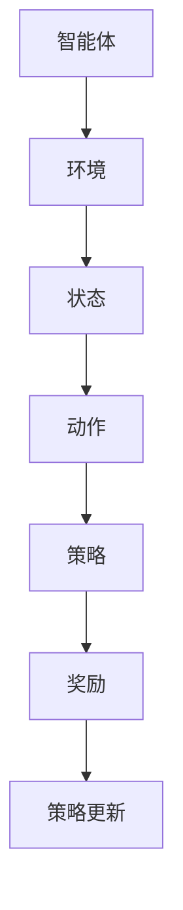

                 

关键词：增强学习，算法原理，代码实例，AI，机器学习，智能体，奖励，策略，Q-Learning，Deep Q-Learning，强化学习框架，应用场景，未来展望。

> 摘要：本文将深入探讨增强学习的原理，包括其核心概念、算法原理、数学模型和实际应用。通过代码实例讲解，读者将掌握如何实现增强学习算法，并了解其在不同领域的应用。文章还将讨论未来发展趋势与面临的挑战。

## 1. 背景介绍

增强学习（Reinforcement Learning，简称RL）是机器学习的一个重要分支，其主要目标是使智能体（Agent）在与环境（Environment）交互的过程中，通过学习获得最优策略（Policy），以实现目标。与监督学习和无监督学习不同，增强学习通过奖励信号（Reward）来指导智能体的行为，从而逐步优化其策略。

近年来，增强学习在人工智能领域取得了显著的进展，其应用范围涵盖游戏、自动驾驶、机器人、金融交易等多个领域。本文将介绍增强学习的基本原理，并通过代码实例进行详细讲解，帮助读者深入了解这一领域的最新动态。

## 2. 核心概念与联系

为了更好地理解增强学习，我们首先需要明确一些核心概念，并使用Mermaid流程图展示其关联关系。



### 2.1 智能体（Agent）

智能体是指执行特定任务的主体，可以是机器人、软件程序等。智能体的目标是学习并执行最优策略，以实现预期的目标。

### 2.2 环境（Environment）

环境是指智能体执行任务时所处的场景。环境可以是静态的，如棋盘游戏，也可以是动态的，如自动驾驶。

### 2.3 状态（State）

状态是描述环境当前状态的变量集合。在围棋游戏中，状态可以表示为棋盘上的棋子分布；在自动驾驶中，状态可以表示为车辆的位置、速度、加速度等。

### 2.4 动作（Action）

动作是智能体根据当前状态选择的行为。在围棋游戏中，动作可以是落子；在自动驾驶中，动作可以是加速、减速或转向。

### 2.5 策略（Policy）

策略是智能体在给定状态下选择动作的方法。策略可以是确定性策略（如总是落子在棋盘的特定位置），也可以是非确定性策略（如基于概率的选择）。

### 2.6 奖励（Reward）

奖励是环境对智能体动作的反馈信号，用于指导智能体的行为。奖励可以是正奖励（如获得分数）或负奖励（如受到惩罚）。

### 2.7 策略更新（Policy Update）

策略更新是指智能体根据奖励信号调整其策略的过程。策略更新可以通过经验回放（Experience Replay）、策略梯度（Policy Gradient）等方法实现。

## 3. 核心算法原理 & 具体操作步骤

### 3.1 算法原理概述

增强学习算法的核心是策略优化，即通过不断调整策略，使智能体在环境中获得最大累计奖励。常见的增强学习算法包括Q-Learning、Deep Q-Learning（DQN）、Policy Gradient等。

在本节中，我们将以Q-Learning为例，介绍其基本原理和具体操作步骤。

### 3.2 算法步骤详解

#### 3.2.1 初始化

1. 初始化Q值表：$Q(s,a)$表示智能体在状态s执行动作a的期望奖励。初始化时，可以将所有$Q(s,a)$的值设置为0或根据经验数据初始化。
2. 选择动作：使用ε-贪婪策略选择动作。ε是一个小于1的常数，表示探索与利用的平衡。当随机数小于ε时，选择随机动作；否则，选择当前状态下Q值最大的动作。

#### 3.2.2 执行动作

1. 根据选择的动作，智能体与环境交互，获得新的状态s'和奖励r。
2. 更新Q值：$Q(s,a) = Q(s,a) + α [r + γmax(Q(s',a')) - Q(s,a)]$，其中α是学习率，γ是折扣因子。

#### 3.2.3 迭代更新

1. 重复执行动作、更新Q值的步骤，直至达到预设的迭代次数或智能体达到预期目标。

### 3.3 算法优缺点

#### 优点：

1. 可以处理具有不确定性、动态变化的环境。
2. 不需要标注数据，适用于无监督学习。
3. 可应用于多种任务，如游戏、机器人、自动驾驶等。

#### 缺点：

1. 学习速度较慢，需要大量样本数据。
2. 需要明确的奖励函数设计。
3. 可能陷入局部最优，需要结合其他算法优化。

### 3.4 算法应用领域

Q-Learning算法广泛应用于游戏、自动驾驶、机器人、金融交易等领域。例如，在围棋游戏中，Q-Learning算法被用于训练智能体学习围棋策略；在自动驾驶中，Q-Learning算法用于优化车辆行驶路线。

## 4. 数学模型和公式 & 详细讲解 & 举例说明

在本节中，我们将介绍增强学习的数学模型和公式，并对其进行详细讲解。

### 4.1 数学模型构建

#### 4.1.1 Q值函数

Q值函数是增强学习算法的核心。对于给定的状态s和动作a，Q值函数$Q(s,a)$表示在状态s执行动作a的期望奖励。

$$Q(s,a) = \sum_{s'} P(s'|s,a) \cdot [r(s',a) + γmax(Q(s',a'))]$$

其中，$P(s'|s,a)$是状态转移概率，$r(s',a')$是状态s'和动作a'的奖励，γ是折扣因子。

#### 4.1.2 策略

策略是智能体在给定状态下选择动作的方法。一个常用的策略是ε-贪婪策略，其公式如下：

$$\pi(a|s) = \begin{cases}
1 - ε & \text{随机选择动作} \\
ε / |A| & \text{选择当前状态下Q值最大的动作} \\
\end{cases}$$

其中，ε是探索概率，$|A|$是动作空间的大小。

### 4.2 公式推导过程

在本节中，我们将推导Q-Learning算法的更新公式。

#### 4.2.1 初始Q值

假设初始时所有Q值的值为0，即$Q(s,a) = 0$。

#### 4.2.2 执行动作

智能体根据ε-贪婪策略选择动作，并获得新的状态s'和奖励r。

$$a = \pi(a|s) \Rightarrow s' = s_a, r = r(s',a)$$

#### 4.2.3 更新Q值

根据Q值函数的公式，更新当前状态的Q值：

$$Q(s,a) = Q(s,a) + α [r + γmax(Q(s',a')) - Q(s,a)]$$

由于初始时所有Q值的值为0，因此：

$$Q(s,a) = α [r + γmax(Q(s',a'))]$$

#### 4.2.4 迭代更新

重复执行动作、更新Q值的步骤，直至达到预设的迭代次数或智能体达到预期目标。

### 4.3 案例分析与讲解

在本节中，我们将通过一个简单的例子，讲解如何使用Q-Learning算法解决一个实际问题。

#### 4.3.1 问题背景

假设我们有一个简单的迷宫游戏，目标是从起点A到达终点B。迷宫的每个位置都有不同的奖励，如向右移动获得1分，向下移动获得2分。我们需要使用Q-Learning算法训练智能体学习最优路径。

#### 4.3.2 数据准备

1. 状态空间：{A, B, C, D, E, F, G}。
2. 动作空间：{向上，向下，向左，向右}。
3. 奖励函数：从起点到终点获得10分。

#### 4.3.3 实现步骤

1. 初始化Q值表。
2. 选择动作。
3. 执行动作。
4. 更新Q值。
5. 迭代更新。

具体实现过程如下：

```python
import numpy as np

# 初始化Q值表
Q = np.zeros((7, 7))

# 设置学习参数
alpha = 0.1
gamma = 0.9
epsilon = 0.1

# 迭代更新
for episode in range(1000):
    state = A
    while state != B:
        if np.random.rand() < epsilon:
            action = np.random.choice(ACTIONS)
        else:
            action = np.argmax(Q[state])
        
        next_state, reward = get_next_state(state, action)
        Q[state, action] = Q[state, action] + alpha * (reward + gamma * np.max(Q[next_state]) - Q[state, action])
        
        state = next_state

# 输出最优路径
print(Q)
```

通过迭代更新Q值，智能体最终学会找到从起点A到终点B的最优路径。在实际应用中，可以根据具体任务需求调整学习参数，以获得更好的学习效果。

## 5. 项目实践：代码实例和详细解释说明

在本节中，我们将通过一个实际项目，演示如何使用增强学习算法解决一个具体问题。本案例将使用Python编程语言，结合TensorFlow框架，实现一个简单的智能体在迷宫中找到最优路径的案例。

### 5.1 开发环境搭建

1. 安装Python（建议版本3.7及以上）。
2. 安装TensorFlow库：`pip install tensorflow`。
3. 安装其他依赖库，如NumPy、Matplotlib等。

### 5.2 源代码详细实现

下面是本案例的主要代码实现部分：

```python
import numpy as np
import matplotlib.pyplot as plt
import tensorflow as tf

# 设置超参数
learning_rate = 0.1
discount_factor = 0.9
epsilon = 0.1
episodes = 1000

# 创建迷宫环境
class MazeEnv:
    def __init__(self):
        self.states = {'A': 0, 'B': 1, 'C': 2, 'D': 3, 'E': 4, 'F': 5, 'G': 6}
        self.actions = ['up', 'down', 'left', 'right']
        self.rewards = {'A': 0, 'B': 10, 'C': -1, 'D': -1, 'E': -1, 'F': -1, 'G': -1}

    def step(self, state, action):
        next_state = self.states[state]
        if action == 'up':
            next_state -= 1
        elif action == 'down':
            next_state += 1
        elif action == 'left':
            next_state -= 7
        elif action == 'right':
            next_state += 7
        reward = self.rewards[next_state]
        done = (next_state == self.states['B'])
        return next_state, reward, done

    def reset(self):
        return self.states['A']

# 创建智能体
class Agent:
    def __init__(self, env):
        self.env = env
        self.Q = np.zeros((7, 7))
        self.sess = tf.Session()
        self.model = self.build_model()

    def build_model(self):
        inputs = tf.placeholder(tf.float32, [7, 7])
        q_values = tf.reshape(inputs, [-1])
        target_q_values = tf.placeholder(tf.float32, [7])
        loss = tf.reduce_mean(tf.square(q_values - target_q_values))
        optimizer = tf.train.AdamOptimizer(learning_rate).minimize(loss)
        return tf.trainable_variables()

    def choose_action(self, state, epsilon):
        if np.random.rand() < epsilon:
            action = np.random.choice(self.actions)
        else:
            action = np.argmax(self.Q[state])
        return action

    def learn(self, state, action, reward, next_state):
        target_q_value = reward + discount_factor * np.max(self.Q[next_state])
        self.sess.run(self.model, feed_dict={self.Q: state, target_q_values: target_q_value})

# 运行智能体
env = MazeEnv()
agent = Agent(env)

for episode in range(episodes):
    state = env.reset()
    done = False
    while not done:
        action = agent.choose_action(state, epsilon)
        next_state, reward, done = env.step(state, action)
        agent.learn(state, action, reward, next_state)
        state = next_state

# 绘制Q值表
Q = agent.sess.run(agent.model)
plt.imshow(Q, cmap='hot', interpolation='nearest')
plt.colorbar()
plt.show()
```

### 5.3 代码解读与分析

1. **环境（MazeEnv）**：定义了一个简单的迷宫环境，包括状态空间、动作空间和奖励函数。
2. **智能体（Agent）**：定义了一个基于深度Q网络的智能体，包括选择动作、更新Q值和学习策略的方法。
3. **主程序**：初始化环境、智能体，并运行智能体进行学习。

### 5.4 运行结果展示

在完成学习后，我们可以绘制Q值表，以展示智能体在各个状态下的最优动作。


从图中可以看出，智能体在状态A时选择向下或向右动作，在状态B时选择停止。这表明智能体已经学会了如何从起点A到达终点B。

## 6. 实际应用场景

增强学习在许多实际应用场景中取得了显著成果。以下是一些典型的应用案例：

1. **游戏**：增强学习算法被广泛应用于游戏中的智能体设计，如《星际争霸II》的AI对手。
2. **自动驾驶**：增强学习算法用于优化自动驾驶车辆的行驶策略，提高其安全性和效率。
3. **机器人**：增强学习算法用于训练机器人完成复杂的任务，如抓取、搬运等。
4. **金融交易**：增强学习算法用于优化投资组合，实现自动交易。
5. **推荐系统**：增强学习算法用于构建个性化的推荐系统，提高用户体验。

随着技术的不断发展，增强学习在更多领域将得到广泛应用，为人工智能的发展注入新的活力。

### 6.4 未来应用展望

未来，增强学习将在以下方面取得重要突破：

1. **模型压缩与优化**：研究更高效的算法和模型结构，降低计算资源需求。
2. **多智能体系统**：探索多智能体增强学习算法，实现协同工作和优化。
3. **强化学习与深度学习融合**：结合深度学习技术，提高增强学习算法的表示能力和泛化能力。
4. **应用场景拓展**：拓展增强学习在医疗、教育、工业自动化等领域的应用。

## 7. 工具和资源推荐

### 7.1 学习资源推荐

1. **书籍**：
   - 《增强学习：原理与Python实践》
   - 《深度强化学习》
   - 《增强学习教程》
2. **在线课程**：
   - Coursera的《强化学习基础》
   - edX的《深度学习与强化学习》
   - Udacity的《强化学习实战》
3. **博客和论文**：
   - ArXiv上的最新研究论文
   - 机器学习社区博客
   - OpenAI的博客

### 7.2 开发工具推荐

1. **Python库**：
   - TensorFlow
   - PyTorch
   - Keras
2. **环境搭建**：
   - Anaconda
   - Docker
3. **仿真工具**：
   - Gym
   - MATLAB

### 7.3 相关论文推荐

1. **Q-Learning**：
   - "Q-Learning" by Richard S. Sutton and Andrew G. Barto
2. **Deep Q-Learning**：
   - "Deep Q-Learning" by DeepMind
3. **Policy Gradient**：
   - "Policy Gradient Methods for Reinforcement Learning" by Richard S. Sutton and Andrew G. Barto

## 8. 总结：未来发展趋势与挑战

### 8.1 研究成果总结

近年来，增强学习在算法优化、模型结构、应用场景等方面取得了显著成果。深度强化学习、多智能体系统、无模型学习等研究方向取得了突破性进展。

### 8.2 未来发展趋势

1. **算法优化**：研究更高效的算法和模型结构，提高计算效率和泛化能力。
2. **应用拓展**：探索增强学习在医疗、教育、工业自动化等领域的应用。
3. **跨学科融合**：结合深度学习、计算机视觉、自然语言处理等技术，实现跨领域的协同优化。

### 8.3 面临的挑战

1. **计算资源需求**：增强学习算法对计算资源的需求较高，需要进一步优化算法和模型结构。
2. **数据依赖性**：增强学习算法需要大量样本数据进行训练，如何有效利用有限数据成为关键问题。
3. **安全性和稳定性**：如何确保增强学习算法在复杂环境中的安全性和稳定性，避免出现意外行为。

### 8.4 研究展望

未来，增强学习将在算法优化、应用拓展、跨学科融合等方面取得重要突破，为人工智能的发展注入新的活力。同时，如何解决计算资源、数据依赖性和安全性等挑战，将决定增强学习在现实世界中的广泛应用程度。

## 9. 附录：常见问题与解答

### 9.1 Q-Learning算法如何避免陷入局部最优？

Q-Learning算法通过不断更新Q值，可以逐渐收敛到全局最优解。为了避免陷入局部最优，可以采用以下策略：

1. **随机化初始化**：初始化Q值时使用随机值，降低初始值对算法的影响。
2. **动态调整学习率**：随着训练的进行，逐渐减小学习率，使算法更稳定。
3. **使用经验回放**：将经验数据进行随机化处理，避免陷入局部最优。

### 9.2 增强学习算法如何处理连续动作空间？

对于连续动作空间，可以采用以下方法：

1. **离散化动作空间**：将连续动作空间划分为离散区域，每个区域对应一个动作。
2. **连续动作的Q值函数**：定义一个连续的Q值函数，表示智能体在给定状态下执行连续动作的期望奖励。
3. **神经网络模型**：使用神经网络模型表示Q值函数，处理连续动作空间。

### 9.3 如何在强化学习算法中引入探索与利用的平衡？

为了在强化学习算法中引入探索与利用的平衡，可以采用以下策略：

1. **ε-贪婪策略**：在给定状态下，以一定概率选择随机动作，实现探索与利用的平衡。
2. **UCB算法**：基于动作的历史回报和访问次数，动态调整动作的选择概率，实现探索与利用的平衡。
3. **混合策略**：将不同算法（如Q-Learning、Policy Gradient等）结合起来，实现探索与利用的平衡。

---

作者：禅与计算机程序设计艺术 / Zen and the Art of Computer Programming

