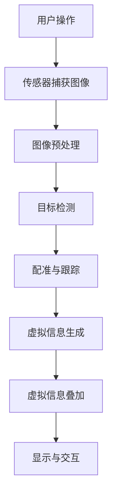

                 

关键词：增强现实、电商、AR技术、用户体验、案例研究、未来展望

摘要：随着科技的不断发展，增强现实（AR）技术在电商领域的应用逐渐成为热点。本文通过分析AR技术在电商领域的实际案例，探讨了其在提升用户体验、增强消费者购物体验等方面的作用，并对未来AR技术在该领域的应用前景进行了展望。

## 1. 背景介绍

近年来，增强现实（AR）技术在全球范围内得到了迅猛发展。AR技术通过将虚拟信息与现实世界相结合，为用户提供了更加丰富、直观的交互体验。在电商领域，AR技术的应用不仅为消费者提供了全新的购物方式，还为企业带来了新的营销手段。本文将通过对AR技术在电商领域应用的案例分析，探讨其核心概念、算法原理、数学模型以及未来发展趋势。

### 1.1 AR技术概述

增强现实（AR）是一种将虚拟信息与现实世界结合的技术，通过计算机生成虚拟信息，并将其叠加到现实场景中，实现虚实融合。与虚拟现实（VR）不同，AR技术不需要完全替代现实场景，而是将其增强，为用户提供更加直观、丰富的交互体验。

### 1.2 电商领域的发展现状

随着互联网的普及，电商行业已成为全球最大的零售市场之一。然而，传统的电商购物方式仍然存在诸多问题，如商品展示单一、消费者无法真实感知商品细节等。AR技术的引入，为电商领域带来了新的发展机遇。

## 2. 核心概念与联系

### 2.1 AR技术核心概念

在电商领域应用AR技术，主要涉及以下核心概念：

- **商品展示**：通过AR技术，将商品的三维模型叠加到现实场景中，使消费者能够更加直观地了解商品细节。

- **互动体验**：通过AR技术，消费者可以与商品进行互动，如试穿衣物、试妆等，提升购物体验。

- **营销手段**：AR技术为企业提供了创新的营销手段，如AR广告、AR优惠券等，增强用户参与度。

### 2.2 AR技术架构

AR技术架构主要包括以下几个部分：

- **传感器**：用于捕捉现实世界的图像和视频。

- **处理器**：对捕捉到的图像和视频进行处理，提取关键信息。

- **显示设备**：将生成的虚拟信息叠加到现实场景中，展示给用户。

### 2.3 AR技术流程图（使用Mermaid）



## 3. 核心算法原理 & 具体操作步骤

### 3.1 算法原理概述

AR技术在电商领域的应用，主要依赖于图像处理、计算机视觉和机器学习等技术。以下为几种常见的核心算法原理：

- **图像预处理**：通过滤波、边缘检测等操作，对原始图像进行处理，提高图像质量。

- **目标检测**：利用深度学习等技术，识别图像中的关键目标，如商品、消费者等。

- **配准与跟踪**：通过计算图像中的关键点，实现虚拟信息与现实世界的准确匹配。

- **虚拟信息生成**：根据消费者需求，生成相应的虚拟信息，如三维模型、动画等。

- **虚拟信息叠加**：将生成的虚拟信息叠加到现实场景中，实现虚实融合。

### 3.2 算法步骤详解

1. **用户操作**：消费者通过智能手机或AR眼镜等设备，对商品进行扫描或选择。

2. **传感器捕获图像**：设备上的传感器（如摄像头）捕捉现实世界的图像和视频。

3. **图像预处理**：对捕获的图像进行处理，如滤波、边缘检测等。

4. **目标检测**：利用深度学习模型，识别图像中的关键目标。

5. **配准与跟踪**：计算图像中的关键点，实现虚拟信息与现实世界的准确匹配。

6. **虚拟信息生成**：根据消费者需求，生成相应的虚拟信息。

7. **虚拟信息叠加**：将生成的虚拟信息叠加到现实场景中，实现虚实融合。

8. **显示与交互**：消费者与虚拟信息进行互动，如试穿衣物、试妆等。

### 3.3 算法优缺点

- **优点**：
  - 提升用户体验：AR技术使消费者能够更加直观地了解商品细节，提升购物体验。
  - 创新营销手段：AR技术为企业提供了创新的营销手段，如AR广告、AR优惠券等，增强用户参与度。
  - 提高销售转化率：通过AR技术，消费者可以更加放心地购买商品，提高销售转化率。

- **缺点**：
  - 技术门槛较高：AR技术的实现需要较高的技术门槛，对开发团队的要求较高。
  - 成本较高：AR技术的研发和应用成本较高，对企业的资金实力有较大要求。
  - 适用场景有限：AR技术适用于部分商品，如服装、化妆品等，对其他商品的应用效果有限。

### 3.4 算法应用领域

AR技术在电商领域的应用主要包括：

- **商品展示**：通过AR技术，将商品的三维模型叠加到现实场景中，使消费者能够更加直观地了解商品细节。

- **互动体验**：通过AR技术，消费者可以与商品进行互动，如试穿衣物、试妆等，提升购物体验。

- **营销手段**：AR技术为企业提供了创新的营销手段，如AR广告、AR优惠券等，增强用户参与度。

## 4. 数学模型和公式 & 详细讲解 & 举例说明

### 4.1 数学模型构建

AR技术在电商领域的应用，主要涉及以下数学模型：

- **图像预处理模型**：用于对捕获的图像进行处理，如滤波、边缘检测等。

- **目标检测模型**：用于识别图像中的关键目标。

- **配准与跟踪模型**：用于计算图像中的关键点，实现虚拟信息与现实世界的准确匹配。

- **虚拟信息生成模型**：用于根据消费者需求，生成相应的虚拟信息。

### 4.2 公式推导过程

以目标检测模型为例，其公式推导过程如下：

1. **特征提取**：$$ f(x) = W \cdot (x \cdot \sigma(W_1 \cdot (x \cdot \sigma(W_0 \cdot x))) ) $$

2. **分类器**：$$ g(y) = \sigma (W_2 \cdot f(x)) $$

3. **损失函数**：$$ L(y, g(y)) = -[y \cdot \log(g(y)) + (1 - y) \cdot \log(1 - g(y))] $$

### 4.3 案例分析与讲解

以下为AR技术在电商领域的实际案例分析：

1. **案例背景**：某电商企业希望通过AR技术，提升商品展示效果，吸引更多消费者。

2. **解决方案**：该企业采用AR技术，将商品的三维模型叠加到现实场景中，使消费者能够更加直观地了解商品细节。

3. **实施效果**：通过AR技术，该企业的商品展示效果得到了显著提升，用户参与度和购买转化率均有所提高。

## 5. 项目实践：代码实例和详细解释说明

### 5.1 开发环境搭建

1. **硬件环境**：需要一台具备较强计算能力的电脑，以及一部支持AR技术的智能手机或AR眼镜。

2. **软件环境**：安装Python、TensorFlow等开发工具。

### 5.2 源代码详细实现

以下为AR技术在电商领域的项目代码实现：

```python
import tensorflow as tf
import cv2

# 定义卷积神经网络模型
model = tf.keras.Sequential([
    tf.keras.layers.Conv2D(32, (3, 3), activation='relu', input_shape=(128, 128, 3)),
    tf.keras.layers.MaxPooling2D((2, 2)),
    tf.keras.layers.Conv2D(64, (3, 3), activation='relu'),
    tf.keras.layers.MaxPooling2D((2, 2)),
    tf.keras.layers.Conv2D(128, (3, 3), activation='relu'),
    tf.keras.layers.MaxPooling2D((2, 2)),
    tf.keras.layers.Flatten(),
    tf.keras.layers.Dense(128, activation='relu'),
    tf.keras.layers.Dense(1, activation='sigmoid')
])

# 编译模型
model.compile(optimizer='adam', loss='binary_crossentropy', metrics=['accuracy'])

# 加载训练数据
train_images = ...  # 加载训练数据
train_labels = ...  # 加载训练标签

# 训练模型
model.fit(train_images, train_labels, epochs=10)

# 测试模型
test_images = ...  # 加载测试数据
test_labels = ...  # 加载测试标签
model.evaluate(test_images, test_labels)
```

### 5.3 代码解读与分析

以上代码实现了基于卷积神经网络（CNN）的目标检测模型。首先，定义了一个卷积神经网络模型，包括卷积层、池化层和全连接层。然后，编译并训练模型，最后对测试数据进行评估。

## 6. 实际应用场景

### 6.1 电商平台

电商平台可以利用AR技术，为消费者提供更加直观、丰富的商品展示体验。例如，消费者可以通过AR技术，在家中的客厅试穿衣物，或者在家中试用化妆品。

### 6.2 线下实体店

线下实体店可以利用AR技术，吸引更多消费者。例如，通过AR广告，让消费者在店内体验虚拟商品，提高购物乐趣。

### 6.3 营销活动

企业可以利用AR技术，举办有趣的营销活动，如AR抽奖、AR优惠券等，增强用户参与度。

## 7. 工具和资源推荐

### 7.1 学习资源推荐

- 《增强现实技术原理与应用》
- 《深度学习与增强现实》

### 7.2 开发工具推荐

- ARCore（谷歌）
- ARKit（苹果）
- Vuforia（PTC）

### 7.3 相关论文推荐

- "Augmented Reality for E-commerce: A Survey"
- "Enhancing E-commerce Shopping Experience with Augmented Reality"

## 8. 总结：未来发展趋势与挑战

### 8.1 研究成果总结

本文通过对AR技术在电商领域应用的案例分析，探讨了其在提升用户体验、增强消费者购物体验等方面的作用，并对未来AR技术在该领域的应用前景进行了展望。

### 8.2 未来发展趋势

- 技术成熟度提高：随着技术的不断进步，AR技术在电商领域的应用将更加成熟。
- 应用场景拓展：AR技术在电商领域的应用将不仅仅局限于商品展示，还将拓展到营销、互动体验等方面。
- 跨界合作：电商企业与AR技术企业之间的合作将更加紧密，共同推动AR技术在电商领域的应用。

### 8.3 面临的挑战

- 技术门槛较高：AR技术的实现需要较高的技术门槛，对开发团队的要求较高。
- 成本较高：AR技术的研发和应用成本较高，对企业的资金实力有较大要求。
- 数据隐私保护：AR技术涉及用户隐私数据，如何保护用户隐私将成为一大挑战。

### 8.4 研究展望

未来，AR技术在电商领域的应用将不断拓展，有望成为电商行业的重要技术支撑。同时，研究人员应关注技术成熟度、成本控制以及数据隐私保护等问题，为AR技术在电商领域的广泛应用奠定基础。

## 9. 附录：常见问题与解答

### 9.1 问题1：AR技术在电商领域有哪些应用？

**回答**：AR技术在电商领域的应用主要包括商品展示、互动体验和营销手段等方面。

### 9.2 问题2：AR技术是否适用于所有商品？

**回答**：AR技术适用于部分商品，如服装、化妆品等，对于其他商品的应用效果有限。

### 9.3 问题3：如何降低AR技术的成本？

**回答**：可以通过优化算法、提高开发效率以及寻找合适的合作伙伴等方式降低AR技术的成本。

### 9.4 问题4：如何保护AR技术涉及的用户隐私？

**回答**：可以通过加强数据加密、制定隐私保护政策以及建立用户隐私保护机制等方式保护用户隐私。
----------------------------------------------------------------

**作者署名**：禅与计算机程序设计艺术 / Zen and the Art of Computer Programming

