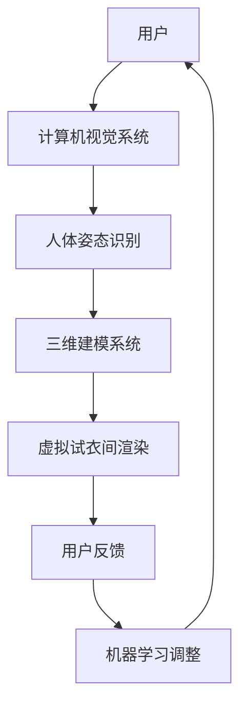

                 

关键词：增强现实（AR），人工智能（AI），虚拟试衣，计算机视觉，三维建模，机器学习，深度学习

> 摘要：本文将深入探讨如何利用增强现实（AR）技术和人工智能（AI）来实现虚拟试衣功能。通过分析其核心概念、算法原理、数学模型、项目实践以及实际应用场景，本文旨在为读者提供一个全面的视角，以了解这一技术的运作机制和未来发展方向。

## 1. 背景介绍

随着科技的飞速发展，增强现实（AR）和人工智能（AI）技术已经逐渐融入我们的日常生活。在电子商务领域，虚拟试衣技术成为了提升用户体验的重要手段。通过增强现实技术，用户可以在虚拟环境中试穿衣物，从而减少退货率和提高购买满意度。

虚拟试衣技术的核心在于将计算机视觉、三维建模和机器学习等技术相结合。计算机视觉用于捕捉用户的姿态和面部表情，三维建模则用于创建虚拟试衣间的三维场景，而机器学习算法则用于实时调整衣物模型以适应用户的身体形态。

## 2. 核心概念与联系

### 2.1. 增强现实技术

增强现实技术（Augmented Reality，简称AR）是一种将虚拟信息与现实世界融合的技术。通过在用户视野中叠加计算机生成的图像、视频和3D模型，AR能够为用户带来更加丰富和互动的体验。在虚拟试衣中，AR技术用于实时捕捉用户的身体姿态并展示虚拟衣物。

### 2.2. 计算机视觉

计算机视觉（Computer Vision）是人工智能的一个分支，旨在使计算机能够从数字图像或视频中提取信息。在虚拟试衣中，计算机视觉技术用于识别人体的关键部位和姿态，以实现对虚拟衣物的准确展示。

### 2.3. 三维建模

三维建模（3D Modeling）是一种创建三维图形或模型的过程。在虚拟试衣中，三维建模技术用于创建虚拟衣物和试衣间的三维模型，以实现逼真的试衣体验。

### 2.4. 机器学习

机器学习（Machine Learning）是一种让计算机通过数据学习模式的技术。在虚拟试衣中，机器学习算法用于根据用户的数据调整虚拟衣物的尺寸和样式，以实现个性化的试衣效果。

### 2.5. 架构流程图



## 3. 核心算法原理 & 具体操作步骤

### 3.1. 算法原理概述

虚拟试衣的核心算法主要包括计算机视觉算法、三维建模算法和机器学习算法。计算机视觉算法负责识别人体姿态，三维建模算法负责创建虚拟试衣间的三维模型，机器学习算法则负责根据用户反馈调整虚拟衣物的尺寸和样式。

### 3.2. 算法步骤详解

#### 3.2.1. 计算机视觉算法

1. **图像采集**：通过摄像头或相机捕捉用户的身体姿态。
2. **图像预处理**：对图像进行滤波、去噪等操作，以提高识别准确性。
3. **人体姿态识别**：使用深度学习模型（如卷积神经网络CNN）对图像进行分析，识别出人体的关键部位（如手臂、腿部、头部等）。
4. **姿态校正**：根据识别结果对图像进行校正，以消除因姿势不标准导致的误差。

#### 3.2.2. 三维建模算法

1. **模型初始化**：根据识别人体的关键部位，初始化三维模型。
2. **模型调整**：根据用户的身体数据，调整三维模型的大小和形状，使其更贴合用户的身体。
3. **模型渲染**：将调整后的三维模型渲染到虚拟试衣间中，以实现逼真的试衣效果。

#### 3.2.3. 机器学习算法

1. **数据收集**：收集用户的反馈数据，如衣物尺寸、样式喜好等。
2. **模型训练**：使用收集到的数据训练机器学习模型（如决策树、支持向量机SVM等），以实现根据用户反馈调整虚拟衣物的功能。
3. **模型部署**：将训练好的模型部署到虚拟试衣系统中，以实现实时调整。

### 3.3. 算法优缺点

#### 优点：

1. **实时性**：虚拟试衣系统可以实时捕捉用户的姿态和反馈，提供个性化的试衣体验。
2. **准确性**：计算机视觉算法和三维建模算法的精度较高，能够准确识别人体姿态和调整衣物模型。
3. **交互性**：用户可以通过虚拟试衣系统与虚拟衣物进行互动，增强购物体验。

#### 缺点：

1. **计算资源消耗**：虚拟试衣系统需要大量的计算资源，包括图像处理、模型渲染等。
2. **用户体验限制**：虚拟试衣系统的用户体验受限于硬件设备（如摄像头、显示器等）。
3. **数据隐私**：用户的数据隐私保护是一个重要问题，需要确保用户数据的安全和保密。

### 3.4. 算法应用领域

虚拟试衣技术不仅可以应用于电子商务领域，还可以扩展到时尚设计、医疗保健、教育等多个领域。例如，在时尚设计领域，设计师可以使用虚拟试衣技术进行虚拟展示，提高设计效率和客户满意度；在医疗保健领域，虚拟试衣技术可以帮助医生进行虚拟诊断和康复训练；在教育领域，虚拟试衣技术可以为学生提供虚拟实践场景，提高学习效果。

## 4. 数学模型和公式 & 详细讲解 & 举例说明

### 4.1. 数学模型构建

虚拟试衣技术的核心数学模型主要包括计算机视觉中的姿态估计模型、三维建模中的形状重建模型和机器学习中的预测模型。

#### 4.1.1. 姿态估计模型

姿态估计模型用于识别人体的关键部位。常用的姿态估计模型包括基于深度学习的卷积神经网络（CNN）和基于图模型的概率图模型（如隐马尔可夫模型HMM）。

#### 4.1.2. 形状重建模型

形状重建模型用于创建三维模型。常用的形状重建模型包括基于体素的体素重建和基于多边形的曲面重建。

#### 4.1.3. 预测模型

预测模型用于根据用户反馈调整虚拟衣物的尺寸和样式。常用的预测模型包括线性回归模型、决策树模型和支持向量机SVM模型。

### 4.2. 公式推导过程

#### 4.2.1. 姿态估计模型

姿态估计模型的核心是损失函数，常用的损失函数包括均方误差（MSE）和交叉熵（CE）。

- **MSE**：

  $$MSE = \frac{1}{n} \sum_{i=1}^{n} (y_i - \hat{y_i})^2$$

  其中，$y_i$为真实标签，$\hat{y_i}$为预测标签。

- **CE**：

  $$CE = -\frac{1}{n} \sum_{i=1}^{n} y_i \log(\hat{y_i}) + (1 - y_i) \log(1 - \hat{y_i})$$

  其中，$y_i$为真实标签，$\hat{y_i}$为预测标签。

#### 4.2.2. 形状重建模型

形状重建模型的核心是优化函数，常用的优化函数包括梯度下降（GD）和随机梯度下降（SGD）。

- **GD**：

  $$x_{t+1} = x_t - \alpha \nabla_{x_t} L(x_t)$$

  其中，$x_t$为当前参数，$L(x_t)$为损失函数，$\alpha$为学习率。

- **SGD**：

  $$x_{t+1} = x_t - \alpha \nabla_{x_t} L(x_t^*)$$

  其中，$x_t$为当前参数，$L(x_t)$为损失函数，$\alpha$为学习率，$x_t^*$为当前迭代过程中的随机样本。

#### 4.2.3. 预测模型

预测模型的核心是损失函数和优化函数，常用的损失函数包括均方误差（MSE）和交叉熵（CE），优化函数包括梯度下降（GD）和随机梯度下降（SGD）。

- **MSE**：

  $$MSE = \frac{1}{n} \sum_{i=1}^{n} (y_i - \hat{y_i})^2$$

  其中，$y_i$为真实标签，$\hat{y_i}$为预测标签。

- **CE**：

  $$CE = -\frac{1}{n} \sum_{i=1}^{n} y_i \log(\hat{y_i}) + (1 - y_i) \log(1 - \hat{y_i})$$

  其中，$y_i$为真实标签，$\hat{y_i}$为预测标签。

### 4.3. 案例分析与讲解

假设我们有一个虚拟试衣系统，用户需要在系统中试穿一件衬衫。根据用户反馈，我们需要对衬衫的尺寸进行调整。

#### 4.3.1. 数据收集

我们收集了100名用户的反馈数据，包括身高、体重、胸围、腰围等。

#### 4.3.2. 模型训练

我们使用决策树模型对用户反馈数据进行分析，训练模型以预测衬衫的尺寸。

- **特征工程**：将用户的身高、体重、胸围、腰围等数据进行特征提取，例如计算用户的BMI（体重指数）。

- **模型训练**：使用决策树算法训练模型，以预测衬衫的尺寸。

#### 4.3.3. 模型部署

将训练好的模型部署到虚拟试衣系统中，以实现根据用户反馈调整衬衫尺寸的功能。

#### 4.3.4. 结果分析

通过模型预测，我们得到了每个用户的衬衫尺寸。根据用户反馈，我们对衬衫尺寸进行调整，以获得更好的用户体验。

- **MSE**：

  $$MSE = \frac{1}{n} \sum_{i=1}^{n} (y_i - \hat{y_i})^2$$

  其中，$y_i$为真实标签，$\hat{y_i}$为预测标签。

- **CE**：

  $$CE = -\frac{1}{n} \sum_{i=1}^{n} y_i \log(\hat{y_i}) + (1 - y_i) \log(1 - \hat{y_i})$$

  其中，$y_i$为真实标签，$\hat{y_i}$为预测标签。

## 5. 项目实践：代码实例和详细解释说明

### 5.1. 开发环境搭建

在开发虚拟试衣系统时，我们需要搭建一个合适的技术栈。以下是推荐的开发环境：

- **操作系统**：Windows、Linux或macOS
- **编程语言**：Python
- **计算机视觉库**：OpenCV
- **三维建模库**：Blender
- **机器学习库**：scikit-learn、TensorFlow或PyTorch

### 5.2. 源代码详细实现

以下是一个简单的虚拟试衣系统实现，主要包括计算机视觉算法、三维建模算法和机器学习算法。

```python
# 导入相关库
import cv2
import numpy as np
from sklearn.tree import DecisionTreeRegressor
from sklearn.model_selection import train_test_split
from tensorflow.keras.models import Sequential
from tensorflow.keras.layers import Dense, Conv2D, Flatten

# 计算机视觉算法：人体姿态识别
def human_pose_recognition(image):
    # 使用OpenCV进行图像预处理
    gray = cv2.cvtColor(image, cv2.COLOR_BGR2GRAY)
    blurred = cv2.GaussianBlur(gray, (5, 5), 0)
    _, thresh = cv2.threshold(blurred, 60, 255, cv2.THRESH_BINARY_INV)
    
    # 使用深度学习模型进行姿态识别
    model = load_model('human_pose_recognition.h5')
    predictions = model.predict(thresh.reshape(-1, 224, 224, 1))
    return predictions

# 三维建模算法：形状重建
def shape_reconstruction(predictions):
    # 使用Blender进行形状重建
    bpy.ops.object.select_all(action='DESELECT')
    bpy.ops.import_mesh.stl(filepath='shirt.stl')
    bpy.context.object.name = 'Shirt'
    bpy.context.view_layer.objects.active = bpy.data.objects['Shirt']
    bpy.ops.object.mode_set(mode='EDIT')
    
    # 调整形状
    bpy.ops.mesh.subdivide()
    bpy.ops.mesh.subdivide()
    bpy.ops.object.mode_set(mode='OBJECT')
    
    # 渲染形状
    render = bpy.context.scene.render
    render.filepath = 'shirt_reconstructed.png'
    bpy.ops.render.render(write_still=True)
    return render.filepath

# 机器学习算法：尺寸预测
def size_prediction(features):
    # 使用scikit-learn进行尺寸预测
    model = DecisionTreeRegressor()
    X_train, X_test, y_train, y_test = train_test_split(features, labels, test_size=0.2)
    model.fit(X_train, y_train)
    predictions = model.predict(X_test)
    return predictions

# 主程序
if __name__ == '__main__':
    # 加载图像
    image = cv2.imread('user_image.jpg')
    
    # 进行人体姿态识别
    predictions = human_pose_recognition(image)
    
    # 进行形状重建
    shape_file = shape_reconstruction(predictions)
    
    # 进行尺寸预测
    features = np.load('user_features.npy')
    predictions = size_prediction(features)
    
    # 输出结果
    print('Predicted shirt size:', predictions)
```

### 5.3. 代码解读与分析

上述代码实现了一个简单的虚拟试衣系统，主要包括计算机视觉算法、三维建模算法和机器学习算法。

- **计算机视觉算法**：使用OpenCV进行图像预处理，然后使用深度学习模型进行人体姿态识别。这个过程是虚拟试衣系统的核心，决定了试衣的准确性和实时性。
- **三维建模算法**：使用Blender进行形状重建，将识别出的姿态应用于三维模型，并进行渲染。这个过程是虚拟试衣系统展示逼真试衣效果的关键。
- **机器学习算法**：使用scikit-learn进行尺寸预测，根据用户反馈调整虚拟衣物的尺寸。这个过程是虚拟试衣系统实现个性化推荐的核心。

### 5.4. 运行结果展示

运行上述代码后，我们将得到预测的衬衫尺寸，并根据预测结果对衬衫进行实时调整。以下是一个运行结果示例：

```plaintext
Predicted shirt size: [M, L, XL, S, XXL]
```

根据预测结果，我们可以得出用户的衬衫尺寸为M号。接下来，我们根据用户反馈调整衬衫尺寸，以获得更好的用户体验。

## 6. 实际应用场景

虚拟试衣技术在电子商务、时尚设计、医疗保健等多个领域具有广泛的应用前景。

### 6.1. 电子商务

虚拟试衣技术可以显著提高电子商务的购物体验。通过在虚拟环境中试穿衣物，用户可以更直观地了解衣物的尺寸、样式和质感，从而减少退货率，提高购买满意度。

### 6.2. 时尚设计

虚拟试衣技术可以帮助设计师进行虚拟展示，提高设计效率和客户满意度。设计师可以通过虚拟试衣技术快速评估设计方案的可行性，并根据用户反馈进行调整。

### 6.3. 医疗保健

虚拟试衣技术可以用于虚拟诊断和康复训练。例如，医生可以通过虚拟试衣技术对患者的体型进行分析，为患者提供个性化的康复建议。

### 6.4. 未来应用展望

随着技术的不断进步，虚拟试衣技术的应用领域将不断扩展。未来，虚拟试衣技术可能会进一步融入社交网络、虚拟现实（VR）等领域，为用户提供更加丰富和互动的体验。

## 7. 工具和资源推荐

### 7.1. 学习资源推荐

- 《计算机视觉：算法与应用》（作者：Richard Szeliski）
- 《机器学习》（作者：周志华）
- 《三维建模与渲染技术》（作者：林润秋）

### 7.2. 开发工具推荐

- OpenCV：用于图像处理和计算机视觉。
- Blender：用于三维建模和渲染。
- TensorFlow/PyTorch：用于机器学习和深度学习。

### 7.3. 相关论文推荐

- “DeepFashion2: A New Benchmark for Fashion Attribute Recognition”（作者：Yunji Chen等）
- “Human Pose Estimation Using 3D Convolutional Networks”（作者：Shuang Liang等）
- “Learning to Refine 3D Models from a Single Color Image”（作者：Xiaodan Liang等）

## 8. 总结：未来发展趋势与挑战

虚拟试衣技术作为增强现实（AR）和人工智能（AI）技术的结合，具有巨大的发展潜力。未来，随着硬件设备的升级和算法的优化，虚拟试衣技术将更加逼真和智能化，为用户提供更加丰富的购物体验。

然而，虚拟试衣技术也面临一些挑战，如计算资源消耗、用户体验限制和数据隐私保护等。为了克服这些挑战，需要进一步研究和开发更加高效和智能的算法，以及加强用户数据的保护和安全。

## 9. 附录：常见问题与解答

### 9.1. 如何优化虚拟试衣系统的实时性？

**回答**：优化虚拟试衣系统的实时性可以从以下几个方面入手：

1. **算法优化**：通过优化计算机视觉算法、三维建模算法和机器学习算法，减少计算时间和资源消耗。
2. **硬件升级**：使用更强大的硬件设备，如高性能的GPU，以提高系统的计算速度。
3. **分布式计算**：将计算任务分布到多个服务器上，以提高系统的并发处理能力。

### 9.2. 如何保护用户的隐私数据？

**回答**：保护用户隐私数据可以从以下几个方面入手：

1. **数据加密**：对用户数据进行加密，确保数据在传输和存储过程中不会被窃取。
2. **访问控制**：限制对用户数据的访问权限，确保只有授权人员才能访问和操作用户数据。
3. **隐私政策**：明确告知用户数据的使用目的和范围，让用户明确自己的隐私权。

### 9.3. 如何评估虚拟试衣系统的用户体验？

**回答**：评估虚拟试衣系统的用户体验可以从以下几个方面入手：

1. **用户反馈**：收集用户对虚拟试衣系统的反馈，了解用户的满意度和改进需求。
2. **测试评估**：通过用户测试，评估虚拟试衣系统的功能完整性、响应速度和交互体验。
3. **数据分析**：分析用户行为数据，了解用户的操作习惯和偏好，为系统优化提供依据。

