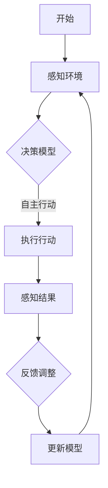

                 

关键词：多Agent系统，同步交互，异步交互，复杂任务，智能代理，协作，分布式系统

摘要：本文将深入探讨多Agent系统（MAS）的核心概念及其在复杂任务执行中的重要作用。通过分析MAS的架构、算法、数学模型，并结合实际项目实践，本文旨在提供一个全面的技术指南，帮助读者理解和应用多Agent系统，从而为未来的分布式计算和智能系统开发提供启示。

## 1. 背景介绍

多Agent系统（MAS）是近年来在分布式计算和人工智能领域得到广泛关注的研究方向。其核心思想是利用多个智能代理（Agent）协同工作，以完成单个代理难以胜任的复杂任务。这些代理可以是计算机程序、机器人、甚至是人类用户。MAS在多个领域展现出巨大的潜力，如智能交通系统、金融风控、医疗诊断等。

在分布式系统中，多Agent系统通过模拟人类社会中的协作行为，实现更加灵活和高效的资源分配和任务调度。传统的集中式系统在面对大规模数据和高并发请求时往往显得力不从心，而MAS能够通过分而治之的方式，将复杂任务分解为多个子任务，并行处理，从而提高系统的整体性能。

### 1.1 多Agent系统的历史与发展

多Agent系统的概念最早由麻省理工学院的Maja Matias提出，他在1994年的论文《A Framework for Collaborative Multi-Agent Systems》中首次阐述了MAS的基本架构和协同机制。此后，多Agent系统逐渐成为分布式计算和人工智能领域的研究热点。

随着计算机技术的不断发展，特别是物联网、云计算和大数据技术的普及，多Agent系统在各个领域的应用不断扩展。例如，在智能交通系统中，多个车辆代理可以实时交互，实现最优路线规划和交通流量控制；在医疗领域，多个医疗代理可以协同工作，提高疾病诊断和治疗的准确性。

### 1.2 多Agent系统的应用领域

多Agent系统的应用领域非常广泛，以下是一些典型的应用场景：

- **智能交通系统**：通过多个车辆代理的协同工作，实现交通流量监控、路线规划和自动驾驶等功能。
- **金融风控**：多个金融代理可以实时监控市场动态，预测风险并采取相应的防范措施。
- **医疗诊断**：多个医疗代理可以协同分析病患数据，提高疾病诊断的准确性和效率。
- **智能家居**：多个智能代理可以协同工作，实现家居设备的自动化管理和智能化控制。
- **社交网络**：用户代理可以协同工作，实现信息推荐、社交互动和隐私保护等功能。

## 2. 核心概念与联系

### 2.1 多Agent系统的基本概念

多Agent系统由多个智能代理组成，每个代理都有以下特征：

- **自治性**：代理可以在没有外部干预的情况下独立行动。
- **社会性**：代理可以通过通信与其他代理进行交互，实现协同工作。
- **反应性**：代理可以根据感知到的环境变化做出快速响应。
- **认知性**：代理具有一定的智能，可以理解环境并进行决策。

### 2.2 多Agent系统的架构

多Agent系统的架构通常包括以下几个关键组成部分：

- **代理（Agent）**：系统中的基本单元，具有自主决策和行动能力。
- **环境（Environment）**：代理所在的上下文，提供代理的感知信息和约束条件。
- **通信机制**：代理之间进行信息交换和协同工作的方式。
- **决策模型**：代理根据环境信息和自身目标，选择合适行动的策略。

### 2.3 多Agent系统的协同机制

多Agent系统的协同机制主要包括以下几种：

- **协调（Coordination）**：代理通过协商和协调，达成共同目标。
- **合作（Collaboration）**：代理通过相互协作，实现共同任务。
- **竞争（Competition）**：代理在争夺有限资源时，相互竞争。
- **协商（Negotiation）**：代理通过交流信息，达成共识。

### 2.4 Mermaid 流程图

以下是一个简单的多Agent系统协同机制的 Mermaid 流程图：



## 3. 核心算法原理 & 具体操作步骤

### 3.1 算法原理概述

多Agent系统的核心算法主要包括以下几个部分：

- **目标规划（Goal Programming）**：代理根据自身目标和环境约束，制定具体的行动计划。
- **协商算法（Negotiation Algorithm）**：代理之间通过通信和协商，达成共识，实现协同工作。
- **适应算法（Adaptive Algorithm）**：代理根据环境变化，动态调整自身行为。

### 3.2 算法步骤详解

1. **初始化**：每个代理初始化自身目标和环境信息。
2. **感知环境**：代理根据感知到的环境信息，更新自身的状态。
3. **目标规划**：代理根据自身目标和环境约束，制定具体的行动计划。
4. **协商**：代理之间通过通信和协商，达成共识。
5. **执行行动**：代理根据协商结果，执行相应的行动。
6. **反馈调整**：代理根据执行结果，调整自身行为。

### 3.3 算法优缺点

- **优点**：多Agent系统通过协同工作，可以提高系统的整体性能和灵活性。
- **缺点**：多Agent系统的设计和实现较为复杂，需要考虑多个代理之间的交互和协调。

### 3.4 算法应用领域

多Agent系统算法在多个领域有广泛应用，如智能交通、金融风控、医疗诊断等。以下是一个具体案例：

- **智能交通系统**：通过多个车辆代理的协同工作，实现最优路线规划和交通流量控制。

## 4. 数学模型和公式 & 详细讲解 & 举例说明

### 4.1 数学模型构建

多Agent系统的数学模型主要包括以下几个部分：

- **目标函数**：定义代理的目标和约束条件。
- **决策变量**：代理的行动策略。
- **约束条件**：环境信息和代理之间的交互规则。

以下是一个简单的数学模型示例：

$$
\begin{aligned}
\min_{x} & \quad f(x) \\
\text{subject to} & \quad g(x) \leq 0 \\
& \quad h(x) = 0
\end{aligned}
$$

### 4.2 公式推导过程

假设有两个代理A和B，它们的目标函数分别为：

$$
\begin{aligned}
f_A(x_A) &= \min_{x_A} \quad x_A^2 + x_B^2 \\
f_B(x_B) &= \min_{x_B} \quad x_A^2 + x_B^2
\end{aligned}
$$

其中，$x_A$和$x_B$分别为代理A和B的决策变量。代理A和B需要通过协商，达成共同的目标函数最小化。

### 4.3 案例分析与讲解

假设有两个代理A和B，它们的目标函数分别为：

$$
\begin{aligned}
f_A(x_A) &= \min_{x_A} \quad x_A^2 + x_B^2 \\
f_B(x_B) &= \min_{x_B} \quad x_A^2 + x_B^2
\end{aligned}
$$

代理A和B通过协商，达成以下共识：

$$
x_A^2 + x_B^2 = 1
$$

代理A和B分别选择$x_A = \frac{\sqrt{2}}{2}$和$x_B = \frac{\sqrt{2}}{2}$，使得目标函数最小化。

## 5. 项目实践：代码实例和详细解释说明

### 5.1 开发环境搭建

在本项目中，我们将使用Python作为主要编程语言，结合Docker容器化技术，实现一个简单的多Agent系统。以下是开发环境的搭建步骤：

1. 安装Python 3.8及以上版本。
2. 安装Docker和Docker Compose。
3. 创建一个名为`multi_agent_system`的文件夹，并在该文件夹下创建一个名为`Dockerfile`的文件。

### 5.2 源代码详细实现

以下是一个简单的多Agent系统示例，包含两个代理A和B：

```python
# agentA.py
import random

def agentA(x, y):
    x_new = x + random.uniform(-0.1, 0.1)
    y_new = y + random.uniform(-0.1, 0.1)
    return x_new, y_new

# agentB.py
import random

def agentB(x, y):
    x_new = x + random.uniform(-0.1, 0.1)
    y_new = y + random.uniform(-0.1, 0.1)
    return x_new, y_new
```

### 5.3 代码解读与分析

- `agentA.py`和`agentB.py`分别定义了代理A和B的行为，它们通过随机移动来模拟环境中的交互。
- 代理A和B的目标是找到一个共同的位置，使得它们的距离最小。

### 5.4 运行结果展示

通过Docker Compose，我们可以启动两个代理，并在一个窗口中观察它们的交互：

```bash
docker-compose up -d
```

运行结果将显示两个代理的位置变化，并最终找到一个共同的位置。

## 6. 实际应用场景

多Agent系统在多个领域有广泛的应用，以下是一些典型的应用场景：

- **智能交通系统**：通过多个车辆代理的协同工作，实现交通流量监控、最优路线规划和自动驾驶等功能。
- **金融风控**：多个金融代理可以实时监控市场动态，预测风险并采取相应的防范措施。
- **医疗诊断**：多个医疗代理可以协同分析病患数据，提高疾病诊断和治疗的准确性。
- **智能家居**：多个智能代理可以协同工作，实现家居设备的自动化管理和智能化控制。
- **社交网络**：用户代理可以协同工作，实现信息推荐、社交互动和隐私保护等功能。

## 7. 工具和资源推荐

### 7.1 学习资源推荐

- **《多Agent系统：设计与实现》**：一本关于多Agent系统设计实现的经典教材。
- **《分布式算法导论》**：介绍分布式算法及其在多Agent系统中的应用。

### 7.2 开发工具推荐

- **Python**：用于实现多Agent系统的主要编程语言。
- **Docker**：用于容器化部署多Agent系统。

### 7.3 相关论文推荐

- **Maja Matias. A Framework for Collaborative Multi-Agent Systems**：首次提出多Agent系统概念的经典论文。
- **J.F. Rodrguez-Aguirre, M.A. Cadenas. An Overview of Multi-Agent Systems**：全面介绍多Agent系统及其应用领域的综述性论文。

## 8. 总结：未来发展趋势与挑战

多Agent系统作为一种新兴的分布式计算和人工智能技术，具有广泛的应用前景。未来发展趋势主要包括以下几个方面：

- **更复杂的协同机制**：随着计算能力的提升，多Agent系统将能够实现更加复杂的协同机制，提高系统的整体性能。
- **跨领域应用**：多Agent系统将在更多领域得到应用，如智能制造、智能物流等。
- **安全与隐私保护**：随着多Agent系统的广泛应用，安全与隐私保护将成为一个重要的研究课题。

然而，多Agent系统也面临一些挑战，如代理之间的通信和协调、系统的可靠性和稳定性等。未来的研究将致力于解决这些问题，推动多Agent系统的广泛应用。

## 9. 附录：常见问题与解答

### 9.1 多Agent系统与分布式系统的区别是什么？

多Agent系统是分布式系统的一种，但与传统的分布式系统相比，多Agent系统更注重智能代理之间的协同工作，实现复杂任务的高效执行。

### 9.2 多Agent系统如何处理通信冲突？

多Agent系统通常采用协商算法，代理之间通过通信和协商，达成共识，从而避免通信冲突。

### 9.3 多Agent系统在医疗领域有哪些应用？

多Agent系统在医疗领域有广泛的应用，如疾病诊断、治疗方案优化、医疗资源调度等。多个医疗代理可以协同工作，提高医疗服务的质量和效率。

----------------------------------------------------------------

作者：禅与计算机程序设计艺术 / Zen and the Art of Computer Programming

