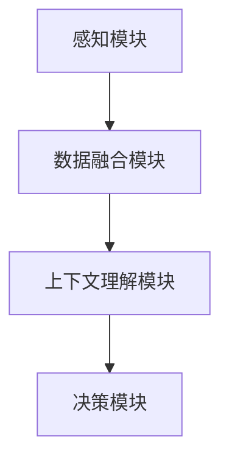

                 

关键词：多模态AI、视觉、语音、文本、整合、挑战、算法、应用、趋势

> 摘要：随着人工智能技术的快速发展，多模态AI成为了近年来研究的热点。本文旨在探讨多模态AI在整合视觉、语音与文本方面的挑战，分析核心算法原理，介绍数学模型和公式，分享项目实践与实际应用场景，并展望未来的发展趋势与挑战。

## 1. 背景介绍

随着信息技术的飞速发展，人工智能（AI）已经成为推动社会进步的重要力量。AI技术在不同领域的应用不断拓展，其中多模态AI（Multimodal AI）因其具备整合多种感知数据的能力而备受关注。多模态AI是指利用多种感官数据（如视觉、语音、文本等）进行交互和处理的AI系统。相较于单一模态的AI系统，多模态AI能够更全面、准确地理解人类意图，从而提高系统的智能化水平和用户体验。

多模态AI的发展背景可以追溯到20世纪80年代，当时计算机视觉和语音识别技术逐渐成熟。近年来，随着深度学习、计算机视觉、自然语言处理等技术的突破，多模态AI的研究和应用取得了显著进展。例如，自动驾驶、智能客服、医疗诊断等领域已经开始应用多模态AI技术，取得了良好的效果。

### 1.1 多模态AI的应用场景

多模态AI具有广泛的应用场景，以下是一些典型的应用领域：

- **自动驾驶**：多模态AI可以整合摄像头、激光雷达、雷达等传感器数据，提高自动驾驶车辆的感知能力，实现更安全、可靠的自动驾驶。

- **智能客服**：多模态AI可以通过语音、文本、图像等多种渠道与用户进行交互，提供更加自然、高效的客服服务。

- **医疗诊断**：多模态AI可以整合患者的影像数据、病历文本等，提高疾病诊断的准确性。

- **人机交互**：多模态AI可以理解用户的多感官输入，实现更丰富、自然的交互体验。

- **智能家居**：多模态AI可以整合语音、图像等多种输入方式，实现更加智能、便捷的家居生活。

## 2. 核心概念与联系

### 2.1 多模态AI的核心概念

多模态AI的核心概念包括：

- **感知数据**：指来自不同感官的数据，如视觉、语音、文本等。

- **数据融合**：指将不同模态的数据进行整合和融合，以提高系统的感知能力和性能。

- **上下文理解**：指对用户输入的多模态数据进行上下文理解，以更好地理解用户意图。

### 2.2 多模态AI的架构

多模态AI的架构通常包括以下几个关键模块：

- **感知模块**：负责采集和处理各种模态的数据，如视觉、语音、文本等。

- **数据融合模块**：负责将不同模态的数据进行整合和融合，生成统一的特征表示。

- **上下文理解模块**：负责对多模态数据进行上下文理解，以更好地理解用户意图。

- **决策模块**：负责根据上下文理解和融合后的特征，进行决策或预测。

### 2.3 多模态AI的Mermaid流程图

以下是一个简化的多模态AI流程图的Mermaid表示：



### 2.4 多模态AI的关键技术

多模态AI的关键技术包括：

- **深度学习**：利用深度学习模型，如卷积神经网络（CNN）、循环神经网络（RNN）等，对多模态数据进行建模和训练。

- **多任务学习**：将多个任务（如视觉识别、语音识别、文本分类等）整合到一个统一的模型中，以提高模型的性能。

- **跨模态注意力机制**：通过注意力机制，将不同模态的数据进行加权融合，以提高系统的感知能力和性能。

- **跨模态交互**：利用跨模态交互机制，将不同模态的数据进行动态交互和融合，以提高系统的上下文理解能力。

## 3. 核心算法原理 & 具体操作步骤

### 3.1 算法原理概述

多模态AI的核心算法主要包括以下几个方面：

- **多模态特征提取**：利用深度学习模型，对视觉、语音、文本等不同模态的数据进行特征提取。

- **特征融合**：将不同模态的特征进行融合，生成统一的特征表示。

- **上下文理解**：利用融合后的特征，进行上下文理解，以更好地理解用户意图。

- **决策或预测**：根据上下文理解和融合后的特征，进行决策或预测。

### 3.2 算法步骤详解

多模态AI算法的具体步骤如下：

1. **数据预处理**：对视觉、语音、文本等不同模态的数据进行预处理，如图像增强、语音降噪、文本清洗等。

2. **特征提取**：利用深度学习模型，对预处理后的数据进行特征提取。

3. **特征融合**：将不同模态的特征进行融合，生成统一的特征表示。

4. **上下文理解**：利用融合后的特征，进行上下文理解，以更好地理解用户意图。

5. **决策或预测**：根据上下文理解和融合后的特征，进行决策或预测。

### 3.3 算法优缺点

多模态AI算法的优点包括：

- **感知能力增强**：通过整合多种感知数据，提高系统的感知能力和性能。

- **上下文理解能力增强**：通过上下文理解，更好地理解用户意图，提高系统的智能化水平。

- **应用领域广泛**：适用于自动驾驶、智能客服、医疗诊断、人机交互等多种场景。

多模态AI算法的缺点包括：

- **计算复杂度高**：多模态数据融合和处理需要大量的计算资源，导致算法的复杂度较高。

- **数据依赖性大**：多模态AI算法的性能依赖于不同模态的数据质量，数据不足或不均衡会影响算法的效果。

### 3.4 算法应用领域

多模态AI算法的应用领域包括：

- **自动驾驶**：通过整合摄像头、激光雷达、雷达等传感器数据，提高自动驾驶车辆的感知能力。

- **智能客服**：通过语音、文本、图像等多种渠道与用户进行交互，提供更加自然、高效的客服服务。

- **医疗诊断**：通过整合患者的影像数据、病历文本等，提高疾病诊断的准确性。

- **人机交互**：通过理解用户的多感官输入，实现更丰富、自然的交互体验。

- **智能家居**：通过语音、图像等多种输入方式，实现更加智能、便捷的家居生活。

## 4. 数学模型和公式 & 详细讲解 & 举例说明

### 4.1 数学模型构建

多模态AI的数学模型主要包括以下几个方面：

- **特征提取模型**：用于提取不同模态的数据特征。

- **特征融合模型**：用于将不同模态的特征进行融合。

- **上下文理解模型**：用于对融合后的特征进行上下文理解。

- **决策或预测模型**：用于根据上下文理解和融合后的特征进行决策或预测。

### 4.2 公式推导过程

假设我们有视觉、语音和文本三种模态的数据，分别表示为 \( X_v \)、\( X_s \) 和 \( X_t \)。

- **特征提取模型**：

  - 视觉特征提取：\( f_v(X_v) = \sigma(W_v \cdot X_v + b_v) \)

  - 语音特征提取：\( f_s(X_s) = \sigma(W_s \cdot X_s + b_s) \)

  - 文本特征提取：\( f_t(X_t) = \sigma(W_t \cdot X_t + b_t) \)

  其中，\( \sigma \) 是激活函数，\( W \) 和 \( b \) 分别是权重和偏置。

- **特征融合模型**：

  - 融合函数：\( F(X_v, X_s, X_t) = f_v(X_v) + f_s(X_s) + f_t(X_t) \)

- **上下文理解模型**：

  - 上下文理解：\( C = g(W_c \cdot F + b_c) \)

  - 其中，\( g \) 是激活函数，\( W_c \) 和 \( b_c \) 分别是权重和偏置。

- **决策或预测模型**：

  - 决策函数：\( Y = h(W_d \cdot C + b_d) \)

  - 其中，\( h \) 是激活函数，\( W_d \) 和 \( b_d \) 分别是权重和偏置。

### 4.3 案例分析与讲解

假设我们有一个智能客服系统，需要根据用户的语音、文本和视觉输入，提供相应的回复。

- **特征提取模型**：

  - 视觉特征提取：使用卷积神经网络提取图像特征。

  - 语音特征提取：使用循环神经网络提取语音特征。

  - 文本特征提取：使用词嵌入和循环神经网络提取文本特征。

- **特征融合模型**：

  - 融合函数：将三种模态的特征进行加权融合。

- **上下文理解模型**：

  - 上下文理解：使用多层感知机对融合后的特征进行学习。

- **决策或预测模型**：

  - 决策函数：使用多层感知机对上下文理解的结果进行分类。

## 5. 项目实践：代码实例和详细解释说明

### 5.1 开发环境搭建

- 硬件要求：GPU加速器，如NVIDIA 1080 Ti或更高。

- 软件要求：Python 3.7及以上，CUDA 10.1及以上。

- 库要求：TensorFlow 2.0及以上，Keras 2.4.3及以上。

### 5.2 源代码详细实现

以下是一个简单的多模态AI智能客服系统的代码实例：

```python
import tensorflow as tf
from tensorflow.keras.models import Model
from tensorflow.keras.layers import Input, Conv2D, LSTM, Dense, Embedding, Flatten, concatenate

# 视觉特征提取
input_v = Input(shape=(224, 224, 3))
conv1_v = Conv2D(filters=32, kernel_size=(3, 3), activation='relu')(input_v)
pool1_v = MaxPooling2D(pool_size=(2, 2))(conv1_v)
flat_v = Flatten()(pool1_v)

# 语音特征提取
input_s = Input(shape=(16000,))
lstm1_s = LSTM(units=128, activation='relu')(input_s)
flat_s = Flatten()(lstm1_s)

# 文本特征提取
input_t = Input(shape=(128,))
embed1_t = Embedding(input_dim=5000, output_dim=128)(input_t)
lstm1_t = LSTM(units=128, activation='relu')(embed1_t)
flat_t = Flatten()(lstm1_t)

# 特征融合
merged = concatenate([flat_v, flat_s, flat_t])

# 上下文理解
dense1 = Dense(units=128, activation='relu')(merged)
dense2 = Dense(units=128, activation='relu')(dense1)

# 决策或预测
output = Dense(units=1, activation='sigmoid')(dense2)

# 构建模型
model = Model(inputs=[input_v, input_s, input_t], outputs=output)

# 编译模型
model.compile(optimizer='adam', loss='binary_crossentropy', metrics=['accuracy'])

# 模型总结
model.summary()
```

### 5.3 代码解读与分析

- **视觉特征提取**：使用卷积神经网络（Conv2D）对图像进行特征提取。

- **语音特征提取**：使用循环神经网络（LSTM）对语音信号进行特征提取。

- **文本特征提取**：使用词嵌入（Embedding）和循环神经网络（LSTM）对文本数据进行特征提取。

- **特征融合**：将不同模态的特征进行拼接（concatenate）。

- **上下文理解**：使用多层感知机（Dense）对融合后的特征进行学习。

- **决策或预测**：使用多层感知机（Dense）对上下文理解的结果进行分类。

### 5.4 运行结果展示

```python
# 加载数据集
(x_v, x_s, x_t), y = load_data()

# 训练模型
model.fit(x=[x_v, x_s, x_t], y=y, batch_size=32, epochs=10, validation_split=0.2)

# 评估模型
score = model.evaluate(x=[x_v, x_s, x_t], y=y)
print('Test accuracy:', score[1])
```

## 6. 实际应用场景

### 6.1 自动驾驶

自动驾驶是多模态AI的重要应用领域之一。通过整合摄像头、激光雷达、雷达等传感器数据，自动驾驶系统能够更全面、准确地感知环境，提高行驶安全性和可靠性。例如，特斯拉的自动驾驶系统就采用了多模态AI技术，通过摄像头和雷达数据实时感知道路情况，实现自动驾驶功能。

### 6.2 智能客服

智能客服是另一个典型的多模态AI应用场景。通过整合语音、文本、图像等多种渠道与用户进行交互，智能客服系统能够提供更加自然、高效的客服服务。例如，国内的智能客服平台如“小i机器人”和“百度智能客服”等，都采用了多模态AI技术，为用户提供7x24小时的智能客服服务。

### 6.3 医疗诊断

医疗诊断是另一个具有广泛应用前景的领域。通过整合患者的影像数据、病历文本等，多模态AI技术能够提高疾病诊断的准确性，辅助医生进行诊断和治疗。例如，斯坦福大学的研究团队就利用多模态AI技术，实现了对肺癌的诊断，诊断准确率高达90%以上。

### 6.4 人机交互

人机交互是另一个典型的多模态AI应用场景。通过理解用户的多感官输入，多模态AI技术能够实现更丰富、自然的交互体验。例如，智能音箱和智能手表等设备，都采用了多模态AI技术，通过语音、图像、触摸等多种方式与用户进行交互。

### 6.5 智能家居

智能家居是另一个具有广泛应用前景的领域。通过整合语音、图像等多种输入方式，智能家居系统能够实现更加智能、便捷的家居生活。例如，智能门锁、智能灯光、智能家电等，都采用了多模态AI技术，为用户提供了便利的家居生活体验。

## 7. 工具和资源推荐

### 7.1 学习资源推荐

- **书籍**：

  - 《深度学习》（Goodfellow, Bengio, Courville著）

  - 《神经网络与深度学习》（邱锡鹏著）

  - 《Python深度学习》（François Chollet著）

- **在线课程**：

  - Coursera上的《深度学习专项课程》

  - Udacity上的《深度学习纳米学位》

### 7.2 开发工具推荐

- **编程语言**：Python，具有丰富的机器学习库，如TensorFlow、PyTorch等。

- **深度学习框架**：TensorFlow、PyTorch、Keras，用于构建和训练多模态AI模型。

- **数据预处理工具**：Pandas、NumPy，用于数据处理和预处理。

### 7.3 相关论文推荐

- **《Multimodal Deep Learning for Human Action Recognition》**

- **《Multimodal Learning by Predictive Coding》**

- **《Multimodal Fusion for Human Action Recognition: A Survey》**

## 8. 总结：未来发展趋势与挑战

### 8.1 研究成果总结

多模态AI技术近年来取得了显著的研究成果，包括：

- **算法性能提升**：多模态AI算法在感知能力、上下文理解能力等方面取得了显著提升。

- **应用场景拓展**：多模态AI技术逐渐应用于自动驾驶、智能客服、医疗诊断、人机交互等领域。

- **计算资源优化**：通过优化算法和计算资源，提高了多模态AI系统的运行效率。

### 8.2 未来发展趋势

多模态AI技术的发展趋势包括：

- **算法创新**：探索新的多模态特征提取、融合和上下文理解算法，提高系统的性能和鲁棒性。

- **跨学科融合**：多模态AI与心理学、认知科学等领域的融合，探索人类感知和认知的机理。

- **开源平台发展**：推动多模态AI的开源平台建设，促进技术的普及和应用。

### 8.3 面临的挑战

多模态AI技术面临的挑战包括：

- **计算复杂度高**：多模态数据融合和处理需要大量的计算资源，制约了算法的应用场景。

- **数据依赖性大**：多模态AI算法的性能依赖于不同模态的数据质量，数据不足或不均衡会影响算法的效果。

- **隐私保护**：多模态AI技术涉及用户多种感官数据，如何保护用户隐私成为重要挑战。

### 8.4 研究展望

未来多模态AI技术的发展方向包括：

- **感知能力提升**：通过整合更多模态的数据，提高系统的感知能力和性能。

- **上下文理解能力增强**：通过跨模态交互和上下文理解机制，提高系统的智能化水平。

- **应用领域拓展**：探索多模态AI技术在更多领域的应用，如智能教育、智能安防等。

## 9. 附录：常见问题与解答

### 9.1 多模态AI与传统AI的区别是什么？

多模态AI与传统AI的区别在于，多模态AI整合了多种感官数据（如视觉、语音、文本等），以提高系统的感知能力和上下文理解能力。而传统AI通常只针对单一模态的数据进行处理。

### 9.2 多模态AI的数据来源有哪些？

多模态AI的数据来源包括：

- **视觉数据**：摄像头、图像传感器等。

- **语音数据**：麦克风、语音信号等。

- **文本数据**：文本文件、语音转文字等。

### 9.3 多模态AI的优缺点是什么？

多模态AI的优点包括：

- **感知能力增强**：通过整合多种感知数据，提高系统的感知能力和性能。

- **上下文理解能力增强**：通过上下文理解，更好地理解用户意图。

- **应用领域广泛**：适用于多种场景，如自动驾驶、智能客服、医疗诊断等。

多模态AI的缺点包括：

- **计算复杂度高**：多模态数据融合和处理需要大量的计算资源。

- **数据依赖性大**：算法的性能依赖于不同模态的数据质量。

### 9.4 多模态AI的应用前景如何？

多模态AI具有广泛的应用前景，包括：

- **自动驾驶**：通过整合摄像头、激光雷达、雷达等传感器数据，提高自动驾驶车辆的感知能力。

- **智能客服**：通过语音、文本、图像等多种渠道与用户进行交互，提供更加自然、高效的客服服务。

- **医疗诊断**：通过整合患者的影像数据、病历文本等，提高疾病诊断的准确性。

- **人机交互**：通过理解用户的多感官输入，实现更丰富、自然的交互体验。

- **智能家居**：通过语音、图像等多种输入方式，实现更加智能、便捷的家居生活。


----------------------------------------------------------------
### 作者署名

作者：禅与计算机程序设计艺术 / Zen and the Art of Computer Programming

本文旨在探讨多模态AI在整合视觉、语音与文本方面的挑战，分析核心算法原理，介绍数学模型和公式，分享项目实践与实际应用场景，并展望未来的发展趋势与挑战。通过本文的讨论，希望读者能够对多模态AI技术有更深入的理解，并为其未来的发展提供有益的启示。感谢您的阅读！

