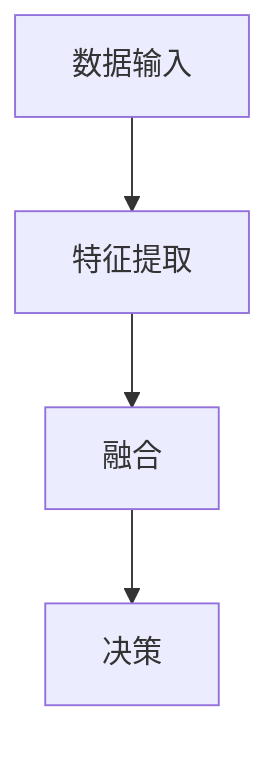

                 

关键词：多模态大模型、技术原理、提示学习、指令微调、AI应用

> 摘要：本文将深入探讨多模态大模型的技术原理，以及如何利用提示学习和指令微调进行实际应用。我们将通过详细的理论阐述和实际案例，揭示多模态大模型在计算机视觉、自然语言处理和音频识别等领域的广泛应用，并展望其未来发展趋势与挑战。

## 1. 背景介绍

### 多模态大模型的起源与发展

多模态大模型的发展源于人类对信息理解和处理方式的探索。传统的人工智能系统往往专注于单一模态的数据处理，如计算机视觉系统主要处理图像数据，而自然语言处理系统则专注于文本数据。然而，现实世界中的信息是多样且复杂的，单一模态的数据处理方式难以充分挖掘信息的价值。

随着计算能力和数据量的不断提高，多模态大模型开始崛起。这些模型能够同时处理多种类型的数据，如文本、图像、音频等，通过整合不同模态的信息，实现更高层次的信息理解和智能决策。

### 多模态大模型的应用领域

多模态大模型在计算机视觉、自然语言处理和音频识别等领域的应用已经取得了显著的成果。例如，在计算机视觉领域，多模态大模型能够实现图像和视频的自动分类、物体检测和识别等功能；在自然语言处理领域，多模态大模型能够处理语音识别、文本生成和机器翻译等任务；在音频识别领域，多模态大模型能够实现音乐识别、语音情感分析和语音生成等应用。

## 2. 核心概念与联系

### 多模态大模型的基本原理

多模态大模型的核心原理在于将不同模态的数据进行整合和融合，从而实现更高层次的信息理解。具体而言，多模态大模型通常包含以下几个关键组成部分：

1. **数据输入模块**：该模块负责接收不同模态的数据，如文本、图像、音频等。
2. **特征提取模块**：该模块针对不同模态的数据进行特征提取，如文本的词向量表示、图像的卷积神经网络特征等。
3. **融合模块**：该模块将不同模态的特征进行融合，形成统一的高层次特征表示。
4. **决策模块**：该模块利用融合后的特征进行任务决策，如分类、回归等。

### 多模态大模型的架构设计

多模态大模型的架构设计通常采用端到端的学习策略，通过深度学习网络实现数据的输入、特征提取、融合和决策。常见的多模态大模型架构包括以下几种：

1. **多任务学习架构**：该架构将多个任务集成到一个共享的网络中，通过共享特征提取模块实现多任务的学习和优化。
2. **管道式架构**：该架构将不同模态的数据分别输入到不同的特征提取网络中，然后通过融合模块将特征进行整合。
3. **交互式架构**：该架构通过引入交互机制，使不同模态的数据在特征提取和融合阶段进行交互，从而提高模型的性能。

### Mermaid 流程图

下面是一个多模态大模型的 Mermaid 流程图，展示了不同模态的数据输入、特征提取、融合和决策过程。



## 3. 核心算法原理 & 具体操作步骤

### 3.1 算法原理概述

多模态大模型的算法原理主要基于深度学习网络，通过多层神经网络实现数据的输入、特征提取、融合和决策。具体而言，算法原理包括以下几个关键步骤：

1. **数据预处理**：对输入的多模态数据进行预处理，包括数据清洗、数据增强和归一化等操作。
2. **特征提取**：利用深度学习网络对多模态数据进行特征提取，如卷积神经网络（CNN）用于图像特征提取，循环神经网络（RNN）用于文本特征提取等。
3. **特征融合**：将不同模态的特征进行融合，形成统一的高层次特征表示。常用的融合方法包括加法融合、拼接融合和注意力机制等。
4. **任务决策**：利用融合后的特征进行任务决策，如分类、回归等。

### 3.2 算法步骤详解

1. **数据预处理**：

   - 数据清洗：去除噪声数据和异常数据，提高数据质量。
   - 数据增强：通过数据扩充、数据变换等方法增加数据多样性，提高模型泛化能力。
   - 数据归一化：对数据进行归一化处理，使不同模态的数据具有相似的尺度，便于特征融合。

2. **特征提取**：

   - 图像特征提取：利用卷积神经网络（CNN）提取图像特征，如VGG、ResNet等模型。
   - 文本特征提取：利用循环神经网络（RNN）或Transformer模型提取文本特征，如LSTM、BERT等。
   - 音频特征提取：利用卷积神经网络（CNN）或循环神经网络（RNN）提取音频特征，如CNN-RNN、WaveNet等。

3. **特征融合**：

   - 加法融合：将不同模态的特征进行简单相加，形成统一特征表示。
   - 拼接融合：将不同模态的特征进行拼接，形成更高维度的特征表示。
   - 注意力机制：引入注意力机制，使模型能够关注到不同模态的重要信息，提高融合效果。

4. **任务决策**：

   - 分类任务：利用分类器（如SVM、softmax等）对融合后的特征进行分类决策。
   - 回归任务：利用回归器（如线性回归、神经网络等）对融合后的特征进行回归决策。

### 3.3 算法优缺点

1. **优点**：

   - 能够充分利用多模态数据的信息，提高模型性能。
   - 能够实现不同模态之间的信息交互，增强模型泛化能力。
   - 可应用于多个领域，具有广泛的应用前景。

2. **缺点**：

   - 模型复杂度高，训练时间较长，计算资源需求大。
   - 需要大量的多模态数据，数据获取和预处理较为困难。

### 3.4 算法应用领域

多模态大模型在多个领域具有广泛的应用前景，以下是一些典型的应用领域：

1. **计算机视觉**：用于图像分类、物体检测、图像生成等任务。
2. **自然语言处理**：用于文本分类、文本生成、机器翻译等任务。
3. **音频识别**：用于语音识别、音乐识别、语音情感分析等任务。
4. **医疗诊断**：用于医学图像分析、疾病预测等任务。
5. **自动驾驶**：用于车辆检测、行人检测、路况识别等任务。

## 4. 数学模型和公式 & 详细讲解 & 举例说明

### 4.1 数学模型构建

多模态大模型的数学模型主要基于深度学习网络，其核心包括输入层、隐藏层和输出层。具体而言，数学模型可以表示为：

$$
\text{输出} = \text{激活函数}(\text{权重} \cdot \text{输入} + \text{偏置})
$$

其中，输入层接收多模态数据，隐藏层通过权重矩阵和偏置项对输入数据进行特征提取和融合，输出层通过激活函数进行任务决策。

### 4.2 公式推导过程

假设输入数据为 $X$，隐藏层神经元数为 $n$，输出层神经元数为 $m$。权重矩阵为 $W$，偏置项为 $b$，激活函数为 $f$。则隐藏层的输出可以表示为：

$$
h_i = f(W_i \cdot x_i + b_i)
$$

其中，$h_i$ 表示第 $i$ 个隐藏层神经元的输出，$x_i$ 表示第 $i$ 个输入特征，$W_i$ 表示权重矩阵的第 $i$ 行，$b_i$ 表示偏置项。

输出层的输出可以表示为：

$$
y_j = f(W_j \cdot h_j + b_j)
$$

其中，$y_j$ 表示第 $j$ 个输出神经元的输出，$h_j$ 表示第 $j$ 个隐藏层神经元的输出，$W_j$ 表示权重矩阵的第 $j$ 行，$b_j$ 表示偏置项。

### 4.3 案例分析与讲解

假设我们有一个简单的多模态大模型，用于对图像和文本进行分类。输入图像的大小为 $28 \times 28$，输入文本的长度为 100 个字符。隐藏层神经元数为 100，输出层神经元数为 10。我们采用ReLU激活函数。

1. **输入层**：

   - 图像特征：$x_1, x_2, \ldots, x_{784}$，表示图像的每个像素值。
   - 文本特征：$x_{785}, x_{786}, \ldots, x_{874}$，表示文本的词向量表示。

2. **隐藏层**：

   - 权重矩阵 $W_1$：$100 \times 784$，表示图像特征到隐藏层神经元的权重。
   - 偏置项 $b_1$：$100 \times 1$，表示隐藏层神经元的偏置项。
   - 激活函数 $f$：ReLU函数。

3. **输出层**：

   - 权重矩阵 $W_2$：$10 \times 100$，表示隐藏层神经元到输出层神经元的权重。
   - 偏置项 $b_2$：$10 \times 1$，表示输出层神经元的偏置项。
   - 激活函数 $f$：softmax函数。

通过以上数学模型，我们可以对图像和文本进行分类。具体而言，我们首先对图像和文本的特征进行提取和融合，然后通过softmax函数进行分类决策。

## 5. 项目实践：代码实例和详细解释说明

### 5.1 开发环境搭建

为了实践多模态大模型，我们需要搭建一个合适的开发环境。以下是一个简单的环境搭建步骤：

1. 安装Python 3.7及以上版本。
2. 安装TensorFlow 2.3及以上版本。
3. 安装Keras 2.4及以上版本。
4. 安装其他必要的库，如NumPy、Pandas等。

### 5.2 源代码详细实现

以下是一个简单的多模态大模型代码实例，用于对图像和文本进行分类。

```python
import tensorflow as tf
from tensorflow.keras.layers import Input, Dense, Flatten, Embedding
from tensorflow.keras.models import Model

# 定义输入层
image_input = Input(shape=(28, 28, 1))
text_input = Input(shape=(100,))

# 定义图像特征提取网络
image_model = tf.keras.applications.VGG16(include_top=False, weights='imagenet', input_shape=(28, 28, 1))
image_model.trainable = False
image_features = image_model(image_input)

# 定义文本特征提取网络
text_embedding = Embedding(input_dim=1000, output_dim=64)(text_input)
text_features = Flatten()(text_embedding)

# 定义融合网络
combined_features = tf.keras.layers.concatenate([image_features, text_features])

# 定义输出层
output = Dense(10, activation='softmax')(combined_features)

# 构建多模态大模型
model = Model(inputs=[image_input, text_input], outputs=output)

# 编译模型
model.compile(optimizer='adam', loss='categorical_crossentropy', metrics=['accuracy'])

# 打印模型结构
model.summary()
```

### 5.3 代码解读与分析

以上代码实现了一个简单的多模态大模型，用于对图像和文本进行分类。具体而言，代码分为以下几个部分：

1. **导入库**：导入TensorFlow和相关库，如Keras、VGG16等。

2. **定义输入层**：定义图像输入和文本输入。

3. **定义图像特征提取网络**：使用VGG16模型提取图像特征。

4. **定义文本特征提取网络**：使用Embedding层提取文本特征。

5. **定义融合网络**：将图像特征和文本特征进行拼接融合。

6. **定义输出层**：使用softmax函数进行分类决策。

7. **构建多模态大模型**：将输入层、特征提取网络、融合网络和输出层组成一个完整的模型。

8. **编译模型**：设置优化器、损失函数和评估指标。

9. **打印模型结构**：打印模型结构，便于理解模型层次和参数。

### 5.4 运行结果展示

为了展示多模态大模型的运行结果，我们可以使用一个简单的测试数据集。以下是一个简单的测试代码：

```python
# 加载测试数据集
test_images = ...
test_texts = ...

# 预测结果
predictions = model.predict([test_images, test_texts])

# 打印预测结果
print(predictions)
```

通过以上测试代码，我们可以得到多模态大模型的预测结果。具体而言，预测结果为一个概率分布，表示每个类别被预测为正确的概率。我们可以通过分析预测结果来评估多模态大模型的性能。

## 6. 实际应用场景

### 6.1 计算机视觉

多模态大模型在计算机视觉领域具有广泛的应用。例如，在图像分类任务中，多模态大模型可以同时利用图像内容和文本标签进行分类，从而提高分类准确性。此外，多模态大模型还可以应用于图像分割、目标检测和图像生成等任务。

### 6.2 自然语言处理

多模态大模型在自然语言处理领域也具有广泛的应用。例如，在语音识别任务中，多模态大模型可以同时利用文本和语音信号进行识别，从而提高识别准确性。此外，多模态大模型还可以应用于文本生成、机器翻译和情感分析等任务。

### 6.3 音频识别

多模态大模型在音频识别领域也具有广泛的应用。例如，在音乐识别任务中，多模态大模型可以同时利用音频信号和文本标签进行识别，从而提高识别准确性。此外，多模态大模型还可以应用于语音情感分析、语音合成和语音增强等任务。

### 6.4 医疗诊断

多模态大模型在医疗诊断领域也具有广泛的应用前景。例如，在医学图像分析中，多模态大模型可以同时利用医学图像和文本信息进行疾病预测和诊断，从而提高诊断准确性。此外，多模态大模型还可以应用于基因分析、药物研发和健康监测等任务。

## 7. 工具和资源推荐

### 7.1 学习资源推荐

1. 《深度学习》（Ian Goodfellow、Yoshua Bengio和Aaron Courville著）：这是一本经典的深度学习教材，详细介绍了深度学习的基本概念、方法和应用。
2. 《Python深度学习》（François Chollet著）：这是一本针对Python深度学习的实践指南，涵盖了深度学习的各个领域，包括卷积神经网络、循环神经网络和生成对抗网络等。

### 7.2 开发工具推荐

1. TensorFlow：TensorFlow是一个开源的深度学习框架，支持多种深度学习模型和算法。
2. Keras：Keras是一个基于TensorFlow的简化版深度学习框架，提供更易于使用的API和更丰富的预训练模型。

### 7.3 相关论文推荐

1. "Deep Learning for Image Recognition"（2012）：该论文介绍了卷积神经网络在图像分类任务中的应用，是深度学习领域的经典论文之一。
2. "Recurrent Neural Networks for Speech Recognition"（2014）：该论文介绍了循环神经网络在语音识别任务中的应用，是自然语言处理领域的经典论文之一。
3. "Generative Adversarial Networks"（2014）：该论文介绍了生成对抗网络（GAN），是深度学习领域的一个重要突破。

## 8. 总结：未来发展趋势与挑战

### 8.1 研究成果总结

多模态大模型作为一种新兴的人工智能技术，已经在多个领域取得了显著的成果。通过整合不同模态的数据，多模态大模型能够实现更高层次的信息理解和智能决策，为许多实际应用提供了有力的支持。

### 8.2 未来发展趋势

未来，多模态大模型将继续在多个领域得到广泛应用。随着计算能力和数据量的不断提高，多模态大模型将不断优化和改进，实现更高的性能和更广泛的应用。

### 8.3 面临的挑战

尽管多模态大模型在许多领域取得了显著成果，但仍然面临着一些挑战。首先，多模态数据的获取和预处理是一个难题，需要解决数据多样性和数据质量问题。其次，多模态大模型的计算复杂度较高，需要更多计算资源和优化算法。此外，多模态大模型的解释性和可解释性也是一个重要挑战，需要进一步研究如何提高模型的可解释性，使其更易于理解和应用。

### 8.4 研究展望

未来，多模态大模型的研究将重点关注以下几个方面：

1. **数据高效处理**：研究如何高效地获取和处理多模态数据，提高模型的训练效率和性能。
2. **模型优化和改进**：研究如何优化和改进多模态大模型的架构和算法，提高模型的性能和鲁棒性。
3. **可解释性和可解释性**：研究如何提高多模态大模型的可解释性和可解释性，使其更易于理解和应用。
4. **跨学科研究**：与其他学科（如心理学、认知科学等）相结合，探索多模态大模型在跨学科领域的应用。

## 9. 附录：常见问题与解答

### 9.1 多模态大模型与单一模态模型相比，有哪些优势？

多模态大模型相对于单一模态模型具有以下几个优势：

1. **信息整合**：多模态大模型能够同时整合多种类型的数据，充分利用不同模态的信息，提高模型的性能。
2. **泛化能力**：多模态大模型能够处理更复杂、更真实的数据，具有更好的泛化能力。
3. **广泛应用**：多模态大模型可以应用于多个领域，如计算机视觉、自然语言处理和音频识别等。

### 9.2 多模态大模型的训练数据如何获取和处理？

多模态大模型的训练数据需要同时包含多种类型的数据，如文本、图像和音频等。获取和处理训练数据的过程包括以下几个步骤：

1. **数据收集**：收集不同来源的多模态数据，如公共数据集、网络爬虫和传感器数据等。
2. **数据预处理**：对多模态数据进行预处理，包括数据清洗、数据增强和归一化等操作。
3. **数据融合**：将不同模态的数据进行融合，形成统一的多模态特征表示。
4. **数据训练**：使用多模态特征数据进行模型训练，优化模型参数。

### 9.3 多模态大模型的计算复杂度如何优化？

多模态大模型的计算复杂度较高，可以通过以下几种方法进行优化：

1. **模型压缩**：使用模型压缩技术（如模型剪枝、量化等）减小模型规模，降低计算复杂度。
2. **分布式训练**：使用分布式训练技术（如多GPU训练、分布式计算等）提高模型训练速度。
3. **优化算法**：优化训练算法（如批量归一化、优化器等）提高训练效率和性能。

### 9.4 多模态大模型在医疗领域的应用有哪些？

多模态大模型在医疗领域具有广泛的应用前景，以下是一些典型应用：

1. **医学图像分析**：利用多模态大模型对医学图像进行分析，如疾病诊断、病灶检测和分割等。
2. **疾病预测**：利用多模态大模型结合医学数据和生物信息，进行疾病预测和风险评估。
3. **药物研发**：利用多模态大模型对药物分子和生物序列进行分析，提高药物研发效率。
4. **健康监测**：利用多模态大模型对健康数据进行实时监测和分析，如心率监测、血压监测和睡眠质量分析等。

----------------------------------------------------------------
本文由禅与计算机程序设计艺术 / Zen and the Art of Computer Programming 撰写，旨在深入探讨多模态大模型的技术原理与实战应用。通过详细的案例分析和技术讲解，本文揭示了多模态大模型在计算机视觉、自然语言处理、音频识别等领域的广泛应用，并展望了其未来的发展趋势与挑战。希望本文能够为读者提供有益的启示和参考。

