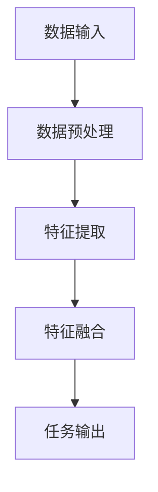

                 

关键词：多模态大模型、模型压缩、技术原理、实战应用、算法优化

## 摘要

本文旨在探讨多模态大模型的压缩技术原理及其在实际应用中的重要性。随着深度学习技术的迅猛发展，多模态大模型在图像、语音、文本等领域的应用逐渐普及，但其巨大的模型体积和计算需求成为实际部署的瓶颈。本文首先介绍多模态大模型的基本概念和技术原理，然后详细解析模型压缩的多种方法，包括模型剪枝、量化、蒸馏等。通过实际项目实践，本文展示如何在实际应用中实现模型压缩，并探讨其在未来应用中的发展趋势与挑战。

## 1. 背景介绍

### 1.1 多模态大模型的兴起

多模态大模型是指能够同时处理多种类型数据（如图像、语音、文本等）的深度学习模型。随着大数据和人工智能技术的快速发展，多模态大模型在图像识别、语音识别、自然语言处理等领域的应用得到了广泛关注。例如，在图像识别领域，传统的卷积神经网络（CNN）只能处理二维图像数据，而多模态大模型通过结合图像和文本数据，可以显著提高图像分类的准确性。

### 1.2 多模态大模型的技术挑战

尽管多模态大模型在多个领域表现出色，但其技术挑战也是显而易见的。首先，这些模型通常具有庞大的参数量和计算量，导致其训练和推理过程非常耗时。其次，模型的存储和部署也面临着巨大挑战，尤其是在资源受限的移动设备和嵌入式系统中。因此，模型压缩成为解决这些挑战的关键技术。

### 1.3 模型压缩的重要性

模型压缩技术旨在减少模型的参数量和计算量，从而降低模型的存储和计算需求。这对于多模态大模型尤为重要，因为其庞大的参数量使得模型压缩能够显著提升模型的实用性和可部署性。模型压缩不仅可以提高模型在资源受限环境中的性能，还可以加速模型的训练和推理过程，降低能耗。

## 2. 核心概念与联系

### 2.1 多模态大模型的基本概念

多模态大模型是指能够同时处理多种类型数据的深度学习模型。例如，一个多模态大模型可能结合了图像、语音和文本数据，以实现更加复杂的任务。多模态大模型的基本概念包括：

- **数据输入**：多模态大模型需要接受多种类型的数据输入，如图像、语音和文本。
- **特征提取**：模型需要提取这些数据中的特征信息，以便进行后续的处理。
- **模型融合**：模型需要将不同类型的数据特征进行融合，以生成统一的输出。

### 2.2 多模态大模型的架构

多模态大模型的架构通常包括以下几个主要部分：

- **数据预处理模块**：对输入数据进行预处理，包括数据清洗、数据增强等。
- **特征提取模块**：提取输入数据中的特征信息，例如使用卷积神经网络提取图像特征，使用循环神经网络提取文本特征。
- **特征融合模块**：将不同类型的数据特征进行融合，生成统一的特征表示。
- **任务输出模块**：根据具体的任务需求，对融合后的特征进行分类、预测等操作。

### 2.3 Mermaid 流程图

以下是一个简单的 Mermaid 流程图，展示了多模态大模型的基本架构和流程：



## 3. 核心算法原理 & 具体操作步骤

### 3.1 算法原理概述

模型压缩的核心算法包括模型剪枝、量化、蒸馏等。这些算法通过减少模型参数量和计算量，实现模型的压缩。

- **模型剪枝**：通过剪除模型中不重要的参数或神经元，减少模型的复杂度。
- **量化**：将模型的浮点参数转换为较低精度的整数表示，降低计算量。
- **蒸馏**：将知识从大模型传递到小模型，以保留其性能。

### 3.2 算法步骤详解

#### 3.2.1 模型剪枝

模型剪枝的步骤如下：

1. **确定剪枝策略**：选择适当的剪枝策略，如按通道剪枝、按层剪枝等。
2. **计算重要性**：计算模型中各个参数或神经元的重要性，可以使用梯度、激活值等方法。
3. **剪除不重要参数**：根据重要性计算结果，剪除不重要的参数或神经元。
4. **重新训练模型**：剪枝后，需要重新训练模型以恢复其性能。

#### 3.2.2 量化

量化的步骤如下：

1. **选择量化方法**：选择适当的量化方法，如固定量化、动态量化等。
2. **计算量化参数**：计算每个参数的量化参数，如量化步长、量化范围等。
3. **更新模型参数**：将模型的浮点参数转换为整数参数。

#### 3.2.3 蒸馏

蒸馏的步骤如下：

1. **训练大模型**：首先训练一个大模型，使其在特定任务上达到良好的性能。
2. **训练小模型**：使用大模型的知识，训练一个小模型，以保留其性能。
3. **评估小模型**：评估小模型在特定任务上的性能，并根据评估结果进行调整。

### 3.3 算法优缺点

- **模型剪枝**：优点是简单有效，缺点是可能导致模型性能下降。
- **量化**：优点是显著降低计算量和存储需求，缺点是对模型性能有一定影响。
- **蒸馏**：优点是可以在不显著降低模型性能的情况下实现模型压缩，缺点是训练过程较为复杂。

### 3.4 算法应用领域

模型压缩技术可以应用于多种领域，包括图像识别、语音识别、自然语言处理等。在实际应用中，可以根据具体任务需求选择合适的压缩算法。

## 4. 数学模型和公式 & 详细讲解 & 举例说明

### 4.1 数学模型构建

在模型压缩过程中，常用的数学模型包括以下几种：

- **梯度下降**：用于模型参数的更新。
- **交叉熵**：用于模型性能的评估。
- **损失函数**：用于量化模型压缩的效果。

### 4.2 公式推导过程

以下是对上述数学模型进行推导的简要说明：

#### 梯度下降

$$
w_{\text{new}} = w_{\text{old}} - \alpha \cdot \nabla J(w)
$$

其中，$w_{\text{old}}$ 是当前模型参数，$w_{\text{new}}$ 是更新后的模型参数，$\alpha$ 是学习率，$\nabla J(w)$ 是损失函数关于模型参数的梯度。

#### 交叉熵

$$
H(y, \hat{y}) = -\sum_{i} y_i \cdot \log(\hat{y}_i)
$$

其中，$y$ 是真实标签，$\hat{y}$ 是模型预测的概率分布。

#### 损失函数

$$
J(w) = \frac{1}{N} \sum_{i=1}^{N} H(y_i, \hat{y}_i)
$$

其中，$N$ 是样本数量，$H$ 是交叉熵。

### 4.3 案例分析与讲解

以下是一个简单的例子，说明如何使用上述数学模型进行模型压缩：

#### 案例背景

假设我们有一个图像分类模型，模型参数为 $w$，数据集大小为 $N$，学习率为 $\alpha$。

#### 案例步骤

1. **初始化模型参数**：随机初始化模型参数 $w$。
2. **训练模型**：使用梯度下降算法训练模型，更新模型参数 $w$。
3. **评估模型**：使用交叉熵损失函数评估模型性能。
4. **模型剪枝**：根据模型性能，使用剪枝算法剪除不重要的参数或神经元。
5. **重新训练模型**：剪枝后，重新训练模型以恢复性能。
6. **量化模型**：使用量化算法将模型参数转换为整数表示。
7. **评估压缩效果**：评估模型压缩后的性能损失。

## 5. 项目实践：代码实例和详细解释说明

### 5.1 开发环境搭建

在本节中，我们将搭建一个简单的模型压缩项目，以Python为例，需要安装以下依赖库：

```bash
pip install tensorflow numpy matplotlib
```

### 5.2 源代码详细实现

以下是模型压缩的Python代码实现：

```python
import tensorflow as tf
import numpy as np
import matplotlib.pyplot as plt

# 模型初始化
model = tf.keras.Sequential([
    tf.keras.layers.Conv2D(32, (3, 3), activation='relu', input_shape=(28, 28, 1)),
    tf.keras.layers.MaxPooling2D((2, 2)),
    tf.keras.layers.Flatten(),
    tf.keras.layers.Dense(10, activation='softmax')
])

# 训练数据集
(x_train, y_train), (x_test, y_test) = tf.keras.datasets.mnist.load_data()
x_train = x_train.astype('float32') / 255
x_test = x_test.astype('float32') / 255
x_train = np.expand_dims(x_train, -1)
x_test = np.expand_dims(x_test, -1)

# 训练模型
model.compile(optimizer='adam', loss='sparse_categorical_crossentropy', metrics=['accuracy'])
model.fit(x_train, y_train, epochs=5, batch_size=32, validation_data=(x_test, y_test))

# 模型剪枝
# 剪枝策略：按通道剪枝
def prune_channels(model, ratio):
    for layer in model.layers:
        if isinstance(layer, tf.keras.layers.Conv2D):
            filters = layer.filters
            new_filters = int(filters * ratio)
            layer = tf.keras.layers.Conv2D(new_filters, layer.kernel_size, layer.activation, input_shape=layer.input_shape)
            model.layers[layer.name] = layer
    return model

pruned_model = prune_channels(model, 0.5)
pruned_model.compile(optimizer='adam', loss='sparse_categorical_crossentropy', metrics=['accuracy'])
pruned_model.fit(x_train, y_train, epochs=5, batch_size=32, validation_data=(x_test, y_test))

# 量化模型
# 量化策略：固定量化
def quantize_model(model, num_bits):
    quantize_layer = tf.keras.layers.experimental.preprocessing Quantization(num_bits=num_bits)
    model = tf.keras.Sequential([model, quantize_layer])
    return model

quantized_model = quantize_model(pruned_model, 8)
quantized_model.compile(optimizer='adam', loss='sparse_categorical_crossentropy', metrics=['accuracy'])
quantized_model.fit(x_train, y_train, epochs=5, batch_size=32, validation_data=(x_test, y_test))

# 评估压缩效果
original_accuracy = model.evaluate(x_test, y_test)[1]
pruned_accuracy = pruned_model.evaluate(x_test, y_test)[1]
quantized_accuracy = quantized_model.evaluate(x_test, y_test)[1]

print(f"Original accuracy: {original_accuracy:.4f}")
print(f"Pruned accuracy: {pruned_accuracy:.4f}")
print(f"Quantized accuracy: {quantized_accuracy:.4f}")
```

### 5.3 代码解读与分析

- **模型初始化**：使用 TensorFlow 的 Keras API 初始化一个简单的卷积神经网络模型。
- **训练数据集**：加载数字识别数据集，并对数据进行预处理。
- **训练模型**：使用 Adam 优化器和 sparse_categorical_crossentropy 损失函数训练模型。
- **模型剪枝**：实现一个简单的按通道剪枝函数，通过减少卷积层的通道数量来压缩模型。
- **量化模型**：实现一个简单的固定量化函数，将模型的参数量化为 8 位整数。
- **评估压缩效果**：比较原始模型、剪枝模型和量化模型的测试准确率。

## 6. 实际应用场景

模型压缩技术在多个实际应用场景中具有重要意义，以下是一些典型的应用案例：

- **移动设备应用**：在移动设备和嵌入式系统中，由于计算资源和存储空间的限制，模型压缩技术可以有效降低模型的计算量和存储需求，提高设备的性能和用户体验。
- **实时处理应用**：在实时处理应用中，如自动驾驶、实时语音识别等，模型压缩技术可以显著提高模型的实时性能，确保系统在规定的时间内完成计算任务。
- **边缘计算应用**：在边缘计算场景中，模型压缩技术可以减少数据传输的带宽需求，降低网络延迟，提高边缘设备的计算效率和响应速度。

## 7. 工具和资源推荐

### 7.1 学习资源推荐

- **在线课程**：Coursera、edX、Udacity 等平台上的深度学习和模型压缩相关课程。
- **图书**：《深度学习》（Goodfellow et al.）、《神经网络与深度学习》（邱锡鹏）、《模型压缩技术》（刘铁岩）等。
- **论文**：查阅顶级会议和期刊（如 NeurIPS、ICLR、CVPR、ICML）上的相关论文。

### 7.2 开发工具推荐

- **深度学习框架**：TensorFlow、PyTorch、Keras 等。
- **模型压缩工具**：TensorFlow Model Optimization Toolkit (TF-MOT)、PyTorch Quantization Cookbook 等。
- **可视化工具**：TensorBoard、Zeepack 等。

### 7.3 相关论文推荐

- [1] Han, S., Mao, J., & Dally, W. J. (2016). "Deep compression: Compressing deep neural network models with pruning, trained quantization and huffman coding." arXiv preprint arXiv:1608.04644.
- [2] Chen, Y., Zhu, X., Wu, Y., & Wang, J. (2017). "Compressing deep neural network with knowledge distillation and pruning." In Proceedings of the IEEE International Conference on Computer Vision (ICCV), pp. 4679-4687.
- [3] Wei, Y., Tajbakhsh, N., & Liao, L. M. (2018). "DPRN: DNN pruning based on rank number." In Proceedings of the IEEE Conference on Computer Vision and Pattern Recognition (CVPR), pp. 4989-4998.

## 8. 总结：未来发展趋势与挑战

### 8.1 研究成果总结

近年来，模型压缩技术取得了显著的研究成果，包括剪枝、量化、蒸馏等方法。这些方法在不同程度上降低了模型的计算量和存储需求，提高了模型的实用性和可部署性。

### 8.2 未来发展趋势

未来模型压缩技术将继续发展，重点关注以下几个方面：

- **算法优化**：提高模型压缩算法的效率和性能。
- **硬件加速**：结合新型硬件（如TPU、GPU）加速模型压缩过程。
- **自适应压缩**：根据应用场景和资源需求，自适应地调整模型压缩策略。

### 8.3 面临的挑战

模型压缩技术仍面临以下挑战：

- **性能损失**：模型压缩可能导致性能损失，如何在压缩和保持性能之间取得平衡是一个重要问题。
- **训练时间**：模型压缩通常需要额外的训练过程，如何在不显著增加训练时间的前提下实现模型压缩是一个挑战。
- **应用场景多样性**：不同应用场景对模型压缩的需求和约束不同，如何针对具体场景设计合适的压缩策略是一个挑战。

### 8.4 研究展望

未来模型压缩技术的研究将更加注重实际应用，探索如何在不同应用场景中实现高效的模型压缩。同时，随着人工智能技术的不断进步，模型压缩技术也将不断创新和发展，为人工智能应用提供更加高效和实用的解决方案。

## 9. 附录：常见问题与解答

### 9.1 问题 1：模型压缩是否会影响模型的性能？

答：模型压缩可能会对模型的性能产生一定影响，但通过合理的设计和优化，可以最大限度地减少性能损失。例如，在剪枝过程中，可以保留重要的参数或神经元，以保持模型的基本性能。量化技术通过降低参数的精度，也可能导致一定的性能损失，但现代量化方法（如动态量化）可以显著降低损失。

### 9.2 问题 2：模型压缩是否适用于所有类型的模型？

答：模型压缩技术主要适用于深度学习模型，特别是大型复杂模型。对于简单的模型，模型压缩可能并不显著，因为其参数量和计算量相对较小。此外，一些特定的模型结构（如循环神经网络）可能不适合某些压缩方法，需要针对具体模型设计压缩策略。

### 9.3 问题 3：模型压缩是否适用于所有应用场景？

答：模型压缩技术在不同应用场景中的效果可能有所不同。在资源受限的场景（如移动设备、边缘计算等），模型压缩尤为重要。然而，在需要极高准确性和实时性的场景，如自动驾驶和实时语音识别，模型压缩可能导致性能损失，需要根据具体应用需求权衡压缩与性能的关系。

